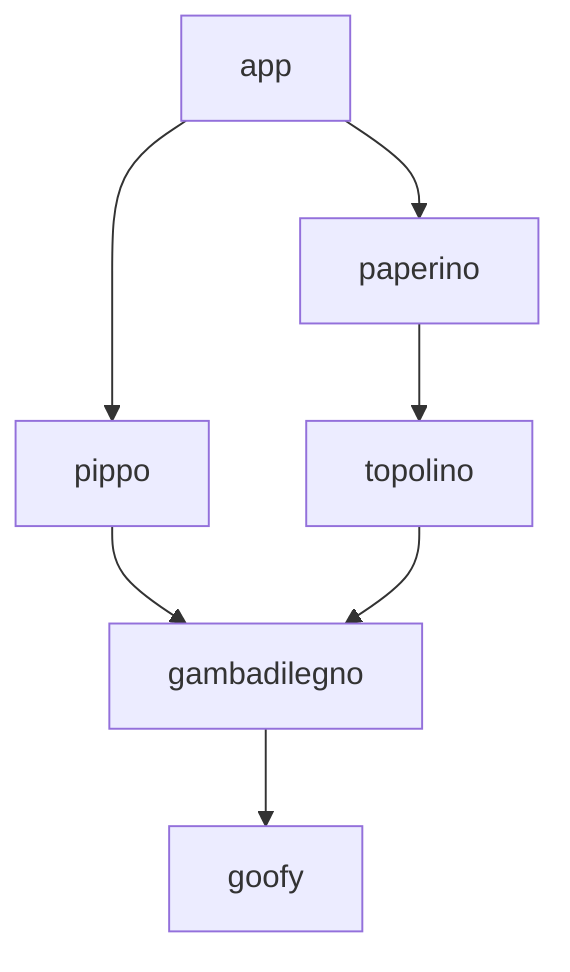

# #2872: fix(compartment-mapper): guarantee stable paths

- **URL:** https://github.com/endojs/endo/pull/2872
- **State:** MERGED
- **Author:** @boneskull
- **Created:** 2025-06-30T21:14:23Z
- **Updated:** 2026-04-06T23:30:15Z
- **Closed:** 2025-07-09T21:02:04Z
- **Merged:** 2025-07-09T21:02:04Z
- **Base:** master
- **Head:** boneskull/shortest-path-fixes
- **Draft:** false
- **Files:** 16 (+1361 −275)
- **Labels:** `bug`, `next-release`

## Summary

- **What:** Replaces `@endo/compartment-mapper`'s real-time shortest-path tracking with a proper graph data structure and edge-weighted Dijkstra-style computation after the filesystem crawl, so `mapNodeModules` returns deterministic, correct `CompartmentDescriptor.path` values; ships a `ProjectFixture`/`makeProjectFixtureReadPowers` test harness and `dumpProjectFixture`/`dumpCompartmentMap` debug helpers.
- **Why:** The depth-first heuristic produced wrong (and async-I/O-dependent) paths on diamond-shaped dependency graphs.
- **Themes:** compartment-mapper, tests
- **Status:** merged

## Description

## Description

Previously, it was trivially possible to generate a dependency tree which caused `mapNodeModules` to return incorrect shortest values of `CompartmentDescriptor.path`. An example such tree (which is used in test fixtures):



In the above tree, there are two paths from `app` to `goofy`; `['app', 'pippo', 'gambadilegno', 'goofy']` and `['app', 'paperino', 'topolino', 'gambadilegno', 'goofy']`. The shortest path from `app` to `goofy` is the former, but `mapNodeModules` would consistently return the latter due to its depth-first nature and real-time calculation of optimal paths. In addition, it was possible for larger dependency trees to be completely non-deterministic due to asynchronous I/O operations.

The current strategy seemed too fragile & error-prone to fix _in situ_, so I tore it out. The result is this change, which fixes `@endo/compartment-mapper` so that `mapNodeModules` will return a `CompartmentMapDescriptor` with **stable** and **correct shortest values** for `path`.

This was done by implementing a graph data structure which maps nodes (packages) via edges (dependee -> dependency) using an edge weighting function based only on the dependency name (which is analogous to order of comparisons done in the `@endo/path-compare` algorithm [I think]).

> The new graph structure used is _not_ the same as the `Graph` type already used in `node-modules.js`; the extant `Graph` type is just a flat `Record` of package locations to data (and is arguably a misnomer).

When the filesystem crawl is complete—and prior to translation into a `CompartmentMapDescriptor`—we calculate the shortest path from the entry to each other member of the graph (excepting the attenuator node, if it exists), and use this information to set the `path` value for the data structure entering `translateGraph`.

#### New Test Harness

This PR includes a test harness in `@endo/compartment-mapper` (credit to @naugtur) which radically simplifies creating a project fixture for testing with `mapNodeModules()`:

1.  Create an object representation of the project fixture:
    ```ts
    import { type ProjectFixture } from './test.types.js';

    const fixture: ProjectFixture = {
      root: 'app',
      graph: {
        app: ['pippo', 'paperino'],
        paperino: ['topolino'],
        pippo: ['gambadilegno'],
        gambadilegno: ['topolino'],
        topolino: ['goofy'],
      },
    };
    ```
2. Create special read powers for the fixture:
    ```ts
    import { makeProjectFixtureReadPowers } from './project-fixture.js';

    const readPowers: MaybeReadPowers = makeProjectFixtureReadPowers(fixture);
    ```
3. Create a `CompartmentMapDescriptor` using a dummy entrypoint w/ `mapNodeModules()`:
    ```ts
    const compartmentMap = await mapNodeModules(readPowers, 
      'file:///node_modules/app/dummy.js');
    ```
   
    > The actual filename in the entrypoint is irrelevant; `mapNodeModules()` only uses this path to find a `package.json`.

4. Make assertions against `compartmentMap`.

#### Debugging Utilities

To aid debugging, I've provided three (3) functions:

- `dumpProjectFixture()`: pretty-print an ASCII tree of a `ProjectFixture` object
    ```ts
    export function dumpProjectFixture<Context = unknown>(logger: {
        log: LogFn;
    } | ExecutionContext<Context>, fixture: ProjectFixture, { root, prefixParts, name }?: {
        root?: string;
        prefixParts?: string[];
        name?: string;
    }): void;
    ```
- `dumpCompartmentMap()`: pretty-print the interesting bits of a `CompartmentMapDescriptor` (includes `path`-to-canonical-name translation, indication of "root" compartment descriptor, proper depth, colors, no special case for `null`-prototype objects)
    ```ts
    export function dumpCompartmentMap<Context = unknown>(logger: {
        log: LogFn;
    } | ExecutionContext<Context>, compartmentMap: CompartmentMapDescriptor): void;
    ```
- `projectFixtureToGenericGraph()`: mostly for testing the new graph implementation, but allows quickly building a graph
    ```ts
      export function projectFixtureToGenericGraph(fixture: ProjectFixture, weightFn?: 
        (node: string) => number): GenericGraph<string>;
    ```

### Security Considerations

n/a

### Scaling Considerations

This potentially has negative performance implications, but the tradeoff is the resulting `CompartmentMapDescriptor` is now deterministic and correct (for some definition of "correct").

### Documentation Considerations

n/a

### Testing Considerations

This adds some unit tests for the new graph data structure, the shortest-path algorithm, and updates existing shortest-path tests to use the "problem" dependency tree shown above.

Manual testing with a large dependency tree (1500+ compartments) shows that the resulting `CompartmentMapDescriptor` is stable and correct (but has not been exhaustively tested).

### Compatibility Considerations

Some spitballs:

- `CompartmentMapDescriptor`s created via `mapNodeModules()` _prior_ to this change should be considered invalid for purposes of reproduction or comparison against the resulting `CompartmentMapDescriptor` now generated by `mapNodeModules()`. This suggests to me that archives _could_ break if they somehow pass thru `mapNodeModules()` again; the resulting `CompartmentMapDescriptor` is likely to be different in all but the most simple cases. _I don't know if this is a use-case_ (I expect it isn't); if it isn't, then this is a non-issue.

- Since the `path` value may change, the _canonical names_ (as used in policy) will also change, and so any static policies generated from the resulting `CompartmentMapDescriptor`s _prior_ to this change will be invalid against the new `CompartmentMapDescriptor`s. I don't know if this is a use-case for anything other than `@lavamoat/node` which I do not care about breaking due to it being alpha software.

### Upgrade Considerations

Given the [compatibility considerations](#compatibility-considerations) above, it may be considered a breaking change. If so, I can change the commit message appropriately. `NEWS.md` should also be updated if so.

_Failing that_, this is just a bugfix and maybe not worth a `NEWS.md` entry _unless_ we can show significant performance degradation.  I do not have a benchmark.


## Commits (2)

- `17912928438b502f64aac92bc4a845eb411a5aba` fix(compartment-mapper): guarantee stable paths
- `060c689673dd2bf8e9c48e58ef33fee4857b57ad` chore(compartment-mapper): tweak comment in generic-graph test

## Reviews (5)

---

### @boneskull — COMMENTED — 2025-07-02T20:22:38Z


---

### @kriskowal — APPROVED — 2025-07-08T22:44:18Z

Thank you. And you’ve anticipated my bar for rigor and style. We are aligned.

I am giving a great deal of credence to the observation that all existing tests continue to pass.

---

### @boneskull — COMMENTED — 2025-07-09T01:09:08Z


---

### @boneskull — COMMENTED — 2025-07-09T20:31:10Z


---

### @gibson042 — COMMENTED — 2026-04-06T23:30:15Z


## Comments (0)

