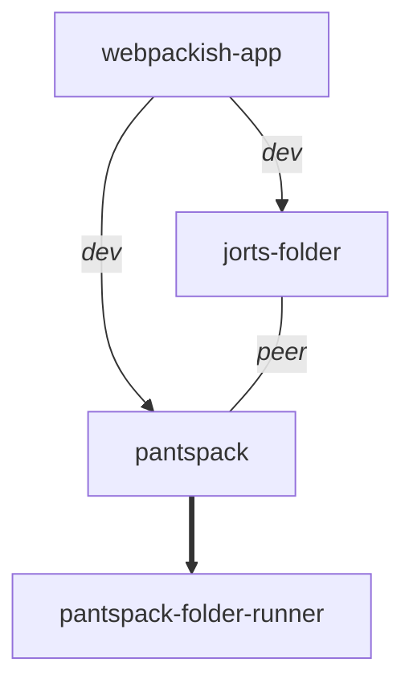

# #2916: mermaid dep graph script improvements

- **URL:** https://github.com/endojs/endo/pull/2916
- **State:** OPEN
- **Author:** @boneskull
- **Created:** 2025-08-01T22:03:34Z
- **Updated:** 2026-04-20T07:56:54Z
- **Closed:** <no value>
- **Merged:** <no value>
- **Base:** master
- **Head:** boneskull/mermaid-script-tweak
- **Draft:** false
- **Files:** 2 (+140 −23)
- **Labels:** `tooling`

## Summary

- **What:** Updates the `mermaid-deptree` tool to encode each dep as production/development/optional/peer/optional-peer via link styling, wraps output in a Markdown fenced code block, adds front-matter theming, and fixes word-wrapping.
- **Themes:** tooling, docs
- **Status:** open

## Description

This updates the `mermaid-deptree` script to include the state of a package as a production, development, optional, peer, or optional-peer dependency via link styling and text.

The output now also:

- wraps the output in a Markdown fenced code block
- includes front-matter config for appropriate styling
- includes a word-wrapping fix

Example output:

Also updates the `README.md` for the `fixtures-dynamic-ancestor` in `@endo/compartment-mapper` with a generated graph.

I guess there's no example of "optional peer" in that example. oops

## Commits (2)

- `49bcca53bdb9af37a8b37194ba626b8e9dc3e591` chore(scripts): mermaid-deptree output includes dependency types
- `ab88e49f35e6e4dffef9462a7f74b4cd1eab8b9d` chore(compartment-mapper): add dependency tree to fixtures-dynamic-an…

## Reviews (1)

---

### @naugtur — APPROVED — 2026-04-20T07:56:54Z

## Comments (0)

