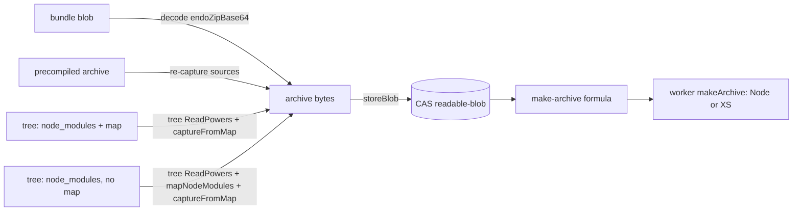

# Agent makers for confined applications

| | |
|---|---|
| **Created** | 2026-09-24 |
| **Author** | Kris Kowal (prompted) |
| **Status** | Proposed |

## What is the Problem Being Solved?

The agent MCP stdio server ([endo-guest-stdio-mcp](endo-guest-stdio-mcp.md),
[PR 1336](https://github.com/endojs/endo-but-for-bots/pull/1336)) projects the
guest facet's methods as MCP tools. In review
([comment](https://github.com/endojs/endo-but-for-bots/pull/1336#discussion_r4098195295)),
the maintainer asked for `evaluate` and also for makers of confined
applications: built from a bundle, an archive, or a virtual filesystem, with or
without `node_modules` in situ, and with or without a pre-generated
`compartment-map.json`.

`evaluate` and `define` are on the guest and are now projected. The makers are
not, because the guest has none. Only `EndoHost` has makers, and they cover part
of the source-by-layout matrix. Tracking issue:
[endojs/endo-but-for-bots#1339](https://github.com/endojs/endo-but-for-bots/issues/1339).

## What exists today

| Source | Layout | Daemon | Compartment-mapper | `@endo/platform` |
|---|---|---|---|---|
| ZIP archive | archive layout, sources | `EndoHost.makeArchive`, `make-archive` formula | `parseArchive` | — |
| ZIP archive or bundle | precompiled formats | none; `makeBundle` removed by [daemon-make-archive](daemon-make-archive.md) | `parseArchive` with precompiled parsers; `@endo/import-bundle` | — |
| Tree or mount | archive layout (`compartment-map.json` at root) | `EndoHost.makeFromTree`, `make-from-tree` formula | `parseArchive` over a synthesized ZIP | `fs/extended/from-mount.js` projects a mount as a `Filesystem` |
| Tree or mount | `node_modules` in situ plus a pre-generated map | none | `loadFromMap`, `importFromMap`, `captureFromMap` | no `ReadPowers` adapter |
| Tree or mount | `node_modules` in situ, no map | none | `mapNodeModules`, `importLocation` | no `ReadPowers` adapter |
| Tree or mount | `package.json` only | designed, not started: `makeFromPackage` ([daemon-worker-import-from-mount](daemon-worker-import-from-mount.md)) | `mapSnapshot` ([snapshot-mapper](snapshot-mapper.md)) | — |

Three things are missing: a compartment-mapper `ReadPowers` over a tree, a
daemon step that turns the unsupported layouts into something the existing
worker methods run, and makers on the guest. The MCP projection follows from
those.

[snapshot-mapper](snapshot-mapper.md) rejects a `node_modules` segment for the
registry lane, where the daemon controls the layout. This design is the other
lane: the tree was laid out by npm, pnpm, Yarn, or a person, and the design
reads that layout as it is.

## Design

### Capture to an archive, then run the archive

Every new input is **captured** into a source-only compartment-mapper archive,
the archive is stored in the CAS as a `readable-blob`, and the existing
`make-archive` formula runs it. No worker method and no formula type is added.

This choice gives three properties:

- **One worker entry point.** The daemon already routes locked (XS) workers'
  `makeFromTree` through archive bytes (`packTreeIntoArchiveBytes`, then the
  worker's `makeArchive`), so archive bytes are the shape every worker kind is
  converging on. A new worker method would need a second XS bridge. The bus XS
  worker's `makeArchive` is still a stub (`bus-worker-xs-facet.js`,
  [worker-rust-xs](worker-rust-xs.md) § Known Gaps); this design adds no new
  XS gap.
- **Reincarnation is deterministic.** The formula names the captured bytes, not
  a tree that can change after the maker returns. `makeFromTree` keeps its live
  tree reference; the new layouts do not need one.
- **The formula record states what ran.** The inspector shows one archive blob
  whatever its source.

Capture runs in the daemon (or a Node helper worker it owns), never in the
target worker, so the confined worker receives only archive bytes.

### The tree `ReadPowers`

A new `makeTreeReadPowers(tree, { root })` in `@endo/platform/fs` turns a
`ReadableTree` or `Mount` into compartment-mapper `ReadPowers`:

- `read(location)` accepts only `file:` URLs under a synthetic root
  (`file:///app/` by default), maps the path segments to `E(tree).lookup(...)`,
  and returns the bytes.
- It rejects `..`, empty, and percent-encoded separator segments before any
  lookup, so a map or a `package.json` cannot name a file outside the tree.
- `maybeRead` returns `undefined` for a missing entry, which `mapNodeModules`
  needs to probe `node_modules` directories.
- `canonical` is the identity. Symlink handling belongs to the `Mount`, which
  already confines links.

`@endo/exo-npm`'s `makeMountReadPowers` serves the registry peer-directory
layout and stays separate; both may later share the segment validator.

### Layout detection

The maker takes an optional `layout`:

| `layout` | Meaning | Pipeline |
|---|---|---|
| `'archive'` | `compartment-map.json` at root, archive paths | existing `makeFromTree` |
| `'node-modules-map'` | `compartment-map.json` whose compartment locations are under the root, modules under `node_modules` | `captureFromMap` |
| `'node-modules'` | `package.json` at root, `node_modules` in situ | `mapNodeModules`, then `captureFromMap` |
| `'package'` | `package.json` only | `makeFromPackage`, when built |

When `layout` is omitted the daemon detects it and records the detected value
in the formula's provenance. A pre-generated map whose locations fall outside
the synthetic root is rejected; the daemon does not relocate it. The
`node-modules` entry is the root `package.json` `exports["."]` or `main`, or an
explicit `entry` option.

### Makers

`EndoHost` gains two methods and `EndoGuest` gains three. Each method returns
the made value and, with `resultName`, stores it.

| Method | Host | Guest | Input |
|---|---|---|---|
| `makeArchive(workerName, archiveName, options?)` | exists | new | archive blob, sources or precompiled |
| `makeFromTree(workerName, treeName, options?)` | extended with `layout`, `entry` | new | tree or mount |
| `makeFromBundle(workerName, bundleName, options?)` | new | new | blob or value holding an `endoZipBase64` bundle |

`makeFromBundle` does not bring back the `make-bundle` formula. It decodes the
bundle, captures it as above, and formulates `make-archive`.

The guest methods are bounded by the guest's authority:

- `workerName` and `powersName` resolve in the guest's own name hub. A guest
  that names `@agent` grants the made application the guest itself, never the
  host.
- The guest options shape omits `workerTrustedShims`, which runs code outside
  the confinement.
- There is no guest `makeUnconfined` or `makeUnconfinedFromTree`.

### MCP projection

`@endo/agent-mcp-stdio` adds `makeArchive`, `makeFromTree`, and
`makeFromBundle` to the static agent interface, using the catalog rules of
[endo-guest-stdio-mcp](endo-guest-stdio-mcp.md) § Static tool catalog. Each
takes `workerName`, the source path, `powersName`, `resultName`, and `env` as
JSON; `makeFromTree` adds `layout` and `entry`.

`resultName` is **required** in the MCP projection. The made value is a
remotable, and a remotable cannot cross the JSON tool boundary (the reason
[#731](https://github.com/endojs/endo-but-for-bots/issues/731) parked JSON tool
wrappers). Without a pet name the agent could not reach what it made. The tool
result is a short text naming the stored value and the detected layout.
Capture errors surface as an `isError` result, and a rejected option
(`workerTrustedShims`) as `-32001 argument-scope`.

## Ownership map

| Boundary | Mechanism | Policy | Durable state | Lifecycle authority | Value crossing |
|---|---|---|---|---|---|
| MCP adapter → guest | adapter validates JSON arguments | catalog declaration | none | guest | pet-name paths, strings |
| Guest → daemon formulation | `prepareMakeCaplet` | guest name hub bounds worker and powers | pet store entry for `resultName` | daemon | formula identifiers |
| Daemon capture → compartment-mapper | `makeTreeReadPowers`, `captureFromMap` | layout detection, root confinement | CAS blob of archive bytes | daemon | archive bytes |
| Daemon → worker | `make-archive` worker method | worker kind | none in the worker | daemon (reincarnation) | archive blob, powers, context |

- **Persistent state**: the daemon owns it (the CAS blob and the formula).
- **Commit or discard**: the daemon; a capture failure formulates nothing.
- **Restart and replay**: the daemon reincarnates `make-archive` from the
  captured blob, never re-reading the tree.
- **Execution classification**: the worker reports the result or throws; it
  learns nothing about the original source shape.

## Phased implementation

1. `makeTreeReadPowers` in `@endo/platform/fs`, with segment-confinement tests.
2. Daemon capture for `node-modules-map` and `node-modules`; `EndoHost.makeFromTree`
   gains `layout` and `entry`.
3. `EndoHost.makeFromBundle` and precompiled-archive capture.
4. Guest makers.
5. MCP tools in `@endo/agent-mcp-stdio`.

## Test plan

- A `node_modules` tree laid out by npm, one by pnpm (symlinked store), and one
  by Yarn run to the same result on a Node worker and an XS worker.
- A map or `package.json` naming `../outside` fails before any lookup.
- A guest-made application given `@agent` holds the guest, not the host.
- A guest call with `workerTrustedShims` is refused.
- Changing the tree after `makeFromTree` (new layouts) does not change the
  reincarnated application.
- The MCP tools refuse a call without `resultName`.

## Dependencies

| Design | Relationship |
|---|---|
| [endo-guest-stdio-mcp](endo-guest-stdio-mcp.md) | projects these makers |
| [daemon-make-archive](daemon-make-archive.md) | provides `make-archive` and `makeFromTree` |
| [daemon-worker-import-from-mount](daemon-worker-import-from-mount.md) | owns the `package` layout |
| [snapshot-mapper](snapshot-mapper.md) | registry lane; this is the in-situ lane |

## Design Decisions

1. Capture into an archive, not new worker methods, so every worker kind runs
   the result and reincarnation reads fixed bytes.
2. Considered and rejected: restoring the `make-bundle` formula. Reason: a
   bundle is an archive in base64, and the removal rationale in
   [daemon-make-archive](daemon-make-archive.md) still holds.
3. Considered and rejected: relocating a pre-generated map whose locations are
   outside the root. Reason: silent relocation hides which files ran.

## Open Questions

1. Should the pnpm symlinked store be read through the `Mount`'s link
   confinement, or should `node-modules` require a hoisted (`node-linker=hoisted`)
   layout?
2. Should a precompiled archive or bundle be re-captured to sources, or should
   `make-archive` accept precompiled formats directly? Re-capture needs original
   sources, which an `endoZipBase64` bundle does not always carry.
3. Should `makeFromTree` with a new layout keep a live tree reference, as the
   archive layout does today, instead of capturing?
4. Should the guest makers exist at all, or should the MCP server require a
   host-granted maker capability the guest holds by name?
