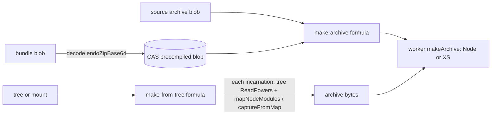

# Agent makers for confined applications

| | |
|---|---|
| **Created** | 2026-09-24 |
| **Author** | Kris Kowal (prompted) |
| **Status** | Proposed |

## What is the problem being solved?

The agent MCP stdio server ([endo-guest-stdio-mcp](endo-guest-stdio-mcp.md),
[PR 1336](https://github.com/endojs/endo-but-for-bots/pull/1336)) projects the
guest facet's methods as MCP tools. In review
([comment](https://github.com/endojs/endo-but-for-bots/pull/1336#discussion_r4098195295)),
the maintainer asked for `evaluate` and also for makers of confined
applications: built from a bundle, an archive, or a virtual filesystem, with or
without `node_modules` in situ, and with or without a pre-generated
`compartment-map.json`.

Some vocabulary, used throughout. A daemon user acts through an **agent**. The
**host** (`EndoHost`) is the user's own agent and holds the user's full
authority; a **guest** (`EndoGuest`) is an agent the host makes for a party it
does not fully trust, such as an LLM, with only the capabilities the host
grants it. A **facet** is one object presenting one view of an agent; the MCP
server holds the guest facet. Each agent resolves pet names in its own **name
hub**, the namespace of names it has been given. The daemon persists every
value it makes as a **formula**, a durable record of how to make the value;
an **incarnation** is one run of that recipe, at first use and again after
every daemon restart (a reincarnation). A **confined** application runs in a
worker under SES with no ambient authority: no filesystem, network, or
process access except through the capabilities passed to it as `powers`.
*Makers* are the agent methods that formulate such an application from code.

`evaluate` and `define` are on the guest and are now projected. The makers are
not, because the guest has none. Only `EndoHost` has makers, and they cover part
of the source-by-layout matrix (the table in the next section). Tracking issue:
[endojs/endo-but-for-bots#1339](https://github.com/endojs/endo-but-for-bots/issues/1339).

## What exists today

Each row names one source shape and layout, and what each layer offers for it.
A dash means the layer has no part in that shape; "none" means the shape is
unsupported today. *Capture* (a compartment-mapper term) means reading a
module graph from its sources and writing it out as archive bytes.

| Source | Layout | Daemon | Compartment-mapper | `@endo/platform` |
|---|---|---|---|---|
| ZIP archive | archive layout, sources | `EndoHost.makeArchive`, `make-archive` formula | `parseArchive` | — |
| ZIP archive or bundle | precompiled formats | none; `makeBundle` removed by [daemon-make-archive](daemon-make-archive.md) | `parseArchive` with precompiled parsers; `@endo/import-bundle` | — |
| Tree or mount | archive layout (`compartment-map.json` at root) | `EndoHost.makeFromTree`, `make-from-tree` formula | `parseArchive` over a synthesized ZIP | `fs/extended/from-mount.js` projects a mount as a `Filesystem` |
| Tree or mount | `node_modules` in situ plus a pre-generated map | none | `loadFromMap`, `importFromMap`, `captureFromMap` | no `ReadPowers` adapter |
| Tree or mount | `node_modules` in situ, no map | none | `mapNodeModules`, `importLocation` | no `ReadPowers` adapter |
| Tree or mount | `package.json` only | designed, not started: `makeFromPackage` ([daemon-worker-import-from-mount](daemon-worker-import-from-mount.md)) | `mapSnapshot` ([snapshot-mapper](snapshot-mapper.md)) | — |

The host also has `makeUnconfinedFromTree`, which stages a tree onto real disk
with `stageTree` (`../packages/daemon/src/host.js`) and runs the unconfined Node
loader there. This design does not reuse that path for confined makers: the
staged copy is a scratch directory the confined worker would read through
ambient filesystem powers, a guest has no `stageTree`, and an XS worker has no
filesystem to read. Capture reads the tree through the tree's own capability
instead, so only archive bytes reach the worker.

Three things are missing: a compartment-mapper `ReadPowers` over a tree, a
daemon step that turns the unsupported layouts into something the existing
worker methods run, and makers on the guest. The MCP projection follows from
those.

[snapshot-mapper](snapshot-mapper.md) rejects a `node_modules` segment where
the daemon itself lays out packages fetched from a registry. This design covers
trees laid out by npm, pnpm, Yarn, or a person, and reads each layout as it
is.

## Design

### Capture to an archive, then run the archive

Every source shape this design adds reaches the worker as compartment-mapper
archive bytes, and the worker's existing `makeArchive` method runs them. No
worker method is added. The existing `'archive'` layout is unchanged and out
of scope: a Node worker still receives that tree whole and packs it inside its
own `makeFromTree` method, while a locked (XS) worker already receives packed
archive bytes. Moving the Node worker's archive layout onto daemon-side capture
would retire that second path; it is a follow-up, not part of this design.

- An **archive** carries original sources and a `compartment-map.json`, never
  precompiled sources. `makeArchive` refuses an archive whose compartment map
  names a precompiled parser.
- A **bundle** keeps carrying precompiled sources. `makeFromBundle` decodes the
  `endoZipBase64` payload, stores the decoded bytes in the daemon's
  content-addressed store (CAS) as a `readable-blob`, and formulates a new
  `make-archive` formula record with the precompiled parsers enabled. It does not re-capture to sources, because a bundle does not carry
  them.
- A **tree or mount** is formulated as `make-from-tree`, which keeps a live
  reference to the tree. At each incarnation the daemon captures the tree into
  archive bytes (below) and passes them to the worker's `makeArchive` method.
  That call is transient: an incarnation of `make-from-tree` writes no new
  formula record and stores no archive blob.

```mermaid
flowchart LR
  A[source archive blob] --> MA[make-archive formula]
  B[bundle blob] -->|decode endoZipBase64| PB[(CAS precompiled blob)]
  PB --> MA
  T[tree or mount] --> MT[make-from-tree formula]
  MT -->|each incarnation: tree ReadPowers + mapNodeModules / captureFromMap| AB[archive bytes]
  MA --> W[worker makeArchive: Node or XS]
  AB --> W
```

All options stay reachable, but the design moves away from precompiled
artifacts. They remain only where no other system is practical, such as a web
page, where running sources would require the runtime to carry the Babel
transformations. A worker whose module system is native and has no precompiled
support, such as endor's (the Rust worker host of
[worker-rust-xs](worker-rust-xs.md)), refuses a `make-archive` formula with precompiled
parsers enabled. A bundle is therefore of limited use on endor.

This choice gives three properties:

- **One worker entry point for the new layouts.** The daemon already routes
  locked (XS) workers' `makeFromTree` through archive bytes
  (`packTreeIntoArchiveBytes`, then the worker's `makeArchive`), and the new
  layouts follow that route on every worker kind. A new worker method would need a second XS bridge. The bus XS
  worker's `makeArchive` is still a stub (`bus-worker-xs-facet.js`,
  [worker-rust-xs](worker-rust-xs.md) § Known Gaps). The capture itself runs
  in the daemon, though, and adds one XS gap on the supervisor side (Design
  decision 7): an XS daemon supervisor refuses the `node_modules` layouts
  until a later phase lets it capture them.
- **The tree stays live.** Every layout of `makeFromTree` keeps a live tree
  reference, as the archive layout does today, so reincarnation reads the tree
  as it is then. A caller who wants a fixed application passes a snapshot (an
  immutable tree) instead of a mutable mount. A live mutable tree is a minor
  foot-gun that the rest of the world already accepts.
- **The formula records which kind of tree it holds.** `make-from-tree` stores
  whether its tree is a snapshot (replays the same bytes) or a mount (re-reads
  its place), and the inspector and the maker's result text show it, so the
  caller does not have to remember which object it passed.
- **The formula record states what ran.** The inspector shows the archive blob,
  the bundle blob, or the tree reference with its requested layout and the
  layout the current incarnation ran as (§ Layout detection).

Capture runs in the daemon (or a Node helper worker it owns), never in the
target worker, so the confined worker receives only archive bytes.

Capture from a mount is not atomic. A mount written to during capture (for
example, mid `npm install`) can yield a torn archive: some files from before a
change and some from after. The daemon does not detect this; it is the same
hazard as running Node over a directory being installed into. The resulting
archive is internally fixed for that incarnation, and a module the map names
but the capture cannot read fails the capture, so no incarnation runs a map
whose files are missing. A caller who needs a consistent capture snapshots
the mount first and passes the snapshot.

### The tree `ReadPowers`

A new `makeTreeReadPowers(tree, { root })` in `@endo/platform/fs` turns a
`ReadableTree` or `Mount` into compartment-mapper `ReadPowers`:

- `read(location)` accepts only `file:` URLs under a synthetic root
  (`file:///app/` by default), maps the path segments to `E(tree).lookup(...)`,
  and returns the bytes.
- It rejects `..`, empty, and percent-encoded separator segments before any
  lookup, so a map or a `package.json` cannot name a file outside the tree.
- `maybeRead` returns `undefined` for a missing entry, which `mapNodeModules`
  needs to probe `node_modules` directories.
- `canonical` collapses every path that reaches one package directory to a
  single location, as the stock Node `canonical` does with `realpath`.
  `mapNodeModules` relies on this to build one compartment for a package
  reached through more than one `node_modules` path; without it, such a
  package would load twice and break identity-sensitive code (`instanceof`,
  module-level singletons). `makeTreeReadPowers` takes an optional
  `canonical(segments)` hook and defaults to the identity. The public
  `EndoMount` exo (`MountInterface`) exposes no physical path, and this design
  does not add one: the mount's physical-path accessors (`getMountBacking`,
  `getEntryPhysicalPath` in `../packages/daemon/src/mount.js`) are host-private.
  Capture runs inside the daemon, so the daemon supplies the hook for a mount
  it backs: it resolves the directory's physical path with
  `getEntryPhysicalPath`, which applies the mount's root-confinement `realPath`
  check, and maps the result back under the synthetic root. That wiring is new
  daemon work in Phase 2. A snapshot tree stores files and directories but no
  links, so each package has one path and the identity is correct.

A tree read from a mount must keep every package directory physically under
the mount root. The reason is links that resolve outside it: the mount refuses
any path whose physical form is outside its root, so `mapNodeModules` would see
such a package as missing. Two pnpm mechanisms produce those links, and they
need separate remedies.

- **Store-resolved dependencies.** pnpm's default isolated layout keeps its
  virtual store under `node_modules/.pnpm` and links each `node_modules/<pkg>`
  to a path inside it; those links stay in the root, and the mount follows
  them. pnpm's global virtual store instead links to a directory outside the
  project. `node-linker=hoisted` places each store-resolved package as a real
  directory under the root, which avoids both.
- **Workspace dependencies** (`workspace:` and `link:`). pnpm links these to
  the sibling package's directory under every `node-linker` setting, including
  `hoisted`; only injected dependencies (`inject-workspace-packages=true`, or
  `dependenciesMeta.<pkg>.injected`) copy them into `node_modules`. A workspace
  link stays in the root when the mount's root is the workspace root, and
  escapes it when the mount's root is one member package. The caller either
  mounts the workspace root or injects workspace dependencies.

Detection reports a link that resolves outside the root as an unsupported
layout rather than a missing dependency. A later filesystem mount attenuation
that keeps the full POSIX namespace but shows only chosen roots, with a
controller facet that adds and removes roots, would let a store or workspace
outside the root run confined; it is out of scope here.

`@endo/exo-npm`'s `makeMountReadPowers` serves the registry peer-directory
layout and stays separate; both may later share the segment validator.

### Layout detection

The maker takes an optional `layout`:

| `layout` | Meaning | Pipeline |
|---|---|---|
| `'archive'` | `compartment-map.json` at root, archive paths (a tree laid out like an archive, not an archive blob; `makeArchive` takes the blob) | existing `makeFromTree` |
| `'node-modules-with-map'` | `compartment-map.json` whose compartment locations are under the root, modules under `node_modules` | `captureFromMap` |
| `'node-modules-scan'` | `package.json` at root, `node_modules` in situ, no map | `mapNodeModules`, then `captureFromMap` |
| `'package'` | `package.json` only | `makeFromPackage`, when built |

The formula records only the **requested** layout: the caller's `layout`
value, or `'detect'` when it is omitted. That field is fixed at formulation.
The **detected** layout is a live fact, not formula state: each incarnation
detects it before capturing, and the inspector and the maker's result text
report it as "running as `<layout>`" for the current incarnation, alongside
the fixed requested value. With `'detect'`, a tree whose layout has changed
runs under the new layout. A caller who passes `layout` fixes it, and an
incarnation whose tree no longer matches that layout fails the capture. A tree that matches
no layout (no `compartment-map.json` and no `package.json` at the root) is
rejected with an error naming the layouts it looked for, and nothing is
formulated; an unsupported layout, such as a link out of the root, is rejected
the same way with a message naming the cause. A pre-generated map whose
locations fall outside the synthetic root is rejected; the daemon does not
relocate it.

The `node-modules-scan` entry is the root package's own `"."` export, resolved
by `mapNodeModules` exactly as compartment-mapper resolves any package's
exports: `exports["."]` may be a string or a conditions object, and the
conditions are the ones `mapNodeModules` always adds (`import`, `default`, and
`endo`). A package with no `exports` falls back to `main`. An explicit `entry`
option names a module path within the root package instead and bypasses
`exports`.

### Makers

`EndoHost` gains two methods and `EndoGuest` gains three. Each method returns
the made value and, with `resultName`, stores it.

| Method | Host | Guest | Input |
|---|---|---|---|
| `makeArchive(workerPetName, archiveName, options?)` | exists | new | archive blob, sources and compartment map only |
| `makeFromTree(workerPetName, treeName, options?)` | extended with `layout`, `entry` | new | tree or mount |
| `makeFromBundle(workerPetName, bundleName, options?)` | new | new | blob or value holding an `endoZipBase64` bundle, precompiled |

The parameter keeps the existing `workerPetName` spelling of `EndoHost`
(`../packages/daemon/src/types.d.ts`). The guest and MCP `makeArchive` likewise
keep the host's name rather than a `makeFromArchive` spelling, so one
operation has one name on every facet; its doc comment and tool description
say that it runs an archive rather than producing one.

`makeFromBundle` does not bring back the `make-bundle` formula. It decodes the
bundle, stores the precompiled bytes, and formulates `make-archive` with the
precompiled parsers enabled.

The guest methods are bounded by the guest's authority:

- `workerPetName` and `powersName` resolve in the guest's own name hub. The
  host's `prepareMakeCaplet` is a closure inside the host maker, not reachable
  from the guest; Phase 4 factors its worker and powers resolution into a
  helper that each agent calls with its own name hub, so the guest gains an
  equivalent without reaching the host's. A guest
  that names `@agent` grants the made application the guest itself, never the
  host.
- The guest options shape omits `workerTrustedShims`, which runs code outside
  the confinement.
- There is no guest `makeUnconfined` or `makeUnconfinedFromTree`.
- A made application is bound to the guest's metering by default. It runs under
  other metering only when the guest endows it with another agent's
  capability, local or remote.

### MCP projection

`@endo/agent-mcp-stdio` adds `makeArchive`, `makeFromTree`, and
`makeFromBundle` to the static agent interface, using the catalog rules of
[endo-guest-stdio-mcp](endo-guest-stdio-mcp.md) § Static tool catalog. Each
takes `workerPetName`, the source path, `powersName`, `resultName`, and `env` as
JSON; `makeFromTree` adds `layout` and `entry`.

`resultName` is **required** in the MCP projection. The made value is a
remotable, and a remotable cannot cross the JSON tool boundary (the reason
[#731](https://github.com/endojs/endo-but-for-bots/issues/731) parked JSON tool
wrappers). Without a pet name the agent could not reach what it made. The
native methods keep `resultName` optional, and their doc comments in
`types.d.ts` note that the MCP projection requires it. The tool
result is a short text naming the stored value and the detected layout.
Capture errors surface as an `isError` result, and a rejected option
(`workerTrustedShims`) as `-32001 argument-scope`.

## Ownership map

| Boundary | Mechanism | Policy | Durable state | Lifecycle authority | Value crossing |
|---|---|---|---|---|---|
| MCP adapter -> guest | adapter validates JSON arguments | catalog declaration | none | guest | pet-name paths, strings |
| Guest -> daemon formulation | the shared caplet-preparation helper (Phase 4) | guest name hub bounds worker and powers | pet store entry for `resultName` | daemon | formula identifiers |
| Daemon capture -> compartment-mapper | `makeTreeReadPowers`, `captureFromMap` | layout detection, root confinement, in-root package directories | CAS blob for an archive or bundle; the formula's tree reference for a tree | daemon | archive bytes |
| Daemon -> worker | `make-archive` worker method | worker kind | none in the worker | daemon (reincarnation) | archive blob, powers, context |

- **Persistent state**: the daemon owns it (the CAS blob and the formula).
- **Commit or discard**: the daemon; a capture failure formulates nothing.
- **Restart and replay**: the daemon reincarnates `make-archive` from its blob,
  and `make-from-tree` by capturing the live tree again. A snapshot tree
  replays the same bytes; a mutable mount replays its current contents.
- **Execution classification**: the worker reports the result or throws; it
  learns nothing about the original source shape.

## Phased implementation

1. `makeTreeReadPowers` in `@endo/platform/fs`, with segment-confinement tests.
2. Daemon capture for `node-modules-with-map` and `node-modules-scan`,
   including the daemon's `canonical` hook for mounts; `EndoHost.makeFromTree`
   gains `layout` and `entry`. The capture runs on a Node daemon supervisor
   only; an XS supervisor refuses the `node_modules` layouts with a diagnosis
   and keeps running the `'archive'` layout (Design decision 7).
   Phase 2 is done when the § Test plan's Node-versus-XS worker evidence lands
   under a Node supervisor.
   - Phase 2b: `node_modules` capture under an XS daemon supervisor, which
     closes the gap Phase 2 leaves open.
3. `EndoHost.makeFromBundle`, and `makeArchive`'s refusal of precompiled archives.
4. A caplet-preparation helper factored out of the host's `prepareMakeCaplet`;
   `EndoGuest.makeArchive`, `makeFromTree`, and `makeFromBundle` on it, bounded
   by the guest's name hub and options shape.
5. MCP tools for the three guest makers in `@endo/agent-mcp-stdio`, with
   `resultName` required.

## Test plan

- A `node_modules` tree laid out by npm, one by pnpm with
  `node-linker=hoisted`, one by Yarn with `nodeLinker: node-modules`, and one
  by Yarn with `nodeLinker: pnpm` (this repository's own linker, whose links
  point into the in-root `node_modules/.store`) run to the same result on a
  Node worker and an XS worker. A Yarn Plug'n'Play tree (no `node_modules`)
  is rejected with the no-layout error.
- A valid pre-generated map under `node_modules` (`node-modules-with-map`)
  captures through `captureFromMap` and runs on a Node worker and an XS
  worker.
- A package reached through two `node_modules` paths in a mount (an in-root
  link) loads as one compartment.
- A root `package.json` whose `exports["."]` is a conditions object resolves
  its entry; a tree with neither `compartment-map.json` nor `package.json` is
  rejected with the no-layout error.
- A map or `package.json` naming `../outside` fails before any lookup.
- A guest-made application given `@agent` holds the guest, not the host.
- A guest call with `workerTrustedShims` is refused.
- Changing a mutable mount after `makeFromTree` changes the reincarnated
  application; a snapshot tree reincarnates the same application. A formula
  made with `layout` omitted keeps `'detect'` as its requested layout while the
  inspector reports the layout each incarnation ran as.
- A pnpm workspace link that resolves outside the mount root is reported as an
  unsupported layout under both the isolated and the hoisted linker; the same
  workspace mounted at its root, or with injected workspace dependencies, runs.
- `makeArchive` refuses an archive whose compartment map names a precompiled
  parser; `makeFromBundle` runs a precompiled bundle on a Node worker.
- The MCP tools refuse a call without `resultName`.

## Dependencies

| Design | Relationship |
|---|---|
| [endo-guest-stdio-mcp](endo-guest-stdio-mcp.md) | projects these makers |
| [daemon-make-archive](daemon-make-archive.md) | provides `make-archive` and `makeFromTree` |
| [daemon-worker-import-from-mount](daemon-worker-import-from-mount.md) | owns the `package` layout |
| [snapshot-mapper](snapshot-mapper.md) | daemon-laid-out registry packages; this design reads trees as laid out |

## Design decisions

1. Capture into an archive, not new worker methods, so every worker kind runs
   the result. An archive or bundle replays fixed bytes; a tree replays
   whatever its capture reads (Decision 5).
2. Considered and rejected: restoring the `make-bundle` formula. Reason: a
   bundle is an archive in base64, and the removal rationale in
   [daemon-make-archive](daemon-make-archive.md) still holds.
3. Considered and rejected: relocating a pre-generated map whose locations are
   outside the root. Reason: silent relocation hides which files ran.
4. A tree read from a mount must keep every package directory under the mount
   root, which the mount enforces. pnpm's global virtual store resolves
   outside the root, so store-resolved dependencies need
   `node-linker=hoisted`; the in-root `.pnpm` virtual store is acceptable on
   its own. Workspace links stay symlinks under every linker, so a workspace
   is mounted at its root or uses injected dependencies. Packages reached
   through in-root links still load once, because `canonical` collapses them. A filesystem
   mount attenuation that shows chosen roots of the full POSIX namespace, with
   a controller facet to add and remove roots, is tracked as a separate design.
5. Considered and rejected: capturing a tree once at formulation and storing
   the archive. Reason: every `makeFromTree` layout keeps a live tree
   reference, as the archive layout does today; a caller who wants fixed bytes
   passes a snapshot.
6. The guest makers exist. A guest's made applications share its metering by
   default. Whether guests make guests is out of scope here. Guests can
   already invite other parties and accept invitations as themselves
   (`EndoGuest.invite`, `EndoGuest.accept`), and guest-made guests belong to
   that line of work.
7. The `node_modules` layouts run on a Node daemon supervisor only, until
   Phase 2b. Capture needs `@endo/compartment-mapper`, which the XS daemon
   bundle (`scripts/bundle-bus-daemon-rust-xs.mjs`) excludes. The daemon
   therefore receives `captureNodeModulesArchive` as a host tool power, like
   `git` and the shell, and an XS supervisor, which has no such power, refuses
   those layouts with a diagnosis (`host-tool-powers.js`). The worker kind is
   independent of this: a Node supervisor captures for Node and XS workers
   alike. Closing the gap needs either a compartment-mapper capture path that
   the XS bundle can carry or a capture service the XS supervisor can call.
