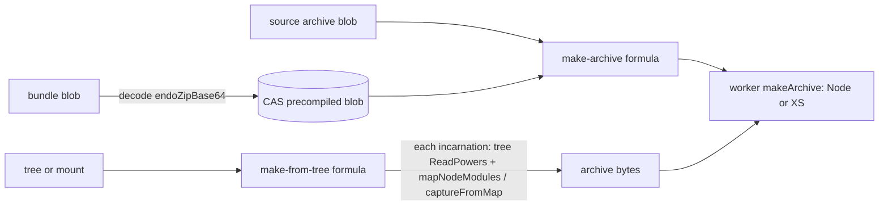

# Agent makers for confined applications

| | |
|---|---|
| **Created** | 2026-09-24 |
| **Author** | Kris Kowal (prompted) |
| **Status** | Proposed |

## What is the problem being solved?

The agent MCP stdio server ([endo-guest-stdio-mcp](endo-guest-stdio-mcp.md),
[PR 1336](https://github.com/endojs/endo-but-for-bots/pull/1336)) projects the
guest facet's methods as MCP tools. In review
([comment](https://github.com/endojs/endo-but-for-bots/pull/1336#discussion_r4098195295)),
the maintainer asked for `evaluate` and also for makers of confined
applications: built from a bundle, an archive, or a virtual filesystem, with or
without `node_modules` in situ, and with or without a pre-generated
`compartment-map.json`.

`evaluate` and `define` are on the guest and are now projected. The makers are
not, because the guest has none. Only `EndoHost` has makers, and they cover part
of the source-by-layout matrix. Tracking issue:
[endojs/endo-but-for-bots#1339](https://github.com/endojs/endo-but-for-bots/issues/1339).

## What exists today

Each row names one source shape and layout, and what each layer offers for it.
A dash means the layer has no part in that shape; "none" means the shape is
unsupported today. *Capture* (a compartment-mapper term) means reading a
module graph from its sources and writing it out as archive bytes.

| Source | Layout | Daemon | Compartment-mapper | `@endo/platform` |
|---|---|---|---|---|
| ZIP archive | archive layout, sources | `EndoHost.makeArchive`, `make-archive` formula | `parseArchive` | — |
| ZIP archive or bundle | precompiled formats | none; `makeBundle` removed by [daemon-make-archive](daemon-make-archive.md) | `parseArchive` with precompiled parsers; `@endo/import-bundle` | — |
| Tree or mount | archive layout (`compartment-map.json` at root) | `EndoHost.makeFromTree`, `make-from-tree` formula | `parseArchive` over a synthesized ZIP | `fs/extended/from-mount.js` projects a mount as a `Filesystem` |
| Tree or mount | `node_modules` in situ plus a pre-generated map | none | `loadFromMap`, `importFromMap`, `captureFromMap` | no `ReadPowers` adapter |
| Tree or mount | `node_modules` in situ, no map | none | `mapNodeModules`, `importLocation` | no `ReadPowers` adapter |
| Tree or mount | `package.json` only | designed, not started: `makeFromPackage` ([daemon-worker-import-from-mount](daemon-worker-import-from-mount.md)) | `mapSnapshot` ([snapshot-mapper](snapshot-mapper.md)) | — |

The host also has `makeUnconfinedFromTree`, which stages a tree onto real disk
with `stageTree` (`packages/daemon/src/host.js`) and runs the unconfined Node
loader there. This design does not reuse that path for confined makers: the
staged copy is a scratch directory the confined worker would read through
ambient filesystem powers, a guest has no `stageTree`, and an XS worker has no
filesystem to read. Capture reads the tree through the tree's own capability
instead, so only archive bytes reach the worker.

Three things are missing: a compartment-mapper `ReadPowers` over a tree, a
daemon step that turns the unsupported layouts into something the existing
worker methods run, and makers on the guest. The MCP projection follows from
those.

[snapshot-mapper](snapshot-mapper.md) rejects a `node_modules` segment where
the daemon itself lays out packages fetched from a registry. This design covers
trees the daemon did not lay out: npm, pnpm, Yarn, or a person did, and the
design reads that layout as it is.

## Design

### Capture to an archive, then run the archive

Every source shape reaches the worker as compartment-mapper archive bytes, and
the worker's existing `makeArchive` method runs them. No worker method is
added.

- An **archive** carries original sources and a `compartment-map.json`, never
  precompiled sources. `makeArchive` refuses an archive whose compartment map
  names a precompiled parser.
- A **bundle** keeps carrying precompiled sources. `makeFromBundle` decodes the
  `endoZipBase64` payload, stores the decoded bytes in the daemon's
  content-addressed store (CAS) as a `readable-blob`, and formulates a new
  `make-archive` formula record with the precompiled parsers enabled. It does not re-capture to sources, because a bundle does not carry
  them.
- A **tree or mount** is formulated as `make-from-tree`, which keeps a live
  reference to the tree. At each incarnation the daemon captures the tree into
  archive bytes (below) and passes them to the worker's `makeArchive` method.
  That call is transient: an incarnation of `make-from-tree` writes no new
  formula record and stores no archive blob.

```mermaid
flowchart LR
  A[source archive blob] --> MA[make-archive formula]
  B[bundle blob] -->|decode endoZipBase64| PB[(CAS precompiled blob)]
  PB --> MA
  T[tree or mount] --> MT[make-from-tree formula]
  MT -->|each incarnation: tree ReadPowers + mapNodeModules / captureFromMap| AB[archive bytes]
  MA --> W[worker makeArchive: Node or XS]
  AB --> W
```

All options stay reachable, but the design moves away from precompiled
artifacts. They remain only where no other system is practical, such as a web
page, where running sources would require the runtime to carry the Babel
transformations. A worker whose module system is native and has no precompiled
support, such as endor's (the Rust worker host of
[worker-rust-xs](worker-rust-xs.md)), refuses a `make-archive` formula with precompiled
parsers enabled. A bundle is therefore of limited use on endor.

This choice gives three properties:

- **One worker entry point.** The daemon already routes locked (XS) workers'
  `makeFromTree` through archive bytes (`packTreeIntoArchiveBytes`, then the
  worker's `makeArchive`), so archive bytes are the shape every worker kind is
  converging on. A new worker method would need a second XS bridge. The bus XS
  worker's `makeArchive` is still a stub (`bus-worker-xs-facet.js`,
  [worker-rust-xs](worker-rust-xs.md) § Known Gaps); this design adds no new
  XS gap.
- **The tree stays live.** Every layout of `makeFromTree` keeps a live tree
  reference, as the archive layout does today, so reincarnation reads the tree
  as it is then. A caller who wants a fixed application passes a snapshot (an
  immutable tree) instead of a mutable mount. A live mutable tree is a minor
  foot-gun that the rest of the world already accepts.
- **The formula records which kind of tree it holds.** `make-from-tree` stores
  whether its tree is a snapshot (replays the same bytes) or a mount (re-reads
  its place), and the inspector and the maker's result text show it, so the
  caller does not have to remember which object it passed.
- **The formula record states what ran.** The inspector shows the archive blob,
  the bundle blob, or the tree reference with its layout.

Capture runs in the daemon (or a Node helper worker it owns), never in the
target worker, so the confined worker receives only archive bytes.

Capture from a mount is not atomic. A mount written to during capture (for
example, mid `npm install`) can yield a torn archive: some files from before a
change and some from after. The daemon does not detect this; it is the same
hazard as running Node over a directory being installed into. The resulting
archive is internally fixed for that incarnation, and a module the map names
but the capture cannot read fails the capture, so no incarnation runs a map
whose files are missing. A caller who needs a consistent capture snapshots
the mount first and passes the snapshot.

### The tree `ReadPowers`

A new `makeTreeReadPowers(tree, { root })` in `@endo/platform/fs` turns a
`ReadableTree` or `Mount` into compartment-mapper `ReadPowers`:

- `read(location)` accepts only `file:` URLs under a synthetic root
  (`file:///app/` by default), maps the path segments to `E(tree).lookup(...)`,
  and returns the bytes.
- It rejects `..`, empty, and percent-encoded separator segments before any
  lookup, so a map or a `package.json` cannot name a file outside the tree.
- `maybeRead` returns `undefined` for a missing entry, which `mapNodeModules`
  needs to probe `node_modules` directories.
- `canonical` collapses every path that reaches one package directory to a
  single location, as the stock Node `canonical` does with `realpath`.
  `mapNodeModules` relies on this to build one compartment for a package
  reached through more than one `node_modules` path; without it, such a
  package would load twice and break identity-sensitive code (`instanceof`,
  module-level singletons). For a `Mount`, `canonical` asks the daemon for the
  directory's physical path, confined to the mount root (the same `realPath`
  check the mount already applies to every access), and maps it back under the
  synthetic root. A snapshot tree stores files and directories but no links,
  so each package has one path and `canonical` is the identity.

A tree read from a mount must use a **hoisted** `node_modules` layout (for
pnpm, `node-linker=hoisted`). The reason is links that resolve outside the
mount root. pnpm's default isolated layout keeps its virtual store under
`node_modules/.pnpm` and links each `node_modules/<pkg>` to a path inside it;
those links stay in the root, and the mount follows them. But workspace
packages (`workspace:` and `link:` dependencies) link to sibling directories
of the package, and pnpm's global virtual store links to a directory outside
the project. The mount refuses any path whose physical form is outside its
root, so `mapNodeModules` would see those packages as missing. A hoisted
layout places each package as a real directory under the root, which the
mount reads without following any link out. Detection reports a link that
resolves outside the root as an unsupported layout rather than a missing
dependency. A later filesystem mount attenuation that keeps the full
POSIX namespace but shows only chosen roots, with a controller facet that adds
and removes roots, would let a symlinked store run confined; it is out of scope
here.

`@endo/exo-npm`'s `makeMountReadPowers` serves the registry peer-directory
layout and stays separate; both may later share the segment validator.

### Layout detection

The maker takes an optional `layout`:

| `layout` | Meaning | Pipeline |
|---|---|---|
| `'archive'` | `compartment-map.json` at root, archive paths | existing `makeFromTree` |
| `'node-modules-with-map'` | `compartment-map.json` whose compartment locations are under the root, modules under `node_modules` | `captureFromMap` |
| `'node-modules-scan'` | `package.json` at root, `node_modules` in situ, no map | `mapNodeModules`, then `captureFromMap` |
| `'package'` | `package.json` only | `makeFromPackage`, when built |

When `layout` is omitted the daemon detects it and records the detected value
in the formula's provenance. A tree that matches no layout (no
`compartment-map.json` and no `package.json` at the root) is rejected with an
error naming the layouts it looked for, and nothing is formulated; an
unsupported layout, such as a link out of the root, is rejected the same way
with a message naming the cause. A pre-generated map whose locations fall
outside the synthetic root is rejected; the daemon does not relocate it.

The `node-modules-scan` entry is the root package's own `"."` export, resolved
by `mapNodeModules` exactly as compartment-mapper resolves any package's
exports: `exports["."]` may be a string or a conditions object, and the
conditions are compartment-mapper's defaults (`import`, `default`). A package with no `exports` falls back to
`main`. An explicit `entry` option names a module path within the root
package instead and bypasses `exports`.

### Makers

`EndoHost` gains two methods and `EndoGuest` gains three. Each method returns
the made value and, with `resultName`, stores it.

| Method | Host | Guest | Input |
|---|---|---|---|
| `makeArchive(workerPetName, archiveName, options?)` | exists | new | archive blob, sources and compartment map only |
| `makeFromTree(workerPetName, treeName, options?)` | extended with `layout`, `entry` | new | tree or mount |
| `makeFromBundle(workerPetName, bundleName, options?)` | new | new | blob or value holding an `endoZipBase64` bundle, precompiled |

The parameter keeps the existing `workerPetName` spelling of `EndoHost`
(`packages/daemon/src/types.d.ts`).

`makeFromBundle` does not bring back the `make-bundle` formula. It decodes the
bundle, stores the precompiled bytes, and formulates `make-archive` with the
precompiled parsers enabled.

The guest methods are bounded by the guest's authority:

- `workerPetName` and `powersName` resolve in the guest's own name hub. A guest
  that names `@agent` grants the made application the guest itself, never the
  host.
- The guest options shape omits `workerTrustedShims`, which runs code outside
  the confinement.
- There is no guest `makeUnconfined` or `makeUnconfinedFromTree`.
- A made application is bound to the guest's metering by default. It runs under
  other metering only when the guest endows it with another agent's
  capability, local or remote.

### MCP projection

`@endo/agent-mcp-stdio` adds `makeArchive`, `makeFromTree`, and
`makeFromBundle` to the static agent interface, using the catalog rules of
[endo-guest-stdio-mcp](endo-guest-stdio-mcp.md) § Static tool catalog. Each
takes `workerPetName`, the source path, `powersName`, `resultName`, and `env` as
JSON; `makeFromTree` adds `layout` and `entry`.

`resultName` is **required** in the MCP projection. The made value is a
remotable, and a remotable cannot cross the JSON tool boundary (the reason
[#731](https://github.com/endojs/endo-but-for-bots/issues/731) parked JSON tool
wrappers). Without a pet name the agent could not reach what it made. The
native methods keep `resultName` optional, and their doc comments in
`types.d.ts` note that the MCP projection requires it. The tool
result is a short text naming the stored value and the detected layout.
Capture errors surface as an `isError` result, and a rejected option
(`workerTrustedShims`) as `-32001 argument-scope`.

## Ownership map

| Boundary | Mechanism | Policy | Durable state | Lifecycle authority | Value crossing |
|---|---|---|---|---|---|
| MCP adapter → guest | adapter validates JSON arguments | catalog declaration | none | guest | pet-name paths, strings |
| Guest → daemon formulation | `prepareMakeCaplet` | guest name hub bounds worker and powers | pet store entry for `resultName` | daemon | formula identifiers |
| Daemon capture → compartment-mapper | `makeTreeReadPowers`, `captureFromMap` | layout detection, root confinement, hoisted layout | CAS blob for an archive or bundle; the formula's tree reference for a tree | daemon | archive bytes |
| Daemon → worker | `make-archive` worker method | worker kind | none in the worker | daemon (reincarnation) | archive blob, powers, context |

- **Persistent state**: the daemon owns it (the CAS blob and the formula).
- **Commit or discard**: the daemon; a capture failure formulates nothing.
- **Restart and replay**: the daemon reincarnates `make-archive` from its blob,
  and `make-from-tree` by capturing the live tree again. A snapshot tree
  replays the same bytes; a mutable mount replays its current contents.
- **Execution classification**: the worker reports the result or throws; it
  learns nothing about the original source shape.

## Phased implementation

1. `makeTreeReadPowers` in `@endo/platform/fs`, with segment-confinement tests.
2. Daemon capture for `node-modules-with-map` and `node-modules-scan`; `EndoHost.makeFromTree`
   gains `layout` and `entry`.
3. `EndoHost.makeFromBundle`, and `makeArchive`'s refusal of precompiled archives.
4. Guest makers.
5. MCP tools in `@endo/agent-mcp-stdio`.

## Test plan

- A `node_modules` tree laid out by npm, one by pnpm with
  `node-linker=hoisted`, and one by Yarn run to the same result on a Node
  worker and an XS worker.
- A package reached through two `node_modules` paths in a mount (an in-root
  link) loads as one compartment.
- A root `package.json` whose `exports["."]` is a conditions object resolves
  its entry; a tree with neither `compartment-map.json` nor `package.json` is
  rejected with the no-layout error.
- A map or `package.json` naming `../outside` fails before any lookup.
- A guest-made application given `@agent` holds the guest, not the host.
- A guest call with `workerTrustedShims` is refused.
- Changing a mutable mount after `makeFromTree` changes the reincarnated
  application; a snapshot tree reincarnates the same application.
- A pnpm workspace link that resolves outside the mount root is reported as an
  unsupported layout.
- `makeArchive` refuses an archive whose compartment map names a precompiled
  parser; `makeFromBundle` runs a precompiled bundle on a Node worker.
- The MCP tools refuse a call without `resultName`.

## Dependencies

| Design | Relationship |
|---|---|
| [endo-guest-stdio-mcp](endo-guest-stdio-mcp.md) | projects these makers |
| [daemon-make-archive](daemon-make-archive.md) | provides `make-archive` and `makeFromTree` |
| [daemon-worker-import-from-mount](daemon-worker-import-from-mount.md) | owns the `package` layout |
| [snapshot-mapper](snapshot-mapper.md) | daemon-laid-out registry packages; this design reads trees as laid out |

## Design decisions

1. Capture into an archive, not new worker methods, so every worker kind runs
   the result. An archive or bundle replays fixed bytes; a tree replays
   whatever its capture reads (Decision 6).
2. Considered and rejected: restoring the `make-bundle` formula. Reason: a
   bundle is an archive in base64, and the removal rationale in
   [daemon-make-archive](daemon-make-archive.md) still holds.
3. Considered and rejected: relocating a pre-generated map whose locations are
   outside the root. Reason: silent relocation hides which files ran.
4. A tree read from a mount requires a hoisted `node_modules` layout. pnpm's
   workspace links and global virtual store resolve outside the mount root,
   which the mount refuses; the in-root `.pnpm` virtual store alone would not.
   Packages reached through in-root links still load once, because
   `canonical` collapses them. A filesystem
   mount attenuation that shows chosen roots of the full POSIX namespace, with
   a controller facet to add and remove roots, is tracked as a separate design.
5. Archives carry original sources and a compartment map, never precompiled
   sources. Bundles keep carrying precompiled sources. Every option stays
   reachable, but precompiled artifacts are kept only where no other system is
   practical, such as a web page.
6. Every `makeFromTree` layout keeps a live tree reference rather than
   capturing once. A caller who wants immutability provides a snapshot, and
   the formula records which of the two it holds. Capture from a mount being
   written to may be torn; the daemon does not detect that.
7. The guest makers exist. A guest's made applications share its metering by
   default. Whether guests make guests is out of scope here. Guests can
   already invite other parties and accept invitations as themselves
   (`EndoGuest.invite`, `EndoGuest.accept`), and guest-made guests belong to
   that line of work.
