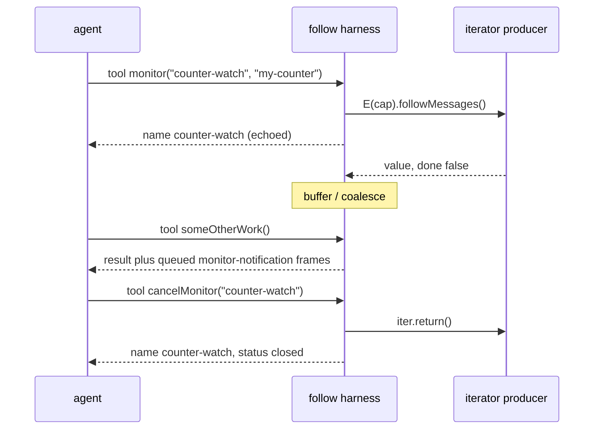

# Agent Follow-Stream Tool

| | |
|---|---|
| **Created** | 2026-05-12 |
| **Author** | Kris Kowal (prompted) |
| **Status** | Proposed |
| **Source** | Steward dispatch 2026-05-12: agent-side analog of the Monitor harness tool |

## What is the problem being solved?

> Please dispatch a designer to propose a tool for our lal and fae
> agents that will enable them to "follow" an exo stream (currently a
> passable async iterator), receiving messages from a program that is
> running in the background until cancelled.
> The agent would see the Justin representation of the passable data
> that transits the stream, as it arrives.
> This could be used for event monitoring, analogous to the Monitor
> tool.

The unmistakable goal: an agent (lal or fae) needs a way to *attend*
to a long-running passable stream without giving up its turn.
Streams in the daemon (e.g. `followMessages`, `followNameChanges`,
`followPeerChanges`, `followCommands`, `followRetentionSet`, channel
`followMessages`, the just-introduced `streamBase64` from
`@endo/exo-unzip`, and any user-authored exo that returns
`makeIteratorRef(asyncGenerator())`) emit passable values over time.
Today an agent has no idiomatic way to consume them.

The mental model to mirror is Claude Code's `Monitor` tool: arm a
background watcher whose stdout-line-per-event surfaces as a
`<task-notification>` between tool calls.
The agent stays free to do other work, and each event arrives as a
side-channel notification it can read when the harness next consults
its message queue.

## Status quo

Inside the agent (see `packages/lal/agent.js` and
`packages/fae/agent.js`), the only current way to consume a stream is
to issue an `evaluate`/`exec` tool call whose body opens the iterator,
drains it inline, and returns the buffered list as the tool result.
The pattern looks like:

```js
// Today, via fae's exec or lal's evaluate:
const iter = E(target).followMessages();
const messages = [];
for await (const msg of iter) {
  messages.push(msg);
  if (messages.length >= 50) break;  // arbitrary cutoff
}
return messages;
```

This has four user-visible failures:

1. **Eager drain.** The `for-await-of` only returns when the iterator
   ends or a hard cap fires.
   For `followMessages` (which is intended to run for the lifetime of
   the inbox), the call never returns.
2. **Tool-call blocking.** Even with a cap, the agent's turn stalls on
   the loop.
   The LLM cannot interleave other reasoning, cannot reply to a
   parallel inbox message, and cannot cancel.
3. **Loss of the live signal.** Once buffered into a returned list,
   the events lose their temporal ordering relative to the agent's
   own actions.
   The agent cannot react to event N before event N+1 has been
   produced because it does not see N until the loop completes.
4. **No cancellation handle.** A subsequent tool call has no way to
   say "stop the iterator I started two turns ago."
   The only way to free the producer is to crash the worker.

The `daemon-message-streaming` design covers an analogous gap on the
*sender* side.
This design covers the gap on the *consumer* side, specifically for
agents that do not block their tool-loop.

## Proposed tool

### Tool name

`monitor` (per the maintainer's naming call on the PR review; see the
resolved tool-name decision under "Open questions" below).
The name mirrors Claude Code's `Monitor` tool, whose mental model this
design deliberately transfers to the agent (see "Comparison to
Monitor").
A complementary `cancelMonitor` tool releases an active subscription.
`peekMonitor` is reserved for a future read-without-cancel surfacing of
a frame buffer, but is out of scope for the MVP.

### Inputs

```jsonc
{
  "name": "monitor",
  "description": "Subscribe to a passable async-iterator capability ...",
  "parameters": {
    "type": "object",
    "properties": {
      "name": {
        "type": "string",
        "description": "The handle the AGENT assigns to this subscription. It is the argument used to cancel the stream and heads every notification from it. The agent picks it, modeled on pet-name discipline (like the result name it gives `evaluate` or `writeText`); the harness never mints one. Note this is NOT a pet-store binding: the subscription is transient per-worker registry state, not a persistent name, and needs no `remove` cleanup (see resolved Open question 4). Must be unique among the agent's currently-open monitors."
      },
      "petNameOrPath": {
        "oneOf": [
          {"type": "string"},
          {"type": "array", "items": {"type": "string"}}
        ],
        "description": "The pet name or path of the iterator-returning capability to follow."
      },
      "method": {
        "type": "string",
        "description": "Method name to invoke on the capability that returns the async iterator (default 'followMessages')."
      },
      "args": {
        "type": "array",
        "description": "Optional arguments to pass to the method, decoded as SmallCaps."
      },
      "deliveryPolicy": {
        "type": "object",
        "description": "How queued frames are surfaced to the agent. Every field is optional; the documented default applies when omitted. Grouping the delivery/rendering/buffering knobs into one value keeps the top-level call signature stable as later phases add knobs (see Phase 2).",
        "properties": {
          "maxFramesPerNotification": {
            "type": "integer",
            "description": "Coalesce up to N frames into one notification (default 16)."
          },
          "bufferDepth": {
            "type": "integer",
            "description": "Ring-buffer depth per subscription; when full, oldest frames are dropped (default 256)."
          },
          "maxFrameChars": {
            "type": "integer",
            "description": "Truncate a single frame's Justin rendering at this many characters (default 4096)."
          }
        }
      }
    },
    "required": ["name", "petNameOrPath"]
  }
}
```

Phase 1 ships exactly the properties above. The Phase-2 knobs `filter`
and `frameBudget` are deliberately absent from this schema (they are
added to `deliveryPolicy` when they land; see "Phased plan"), so a
caller reading the canonical schema never calls a parameter the shipped
surface would silently ignore.

The agent-assigned `name` is the sole identity of the subscription: it
heads every notification, subsumes what a separate display `label` would
have carried, and is the argument `cancelMonitor` takes. The result of a
successful `monitor` call echoes the resolved binding back to the agent,
reusing the exact request field names so the round-trip maps
one-to-one:

```js
{
  name: 'counter-watch',        // the handle the agent assigned (echoed back)
  petNameOrPath: 'my-counter',  // echo of the resolved input, same field name
  method: 'followMessages',
}
```

Because the agent chose the name, no harness-minted token has to be
learned or looked up; the agent already knows how to cancel the stream
and which notifications belong to it. A `monitor` call whose `name`
collides with an already-open subscription is rejected synchronously (no
second stream is opened), so a name unambiguously denotes one live
subscription at a time, the same non-collision guarantee the pet-store
gives any other name the agent binds.

### `cancelMonitor`

```jsonc
{
  "name": "cancelMonitor",
  "description": "Stop following a stream and release the iterator (calls iter.return()).",
  "parameters": {
    "type": "object",
    "properties": {
      "name": {"type": "string", "description": "The handle the agent assigned when it called monitor."}
    },
    "required": ["name"]
  }
}
```

Cancellation is idempotent.
Both outcomes return the same envelope shape, differing only in the
`status` value, so the caller reads a shared field rather than branching
on shape:

```js
{ name: 'counter-watch', status: 'closed' }         // this call closed it
{ name: 'counter-watch', status: 'already-closed' } // it was already closed
```

An LLM that does not care about the distinction can ignore `status`
entirely; one that does reads a single field. Once cancelled, a name is
free to be reused for a fresh `monitor` call (see "Subscription
generations" below for how in-flight frames from the prior generation
are prevented from surfacing under the reused name).

### Notification shape

Each event surfaces in the agent's chat transcript as a single `tool`
or `system`-role message (depending on which tool harness convention
the model expects), structured as:

```
<monitor-notification name="counter-watch">
[seq:42 ts:2026-05-12T17:04:33Z]
{Justin-rendered passable}
</monitor-notification>
```

When `maxFramesPerNotification > 1`, multiple frames are concatenated
inside one notification block, each on its own line, with a shared
prefix:

```
<monitor-notification name="counter-watch" frames="3">
[seq:42 ts:2026-05-12T17:04:33Z] { type: 'add', name: 'counter-7' }
[seq:43 ts:2026-05-12T17:04:33Z] { type: 'add', name: 'counter-8' }
[seq:44 ts:2026-05-12T17:04:34Z] { type: 'remove', name: 'counter-3' }
</monitor-notification>
```

Two terminal notification kinds close the stream:

```
<monitor-notification name="counter-watch" terminal="done">
Stream completed cleanly after 244 frames.
</monitor-notification>

<monitor-notification name="counter-watch" terminal="error">
Error{message: "lost connection to remote daemon"}
</monitor-notification>
```

The XML-ish framing is chosen for two reasons.
First, it parallels the `<tool_call>` extraction fae already applies
(`extractToolCallsFromContent` in `packages/fae/src/extract-tool-calls.js`),
so the same stripping logic applies on round-trip.
Second, modern LLMs reliably treat opening tags they did not author
as data, not as instruction; the `<monitor-notification>` wrapper
prevents prompt injection from a hostile producer (a remote sender
who emits `</tool_call>` cannot escape the surrounding tag because the
content is rendered through `passableAsJustin`, which JSON-quotes
strings).

## Lifecycle



Steady state:

1. The agent calls `monitor(name, petNameOrPath)`, choosing `name`
   itself.
2. The agent's worker resolves the pet name to a remote
   capability and calls the configured method (`followMessages` by
   default), wrapping the returned iterator-ref with
   `iterateReader` from `@endo/exo-stream/iterate-reader.js` (the live
   Exo Stream Protocol reader; the older `makeRefIterator` from
   `@endo/daemon/ref-reader.js` is a removed API, per
   `packages/exo-stream/MIGRATION.md`, and `packages/lal/agent.js:7`
   already imports `iterateReader`).
   The wrapper is parked in a per-worker `Map<name, subscription>`
   keyed by the agent-assigned name (a name already in the map is
   rejected before the method is sent).
3. A background pump reads the iterator and pushes each frame into a
   queue, tagging it with the subscription's current generation
   (see "Subscription generations").
   The pump is structured to never block on the agent: a slow LLM
   does not exert backpressure on the producer past the configured
   buffer size.
4. At the harness's next turn boundary (the natural quantum where it
   composes the next prompt; see "Integration" for exactly where that
   boundary is in lal versus fae), the harness drains the queue,
   discards any frames whose generation no longer matches a live
   subscription, coalesces the rest per `maxFramesPerNotification`,
   renders each batch with `passableAsJustin`, and prepends the
   resulting `<monitor-notification>` blocks to the next user-role
   turn the LLM sees.
5. When the iterator yields `{ done: true }`, the harness emits a
   terminal notification with `terminal="done"` and removes the
   subscription.
   When the iterator throws, the harness emits a terminal
   notification with `terminal="error"` and the
   `passableAsJustin`-rendered error.
6. `cancelMonitor(name)` calls `iter.return()`, removes the
   subscription, and bumps the generation so any frames the pump
   already queued for the closing subscription are dropped at the next
   drain rather than surfacing under a later reuse of the name.
   No terminal notification is emitted for an agent-initiated
   cancellation; the caller already knows.
7. When the worker loop exits (cancellation, agent removal,
   process shutdown), every still-open subscription is cancelled
   automatically.

### Subscription generations

The subscription `name` is both the persistent handle the agent reuses
and the join key from a queued frame back to its subscription. To keep
a reused name from picking up stragglers, each subscription carries a
monotonic `generation` counter, and every queued frame records the
generation it was produced under:

```js
/** @type {Map<string, { generation: number, iter: unknown, policy: DeliveryPolicy }>} */
const subscriptions = new Map();

/** @type {Array<{ name: string, generation: number, frame: unknown, seq: number, ts: string }>} */
const frameQueue = [];
```

`cancelMonitor` (or a terminal close) increments the counter as it
removes the subscription; a fresh `monitor` under the same name starts
at the next generation. At drain time a frame is surfaced only if its
`generation` matches the live subscription's current generation, so a
frame the pump pushed for the *old* generation of `counter-watch` is
discarded rather than mislabeled as belonging to the new one. This
preserves the design's stated invariant ("a name unambiguously denotes
one live subscription at a time") even across the explicitly-permitted
cancel-then-re-monitor sequence.

## Justin rendering

Each frame is rendered with
`passableAsJustin(frame, /* shouldIndent */ false)` from
`@endo/marshal`.
This is the same renderer the lal agent already uses for its tool-call
and tool-result diagnostics (see `passableAsJustin` in
`packages/lal/round-runner.js`), so the visual grammar is consistent
across all agent-visible passable values.

Justin handles the passable space as follows (cross-checked against
`packages/marshal/src/marshal-justin.js`):

| Passable kind        | Justin rendering                                                |
|----------------------|-----------------------------------------------------------------|
| string               | `"hello\nworld"` (JSON-quoted, so newlines escape)              |
| number               | `42`, `3.14`, `NaN`, `Infinity`, `-Infinity`                    |
| bigint               | `123n`                                                          |
| boolean / null       | `true`, `false`, `null`                                         |
| undefined            | `undefined`                                                     |
| symbol               | `Symbol.for("name")` or `Symbol.asyncIterator` etc.             |
| array                | `[1, "two", 3n]`                                                |
| copyRecord           | `{ name: "alice", age: 30 }`                                    |
| copyTagged           | `makeTagged("tagName", payload)`                                |
| remotable            | `slot(0, "Iface")`, a numeric slot reference with iface name    |
| promise              | `slot(1)`, a slot reference (no special iface)                  |
| error                | `Error("oops")` (or `TypeError(...)`, etc.)                     |
| async iterator       | `slot(2, "Alleged: AsyncIterator")` (slot, no special syntax)   |

Slots are rendered with their interface name when known, which gives
the agent a useful hint about what kind of remote value just arrived.

Per the Endo project guideline on diagnostic discipline (see root
`CLAUDE.md`: "When rendering a passable value for a log message, use
`passableAsJustin` from `@endo/marshal` rather than `JSON.stringify`,
which produces ambiguous output for remotables and promises"), Justin
is the right rendering for this surface and not, say, `JSON.stringify`
or `util.inspect`.

### Truncation policy

Justin output for a single frame is truncated at 4 KiB by default
(per stream, configurable via `deliveryPolicy.maxFrameChars`).
The truncation marker is placed inside the
`<monitor-notification>` wrapper:

```
<monitor-notification name="counter-watch" truncated="true">
[seq:42] { large: { many: [...
... 12 KiB of Justin elided (frame seq 42 was 16 KiB) ...
] } }
</monitor-notification>
```

This matches Claude Code's existing `Bash` and `Read` output
truncation policy for non-stream tools, which the agent already
expects to sometimes see.

`Uint8Array` payloads (the most common reason a frame would be very
large, e.g. `streamBase64` from `@endo/exo-unzip`) are rendered with
their length and a base64-of-prefix preview, not the full body.
A producer that wants the agent to see full bytes can pass them as
strings; the Justin rendering of an inline `Uint8Array` would not be
readable to an LLM regardless.

## Backpressure and buffering

The harness maintains a per-handle frame queue with these defaults
(all overridable via `deliveryPolicy`):

- **Bounded depth.** Each subscription has a `bufferDepth` (default
  256 frames).
  When the queue is full, new frames are dropped from the *oldest*
  end (a "ring drop") and a single counter `droppedSinceLastDrain`
  is incremented.
- **Coalesced surfacing.** When the agent's tool loop polls the
  queue, all queued frames for a stream surface in a single
  `<monitor-notification>` block per the
  `maxFramesPerNotification` limit; if the queue holds more than
  the limit allows, multiple notifications are emitted in order.
- **Drop annotation.** If `droppedSinceLastDrain > 0`, the first
  notification of the next drain prepends a sentinel:
  ```
  <monitor-notification name="counter-watch" dropped="14">
  ... 14 older frames were dropped because the buffer overflowed.
  </monitor-notification>
  ```

### Why ring-drop-oldest is the default

Three policies were considered:

| Policy                     | Pro                                          | Con                                              |
|----------------------------|----------------------------------------------|--------------------------------------------------|
| **Buffer all**             | Lossless                                     | Unbounded memory; breaks "agent does not block producer" |
| **Drop oldest (ring)**     | Bounded; fresh signal preserved              | Old frames lost; producer never paused           |
| **Coalesce and summarize** | Lossless in summary; bounded                | Summaries are domain-specific; hard to make general |

**The MVP picks Drop oldest** (drop oldest with a counter).
Rationale: the producer must not be blocked on agent attention; "what
is happening *now*" is almost always more useful to an agent than
"what happened earlier"; and the dropped-counter sentinel preserves
the *fact* of loss so the agent does not silently skip events.

For producers that genuinely cannot tolerate loss (audit log,
financial events), the agent can request a higher `bufferDepth` per
subscription, or implement **Coalesce and summarize** in their own
handler by piping the stream through a `coalesce` exo before
subscribing.

This decision is one of two specifically called out under "Open
questions" because it bears on user-visible behaviour.

## Failure modes

| Trigger                        | Surfaces as                                                                   |
|--------------------------------|-------------------------------------------------------------------------------|
| Iterator throws                | `<monitor-notification terminal="error">` with the Justin-rendered error.      |
| Iterator yields `done: true`   | `<monitor-notification terminal="done">` with the final frame count.           |
| Network drop on remote stream  | Underlying CapTP rejection bubbles through to `terminal="error"`.             |
| Slow agent attention           | Ring-drop oldest; `dropped="N"` annotation on next surfaced notification.     |
| `petNameOrPath` does not exist | Synchronous tool-call rejection (no subscription registered).                 |
| `name` already open            | Synchronous tool-call rejection (a name denotes one live subscription).       |
| Capability lacks the method    | Synchronous tool-call rejection from the `E(cap).method()` send.              |
| Worker process exit            | All open subscriptions are cancelled (`iter.return()`), no notifications.    |
| Agent loop exits normally      | All open subscriptions are cancelled before the loop returns.                 |

The "synchronous" rejections in the table are observable to the LLM
as ordinary tool-call errors (the `{ error: errorMessage }` shape a
tool dispatch returns on a thrown tool), so the LLM can decide whether
to retry with a different name.

## Integration with lal/fae existing tool harness

The two agents have materially different loop architectures, and the
"where does a queued frame get spliced into the next turn" question has
a different answer in each. The design states both honestly rather than
assuming a single shared join point.

### lal

`packages/lal/agent.js` (about 325 lines) does **not** own its agentic
turn loop. `spawnWorkerLoop(powers, context, workerEnv)` builds the tool
surface from declarative per-family records (`tools` from
`packages/lal/tools/index.js`), dispatches them through the single
`switch` in `makeExecuteTool` (`packages/lal/tool-dispatch.js`) wrapped
by `toAgentTool`, and hands the whole set to `makePiAgent` from
`@endo/agentry/harness`. The per-round driver is
`runRound(piAgent, prompt)` (`packages/lal/round-runner.js`), which just
consumes the event stream `runAgentRound` yields; the round loop itself
lives in `@earendil-works/pi-agent-core`, outside this repo. The worker
is then driven by `runInboxLoop({ powers, getCancelled, runOneRound })`
(`packages/lal/inbox-loop.js`), which follows the guest's
`followMessages()` and calls `runOneRound(prompt)` once per inbound
message.

Two consequences for this design:

- **Adding the tools is straightforward.** `monitor` and
  `cancelMonitor` become two more declarative records in a `tools/`
  family file plus two more `case`s in the `makeExecuteTool` switch,
  exactly like every existing lal tool. The per-worker `subscriptions`
  Map, `frameQueue`, and `nextSeq` counter live in `spawnWorkerLoop`'s
  closure alongside the powers it already captures.

- **The mid-round drain point is an open question, not an existing
  hook.** Because pi-agent-core owns the between-tool-calls loop, lal
  has no in-repo join point at which to splice a notification *between
  two tool calls of the same round*. The join point lal actually
  exposes today is the **inter-round boundary** in `runInboxLoop`, the
  same place the current code composes a fresh user-role prompt for the
  next round. The MVP therefore drains queued frames into the *next
  round's* opening user turn (prepending the `<monitor-notification>`
  blocks to the prompt `runOneRound` is about to run), which is
  well-defined and needs no pi-agent-core change. True mid-round
  injection between individual tool calls would require a
  notification-injection hook in pi-agent-core's `runAgentRound`; that
  is called out under "Open questions" as an upstream dependency, not
  assumed to already exist.

### fae

`packages/fae/agent.js` (about 691 lines) *does* own its agentic loop
in-repo: `runAgenticLoop(initialSchemas, initialToolMap, leafNodeId)`
(around line 308) drives `chat(...)`, extracts tool calls via
`extractToolCallsFromContent` (`packages/fae/src/extract-tool-calls.js`),
runs them through `processToolCalls`, and appends nodes to a
conversation tree. Its tools come from per-tool factories in
`packages/fae/src/tool-makers.js` (`makeReplyTool`, `makeEvaluateTool`,
`makeReadFileTool`, and so on) that return objects with
`schema()`/`execute()`/`help()`.

Two new factories follow the same shape:

```js
export const makeMonitorTool = (powers, registry) => harden({ ... });
export const makeCancelMonitorTool = (powers, registry) => harden({ ... });
```

The `registry` argument is a small object that owns the
`subscriptions` Map and the `frameQueue` so the two factories share
state, and so the agent's outer loop can access them for drain-on-exit
cleanup. Because fae owns `runAgenticLoop`, it *can* splice a drain
between tool calls: the loop gains a step that, before composing the
next `chat` context, drains the queue into a fresh tree node (mimicking
how inbound messages are appended today). fae is thus the package where
true between-tool-call surfacing is achievable in the MVP; lal gets the
inter-round variant described above until the upstream hook exists.

Both packages share enough behaviour that the registry, drain function,
and notification formatter could be lifted into a shared module
(`packages/agent-stream-follow/`?) in a follow-up.
The MVP lands the implementation per-agent and defers consolidation.

## Comparison to Monitor

| Dimension              | Monitor (Claude Code)                       | monitor (this design)                          |
|------------------------|---------------------------------------------|-----------------------------------------------------|
| What it watches        | A child process's stdout                    | A passable async iterator over CapTP                |
| Frame format           | One stdout *line* per notification          | One *passable value* per notification               |
| Rendering              | Raw text                                    | `passableAsJustin` rendering                        |
| Identity               | Process pid                                 | Agent-assigned name (modeled on pet-name discipline) |
| Authority              | Inherits the agent harness's process rights | Authority is in the capability the petname resolves to |
| Cancellation           | Kill child; harness teardown                | `cancelMonitor(name)` calls `iter.return()`          |
| Buffering              | Harness-internal, line-based                | Per-handle frame queue with ring-drop-oldest        |
| Coalescing             | Implicit (chunks of stdout)                 | Explicit `deliveryPolicy.maxFramesPerNotification`  |
| Side-channel surfacing | `<task-notification>` between tool calls    | `<monitor-notification>` between tool calls          |
| Termination signal     | Process exit                                | Iterator `done: true` or thrown error               |

The mental model the LLM forms for Monitor transfers directly: "I
asked for it, the harness will surface frames between my actions, and
I cancel when I am done."
The implementation underneath is entirely different (no fork, no pipe,
no shell quoting); the *interface* is the part that needs to be
familiar.

## Test plan

Phase 1 must ship the following tests. These name the timing-sensitive
and edge behaviours the design introduces, so a builder has an explicit
catalog to cover rather than inferring it from prose.

1. **Ring-drop-oldest overflow.** A producer that emits more than
   `bufferDepth` frames before any drain drops the oldest frames, keeps
   the newest `bufferDepth`, and surfaces a `dropped="N"` sentinel with
   the correct count on the next drain.
2. **Coalescing threshold.** With `maxFramesPerNotification = k` and a
   queue of `m > k` frames, the drain emits `ceil(m / k)` notification
   blocks in `seq` order, none exceeding `k` frames.
3. **Done-versus-cancel notification suppression.** A stream that ends
   with `done: true` emits exactly one `terminal="done"` notification;
   an agent-initiated `cancelMonitor` emits **no** terminal
   notification. The race where a frame and the `done` arrive in the
   same drain still surfaces the frame before the terminal block.
4. **Idempotent double-cancel.** `cancelMonitor` on a live subscription
   returns `{ name, status: 'closed' }`; a second `cancelMonitor` on
   the same (now-absent) name returns `{ name, status: 'already-closed' }`
   and does not throw.
5. **Synchronous name-collision rejection.** A second `monitor` with a
   `name` already open is rejected synchronously, no second iterator is
   opened, and the first subscription is unaffected.
6. **Stale-generation frame drop.** Cancel a subscription while frames
   for it are still queued, re-`monitor` the same `name`, and confirm
   the stragglers from the prior generation are discarded at drain and
   never surface under the new subscription (exercises the generation
   counter).
7. **Cleanup on worker exit.** When the worker loop exits with open
   subscriptions, every iterator's `return()` is called exactly once
   and no notifications are emitted for the teardown.
8. **Missing capability / missing method / bad path.** Each resolves to
   a synchronous tool-call error with no subscription registered.

Phase-2 knobs (`filter`, `frameBudget`) carry their own tests when they
land and are out of scope for the Phase-1 catalog.

## Phased plan

### Phase 1 (MVP)

- `monitor(name, petNameOrPath, [method], [args], [deliveryPolicy])`
  where `name` is the agent-assigned handle that identifies the
  subscription (echoed back, not minted), and `deliveryPolicy` groups
  `maxFramesPerNotification`, `bufferDepth`, and `maxFrameChars`.
- `cancelMonitor(name)` with the unified `{ name, status }` envelope.
- Per-worker subscription registry (with generation counters) and frame
  queue with ring-drop-oldest.
- Drain hook: between tool calls in fae (`runAgenticLoop`), at the
  inter-round boundary in lal (`runInboxLoop`), surfacing queued frames
  as `<monitor-notification>` user-role messages.
- Justin rendering with the 4 KiB per-frame truncation policy.
- Terminal notifications for `done` and `error`.
- Cleanup on worker exit.

### Phase 2 (followups)

- A `filter` field on `deliveryPolicy` accepting a serialised `M.*`
  pattern that the harness applies to each frame before queueing.
- A `frameBudget` field on `deliveryPolicy` for auto-cancel after N
  frames.
- A `peekMonitor(name)` tool that returns the current queued frames
  without consuming them, for explicit polling.
- Cross-conversation persistence: a subscription opened in transcript
  T1 can be inherited by transcript T2 if the same agent reincarnates,
  by promoting the subscription's name and metadata to a `streams/`
  pet-store entry.
- Lifting the registry, drain, and formatter into a shared
  `@endo/agent-streams` package consumed by both lal and fae.
- A pi-agent-core notification-injection hook so lal can surface frames
  mid-round (between tool calls) rather than only at the inter-round
  boundary.
- A daemon-side `coalesce` exo that fronts an iterator with a
  user-controllable summarising rule (count, time-window, key-grouped
  digest) and can be subscribed-to in place of the raw iterator.

### Out of scope

- Replay-from-snapshot of an iterator's history.
  The iterator contract has no notion of "rewind"; the daemon's
  `followNameChanges` is the closest thing (yields current state
  before subsequent changes), and that behaviour is the producer's
  contract, not the harness's.
- Multi-stream merge (one notification block interleaving frames from
  several handles).
  Per-handle blocks already give the LLM enough to reconstruct order
  via the `seq` and `ts` annotations; merging is rendering preference
  and can be done downstream.
- Producer-side acknowledgement.
  The harness drains by reading the iterator; whether the producer
  needs to know "the agent saw this frame" is a contract between the
  agent and the producer's domain protocol, not a transport feature.

## Open questions

1. **Tool-name pick, RESOLVED: `monitor`.** The maintainer's call on
   the PR review is to name the tool `monitor`, and the design adopts
   it throughout (companions `cancelMonitor` and the reserved
   `peekMonitor`). The name leans directly on Claude Code's `Monitor`
   tool, whose mental model this design mirrors, so an LLM that knows
   Monitor discovers it immediately.

   The candidates originally weighed here, for the record:
   - `followStream`: verb form matched the daemon's own `follow*`
     family of methods and read as "subscribe to a stream until I
     cancel," but did not carry the Monitor mental model in its name.
   - `subscribeStream`: clearer to readers who do not know
     `followMessages`/`followNameChanges`, but stutters with the verb
     phrase the agent already says ("subscribe to the stream
     subscription").
   - `monitorCapability`: discoverable for an LLM that knows Monitor,
     but "capability" is too broad (the tool only accepts
     iterator-returning methods) and the verb-noun word order is
     inconsistent with the rest of the lal/fae tool set. The chosen
     bare `monitor` keeps the Monitor association without those
     drawbacks.

2. **Buffer discipline default.** The MVP picks **Drop oldest** with a
   counter (rationale above).
   The alternatives were:
   - **Buffer all** would let an agent miss nothing but lets a chatty
     producer exhaust worker memory.
   - **Coalesce and summarize** needs a per-domain summarizer to be
     useful, which the harness cannot supply generically.

   This is the most consequential choice in the design; the maintainer
   should affirm that "live signal beats lossless history" is the
   right default before MVP ships.

3. **Lal/fae-specific or shared?** The MVP lands in each package
   independently to avoid blocking on a packaging decision; a Phase-2
   followup proposes lifting it into
   `@endo/agent-streams`.
   Maintainer call: is the right consolidation point a new package,
   an addition to `@endo/lal`'s exported surface, or a section of
   `@endo/exo-stream`?

4. **Stream handle representation, RESOLVED: agent-assigned name.** Per
   the maintainer's review call, the subscription handle is the **name
   the agent assigns when it calls `monitor`**, modeled on pet-name
   discipline (the agent names the subscription the same way it names an
   `evaluate` result or a `writeText` file; the harness never mints a
   token). The name heads every notification and is the argument
   `cancelMonitor` takes; a name denotes one live subscription at a time
   and is freed for reuse on cancellation or terminal close. Crucially,
   the subscription is **per-worker registry state, NOT a pet-store
   binding**, so it requires no `remove` cleanup and does not conflate
   with a persistent name (this is why the `name` schema description
   flags the distinction at first use).

   The candidates originally weighed here, for the record:
   - **Opaque per-worker token** (e.g. `"monitor-7"`): simple and leaks
     no formula id, but forces the agent to learn and track a handle the
     harness invented, exactly the coupling pet-name discipline exists
     to avoid.
   - **Formula id**: precise, but exposes daemon internals to the LLM
     and ties a transient subscription to the permanent formula graph.

   The chosen agent-assigned name keeps the subscription **transient**
   while letting the agent use a handle it already knows, the best of
   both rejected options. Should a future phase want to survive
   a reincarnation (Phase-2 cross-conversation persistence), the same
   name can be promoted to a real `streams/` pet-store entry without a
   representation change.

5. **Authorization model.** The proposed semantics are
   "authority-by-capability": if the agent's pet name resolves to a
   capability that exposes the requested method, the agent can
   subscribe.
   No additional grant is required.
   This matches every other agent tool that takes a pet name
   (`evaluate`, `inspect`, `readText`, `writeText`).
   Maintainer should confirm this is the right boundary; an alternative
   would be a per-capability "follow" grant that the host issues
   separately, but that adds friction for the common case.

6. **Cross-worker delivery.** If an agent is sharded across multiple
   worker loops (the manager pattern in `packages/lal/agent.js` and
   `packages/fae/agent.js`), should `monitor` opened in worker
   A be visible to worker B?
   The MVP says no (subscription registry is per-worker), but a
   future "agent monitor inbox" could surface them centrally.

7. **Mid-round injection in lal (upstream dependency).** As noted under
   "Integration", lal delegates its round loop to
   `@earendil-works/pi-agent-core`, so mid-round (between tool calls)
   frame surfacing needs an injection hook in that dependency's
   `runAgentRound`. The MVP surfaces lal frames at the inter-round
   boundary instead. Maintainer call: is landing the pi-agent-core hook
   in scope for this work, or is the inter-round variant acceptable for
   lal until a separate upstream change?

## References

- `packages/lal/agent.js`, `packages/lal/tools/index.js`,
  `packages/lal/tool-dispatch.js`: current lal tool registration
  (declarative records) and dispatch (single `switch`); the worker loop
  in `spawnWorkerLoop`.
- `packages/lal/round-runner.js`, `packages/lal/inbox-loop.js`: lal's
  per-round driver (over pi-agent-core's `runAgentRound`) and its
  inbox-follow loop, the inter-round drain point.
- `packages/fae/agent.js`, `packages/fae/src/tool-makers.js`,
  `packages/fae/src/extract-tool-calls.js`: current fae tool factory
  pattern, its in-repo `runAgenticLoop`, and the tool-call extraction
  this design's notification framing parallels.
- `packages/exo-stream/README.md`,
  `packages/exo-stream/DESIGN.md`,
  `packages/exo-stream/PROTOCOL.md`,
  `packages/exo-stream/iterate-reader.js`: the Exo Stream Protocol and
  the live `iterateReader` this design wraps producers with.
- `packages/exo-stream/MIGRATION.md`: records that
  `@endo/daemon/ref-reader.js`/`makeRefIterator` is a removed API,
  replaced by `iterateReader`.
- `packages/marshal/src/marshal-justin.js`: `passableAsJustin`
  semantics used for frame rendering.
- Daemon follow-stream producers, which live split across the daemon
  package rather than in a single file: `followMessages` (channel
  `packages/daemon/src/channel.js`; inbox `packages/daemon/src/mail.js`),
  `followNameChanges` (`packages/daemon/src/pet-store.js`,
  `packages/daemon/src/directory.js`), and the `follow*` surfaces on
  `packages/daemon/src/host.js`, `packages/daemon/src/manager.js`, and
  `packages/daemon/src/guest.js`.
- `packages/chat/microblog-component.js`: channel `followMessages`
  consumer (an existing in-tree client that this design's harness
  could replace if the chat client were rewritten to use it).
- [`daemon-message-streaming.md`](daemon-message-streaming.md): the
  *sender*-side complement of this design (incremental message
  composition).
- [`daemon-agent-tools.md`](daemon-agent-tools.md): the umbrella
  design for agent tool surfaces (`fs`, `shell`, `git`); this
  proposal adds a `monitor` tool to the same surface.
- [`chat-slot-slash-commands.md`](chat-slot-slash-commands.md):
  another design that surfaces ephemeral, agent-driven values
  through the same pet-store boundary, illustrating the existing
  precedent for "transient handle, no permanent name."
- [`endor-bus-tui.md`](endor-bus-tui.md): analogous problem on the
  TUI side: a worker contributes UI through a CapTP-mediated
  notification stream rather than direct access; same architectural
  shape, different surface.

## Prompt

> Please dispatch a designer to propose a tool for our lal and fae
> agents that will enable them to "follow" an exo stream (currently a
> passable async iterator), receiving messages from a program that is
> running in the background until cancelled.
> The agent would see the Justin representation of the passable data
> that transits the stream, as it arrives.
> This could be used for event monitoring, analogous to the Monitor
> tool.
