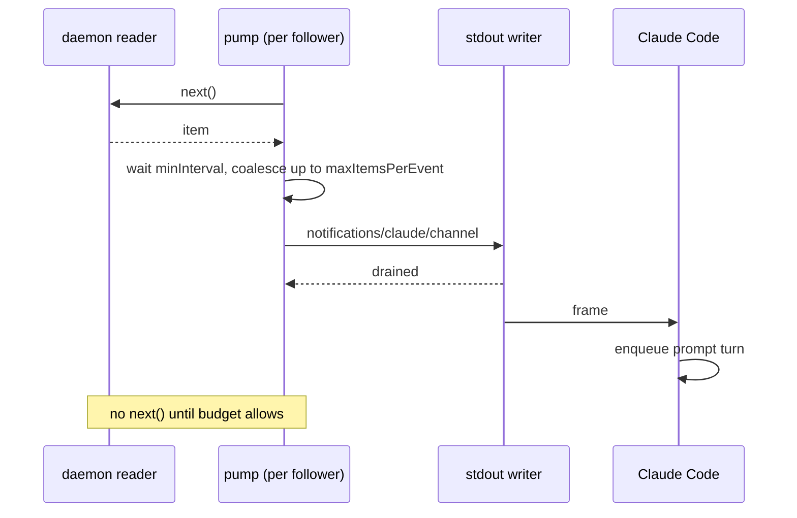

# Push projection of followed streams for the agent MCP stdio server

| | |
|---|---|
| **Created** | 2026-09-24 |
| **Author** | endolinbot (prompted) |
| **Status** | Proposed |

## What is the problem being solved?

The agent MCP stdio server (`@endo/agent-mcp-stdio`, PR #1336, design
[endo-guest-stdio-mcp](endo-guest-stdio-mcp.md)) exposes daemon streams only as
**pull**. A `follow*` tool (`followMessages`, `followNameChanges`,
`followLocatorNameChanges`, `followStream`) opens a follower handle. `readFollower`
drains it in bounded pulls (at most `maxItems` items, waiting at most
`waitMilliseconds`, capped at 256 items and 30 s). `closeFollower` releases it.
Nothing reaches the model unless the model asks.

kriskowal's review of #1336
([discussion_r4098195295](https://github.com/endojs/endo-but-for-bots/pull/1336#discussion_r4098195295))
asked for the unfinished parts of the plan to be noted and designed. Issue
[#1339](https://github.com/endojs/endo-but-for-bots/issues/1339) ("Also noted from
the same review") records that there is no push projection of a followed stream.
This design decides **whether** and **how** to add one. It covers the MCP push
mechanisms, what Claude Code actually does with each, backpressure and bounds,
cancellation, and how push fits the static catalog (`tools.listChanged: false`).

## What the client actually consumes

MCP gives a server four ways to send something without being asked. What matters
is what the client does with each. The findings below come from inspecting the
Claude Code 2.1.280 client, the version installed on the garden hosts on
2026-09-24. They must be checked again against the version the harness pins
before implementation.

| Mechanism | Spec status | What Claude Code 2.1.280 does with it |
|---|---|---|
| `resources/subscribe` + `notifications/resources/updated` | Standard MCP | Only the bundled SDK schema knows these messages. The client never subscribes, and an update never reaches the model. |
| `notifications/progress` (against a request's `progressToken`) | Standard MCP | Keeps a long tool call alive and may show in the UI. It is not model input. |
| `notifications/message` (logging) | Standard MCP; the server already advertises `logging: {}` | Goes to diagnostics. It is not model input. |
| `notifications/claude/channel` (`params: { content, meta? }`) | Claude Code extension. The server opts in with `capabilities.experimental["claude/channel"]`. | **Enqueued as a new prompt turn** (`enqueue({ mode: "prompt" })`). Only registered when channels are enabled (`--channels`, or `--dangerously-load-development-channels` for development servers). A research-preview surface. |

So the only push the model can **see** is the Claude Code channel extension. It
works by **starting a turn**, not by adding context to a turn already running.
Resource subscription is the standard, client-neutral shape, but today it reaches
no model.

## Why push is not the default: the harness contract

The main consumer, the `@endo/claude` harness ([endo-claude](endo-claude.md)),
spawns **one `claude -p` per inference**. The MCP server lives exactly as long as
that one inference (§ *Process lifetime and topology* of
[endo-guest-stdio-mcp](endo-guest-stdio-mcp.md)). Push breaks that harness in two
ways:

1. **Extra turns break the terminal-result contract.** The harness requires exactly
   one terminal `result` event per prompt. It excludes only results whose
   `origin.kind` is `task-notification`. A channel event starts a new prompt turn,
   and that turn ends in another `result`. The harness then reads a stream with two
   terminal results as a `parse-error`, so a good inference is recorded as a
   failure. Each extra turn also costs a full model call that nobody asked for.
2. **The server has nothing to push across.** A follower lives only as long as its
   server, and its server lives only as long as one inference. Pull within the
   inference (`readFollower` with a wait) already covers "watch until something
   happens" for a turn that is running. The event that push exists for, the one
   that arrives *after* the model stopped asking, lands after the process has gone.

**Decision: pull stays the contract. Push is an opt-in, per-spawn configuration
that the per-inference harness never turns on.** Push is for a **long-lived,
interactive** session: a maintainer running `claude` with this server in
`--mcp-config`, where a new turn per event is what the user wants, as with
Claude Code's own `Monitor` tool. This is the MCP-side counterpart of
[agent-follow-stream-tool](agent-follow-stream-tool.md), which gives the lal and
fae agents the same "follow in the background" affordance.

## Design

### Phase 1: honor cancellation of pulls (no push)

Independent of push, a pull is not cancellable today. The adapter in
`@endo/agent-tools` (`handleMessage` in `src/adapters/mcp.js`) drops every
notification, `notifications/cancelled` included. `readFollower` races only the
next item against its own timeout. A client that cancels a 30 s wait still holds
that tool call's work open until the timeout.

- The adapter keeps an **in-flight request table** keyed by JSON-RPC `id`. Each
  entry holds the `reject` of a per-request `cancelled` `Promise<never>`, with
  `cancelled.catch(() => {})` attached so a rejection is never unhandled. When
  `notifications/cancelled { requestId, reason }` arrives, the adapter rejects
  that entry. The entry is deleted when the request settles.
- `tools/call` passes that `cancelled` into `invoke` (the tool declaration gains a
  `cancelled` argument alongside `toolArguments`). `readFollower` adds `cancelled`
  to its `Promise.race`. On cancellation, the pending `iterator.next()` **stays in
  `record.pending`**, the same rule that applies on timeout, so the item it
  eventually yields belongs to the next pull and is not lost. As MCP's
  cancellation clause requires, the server sends **no response** for a cancelled
  request.
- Each connection has a root `cancelled` that is rejected on stdin EOF or when the
  daemon connection drops. Every per-request promise and every follower (Phase 2)
  is chained to it, so shutdown cancels everything in one step.

Phase 1 is worth doing whether or not push ever ships.

### Phase 2: channel push behind a per-spawn opt-in

**Configuration.** A new environment variable, `ENDO_MCP_PUSH=channel`, read by
`src/config.js` alongside the formula-id variable, enables push for one spawn. If
it is absent, `initialize` is unchanged. If it is present, `initialize` adds
`experimental: { "claude/channel": {} }` to `capabilities`. The `@endo/claude`
harness never sets it.

**Catalog.** One new tool, **`pushFollower`**, is added to the fixed catalog and
**always listed**, whether or not push is enabled. The catalog therefore stays a
build-time constant, and `tools.listChanged` stays `false` with no
`notifications/tools/list_changed`. Whether push is available is decided when the
tool is called, not by what the catalog lists. Without the opt-in, `pushFollower`
returns the visible error `-32001` with `data.reason = "push-unavailable"`. This is
the fail-closed rule the design already applies to a missing grant: the tool is
listed, and the refusal is explicit.

```js
// Arguments of pushFollower.
{
  follower: 'follower3',   // from a follow* tool
  maxItemsPerEvent: 16,    // 1..256, like readFollower's maxItems
  minIntervalMilliseconds: 5_000, // at least 1_000; debounce between events
  maxEvents: 20,           // at most 100; per-follower budget of turns
}
// Result: { follower: 'follower3', mode: 'push' }
```

`pushFollower` moves a follower from pull mode to push mode, and the move is
one-way. After it, `readFollower` on that handle returns
`data.reason = "follower-pushing"`, so two consumers never compete for one
`record.pending`. `closeFollower` still ends the follower in either mode.
`follow*` tools and their arguments do not change.

**Event shape.** One `notifications/claude/channel` carries the coalesced items of
one follower:

```js
{
  method: 'notifications/claude/channel',
  params: {
    content: '<endo-follower name="follower3" items="3">…</endo-follower>',
    meta: { follower: 'follower3', seq: '42', terminal: 'none' }, // strings only
  },
}
```

`content` renders the items exactly as `readFollower` renders its `items`, so the
two modes differ only in delivery, not in what the model reads. The tag wrapper
follows [agent-follow-stream-tool](agent-follow-stream-tool.md) § *Notification
shape*. The item text is quoted inside the wrapper, which stops a producer from
closing the wrapper and injecting instructions. Two terminal events end a
follower: `terminal: 'done'` when the stream ends, and `terminal: 'error'` with the
rendered error.

### Backpressure and bounds

Every event is a model turn, so push is **paced by pulling**: the pump never takes
an item from the stream without a budget to deliver it.

- **One outstanding pull per follower.** The pump runs
  `next()` → wait for `minIntervalMilliseconds` since the last event → coalesce
  (keep pulling until `maxItemsPerEvent` items or no item is ready) → emit →
  repeat. While the pump waits, it does not call `next()`. Pressure therefore
  reaches the daemon reader (`@endo/exo-stream`'s own flow control) instead of
  piling up in the server. The server keeps **no unbounded queue**, and nothing is
  dropped silently.
- **Write backpressure.** `writeLine` in `src/stdio.js` ignores `output.write`'s
  return value today. The pump awaits `'drain'` when `write` returns `false`
  before it emits the next event. Ordinary replies keep today's behavior.
- **Turn budget.** When a follower has used its `maxEvents`, it goes back to pull
  mode after one final event with `terminal: 'budget'` ("push budget exhausted;
  continue with readFollower"). Nothing pending is lost, because an item already
  pulled is kept for the next `readFollower`. The server also enforces a
  per-connection ceiling: at most 8 pushing followers (inside the existing
  `LIMIT_FOLLOWERS = 64`) and at most 200 events per connection.



### Cancellation (the `cancelled` pattern)

Each follower record carries its own `cancelled` `Promise<never>`, chained to the
connection's root `cancelled`. The follower table holds that promise's `reject`.
Nothing that holds the follower's handle gets a `cancel()` method.

- `closeFollower` rejects that follower's `cancelled`. The pump's
  `Promise.race([record.pending, cancelled])` ends. Then
  `iterator.return?.()` runs **without being awaited**, as `closeFollower` already
  does, because a `return` queues behind a pull still pending on a quiet stream.
  No terminal channel event is sent for a close the model asked for.
- A stdin EOF or a daemon disconnect rejects the root promise, which stops every
  pump. A daemon disconnect first sends one `terminal: 'error'` event per pushing
  follower, carrying the same `bridge-down` detail a pull would get. EOF sends
  nothing, because nobody is listening.
- Using up the budget (above) does not cancel the follower. It only changes the
  follower's mode.

## Ownership map

| Boundary | Mechanism | Policy | Durable state | Lifecycle / commit | Value crossing |
|---|---|---|---|---|---|
| daemon reader → MCP server | `iterateReader` over the reader | the producer's own flow control | the producer's (the server holds none) | the server calls `return()` on close or cancel | passable items |
| pump → stdout | the pump in `agent-interface.js` | `pushFollower` arguments plus server ceilings | none; the follower table is in memory for the process lifetime | the follower's `cancelled` | one coalesced channel event |
| MCP server → Claude Code | JSON-RPC notification | the client's channel enablement | the client's transcript | the client decides to start a turn | `{ content, meta }` |
| harness → `claude -p` | the `@endo/claude` spawn | the harness never sets `ENDO_MCP_PUSH` | the harness's inference record | one terminal `result` per inference | none (push is off) |

The server owns only mechanism and bounds. The stream's state belongs to the
daemon, and the decision to start a turn belongs to the client. Nothing here
replays after a restart, because a follower does not outlive its process.

## Phased implementation

1. **Cancellation of pulls.** Add the in-flight request table and handling of
   `notifications/cancelled` in `@endo/agent-tools`, pass `cancelled` into
   `invoke`, have `readFollower` race it, and add the root `cancelled` per
   connection. Tests: cancelling a waiting `readFollower` gets no response, and
   the item that arrives afterwards is returned by the next pull.
2. **Channel push.** Add `ENDO_MCP_PUSH`, the `experimental` capability, the
   `pushFollower` tool, the pump, the `'drain'`-aware writer, the budgets, and the
   terminal events. Tests: the capability appears only with the opt-in, and the
   catalog is identical with and without it; `push-unavailable` without the opt-in;
   `follower-pushing` refusal; pacing (no `next()` while waiting); the budget
   returns the follower to pull mode without losing an item; close and EOF stop
   the pump.
3. **Resource projection (deferred).** Wait until a client in use consumes
   `notifications/resources/updated`. Then add
   `resources: { subscribe: true, listChanged: false }` with one static **resource
   template**, `endo-follower:///{follower}`, so no resource list changes at run
   time. `resources/read` drains the items that are ready without waiting.
   `resources/updated` signals only that items are available: the server sends it
   once each time a follower goes from empty to non-empty, and does not repeat it
   until the next read. This is the client-neutral form of the same pull-paced
   pump.

## Design decisions

1. **Pull is the contract, and push is opt-in per spawn.** Push starts turns. The
   per-inference harness cannot accept extra turns and has no time after the
   inference to use them.
2. **Push is not the resource subscription.** The one client in use ignores
   `resources/updated`. The resource shape is kept as Phase 3, to be added when a
   client consumes it.
3. **`pushFollower` is always listed.** Availability is decided by
   `initialize` and at call time, so the fixed catalog and
   `tools.listChanged: false` stay true.
4. **Pace by pulling instead of buffering.** The pump does not pull without a
   budget, so no local queue is needed and nothing is dropped. This differs from
   [agent-follow-stream-tool](agent-follow-stream-tool.md), which drops the oldest
   frames from a ring buffer. Here each event costs a model turn, so waiting is
   cheaper than dropping.
5. **Cancellation uses `cancelled` promises, not `cancel()` methods.** This is the
   daemon's standard shape (maintainer directive,
   endojs/endo-but-for-bots#609), applied per request, per follower, and per
   connection.

## Open questions

- Should Phase 2 ship at all before a long-lived interactive consumer of this
  server exists, or should it wait for one, as Phase 3 does?
- Is it acceptable to depend on `claude/channel`, a Claude Code research-preview
  extension that needs a client-side flag, rather than waiting for a standard MCP
  push that reaches the model?
- When the turn budget runs out, should the follower go back to pull mode (as
  proposed), or close with a terminal event?
- Are the defaults right: an interval of at least 1 s (5 s by default), 20 events
  per follower, 8 pushing followers, and 200 events per connection?
- Should an item render as JSON, as `readFollower` does today, or as Justin, as
  [agent-follow-stream-tool](agent-follow-stream-tool.md) renders it? Either way,
  pull and push should render the same.

## Dependencies

| Design | Relationship |
|---|---|
| [endo-guest-stdio-mcp](endo-guest-stdio-mcp.md) | The server this extends (PR #1336): its static catalog, stdio framing, and one process per inference. |
| [endo-claude](endo-claude.md) | The harness whose one-terminal-result contract keeps push off by default. |
| [agent-follow-stream-tool](agent-follow-stream-tool.md) | The lal and fae analog. This design reuses its notification wrapper. |
| [endo-gateway-mcp](endo-gateway-mcp.md) | The HTTP sibling. It is out of scope here; its long-lived sessions might host Phase 3 first. |
