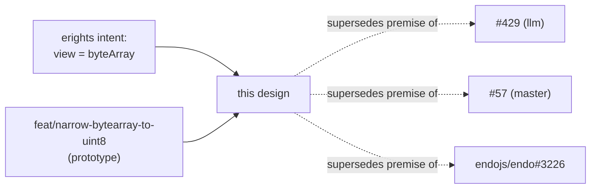

# `byteArray` Maps a Frozen `Uint8Array` View, Not a Bare Immutable `ArrayBuffer`

| | |
|---|---|
| **Created** | 2026-06-30 |
| **Updated** | 2026-07-01 |
| **Author** | Designer (prompted) |
| **Status** | Proposed |
| **Source** | [PR #429 inline comment 4840086579](https://github.com/endojs/endo-but-for-bots/pull/429#issuecomment-4840086579) (erights) |

## Status

This design proposes a pivot to the data model already carried by three open
changes:

- [PR #429](https://github.com/endojs/endo-but-for-bots/pull/429) (llm-base),
- [PR #57](https://github.com/endojs/endo-but-for-bots/pull/57) (master-base sibling),
- upstream [endojs/endo#3226](https://github.com/endojs/endo/pull/3226) (the original).

All three rest on the premise that a **bare** plain frozen immutable
`ArrayBuffer` has passStyle `byteArray`. erights' directive on #429 names the
gap: the current intent is to map only a **plain frozen `Uint8Array` backed by a
plain frozen immutable `ArrayBuffer`** (the typed-array view) to an OCapN
`byteArray`, and a bare immutable `ArrayBuffer` is no longer a `byteArray`.

The pivot is already prototyped on the `feat/narrow-bytearray-to-uint8` branch
(the base of #57). That branch's `packages/pass-style/src/byteArray.js`,
`to-bytes.js` (`frozenBytes`), and `from-bytes.js` (`thawnBytes`) implement the
view-based detection and JS boundary described here, and its
`fix(marshal): read byteArray bytes through a genuine Uint8Array for rank
compare` commit carries the encode-passable adjustment. This document is the
design of record for that direction. erights' disposition (PR #572) is to
**withdraw all three PRs above and open a fresh view-based implementation PR**
against this written intent rather than retarget them off the bare-buffer
premise (Design Decision 6). erights executed the withdrawal on 2026-06-30,
closing #429, #57, and endojs/endo#3226. The fresh view-based implementation PR is
[#475](https://github.com/endojs/endo-but-for-bots/pull/475)
(`feat/narrow-bytearray-to-uint8` → `master`), open and ready for review.

## What is the Problem Being Solved?

A `byteArray` is OCapN's pass-by-copy container for raw bytes: a sequence of
octets that round-trips through `capdata`, `smallcaps`, and `encode-passable`
without conveying any authority. The JS-side question is **which JavaScript
value carries the `byteArray` passStyle**.

The current `llm` code (and the three PRs) answer: a bare immutable
`ArrayBuffer`. `packages/pass-style/src/byteArray.js`'s `ByteArrayHelper`
confirms the candidate with `candidate instanceof ArrayBuffer &&
candidate.immutable`, so `passStyleOf(immutableArrayBuffer) === 'byteArray'` and
`passStyleOf(new Uint8Array(immutableArrayBuffer))` is **not** passable.

This is the wrong boundary for two reasons the redesign fixes:

1. **The ergonomic unit of bytes in this codebase is `Uint8Array`, not
   `ArrayBuffer`.** The user-memory rule is explicit ("Prefer `Uint8Array` over
   Node `Buffer` ... `Uint8Array` is the only portable byte container"), and the
   sibling `designs/endo-bytes.md` package operates entirely on `Uint8Array`. A
   producer with bytes in hand holds a `Uint8Array`; forcing it to surface the
   bare `.buffer` to obtain a passable value is a boundary mismatch. Every read
   of a `byteArray`'s bytes goes back through `new Uint8Array(buffer)` anyway.
2. **A bare `ArrayBuffer` has no length-bearing view.** `byteLength` lives on the
   buffer, but indexed byte access, `byteOffset`, and the integer-indexed
   protocol live on the typed-array view. Treating the view as the passable value
   makes the byte sequence directly indexable and keeps the buffer an
   implementation detail.

## Design

### `passStyleOf`: attach `byteArray` to the frozen `Uint8Array` view

`passStyleOf` already iterates the pass-style helpers and calls
`helper.confirmCanBeValid(candidate, false)` on each frozen non-primitive object
that carries no explicit `PASS_STYLE` tag (see
`packages/pass-style/src/passStyleOf.js`). The redesign rewrites
`ByteArrayHelper` so it claims a **`Uint8Array` view**, not the buffer:

- `confirmCanBeValid` (fast brand check): `candidate instanceof Uint8Array`, and
  `candidate.buffer instanceof ArrayBuffer` whose `immutable` accessor returns
  true. A bare `ArrayBuffer` no longer matches; the helper returns false for it.
- `assertRestValid` (deep validation): the candidate is a plain frozen
  `Uint8Array` whose backing buffer is a plain frozen immutable `ArrayBuffer`.

The deep check (mirroring the prototype on `feat/narrow-bytearray-to-uint8`)
covers:

| Guard | What it enforces |
|---|---|
| **Frozen view** | `passStyleOf` already rejects non-frozen objects before any helper runs (with the typed-array-specific "Cannot pass mutable typed arrays" message). A `Uint8Array` is freezable only when its buffer is immutable, so a frozen `Uint8Array` view is the structural witness of immutability. |
| **View prototype** | `getPrototypeOf(candidate) === Uint8Array.prototype`: a plain `Uint8Array`, not a subclass and not another typed-array kind. |
| **Backing buffer immutable** | `candidate.buffer`'s `immutable` accessor (captured from `ArrayBuffer.prototype` after lockdown) returns true, and the buffer's prototype is `ArrayBuffer.prototype`. |
| **Whole-buffer span** | `candidate.byteOffset === 0 && candidate.length === candidate.buffer.byteLength`: the view covers its entire backing buffer one-to-one. A sub-view (`byteOffset > 0` or `length < buffer.byteLength`) is **rejected** — the restrictive choice recorded in [Design Decisions](#design-decisions) §3, tracked for possible relaxation at [#573](https://github.com/endojs/endo-but-for-bots/issues/573). |
| **Backing buffer plain** | The buffer carries no own properties beyond the single allowed `[Symbol.toStringTag]` data slot that `@endo/immutable-arraybuffer` installs (non-enumerable, string-valued) so `concordance`-style `toString`-sniffers route correctly. Anything else is rejected. |
| **No own non-index properties on the view** | Only canonical integer-index keys below `length` are allowed; any other own key is post-construction tampering. |
| **Index values agree with the buffer** | Each own indexed slot's value equals the byte read through the captured `%TypedArrayPrototype%.at`, which bypasses any shadowing own data property and reads the genuine underlying byte. |
| **Two well-formed shapes only** | The view has either **0** own indexed properties (the `@endo/immutable-arraybuffer` emulated-wrapper shape, where bytes are exposed through the prototype amplifier) or **exactly `length`-many** own indexed properties (the native integer-indexed-exotic shape once the proposal ships). Any count strictly between, or above, `length` is rejected. |

The two-shape discrimination is what lets one definition serve both the shimmed
platform (XS, current Node) and a future native Immutable-ArrayBuffer engine
without branching at the call site.

### Disposition of a bare immutable `ArrayBuffer`

A bare immutable `ArrayBuffer` is **no longer `byteArray`**, and the redesign
does **not** introduce a new passStyle for it. With no helper claiming it, it
falls through to the remotable check, which rejects it (it is neither a far
object nor a tagged record): `passStyleOf(bareImmutableArrayBuffer)` **throws**,
the same outcome as for any other non-passable frozen object.

Rationale and the surfaced alternative:

- **Chosen: not passable.** The bare buffer is an implementation substrate, not a
  value. A producer that has an immutable `ArrayBuffer` wraps it in
  `new Uint8Array(iab)` and hardens the wrapper to obtain a passable byteArray
  (this is exactly what `frozenBytes` does). Keeping the bare buffer non-passable
  avoids two values (buffer and view) competing for the same passStyle and keeps
  the marshalled universe single-rooted on the view.
- **Considered and rejected: pass-by-copy as `tagged` or a distinct passStyle.**
  Reason: it would re-introduce the two-values-for-one-byte-sequence ambiguity
  the pivot exists to remove, and no consumer asks to marshal a bare buffer
  distinctly from its bytes.

### The JS-side boundary helpers

Under the view model the passable `byteArray` **is** a `Uint8Array`, so the
`#429` helper pair collapses and the boundary becomes a frozen/thawn pair (named
`frozenBytes` / `thawnBytes` on the prototype branch):

| #429 helper (bare-buffer model) | View-model replacement | Behavior |
|---|---|---|
| `uint8ArrayToByteArray(u8)` | `frozenBytes(view)` | `view.buffer.sliceToImmutable(byteOffset, byteOffset + byteLength)`, wrapped in a fresh `Uint8Array` and hardened. Honors `byteOffset` / `byteLength`, so a `subarray` window copies only that window. Returns a passable `byteArray` (passStyle `byteArray`). |
| `byteArrayToUint8Array(byteArray)` | `thawnBytes(bytes)` | Copies the bytes into a **fresh mutable** `Uint8Array`. Needed because a frozen view (and views over immutable buffers generally) cannot be written through, and consumers like `TextDecoder.decode` reject views over immutable buffers. |

Because the passable value is already a `Uint8Array`, read-only byte access needs
no conversion at all: callers index the byteArray directly or take a
`subarray`. `thawnBytes` is reserved for the write-through and
immutable-buffer-hostile-API cases.

The hex helpers re-cast their JS-side type to `Uint8Array` accordingly, while
their wire output is unchanged (see below):

- `byteArrayToHex(byteArray)` = `encodeHex(byteArray)` directly (the byteArray is
  already a `Uint8Array` view).
- `hexToByteArray(hex, name)` = `frozenBytes(decodeHex(hex, name))`: decode hex
  to a mutable `Uint8Array`, then freeze it into a passable byteArray view. Its
  return type is a `Uint8Array`, so the JS reconstruction of any wire byteArray
  now yields the view.

### Wire forms are unchanged (confirmed)

The three codecs and `marshal-justin` reach the bytes only through
`byteArrayToHex(passable)` and `hexToByteArray(hexString)` (see
`packages/marshal/src/encodeToCapData.js`, `encodeToSmallcaps.js`,
`encodePassable.js`, `marshal-justin.js`). Re-casting those helpers' JS-side type
from immutable `ArrayBuffer` to `Uint8Array` view leaves every byte-on-the-wire
representation **byte-for-byte identical**:

- **capdata**: `{"@qclass":"byteArray","data":"<hex>"}` — unchanged. `data` is the
  same lowercase hex string.
- **smallcaps**: `*<hex>` — unchanged. The `*` prefix stays reserved; the
  cheatsheet row is unaffected on the wire.
- **encode-passable**: `a<encodeBigInt(byteLength)>:<hex>` — unchanged. The
  Elias-delta length prefix uses `byteLength`, which a `Uint8Array` reports
  identically to its backing buffer, so the shortlex order that must match
  `compareRank` is preserved. The one internal adjustment the prototype carries
  is reading the byteArray's bytes through a genuine `Uint8Array` for the rank
  comparison (the `fix(marshal): read byteArray bytes through a genuine
  Uint8Array for rank compare` commit), since the comparator must read indexed
  bytes and the view, not the bare buffer, is now the value it holds.

`marshal-justin` still renders `hexToByteArray("<hex>")` source; the wire/source
text is unchanged, and the JS value that source reconstructs is now the
`Uint8Array` view rather than the bare buffer.

### Relationship to the existing changes

This design supersedes the **premise** of #429, #57, and upstream
endojs/endo#3226. erights' disposition (PR #572) is to **withdraw all three and
open a fresh view-based implementation PR** rather than retarget the existing
branches (Design Decision 6). The `feat/narrow-bytearray-to-uint8` branch is the
natural seed for that fresh PR, since it already carries the view-based
pass-style, the `frozenBytes`/`thawnBytes` boundary, and the downstream ocapn and
rank-compare adjustments. erights closed all three PRs — #429, #57, and the
upstream `endojs/endo#3226` — on 2026-06-30, completing the withdrawal. The
fresh view-based implementation PR is
[#475](https://github.com/endojs/endo-but-for-bots/pull/475), seeded from
`feat/narrow-bytearray-to-uint8` against `master`.

## Dependencies

| Design / artifact | Relationship |
|---|---|
| [endo-bytes](endo-bytes.md) | The `@endo/bytes` helpers operate on `Uint8Array`; this pivot makes the passable byteArray the same JS type, so the two are no longer at odds across the marshal boundary. |
| [hex-package](hex-package.md) | `byteArrayToHex` / `hexToByteArray` route through `@endo/hex`'s `encodeHex` / `decodeHex`; the wire hex form is owned there and is unchanged. |
| `@endo/immutable-arraybuffer` | Supplies `ArrayBuffer.prototype.sliceToImmutable`, the `immutable` accessor, and the emulated freezable-`Uint8Array` wrapper that the two-shape detection tolerates. TC39 Immutable ArrayBuffer proposal (Stage 3) is the native target. |

## Design Decisions

1. **The view, not the buffer, carries `byteArray`.** Matches erights' stated
   intent and the codebase's `Uint8Array`-as-byte-container convention; makes the
   passable value directly indexable.
2. **A bare immutable `ArrayBuffer` is not passable (throws), with no new
   passStyle.** Keeps the marshalled universe single-rooted on the view and
   avoids two values competing for one byte sequence.
3. **Whole-buffer span is required (`byteOffset === 0 && length ===
   buffer.byteLength`); sub-views are rejected.** The detection validates the
   view against its backing buffer's full span, so a frozen `Uint8Array` is a
   byteArray only when it covers its entire immutable buffer one-to-one.
   `frozenBytes` already produces such a whole-buffer-spanning view (it slices
   the window into a fresh immutable buffer), so it is unaffected; a
   hand-constructed sub-view (`byteOffset > 0` or `length < buffer.byteLength`)
   is not a byteArray and must be re-sliced into its own immutable buffer to
   pass. This is the **restrictive** choice (erights, PR #572): it avoids the
   data-reachability hazard of passing a `Uint8Array` view whose backing buffer
   carries more data than the view intends to reveal. Permissive sub-views would
   not significantly complicate equality or rank compare (those only need to
   restrict themselves to the data in the view), and a future non-copying
   `sliceToImmutable` keeps the cost of deriving a whole-buffer view from a
   sub-view low, so admitting the permissive sub-view form later is deferred to
   [endojs/endo-but-for-bots#573](https://github.com/endojs/endo-but-for-bots/issues/573).
4. **Wire forms frozen; only the JS-side type flips.** The redesign is a
   data-model correction, not a protocol change; existing capdata / smallcaps /
   encode-passable streams keep decoding to equal byteArrays (now views).
5. **One definition spans shimmed and native platforms** via the
   0-own-indices (emulated) versus exactly-`length`-own-indices (native) shape
   discrimination.
6. **Withdraw #429 / #57 / endojs/endo#3226 and open a fresh view-based
   implementation PR.** The three "admit immutable `ArrayBuffer` through codecs"
   changes are premised on mapping the bare buffer, which this design supersedes.
   Rather than retarget their branches onto the view model, all three are
   withdrawn and a fresh implementation PR is opened against the view-based
   design (erights, PR #572). The view-model implementation already lives largely
   on `feat/narrow-bytearray-to-uint8`, which seeds the fresh PR. erights closed
   #429, #57, and the upstream `endojs/endo#3226` on 2026-06-30, executing the
   withdrawal. The fresh view-based implementation PR is
   [#475](https://github.com/endojs/endo-but-for-bots/pull/475), open and ready
   for review.
7. **Keep both helper vocabularies.** The wire-facing `byteArrayToHex` /
   `hexToByteArray` names stay for the codecs (the passStyle is still
   "byteArray"), alongside the JS-side `frozenBytes` / `thawnBytes` boundary for
   the general view conversion — the two name sets are not unified. This is the
   prototype's current shape on `feat/narrow-bytearray-to-uint8`: hex helpers for
   the codecs, frozen/thawn for the general view boundary. All four names are
   approved (kriskowal, PR #572).

## Prompt

> Our current intent is to map only a plain frozen `Uint8Array` backed by a
> plain frozen immutable `ArrayBuffer` to an ocapn `byteArray`. The current PRs
> ("admit immutable ArrayBuffer through codecs") are based on the earlier
> assumption that we map a plain frozen immutable `ArrayBuffer` to a `byteArray`.
> Produce an alternative reflecting the current intent.

(erights, on PR #429. The alternative reflects the view-based mapping:
`passStyleOf` attaches `byteArray` to the frozen-`Uint8Array`-over-immutable-buffer
case; a bare immutable `ArrayBuffer` is not passable; the `capdata` / `smallcaps`
/ `encode-passable` / `marshal-justin` wire forms are unchanged; the JS boundary
becomes `frozenBytes` / `thawnBytes` with the hex helpers re-cast to `Uint8Array`.)
