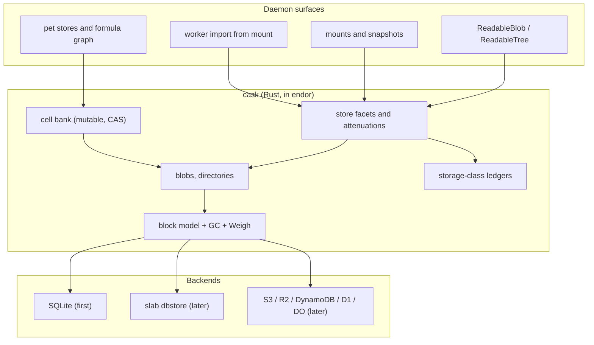

# CASK in Rust as Endo's Content Store

| | |
|---|---|
| **Created** | 2026-09-28 |
| **Author** | Kris Kowal (prompted) |
| **Status** | Proposed |
| **Builds on** | [daemon-cas-management](daemon-cas-management.md), [daemon-content-store-gc](daemon-content-store-gc.md), [daemon-endo-rust-sqlite](daemon-endo-rust-sqlite.md), [endo-content-locators-magnet-urn](endo-content-locators-magnet-urn.md) |

## What is the Problem Being Solved?

Endo's durable storage is three loosely joined mechanisms, none of which is the
substrate the daemon actually needs:

1. **The blob CAS** is a directory of whole files named by their SHA-256
   (`store-sha256/{hex}`), with two parallel implementations
   (`@endo/daemon-cas` in JS; `rust/endo/src/cas.rs` in Rust) that disagree on
   the canonical tree serialization: JS hashes a sorted JSON array of
   `[name, type, sha256]` tuples; Rust hashes a
   `{"entries": {name: {type, hash, size}}}` object. The same tree has two
   identities depending on which side checked it in. Whole-file granularity
   means no structural sharing between near-identical blobs, no cheap range
   reads behind `byteRange` attenuation, and no incremental sync.
2. **The formula and pet-name store** is SQLite (`endo.sqlite`), written with
   `INSERT OR REPLACE` and no compare-and-swap, so concurrent writers
   last-write-win silently.
3. **Reference lifetime** is split between a sweep-time set-subtraction GC on
   the JS side ([daemon-content-store-gc](daemon-content-store-gc.md)), an
   in-memory refcount map with best-effort `.meta` sidecars on the Rust side,
   and a `cas-gc` verb whose live-root set is currently empty.

CASK is a content-addressed block store designed (and partially implemented in
Go) by the same author, whose data model already contains the things Endo is
missing: a uniform block format the GC can walk without parsing content,
content-defined chunking for structural sharing and locality of change, typed
references that distinguish immutable content from mutable capability-bearing
cells, an honest attenuation lattice over those references, and a
reducer-plus-CAS write discipline. CASK has not materially shipped anywhere, so
every detail of it is negotiable. This design redefines CASK to be Endo's
content store, in Rust, inside the `endor` supervisor, and makes it the
substrate Endo's virtual filesystem and per-principal storage accounting grow
on. It is a redefinition, not a port: section
[What CASK drops, keeps, and redefines](#what-cask-drops-keeps-and-redefines)
is explicit about the difference.

A companion design,
[storage-compare-and-swap](storage-compare-and-swap.md), specifies the
portable compare-and-swap capability this design depends on and its
realizations across local filesystems, SQLite, and cloud stores.

## Overview



The store lives in the Rust supervisor behind the seams that already exist for
it: the `cas-*` control verbs of
[daemon-cas-management](daemon-cas-management.md) and the JS
`makeContentStore()` call site that document's Phase 5 reserved for exactly
this swap. Above the block layer, the store exposes typed structures (blobs,
directories, cells) and capability facets; below it, a backend trait admits
SQLite first and other stores later.

## Data model

### Blocks

Everything durable is a block. The Endo profile of CASK's block:

- **Body**: up to 4096 bytes, laid out as `links` (N times 32 bytes, at the
  start) followed by `bytes` (dataLen bytes).
- **Metadata footer** (16 bytes, stored beside the body, not inside it):
  `height` (u64 BE), `numLinks` (u8), `dataLen` (u16 BE), `class` (u8, the
  storage class of section
  [Storage classes and metering](#storage-classes-and-metering)), 4 reserved
  bytes.
- **Address**: SHA-256 over the occupied portion only
  (`numLinks * 32 + dataLen` bytes). Trailing padding is never hashed. The
  all-zero hash is the universal absent sentinel.

CASK classic fixed the body at 1024 bytes so one block fit one UDP datagram.
Endo drops CASK's network layer entirely (OCapN owns transport), so the MTU
constraint goes with it; 4096 quadruples fan-out (up to 102 links per interior
block), quarters tree height and block count for the same content, and matches
common page and filesystem block sizes. What the fixed small block still buys,
and why this design keeps it rather than storing whole values:

- **Content-agnostic GC.** Links sit at a fixed position in every block, so
  the collector walks reachability without parsing any structure, the property
  CASK's design contrasts with Git's header-parsing GC.
- **Structural sharing.** Two near-identical snapshots or package trees share
  every unchanged subtree.
- **Uniform accounting.** `Weigh(root)`, the subtree block count, is a single
  primitive that prices any structure for quota and rebate purposes.
- **Bounded write amplification.** Editing a value touches one leaf-to-root
  path, order log n blocks.

### The named typed pointer, extended to formulas

CASK's unifying record is `name -> (mode, reference)` where the reference is
always 32 bytes and the 2-byte mode says how to interpret it. Endo adopts this
record and widens the reference namespace, because Endo formula numbers are
already 256-bit values: a reference is one of

| Mode class | Reference is | Dereference | GC edge |
|---|---|---|---|
| immutable (blob, dir, exec, symlink) | content hash | load by hash | strong (retains subtree) |
| cell (rw, ro, path-scoped rw, path-scoped ro) | cell ID (random, opaque) | through the cell bank | weak (names, does not retain; the cell bank retains the cell's current value) |
| formula (capability slot) | Endo formula number | through the daemon's formula graph, subject to the holder presenting the corresponding capability | weak into content GC; a strong pin in the formula graph's own GC (see below) |

The formula mode class is the redefinition that makes CASK model "exactly what
Endo needs, including embedded capabilities": a directory or record stored as
content can carry named references to live Endo capabilities without breaking
content addressing and without leaking authority. The stored 32 bytes are the
formula number, which is data; the authority lives in the daemon's formula
graph and is only reachable by a holder the daemon recognizes. Hashing such a
node is safe (a formula number is unguessable but its knowledge alone confers
nothing across the daemon boundary; possession of a store facet does not
confer `provide`), and two trees embedding the same capability share
structure.

GC treats the three edge kinds differently: immutable edges retain; cell edges
do not retain the cell (a deleted cell fails at resolution time, CASK's
documented semantics); formula edges do not retain content but are reported
outward, because the *formula graph's* collector must treat "a live content
tree names formula F" as a root for F. This is the inverse of today's
arrangement, where formulas are roots for content; with capability slots the
two graphs reference each other, and each collector reports its cross-edges to
the other. Section [GC and lifetime](#gc-and-lifetime) makes this concrete.

### Blobs

Large content uses CASK's CAT: a content-defined chunked Merkle tree.

- Leaves are height-0 blocks holding at most 4096 content bytes; chunk
  boundaries come from a rolling hash whose state is never reset at a
  boundary, so an edit re-locks the chunking within a short distance and only
  the touched chunks change identity.
- Interior nodes hold child links plus a table of per-subtree sizes. Endo
  widens CASK's u32 size entries to u64: with 40 bytes per child entry
  (32-byte link, 8-byte size) an interior block holds up to 102 children, and
  a blob's size is unbounded rather than capped at 4 GiB. Snapshot archives
  and media exceed 4 GiB today; do not build the cap in.
- The size tables give order-log-n random access, which is what serves
  [readableblob-range-attenuation](readableblob-range-attenuation.md):
  `byteRange` on a stored blob reads only the chunks the interval touches,
  instead of `readRange` seeking in a flat file.

**Public identity stays the flat SHA-256 of the full content.** The CAT root
hash is an internal storage locator; the store maintains an
`identity -> root` index, verified at check-in. Rationale: every existing
`readable-blob` formula, every magnet `xt=urn:endo-blob:` locator, and every
peer that verified content by hashing the bytes it received names blobs by the
flat digest. Changing the public identity would invalidate all of them for an
internal storage benefit. The tree case is different: Decision 11 of
[endo-content-locators-magnet-urn](endo-content-locators-magnet-urn.md)
explicitly reserved the right to change the canonical tree serialization when
CASK is integrated, and this design exercises it (next section). See Open
questions for the alternative.

### Directories and the virtual filesystem

The canonical tree encoding becomes the CASK compact directory: a name-sorted
streaming Merkle tree whose leaf entries are `(mode, nameLen, name)` with each
entry's reference in the positionally parallel link slot. This is the encoding
CASK benchmarked as 40 to 70,000 times faster than its table alternative at
directory sizes up to 1000 entries, and it retires both existing JSON tree
formats at once, resolving their identity divergence with a single format that
both sides compute in one place (Rust). The adaptive escape to a table layout
for directories beyond ten thousand entries is deliberately out of scope until
a consumer demonstrates the need.

The mode field is what makes this a virtual-filesystem substrate rather than a
file manifest: an entry can be a blob, a subdirectory, an executable, a
symlink, a cell (a mutable subtree: the natural representation of a writable
mount or a pet store), or a formula slot (a capability by name). One encoding
then covers, in increasing order of ambition:

1. `readable-tree` snapshots (immutable entries only), replacing
   `checkinTree`'s JSON,
2. mount snapshots per
   [daemon-mount-capabilities](daemon-mount-capabilities.md), unchanged
   contract (per-file consistency, no per-tree guarantee),
3. writable virtual directories: a cell whose value is a compact dir; a write
   rebuilds the leaf-to-root path and CASes the cell,
4. pet stores as virtual directories whose entries are formula slots, giving
   "snapshot my whole namespace at a hash" and structural sharing between
   snapshots of slowly changing namespaces.

Levels 1 and 2 are in scope for this design's phases. Levels 3 and 4 are the
virtual-filesystem unification; the design commits to the encoding being
sufficient for them but leaves their adoption as an open question, because
moving pet stores off SQLite rows is a maintainer-scale architectural
decision.

### Structures deferred

CASK also defines maps, sets, arrays, adaptive-width integer arrays, sorted
arrays, big-integer arrays, allocators, and heaps, all as block trees, plus a
reducer discipline (every mutation is a pure function from root hash and
arguments to new root hash) and an operational-transform encoding for array
edits. The Rust crate should keep the door open (the block model and reducer
signature are shared machinery), but no structure beyond blob, dir, and cell
is surfaced until a consumer exists. The first candidate consumer is the
append-only storage class (a sorted-array or log structure for journals);
that decision belongs to the phase that builds it.

## Capability surface

### Facets and attenuations

The store is never one object. It is a family of facets over one block store,
following CASK's finding that the honest attenuations are the ones information
hiding can enforce:

- **`ContentStore`** (full): `store`, `fetch`, `has`, `storeTree`, `weigh`,
  plus retention (`pin`, `release`) and administrative GC.
- **`ContentReader`**: `fetch`, `has`, `weigh` only. Honest because a content
  hash is transparent: anyone holding both the hash and any fetch-capable
  facet can read, so read restriction happens by withholding fetch-capable
  facets, not by tagging hashes.
- **Subtree facet**: a reader or store scoped under a directory cell by a path
  descriptor (CASK's cell-path descriptor: cell ID in a link slot so GC keeps
  the cell alive, path segments as data, no `..`). This is the `chroot` of
  the store world and composes with
  [agent-tools-mount-fs-tools](agent-tools-mount-fs-tools.md)-style consumers.
- **Quota-bound store**: a store facet carrying a storage-class ledger
  reference; every admission debits it (next section). Attenuation by budget.
- **Append facet**: `append` only, no `fetch`, for the append-only class.
  Honest because appending needs no read of prior state (unlike CAS writes,
  which imply read; CASK's analysis that write-only cells are dishonest
  stands, and this design does not offer write-only cells).
- **Cell facets**: per cell, read (`get`), write (`get` + `casWrite`), and
  their path-scoped forms; the four-point lattice CASK implemented as entry
  types. Observation (subscribe to cell changes) is a follow-up, aligned with
  whatever `@endo/exo-stream` pattern
  [mount-stream-glob-grep](mount-stream-glob-grep.md) lands.

Three gates stand between an actor and bytes, the Endo mapping of CASK's
three-gate access: hold a facet at all (Endo capability discipline, in place
of CASK's membership gate), the facet's scope and budget (attenuation), and
content addressing itself (you fetch only what you can name). CASK's
cryptographic bearer tokens, planned for its own wire protocol, are dropped
entirely: OCapN remotables are Endo's unforgeable references, and inventing a
parallel token system would be a second authority path to audit.

### Crossing OCapN

Content crosses peers by value through the existing content-locator plane:
`magnet:?xt=urn:endo-blob:{sha256}` unchanged; `urn:endo-tree:` now names a
compact-dir root hash (the Decision 11 change). Range and subtree attenuations
compose with locators the way `byteRange` already does: the attenuated facet
serves the narrowed bytes, and the digest a locator carries is of the
selection.

Cells and facets cross peers by reference as ordinary remotables. A cell does
not have a portable "swiss number plus routing hints" form in this design;
CASK sketched one for its own protocol, and OCapN's third-party handoff is the
Endo-native answer. Cross-peer cell replication and block-level sync
(CASK's SDIF/SOPS diff protocol) are explicitly future work; the export/import
forms are locators and archives until then.

## Storage classes and metering

Endo should meter storage classes separately, and the store is where the
classes live. Each block carries its class in the metadata footer; each
principal (per the per-principal sharding direction) holds ledgers per class.
`Weigh` prices subtrees in blocks; bytes-at-rest is blocks times block size,
so one integer unit serves both.

| Class | Write | At rest | Reclaim | Intended contents |
|---|---|---|---|---|
| **Block** | compute price per write within the allocation | pay to grow the allocation (reserved capacity, charged whether used or not) | releasing allocation stops the growth charge | worker heap stores ([ironhorse-snapshot-store-seam](ironhorse-snapshot-store-seam.md) SQLite files), scratch mounts, anything with fixed-capacity update-in-place economics |
| **Content** | pay per block stored (dedup means a block shared with an existing tree costs its pin, not its bytes) | free while pinned (already paid) | GC compute at compute prices; **rebate** credited per block actually reclaimed at sweep | blobs, trees, snapshots-as-content, package trees |
| **Append** | cheap per-block append price | tiered: hot, then automatic roll-up to archive tier at a coarser price | bulk collection by epoch (whole generations dropped at once, the GEFS deadlist idea), no per-block GC | journals, telemetry, chat and event logs |
| **Ephemeral** | free or nominal | TTL-bounded, evicted by deadline | automatic | staging (nursery), session scratch |

Accounting rules that keep the classes honest:

- **Admission control, not rollback.** A write is admitted only if the ledger
  covers its worst case, the same pattern
  [daemon-xs-worker-metering](daemon-xs-worker-metering.md) uses for cranks
  (deliver only when budget covers the hard limit). No embargo or unwind
  machinery.
- **Rebates settle at sweep, not at release.** Releasing a pin is a claim;
  the collector's report is the fact. Crediting at release would let a
  principal release, get credited, and re-pin before the sweep (double
  spend). The rebate for a shared block goes to the releasing principal only
  when the last pin drops and the block is actually reclaimed; until then
  release only stops any at-rest charges.
- **Dedup pricing is per-pin.** Storing bytes the store already holds costs
  the pin bookkeeping, not the bytes; this makes structural sharing an
  incentive rather than an accounting hole (two principals each pay a pin,
  the store holds one copy, each gets a rebate when they release and the
  block is reclaimed after the last release).
- **GC compute is metered work.** Mark and sweep run on the supervisor and
  are charged at compute prices to the class's pool, amortized across the
  principals whose roots the pass traversed, in proportion to `Weigh`.

The price schedule itself (the exchange rates between allocation growth,
writes, compute, and rebates) is policy, not mechanism, and is an open
question; the mechanism is the per-class ledgers, admission checks, and
sweep-time settlement above. Ledgers live beside the meter state the worker
metering design already keeps in the supervisor, and are exposed through the
same `controlPowers` style verbs (`storage-ledger-query`, `storage-set-quota`,
and kin).

## GC and lifetime

Reachability replaces refcounts. The three current mechanisms (JS sweep-time
set subtraction, Rust in-memory refcounts with `.meta` sidecars, empty-rooted
`cas-gc`) collapse into one mark-and-sweep over the block graph, with:

- **Roots**: the cell bank (every cell's current value is retained, CASK's
  core retention rule: a tree is retained exactly while its root is some
  cell's value, and a CAS atomically transfers retention); the pin set
  (explicit pins from formulas: every `readable-blob` and `readable-tree`
  formula's content identity is a pin, registered at formulation and dropped
  by the formula graph's collector when the formula is collected, which
  preserves the observable behavior of
  [daemon-content-store-gc](daemon-content-store-gc.md)); and suspended-worker
  snapshot exports.
- **Cross-edges reported, both directions**: content GC reports formula slots
  found in live trees to the formula collector (they are roots for formulas);
  the formula collector reports content pins to content GC (they are roots
  for content). Each side treats the other's report as an input, and a
  combined pass reaches a fixpoint in at most a few alternations because the
  edges only add roots, never remove them mid-pass.
- **CASK's install-after-store discipline**: a root (cell value, pin) is
  published only after every block reachable from it is durably stored. Mark
  follows only blocks that load; a missing block under a live root is a
  storage-integrity error, never garbage.
- **Concurrent collection with a quarantine**: writes during a pass land in a
  quarantine that the sweep cannot touch and that flushes after the pass,
  CASK's concurrent-GC invariants adopted wholesale (root atomicity,
  install-after-store, snapshot safety, epoch monotonicity, link integrity,
  quarantine visibility). On the SQLite backend the quarantine is a
  same-database staging table and the sweep is a transaction, which is the
  main reason SQLite is the first backend.
- **Append class exempt from mark**: append generations are reclaimed by
  epoch tombstones, never traversed.

Snapshots deserve a boundary statement, because
[ironhorse-snapshot-store-seam](ironhorse-snapshot-store-seam.md) already
rejected (its Alternative 3) putting the live heap page store inside the CAS:
per-checkpoint retain/release churn through content GC was the reason. This
design honors that rejection. The live heap store stays a heap store; CASK is
the **archive, migration, and sharing** form of a snapshot (the seam design's
own split), where a suspended worker exports as content-class blocks and gains
structural sharing between successive exports of a slowly changing heap, which
whole-file snapshot blobs cannot give. The heap store's own SQLite file is
block-class storage for accounting purposes.

## Compare-and-swap

Every mutation in the system bottoms out in one primitive:

```
casWrite(target, expected, next) -> { ok: boolean, current }
```

with create-if-absent and delete expressed through an absent sentinel, cell
values as the target in the common case, and the failure, ambiguity, and
idempotence semantics specified in the companion design
[storage-compare-and-swap](storage-compare-and-swap.md), together with its
realizations on local filesystems, SQLite, S3, DynamoDB, Cloudflare Durable
Objects, D1, and R2. Two Endo-side commitments belong in this document:

- **Formula and pet-store writes route through it.** Today's
  `INSERT OR REPLACE` formula writes and pet-store bindings become CAS writes
  (on the SQLite backend, a conditioned UPDATE in a transaction), ending
  silent last-write-wins on the daemon's own metadata. This lands with the
  cell bank, whether or not pet stores move onto CASK dirs.
- **Batch is CAS on a composite root.** Multi-structure atomicity is achieved
  the CASK way: recompute each child root, then one CAS on the enclosing
  root. No multi-key transaction surface is exposed, so every backend the
  companion design covers can implement the portable contract.

## Rust architecture

### Crates

Inside the existing root workspace, beside `rust/endo`:

- **`rust/endo/cask-core`**: the block model, hashing, CAT blobs, compact
  dirs, cell records, reducer signatures, `Weigh`. Pure, `forbid(unsafe_code)`,
  no I/O, no C; property-tested against fixture vectors so the Go
  implementation's structures can cross-check where formats coincide.
- **`rust/endo/cask-store`**: the `BlockStore` backend trait (get, put,
  has, list, delete, and a transactional `commit` batch), the GC (mark,
  sweep, quarantine), pins, ledgers, and the SQLite backend (on `rusqlite`
  `bundled`, the dependency the workspace already carries; WAL, one
  connection per thread, the settings
  [daemon-endo-rust-sqlite](daemon-endo-rust-sqlite.md) established). A
  later flat-file slab backend (CASK's dbstore layout: block slab, parallel
  meta, Robin Hood hash index, per-writer WAL) is the escape hatch where
  SQLite is unavailable or measured too slow; it is a backend, not the
  foundation.
- **Cloud backends** (later phases, feature-gated): S3/R2, DynamoDB, D1,
  Durable Objects, each pairing a block backend with the companion design's
  CAS realization for that platform.

Choosing SQLite first knowingly revisits
[daemon-cas-management](daemon-cas-management.md)'s rejection of SQLite for
store metadata. That rejection weighed a metadata sidecar for thousands of
whole-file entries; this store holds millions of 4 KiB blocks needing
transactional multi-block commit, an indexed hash lookup, and a quarantined
sweep, exactly the workload
[ironhorse-snapshot-store-seam](ironhorse-snapshot-store-seam.md) chose SQLite
for. The daemon already runs SQLite on every platform it supports.

### Boundary with the JS daemon

No new boundary. The two seams that exist are the two that are used:

- **Supervisor control verbs**: the `cas-*` family of
  [daemon-cas-management](daemon-cas-management.md) keeps its envelope shapes
  (`cas-store`, `cas-fetch`, `cas-has`, the streaming pair, `cas-store-tree`,
  `cas-gc`) and gains `cell-*` (alloc, get, cas-write, delete),
  `storage-ledger-*`, and `weigh`. The Rust store implements them; JS
  `makeContentStore()` keeps its signature and becomes the verb client, the
  Phase 5 swap the current code comments already promise
  ("without changing the call site").
- **XS host functions** for the in-process XS daemon path, following the
  `sqlite.rs` pattern (handle maps, JSON values at the FFI with tagged bigint
  and bytes), so `bus-manager-rust-xs.js` stops driving the JS store through
  file powers.

Not chosen: wasm (the store needs the filesystem and the platform SDKs; wasm
remains right for `ocapn_noise`-style pure computation) and a sidecar process
(the supervisor is already the process that owns state). On pure-Node
deployments without `endor`, the JS `@endo/daemon-cas` store remains as the
degraded whole-file mode; it is not extended with CASK features, and the
long-term expectation is that platforms wanting CASK semantics run a
supervisor.

## Ownership map

| Boundary | Mechanism | Policy | Durable state | Commit authority | Value crossing |
|---|---|---|---|---|---|
| JS daemon <-> Rust store (verbs / host functions) | Rust store executes verbs | JS daemon decides what to store, name, pin | Rust owns blocks, cells, pins, ledgers | Rust: a verb reply means durably committed | content bytes, hashes, cell IDs, ledger readings |
| formula graph <-> content GC | each collector marks its own graph | daemon owns collection cadence | formula graph in `endo.sqlite` (daemon); blocks in the store (Rust) | each side commits its own sweep; cross-edge reports are inputs, not commands | root sets (hashes outward, formula numbers inward) |
| worker heap store <-> CASK | heap store owns live pages | supervisor owns suspend/export timing | heap store owns the live DB file; CASK owns exported snapshots | heap store commits checkpoints; CASK commits exports | canonical snapshot export, keyed by logical root hash |
| store core <-> backend | backend executes batches | core owns GC, quarantine, class semantics | backend owns bytes at rest | core issues `commit`; backend's ack is durability | block batches, CAS operations |

Answering the four ownership questions: persistent content state is owned by
the Rust store behind the backend trait, and daemon metadata state by the
formula graph until and unless the open-question migration moves it; the
commit/discard decision for a write is the Rust store's transactional commit,
and for a snapshot export the supervisor's; restart/replay recovers from the
backend's durable state plus the install-after-store invariant (an
interrupted write can never be reachable from a published root); execution
classification stays with the supervisor's existing metering, with storage
ledgers as a parallel account, never a new execution class. Naming check: the
store's write result is a *commit acknowledgment* of storage, deliberately
not named for any worker or crank lifecycle concept.

## What CASK drops, keeps, and redefines

| Disposition | Items |
|---|---|
| **Drop** | casknet (Noise-IK UDP), casksock, the abandoned protocol v2, session and member tables, Raft and cluster provisioning, cryptographic bearer cap tokens, traffic classes, the telemetry span mechanism (the daemon's own tracing serves), the four-letter wire verb catalog |
| **Keep** | content addressing with bare 32-byte SHA-256 and the zero-hash sentinel; fixed-format blocks with footer metadata; CAT content-defined chunking with unreset rolling hash; compact directories; cells with CAS-transferred retention; the honest attenuation lattice (read-only and path-scoped only; write implies read; no write-only); reducer discipline; `Weigh`; install-after-store and the concurrent-GC invariants; the dbstore file layout (as a later backend) |
| **Redefine** | block body 1024 -> 4096 and size tables u32 -> u64 (MTU constraint gone, ambition constraint in); the reference namespace gains the formula mode class (embedded capabilities); bearer tokens -> Endo/OCapN capabilities; caskhead root -> the daemon's own root cell; GC gains storage classes, ledgers, admission, and rebates (CASK had no economics); public blob identity pinned to flat SHA-256 with the CAT root internal |

Migration from the current store is ingest-on-demand plus a background walk:
the file-per-hash `store-sha256/` directory remains readable (identity is
unchanged for blobs), each blob is chunked into the block store on first fetch
or by the walker, and trees are re-encoded to compact dirs with new hashes,
with formula bodies' `content` fields rewritten under the same formula number
(observable identity of the *formula* is what pet names bind). The old
directory is retired when the walker completes and a release ships with
dual-read removed. The Go implementation is left behind entirely; fixture
vectors, not linked code, carry the compatibility.

## Dependencies

| Design | Relationship |
|---|---|
| [daemon-cas-management](daemon-cas-management.md) | supplies the verb surface and Phase 5 swap point this design implements; its refcount GC and `.meta` sidecars are superseded by reachability GC |
| [daemon-content-store-gc](daemon-content-store-gc.md) | its observable behavior (content of collected formulas is pruned) is preserved; its sweep-time set subtraction is superseded |
| [daemon-endo-rust-sqlite](daemon-endo-rust-sqlite.md) | establishes the FFI pattern and the rusqlite dependency the store backend reuses |
| [storage-compare-and-swap](storage-compare-and-swap.md) | companion; portable CAS semantics and per-platform realizations |
| [readableblob-range-attenuation](readableblob-range-attenuation.md) | range facets are served by CAT size tables |
| [endo-content-locators-magnet-urn](endo-content-locators-magnet-urn.md) | blob `xt` unchanged; tree `xt` re-canonicalized per its Decision 11 |
| [daemon-mount](daemon-mount.md), [daemon-mount-capabilities](daemon-mount-capabilities.md) | snapshot check-in retargets to compact dirs; contracts unchanged |
| [daemon-worker-import-from-mount](daemon-worker-import-from-mount.md) | package trees as CAS trees become package trees as compact dirs; `fetch_from_tree` walks the dir |
| [ironhorse-snapshot-store-seam](ironhorse-snapshot-store-seam.md) | boundary honored: live heap store stays outside CASK; CASK is the export/archive form |
| [daemon-xs-worker-metering](daemon-xs-worker-metering.md) | admission-control pattern and `controlPowers` verb style reused for storage ledgers |

## Phased implementation

Suggested job basenames, not posted; each phase lands independently and the
first is deliberately small.

1. **`build-cask-core-crate`**: `cask-core` with blocks, hashing, CAT blob
   build/read, compact dir build/read/resolve, fixture vectors, property
   tests. No daemon wiring, no backend. Success: a CLI-less crate whose tests
   round-trip blobs and dirs and confirm chunking locality (editing k bytes
   changes order log n blocks).
2. **`build-cask-store-sqlite`**: `cask-store` with the backend trait, SQLite
   backend, pins, mark/sweep with quarantine, `Weigh`.
3. **`build-cask-daemon-swap`**: wire the `cas-*` verbs and XS host functions
   to the new store; `makeContentStore()` becomes the verb client; dual-read
   migration of `store-sha256/`; the canonical tree format switches (one
   coordinated hash change, per Decision 11); `cas-gc` gains real roots.
4. **`build-cask-cells-cas`**: cell bank, `cell-*` verbs, the portable CAS
   capability, formula and pet-store writes conditioned per the companion
   design.
5. **`build-cask-facets-metering`**: store facets and attenuations (reader,
   subtree, quota-bound, append), storage-class ledgers, admission, sweep
   rebates, `storage-ledger-*` verbs.
6. **`build-cask-cloud-backends`**: S3/R2 first (content class fits object
   stores naturally), then DynamoDB/D1/DO per the companion design's CAS
   table; align with the platform designs (aws-distributed-persistence,
   cloudflare-backend, per-principal-sharding) as they land, none of which
   has landed as of 2026-09-28.
7. **`design-endo-vfs-on-cask`**: a follow-on design, gated on the open
   question below, for pet stores and writable virtual directories as cells
   over compact dirs.

## Design Decisions

1. **Redefinition, not port.** CASK has not shipped; Endo's needs win every
   conflict. The Go implementation contributes formats and invariants as
   fixtures, not code.
2. **The store lives in the Rust supervisor** behind the existing verb and
   host-function seams. Considered and rejected: wasm (needs platform I/O)
   and sidecar (the supervisor already owns state).
3. **Block body 4096 bytes, u64 size tables.** The 1024-byte MTU rationale
   died with casknet; ambition forbids a 4 GiB blob cap.
4. **Public blob identity is the flat SHA-256; the CAT root is internal.**
   Preserves every existing formula, locator, and peer verification. Tree
   identity changes once, under Decision 11 of the locator design.
5. **One canonical tree format, computed in Rust.** Retires the JS/Rust
   hash divergence.
6. **Reachability GC with install-after-store and quarantined concurrent
   sweep** replaces sweep-time set subtraction and refcount sidecars.
   Considered and rejected: durable refcounts (CASK's and
   daemon-cas-management's own analyses both ended at sweep-time counting;
   cross-edges with the formula graph make counting wrong in both
   directions).
7. **Formula-mode references (capability slots) in content.** Embedded
   capabilities without breaking content addressing; cross-edge reports keep
   both collectors sound.
8. **No bearer tokens.** OCapN remotables are the only unforgeable
   references; CASK's token plans are dropped, its structural entry-type
   attenuation kept.
9. **Storage classes are block metadata plus per-principal ledgers**, with
   admission control (the metering design's pattern), sweep-settled rebates,
   and per-pin dedup pricing.
10. **Live worker heaps stay out of the CAS** (the snapshot seam's
    Alternative 3 rejection honored); CASK is the snapshot export, archive,
    and sharing form.
11. **SQLite is the first backend; the dbstore slab is a later backend.**
    Revisits daemon-cas-management's SQLite rejection because the granularity
    changed from thousands of files to millions of blocks needing
    transactional commit.
12. **Batch atomicity is CAS on a composite root**, never a multi-key
    transaction surface, so every target platform can implement the portable
    contract.
13. **Mermaid diagrams and this document's structure** follow the repository
    design conventions; the operational vocabulary (pin, release, weigh,
    admit, rebate) avoids worker-lifecycle terms by construction (ownership
    map, naming check).

## Open questions

1. **Should the virtual-filesystem unification proceed: pet stores and
   writable directories as cells over compact dirs (levels 3 and 4 of the
   directory section)?** The encoding is designed to support it and phase 7
   sketches the design job. It moves the daemon's namespace metadata from
   SQLite rows into CASK structures, buying namespace snapshots and
   structural sharing at the cost of a second migration. Recommendation:
   yes, but as its own design after phase 4 proves cells.
2. **Blob public identity: is pinning to flat SHA-256 (Decision 4) the
   permanent answer, or should the CAT Merkle root eventually become a
   second-class public identity (a distinct `urn:endo-cat:` locator kind)
   for streaming verification and block-level sync with peers?** Flat
   digests cannot verify a partial transfer; a Merkle identity can. Carrying
   both forever is an index entry per blob, not a fork, so this can be
   deferred, but the locator grammar reservation is worth deciding now.
3. **The price schedule.** Mechanism (ledgers, admission, rebates,
   per-class accounting) is settled above; the exchange rates between
   allocation growth, content writes, GC compute, rebates, and roll-up
   tiers, and whether prices are global or per-host policy, are economic
   policy for the maintainer.
4. **Append-only class representation: reuse CASK's sorted-array/log
   designs or a simpler generation-file scheme?** Affects phase 5 scope
   only; the class semantics (epoch reclaim, roll-up) are settled either
   way.

## Prompt

> Port CASK to Rust, inside Endo. Every design detail is flexible: CASK has
> not materially shipped anywhere and can be redefined to serve Endo's needs.
> Shape CASK's data model to fit Endo's, and shape Endo to surface CASK's
> specialized content capabilities (for example attenuations on content
> stores, and possibly CASK's fancier content-stored data structures). The
> most interesting virtue: CASK can model exactly what Endo needs from a
> content-addressed store, including embedded capabilities, and be a better
> substrate for Endo's virtual filesystem. Do not limit ambition to current
> needs. In particular, Endo should be able to meter storage classes
> separately: block storage (pay to grow an allocation; pay compute prices
> for writes within the allocation); content storage (pay for writes; pay
> compute prices for garbage collection; rebates for released storage);
> append-only storage (pay for writes; bulk collection; or tiered automated
> roll-up or archive); and other classes the design finds natural. Somewhat
> orthogonal but related: Endo needs better compare-and-swap facilities for
> writing values into storage, and CAS semantics may differ across
> filesystem and storage platforms (local FS, SQLite, S3 conditional writes,
> DynamoDB conditional expressions, Cloudflare Durable Objects / D1 / R2).
> Design a portable CAS capability and its per-platform realizations.
> (kriskowal, 2026-09-28)
