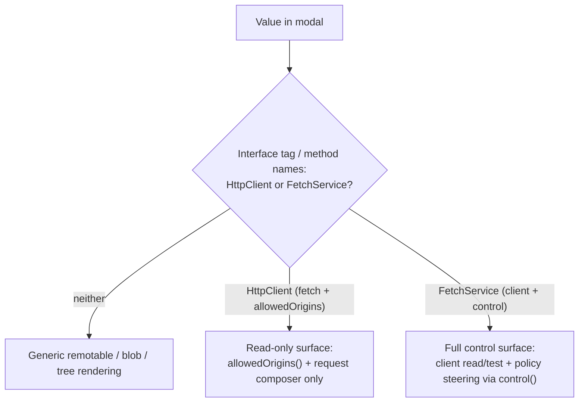
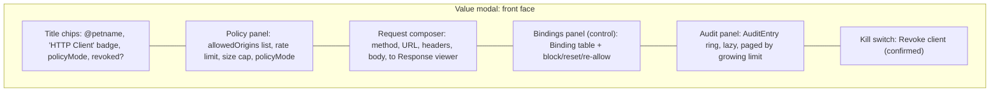

# Chat HTTP Controller UI

| | |
|---|---|
| **Created** | 2026-07-15 |
| **Updated** | 2026-09-04 |
| **Author** | Kris Kowal (prompted) |
| **Status** | Not Started |

## What is the Problem Being Solved?

The confined outbound-HTTP tier has no UI. The capability itself landed in
PR [#566](https://github.com/endojs/endo-but-for-bots/pull/566):
`@endo/exo-http-client`'s `HttpClient` / `HttpClientControl` facet pair over the
pure confinement core `@endo/http-confine`. A host can hold a `client()` facet
and a policy-bearing `control()` facet, but the only surfaces that read or steer
them today are the CLI (`endo http`, the parallel
[cli-http-client](cli-http-client.md) track) and the agent-tool adapter
(`makeHttpTool`). The provisioning that mints the pair is the landed `@endo/fetch`
plugin's `FetchService` (see § Grounding).

In Chat, an `HttpClient` capability shows up in the inventory like any other
pet-named value, and clicking it opens the [Value modal](formula-inspector.md),
which renders it as a bare `remotable` tag with no affordances. A host looking
at an HTTP client it granted cannot see what origins the client may reach,
adjust the allowlist or the rate/size limits, inspect or revoke
trust-on-first-bind (TOFU) pins, read the policy-decision audit log, revoke the
client outright, or test a request against the live policy without dropping to
the CLI.

This design makes the Value modal's **front face**, for a value the host
recognizes as an HTTP client or as the `FetchService` that mints one, a
**control surface** for that client: the `HttpClient` read/test methods plus,
when the viewer holds the matching `FetchService` (and thus its
`HttpClientControl`), the full policy-steering surface.

## Grounding in the Current Implementation

### The provisioning path is the landed `@endo/fetch` plugin, not a daemon formula

An earlier draft of this design grounded the surface on a daemon
`host.provideHttpClient` / `host.getHttpClientControl` mint plus an `http-client`
daemon formula (sketched under PR #661). That packaging is **not present in this
branch and has been superseded**. The base commit's own already-merged roadmap
records the change: [cli-http-client](cli-http-client.md)'s supersession banner
(2026-07-13) states that the `http-controller` / `http-client` formula pair, the
host `makeHttpClient` mint, and formula-owned policy are superseded by the
`@endo/fetch` unconfined-plugin model, per the maintainer's direction on PR
[#609](https://github.com/endojs/endo-but-for-bots/pull/609).

The next draft over-corrected: it re-grounded on a separate `@endo/confined-fetch`
package and a `ConfinedFetchService` exo, taking their `Not Started` status from
the sibling design [endo-fetch](endo-fetch.md)'s front matter rather than from the
base tree. Neither exists on `origin/llm`. What is actually landed is a **single
unconfined plugin**, `packages/fetch/` (`@endo/fetch`), and this design is
grounded on it:

- `@endo/fetch` is an **unconfined** base plugin. Its `make()` runs in a Node
  worker and adapts that worker's **ambient** `fetch` into the minted capability;
  there is no separate passable base `Fetch` capability that anyone holds or
  grants. The plugin is unconfined, but the capability it mints is confined
  (`packages/fetch/src/index.js`).
- Its `make()` constructs the `HttpClient` / `HttpClientControl` pair (via
  `makeHttpClientAndControl`, `@endo/exo-http-client`) over a **durable
  virtual-file-system store**, and returns a `FetchService` exo
  (`Far('FetchService', { client, control, help })`,
  `packages/fetch/src/service.js:155`). `client()` is the guest-facing
  `HttpClient`; `control()` is the integration-facing `HttpClientControl`.
- The plugin resolves its inputs **by name** through agent-shaped `powers`:
  `E(powers).lookup('fetch-store')` for the writable state directory, and the
  optional `E(powers).lookup('fetch-policy-authority')` for TOFU referral.
  Initial `allowedOrigins` / `maxRequestsPerMinute` / `maxResponseBytes` /
  `policyMode` arrive via `env`; thereafter the durable store, not `env`, is
  authoritative.

The provisioning integration is the host or daemon code that mints and retains
the service: it runs
`E(host).makeUnconfined(worker, '@endo/fetch', { powersName, resultName })`,
pins the result at `['@pins', 'fetch']` so `revivePins()` reincarnates it at boot,
retains the `FetchService` (and thus `control()`), and grants only `client()` to
a guest. A guest never receives the service, the state directory, or the control
facet.

`@endo/fetch` (`packages/fetch/`, with `src/{index,service,store}.js` and its
plugin/service tests) is **present on the base commit** `origin/llm`. The sibling
design [endo-fetch](endo-fetch.md) still carries a `Not Started` status field,
but the tree is authoritative and the package is landed. Consequently the
read-only Phase 1 and the control-bearing phases (2 and later) all rest on landed
code; what remains open is narrower and is not a package-landing gate but a
surfacing question: whether the `@pins`-pinned `FetchService` value is reachable
and clickable in Chat's inventory, and how one confined service is provisioned
per guest. That residual is called out in § Open Questions 1.

### The Value modal (`packages/spaces-util/src/value-component.js`)

`valueComponent($parent, powers, { enterProfile })` returns
`{ showValue, dismissValue, dispose }`. The modal is a flip card:

- **Front (recto) face** renders the passable value. Remotables get a bare tag
  unless `showValue` detects a *specialization*: `isBlobLike(value)` (a `text()`
  method) swaps in an inline blob preview; `isTreeLike(value)`
  (`list`/`lookup`/`sha256`) swaps in a live tree listing. Both detect the
  remotable's shape with `E(value).__getMethodNames__()` and both re-render the
  same `$valueMount` once the async probe resolves. The house type-inference
  idiom, `inferType` / `INTERFACE_TO_TYPE`
  (`packages/spaces-util/src/value-render.js:141-183`), reads the remotable's
  interface tag (`Alleged: HttpClient`, `Alleged: FetchService`) **synchronously**
  through `getInterfaceOf`.
- **Back (verso) face** renders the value's daemon **formula** record via
  `FormulaView`, reached with the `F` key, the header gear, or the flip button.
  It is deliberately **read-only** (kriskowal, 2026-06-13, on
  [formula-inspector](formula-inspector.md): "While one formula captures state,
  we do not need these to be user editable at this stage of development.").

Everything untrusted the modal renders (value content, blob text, formula
property values) reaches the DOM only as escaped text through `renderConfined` /
`valueToVnodes` vnodes, never `.innerHTML`. That **escaped-text confinement** is a
load-bearing invariant, not a nicety, and is a separate notion from the
capability confinement of the fetch plugin; where this document says "confined
vnodes" it means the DOM escaping, not the plugin.

The HTTP control surface is a **third front-face specialization**, structurally
the sibling of the blob and tree specializations: `showValue` detects the value,
and on a positive HTTP-client detection renders a dedicated control panel into
`$valueMount` in place of the bare remotable tag. It is a front-face treatment,
not a change to the read-only formula back face.

### The HTTP capability (`packages/exo-http-client/src/http-client.js`, #566)

Two facets, split by authority. `HttpClient`, the guest-facing read/test facet:

| Method | Returns | Notes |
|---|---|---|
| `fetch(url, options?)` | `HttpResponse` | Confined: origin-matched, rate-limited, size-capped |
| `allowedOrigins()` | `string[]` | The **effective** reachable set (see below) |
| `help()` | `string` | |

`HttpClientControl`, the integration-facing steering facet:

| Method | Returns | Notes |
|---|---|---|
| `inspect()` | `Policy` | The effective policy snapshot |
| `setAllowedOrigins(origins)` | `(none)` | Replace the static allowlist (can narrow or widen) |
| `addAllowedOrigin(o)` | `(none)` | Widen the static allowlist by one origin |
| `removeAllowedOrigin(o)` | `(none)` | Durable deny of `o` (drops it from the static allowlist, then `revokeBinding`s it); reversible by re-adding |
| `setMaxRequestsPerMinute(n)` / `setMaxResponseBytes(n)` | `(none)` | Positive-safe-integer only |
| `setPolicyMode(mode)` | `(none)` | Validates the mode string; accepts all four modes |
| `revoke()` | `(none)` | Permanent, durable kill switch |
| `isRevoked()` | `boolean` | Revocation query |
| `listBindings()` | `Binding[]` | Full binding table; `decidedBy` distinguishes static from TOFU pins |
| `revokeBinding(origin)` / `unpin(origin)` | `(none)` | Durable deny / clear a decision (both also drop the origin from the static allowlist) |
| `listAuditEntries({ since?, limit? })` | `AuditEntry[]` | `filter(at >= since).slice(-limit)` (see § Layout 5) |
| `help()` | `string` | |

`HttpResponse` (returned by `fetch`): `status()` / `statusText()` / `ok()`,
`headers()` / `url()` / `truncated()` / `maxResponseBytes()`, `text()` /
`json()`, `stream()` (a `PassableBytesReader` over the already-byte-capped body,
for large bodies), and `help()`.

`Policy` (the `inspect()` shape) is `{ allowedOrigins: string[],
maxRequestsPerMinute: number, maxResponseBytes: number, policyMode: string,
revoked: boolean }`. Its `allowedOrigins` is the **effective reachable set**: the
static allowlist **plus** any TOFU `Pinned-Allow` bindings, matching
`client.allowedOrigins()` (`http-client.js:874-883`). Which origins are static
versus TOFU-pinned is *not* legible from mere presence in `listBindings()`,
because the constructor pins every static origin as a `Pinned-Allow` binding
(`http-client.js:772`, `decidedBy: 'constructor'`); it is read off each
`Binding.decidedBy` (`constructor` / `controller` for static, `tofu-auto` /
`pending` and the other TOFU deciders for pinned). `Binding` is `{ target,
state ('Pinned-Allow' | 'Pinned-Deny' | 'Revoked'), decidedAt, decidedBy,
decisionMode, note? }`. `AuditEntry` is `{ at, target, fromState, toState,
decisionMode, decidedBy, context? }`. The exos enforce the origin-exactness and
`Number.isSafeInteger` rules. Note that the `HttpClient` facet carries no
revocation query: only `HttpClientControl.isRevoked()` and `inspect().revoked`
report revocation (see § The persistence boundary and § Loading and error
states).

The four `policyMode` values are defined by
[trust-on-first-bind](trust-on-first-bind.md) § Decision modes:

- **`strict`** (the default): unknown origins fail closed with no prompt.
- **`tofu-auto`**: an unknown origin is auto-`Pinned-Allow`ed with an audit entry
  and a reactive notification; it converts the allowlist into a write-once log,
  so it is never the default for an HTTP client.
- **`tofu-prompt`**: prompt the control holder and record the answer.
- **`tofu-attenuator`**: forward the decision to a separately-supplied attenuator
  capability.

`tofu-prompt` and `tofu-attenuator` require a `fetch-policy-authority` endowment
(§ Grounding); without one the plugin runs strict and those two modes fail closed.

### Durable policy on the fetch service's state directory

Under `@endo/fetch`, policy is **durable**, not session-scoped. The service owns a
private state directory on the virtual file system:

```
fetch-store/
  config.json    # allowedOrigins, maxRequestsPerMinute, maxResponseBytes,
                 # policyMode, revoked
  bindings.json  # origin -> state, decidedAt, source, note?
```

`HttpClientControl` mutations persist through that directory
([endo-fetch](endo-fetch.md) § Durable policy on the virtual file system): an
origin added, a limit raised, a mode changed, or a `revoke()` survives a daemon
restart. Revival is integration-owned (the service is pinned under `@pins` and
reincarnated at boot from the same `fetch-store`), so a revoked service revives
revoked. Only the rate-limit window and the audit ring are ephemeral: they are
bounded operational state, not durable policy.

Every durable mutation, including a request-time TOFU pin, is written back
through the service's `onPolicyChange(snapshot)` seam (`service.js`,
[endo-fetch](endo-fetch.md) § Durable policy), the invalidation event this UI
uses in § Keeping the view live.

This durability is the correction that most reshapes this design from the #661
draft. There is no live-versus-baked divergence to reconcile: `inspect()` is the
single authoritative, durable view of policy, and the surface can present edits as
persistent without qualification (see § Design Decisions 4).

## Capability and Authority Boundaries

The control surface's power is bounded by *which cap the viewer is looking
through*, and the UI must reflect exactly that, never more.



1. **Client / control split.** The `FetchService` holds both facets and exposes
   them through `client()` and `control()`. An integration grants a guest only
   `client()` (an `HttpClient`); it retains the service (or the `control()`
   facet). The policy-steering half of the surface therefore appears **only** for
   a viewer holding the `FetchService` (or its `control()`), which in practice is
   the host that provisioned it. This is the same authority split the git-remote
   grant uses (see [daemon-git-remotes](daemon-git-remotes.md)), surfaced in the
   UI for the first time.

2. **The steering surface is control-only.** When Chat runs under a guest profile
   (an "enter profile" descent, `enterProfile`), the value in the guest's petstore
   is a bare `HttpClient`: it exposes `fetch` / `allowedOrigins` / `help` and
   nothing else. The UI must feature-detect `control()` (or a resolvable
   `HttpClientControl`), not assume it, and degrade to the read-only client view
   when it is absent.

3. **A foreign client yields no control.** A client received over CapTP from a
   peer, or minted by a different host, arrives as a bare `HttpClient` with no
   associated `FetchService` in this host's reach. The viewer sees
   `allowedOrigins()` and may test `fetch` (subject to the remote policy) but gets
   no steering controls. Read-only is the boundary, never an error to surface
   loudly.

4. **Editing bounds is an authority-widening act.** `addAllowedOrigin`,
   `setAllowedOrigins`, `setMaxResponseBytes`, `setMaxRequestsPerMinute`, and
   `setPolicyMode` expand or relax the client's reach. Each edit is an explicit,
   visibly labeled control action committed only on an explicit user action:
   never on tab-out blur or a bare `<select>` change (§ Modal interactions);
   `revoke()` (permanent and durable) is confirmed before it fires. The surface
   never widens authority as a side effect of merely *viewing*. Durable
   *narrowing* acts carry the same confirm bar: a **Block** (`removeAllowedOrigin`
   / `revokeBinding`) and a **Reset** (`unpin`) that would delete a static
   (`constructor` / `controller`) origin from the allowlist are as durable as a
   widening edit (under `strict` the origin then fails closed), so each is
   confirmed with copy that states the outcome, not left as a one-click act.

5. **The request composer can widen authority in a TOFU mode, and says so.** In
   `strict` mode, `fetch` to an off-allowlist origin fails closed and the composer
   adds no authority: every request is re-parsed, exact-origin-matched,
   rate-limited, size-capped, and run with redirects disabled by the exo. But in a
   `tofu-auto` mode a `fetch` to an unlisted origin runs the exo's `decide()` path
   and **durably pins** a `Pinned-Allow` binding (`http-client.js` `decide()` ->
   `setBinding()`), permanently widening the guest's reach, from the *same*
   `client()` the guest holds, and against the *same* shared
   `maxRequestsPerMinute` budget. So the composer is not authority-neutral in a
   TOFU mode. The surface therefore treats a composer send to an origin **not in
   the effective allowlist** as an authority-widening act while the mode is
   `tofu-*`: it is confirmed ("This origin is not yet allowed; sending will
   durably pin it") exactly as an allowlist edit is (Boundary 4). In `strict` mode
   no confirm is needed because the send cannot mutate policy. A control viewer
   reads the mode through `inspect()` and gates the confirm on it; a **read-only
   viewer** (a bare `HttpClient`) cannot read the mode at all (Boundary 2), so it
   cannot know whether a send will pin, and therefore confirms *every*
   off-`allowedOrigins()` send. See § Design Decisions 3 and § Open Questions 3.

6. **Response and policy text is untrusted.** Response bodies and headers come off
   the network; `Binding.target` / `decidedBy` / `note` and `AuditEntry.decidedBy`
   come from policy decisions (in TOFU modes, influenced by the requesting guest).
   All of it renders through `renderConfined` vnodes as escaped text, the
   escaped-text confinement the rest of `value-component` already enforces.

### The persistence boundary

Because `@endo/fetch` persists policy to its private state directory, control
edits are **durable**: they survive a daemon restart, and a revoked service
revives revoked. On the happy path the front face's live `inspect()` and the
service's on-disk `config.json` do not drift, because `inspect()` reads the same
authoritative policy the service persists. The one gap: a persist is best-effort,
so a failed on-disk write is swallowed to a `console.error` and leaves `inspect()`
(and any durability copy read from it, the Revoke kill switch included) showing an
edit the disk did not keep. The surface therefore frames its persistence claims as
"durable" rather than "guaranteed on disk", and § Open Questions 5(d) files the
upstream ask for a persist-status query that would let it confirm the write.

Two ephemeral facts remain, and the UI must not overstate them as durable:

- The **rate-limit window** and the **audit ring** are in-memory operational
  state ([endo-fetch](endo-fetch.md) § Durable policy). The audit panel shows the
  current ring, not a durable log, and says so.
- A viewer holding only a bare `HttpClient` (guest or foreign) cannot read policy
  at all (no `inspect()`), so its read-only surface reflects only
  `allowedOrigins()` and reacts to policy changes only through subsequent `fetch`
  results. It must not imply it is showing durable, complete policy.

### Keeping the view live

`inspect()` is authoritative, but the front face holds a *snapshot* of it, and the
policy has **other writers**: the `endo http` CLI, `makeHttpTool`, the guest's own
TOFU-pinning `fetch`, and this surface's own request composer (in `tofu-auto`). A
panel rendered from a stale snapshot silently misreports policy. The surface
therefore re-`inspect()`s (and re-reads `listBindings()` / `listAuditEntries()`
for the expanded panels) on every event that can change policy *from this
surface*: after any own edit commits, on panel expand, and **after a composer send
resolves** (which may have pinned in `tofu-auto`). For writes by the other
co-writers it cannot observe, the surface offers a manual refresh affordance and,
if and when the integration surfaces the service's `onPolicyChange(snapshot)`
notifier to Chat, subscribes to it instead. The surface never claims the view
"cannot drift"; it names exactly what refreshes it.

## The Design

### Detection

`showValue`, in the same `inferredType === 'remotable'` branch that runs the
blob/tree probes, identifies the two HTTP shapes. It prefers the **synchronous**
interface tag (`inferType` / `INTERFACE_TO_TYPE`, `value-render.js`): a value
whose `getInterfaceOf` tag is `Alleged: FetchService` or `Alleged: HttpClient` is
classified with no async round trip and no probe flicker, and the tag survives
CapTP. Only when the tag is absent or generic does it fall back to an
`E(value).__getMethodNames__()` method-name probe, as the blob/tree
specializations do:

- `isFetchServiceLike(value)`: interface tag `FetchService`, or names include
  `client` and `control`. The full control surface applies; it recovers `client()`
  and `control()` from the service.
- `isHttpClientLike(value)`: interface tag `HttpClient`, or names include both
  `fetch` and `allowedOrigins`. The read-only client surface applies; the value
  *is* the client.

Preferring the interface tag raises the bar against Open Question 4's look-alike
concern: `Alleged: FetchService` is stronger evidence than the generic
`client` + `control` name pair, but a self-asserted `Alleged:` tag is entropy,
not authentication (a hostile remotable picks its own tag), so it does not by
itself answer Open Question 4 and steering stays gated on a resolved `control()`
whose `inspect()` succeeds. On a positive result it renders the surface into
`$valueMount` (replacing the bare remotable tag). Detection order: the
fetch-service shape is checked first, then the bare `HttpClient` shape, then blob/tree.
The detected shapes are disjoint (an HTTP client has neither `text` nor `sha256`),
so order determines precedence, not correctness. The async fallback path is guarded by the
same `currentValue === value` staleness check the blob/tree probes use, so a fast
re-`showValue` cannot cross-render.

### Layout

The control surface is one confined Preact component, `HttpControlSurface`,
rendered into `$valueMount`, composed of collapsible sections (mirroring the
inventory's collapsible-section idiom,
[inventory-grouping-by-type](inventory-grouping-by-type.md)). All state-bearing
sub-panels are their own components with their own hooks, so a re-probe remounts
cleanly.



**1. Header / status.** The existing title chips (`@petname`, unnamed) gain an
"HTTP Client" badge and a compact status line. When `control()` is available, the
line shows `policyMode`, `allowedOrigins` count, and a **Revoked** pill when
`inspect().revoked` is true. A read-only viewer (bare `HttpClient`) has no
revocation query, so its status line shows only the `allowedOrigins()` count and
omits the mode and the Revoked pill; revocation for that viewer is discovered
reactively (see § Loading and error states, "Revoked client").

**2. Policy panel** (control only). Renders `inspect()`:

- **Allowed origins**: a list of the **effective** reachable set. Because
  `inspect().allowedOrigins` folds in TOFU `Pinned-Allow` pins, each row is marked
  **static** or **TOFU-pinned** by reading its `Binding.decidedBy` from the
  cross-referenced `listBindings()` (`constructor` / `controller` is static,
  `tofu-auto` / `pending` and the other TOFU deciders are pinned): mere presence in
  `listBindings()` cannot tell the two apart, since the constructor pins every
  static origin (`http-client.js:772`). Each row offers a single, honestly-named
  action: **"Block"** (`removeAllowedOrigin`, which drops the origin from the
  static allowlist and `revokeBinding`s it to a durable `Revoked`), tooltip "Deny
  this origin; survives restart, reversible by re-adding it." The deny is durable
  but *not* irreversible: re-adding the origin re-allows it (`addAllowedOrigin`
  overwrites the `Revoked` binding, `http-client.js:903`), so a blocked row keeps a
  **"Re-allow"** affordance. "Block" is the *same verb* the Bindings panel uses for
  the same mutation (§ Layout 4); the surface never spells one mutation with two
  verbs. To clear a *TOFU-pinned* row, the row also offers **"Reset"** (`unpin`);
  because `unpin` also deletes the origin from the static allowlist and a `strict`
  service then denies it (`decide()` throws in `strict`), Reset is offered only on
  rows whose `decidedBy` is a TOFU decider, never on a `constructor` / `controller`
  static row where it would silently narrow authority. An "Add origin" input
  appends via `addAllowedOrigin`, validated client-side against the exo's
  origin-exactness rule (scheme + host [+ port], no path/query/fragment) so a bad
  entry is rejected before the round trip, with the exo error surfaced inline if it
  still rejects.
- **Max requests / minute** and **Max response bytes**: numeric inputs with an
  explicit **Apply** affordance (or Enter), never a blur commit, calling
  `setMaxRequestsPerMinute` / `setMaxResponseBytes`; both validated as positive
  safe integers client-side.
- **Policy mode**: a `<select>` over all four modes (`strict`, `tofu-auto`,
  `tofu-prompt`, `tofu-attenuator`), committed only on an explicit **Apply**
  confirm (widening from `strict` to a TOFU mode is the single largest reach
  change on the surface, so it never rides a bare `<select>` change event). The UI
  does **not** statically disable the prompt modes: whether a
  `fetch-policy-authority` is endowed is a provisioning fact the service does not
  report through `inspect()`, so hard-coding the enforceable set into view code
  would be wrong for a service that *does* have one wired. Instead, an unsupported
  mode selection falls into the inline exo/policy-error path (§ Loading and error
  states), and § Open Questions 2 records the upstream ask for `inspect()` to
  report its supported-mode set so the UI can render the true set rather than
  guess it.

  Read-only viewers (guest / foreign client) see this panel collapsed to the
  `allowedOrigins()` list with no edit affordances and a "read-only (no control
  authority)" note.

**3. Request composer** (client, always present). A form: `method` (`<select>`
over the seven `HTTP_METHODS`), `url` (text), optional `headers` (key/value rows),
optional `body` (textarea, enabled for POST/PUT/PATCH). "Send" calls
`E(client).fetch(url, options)` and renders the returned live `HttpResponse`
remotable in a **Response viewer**: `status()` + `statusText()` + `ok()`
(color-coded), `url()`, a `truncated()` banner when true (with
`maxResponseBytes()`), a `headers()` table, and the body via `text()` (with a
"Parse JSON" toggle calling `json()`; `stream()` is available for incremental
consumption of a large body). The URL input may autocomplete from the current
`allowedOrigins` to steer the user toward in-policy requests (advisory only). In a
`tofu-*` mode, a send to an origin outside the effective allowlist is confirmed
first because it will durably pin (§ Capability Boundaries 5). Response text is
confined vnodes.

**4. Bindings panel** (control). The binding table is the authoritative record of
every policy *decision*, `Pinned-Allow` / `Pinned-Deny` / `Revoked`, and the
Policy panel's effective allowlist shows none of the deny or revoke rows, so this
panel is available to any control viewer rather than gated on a `strict`-string
test or on a `tofu-*` mode. Both such gates are misleading: a `strict` service
still accrues `Revoked` and `Pinned-Deny` rows, and every static origin is already
a `Pinned-Allow` binding, so a "non-empty `listBindings()`" gate is always true.
It is collapsed by default and lazily loaded on expand. It renders a table
(target, state, decidedBy, decisionMode, `decidedAt` as a relative time, `note`).
Each row offers clearly labeled actions per its `state`:

- **"Reset"** (`unpin(origin)`), tooltip "Clear this decision and drop the origin
  from the static allowlist; it is decided again on next request, and denied at
  once under `strict`." Shown for every state, including `Revoked` (`unpin` deletes
  a `Revoked` binding too), so an accidental Block is recoverable. On a
  `constructor` / `controller` static row it narrows authority durably and is
  confirmed (§ Capability and Authority Boundaries 4).
- **"Block"** (`revokeBinding(origin)`), tooltip "Durable deny; survives restart,
  reversible by re-adding the origin." Shown for `Pinned-Allow` and `Pinned-Deny`
  rows; hidden on an already-`Revoked` row (already denied). This is the same verb
  and mutation as the Policy panel's origin "Block".

Lazily fetched on panel expand, and re-read after any composer send, Block, Reset,
or allowlist edit that can change the binding set (§ Keeping the view live).

**5. Audit panel** (control). `listAuditEntries({ limit })` renders a
reverse-chronological view of the in-memory audit ring (`at`, `target`,
`fromState -> toState`, `decisionMode`, `decidedBy`, `context.method`). Lazily
fetched on expand. The exo filters `entry.at >= since` and then takes
`.slice(-limit)` (`http-client.js:578-584`), so `since` is a *lower* bound that
narrows to the *newest* window: raising it cannot reach older entries. **"Load
older" therefore pages by growing `limit`** (its default is the whole ring),
re-reading and re-rendering the larger newest-`limit` slice, until the returned
count stops growing (the ring is exhausted). A one-line note states that the ring
is operational (in-memory) state, not a durable log, so it can be shorter than the
request history after a restart. (A true backward `until`/`before` window is an
exo affordance the facet lacks; § Open Questions 5 files it.)

**6. Kill switch** (control). A "Revoke client" button gated behind an inline
confirm. Confirm copy: **"Revoke: permanently stops all requests from this client.
This is durable across restart and cannot be undone."** On confirm, `revoke()`,
then re-`inspect()` to flip the header to the Revoked state and disable the
composer's Send. Because revocation persists (a revoked service revives revoked),
the copy's permanence claim is truthful, and the irreversibility is stated so the
user is not surprised.

### Accessibility

The modal already carries an accessibility idiom the surface reuses rather than
reinvents: an `#value-aria-live` polite region for announcements, `aria-label`ed
controls, open-time focus capture and restore, and `autofocus` (because the
confined renderer strips `ref`, `value-component.js`). The control surface extends
it to its new states:

- Each async panel announces its load and settle ("Loading policy...", "Policy
  loaded") and each per-panel error + Retry announces through `#value-aria-live`,
  so a screen-reader user is not left on a silent spinner.
- The revoke confirm, the composer's off-allowlist TOFU confirm, and the Revoked
  flip announce, and focus moves to the confirm affordance and is restored on
  dismiss.
- The Response viewer announces the outcome (`ok()` / error) rather than relying
  on color alone; every color-coded status also carries text.
- New controls (mode `<select>`, per-row Block/Reset, Add-origin, Apply) carry
  `aria-label`s and participate in the modal's focus order.

### Modal interactions

Per Chat Invariant 2 (Keyboard-Manual Parity) and Invariant 1 (Modeline
Completeness), every action has a pointer affordance and, where it earns an
accelerator, a modeline hint. Enumerated:

| Interaction | Trigger | Facet call | Notes |
|---|---|---|---|
| Open control surface | Click/inspect a client or service value | interface tag, then `control()` | Automatic on detection |
| Flip to formula | `F` / header gear / flip button | `getFormula(id)` | Existing back face; read-only |
| Add allowed origin | "Add origin" submit | `addAllowedOrigin` | Client-side origin validation first |
| Block an origin | Row "Block" | `removeAllowedOrigin` / `revokeBinding` | Durable deny (reversible by re-add); confirmed |
| Re-allow a blocked origin | Row "Re-allow" | `addAllowedOrigin` | Overwrites the `Revoked` binding |
| Reset a pinned origin | Row "Reset" | `unpin` | Confirmed when it narrows a static origin |
| Set limits | Numeric input + explicit Apply / Enter | `setMaxRequestsPerMinute` / `setMaxResponseBytes` | Positive-safe-integer validation; never on blur |
| Change policy mode | `<select>` + explicit Apply confirm | `setPolicyMode` | Never on bare select-change |
| Send request | Composer "Send" / Cmd+Enter in composer | `fetch` -> `HttpResponse` | Off-allowlist send confirmed in TOFU modes |
| Toggle response body as JSON | "Parse JSON" | `json()` vs `text()` | |
| Expand bindings / audit | Section header click | `listBindings` / `listAuditEntries` | Lazy |
| Load older audit entries | "Load older" | `listAuditEntries({ limit })` | Pages by growing `limit` |
| Revoke client | "Revoke client", then confirm | `revoke` | Permanent, durable |
| Close | `Esc` / Close / backdrop | (none) | Invariant 4; dirty-composer confirm |

`Esc` closes the front face (control surface included) as it does for any value,
**except** that the composer is the modal's first multi-field unsaved-work form
(method, URL, header rows, body): per Invariant 4 (Escape Consistency / "never
lose unsaved work without confirmation"), `Esc` on a **dirty** composer prompts a
discard confirm before closing; on a pristine composer it closes immediately, as
before. Accelerators added inside the composer (Cmd+Enter to Send, the platform
modifier per `handleKey`, Ctrl on non-Mac) follow the existing text-input guard in
`handleKey`, and this design **extends that guard to `SELECT`**: today it tests
`INPUT` / `TEXTAREA` / `isContentEditable` only (`value-component.js:1024-1027`),
so with the method or policy-mode `<select>` focused a window-level key (e.g. `F`
to flip) would leak through and flip the card out from under the user. Each
composer accelerator earns a composer-local modeline hint.

### Loading and error states

- **Detecting**: the interface tag classifies synchronously with no flicker; only
  the method-name fallback is async, and while it is in flight the value shows the
  default remotable tag and swaps in on resolution, same as the blob/tree probes.
- **Resolving control**: the client read view (header + composer + read-only
  policy list) renders immediately from `allowedOrigins()`; the steering controls
  appear once `control()` resolves. A brief "checking control authority..."
  affordance covers the gap.
- **No control authority**: the value is a bare `HttpClient` (guest / foreign), or
  `control()` is unavailable: read-only surface, quiet inline "read-only (no
  control authority)" note, no error toast.
- **`inspect()` / `listBindings()` / `listAuditEntries()` failure**: per-panel
  inline error ("Could not load policy: `<message>`") with a Retry, mirroring the
  back face's `renderBackFaceMessage` pattern; one panel's failure never blanks the
  others.
- **`fetch` rejection**: the Response viewer shows the exo error inline
  (off-allowlist origin, rate-limit exceeded, timeout, network failure),
  distinguished from an HTTP error *response* (a 4xx/5xx that still returns a
  `Response` with `ok() === false`). Both are expected, neither throws to the
  console.
- **Edit / mode rejection**: a `set*` / `add*` call the exo refuses (bad origin,
  unsafe integer, or a `policyMode` the plugin cannot enforce because no
  `fetch-policy-authority` is wired) surfaces inline next to the offending input;
  the displayed policy re-reads from `inspect()` so the panel re-syncs to exo
  truth.
- **Revoked client**: for a control viewer, `inspect().revoked` drives the Revoked
  pill, disables the composer's Send, and makes the policy panel read-only. For a
  **read-only viewer** (bare `HttpClient`, no `isRevoked()`), revocation cannot be
  detected proactively: the exo's only revoked signal is a prose
  `Error('HttpClient has been revoked')` (`http-client.js:833`) with no code or
  tag, so the first `fetch` after revocation rejects and the Response viewer
  recovers the state by **matching that message** and frames it as "This client
  has been revoked; no further requests will succeed", disabling Send from then on.
  This message-sniffing is an honest but fragile degradation for a facet with no
  revocation query; § Open Questions 5 files the ask for a tagged error. The
  surface never shows a false "live" state.
- **Value swapped mid-flight**: every async render is guarded by the
  `currentValue === value` / `currentId === id` staleness checks already used
  throughout `showValue`.

### Formula back face

The read-only formula back face is unchanged by this design. Under the `@endo/fetch`
model the durable policy lives in the service's state directory and is read
authoritatively through the front face's `inspect()`, so there is no separate
"baked policy" formula record to contrast against a "live" front face (the #661
draft's front-versus-back divergence does not arise under durable policy). If and
when the daemon exposes a formula record for a fetch plugin, its back face would
show the plugin's *provisioning* wiring (endowments, state-directory reference),
not a mutable policy snapshot; whether to add a `formula-view-registry.js` entry
for that is deferred to the provisioning path being surfaced to Chat
(§ Open Questions 1) rather than specified here against infrastructure that does
not yet exist.

## Test Plan

Sibling design [formula-inspector](formula-inspector.md) carries an explicit Test
Plan; this surface's real risk area (client-side validation versus
exo-authoritative rejection, TOFU binding transitions, the authority-widening composer
send, revoke-then-composer, the read-only degradation path) earns the same.

- **Unit: detection precedence.** `isFetchServiceLike` and `isHttpClientLike`
  against fixtures for a `FetchService` (interface tag / `client`+`control`), a
  bare `HttpClient` (`fetch`+`allowedOrigins`, no `control`), a blob, a tree, and a
  look-alike remotable exposing `fetch`/`allowedOrigins` (and one exposing
  `client`/`control`) without the interface tag. Assert the tagged service resolves
  to the full surface, the bare client to read-only, the disjoint shapes to their
  own specializations, and that the interface tag is preferred over the method-name
  fallback.
- **Unit: client-side validators mirror the exo.** Origin-exactness and
  positive-safe-integer validators accept exactly what the exo accepts and reject
  what it rejects, over a table of edge cases (path/query/fragment present, bad
  scheme, non-integer, zero, negative, unsafe integer).
- **Integration: read-only degradation.** With a bare `HttpClient` value, the
  surface renders header + composer + read-only origins list, shows the "read-only
  (no control authority)" note, and exposes no steering affordances.
- **Integration: control edits and durability framing.** With a `FetchService`, an
  added origin / raised limit (via Apply) / mode change (via Apply confirm)
  round-trips through `control()` and the re-read `inspect()` reflects it; assert the UI
  presents the edit as persistent (no session-scoped caveat), that a limit input
  does *not* commit on blur, and that a simulated restart preserving the state
  directory shows the same policy.
- **Integration: the composer widens authority in TOFU and says so.** In
  `tofu-auto`, a composer send to an off-allowlist origin prompts the widening
  confirm; on confirm, the send resolves, a `Pinned-Allow` binding appears, and the
  re-read Policy/Bindings panels reflect the new pin (§ Keeping the view live). In
  `strict` mode the same send fails closed with no confirm and no pin.
- **Integration: effective-vs-static origins.** In a `tofu-*` mode with a pin, a
  static origin shows in the Policy panel marked "static" (its `Binding.decidedBy`
  is `constructor` / `controller`) and the TOFU-pinned origin shows marked
  "TOFU-pinned" (`decidedBy` is `tofu-auto` / `pending`); the pinned origin also
  shows in Bindings, and "Block" in either place performs the one `revokeBinding`
  mutation. Assert the marking is read off `decidedBy`, not off mere presence in
  `listBindings()` (which holds both).
- **Integration: audit paging grows the window.** "Load older" grows `limit` and
  reveals older entries until the count stops growing; assert it never simply
  re-renders the same slice.
- **Integration: bindings actions per state.** The Bindings panel shows "Reset" on
  every row (including `Revoked`, where `unpin` deletes the binding and recovers an
  accidental Block) and "Block" on `Pinned-Allow` / `Pinned-Deny` rows but not on
  an already-`Revoked` row, and each button calls the right facet method. The panel
  is available to any control viewer; assert a `strict` service that has accrued a
  `Revoked` row still shows it (the panel is not gated off on `strict`), and that a
  Block or Reset that narrows a static origin prompts a confirm.
- **Integration: fetch rejection versus HTTP error.** An off-allowlist URL and a
  4xx response render distinctly (exo error inline versus `ok() === false`
  Response), and neither throws to the console.
- **Manual checklist.** The "Revoked client" states for both viewer tiers (control
  viewer: Revoked pill and disabled Send; read-only viewer: message-matched
  fetch-rejection framing), the "Edit rejection" re-sync from `inspect()`, the
  dirty-composer `Esc` discard confirm, the `SELECT`-focused accelerator guard, the
  aria-live announcements, and the kill-switch confirm copy.

## Dependencies

| Design | Relationship |
|---|---|
| [formula-inspector](formula-inspector.md) | Owns the Value-modal flip-card, `getFormula`, and the read-only back-face contract this surface extends with a live front-face treatment. |
| [endo-fetch](endo-fetch.md) | The `@endo/fetch` unconfined-plugin model that provisions the `HttpClient` / `HttpClientControl` pair (as `FetchService.client()` / `control()`) and persists policy durably on the virtual file system. Its package is landed on `origin/llm` (its status field notwithstanding); this UI drives the resulting `FetchService`. |
| [trust-on-first-bind](trust-on-first-bind.md) | Defines the four `policyMode` values and the `fetch-policy-authority` endowment the prompt modes require; the Policy panel renders and steers them. |
| [http-confine](http-confine.md) | The confinement core whose origin-exactness and limit rules the policy panel validates against client-side. |
| [cli-http-client](cli-http-client.md) | The parallel `endo http` CLI control surface; this is its Chat-side sibling over the same `HttpClient` / `HttpClientControl` pair. Note its supersession banner is the roadmap record that redirected this design's grounding to `@endo/fetch`. |
| [daemon-git-remotes](daemon-git-remotes.md) | The prior instance of the same live-control-versus-read-only-client authority split, referenced in § Capability and Authority Boundaries. |
| [chat-invariants](chat-invariants.md) | Modeline completeness, keyboard-manual parity, Escape consistency, and state visibility the surface obeys. |

## Phased Implementation

1. **Read-only client view.** Detection (bare `HttpClient`) + header badge/status
   + `allowedOrigins()` list + request composer + Response viewer, including the
   reactive revoked-client framing. Works for both host and guest/foreign clients
   (no control dependency, rests only on landed #566). Ships the majority of the
   user value.
2. **Control policy panel** (gated only on how a `FetchService` reaches Chat, per
   § Open Questions 1; the `@endo/fetch` package itself is landed). `control()`
   recovery, `inspect()` render, allowlist/limit/mode editors with client-side
   validation, explicit Apply commits, and inline exo-error surfacing, plus the
   confirmed Revoke kill switch and the effective-vs-static origin marking.
3. **Bindings + audit panels.** TOFU-mode binding table with block/reset, the
   authority-widening composer confirm, and the audit-ring view paged by growing
   `limit`.
4. **Formula back face reconciliation** (gated on Open Question 1). If the daemon
   exposes a fetch-plugin formula record, add a `formula-view-registry` entry for
   its provisioning wiring.

## Design Decisions

1. **Front-face specialization, not a new panel or third face.** The surface is
   the structural sibling of the blob and tree front-face specializations: same
   `showValue` detect-and-swap shape, same staleness guards, same confined mount.
   This reuses the modal's machinery and keeps the read-only formula back face
   unchanged. Considered and rejected: a dedicated inventory-row panel with a
   read/edit toggle. Reason: kriskowal already rejected the two-surface inspector
   split (formula-inspector, 2026-06-13, "We only need one surface"); the Value
   modal is that surface.

2. **The value is the client or the fetch service; the control is recovered
   through the service.** A guest's value is the bare `HttpClient`; the host's
   value is the `FetchService`, from which `control()` is recovered. The control
   facet is never itself navigated to as a standalone value. This matches the
   plugin's client/control split.

3. **The composer's authority effect is faced, not asserted away.** An earlier
   draft claimed the composer "adds no authority". That is true only in `strict`
   mode; in `tofu-auto` a send to an unlisted origin durably pins it and moves the
   guest's bound. Rather than retract the composer (testing what you granted is its
   whole point) or vend a separate host-side test client (more surface, and the
   host genuinely wants to exercise the *guest's* client), the surface keeps the
   composer and treats an off-allowlist send in a TOFU mode as the
   authority-widening act it is, with the same explicit confirm an allowlist edit gets. This
   is the decomplected resolution of Open Question 3: the composer does not
   silently move the bound.

4. **Policy is durable; the front face is the authoritative view.** Because
   `@endo/fetch` persists policy to its state directory, the front face's
   `inspect()` is the single durable, authoritative policy view; there is no
   live-versus-baked contrast to surface. The only ephemeral facts (rate-limit window,
   audit ring) are labeled as operational state, a bare-`HttpClient` viewer is
   explicitly limited to `allowedOrigins()`, and the surface enumerates exactly
   which events refresh its snapshot rather than claiming it cannot drift
   (§ Keeping the view live).

5. **Client-side validation mirrors the exo, never replaces it.** Origin exactness
   and positive-safe-integer checks run client-side purely to give fast inline
   feedback; the exo remains the sole authority and its rejection is always
   surfaced and always re-syncs the displayed policy from `inspect()`.

6. **The UI queries the capability; it does not encode the deployment.** Which
   `policyMode`s a given service can enforce, and whether a service is minted with
   a `fetch-policy-authority`, are provisioning facts. The surface does not
   hard-code the enforceable-mode set: it offers all modes and lets an
   unenforceable one fail into the inline error path, and files the upstream ask
   for `inspect()` to report its supported modes (§ Open Questions 2). Nor does it
   read a UI distinction off a query that cannot carry it: static-versus-pinned is
   taken from each `Binding.decidedBy`, not from mere presence in `listBindings()`,
   and the Bindings panel is shown to any control viewer rather than gated on a
   `strict`-string or "non-empty bindings" test that a provisioned service always
   passes. View code does not need re-editing when an authority endowment lands.

7. **One bespoke surface now, with generalization deferred deliberately.** This is
   knowingly the second capability type (after the git-remote grant) needing a
   live-control-versus-read-only-client panel, and the foreign/host split is a
   general daemon pattern, so more will follow. A schema-driven "capability control
   surface" keyed off the control facet's declared method/policy shape could
   eventually subsume both. It is *not* attempted here: the two instances differ
   enough (HTTP policy fields, TOFU bindings, an audit ring versus git-remote
   refs/credentials) that the shared abstraction is not yet legible, and inventing
   it against a single prior instance would be speculative. Per-type bespoke panels
   are the deliberate Phase-1 choice; the generalization is revisited when a third
   instance makes the common shape concrete.

## Open Questions

1. **How does a `FetchService` (and thus `control()`) reach Chat?** The read-only
   Phase 1 needs only a `client()` value in a petstore, which #566 already
   supports. The control phases need the viewer to hold the `FetchService` or its
   `control()` facet. The `@endo/fetch` plugin is landed and pins the service at
   `['@pins', 'fetch']`, so the mechanism largely exists; the residual is whether
   that pinned service is reachable and clickable in Chat's inventory and how one
   confined service is provisioned per guest, a surfacing/integration call owned
   by [endo-fetch](endo-fetch.md) and the maintainer, not a package-landing gate.
   This gates Phase 2's *wiring*, not its feasibility.

2. **How should the UI learn which policy modes a service can enforce?** The exo's
   `setPolicyMode` validates the mode *string* and accepts all four, but
   `tofu-prompt` / `tofu-attenuator` require a `fetch-policy-authority` endowment
   ([endo-fetch](endo-fetch.md) § Confined plugin endowments) that a given service
   may or may not carry, and `inspect()` does not report it. This design offers all
   modes and lets an unenforceable one fail into the inline error path rather than
   statically disabling a mode that a properly-endowed service *can* enforce
   (Design Decision 6). The clean fix is an upstream ask: extend `inspect()` (or
   add a query) to report the supported-mode set, so the `<select>` renders the
   true set. Recommended: file that ask against `@endo/exo-http-client` /
   `@endo/fetch`.

3. **Should the request composer exist for the host's own control view, or only
   where the client is genuinely a guest's grant?** Testing a request as the host
   uses the same client the guest holds, which is exactly the point (verify what
   the grantee can reach), but in a `tofu-*` mode it can durably pin a new origin
   and consume the guest's rate budget. Recommended (Design Decision 3): keep it,
   but confirm any off-allowlist send in a TOFU mode as an authority-widening act,
   so the composer never silently moves the guest's bound.

4. **Where should detection draw the line against a non-daemon remotable that
   coincidentally exposes the HTTP method names?** Preferring the interface tag
   (`Alleged: FetchService` / `Alleged: HttpClient`) over the generic
   `client` + `control` or `fetch` + `allowedOrigins` name pairs is the primary
   mitigation, and holding a `FetchService` with a resolvable `control()` whose
   `inspect()` succeeds is authoritative for a genuine client. For the read-only
   view a tag-less method-name match could still false-positive, and a look-alike
   is under no obligation to actually enforce origin-exactness, rate limits, or
   size caps the way `@endo/http-confine` does. Recommended: treat a matching
   interface tag as sufficient, treat a tag-less method-name match as sufficient
   only for the read-only composer, frame the "policy-bounded" copy as *the
   client's declared bounds* rather than a guarantee, and gate all steering
   strictly on a resolved `control()`.

5. **Small upstream asks the exo's shape forces.** (a) A read-only viewer recovers
   revocation only by string-matching the prose
   `Error('HttpClient has been revoked')`; a tagged/coded error would let the UI
   distinguish revoked from rate-limited/off-allowlist without message sniffing.
   (b) The audit facet has no backward `until`/`before` window, so "Load older"
   must grow `limit`; a real backward-paging parameter would bound the read. (c)
   `inspect()` reports only the *effective* allowlist; the static allowlist is a
   second place the exo writes on every mutation (`allowed`, `http-client.js:744`)
   and is readable through no control method, so the UI must infer
   static-versus-pinned from `Binding.decidedBy`. A query that reports the static
   set directly would remove that inference. (d) A persist is best-effort:
   `service.js` and the `onPolicyChange` seam swallow a failed write into a
   `console.error`, so a durable edit that failed to persist is invisible to
   `inspect()`; a persist-status query would let the surface stop claiming a
   durability it cannot confirm.
   All are `@endo/exo-http-client` / `@endo/fetch` surface (#566), not this
   design's, but this design is their first consumer and should file them.

## Prompt

> Please post a follow-up job to design an HTTP controller UI in Chat, such that
> the show value modal for an HTTP controller is a control surface for the HTTP
> client.
>
> Kris Kowal, review of
> [endojs/endo-but-for-bots#661](https://github.com/endojs/endo-but-for-bots/pull/661#pullrequestreview-4701071242)
> (APPROVED), 2026-07-15
