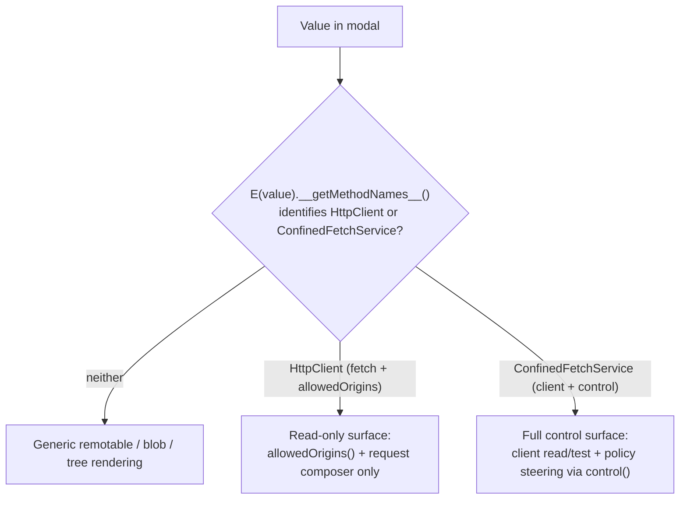
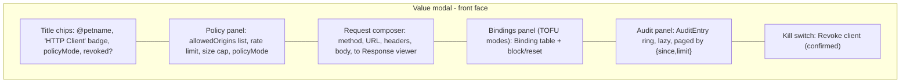

# Chat HTTP Controller UI

| | |
|---|---|
| **Created** | 2026-07-15 |
| **Updated** | 2026-09-04 |
| **Author** | Kris Kowal (prompted) |
| **Status** | Not Started |

## What is the Problem Being Solved?

The confined outbound-HTTP tier has no UI. The capability itself landed in
PR [#566](https://github.com/endojs/endo-but-for-bots/pull/566):
`@endo/exo-http-client`'s `HttpClient` / `HttpClientControl` facet pair over the
pure confinement core `@endo/http-confine`. A host can hold a `client()` facet
and a policy-bearing `control()` facet, but the only surfaces that read or steer
them today are the CLI (`endo http`, the parallel
[cli-http-client](cli-http-client.md) track) and the agent-tool adapter
(`makeHttpTool`).

In Chat, an `HttpClient` capability shows up in the inventory like any other
pet-named value, and clicking it opens the [Value modal](formula-inspector.md),
which renders it as a bare `remotable` tag with no affordances. A host looking
at an HTTP client it granted cannot see what origins the client may reach,
adjust the allowlist or the rate/size limits, inspect or revoke
trust-on-first-bind pins, read the policy-decision audit log, revoke the client
outright, or test a request against the live policy without dropping to the CLI.

This design makes the Value modal's **front face**, for a value the host
recognizes as an HTTP client, a **control surface** for that client: the
`HttpClient` read/test methods plus, when the viewer holds the matching
`HttpClientControl`, the full policy-steering surface.

## Grounding in the Current Implementation

### The provisioning path is `@endo/confined-fetch`, not a daemon formula

An earlier draft of this design grounded the surface on a daemon
`host.provideHttpClient` / `host.getHttpClientControl` mint plus an `http-client`
daemon formula (sketched under PR #661). That packaging is **not present in this
branch and has been superseded**. The base commit's own already-merged roadmap
records the change: [cli-http-client](cli-http-client.md)'s supersession banner
(2026-07-13) states that the `http-controller` / `http-client` formula pair, the
host `makeHttpClient` mint, and formula-owned policy are superseded by the
`@endo/fetch` / `@endo/confined-fetch` unconfined-plugin model, per the
maintainer's direction on PR
[#609](https://github.com/endojs/endo-but-for-bots/pull/609). This design is
therefore grounded on that model ([endo-fetch](endo-fetch.md)):

- `@endo/fetch` is an unconfined base plugin whose `make()` adapts the worker's
  ambient `fetch` into a passable `Fetch` capability. Granting it is granting
  direct HTTP authority.
- `@endo/confined-fetch` is a confined plugin, endowed with the base `Fetch`
  capability and a private writable state directory. It constructs the
  `HttpClient` / `HttpClientControl` pair over the endowed base and returns a
  `ConfinedFetchService` exposing `client()`, `control()`, and `help()`.
- The integration provisions one confined service per guest, retains
  `control()`, and grants only `client()` to that guest. A guest never receives
  the base `Fetch`, the state directory, or the control facet.

Both `@endo/fetch` and `@endo/confined-fetch` are **Not Started**
([endo-fetch](endo-fetch.md) § Status). The read-only Phase 1 of this UI rests
only on the landed #566 capability pair and can ship independently. The
control-bearing phases (2 and later) depend on the confined-fetch provisioning
path landing and on the maintainer's call about how a `ConfinedFetchService`
(and thus its `control()`) is surfaced to Chat. That coupling is called out in
§ Open Questions and gates Phase 2, not merely Phase 4.

### The Value modal (`packages/spaces-util/src/value-component.js`)

`valueComponent($parent, powers, { enterProfile })` returns
`{ showValue, dismissValue, dispose }`. The modal is a flip card:

- **Front (recto) face** renders the passable value. Remotables get a bare tag
  unless `showValue` detects a *specialization*: `isBlobLike(value)` (a `text()`
  method) swaps in an inline blob preview; `isTreeLike(value)`
  (`list`/`lookup`/`sha256`) swaps in a live tree listing. Both detect the
  remotable's shape with `E(value).__getMethodNames__()` and both re-render the
  same `$valueMount` once the async probe resolves.
- **Back (verso) face** renders the value's daemon **formula** record via
  `FormulaView`, reached with the `F` key, the header gear, or the flip button.
  It is deliberately **read-only** (kriskowal, 2026-06-13, on
  [formula-inspector](formula-inspector.md): "While one formula captures state,
  we do not need these to be user editable at this stage of development").

Everything untrusted the modal renders (value content, blob text, formula
property values) reaches the DOM only as escaped text through `renderConfined` /
`valueToVnodes` vnodes, never `.innerHTML`. That confinement is a load-bearing
invariant, not a nicety.

The HTTP control surface is a **third front-face specialization**, structurally
the sibling of the blob and tree specializations: `showValue` probes the
remotable, and on a positive HTTP-client detection renders a dedicated control
panel into `$valueMount` in place of the bare remotable tag. It is a front-face
treatment, not a change to the read-only formula back face.

### The HTTP capability (`packages/exo-http-client/src/http-client.js`, #566)

Two facets, split by authority:

```
HttpClient:                         HttpClientControl:
  fetch(url, options?) -> Response     inspect() -> Policy
  allowedOrigins() -> string[]         setAllowedOrigins(origins) / addAllowedOrigin / removeAllowedOrigin
  help() -> string                     setMaxRequestsPerMinute(n) / setMaxResponseBytes(n)
                                        setPolicyMode(mode)
HttpResponse:                          revoke() / isRevoked() -> boolean
  status()/statusText()/ok()           listBindings() -> Binding[]
  headers()/url()/truncated()          revokeBinding(origin) / unpin(origin)
  maxResponseBytes()                   listAuditEntries({since?,limit?}) -> AuditEntry[]
  text() / json()                      help()
  help()
```

`Policy` (the `inspect()` shape) is `{ allowedOrigins: string[],
maxRequestsPerMinute: number, maxResponseBytes: number, policyMode: string,
revoked: boolean }`. `Binding` is `{ target, state ('Pinned-Allow' |
'Pinned-Deny' | 'Revoked'), decidedAt, decidedBy, decisionMode, note? }`.
`AuditEntry` is `{ at, target, fromState, toState, decisionMode, decidedBy,
context? }`. The exos enforce the origin-exactness and `Number.isSafeInteger`
rules. Note that the `HttpClient` facet carries no revocation query: only
`HttpClientControl.isRevoked()` and `inspect().revoked` report revocation
(see § The persistence boundary and § Loading and error states).

### Durable policy on the confined service's state directory

Under `@endo/confined-fetch`, policy is **durable**, not session-scoped. The
confined service owns a private state directory on the virtual file system:

```
fetch-store/
  config.json    # allowedOrigins, maxRequestsPerMinute, maxResponseBytes,
                 # policyMode, revoked
  bindings.json  # origin -> state, decidedAt, source, note?
```

`HttpClientControl` mutations persist through that directory
([endo-fetch](endo-fetch.md) § Durable policy on the virtual file system): an
origin added, a limit raised, a mode changed, or a `revoke()` survives a daemon
restart. Revival is integration-owned (the confined service is pinned under
`@pins` and re-endowed at boot with the base `Fetch` and the same
`fetch-store`), so a revoked service revives revoked. Only the rate-limit window
and the audit ring are ephemeral: they are bounded operational state, not
durable policy.

This durability is the correction that most reshapes this design from its
earlier draft. There is no live-versus-baked divergence to reconcile: `inspect()`
is the single authoritative, durable view of policy, and the surface can present
edits as persistent without qualification (see § Design Decisions 4).

## Capability and Authority Boundaries

The control surface's power is bounded by *which cap the viewer is looking
through*, and the UI must reflect exactly that, never more.



1. **Client / control split.** The confined service holds both facets and
   exposes them through `client()` and `control()`. An integration grants a
   guest only `client()` (an `HttpClient`); it retains the service (or the
   `control()` facet). The policy-steering half of the surface therefore appears
   **only** for a viewer holding the `ConfinedFetchService` (or its `control()`),
   which in practice is the host that provisioned it. This is the same authority
   split the git-remote grant uses (see [daemon-git-remotes](daemon-git-remotes.md)),
   surfaced in the UI for the first time.

2. **The steering surface is control-only.** When Chat runs under a guest
   profile (an "enter profile" descent, `enterProfile`), the value in the guest's
   petstore is a bare `HttpClient`: it exposes `fetch` / `allowedOrigins` / `help`
   and nothing else. The UI must feature-detect `control()` (or a resolvable
   `HttpClientControl`), not assume it, and degrade to the read-only client view
   when it is absent.

3. **A foreign client yields no control.** A client received over CapTP from a
   peer, or minted by a different host, arrives as a bare `HttpClient` with no
   associated `ConfinedFetchService` in this host's reach. The viewer sees
   `allowedOrigins()` and may test `fetch` (subject to the remote policy) but
   gets no steering controls. Read-only is the boundary, never an error to
   surface loudly.

4. **Editing bounds is an authority-widening act.** `addAllowedOrigin`,
   `setAllowedOrigins`, `setMaxResponseBytes`, `setMaxRequestsPerMinute`, and
   `setPolicyMode` expand or relax the client's reach. Each edit is an explicit,
   visibly-labelled control action; `revoke()` (permanent and durable) is
   confirmed before it fires. The surface never widens authority as a side
   effect of merely *viewing*.

5. **`fetch` is already confined.** Exposing a request composer adds no
   authority: every request is re-parsed, exact-origin-matched against the live
   allowlist, rate-limited, size-capped, and run with redirects disabled by the
   exo. An off-allowlist URL fails with the exo's own error; the composer cannot
   exceed the policy it displays.

6. **Response and policy text is untrusted.** Response bodies and headers come
   off the network; `Binding.target` / `decidedBy` / `note` and
   `AuditEntry.decidedBy` come from policy decisions (in TOFU modes, influenced
   by the requesting guest). All of it renders through `renderConfined` vnodes as
   escaped text, the confinement the rest of `value-component` already enforces.

### The persistence boundary

Because `@endo/confined-fetch` persists policy to its private state directory,
control edits are **durable**: they survive a daemon restart, and a revoked
service revives revoked. The front face's live `inspect()` and the confined
service's on-disk `config.json` do not drift, because `inspect()` reads the same
authoritative policy the service persists.

Two ephemeral facts remain, and the UI must not overstate them as durable:

- The **rate-limit window** and the **audit ring** are in-memory operational
  state ([endo-fetch](endo-fetch.md) § Durable policy). The audit panel shows
  the current ring, not a durable log, and says so.
- A viewer holding only a bare `HttpClient` (guest or foreign) cannot read
  policy at all (no `inspect()`), so its read-only surface reflects only
  `allowedOrigins()` and reacts to policy changes only through subsequent
  `fetch` results. It must not imply it is showing durable, complete policy.

## The Design

### Detection

`showValue`, in the same `inferredType === 'remotable'` branch that runs the
blob/tree probes, adds two probes over `E(value).__getMethodNames__()`:

- `isConfinedFetchServiceLike(value)`: the names include `client` and `control`.
  The full control surface applies; it recovers `client()` and `control()` from
  the service.
- `isHttpClientLike(value)`: the names include both `fetch` and `allowedOrigins`.
  The read-only client surface applies; the value *is* the client.

On a positive result it renders the surface into `$valueMount` (replacing the
bare remotable tag). Detection order: the confined-service shape is checked
first, then the bare `HttpClient` shape, then blob/tree. The facets are disjoint
(an HTTP client has neither `text` nor `sha256`), so ordering fixes precedence,
not correctness. The probe is guarded by the same `currentValue === value`
staleness check the blob/tree probes use, so a fast re-`showValue` cannot
cross-render.

### Layout

The control surface is one confined Preact component, `HttpControlSurface`,
rendered into `$valueMount`, composed of collapsible sections (mirroring the
inventory's collapsible-section idiom,
[inventory-grouping-by-type](README.md)). All state-bearing sub-panels are their
own components with their own hooks, so a re-probe remounts cleanly.



**1. Header / status.** The existing title chips (`@petname`, unnamed) gain an
"HTTP Client" badge and a compact status line. When `control()` is available, the
line shows `policyMode`, `allowedOrigins` count, and a **Revoked** pill when
`inspect().revoked` is true. A read-only viewer (bare `HttpClient`) has no
revocation query, so its status line shows only the `allowedOrigins()` count and
omits the mode and the Revoked pill; revocation for that viewer is discovered
reactively (see § Loading and error states, "Revoked client").

**2. Policy panel** (control only). Renders `inspect()`:
- **Allowed origins**: a list; each row has a "Remove" affordance
  (`removeAllowedOrigin`); an "Add origin" input appends via `addAllowedOrigin`,
  validated client-side against the exo's origin-exactness rule (scheme + host
  [+ port], no path/query/fragment) so a bad entry is rejected before the round
  trip, with the exo error surfaced inline if it still rejects.
- **Max requests / minute** and **Max response bytes**: numeric inputs
  committing via `setMaxRequestsPerMinute` / `setMaxResponseBytes`; both
  validated as positive safe integers client-side.
- **Policy mode**: a `<select>` limited to the modes the confined service can
  persist and enforce (`strict`, `tofu-auto`). `tofu-prompt` / `tofu-attenuator`
  are **shown disabled with an explanatory title** because this phase wires no
  live `fetch-policy-authority` (the optional trust-on-first-bind referral target
  of [endo-fetch](endo-fetch.md) § Confined plugin endowments); see § Open
  Questions 2.

  Read-only viewers (guest / foreign client) see this panel collapsed to the
  `allowedOrigins()` list with no edit affordances and a "read-only (no control
  authority)" note.

**3. Request composer** (client, always present). A form: `method` (`<select>`
over the seven `HTTP_METHODS`), `url` (text), optional `headers` (key/value
rows), optional `body` (textarea, enabled for POST/PUT/PATCH). "Send" calls
`E(client).fetch(url, options)` and renders the returned live `HttpResponse`
remotable in a **Response viewer**: `status()` + `statusText()` + `ok()`
(color-coded), `url()`, a `truncated()` banner when true (with
`maxResponseBytes()`), a `headers()` table, and the body via `text()` (with a
"Parse JSON" toggle calling `json()`). The URL input may autocomplete from the
current `allowedOrigins` to steer the user toward in-policy requests (advisory
only). Response text is confined vnodes.

**4. Bindings panel** (control, TOFU modes only). When `policyMode` is a `tofu-*`
mode, `listBindings()` renders a table (target, state, decidedBy, decisionMode,
`decidedAt` as a relative time, `note`). Each row offers up to two clearly
labelled actions, shown per the row's `state`:
- **"Reset"** (`unpin(origin)`), tooltip "Clear this decision so the origin is
  decided again on next request." Shown for `Pinned-Allow` and `Pinned-Deny`
  rows; hidden on a `Revoked` row (nothing to reset).
- **"Block"** (`revokeBinding(origin)`), tooltip "Move this origin to a
  permanent deny." Shown for `Pinned-Allow` and `Pinned-Deny` rows; hidden on an
  already-`Revoked` row.

Hidden entirely in `strict` mode (no bindings accrue). Lazily fetched on panel
expand.

**5. Audit panel** (control). `listAuditEntries({ since, limit })` renders a
reverse-chronological view of the in-memory audit ring (`at`, `target`,
`fromState -> toState`, `decisionMode`, `decidedBy`, `context.method`). Lazily
fetched on expand; "Load older" pages by passing `since` = the oldest shown
entry's `at`, bounded by the exo's `auditLimit`. A one-line note states that the
ring is operational (in-memory) state, not a durable log, so it can be shorter
than the request history after a restart.

**6. Kill switch** (control). A "Revoke client" button gated behind an inline
confirm. Confirm copy: **"Revoke: permanently stops all requests from this
client. This is durable across restart and cannot be undone."** On confirm,
`revoke()`, then re-`inspect()` to flip the header to the Revoked state and
disable the composer's Send. Because revocation persists (a revoked service
revives revoked), the copy's permanence claim is truthful, and the
irreversibility is stated so the user is not surprised.

### Modal interactions

Per Chat Invariant 2 (Keyboard-Manual Parity) and Invariant 1 (Modeline
Completeness), every action has a pointer affordance and, where it earns an
accelerator, a modeline hint. Enumerated:

| Interaction | Trigger | Facet call | Notes |
|---|---|---|---|
| Open control surface | Click/inspect a client or service value | `__getMethodNames__`, then `control()` | Automatic on detection |
| Flip to formula | `F` / header gear / flip button | `getFormula(id)` | Existing back face; read-only |
| Add allowed origin | "Add origin" submit | `addAllowedOrigin` | Client-side origin validation first |
| Remove allowed origin | Row "Remove" | `removeAllowedOrigin` | |
| Set limits | Numeric input commit (Enter / blur) | `setMaxRequestsPerMinute` / `setMaxResponseBytes` | Positive-safe-integer validation |
| Change policy mode | `<select>` change | `setPolicyMode` | `strict` / `tofu-auto` only |
| Send request | Composer "Send" / Cmd+Enter in composer | `fetch` -> `HttpResponse` | Bounded by live policy |
| Toggle response body as JSON | "Parse JSON" | `json()` vs `text()` | |
| Expand bindings / audit | Section header click | `listBindings` / `listAuditEntries` | Lazy |
| Block / reset a binding | Binding-row "Block" / "Reset" | `revokeBinding` / `unpin` | TOFU modes; shown per row state |
| Load older audit entries | "Load older" | `listAuditEntries({ since })` | Paging |
| Revoke client | "Revoke client", then confirm | `revoke` | Permanent, durable |
| Close | `Esc` / Close / backdrop | (none) | Invariant 4 (Escape Consistency) |

`Esc` closes the front face (control surface included) exactly as it does for any
value; the surface introduces no new `Esc` semantics. Accelerators added inside
the composer (Cmd+Enter to Send, the platform modifier per `handleKey`, Ctrl on
non-Mac) follow the existing text-input guard in `handleKey` so they never leak
to window-level modal keys, and each earns a composer-local modeline hint.

### Loading and error states

- **Detecting**: while `__getMethodNames__()` is in flight, the value shows the
  default remotable tag (no flicker); the surface swaps in on resolution, same as
  the blob/tree probes.
- **Resolving control**: the client read view (header + composer + read-only
  policy list) renders immediately from `allowedOrigins()`; the steering controls
  appear once `control()` resolves. A brief "checking control authority..."
  affordance covers the gap.
- **No control authority**: the value is a bare `HttpClient` (guest / foreign),
  or `control()` is unavailable: read-only surface, quiet inline "read-only (no
  control authority)" note, no error toast.
- **`inspect()` / `listBindings()` / `listAuditEntries()` failure**: per-panel
  inline error ("Could not load policy: `<message>`") with a Retry, mirroring the
  back face's `renderBackFaceMessage` pattern; one panel's failure never blanks
  the others.
- **`fetch` rejection**: the Response viewer shows the exo error inline
  (off-allowlist origin, rate-limit exceeded, timeout, network failure),
  distinguished from an HTTP error *response* (a 4xx/5xx that still returns a
  `Response` with `ok() === false`). Both are expected, neither throws to the
  console.
- **Edit rejection**: a `set*` / `add*` call the exo refuses (bad origin, unsafe
  integer, unsupported mode) surfaces inline next to the offending input; the
  displayed policy re-reads from `inspect()` so the UI never drifts from exo
  truth.
- **Revoked client**: for a control viewer, `inspect().revoked` drives the
  Revoked pill, disables the composer's Send, and makes the policy panel
  read-only. For a **read-only viewer** (bare `HttpClient`, no `isRevoked()`),
  revocation cannot be detected proactively: the first `fetch` after revocation
  rejects with the exo's revoked-client error, and the Response viewer frames
  that rejection as "This client has been revoked; no further requests will
  succeed" and disables Send from then on. This is the honest degradation for a
  viewer whose facet carries no revocation query; the surface never shows a false
  "live" state.
- **Value swapped mid-flight**: every async render is guarded by the
  `currentValue === value` / `currentId === id` staleness checks already used
  throughout `showValue`.

### Formula back face

The read-only formula back face is unchanged by this design. Under the
`@endo/confined-fetch` model the durable policy lives in the confined service's
state directory and is read authoritatively through the front face's `inspect()`,
so there is no separate "baked policy" formula record to contrast against a
"live" front face (the earlier draft's front-versus-back divergence does not
arise under durable policy). If and when the daemon exposes a formula record for
a confined-fetch plugin, its back face would show the plugin's *provisioning*
wiring (endowments, state-directory reference), not a mutable policy snapshot;
whether to add a `formula-view-registry.js` entry for that is deferred to the
provisioning path landing (§ Open Questions 1) rather than specified here against
infrastructure that does not yet exist.

## Test Plan

Sibling design [formula-inspector](formula-inspector.md) carries an explicit Test
Plan; this surface's real attack area (client-side validation versus
exo-authoritative rejection, TOFU binding transitions, revoke-then-composer, the
read-only degradation path) earns the same.

- **Unit: detection precedence.** `isConfinedFetchServiceLike` and
  `isHttpClientLike` against fixtures for a `ConfinedFetchService` (has
  `client`/`control`), a bare `HttpClient` (has `fetch`/`allowedOrigins`, no
  `control`), a blob, a tree, and a look-alike remotable exposing
  `fetch`/`allowedOrigins` without the confined semantics. Assert the confined
  service resolves to the full surface, the bare client to read-only, and the
  disjoint shapes to their own specializations.
- **Unit: client-side validators mirror the exo.** Origin-exactness and
  positive-safe-integer validators accept exactly what the exo accepts and reject
  what it rejects, over a table of edge cases (path/query/fragment present, bad
  scheme, non-integer, zero, negative, unsafe integer).
- **Integration: read-only degradation.** With a bare `HttpClient` value, the
  surface renders header + composer + read-only origins list, shows the
  "read-only (no control authority)" note, and exposes no steering affordances.
- **Integration: control edits and durability framing.** With a
  `ConfinedFetchService`, an added origin / raised limit / mode change round-trips
  through `control()` and the re-read `inspect()` reflects it; assert the UI
  presents the edit as persistent (no session-scoped caveat) and that a simulated
  restart preserving the state directory shows the same policy.
- **Integration: TOFU bindings.** In a `tofu-*` mode, the Bindings panel shows
  "Reset"/"Block" per row state (both on `Pinned-Allow`/`Pinned-Deny`, neither on
  `Revoked`), and each button calls the right facet method. Panel is hidden in
  `strict` mode.
- **Integration: fetch rejection versus HTTP error.** An off-allowlist URL and a
  4xx response render distinctly (exo error inline versus `ok() === false`
  Response), and neither throws to the console.
- **Manual checklist.** The "Revoked client" states for both viewer tiers (control
  viewer: Revoked pill and disabled Send; read-only viewer: reactive
  fetch-rejection framing), the "Edit rejection" re-sync from `inspect()`, and the
  kill-switch confirm copy.

## Dependencies

| Design | Relationship |
|---|---|
| [formula-inspector](formula-inspector.md) | Owns the Value-modal flip-card, `getFormula`, and the read-only back-face contract this surface extends with a live front-face treatment. |
| [endo-fetch](endo-fetch.md) | The `@endo/fetch` / `@endo/confined-fetch` unconfined-plugin model that provisions the `HttpClient` / `HttpClientControl` pair and persists policy durably on the virtual file system. This UI drives the resulting `ConfinedFetchService` `client()` / `control()`. Its landing is the precondition for this design's control phases. |
| [http-confine](http-confine.md) | The confinement core whose origin-exactness and limit rules the policy panel validates against client-side. |
| [cli-http-client](cli-http-client.md) | The parallel `endo http` CLI control surface; this is its Chat-side sibling over the same `HttpClient` / `HttpClientControl` pair. Note its supersession banner is the roadmap record that redirected this design's grounding to `endo-fetch`. |
| [daemon-git-remotes](daemon-git-remotes.md) | The prior instance of the same live-control-versus-read-only-client authority split, referenced in § Capability and Authority Boundaries. |
| [chat-invariants](chat-invariants.md) | Modeline completeness, keyboard-manual parity, and Escape consistency the surface obeys. |

## Phased Implementation

1. **Read-only client view.** Detection probe (bare `HttpClient`) + header
   badge/status + `allowedOrigins()` list + request composer + Response viewer,
   including the reactive revoked-client framing. Works for both host and
   guest/foreign clients (no control dependency, rests only on landed #566). Ships
   the majority of the user value and is the only phase that can proceed before
   the provisioning path lands.
2. **Control policy panel** (gated on the `@endo/confined-fetch` provisioning path
   and the maintainer's call about how a `ConfinedFetchService` reaches Chat, per
   § Open Questions 1). `control()` recovery, `inspect()` render, allowlist/limit/
   mode editors with client-side validation and inline exo-error surfacing, plus
   the confirmed Revoke kill switch.
3. **Bindings + audit panels.** TOFU-mode binding table with block/reset, and the
   paged audit-ring view.
4. **Formula back face reconciliation** (gated on Open Question 1). If the daemon
   exposes a confined-fetch plugin formula record, add a `formula-view-registry`
   entry for its provisioning wiring.

## Design Decisions

1. **Front-face specialization, not a new panel or third face.** The surface is
   the structural sibling of the blob and tree front-face specializations: same
   `showValue` probe-and-swap shape, same staleness guards, same confined mount.
   This reuses the modal's machinery and keeps the read-only formula back face
   unchanged. Considered and rejected: a dedicated inventory-row panel with a
   read/edit toggle. Reason: kriskowal already rejected the two-surface inspector
   split (formula-inspector, 2026-06-13, "We only need one surface"); the Value
   modal is that surface.

2. **The value is the client or the confined service; the control is recovered
   through the service.** A guest's value is the bare `HttpClient`; the host's
   value is the `ConfinedFetchService`, from which `control()` is recovered. The
   control facet is never itself navigated to as a standalone value. This matches
   the confined-fetch client/control split.

3. **Read-only degradation is silent, by capability.** Absence of control
   authority (a bare `HttpClient` held by a guest or received foreign) is the
   *expected* state for a large class of clients, not an error. The surface
   degrades to the client read view with a quiet note.

4. **Policy is durable; the front face is the authoritative view.** Because
   `@endo/confined-fetch` persists policy to its state directory, the front face's
   `inspect()` is the single durable, authoritative policy view; there is no
   live-versus-baked contrast to surface. The only ephemeral facts (rate-limit
   window, audit ring) are labelled as operational state, and a bare-`HttpClient`
   viewer is explicitly limited to `allowedOrigins()` rather than being implied to
   show complete policy.

5. **Client-side validation mirrors the exo, never replaces it.** Origin
   exactness and positive-safe-integer checks run client-side purely to give fast
   inline feedback; the exo remains the sole authority and its rejection is always
   surfaced and always re-syncs the displayed policy from `inspect()`.

6. **One bespoke surface now, with generalization deferred deliberately.** This is
   knowingly the second capability type (after the git-remote grant) needing a
   live-control-versus-read-only-client panel, and the foreign/host split is a
   general daemon pattern, so more will follow. A schema-driven "capability control
   surface" keyed off the control facet's declared method/policy shape could
   eventually subsume both. It is *not* attempted here: the two instances differ
   enough (HTTP policy fields, TOFU bindings, an audit ring versus git-remote
   refs/credentials) that the shared abstraction is not yet legible, and inventing
   it against a single prior instance would be speculative. Per-type bespoke panels
   are the deliberate Phase-1 choice; the generalization is revisited when a third
   instance makes the common shape concrete.

## Open Questions

1. **How does a `ConfinedFetchService` (and thus `control()`) reach Chat?** The
   read-only Phase 1 needs only a `client()` value in a petstore, which #566
   already supports. The control phases need the viewer to hold the
   `ConfinedFetchService` or its `control()` facet, and how that is provisioned,
   pinned, and surfaced to Chat is owned by [endo-fetch](endo-fetch.md) (Not
   Started) and the maintainer's provisioning-path call. This gates Phase 2, not
   just a persistence detail. Until it resolves, only Phase 1 proceeds.

2. **Should the policy-mode `<select>` offer `tofu-prompt` / `tofu-attenuator` at
   all?** The live exo's `setPolicyMode` accepts all four, but the prompt modes
   require a `fetch-policy-authority` endowment ([endo-fetch](endo-fetch.md)
   § Confined plugin endowments) that this phase does not wire; without it unknown
   origins fail closed. Recommended: show them disabled with an explanatory title
   until a `fetch-policy-authority` is wired.

3. **Should the request composer exist for the host's own control view, or only
   where the client is genuinely a guest's grant?** Testing a request as the host
   uses the same client the guest holds, which is exactly the point (verify what
   the grantee can reach), but it does mean the host issues real outbound requests
   from the modal. Recommended: keep it, since every request is policy-bounded and
   auditable, and testing-what-you-granted is the core use.

4. **Where should detection draw the line against a non-daemon remotable that
   coincidentally exposes `fetch` + `allowedOrigins`?** Holding a
   `ConfinedFetchService` (with a resolvable `control()` whose `inspect()`
   succeeds) is authoritative for a genuine confined client. For the read-only view
   the method-name probe alone could false-positive, and a look-alike is under no
   obligation to actually enforce origin-exactness, rate limits, or size caps the
   way `@endo/http-confine` does. Recommended: treat method-name detection as
   sufficient for the read-only composer, but frame the "policy-bounded" copy as
   *the client's declared bounds* rather than a guarantee, and gate all steering
   strictly on a resolved `control()`. The policy-bound guarantee is only as strong
   as the detected object's real implementation, not its interface name.

## Prompt

> Please post a follow-up job to design an HTTP controller UI in Chat, such that
> the show value modal for an HTTP controller is a control surface for the HTTP
> client.
>
> Kris Kowal, review of
> [endojs/endo-but-for-bots#661](https://github.com/endojs/endo-but-for-bots/pull/661#pullrequestreview-4701071242)
> (APPROVED), 2026-07-15
