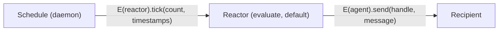

# CLI Scheduled Send via Reactor + Schedule

| | |
|---|---|
| **Created** | 2026-05-08 |
| **Updated** | 2026-05-11 |
| **Author** | Kris Kowal (prompted) |
| **Status** | Proposed |
| **Source** | [PR #145](https://github.com/endojs/endo-but-for-bots/pull/145) review (CHANGES_REQUESTED) and [inline comment id 3212495724](https://github.com/endojs/endo-but-for-bots/pull/145#discussion_r3212495724) |
| **Supersedes (in part)** | [endoclaw-timer](endoclaw-timer.md): the daemon-side `IntervalScheduler` shape proposed there is replaced by the four-layer composition below. |

## What Is The Problem Being Solved?

Endo needs a `scheduled-send` capability: a canned message whose only
difference from `endo send` is that delivery is delayed and may
repeat.
The mechanism MUST decouple the scheduler (when to fire) from the
reaction (what to do when fired) so the schedule formula is reusable
for non-send reactors (digest, poll, prune, telemetry flush).
The schedule's persisted state MUST live in `endo.sqlite` for indexed
queries on `next_tick_at` and to match the daemon's existing storage.
When a reactor falls behind the schedule (the daemon was offline, the
worker is slow, the reactor reschedules), the schedule MUST follow a
documented catch-up policy rather than implicitly auto-resolve and
advance.

This design specifies a four-layer composition: a `schedule` daemon
formula type, a *Tickable* contract, a canned-send reactor, and CLI
flags on `endo send`.

## Implementation Order: Four Layers

The design is organized by the four layers in the order they would
need to be implemented.
Each layer depends only on the layers below it; each lands as its
own PR.

1. **Scheduler subsystem.**
   The `schedule` daemon formula type, its sqlite-backed persisted
   state, the timer-arming loop that fires `next_tick_at`, and the
   catch-up / retry / lifecycle bookkeeping.
2. **Reactor (the *Tickable* contract).**
   The shape any formula must satisfy to be schedulable: a
   `tick(count, timestamps)` interface plus the convention that any
   formula whose resolved value implements *Tickable* qualifies as a
   reactor.
3. **Message-sending reactor (the canned-send reactor).**
   The first concrete *Tickable* implementation: an exo evaluated
   under endowments `{ agent, handle, message }` whose `tick`
   invokes `E(agent).send(handle, message)` once per accumulated
   tick (with aggregation, see "Aggregating accumulated ticks"
   below).
4. **CLI changes (`endo send` scheduling flags).**
   Scheduling flags on the existing `endo send` command (`--every`,
   `--at`, `--on`) plus the `endo schedule` family of management
   commands.
   The same scheduling fields are also surfaced as named keys in the
   `E(agent).send(handle, message, options)` API options bag, so
   programmatic callers reach the same schedule shape without a CLI
   round-trip.

The Chat-UI surface is a separate dispatch chain after layer 4
lands; it shares the schedule formula type and the *Tickable*
contract but introduces no new daemon-side primitives.

## Scope

In scope:

- A `schedule` formula type, persisted in `endo.sqlite`, that calls
  `tick(count, timestamps)` on a *Tickable* reference at configurable
  cadences.
- The *Tickable* contract: any formula whose value implements
  `tick(count, asyncIterator<scheduledTickAt>)` qualifies as a
  reactor.
  The standard CLI production path is an `evaluate` formula; any
  formula type that produces a Tickable value is acceptable.
- Scheduling flags on `endo send`: `--every <interval>` and
  `--at <iso-timestamp>` for the convenience case (synthesize a
  fresh schedule on the fly), and `--on <schedule-name>` for the
  flexibility case (reuse a pre-defined named schedule).
  Plus an `endo schedule` family of commands to list, pause, resume,
  and cancel schedules.
- The same scheduling fields surfaced as named keys in the `send`
  API options bag (see Layer 4, "API options bag").
- A documented catch-up policy with one default and three named
  alternatives, drawn from CloudFlare Queues' consumer-concurrency
  and batching vocabulary.
- Retry semantics for failed ticks: exponential backoff with full
  jitter, parameters captured in the schedule's persisted state.

Out of scope:

- The `IntervalScheduler` formula introduced in PR #145 (rebuilt
  against this design or closed in favor of a fresh implementation
  PR).
- Cron expressions.
  M1 ships rate (`--every`) and one-shot (`--at`) cadences; cron
  is a follow-up that adds a `cron` cadence kind without changing
  the schedule's other fields.
- Distributed coordination across multiple daemons.
  Schedule and reactor MAY live on different peers (ordinary CapTP
  reachability and retention rules apply); the schedule itself
  performs no cross-peer coordination.
- All telemetry surfaces (textual message-handle events, structured
  meter).
  See "Follow-up Work" below.
- A Chat-UI surface for scheduling.
  Designed separately; this document is the CLI side only.

## Architecture Overview



Layer 1 (the schedule, daemon-side) holds a CapTP reference to a
formula that implements layer 2 (the *Tickable* contract).
Layer 3 (the canned-send reactor) is the standard *Tickable*
implementation the CLI evaluates.
Layer 4 (the CLI) creates the composite by evaluating a layer-3
reactor and then creating a layer-1 schedule that points at it.

---

## Layer 1: Scheduler Subsystem

A `schedule` daemon formula type with sqlite-backed persisted state,
a timer-arming loop, and catch-up / retry / lifecycle bookkeeping.

### Inputs (from the daemon)

- The existing `DaemonDatabase` and `endo.sqlite` storage
  ([`packages/daemon/src/daemon-database.js`](../packages/daemon/src/daemon-database.js)).
- `setTimeout`, `clearTimeout`, and `Date.now`.
- The existing formula-creation infrastructure (`extractDeps`,
  `case 'schedule'` handler, formula GC).
- A generic CapTP-reachable reference; layer 1 makes no assumption
  about the reference's interface beyond "callable via `E()`".

### Outputs (to layer 2 and above)

A daemon-managed periodic prodder that calls
`E(reference).tick(count, timestamps)` on a cadence, with persisted
catch-up and retry state observable via `endo schedule list` for
operators and via formula introspection for upper layers.

### Schedule formula

A schedule is a new daemon formula type, stored in sqlite.
Its fields:

| Field | Meaning |
| --- | --- |
| `id` | Formula id of the schedule (256-bit hex). |
| `reactor` | Formula id of the Tickable reactor to call. |
| `cadence` | `{ kind: 'rate', periodMs }` or `{ kind: 'one-shot', tickAt }`. |
| `firstTickAt` | Wall-clock ms; for `rate`, the first scheduled tick; for `one-shot`, the only tick. |
| `nextTickAt` | Wall-clock ms; the next scheduled tick. Advances on successful ack; for a tick currently in retry backoff, this is `lastTickAt + currentBackoffMs`. |
| `lastTickAt` | Wall-clock ms; when the most recent tick was queued. Null until first tick. |
| `lastAckAt` | Wall-clock ms; when the reactor most recently acked successfully. Null until first successful ack. |
| `pendingTicks` | Integer; ticks queued but not yet acked (the catch-up backlog). |
| `catchUpPolicy` | `backfill` (default) / `batch` / `skip` / `suspend`. |
| `maxBatch` | Maximum batch size when `catchUpPolicy === 'batch'` (default 10, mirrors CloudFlare Queues' `max_batch_size`). |
| `consecutiveTickFailures` | Integer; count of consecutive `tick` rejections. Reset to 0 on a successful ack. Used to compute the current backoff delay. |
| `backoffInitialDelayMs` | Initial retry delay (default 1_000). |
| `backoffMaxDelayMs` | Cap on retry delay (default 300_000, i.e. 5 min). |
| `backoffMultiplier` | Exponential growth factor per consecutive failure (default 2.0). |
| `backoffJitterFraction` | Full-jitter fraction in `[0, 1]` (default 1.0, AWS-style "full jitter"). |
| `status` | `active` / `paused` / `cancelled` / `suspended`. |
| `createdAt` | Wall-clock ms. |

The schedule's only behavior, on each tick, is to call
`E(reactor).tick(count, timestamps)` where `count` and the lazy
`timestamps` async iterator are shaped by the `catchUpPolicy` (see
"Catch-Up Policy" below).

The schedule formula declares its dependency on the reactor via
`extractDeps`, so reactor liveness drives schedule liveness:
revoking the reactor cancels the schedule.

### Sqlite schema

The schedule table joins the existing `formula` table on
`reactor`'s formula id; the schedule's own row in `formula`
carries the formula body (the cadence configuration), and the
`schedule_runtime` table carries the mutable state that advances on
every tick.

```sql
CREATE TABLE IF NOT EXISTS schedule_runtime (
  -- Formula id of the schedule (256-bit hex).
  schedule_number TEXT PRIMARY KEY,

  -- Formula id of the reactor (256-bit hex), redundantly
  -- mirrored from the formula body for index-only lookups.
  reactor_id TEXT NOT NULL,

  -- Cadence in serialized form (JSON of the discriminated union
  -- in the field table above).
  cadence TEXT NOT NULL,

  -- Wall-clock ms.  Null last_tick_at / last_ack_at mean
  -- "never ticked" / "never acked".
  first_tick_at INTEGER NOT NULL,
  next_tick_at INTEGER NOT NULL,
  last_tick_at INTEGER,
  last_ack_at INTEGER,

  -- Catch-up bookkeeping.
  pending_ticks INTEGER NOT NULL DEFAULT 0,
  catch_up_policy TEXT NOT NULL DEFAULT 'backfill',
  max_batch INTEGER NOT NULL DEFAULT 10,

  -- Retry / backoff bookkeeping.  consecutive_tick_failures is
  -- reset to 0 on the next successful ack.  next_tick_at
  -- incorporates the current backoff delay when the schedule is
  -- in retry (consecutive_tick_failures > 0).
  consecutive_tick_failures INTEGER NOT NULL DEFAULT 0,
  backoff_initial_delay_ms INTEGER NOT NULL DEFAULT 1000,
  backoff_max_delay_ms INTEGER NOT NULL DEFAULT 300000,
  backoff_multiplier REAL NOT NULL DEFAULT 2.0,
  backoff_jitter_fraction REAL NOT NULL DEFAULT 1.0,

  status TEXT NOT NULL DEFAULT 'active',
  created_at INTEGER NOT NULL
);

-- Startup recovery scans active schedules ordered by next_tick_at
-- so the daemon can re-arm timers in tick order.
CREATE INDEX IF NOT EXISTS idx_schedule_runtime_active_next_tick
  ON schedule_runtime(status, next_tick_at)
  WHERE status = 'active';
```

The `schedule_runtime` table sits alongside the existing tables in
[`packages/daemon/src/daemon-database.js`](../packages/daemon/src/daemon-database.js).
The schema migration bumps `SCHEMA_VERSION` from 2 to 3 and adds
the `CREATE TABLE` and `CREATE INDEX` to `SCHEMA_SQL`.

Prepared-statement methods on the `DaemonDatabase` interface
(matching the existing pattern):

```js
writeSchedule(scheduleNumber, reactorId, cadence,
              firstTickAt, nextTickAt, catchUpPolicy, maxBatch,
              backoffInitialDelayMs, backoffMaxDelayMs,
              backoffMultiplier, backoffJitterFraction)
updateScheduleAfterTick(scheduleNumber, lastTickAt, pendingTicks)
updateScheduleAfterAck(scheduleNumber, lastAckAt, nextTickAt,
                       pendingTicks)
updateScheduleAfterTickFailure(scheduleNumber, nextTickAt,
                               consecutiveTickFailures)
setScheduleStatus(scheduleNumber, status)
deleteSchedule(scheduleNumber)
listActiveSchedules()         // for startup recovery
listSchedules()               // for `endo schedule list`
readSchedule(scheduleNumber)  // for debug / introspection
```

Startup recovery loads `listActiveSchedules()` and re-arms each via
`setTimeout` against `next_tick_at - Date.now()`, catching up any
`next_tick_at` already in the past per the row's `catch_up_policy`.
For schedules in retry (`consecutive_tick_failures > 0`), the
persisted `next_tick_at` already incorporates the current backoff
delay, so recovery does not recompute the backoff from scratch.

### Catch-up policy

The schedule adapts CloudFlare Queues' batching and retry vocabulary
to the schedule-calls-reactor pattern, where "behind" means the
wall-clock has advanced past `nextTickAt` while the reactor still has
an outstanding `tick`.
Four named policies cover the design space:

- **`backfill` (default).**
  `tick(count, timestamps)` is called once per missed tick, in
  order, with `count === 1` each time.
  After a daemon restart that missed N ticks, the schedule ticks
  back-to-back N times.
  Recommended when the reactor's effect is per-tick and not
  idempotent (a sent message must arrive once per missed period).
- **`batch`.**
  `tick(count, timestamps)` is called once with `count` up to
  `maxBatch`, accumulating missed ticks into a single call.
  The `timestamps` iterator yields the scheduled wall-clock for
  each accumulated tick in order.
  Recommended when the reactor's effect aggregates well (a metrics
  flush, a poll, a digest send).
- **`skip`.**
  Missed ticks are dropped; only the most recent `nextTickAt` is
  delivered, with `count === 1`.
  `pendingTicks` is reset to 0 on the next tick.
  Recommended for "is it still alive" heartbeats where stale ticks
  carry no information.
- **`suspend`.**
  When `pendingTicks` exceeds a threshold (default `maxBatch`),
  the schedule transitions to `status === 'suspended'` and stops
  arming new ticks until an operator (or the reactor itself, via a
  control-facet method) resumes it.
  Recommended when an unbounded backlog implies a real fault and
  silently accumulating ticks would mask it.

When `batch` hands a backlog larger than `maxBatch`, the schedule
calls once with `count === maxBatch` and re-arms immediately so the
next call picks up the rest.
This matches CloudFlare Queues' batching shape and keeps each `tick`
call bounded.

### Failure semantics: reactor rejection vs tick rejection

**Reactor reference rejected (cancel).**
If the schedule's `reactor` formula reference rejects (the formula
itself failed to resolve, the underlying value is no longer
reachable, the reactor was revoked) the schedule transitions to
`status === 'cancelled'`.
The cancellation flows through `extractDeps`-driven GC: the
reactor's death triggers the schedule's GC.

**Tick rejected (retry with exponential backoff).**
If the reactor resolves and `tick(count, timestamps)` returns a
promise that rejects, the schedule treats the tick as failed and
schedules a retry with exponential backoff and full jitter:

```
delay = min(
  backoffInitialDelayMs * (backoffMultiplier ** consecutiveTickFailures),
  backoffMaxDelayMs,
)
jitter = random() * delay * backoffJitterFraction
nextRetryAt = now + (delay - jitter)
```

The default parameters (1s initial, 5min max, 2.0 multiplier, 1.0
jitter fraction) come from the AWS Architecture Blog post
["Exponential Backoff and Jitter"](https://aws.amazon.com/blogs/architecture/exponential-backoff-and-jitter/)
(Marc Brooker, 2015): full jitter avoids retry-thundering-herd when
many schedules co-fail (e.g. a reactor's downstream service is
unavailable for all of them).

`consecutiveTickFailures` is persisted in sqlite (so it survives
daemon restart) and reset to 0 on the next successful ack.
The retry's `tick` call carries the *same* `count` and `timestamps`
as the failed call: a retry is a re-attempt, not a new tick.

### Cap surface (layer 1)

The schedule has authority to call `E(reactor).tick(count,
timestamps)`.
That is the entire cap.
It does not hold the agent, the handle, or the message contents;
those endowments live inside the reactor.
A compromised schedule (an operator confused two similar-looking pet
names) can call the wrong reactor's `tick` at the wrong times, but
cannot send a different message or send to a different recipient.

### Implementation order within layer 1

1. The sqlite schema, schema-version bump from 2 to 3, and migration.
2. The `DaemonDatabase` prepared statements for schedule rows.
3. The `schedule` formula type, `formulateSchedule`, `extractDeps`,
   and the `case 'schedule'` handler.
4. Sqlite-backed startup recovery and the timer-arming loop.
5. The four catch-up policies; `backfill` is the minimum needed for
   a first end-to-end pass.
6. The failure semantics (cancel-on-reactor-rejection and
   retry-on-tick-rejection with exponential-backoff and full-jitter).

### Test strategy (layer 1)

Unit tests in `packages/daemon/test/schedule.test.js`:

- Each catch-up policy in isolation, with a clock-injected fake
  timer ticking N missed ticks while a tick is in flight.
- Tick failure retry: a reactor stub whose `tick` rejects K times
  in a row triggers backoff with the documented schedule
  (`min(initial * multiplier^K, max) - jitter`), and a subsequent
  successful tick resets `consecutive_tick_failures` to 0.
- Reactor reference rejection: a schedule whose reactor formula
  rejects transitions to `cancelled`.
- Schedule lifecycle: pause / resume / cancel / suspend transitions.
- Sqlite round-trip: write a schedule, restart the daemon's
  in-process database, recover the active schedule, observe that
  the next tick arms at the correct wall-clock.
  For a schedule mid-retry, the recovered `next_tick_at` already
  incorporates the persisted backoff delay.

A stub Tickable (a hand-written exo with a recording `tick`)
suffices for layer-1 tests; layer-3's canned-send reactor is not
required.

---

## Layer 2: Reactor (the *Tickable* contract)

The shape any formula must satisfy to be schedulable.

### Tickable interface

```js
const TickableInterface = M.interface('Tickable', {
  tick: M.callWhen(M.number(), M.any()).returns(M.undefined()),
  help: M.call().returns(M.string()),
});
```

Any formula whose resolved value implements this interface qualifies
as a reactor.

The schedule calls a hardcoded `tick(count, timestamps)` method.
A reactor whose domain-natural method is `flush`, `poll`, `digest`,
or `prune` MUST provide an adapter exo whose `tick` forwards to its
native verb.
Hardcoding the verb keeps the schedule's interface shape minimal
(no `verb` column in sqlite) and concentrates naming concerns in
the reactor source.

The arguments:

| Position | Type | Meaning |
| --- | --- | --- |
| `count` | `number` | Reliable count of ticks accumulated since the last successful tick. In steady state, `1`. After a slow tick or daemon restart, the number of missed ticks per the catch-up policy. |
| `timestamps` | `AsyncIterator<number>` | Lazy stream that yields each backed-up tick's scheduled wall-clock time (ms), in order, on demand. The reactor MAY ignore this argument; iterating is opt-in. |

The `count` is the reliable signal.
The `timestamps` async iterator is constructed lazily because
materializing N timestamp records eagerly would be wasted work for
the common case (a reactor that only cares "how many ticks").

The shape leaves room to grow into a per-tick payload queue (each
iterator yield could become a `{ scheduledTickAt, payload }` record)
without changing the schedule's outer call shape; this is a
follow-up, not part of M1.

The reactor is `makeExo`-shaped by default so that
`__getMethodNames__()` introspection works (per
[`../CLAUDE.md`](../CLAUDE.md) "CapTP introspection") and so that
the `M.interface()` guard checks the schedule's call at the
boundary.

### Verb contract

The reactor's verb is hardcoded to `tick`:

```js
E(reactor).tick(count, timestamps)
```

Contract:

- Two arguments: a reliable `count` (integer >= 1) and a lazy
  `timestamps` async iterator yielding the scheduled wall-clock for
  each backed-up tick in order.
  The reactor MAY ignore `timestamps`.
- Returns a promise.
  Resolution is the ack and resets `consecutive_tick_failures`;
  rejection schedules an exponential-backoff retry per layer 1's
  "Failure semantics" above.
- MAY take longer than one period; the schedule does not arm the
  next tick until the previous `tick` has settled (the catch-up
  backlog accumulates in `pending_ticks`).

### Reactor source

The reactor reference is the value produced by *any* formula capable
of producing a *Tickable* value.
The standard CLI production path is an `evaluate` formula, because
`endo send --every <interval>` constructs the canned-send reactor by
evaluating the layer-3 template with caller-supplied endowments.
Other producers are equally valid: a worker module exporting a
Tickable exo, a formula resolving to a Tickable received from a peer
over CapTP, a future formula type whose dedicated purpose is to
produce a particular shape of Tickable.

### Cap surface (layer 2)

The reactor has whatever authority its endowments grant.
Layer 2 itself confers no authority; the contract is the shape only.

### Implementation order within layer 2

1. Publish the *Tickable* `M.interface()` definition in a place
   reactor sources can import (a daemon-side or `@endo/scheduler`
   module).
2. Document the contract (this section is the source of truth).
3. Provide a stub Tickable for layer-1 tests if not already present.

### Test strategy (layer 2)

The contract itself has no runtime to test; layers 1 and 3 exercise
it.
The `M.interface()` guard's behavior (rejecting calls with the wrong
shape) is exercised by layer 1's tick-rejection tests, which include
a reactor whose `tick` violates the guard.

---

## Layer 3: Message-Sending Reactor (the canned-send reactor)

The first concrete *Tickable* implementation: an exo whose `tick`
invokes `E(agent).send(handle, message)` per accumulated tick (with
aggregation, see below).

### Inputs

- The *Tickable* contract from layer 2.
- The daemon's existing `evaluate` formula type and the
  `E(agent).send(handle, message)` surface.

### Aggregating accumulated ticks

When `count > 1` (the daemon was offline, the worker was slow), the
canned-send reactor MUST aggregate the missed ticks into a **single**
`E(agent).send(...)` call rather than emitting `count` separate
sends.
The aggregated message annotates either a count or a list of
scheduled timestamps so the recipient can distinguish "one tick that
fired N times" from "N independent reminders."

Aggregation shape options (the reactor template SHOULD pick one,
documented as the canonical canned-send shape):

- A `count`-annotated message: the original `message` body plus a
  trailing `[fired N times since LAST]` annotation when `N > 1`.
- A timestamps-annotated message: the original `message` body plus
  a trailing `[scheduled at <iso1>, <iso2>, ...]` line listing each
  missed tick's scheduled wall-clock, drawn from the `timestamps`
  iterator.

The choice between count and timestamps is per canned-send template
and exposed in the API options bag (`--aggregation count|timestamps`,
default `count`); a single send per accumulated batch is the
invariant.
Sending the canned message N times verbatim would surprise the
recipient with bursts after every daemon restart, which is the
behavior PR #145's prototype produced and that this design replaces.

### Reactor source template

```js
// reactor source, evaluated under endowments
//   { agent, handle, message, aggregation } provided by `endo send --every`
import { E } from '@endo/far';
import { makeExo } from '@endo/exo';
import { M } from '@endo/patterns';

const TickableInterface = M.interface('Tickable', {
  tick: M.callWhen(M.number(), M.any()).returns(M.undefined()),
  help: M.call().returns(M.string()),
});

const reactor = makeExo('CannedSendReactor', TickableInterface, {
  tick: async (count, timestamps) => {
    // Aggregate missed ticks into a single send.  The exact
    // annotation shape is selected by `aggregation`:
    //   'count'      → append "[fired N times]" when N > 1
    //   'timestamps' → drain `timestamps` and append the list
    let body = message;
    if (count > 1) {
      if (aggregation === 'timestamps') {
        const stamps = [];
        for await (const ts of timestamps) {
          stamps.push(new Date(ts).toISOString());
        }
        body = `${message} [scheduled at ${stamps.join(', ')}]`;
      } else {
        body = `${message} [fired ${count} times]`;
      }
    }
    await E(agent).send(handle, body);
  },
  help: () => 'Sends a canned message on each schedule tick.',
});

reactor;
```

### Cap surface (layer 3)

The canned-send reactor produced by `endo send --every` holds
exactly `E(agent).send(handle, message)` and nothing else.
A reactor that needs richer authority is any formula type that
produces a *Tickable* with richer endowments, created by the
operator outside the `endo send --every` composite.

### Implementation order within layer 3

1. The reactor source template (a string literal or a small file
   the CLI loads and passes to `evaluate`).
2. The endowment plumbing from CLI argument shapes (handle name
   path, message Package shape, aggregation kind) to the reactor
   source's `{ agent, handle, message, aggregation }`.
3. Verify the reactor source produces a Tickable that passes layer
   1's stub-reactor tests.

### Test strategy (layer 3)

A unit test that evaluates the reactor source under fake endowments
(a mock agent that records `send` calls) and confirms:

- A `tick(1)` call invokes one `send` with the unmodified message.
- A `tick(N)` call (N > 1) invokes ONE `send` whose body carries the
  configured aggregation annotation (count or timestamps).
- The reactor implements `__getMethodNames__()` and `help()` per the
  *Tickable* contract.

---

## Layer 4: CLI and API Changes

The user-facing surface that bundles layers 1, 2, and 3 into one
composite creation.
Both the CLI flags and the programmatic `send` API options bag
expose the same scheduling fields.

### Inputs

- Layer 1 (the schedule formula type and its lifecycle).
- Layer 2 (the *Tickable* contract that the reactor source must
  satisfy).
- Layer 3 (the canned-send reactor source template).
- The existing `endo send` command surface and its `<handle>` /
  `<message>` argument parsers.
- The existing programmatic `E(agent).send(handle, message,
  options?)` API on the daemon's agent facet.

### CLI: scheduling flags on `endo send`

```
endo send <handle> <message>
  [ --every <interval>            # convenience: synthesize a new
                                  #   schedule with this rate cadence
  | --at <iso-timestamp>          # convenience: synthesize a new
                                  #   one-shot schedule
  | --on <schedule-name> ]        # flexibility: reuse an existing
                                  #   named schedule's cadence
  [ --catch-up backfill|batch|skip|suspend ]
  [ --max-batch 10 ]
  [ --aggregation count|timestamps ]
  [ --name <petname> ]            # schedule pet name
  [ --backoff-initial 1s ]
  [ --backoff-max 5m ]
  [ --backoff-multiplier 2.0 ]
  [ --backoff-jitter 1.0 ]
```

Without `--every`, `--at`, or `--on`, `endo send` retains its
existing synchronous behavior: send the message once, immediately,
no schedule formula is created.

`--every`, `--at`, and `--on` are mutually exclusive.

### API options bag: scheduling fields on `send`

The same fields are surfaced on the programmatic `send` API so that
an in-daemon caller (a guest agent, a chat handler, a worker) can
schedule a send without shelling out to the CLI:

```js
await E(agent).send(handle, message, {
  // Cadence (mutually exclusive: exactly one or none):
  every,        // period in ms, or string like '1m', equivalent to --every
  at,           // iso-timestamp string or wall-clock ms, equivalent to --at
  on,           // pet name of an existing named schedule, equivalent to --on

  // Catch-up and aggregation:
  catchUp,      // 'backfill' | 'batch' | 'skip' | 'suspend'
  maxBatch,     // integer, default 10
  aggregation,  // 'count' | 'timestamps', default 'count'

  // Naming:
  name,         // pet name for the synthesized schedule

  // Backoff:
  backoffInitialDelayMs,
  backoffMaxDelayMs,
  backoffMultiplier,
  backoffJitterFraction,
});
```

The CLI flags are a thin parser on top of this options bag; the
daemon-side implementation accepts the bag and performs the same
composite creation as the CLI path (evaluate a layer-3 reactor,
create a layer-1 schedule).
With no scheduling field set, the call retains the existing
synchronous send behavior.

### Convenience: `--every <interval>` and `--at <iso-timestamp>`

The CLI / API performs the composite creation:

1. Evaluates a layer-3 reactor formula whose source is the
   canned-send template, with `agent`, `handle`, `message`, and
   `aggregation` endowments resolved from the caller's pet store and
   the command's arguments.
2. Creates a layer-1 schedule formula against the resulting reactor
   with the supplied cadence (`{ kind: 'rate', periodMs }` for
   `--every` / `every`, `{ kind: 'one-shot', tickAt }` for `--at` /
   `at`), catch-up policy, and backoff parameters.
3. Stores the schedule under `<petname>` (or a generated name) so
   the operator can manage it with the `endo schedule` family later.

Worked example:

```sh
# Send the canned message once a minute, default catch-up and backoff.
endo send chat-room "hourly status please" \
  --every 1m \
  --name status-prompt
```

### Flexibility: `--on <schedule-name>`

This flag references a pre-defined schedule by pet name.
The CLI / API:

1. Looks up the schedule formula reference under `<schedule-name>`
   in the caller's pet store.
2. Evaluates a fresh canned-send reactor formula as in the
   convenience case above.
3. Creates a schedule formula against the new reactor whose cadence
   and policy fields are *cloned* from the named schedule.
   The new schedule is independent of the source schedule's
   lifecycle: pausing the source does not pause the derived
   schedule; cancelling the derived schedule does not affect the
   source.

Cloning rather than aliasing keeps each schedule formula bound to
exactly one reactor (the one-schedule-one-reactor invariant), which
is what makes the schedule's `extractDeps`-driven
cancel-on-reactor-rejection work.

Worked example:

```sh
# Operator pre-defines a "morning-cadence" schedule once.  The
# concrete CLI verb that creates a bare schedule is itself a
# follow-up (see "Follow-up Work" below).
#
# Conceptually:
#   morning-cadence := schedule with cadence
#     { kind: 'rate', periodMs: 24 * 60 * 60 * 1000 }
#     and catch-up policy `skip`.

endo send chat-room "good morning standup" \
  --on morning-cadence \
  --name morning-standup
endo send ops-room "daily ops sync" \
  --on morning-cadence \
  --name ops-standup
```

The `<handle>` and `<message>` arguments follow the same pet-name-path
and message-shape conventions as the existing `endo send`.
Message types beyond plain text (the existing `Package` shapes with
`strings`, `names`, `ids`) work unchanged because the canned-send
reactor's source carries whichever shape `endo send` itself supports.

### `endo schedule` management commands

`endo schedule list`, `endo schedule pause <name>`,
`endo schedule resume <name>`, `endo schedule cancel <name>`,
`endo schedule tick <name>` (manual one-shot prod, useful for
testing).

These operate on the schedule formula by pet name.
Schedule creation in M1 happens via `endo send --every` /
`--at` / `--on`; the CLI verb that creates a bare named schedule for
later reuse via `--on` is captured under "Follow-up Work" below.

### Future: Chat-UI surface

The Chat UI will eventually want analogous controls.
The shared substrate is the schedule formula's persisted state
(layer 1) and the *Tickable* contract (layer 2).
That surface is designed separately.

### Implementation order within layer 4

1. Argument parsing for the new CLI flags and mutual-exclusion
   validation; the equivalent bag-key validation for the API surface.
2. The `--every` / `--at` synthesis path: evaluate a layer-3 reactor
   and create a layer-1 schedule.
3. The `--on` path: look up the named schedule, clone its cadence
   and policy, evaluate a fresh layer-3 reactor, create a layer-1
   schedule.
4. The `endo schedule list` / `pause` / `resume` / `cancel` / `tick`
   commands.

### Test strategy (layer 4)

Integration tests in `packages/daemon/test/scheduled-send.test.js`:

- End-to-end `endo send --every` against a fake recipient agent;
  observe that N ticks deliver N aggregated messages over the
  expected wall-clock window, with the `count > 1` case landing as
  ONE annotated send.
- End-to-end `E(agent).send(handle, message, { every, ... })` via
  the API options bag; observe identical schedule formula state to
  the CLI path.
- End-to-end `endo send --on <named-schedule>` against a pre-defined
  schedule; observe that the derived schedule inherits the named
  schedule's cadence and policy and that its lifecycle is
  independent of the source schedule.
- Mutual exclusion: `endo send --every 1m --on foo` rejects at
  parse time with a clear error.
- Daemon restart mid-schedule: kill the daemon between ticks,
  relaunch, observe that the missed ticks are delivered per the
  configured policy with the correct aggregation annotation.

AVA test discipline per
[`../CLAUDE.md`](../CLAUDE.md) "Testing with AVA":
schedule tests are `test.serial` (they share filesystem state with
the daemon) and carry explicit `t.timeout` so a stuck schedule fails
fast.

---

## Considered and rejected

One-line steering away from anti-designs that a future implementer
might be tempted to revisit:

- **Single-formula `IntervalScheduler`** (PR #145's shape).
  Rejected because it bakes the canned-send effect into the
  scheduler; the four-layer split makes the reactor configurable.
- **Bare callable exo as the reactor**
  (`E(reactor)(count, timestamps)` instead of
  `E(reactor).tick(...)`).
  Rejected because it loses `__getMethodNames__()` introspection and
  forecloses on a richer reactor facet (`pause`, `flush`); a
  bare-function reactor that wants to be schedulable can be wrapped
  in a one-line adapter exo.
- **Configurable verb name on the schedule** (a `verb` column,
  defaulting to `tick`).
  Rejected because hardcoding the verb removes a configuration knob
  from the schedule's persisted shape and concentrates naming in the
  reactor source where it belongs.
- **JSON-on-disk schedule storage** (PR #145's per-interval JSON
  files under `state/interval-scheduler/...`).
  Rejected in favor of `endo.sqlite` for indexed
  `next_tick_at` queries and to match the daemon's existing storage.
- **Cron expressions in M1.**
  Deferred; a `{ kind: 'cron', expr }` cadence variant slots into
  the schedule's existing union without disturbing other fields when
  the need arises.
- **Sending the canned message N times verbatim on backlog.**
  Rejected; the canned-send reactor aggregates a backlog of N
  missed ticks into a single annotated send.
  Per-tick verbatim resends would surprise the recipient with bursts
  after every daemon restart.

## Follow-up Work

The items below are intentionally out of scope for M1.

### Telemetry / message handle

The schedule will eventually accept a *messageHandle* capability on
construction, used for textual event surfacing.
Anticipated events:

- `tick.failed`: `{ scheduleId, reason, consecutiveTickFailures, retryDelayMs }`
- `tick.recovered`: `{ scheduleId, consecutiveTickFailures }`
- `reactor.cancelled`: `{ scheduleId, reason }` (terminal)
- `schedule.suspended` / `schedule.resumed`: `{ scheduleId, reason }`

A structured telemetry meter (counter / histogram / gauge) is a
further follow-up after the message handle.
Adding the channel later requires extending `schedule_runtime` with
a `message_handle_id` column and adding a handle field to
`formulateSchedule`; both are additive and do not disturb the M1
schema or reactor contract.

### Persistent-failure suspension

A `maxConsecutiveTickFailures` field that flips a schedule to
`status === 'suspended'` once the consecutive failure streak exceeds
the threshold.
The CLI gains a `--max-tick-failures <N>` flag and the API options
bag gains a corresponding `maxConsecutiveTickFailures` key.
The current design's `consecutive_tick_failures` column is
forward-compatible.

### Schedule creation as a CLI verb

A standalone CLI verb that creates a bare named schedule (a schedule
with a cadence and catch-up policy but no reactor bound, suitable
for later reuse via `--on`).
For M1, named schedules are created either as maintainer fixtures
or by direct `evaluate` of the schedule formula.

### Cron cadences

A `{ kind: 'cron', expr: '*/5 * * * *' }` cadence variant slots
into the schedule formula's existing cadence union without
disturbing other fields.

## Prompt

> I would like to use sqlite for the interval schedule table.
> Let's do that now rather than defer.
>
> This is starting to sound more like a "scheduled send" verb, or
> a variation on the existing "send" command but a different
> backend. This would be a canned message, possibly of various
> message types, that differs only in that its delivery is
> delayed and possibly repeated.
>
> It still seems appropriate to have an underlying schedule
> formula, provided that the reaction is configurable. Consider
> using an evaluate formula to produce a reactor, such that
> scheduled send is a composite creation of a reactor (an
> evaluate formula that produces an exo, that can be invoked to
> send a canned message from the endowed agent and to the
> endowed handle) and a schedule that prods the reactor. The
> verb might be `tick`. The verb might be configurable on the
> formula. Alternately, it could expect a bare exo function.
>
> Consider researching the CloudFlare queue API for inspiration
> when dispatching to a reactor that has not kept up with the
> schedule and might need a number of events to catch up.
>
> Let's take this back to design. Dispatch a designer to propose
> a new design.

(PR #145 review wrap, plus inline comment id 3212495724 on
`.changeset/agent-tools-interval-scheduler.md:7`.)

## References

- PR #145, the IntervalScheduler implementation that this design
  supersedes (in part):
  https://github.com/endojs/endo-but-for-bots/pull/145
- CloudFlare Queues "Batching, Retries and Delays":
  https://developers.cloudflare.com/queues/configuration/batching-retries/
- CloudFlare Queues "Consumer concurrency":
  https://developers.cloudflare.com/queues/configuration/consumer-concurrency/
- CloudFlare Queues "How Queues Works":
  https://developers.cloudflare.com/queues/reference/how-queues-works/
- AWS Architecture Blog, "Exponential Backoff and Jitter"
  (Marc Brooker, 2015):
  https://aws.amazon.com/blogs/architecture/exponential-backoff-and-jitter/
- [endoclaw-timer](endoclaw-timer.md): the prior design this
  one supersedes in part.
- [daemon-endo-rust-sqlite](daemon-endo-rust-sqlite.md): the
  sqlite host-method surface the schedule table will use.
