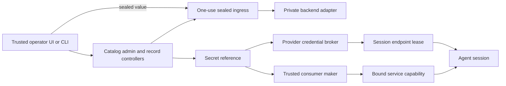

# Daemon Secret and Credential Capabilities

| | |
|---|---|
| **Created** | 2026-09-03 |
| **Author** | Kumavis (prompted) |
| **Status** | Proposed |

## Status

This document fills the credential-store row of
[daemon-capability-bank](daemon-capability-bank.md).
It proposes an architecture and an implementation sequence; no secret-manager
or Space UI code has landed from this design.

The proposal incorporates evidence from:

- the process-local bearer/basic credential capabilities already on `llm`;
- the `requestSecret` / `writeSecret` experiment in
  `endojs/endo-but-for-bots#994`, especially commits `a48bea2b3`, `649ce4452`,
  `cacedf4a6`, and `27f308ea0`;
- Floot issues `#22` and `#26`;
- the hosted-agent boundary in `packages/codex-sandbox/SUBSCRIPTION-AUTH.md`
  and `SANDBOX-CONTRACT.md` in the Floot refactor checkout; and
- the `BrokerLeaseV1` validator at that boundary.

The exploratory PR is evidence, not a patch to cherry-pick.
Its direct ingestion UI is useful, but its generic
`writeSecret(mount, path, credential)` turns any credential plus any writable,
readable mount into plaintext available to the agent.
That reduces accidental transcript leakage but does not provide
non-exportability or least authority.

## What is the Problem Being Solved?

Today an operator who needs to give an Endo-hosted agent a service-account
file, API token, password, or subscription login has two bad defaults:

1. put the value in chat, a tool argument, source text, or an environment
   variable, where it can reach a model transcript and logs; or
2. put the value in host setup state and grant a broad authority that is hard
   to rotate, revoke, audit, or delegate safely.

The daemon already has the beginning of the right object shape for Git:
bearer/basic credentials have guest-safe facets, host-only controllers, fixed
audiences, revocation, and in-place rotation.
Their material is nevertheless process-local, is unavailable after restart,
and can be recovered by privileged daemon code.
There is no general durable secret provider, no storage contract, no safe
operator ingress channel, and no common way to compose a secret with a server
without also giving code a byte-extraction primitive.

The goal is not a global map from names to strings.
It is a family of narrowly delegable objects backed by an arbitrary secret
management system, with the daemon acting as an object-capability membrane.

## Goals

- Secret plaintext does not enter model prompts, transcripts, ordinary tool
  arguments, formula records, pet stores, audit records, or diagnostic logs.
- A guest can hold and delegate a reference or a use-specific capability
  without receiving a `read`, `reveal`, `bytes`, or generic file-write method.
- A holder of a record controller can replace and revoke a value without
  replacing every object that depends on its stable identity.
- Secret identity and policy survive a daemon restart; whether value material
  is durable is explicit in the selected backend profile.
- Trusted consumers can compose a secret with a bounded operation such as one
  Git remote, one HTTP origin, one signing key, or one provider broker.
- Dynamic credentials and short-lived leases are preferred over exporting
  static bytes.
- A future Secret Space can enumerate sanitized metadata, replace values,
  revoke use, and inspect audit history without revealing values.
- A backend capability can be an Endo-native external store, an HSM-backed
  signer, or a test-only in-memory store without changing guest-facing facets.

## Non-goals

- This abstraction does not prove that every backend encrypts at rest, protects
  its backups, safely bootstraps its root capability, or keeps an adequate audit
  trail.
  Those are deployment-profile requirements and must be attested and tested.
- It does not make plaintext non-exportable after an explicitly trusted
  consumer has received plaintext.
- It does not treat a shared `auth.json`, an environment variable, or a mounted
  secret file as equivalent to a provider-only credential broker.
- It does not add Floot or Secret Space UI in this slice.
- It does not design vendor OAuth protocols that the vendor does not support.
- It does not put secret values into the daemon's content-addressed store.
  Hash-addressing secret plaintext creates an offline guessing oracle for
  low-entropy values.

## Terminology and Authority

| Term | Meaning |
|---|---|
| **secret record** | Stable daemon identity and policy for one logical secret; it contains no value bytes |
| **secret reference** | Delegable, guest-safe facet for a record; metadata and liveness only |
| **secret controller** | Caretaker facet that can begin replacement, revoke, and inspect management audit metadata |
| **catalog admin** | Authority to enumerate sanitized daemon-known records and create new records; creation returns that record's controller |
| **use grant** | Revocable authority to combine one secret record with one consumer policy |
| **consumer** | Trusted implementation that performs a bounded operation with a value or delegates a narrower service object |
| **backend** | Private provider adapter that owns or retrieves value material |
| **ingress** | One-use, expiring operator channel for creating or replacing a value |
| **lease** | Expiring, revocable authority for one runtime consumer or session; not necessarily secret plaintext |

Possession of a secret reference alone grants no use.
Useful authority arises only when a trusted maker combines the reference with
an endowed consumer capability and an attenuation.
This is intentional object-capability composition, not ambient lookup.

All authorization in this design is capability possession.
Names such as account reference, session ID, workload label, and provider
origin constrain or describe an operation but confer no authority.
No interface accepts a principal or role and consults a permission table.
Audit attribution records what occurred after a capability invocation; it is
never an authorization input.

## Architecture



There are three deliberately separate planes:

1. The **management plane** is a graph of capabilities for enumeration,
   ingress, replacement, revocation, store selection, and audit.
2. The **composition plane** turns a reference into a consumer-specific
   capability under an attenuation chosen by a controller holder.
3. The **use plane** exposes only the resulting service operation or bounded
   lease to an agent.

No agent-facing object leads back to the catalog admin.
No consumer receives the backend's root capability.

## Public Facets

The exact guards remain implementation work, but the public vocabulary should
look like the following.

```ts
type SecretDescription = {
  kind: 'opaque' | 'bearer' | 'basic' | 'json' | 'keypair' | 'oauth';
  purpose: string;
  state: 'active' | 'revoked' | 'expired' | 'unavailable';
  policyEpoch: bigint;
};

interface SecretReference {
  describe(): Promise<SecretDescription>;
  help(): string;
}

interface SecretController {
  inspect(): Promise<SecretAdminDescription>;
  beginReplace(options?: { expectedGeneration?: bigint }): Promise<SecretIngress>;
  revoke(reason: string): Promise<void>;
  followStatus(): Promise<AsyncIterator<SecretStatusEvent>>;
}

interface SecretIngress {
  parameters(): Promise<SealedIngressParametersV1>;
  submit(envelope: SealedIngressEnvelopeV1): Promise<SecretReceipt>;
  cancel(): Promise<void>;
}
```

`SecretReference` deliberately has no `read`, `reveal`, `unwrap`, `materialize`,
or `writeSecret` method.
The description omits provider locators, account identifiers, value size,
digests, and version labels unless a separately privileged inspector needs
them.

The `SecretController` is not derivable from a `SecretReference`.
As with `GitCredentialController`, the daemon keeps a private association from
the public facet to the controller and gives controllers only to holders of the
corresponding host-side management capability.

The catalog admin may list `SecretAdminDescription` records and create/import
new records, receiving the new record's controller as part of creation.
It cannot turn an arbitrary record ID into a controller.
It does not have a bulk `readAll` operation.
Individual provider adapters may necessarily hold broad backend authority, but
that authority is an explicitly injected root capability in the trusted
computing base and is never handed through the catalog.

## Consumer-specific Composition

The daemon must prefer capabilities that perform a useful operation over a
generic secret handle that can be cashed for bytes.

Initial consumers are:

| Consumer | Result given to an agent | Where plaintext may exist |
|---|---|---|
| Git HTTPS | `GitRemote` bound to URL/ref policy | trusted Git transport helper only |
| HTTP bearer/basic | `HttpClient` or `HttpAuthorization` bound to exact scheme, host, port, methods, and paths | trusted HTTP transport immediately before header construction |
| signing key | `Signer` with algorithm and context restrictions | ideally never outside HSM/KMS; otherwise trusted signer process |
| hosted model subscription | `BrokerLeaseV1` endpoint capability | external broker only; not app-server or tool descendants |
| fixed server | server capability created with a reviewed consumer manifest | server process; it is inside the secret's trust boundary |

A consumer maker validates both sides of the composition:

- the secret kind and immutable scope are compatible with the consumer;
- the consumer is a daemon-minted capability recognized by unforgeable object
  identity, not a string identity or caller-supplied remotable;
- target origins, paths, methods, models, quotas, and expiry are fixed before
  the result reaches the agent;
- any value crossing into a header, text file, or parser satisfies a
  consumer-specific size, encoding, and grammar check; bearer/basic values
  reject control characters and JSON/key material is parsed against its
  expected schema;
- the caller cannot substitute a different sink after approval; and
- rotation and revocation state is consulted at each new use.

An agent may compose objects and delegate the resulting server, `GitRemote`,
`HttpClient`, `Signer`, or lease.
It may pass a `SecretReference` to a trusted maker it has been endowed with,
but it does not get a general maker for arbitrary URLs, commands, or sinks.

### Explicitly exportable consumers

Some stock programs accept credentials only in a file or environment variable.
Supporting them is an explicit downgrade, not the default meaning of a secret
capability.

A `SecretFileGrant` may be created only by possession of both the record
controller and the specific file-export maker for:

- one daemon-minted process or sandbox capability;
- one exact path, ownership, and mode;
- one policy epoch and bounded lifetime;
- a destination not readable by the requesting agent or its ordinary tools;
- cleanup and revocation behavior; and
- an audit event that says the consumer received exportable material.

The consumer process can still print, transmit, or copy the secret.
The UI and documentation must say that it is now inside the secret's trust
boundary.
If model-controlled code can influence that process, non-exportability is not
claimed.

There is no general replacement for `writeSecret` in the agent tool set.

## Secret Requests and Operator Ingress

An agent request is an untrusted request for authority, not a policy decision.
The proposed tool is consequently `requestCredential` or `requestAuthority`,
not a function whose parameters mint a secret directly.

The request may state:

- a human-readable purpose;
- the desired consumer kind, such as Git remote or provider broker;
- the desired target and constraints; and
- the requesting session and intended lifetime.

The agent does not choose a secret record, backend locator, account, final
audience, or controller pet name.
The holder of the corresponding approval capability may deny the request, bind
an existing record, create a new one, or grant a narrower target than
requested.
The result is a system-minted pet name or direct service capability plus a
metadata-only receipt.

The receipt contains no value, digest, byte count, provider path, upstream
account identifier, or reusable capability URL.

### Sealed ingress

TLS protects a network hop but not plaintext after a generic RPC logger has
decoded it.
An ingress therefore exposes a one-use public encryption key, request ID,
policy digest, expiry, maximum size, and algorithm identifier.
The trusted UI encrypts the value before sending it through CapTP.
Submission uses an exactly guarded, versioned envelope containing only the
request ID, algorithm identifier, encapsulated key, and ciphertext.
The associated data binds the ciphertext to the request ID, operation
(`create` or `replace`), record ID, policy digest, and expiry.

The production implementation should use a reviewed HPKE or equivalent
library, not a new Endo cryptographic construction.
When the selected backend supports sealed import, it mints the ingress key and
receives the ciphertext directly.
The daemon then transports only the envelope and policy metadata.
For an in-process local adapter, decryption still occurs in the daemon trust
boundary, but behind the private adapter rather than in the generic manager or
CapTP path.
A backend that cannot accept sealed imports must declare the wider
daemon-decrypts boundary in its profile.
The one-use private key exists only in the backend ingress acceptor and is
destroyed on success, cancellation, expiry, or loss of the accepting process.
Submitting the same ciphertext twice fails.

This is similar in purpose to Vault response wrapping: an intermediary carries
a short-lived, one-use envelope rather than the underlying secret.
It does not protect against a compromised operator browser, malicious browser
extension, or compromised backend.

Plaintext must not use JavaScript strings after the UI boundary.
It enters as `Uint8Array`, stays behind private, non-passable interfaces, and is
overwritten on best effort after use.
JavaScript and copying runtimes cannot promise perfect erasure, so process and
core-dump controls remain necessary.

## Backend Provider Interface

The provider interface is daemon-private.
It is not a remotely reachable object and is never included in a guest powers
record.
A `SecretStoreMaker` capability is directly endowed at daemon bootstrap or
received by delegation in the same style as other host powers.
There is no ambient registry in which a caller supplies a backend name and the
daemon looks up authority.
Where multiple stores exist, a holder explicitly combines one store-maker
capability with a catalog maker and receives a record-creation capability
confined to that store.

Conceptually it must support:

- mint a fresh durable create-operation facet from `SecretStoreMaker`, and
  replace/revoke/purge operation facets from a held record controller;
- let the create operation accept sealed ingress and return distinct per-record
  use and controller facets;
- replace with compare-and-swap on the provider generation;
- report sanitized status and current generation;
- open one bounded use for a specifically endowed consumer capability;
- revoke provider-side leases and disable future reads;
- tombstone and, separately, purge material; and
- make every operation facet self-describing and idempotent so recovery requires
  possession of that facet rather than lookup by an operation ID.

The private use result may be bytes, a dynamic lease, or a provider-native
operation such as `sign`.
The common interface must not force an HSM-held private key to become bytes just
to satisfy a lowest common denominator.

No backend method accepts `recordId` and returns authority.
The random record ID is only a non-authorizing correlation label for formula
state and audit.
Provider paths, device handles, tenant labels, and imported locators stay
inside the private per-record facets and are never caller-supplied lookup keys.

### Backend acceptance profile

Every production backend ships a machine-readable, exact
`SecretBackendProfileV1` plus effective deployment tests.
The profile records, at minimum:

| Property | Required statement |
|---|---|
| value durability | memory-only, host-durable, or external-durable |
| encryption at rest | algorithm/service and which data, WAL, temp files, and backups it covers |
| key custody | which endowed sealer, signer, or device capability controls cryptographic operations |
| bootstrap authority | how the initial root capability is delivered, retained, rotated, recovered, and revoked |
| delegation surface | facets for create, use, replace, revoke, export, and purge; available attenuations and revokers |
| authority model | capability possession only; principal/role permission checks are non-conforming |
| capability durability | sturdy-facet behavior across service, transport, daemon, and backup restart |
| backend audit | event coverage, integrity, retention, and time source |
| backup/recovery | included data, required recovery capabilities, RPO/RTO, and restore test |
| rollback resistance | monotonic anchor or explicit lack of rollback detection |
| deletion | tombstone and physical-purge semantics, including replicas/backups |
| consistency | version promotion, concurrency, and stale-read behavior |
| availability | fail-open/fail-closed behavior and maintenance recovery path |
| limits | maximum secret size, request rate, and concurrent leases |

An attestation is a checked configuration claim, not proof.
CI and deployment acceptance tests must validate effective behavior.
This follows the same discipline as `HostedAgentPolicyV1`: requested flags do
not establish the boundary.

No production fallback silently stores plaintext in `endo.sqlite`, the formula
body, the CAS, an adjacent JSON file, or an environment variable.
A test-only memory backend is acceptable if its profile states
`valueDurability: "memory-only"` and production policy rejects it.

### Reference backend choice

The recommended reference is an Endo-native `SecretStore` service, running as a
separate hosted process and reached through CapTP or OCapN.
Its bootstrap surface is a `SecretStoreMaker` that can create new records but
cannot enumerate or reacquire existing ones.
Creating a record immediately returns distinct ingress, bounded-use, and
controller facets; every later operation follows from one of those facets.
Enumeration is a daemon catalog view over records whose facets it already
retains, not a backend lookup service.
The service does not maintain a database of principals, roles, or permissions.

The store encrypts each record independently and receives its sealing and audit
append powers as capabilities.
An HSM can be used when its integration supplies an operation capability rather
than asking the secret store to authorize a caller identity.
The hosted acceptance suite exercises version promotion, leases, revocation,
attenuation, audit, backup, rollback, and recovery through the capability
surface.

"Arbitrary backend" therefore means an implementation of this capability
protocol, not an arbitrary authorization model.
An adapter whose security depends on an external identity/role permission
check is non-conforming and cannot be the production authority boundary.
An encrypted blob beside `endo.sqlite` is also not the default because it
recreates root-key bootstrap, rollback, backup, and audit problems inside the
daemon deployment.

## Daemon Persistence and Formula Shape

A new `secret-reference` formula records durable identity, public policy, and
private capability dependencies, but no secret value material:

```js
{
  type: 'secret-reference',
  backendUse: '<formula identifier for a per-record backend use capability>',
  backendControl:
    '<formula identifier for a per-record backend controller capability>',
  recordId: '<random 256-bit identifier>',
  kind: 'bearer',
  purpose: 'Forgejo push for project X',
  immutableScope: {
    audience: 'https://git.example',
  },
}
```

It never contains value bytes, ciphertext, a value hash, provider locator,
credential username, account ID, or OAuth refresh metadata.
Pet stores name formula identities as usual; they do not become secret stores.
The `backendUse` and `backendControl` fields are formula dependencies that
resolve to already-held per-record capabilities.
Neither is a store root, and `recordId` cannot be used to reacquire either one.
The formula maker closes over both backend facets, returns only the public
reference, and rebuilds its host-private reference-to-controller association on
each incarnation.

The backend formula identifiers are ordinary authority-bearing references in
the daemon's existing powerbox and capability wallet.
This design does not change the wallet's durability, inspection, backup, or
compromise expectations.
Its additional constraint is only that credential value material and private
provider locators do not enter the formula database, `describe()`, Space views,
audit, or logs.

The backend is authoritative for value generation and provider availability.
The daemon keeps a monotonic `policyEpoch` and revocation tombstone so it can
fail closed even while the backend is unavailable.

- Replacement promotes a new backend generation under the same record ID.
  Existing bound services see the new generation on their next use.
- A scope or kind change creates a new record and new grants.
  Rotation cannot widen authority.
- Revocation first increments the daemon policy epoch and marks the record
  revoked, then revokes provider leases/material.
  A crash after the first step is safe and recovery retries provider cleanup.
- Purge is separate from revoke and requires checking dependent grants and the
  backend retention policy.
  The formula remains a revoked tombstone until dangling references and audit
  retention can be diagnosed.

Every lifecycle mutation has a durable operation capability and a separate
non-authorizing correlation ID for audit.
Provider compare-and-swap and invocation of the same operation capability make
retries idempotent.
If the provider promotes a replacement but the daemon crashes before recording
completion, recovery reads the provider's current generation, verifies the
retained operation facet, and completes the audit record rather than replaying
plaintext.

Strong rollback protection requires a monotonic anchor outside the restored
state set.
A backend without one must state that restoring daemon and secret-manager
backups together can resurrect an old value or policy epoch.

## Use Leases, Rotation, and Revocation

Each use grant binds:

- record ID and minimum policy epoch;
- the unforgeable consumer capability and consumer kind;
- exact audience/resource policy;
- a session/workload capability when confinement to one is required;
- expiration and renewable/not-renewable status;
- quotas appropriate to the operation; and
- the controller that can revoke the grant independently of the record.

At the start of each operation, the consumer checks record state and obtains a
short internal lease.
It checks the epoch again immediately before injecting authorization or
performing a provider-native operation.
Consumers do not cache static plaintext across operations unless their profile
explicitly declares a bounded cache lifetime and invalidation channel.

Revocation prevents new use immediately at the Endo boundary and attempts to
revoke outstanding provider leases.
It cannot retract bytes already delivered to an exportable consumer or cancel
an upstream request that has already committed.
The audit result must distinguish requested, locally enforced, provider
confirmed, and partially failed revocation.

Rotation is version promotion, not re-minting the public capability.
Providers with `current` / `pending` / `previous` semantics can stage, test, and
promote before retiring the old version.
Providers with dynamic credentials return a fresh lease instead.

## Audit and Logging

Audit records contain metadata only:

- operation ID, record ID, grant ID, and policy epoch;
- causal invocation and approval event IDs, plus optional non-authorizing
  workload labels;
- requested and granted consumer policy;
- create, replace, use, deny, expire, revoke, cleanup, and purge outcomes;
- provider status codes normalized to a closed vocabulary; and
- timestamps from the deployment's trusted time source.

Audit records do not contain values, ciphertext, provider response bodies,
authorization headers, capability URLs, value hashes, raw provider locators,
or exact byte lengths.
General application logs contain only an audit event ID.
The hash-chained/independently anchored audit pattern from the hosted-agent
design is suitable; the mutable secret store must not hold authority to rewrite
its audit anchor.

Provider errors are translated at the private adapter boundary.
No exception object or HTTP response body from a provider crosses into a guest
or generic logger.

Release tests inject unique canary secrets and assert absence from:

- stdout/stderr and structured logs;
- CapTP trace/debug logs;
- formula and pet-store SQLite rows, WAL, and content store;
- agent transcripts, tool arguments/results, and audit payloads;
- exception messages, causes, and serialized promise rejections;
- process argv and environment;
- metrics labels and crash reports; and
- files outside an explicitly exportable consumer destination.

Tests must inspect the artifacts, not merely assert that a redaction function
was called.

## Future Secret Space

The Secret Space receives a narrow catalog-view capability and selected record
controllers.
Its available controls are exactly the methods reachable from those
capabilities; there is no logged-in role whose permissions are consulted.
It may show:

- holder-supplied label and purpose;
- kind and fixed scope;
- active/revoked/unavailable state;
- creation, last replacement, expiry, and last-use times;
- bound consumer/grant count and sanitized descriptive labels;
- backend profile name and health; and
- audit events.

It may begin create/replace ingress, revoke, and request purge.
It has no reveal, copy, download, or "show temporarily" action.
A holder who truly needs export must separately possess a break-glass
capability and audit append capability supplied outside the ordinary Space.

Agent-originated requests appear as requests, visibly separated from existing
records.
The UI displays the requested target and the narrower policy actually being
granted before approval.

This design intentionally does not implement that UI.

## Relationship to Hosted Codex and Claude Code

The general secret manager and the provider credential broker are separate
components.
The secret manager may hold a broker's bootstrap or refresh state, but a model
session receives only the broker's session lease.

For `BrokerLeaseV1`, the broker—not the agent and not a generic secret
materializer—binds provider origin, account reference, session ID, image
digest, network namespace, expiry, model allowlist, and request/byte/cost
quotas.
The lease endpoint plus its process-confined route is the capability.
The account and session fields attenuate and attest that capability; they are
not subjects for an access-control check.
The admission validator accepts exactly `version`, `leaseId`, `sessionId`,
`imageDigest`, `networkNamespaceId`, `providerOrigin`, `accountRef`, `endpoint`,
`expiresAt`, `modelAllowlist`, and `limits`; the limits record accepts exactly
positive `requests`, `bytes`, and `costMicrounits`.
Provisioning derives a monotonic in-process deadline from the accepted expiry,
and the broker independently enforces expiry so a wall-clock rollback in the
slice cannot extend authority.
Revoking the lease denies its endpoint without rotating every upstream
credential.
The broker route remains reachable by app-server and unreachable by
model-launched commands and descendants.

### Codex

Current official Codex documentation says ChatGPT login state is cached in
`auth.json` or an OS credential store and refreshed by Codex.
It also documents custom proxy providers that either reuse OpenAI auth or use a
separate command-supplied proxy bearer.
The former still puts the reusable ChatGPT credential in Codex; the latter is a
separate proxy credential and does not by itself establish individual
subscription billing.

Consequently:

- do not share or mount a durable `auth.json` into hosted sessions;
- do not seed it on each start or let multiple sessions race its refresh file;
- a command helper is suitable for retrieving a short-lived broker lease token
  only if the pinned Codex release supports it and the lease—not the upstream
  credential—is what it prints;
- enterprise Codex access tokens or workload identity can be held by the
  broker when the operator's plan supports them; and
- individual ChatGPT-subscription mode remains disabled until the exact pinned
  CLI works through a vendor-supported broker configuration without receiving
  the real reusable credential.

This pushes back on Floot issue `#26`'s shared, writable host `auth.json`
proposal.
That proposal solved restart continuity but conflicts with the later
credential-free `CODEX_HOME`, per-session isolation, and broker-only contract.

### Claude Code

Current Anthropic documentation says a gateway credential or `apiKeyHelper`
replaces a Claude.ai subscription login for that session.
Setting only a gateway base URL can preserve subscription billing, but then the
saved Claude.ai login remains the active credential and the gateway must
forward it.
That does not satisfy the requirement that no reusable subscription credential
enter the slice.

Therefore the same fail-closed rule applies:
API/enterprise gateway modes may use broker leases, but Claude Pro/Max
subscription mode remains unavailable until a vendor-supported flow keeps the
real OAuth state outside the slice.

## Adversarial Review Loop

The proposal was attacked in three rounds.
Each round changed the design rather than merely documenting the attack.

### Round 1: capability laundering and confused deputies

| Attack | Result | Revision |
|---|---|---|
| Agent combines a credential with a writable mount, then reads the file. | Valid against PR #994 `writeSecret`. | Remove generic `writeSecret`; require consumer-specific makers and mark file delivery as an explicit exportable downgrade. |
| Agent requests the production token but supplies an attacker origin as `audience`. | Valid if request arguments become policy. | Treat agent requests as untrusted proposals; the operator/controller selects the record and final scope. |
| Agent passes a fake sink remotable whose `write` method records bytes. | Valid for callback/sink-based unsealing. | Consumers must be daemon-minted and privately registered; no caller-provided callback receives material. |
| Agent holding a secret and generic HTTP maker recombines it with arbitrary URLs. | Valid confused-deputy path. | The maker validates the pair and returns an origin/path/method-bound client; no generic maker is endowed. |
| Compromised code asks the catalog to enumerate every secret. | Valid if catalog and record authority are one object. | Split catalog admin, per-record controller, reference, and use grant; agents receive none of the catalog. |
| A daemon caller supplies `backendId`, principal, or role and relies on a permission table. | Valid reintroduction of ambient authority. | Remove the backend registry and authorization by descriptive identity; directly compose a `SecretStoreMaker`, catalog maker, per-record facets, and consumer capability. |

### Round 2: restart, rotation, and recovery

| Attack | Result | Revision |
|---|---|---|
| Daemon restart leaves a durable formula pointing at forgotten process-local material. | Already observed by Git credentials. | Move value durability to the backend; revive references by random record ID and report `unavailable` fail-closed. |
| Rotation re-mints a cap and strands every existing `GitRemote`. | Already observed in PR #994. | Stable record identity with backend generation promotion; scope widening creates a new record. |
| Revoke races an in-flight fetch that has already obtained bytes. | Partially valid; revocation cannot claw bytes back. | Short internal leases, epoch check immediately before use, explicit audit states, and no stronger claim than stopping future use. |
| Crash between provider update and daemon metadata update causes double rotation. | Valid dual-write hazard. | Unique operation IDs, provider CAS, provider-authoritative generation, and recovery reconciliation. |
| Restore resurrects an old credential and old policy. | Valid when all state rolls back together. | Backend profile must disclose rollback resistance; strong profiles require an external monotonic anchor. |
| Purge deletes material while old capabilities still resolve. | Valid availability and diagnostic failure. | Revoke first, retain a formula tombstone, enumerate dependent grants, then purge under retention policy. |
| Shared subscription auth file is refreshed concurrently by many sessions. | Valid and conflicts with session isolation. | Broker owns upstream state and mints independent per-session leases; no shared auth file in slices. |

### Round 3: ingress, logs, and trusted consumers

| Attack | Result | Revision |
|---|---|---|
| Direct UI RPC avoids the transcript but a CapTP debug logger records its argument. | Valid. | One-use sealed ingress; ordinary RPC and trace layers see ciphertext only. |
| The generic daemon manager decrypts a sealed submission before calling an external backend. | Valid; sealing would protect only the RPC hop. | Terminate sealed import at the backend when supported; otherwise disclose and test the wider daemon-decrypts boundary. |
| Receipt byte length identifies a key type or structured credential. | Valid metadata side channel. | Remove exact byte length from ordinary receipts and views. |
| A stored bearer contains CR/LF, or structured credentials exploit a trusted consumer's parser. | Valid injection path through the trusted computing base. | Consumer-specific size, encoding, grammar, and schema validation occurs before construction or use. |
| Provider returns an error body containing the submitted value. | Plausible. | Normalize errors inside the private adapter; never forward provider bodies or causes. |
| A malicious trusted server prints its file-delivered secret. | Valid and unavoidable after plaintext delivery. | Export requires a distinct maker capability and is bound to a daemon-minted consumer capability inside the stated trust boundary. |
| Provider adapter lies about encryption, audit, or deletion. | Valid; interface guards cannot prove operational controls. | Exact backend profile plus provider-specific audit and effective end-to-end acceptance tests. |
| Request spam fills operator UI or retains ingress private keys. | Valid denial of service. | Per-requestor pending limits, expiry, size/rate quotas, cancellation, and key destruction. |
| Logs redact known field names but miss nested/coded values. | Valid. | Artifact-scanning canary tests across every output and persistence surface; metadata-only construction rather than field-name redaction as the primary defense. |
| Wall-clock rollback keeps an accepted provider lease alive. | Valid if the slice alone interprets `expiresAt`. | Derive a monotonic local deadline at admission and require independent broker-side expiry enforcement. |

## Residual Risks

- The trusted operator UI sees plaintext before sealing.
- A backend that can return plaintext and the daemon process hosting its
  adapter are in the plaintext trust boundary.
- JavaScript cannot guarantee erasure of all copied plaintext from memory.
- A consumer that receives plaintext can exfiltrate it; process isolation and
  egress policy remain necessary.
- A broker can misuse the upstream credential it owns.
  Provider policy, network isolation, audit, and organizational controls remain
  necessary.
- Traffic analysis still reveals request timing and bounded size classes.
- A controller holder can grant the wrong record or an overly broad consumer.
- Revocation cannot undo an already committed upstream action.
- Availability of a strict fail-closed backend can become an operational
  dependency; break-glass and recovery are deployment responsibilities.

## Implementation Sketch

Endo durability here means durable **designation and recipe**, not retaining a
JavaScript object graph in memory.
The formula identifier remains the stable capability identity.
After restart, `provide(id)` evaluates the stored formula again, reconnects its
backend capability dependencies, and creates a new in-process incarnation
behind that identity.

### Package and module seams

| Location | Responsibility |
|---|---|
| `packages/exo-secret/` | guarded public reference/controller/ingress interfaces, facet construction, and host-private instance recognition |
| `packages/secret-store/` | Endo-native store-maker and per-record backend facet interfaces, sealed storage, version promotion, and test implementation |
| `packages/daemon/src/secret-types.ts` | checked formula, state, operation, receipt, and profile types; no runtime code |
| `packages/daemon/src/manager-database.js` | metadata-only record state and operation journal, with Node/XS statement parity |
| `packages/daemon/src/manager.js` | formula maker, dependency extraction, formulation, reconciliation, and private consumer composition |
| `packages/daemon/src/host.js` | host capabilities for record creation, catalog view, controller recovery, and bounded consumer construction |
| `packages/exo-git/` | first consumer; replace process-local credential material with a private secret-use binding |

Runtime modules remain `.js` with `// @ts-check` and JSDoc imports.
New canonical type definitions live in checked `.ts` files and emit declarations
only.
Every exported value is hardened according to repository convention.

### Durable formula and metadata records

The formula is an immutable recipe with capability dependencies:

```ts
export type SecretReferenceFormula = {
  type: 'secret-reference';
  backendUse: FormulaIdentifier;
  backendControl: FormulaIdentifier;
  recordId: SecretRecordId;
  kind: SecretKind;
  purpose: string;
  immutableScope: SecretScope;
};
```

`backendUse` and `backendControl` normally name `marshal` formulas whose slots
retain sturdy per-record backend facets.
They are not provider names or record lookup keys.
`extractDeps()` returns both edges so formula GC cannot collect the backend
facets while the reference or one of its dependents remains reachable.

Mutable, non-secret lifecycle metadata lives outside the formula body:

```ts
export type SecretRecordState = {
  formulaNumber: FormulaNumber;
  status: 'pending' | 'active' | 'revoked' | 'unavailable' | 'purged';
  policyEpoch: NaturalDecimal;
  generation: SecretGeneration | null;
  pendingOperationId: SecretOperationId | null;
};

export type SecretOperation = {
  operationId: SecretOperationId;
  operationCap: FormulaIdentifier;
  formulaNumber: FormulaNumber | null;
  kind: 'create' | 'replace' | 'revoke' | 'purge';
  phase:
    | 'prepared'
    | 'backend-committed'
    | 'locally-committed'
    | 'audit-anchored'
    | 'failed';
  expectedGeneration: SecretGeneration | null;
};
```

These become `secret_record_state`, `secret_operation`, and a metadata-only
`secret_audit_outbox` table in `endo.sqlite`.
They contain no secret bytes, ciphertext, provider locator, backend bearer,
account credential, or exception body.
Generations and epochs use canonical decimal strings so their domain is not
silently narrowed to SQLite or JavaScript integer limits.
Validators return branded `SecretRecordId`, `SecretOperationId`,
`SecretGeneration`, and `NaturalDecimal` types at the persistence boundary so
downstream code does not rely on unchecked casts.

The database layer gains a transaction that commits the formula row, initial
state, and operation phase together before the formula becomes visible in the
in-memory graph.
Remote-capability `marshal` formulas are transiently pinned while this
transaction is assembled; an interrupted, unreferenced marshal is ordinary
formula-GC work.
Every incomplete operation capability is also bound in a host-private operation
pet store until its state is terminal and its audit event is anchored.
The SQL row alone is not treated as a formula-graph retention edge.

### Existing powerbox boundary

The formula database already acts as a capability wallet for the powerbox,
independent of secret management or external API keys.
The `backendUse`, `backendControl`, and operation-capability identifiers follow
those existing semantics.
This proposal adds no special encryption, backup, restore, or formula-inspection
rule for them.

In particular, the existing privileged `getFormula()` capability keeps its
current meaning: granting it permits inspection of the formula dependency
graph, including these dependencies.
The future Secret Space is simply not endowed with that general diagnostic
capability; its narrower views omit formula internals by construction.

### Formula maker and facet reincarnation

The manager adds `secret-reference` to `formula-type.js`, the `Formula` union,
dependency extraction, and the maker table.
The maker is shaped like this:

```js
'secret-reference': async (formula, context, id) => {
  const [backendUse, backendControl] = await Promise.all([
    provide(formula.backendUse),
    provide(formula.backendControl),
  ]);
  const { number } = parseId(id);
  const kit = makeSecretReferenceKit({
    description: harden({
      kind: formula.kind,
      purpose: formula.purpose,
      immutableScope: formula.immutableScope,
    }),
    backendUse,
    backendControl,
    readState: () => persistencePowers.readSecretRecordState(number),
    transact: transition =>
      persistencePowers.transitionSecretRecord(number, transition),
  });

  secretInternalForReference.set(kit.reference, kit.internal);
  secretControllerForReference.set(kit.reference, kit.controller);
  context.onCancel(kit.dispose);
  return kit.reference;
},
```

The actual named factory is followed immediately by
`harden(makeSecretReferenceKit)`.
It returns `harden({ reference, controller, internal, dispose })`.
Only `reference` leaves the formula maker.
`internal` contains the backend use facet and is recoverable only through the
host-private `WeakMap`; `controller` is recoverable through a different
host-private `WeakMap`.
`getSecretController(fake)` and consumer composition with a forged reference
therefore fail by object identity.

The weak maps are intentionally ephemeral.
They are rebuilt whenever the formula reincarnates, exactly as the current Git
credential/controller association is rebuilt.
Durability comes from the formula and backend sturdy facets, not from making a
weak map persistent.

`context.onCancel()` cancels followers and outstanding local leases.
It does **not** purge backend material.
Purge is an explicit controller operation with its own durable transaction and
audit event.

### Store-side durable facets

`SecretStoreMaker.makeCreateOperation()` mints a fresh durable operation
presence without accepting a caller-supplied record or operation identifier.
The daemon persists that operation presence before invoking its idempotent
`prepare()` method, which returns three distinct presences:

```ts
export type PreparedSecretRecord = {
  use: StoredSecretUse;
  control: StoredSecretControl;
  ingress: SecretIngress;
};
```

The maker cannot enumerate old records, and no `get(recordId)` method exists.
It also cannot reacquire an operation from an operation ID.
On the store side, each returned presence is a sturdy facet of a durable record
formula.
Reincarnating that exact formula may load its encrypted row using its own
formula number; accepting a caller-supplied number to obtain the facet remains
forbidden.

The store profile gains a `capabilityDurability` claim covering:

- how sturdy per-record facets survive service and transport restart;
- what happens when the store is restored behind or ahead of the daemon;
- whether old revoked facets can reappear after backup restore; and
- how connection loss is distinguished from revocation.

The backend use facet never returns plaintext through CapTP.
For an export-requiring consumer, it returns a one-use envelope sealed to a
key held by a daemon-minted trusted consumer.
The consumer maker performs the instance-recognition check before supplying
that key and never returns the backend use facet or decryption key to its
caller.
Provider-native operations such as signing remain operations on a derived
facet and never become byte export.

### Crash-consistent creation

```mermaid
sequenceDiagram
    participant H as Host holder
    participant D as Daemon manager
    participant DB as Metadata journal
    participant S as SecretStoreMaker
    participant U as Trusted ingress client
    participant A as Append-only audit

    H->>D: prepareSecret(kind, scope)
    D->>S: makeCreateOperation()
    S-->>D: durable create-operation facet
    D->>DB: persist operation facet and correlation ID
    D->>S: prepare(kind, scope) through operation facet
    S-->>D: use, control, ingress facets
    D->>D: persist and transiently pin facet marshal formulas
    D->>DB: atomically persist formula + pending state
    D-->>H: pending reference, controller, ingress
    U->>D: submit sealed envelope through ingress wrapper
    D->>S: forward ciphertext to backend ingress facet
    S->>S: validate and promote generation 1
    S-->>D: metadata-only receipt
    D->>DB: active state + audit outbox / locally-committed
    D->>A: append event through audit capability
    A-->>D: idempotent append receipt
    D->>DB: audit-anchored; release operation pin
    D->>H: publish reference pet name
```

The agent-facing pet name is installed only after the state is active.
The management holder may see and resume a pending record.
If the daemon loses the ephemeral ingress presence, it uses the already-held
operation capability to resume the pending ingress or observe that it expired.

Every remote mutation is a small saga:

1. durably retain the operation capability, correlation ID, and expected
   generation;
2. invoke that operation facet with `E()`;
3. durably record the backend-committed receipt;
4. atomically update local state and enqueue the local audit event; and
5. append through the independently held audit capability, then mark the
   outbox record anchored and release the operation-capability pin.

The SQLite transaction cannot atomically commit an external audit append.
The outbox closes that gap: startup retries an unanchored event by its
non-authorizing correlation ID, and the append-only sink treats repeats as the
same event.

On startup, reconciliation scans only incomplete operation records and
unanchored audit outbox entries, then asks the specific retained operation facet
for its status.
It never enumerates a backend or asks for a record or operation by identifier.

### Replacement, use, and revocation

Replacement stages a generation behind the stable backend facets.
The old generation remains current until the sealed submission validates and
the backend atomically promotes the new generation.
A crash after promotion is recovered from the operation receipt; it does not
replay plaintext or mint replacement facets.

A bounded consumer maker follows this sequence:

1. recognize the public reference in `secretInternalForReference`;
2. combine it with a daemon-minted consumer capability and fixed attenuation;
3. read active state and capture its policy epoch;
4. request a short sealed backend lease for that consumer;
5. recheck epoch, revocation, expiry, and generation after the eventual send;
6. let the trusted consumer decrypt immediately before constructing the one
   request, signature, or process input; and
7. destroy the lease and best-effort overwrite plaintext after the operation.

Revocation first commits `status = revoked` and increments `policyEpoch` in the
local metadata transaction.
New local uses then fail closed before the eventual send.
The controller next obtains and retains a revocation-operation facet from the
already-held backend controller, then invokes it to revoke the use facet and
outstanding leases idempotently.
Reconciliation retries that second half after a crash.

### First consumer: Git HTTPS

The current Git implementation cannot merely replace its process-local material
map.
`GitRemoteEndpoint.ensureCredentialUsable()` synchronously returns a structure
containing the bearer token or basic username/password, and
`backend.remoteFetch()` receives that structure.
That private contract itself must change.

The migration keeps the guest `BearerCredential`, `BasicCredential`, and
`GitRemote` method surfaces stable, but changes host-private plumbing:

- the `git-credential` formula is migrated or replaced by a
  `secret-reference` formula whose immutable scope is the HTTPS origin;
- `GitRemoteFormula.credentialId` continues to be an explicit dependency, now
  pointing at that reference;
- `ensureCredentialUsable()` becomes an asynchronous
  `prepareCredentialUse()` that returns a one-shot private transport authority,
  generation fence, and disposer, never material;
- `remoteFetch()` / `remotePush()` accept that one-shot authority instead of a
  credential data record;
- the trusted native Git transport receives and decrypts the sealed envelope
  immediately before header injection, with nothing in argv or environment;
- the existing post-operation generation/revocation fence remains and the
  one-shot authority is always disposed in `finally`; and
- `GitCredentialController.rotate(material)` becomes
  `beginReplace() -> SecretIngress`, removing plaintext from the host RPC
  argument path.

The existing audience-only guest interface therefore remains useful.
The synchronous `getMaterial()` record hook and
`gitCredentialMaterialForId` map are deleted after migration rather than kept
as a compatibility escape hatch.

### Retention and deletion

A host-private secret catalog pet store pins every live secret-reference
formula.
`GitRemote`, HTTP client, broker, and server formulas also retain explicit
dependency edges to their secret reference.
Removing a human label does not revoke or purge a record.

Purge requires an already revoked record, no live formula or residence
dependencies from consumers, a durable backend purge receipt, and an appended
audit event.
The daemon retains a metadata-only tombstone through the configured audit and
backup-retention window.
Ordinary formula collection never implicitly deletes secret material.

### Tests that define durability

The first implementation is not complete until tests stop and restart the
daemon or store after every numbered step of create, replace, revoke, and
purge.
The suite additionally verifies:

- the reference formula identifier remains stable while its JavaScript
  incarnation changes;
- the host-private controller and internal-use weak maps are rebuilt;
- dependency extraction retains both backend facets and every bounded consumer;
- repeated invocation of the same operation capability is idempotent, operation
  IDs cannot reacquire capabilities, and conflicting generations fail;
- an unavailable store produces `unavailable`, never a replacement empty cap;
- no backend root, per-record internal facet, or record-by-ID lookup reaches a
  guest;
- forged references and consumer remotables fail instance recognition;
- revocation wins races at every eventual-send boundary;
- formula rows, metadata tables, WAL, logs, traces, errors, and transcripts pass
  the canary-secret scan; and
- Node and XS-compatible database implementations pass the same schema and
  recovery fixtures.

## Phased Implementation

### Phase 0: contract and negative fixtures

- Add exact `M.interface()` guards and type contracts for reference,
  controller, ingress, grant, and backend-profile records.
- Add a test-only memory backend that is rejected by production policy.
- Add canary-secret artifact scanners and fake malicious provider/consumer
  fixtures before any production adapter.
- Record the non-exportability claims for every consumer kind.

### Phase 1: daemon record and caretaker facets

- Add the `secret-reference` formula and private controller association.
- Persist random record identity, public immutable policy, and private
  capability dependencies, but no secret value material.
- Add private backend-use/backend-control formula dependencies, metadata state,
  operation journal, audit outbox, and operation-capability retention roots.
- Add policy epoch, revocation tombstones, dependency edges, and status
  following.
- Endow catalog creation and catalog view as distinct host capabilities.

### Phase 2: backend seam and one production profile

- Implement the Endo-native `SecretStore` service and inject its
  `SecretStoreMaker` capability directly at daemon bootstrap; do not add a
  backend registry.
- Implement durable create/replace/revoke/purge operation facets, CAS
  replacement, reconcile-on-start, and exact `SecretBackendProfileV1`
  validation.
- Land the external CapTP/OCapN store as the hosted reference profile.
  Do not ship a plaintext-file fallback.
- Document root-capability bootstrap and recovery, delegated facets, key-sealer
  capabilities, backups, restore, deletion, and audit for that store.

### Phase 3: bounded consumers

- Migrate bearer/basic Git credential material from the process-local map to
  secret records without changing the `GitRemote` guest API.
- Preserve in-place rotation, credential health, generation fencing, and
  revocation tests.
- Add one origin-bound HTTP authorization consumer.
- Add an HSM/KMS-style operation consumer before assuming every secret is a
  byte string.

### Phase 4: operator ingress and agent requests

- Add one-use sealed ingress over a narrow host/operator capability.
- Add request/approval plumbing that carries metadata only through agent
  transcripts.
- Enforce request expiry, one-pending/requestor limits, quotas, and cancellation.
- Keep Secret Space rendering and Floot UI wiring for a separate reviewed PR.

### Phase 5: hosted provider broker

- Implement the external broker and credential-free sidecar independently of
  the generic secret store.
- Have the broker consume a narrowly granted record and mint exact
  `BrokerLeaseV1` session endpoints.
- Prove provider route filtering, process-scoped reachability, refresh,
  rotation, quota, revocation, account switching, crash recovery, and audit
  redaction against pinned stock CLIs.
- Leave unsupported individual-subscription modes disabled.

### Phase 6: Secret Space

- Add metadata-only list/status/audit views.
- Add create/replace/revoke/purge controls using sealed ingress.
- Add explicit warnings and separate approval for exportable consumers.
- Add browser tests proving no reveal/copy path and no plaintext in application
  state snapshots or logs.

Estimated implementation effort is four to six developer-weeks after selecting
and provisioning the first production backend.
Operational key custody, root-capability bootstrap, backup, and recovery work
is additional and depends on that backend.

## Dependencies

| Design or component | Relationship |
|---|---|
| [daemon-capability-bank](daemon-capability-bank.md) | Parent capability-family design |
| [daemon-git-remotes](daemon-git-remotes.md) | First existing non-extractable credential consumer |
| [daemon-agent-tools](daemon-agent-tools.md) | Projects approved service caps into agent tool/code modes |
| [daemon-ocapn-external-connectivity](daemon-ocapn-external-connectivity.md) | Hosted transport for remote sturdy store facets |
| [ocapn-orthogonal-persistence](ocapn-orthogonal-persistence.md) | Durable service-object and reconnect semantics for the external store |
| `@endo/exo-http-client` | Initial origin-bound HTTP consumer |
| `@endo/sandbox` hosted policy | Enforces process and network isolation for exportable consumers and broker leases |
| Floot hosted-agent broker contract | Supplies `BrokerLeaseV1` constraints and provider-specific acceptance tests |

## Research References

Conventional secret-manager references below contribute lifecycle, sealing,
rotation, and operational-test ideas only.
Their identity or role-based authorization models are not adopted.

- [Exploratory secret-capability PR #994](https://github.com/endojs/endo-but-for-bots/pull/994)
- [Floot issue #22: capability-shaped secret ingestion](https://git.goooooo.ooo/floot/endo/issues/22)
- [Floot issue #26: persistent Codex subscription authentication](https://git.goooooo.ooo/floot/endo/issues/26)
- [OWASP Secrets Management Cheat Sheet](https://cheatsheetseries.owasp.org/cheatsheets/Secrets_Management_Cheat_Sheet.html)
- [Vault response wrapping](https://developer.hashicorp.com/vault/docs/concepts/response-wrapping)
- [Vault lease, renewal, and revocation](https://developer.hashicorp.com/vault/docs/concepts/lease)
- [AWS Secrets Manager secret versions](https://docs.aws.amazon.com/secretsmanager/latest/userguide/whats-in-a-secret.html)
- [Secrets Store CSI Driver providers](https://secrets-store-csi-driver.sigs.k8s.io/providers)
- [Codex authentication](https://learn.chatgpt.com/es-419/docs/auth)
- [Codex advanced configuration](https://learn.chatgpt.com/es-419/docs/config-file/config-advanced)
- [Codex enterprise access tokens](https://learn.chatgpt.com/es-419/docs/enterprise/access-tokens)
- [Claude Code gateway behavior](https://code.claude.com/docs/en/llm-gateway)

## Prompt

> Implement arbitrary secret management following Endo object-capability
> principles and daemon design philosophy.
> Reduce accidental exposure to agent sessions and logs while allowing agents
> to compose objects and delegate secret access to servers.
> Avoid a giant bucket of secrets.
> Plan a future Space UI that enumerates, revokes, and replaces values without
> revealing them, but make no Floot UI changes here.
> Reconcile the proposal with the hosted Codex/Claude broker boundary, research
> the prior PR and issues, and run an adversarial loop against the design.
