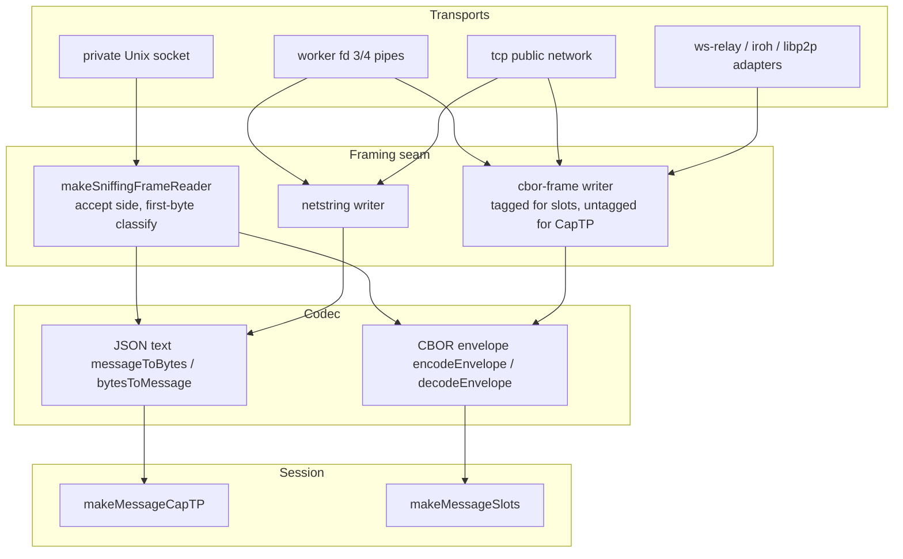

# Daemon Netstring to CBOR-Frame Migration

| | |
|---|---|
| **Created** | 2026-07-12 |
| **Author** | Kris Kowal (prompted) |
| **Status** | Not Started |

## What is the Problem Being Solved?

Every byte-stream session the Endo daemon speaks is framed with
`@endo/netstring`: the private Unix socket between daemon and CLI,
the fd 3/4 pipes between daemon and workers, the `tcp+netstring`
public network, the relay and peer-transport adapters, and the Rust
supervisor's client bridge (`read_netstring` and `write_netstring` in
`rust/endo/src/socket.rs`). Netstring framing is ASCII decimal
length, a colon, the payload, and a trailing comma.

[`cbors.md`](cbors.md) designed the CBOR-shaped sibling of
`@endo/netstring`, and PR
[#288](https://github.com/endojs/endo-but-for-bots/pull/288)
implements it as **`@endo/cbor-frame`** (`makeCborFrameReader`,
`makeCborFrameWriter`): each frame is a CBOR byte-string head (major
type 2, [RFC 8949 section 3.1](https://www.rfc-editor.org/rfc/rfc8949.html#section-3.1))
followed by the payload, optionally wrapped in CBOR tag 24 (Encoded
CBOR data item, [RFC 8949 section
3.4.5.1](https://www.rfc-editor.org/rfc/rfc8949.html#section-3.4.5.1)).
Note the implemented package name `@endo/cbor-frame` supersedes the
`@endo/cbors` name that [`cbors.md`](cbors.md) section Naming
proposed; this document uses the implemented name throughout.

This design migrates the daemon's connection framing from netstring
to cbor-frame, as requested by the maintainer in an inline review
comment on PR
[#124](https://github.com/endojs/endo-but-for-bots/pull/124#discussion_r3566538014)
(`packages/daemon/src/serve-private-path.js`, at the
`makeNetstringCapTP` / `makeNetstringSlots` fork).

Why migrate:

1. **One binary grammar end to end.** The slot-machine wire protocol
   (PR #124) already carries CBOR envelopes between the daemon, the
   Rust supervisor, and workers. Framing those envelopes in netstring
   means a CBOR payload inside an ASCII-decimal wrapper. With
   cbor-frame and tag 24, the entire byte stream is a valid sequence
   of CBOR data items, which a generic CBOR-aware analyzer can walk
   without a custom dissector.
2. **A single length grammar for the Rust supervisor.** `endor`
   hand-rolls netstring parsing in `socket.rs` while speaking CBOR
   envelopes on its other faces. Migrating removes the odd grammar
   out.
3. **Canonical, bounded heads.** cbor-frame heads use the shortest
   canonical argument form ([RFC 8949 section
   4.2.1](https://www.rfc-editor.org/rfc/rfc8949.html#section-4.2.1))
   and are at most 9 bytes; netstring lengths are variable-width
   ASCII with a redundant trailing comma to police.

Both ends of every affected pipe must agree on the framing, so the
heart of this design is the transition story.

## Where Netstring Stands Today (call-site inventory)

Surfaces are listed with the symbols that change. Line numbers are
avoided deliberately; find the symbols by name. The inventory covers
the `llm` branch; deltas introduced by PR #124 (the `endor` lineage)
are called out where they matter.

| # | Surface | Daemon-side symbols | Peer-side symbols | Version coupling |
|---|---------|--------------------|-------------------|------------------|
| A | Private Unix socket | `servePrivatePath` in `serve-private-path.js` calling `makeNetstringCapTP` (and, under PR #124, `makeNetstringSlots`) from `connection.js`; in `endor` mode the Rust bridge `read_netstring` / `write_netstring` in `rust/endo/src/socket.rs` fronts the same socket | `makeEndoClient` in `client.js` (the CLI and every Node client) | Loose: the daemon is long-lived and routinely outlives the CLI version that spawned it |
| B | Worker pipes (fd 3/4, Node daemon) | `makeDaemonicControlPowers` in `daemon-node-powers.js` calling `makeNetstringCapTP` | `worker.js` calling `makeNetstringCapTP` | Tight: daemon spawns the worker from its own installed package, both ends flip together |
| C | engo (Go supervisor) tunnel | `daemon-go-powers.js`: envelope verb `captp` relays raw netstring-framed CapTP bytes; per-worker netstring CapTP sessions run over envelope-fed pipes | same file, worker half | Tight: same install |
| D | Public networks | `networks/tcp-netstring.js` (protocol identifier `tcp+netstring+json+captp0`, embedded in advertised addresses and in invitation-locator hints per `locator.js`); the transport adapters `networks/ws-relay.js` and `networks/iroh.js` + `networks/iroh-stream-adapter.js` (the PR #124 lineage carries `networks/libp2p.js` instead of iroh) | remote daemons of arbitrary version | None: cross-host, cross-version, addresses persist in peer records |
| E | endor external-client transport (slot-machine mode) | `bus-daemon-rust-xs.js`; `socket.rs` decodes the inner CBOR envelope out of each netstring frame in slots mode | `makeNetstringSlots` in clients | Mixed: the socket face is surface A; the envelope hop is same-install |

**Out of scope.** `@endo/ocapn-noise`'s TCP transport also uses
netstring framing; OCapN's framing trajectory is
[`ocapn-tcp-syrups-framing.md`](ocapn-tcp-syrups-framing.md)
(`@endo/syrups`) and is not changed here. The `@endo/netstring`
package itself remains published and maintained; this design retires
the daemon's *use* of it, not the package.

## Design

### Framing and session protocol are orthogonal axes

`connection.js` today fuses three layers per maker:

- `makeNetstringCapTP` = netstring framing x JSON text codec
  (`messageToBytes` / `bytesToMessage`) x `makeMessageCapTP`.
- `makeNetstringSlots` (PR #124) = netstring framing x CBOR envelope
  codec (`encodeEnvelope` / `decodeEnvelope`) x `makeMessageSlots`.

The framing choice (netstring or cbor-frame) is independent of the
session-protocol choice (CapTP or slot-machine), giving a 2x2 matrix.
The maintainer's directive on PR #124 that the slot-machine and CapTP
paths stay "equal in stature" applies equally to the framing axis:
neither framing is privileged in the code shape while both exist.

Introduce a framing seam, `packages/daemon/src/framing.js`:

```js
/** @typedef {'netstring' | 'cbor-frame'} FramingName */

// Writer for one chosen framing.
export const makeFrameWriter = (bytesWriter, { framing, tagged, name }) => ...

// Reader for one chosen framing.
export const makeFrameReader = (bytesReader, { framing, name }) => ...

// Accept-side reader: classifies the first byte, then delegates.
// `framingChosen` settles when the peer's first frame arrives, so an
// accept-side writer can be gated on it.
export const makeSniffingFrameReader = (bytesReader, { name }) => ({
  framingChosen, // Promise<FramingName>
  reader,        // Reader<Uint8Array>
});
```

`connection.js` keeps `makeMessageCapTP` and `makeMessageSlots`
untouched and reshapes the byte-level makers into thin compositions
over the seam, parameterized by framing:

```js
export const makeFramedCapTP = (framing, name, bytesWriter, bytesReader, ...) => ...
export const makeFramedSlots = (framing, name, bytesWriter, bytesReader, ...) => ...
```

`makeNetstringCapTP` and `makeNetstringSlots` remain as one-line
deprecated aliases (`makeFramedCapTP('netstring', ...)`) until every
call site has moved, then are deleted in the retirement phase.

### The wire-compatibility cornerstone: first-byte disjointness

The two grammars are distinguishable from the first byte of a
connection, with no handshake and no version field:

- A netstring frame begins with an ASCII decimal digit: byte values
  `0x30` through `0x39`.
- A cbor-frame frame begins with a CBOR byte-string head (`0x40`
  through `0x5b`: lengths 0 through 23 inline, then the 1-, 2-, 4-,
  and 8-byte argument forms `0x58` `0x59` `0x5a` `0x5b`) or the tag-24
  wrapper (`0xd8`).

The sets are disjoint. An accepting end can therefore peek exactly
one byte and select the framing per connection
(`makeSniffingFrameReader` above). This is the entire
wire-compatibility mechanism: **the accepter is bilingual, the
initiator picks, and the accepter mirrors the initiator's framing on
its own outbound frames.**

Mirroring is sound only if the accepter's first write happens after
the initiator's first frame. On the private socket that holds today:
a CapTP daemon side writes nothing until the client requests the
bootstrap, and a slot-machine daemon side likewise responds to the
client's opening delivery. The design does not merely assume this:
the accept-side frame writer is gated on the sniffing reader's
`framingChosen` promise, so an accidental eager write blocks until
the framing is known instead of guessing wrong.

Tightly-coupled pipes (surfaces B and C) skip sniffing entirely: both
ends ship in the same package and flip in the same commit.

### Per-surface migration

**Surface A (private socket).** `servePrivatePath` wraps each
accepted connection in `makeSniffingFrameReader` and mirrors.
In `endor` mode, `socket.rs` gains the same one-byte classification
and a cbor-frame head encoder and decoder next to `read_netstring` /
`write_netstring` (the head codec is a few dozen lines of Rust; the
envelope handling above it is unchanged). `makeEndoClient` initiates
in netstring until Phase 3, then in cbor-frame.

**Surfaces B and C (worker pipes, engo tunnel).** Atomic flip: change
`makeDaemonicControlPowers`, `worker.js`, and the engo per-worker
session setup in `daemon-go-powers.js` in one commit. The relayed
`captp`-verb envelope payloads in the engo tunnel carry whatever the
framed session produces, so the tunnel follows the session flip
without its own migration. A daemon restart picks up the new framing
on both ends simultaneously because workers never outlive the daemon
that spawned them.

**Surface D (public networks).** The framing is baked into the
advertised protocol identifier, so there is no in-place flip and no
sniffing: introduce a sibling network module,
`networks/tcp-cbor-frame.js`, with protocol identifier
`tcp+cborframe+json+captp0` (spelling under Open Questions), and have
the daemon advertise both addresses during the transition window.
Remote peers connect by whichever advertised address they understand;
old invitation locators carrying `tcp+netstring` hints keep working
until the netstring network module is retired. The transport
adapters (`ws-relay.js`, `iroh.js` plus `iroh-stream-adapter.js` on
`llm`, `libp2p.js` on the PR #124 lineage) follow the same pattern
wherever the framing name appears in an advertised identifier, and
flip atomically where it does not.

**Surface E (endor external transport under slot-machine).** Falls
out of surfaces A and B: once the socket face sniffs and the envelope
codec rides cbor-frame, the double-framing oddity (CBOR envelope
inside ASCII netstring) collapses into CBOR envelope inside CBOR
byte-string head. With tag 24 the entire client-to-supervisor stream
is one valid CBOR item sequence.

### Tag-24 policy

`@endo/cbor-frame`'s writer takes a `tagged` option. The policy:

- **Slot-machine sessions write `tagged: true`.** The payload is a
  CBOR envelope, which is exactly what tag 24 asserts, and the tag
  makes the stream self-describing to generic tooling.
- **CapTP sessions write `tagged: false`.** The payload is JSON text;
  wrapping it in "Encoded CBOR data item" would be false labeling.

Readers accept both forms transparently (a cbor-frame reader already
does), so the tag choice is per-writer and needs no coordination.
Incidentally the tag also lets a wire analyzer distinguish the two
session protocols without parsing payloads.

### Interaction with the slot-machine / CapTP fork (PR #124)

`ENDO_USE_SLOT_MACHINE` selects the session protocol; this design's
framing seam is below it and both branches migrate identically. The
2x2 matrix is explicit in tests (see Test Plan) so neither axis
regresses the other.

Sequencing: PR #124 touches the same regions of `connection.js`,
`client.js`, and `serve-private-path.js` that Phase 1 refactors. To
avoid a conflict-heavy weave, Phase 1 lands after PR #124 merges (or
rebases over whatever of it has landed). If PR #124 stalls, the
migration proceeds unchanged minus the `makeFramedSlots` maker and
the tagged-writer path; nothing else in this design depends on the
slot-machine work.

### Layering picture



## Dependencies

| Related work | Relationship |
|---|---|
| [`cbors.md`](cbors.md) | Names the framing grammar this design adopts; its Naming section is superseded by the implemented package name `@endo/cbor-frame` |
| PR [#288](https://github.com/endojs/endo-but-for-bots/pull/288) (`@endo/cbor-frame`) | Prerequisite: the framing package this design consumes; open at time of writing |
| PR [#124](https://github.com/endojs/endo-but-for-bots/pull/124) (slot-machine) | Adds the second session protocol (`makeNetstringSlots`) that shares the framing seam; Phase 1 sequences after it |
| [`docs/daemon-binary-spec.md`](../docs/daemon-binary-spec.md) | Normative description of supervisor framing; must be updated in the phase that flips each surface |
| [`ocapn-tcp-syrups-framing.md`](ocapn-tcp-syrups-framing.md) | Sibling trajectory for OCapN framing (`@endo/syrups`); explicitly out of scope here |

## Phased Implementation

Each phase is independently landable and keeps the daemon green.

**Phase 0 (precondition).** PR #288 lands `@endo/cbor-frame` on
`llm`.

**Phase 1: seam and bilingual accept.** Introduce `framing.js`,
reshape `connection.js` onto `makeFramedCapTP` / `makeFramedSlots`,
convert `servePrivatePath` to the sniffing reader with a
framing-gated writer, and add the one-byte classifier plus cbor-frame
head codec to `socket.rs`. No initiator changes framing, so the wire
is byte-identical for existing peers. Tests: the 2x2
framing-times-session matrix over a socket pair, plus
mixed-generation tests (netstring client against sniffing daemon,
cbor-frame client against sniffing daemon, both session protocols).

**Phase 2: tightly-coupled edges flip.** Worker fd 3/4 pipes
(`makeDaemonicControlPowers`, `worker.js`), the engo per-worker
sessions (`daemon-go-powers.js`), and the endor envelope hop
(`bus-daemon-rust-xs.js`) move to cbor-frame atomically. Update
`docs/daemon-binary-spec.md`. Tests: existing worker and supervisor
integration suites re-run; a fixture pins the exact head bytes of a
specimen envelope frame on both the JS and Rust sides, in the style
of PR #124's byte-level fixtures.

**Phase 3: private-socket initiators.** `makeEndoClient` (and any
other in-repo initiator) sends cbor-frame when `ENDO_CBOR_FRAME=1`,
for one release window; then the default flips and
`ENDO_CBOR_FRAME=0` remains as the escape hatch against a stale
long-running daemon that predates Phase 1. Guidance for that case is
`endo restart`. Tests: client flag matrix against both a bilingual
daemon and a simulated pre-Phase-1 (netstring-only) daemon.

**Phase 4: public networks.** Add `networks/tcp-cbor-frame.js` beside
`networks/tcp-netstring.js`; the daemon advertises both addresses.
Refresh the transport adapters where the framing name is part of an
advertised identifier. Document the new protocol identifier in
`locator.js`'s locator-format notes. The netstring network module
enters a deprecation window whose length is a maintainer call (Open
Questions).

**Phase 5: retirement.** Remove the daemon's netstring writer paths
and the `makeNetstring*` aliases; drop `@endo/netstring` from
`packages/daemon/package.json` dependencies once
`networks/tcp-netstring.js` is deleted at the end of its window. The
sniffing accept is cheap (one byte, no allocation) and may outlive
the writers; whether it is ever removed is an Open Question.

## Design Decisions

1. **First-byte sniffing over version negotiation.** The grammars are
   byte-disjoint at offset zero, so a bilingual accepter costs no
   round trips, no handshake spec, and no wire version field. A
   negotiation protocol would itself need a framing to be negotiated
   in.
2. **Initiator picks, accepter mirrors, and the accept-side writer is
   gated on classification.** Encoding the ordering assumption in a
   promise (`framingChosen`) turns a would-be corruption bug into a
   visible stall.
3. **Tag 24 only over CBOR payloads.** Slot-machine frames are
   tagged, CapTP frames are not, per the tag's defined meaning
   ([RFC 8949 section 3.4.5.1](https://www.rfc-editor.org/rfc/rfc8949.html#section-3.4.5.1)).
4. **Parameterized makers, equal in stature.** One framed-session
   core with a `FramingName` argument, per the maintainer's
   equal-stature directive on PR #124; no branch is the privileged
   early-return.
5. **New public-network protocol identifier rather than an in-place
   flip.** Advertised addresses and invitation-locator hints are
   persisted identifiers held by peers of arbitrary version; changing
   the bytes behind an unchanged identifier would strand them.
6. **`@endo/netstring` the package survives.** Other consumers
   (`@endo/ocapn-noise` tests among them) keep it; the daemon merely
   stops depending on it.
7. **Diagnostic parity carries over.** The `name` and
   `maxMessageLength` options and error wording of `@endo/cbor-frame`
   already mirror `@endo/netstring` by design, so the daemon's
   operational surface (log lines, failure modes) is preserved rather
   than redesigned.

Considered and rejected: migrating the private socket by bumping the
socket path (a `endo.sock` sibling with new framing). Reason: doubles
the accept surface and leaks the framing into pathnames that tooling
has memorized, where one sniffed listener suffices.

## Test Plan

- Unit: `framing.js` classifier over every legal first byte of both
  grammars plus illegal bytes (which must produce the named-stream
  diagnostic error, not a hang).
- Matrix: 2 framings x 2 session protocols x {same-framing peer,
  mixed-generation peer} over a socket pair.
- Byte-level fixtures pinning specimen frames on JS and Rust sides,
  extending PR #124's fixture style to the framing layer.
- Full daemon suite under `ENDO_CBOR_FRAME` unset, `=1`, and `=0`
  from Phase 3 on; the endor CI lanes from PR #124 ride the same
  flags.

## Open Questions

1. What is the spelling of the new public protocol identifier:
   `tcp+cborframe+json+captp0` or `tcp+cbor-frame+json+captp0`?
   Both `+` and `-` are legal in a URI scheme ([RFC 3986 section
   3.1](https://www.rfc-editor.org/rfc/rfc3986.html#section-3.1));
   the existing identifier already uses `+` as an internal
   separator, which argues for `cborframe` to keep `+`-splitting
   unambiguous. And should the slot-machine session, once default,
   get its own identifier segment (`cbor+slots0` in place of
   `json+captp0`)?
2. Is there (or should there be) a daemon version handshake the CLI
   can use to gate the Phase 3 default flip, rather than relying on
   the release-window staging plus `endo restart` guidance?
3. Should the bilingual sniffing accept be permanent, or retired some
   window after the last netstring writer is gone? Permanent costs
   one byte of lookahead and keeps ancient clients limping; retiring
   it simplifies `socket.rs` back to one grammar.
4. Should `tagged: true` become the slot-machine default inside a
   shared helper in `@endo/slots`, or stay a call-site option in the
   daemon's `framing.js`?
5. How long is the deprecation window for
   `networks/tcp-netstring.js`? Follow-up tracking issue for the
   retirement phase: to be filed.

## Prompt

> Please post a follow-up design to migrate daemon from using
> netstring to cbor-frame.

Inline review comment by @kriskowal on
`packages/daemon/src/serve-private-path.js` (the
`makeNetstringCapTP` / `makeNetstringSlots` fork), PR
[#124](https://github.com/endojs/endo-but-for-bots/pull/124#discussion_r3566538014).
