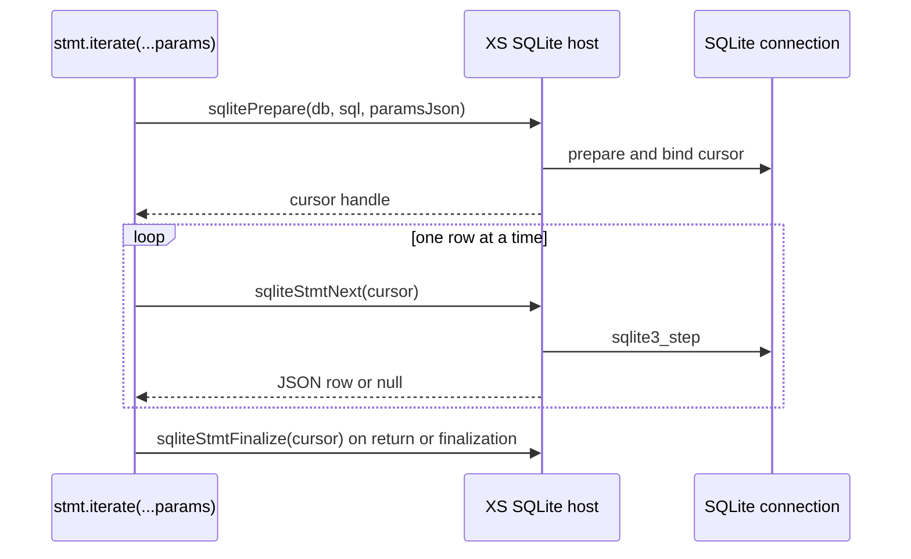

# Streaming SQLite Rows for endor

| | |
|---|---|
| **Created** | 2026-08-06 |
| **Author** | Kris Kowal (prompted) |
| **Status** | Proposed |
| **Builds on** | [daemon-endo-rust-sqlite](daemon-endo-rust-sqlite.md) |

## Motivation

The SQLite bindings expose `StatementSync.all()`, which serializes every
selected row into one JSON array before the XS shim decodes it. During daemon
startup, `makePetStore()` calls `listPetStoreEntries(storeNumber, storeType)`
and then inserts every result into its `idsToPetNames` map. A large pet store
therefore creates a second, temporary copy of all its `(name, formulaId)` rows
in Rust, JSON, and JavaScript before the map receives them.

The in-memory name map is intentional application state. This design removes
only the temporary result array and its one large FFI allocation. Each call to
the host returns one decoded row, and the existing startup loop places that row
straight into the map.

This is the follow-up deferred by the pet-store binding design in
https://github.com/endojs/endo-but-for-bots/pull/124#discussion_r3553992400.
The prerequisite bindings and their shim are now on `llm`; this design changes
neither their five-type value mapping nor their synchronous API.

## Public API

`StatementSync` gains the Node `node:sqlite` iterator-shaped method:

```ts
iterate(...params: SqliteParams): IterableIterator<
  Record<string, SqliteValue>
>;
```

It has the same positional and named parameter forms as `get()` and `all()`.
The iterator is synchronous, iterable, and yields hardened row records with
the same `$bigint` and `$bytes` decoding as `get()` and `all()`.

```js
for (const { name, formulaId } of stmt.iterate(storeNumber, storeType)) {
  idsToPetNames.add(formulaId, name);
}
```

`iterate()` starts a private, parameter-bound cursor when it is called. It does
not fetch a row until `next()` is called. Multiple calls to `iterate()` on one
prepared statement create independent cursors, so interleaving their `next()`
calls is well-defined. `get()`, `all()`, and `run()` retain their current
stateless re-prepare behavior and do not advance an iterator.

The method follows [Node's `StatementSync.iterate()`
contract](https://nodejs.org/api/sqlite.html#statementiterate-namedparameters-anonymousparameters):
it returns an iterable iterator of row objects and accepts the same parameter
forms as the other statement execution methods. Endor retains its existing
difference that SQLite INTEGER values always decode as `bigint`.

## Host protocol and cursor lifetime

A cursor's lifetime is bounded by its iterator, and the ordinary consumer never
manages it by hand. A `for...of` loop calls the iterator's `return()` on normal
completion and on any `break`, `return`, or thrown loop body, and `return()`
finalizes the native cursor immediately. For that common case an explicit
`iterator.return()`, which `for...of` invokes automatically, is the whole of the
cleanup contract.

The `stmt.finalize()` and `db.close()` cursor sweeps described below are
backstops, not the primary path. They finalize any cursor abandoned without a
`return()`, such as a manual `iterate()` whose iterator is dropped mid-stream, so
no native statement outlives its prepared statement or its connection. Cleanup is
never GC-based: a cursor closes on `return()`, on exhaustion, on
`stmt.finalize()`, or on `db.close()`, and on nothing else.

The new host call is:

| JS global | Rust callback | Arguments | Result |
|---|---|---:|---|
| `hostSqliteStmtNext` | `host_sqlite_stmt_next` | cursor statement handle | JSON row, `"null"` at end, or `"Error: ..."` |

The host-facing form is deliberately `hostSqliteStmtNext(stmt)`: parameter
binding happens once when the cursor is created, never once per row. To create
that cursor without adding a second public JS method,
`hostSqlitePrepare(dbHandle, sql, paramsJson)` gains an internal optional third
argument. The existing two-argument call continues to create an ordinary,
stateless statement. The shim uses the three-argument form only inside
`stmt.iterate(...params)` and receives a cursor statement handle.

This keeps the public `DatabaseSync.prepare(sql)` contract unchanged while
making every `next()` call exactly one `hostSqliteStmtNext(cursorHandle)` FFI
call. The cursor uses the same JSON parameter encoding already used by
`run()`, `get()`, and `all()`.



### Rust state

The current `STMT_MAP` stores SQL text rather than a
`rusqlite::Statement`, because a `Statement` borrows its `Connection`. That
remains the representation for `run()`, `get()`, `all()`, and `columns()`.

Streaming adds a third handle map:

```rust
static CURSOR_MAP: Mutex<Option<HashMap<u32, Cursor>>> = Mutex::new(None);

struct Cursor {
    db_handle: u32,
    raw_stmt: *mut rusqlite::ffi::sqlite3_stmt,
}
```

The cursor owns a native `sqlite3_stmt` allocated with
`sqlite3_prepare_v2` from the existing connection. It avoids the
self-referential `Connection` / `rusqlite::Statement` borrow and does not open
a second connection, so it observes the same database, transaction, and WAL
settings as the rest of the daemon. Because a raw SQLite pointer is not
automatically `Send`, its wrapper documents the `unsafe impl Send` invariants:
the cursor stays in `CURSOR_MAP`, is accessed only under that mutex on its XS
machine, and is finalized before its database connection is removed.

The optional-parameter `sqlitePrepare` path parses the existing `ParamSet`,
uses `sqlite3_bind_parameter_index` for named values and sequential indices for
positional values, and binds nulls, integers, reals, text, and blobs with
SQLite's transient-copy destructor. `sqliteStmtNext(cursor)` calls
`sqlite3_step` once. On `SQLITE_ROW`, it builds one JSON row using the existing
`$bigint` and `$bytes` envelope. On `SQLITE_DONE`, it finalizes and removes the
cursor before returning `"null"`. On an SQLite error, it finalizes and removes
the cursor before returning the existing `"Error: ..."` result.

`sqliteStmtFinalize(handle)` accepts both ordinary statement and cursor
handles. `sqliteClose(db)` finalizes and removes every matching cursor before
removing ordinary statements and then closing the connection. This ordering
prevents a native statement from outliving its connection. XS executes host
callbacks serially for a machine, so a cursor cannot be finalized or a database
closed while its own `sqlite3_step` call is in progress.

### Shim iterator

The shim retains the source database handle and SQL text in the closure created
by `prepare()`. `iterate(...params)` encodes its parameters, creates a private
cursor statement, and returns a hardened iterator with these methods:

- `next()` calls `hostSqliteStmtNext(cursor)`, applies `assertSqliteOk`, decodes
  a row, and returns `{ value: row, done: false }`. A `"null"` result marks it
  done and returns `{ value: undefined, done: true }`.
- `[Symbol.iterator]()` returns the iterator itself.
- `return()` finalizes an unfinished cursor and returns a done result. A
  `for...of` `break`, `return`, or thrown loop body invokes this method.

The statement closure tracks its live cursor handles. `stmt.finalize()` closes
them before finalizing the ordinary statement. `db.close()` has the matching
host-side cleanup. Code that manually abandons an iterator without exhausting
it, calling `return()`, finalizing its statement, or closing its database keeps
the cursor open. This is explicit resource ownership, not a GC-based cleanup
contract.

## Pet-store migration

`manager-database.js` changes `listPetStoreEntries` from an array-returning
method to an iterable-returning method:

```js
const listPetStoreEntries = (storeNumber, storeType) =>
  stmtListPetEntries.iterate(storeNumber, storeType);
```

Its declared return type becomes `Iterable<{name: string, formulaId: string}>`.
`pet-store.js` consumes that iterable directly in its existing validation and
`idsToPetNames.add()` loop. The Node backend already provides `iterate()`;
the XS shim gains parity. No schema, SQL text, ordering promise, or pet-store
validation changes.

## Files and tests

| File | Change |
|---|---|
| `rust/endo/xsnap/src/powers/sqlite.rs` | Add `CURSOR_MAP`, cursor creation and finalization, `host_sqlite_stmt_next`, registration, and callback-table entry. |
| `rust/endo/xsnap/src/host_aliases.js` | Add `hostSqliteStmtNext: 'sqliteStmtNext'`. |
| `packages/daemon/src/bus-xs-host-globals.d.ts` | Declare `hostSqliteStmtNext`. |
| `packages/daemon/src/bus-manager-rust-xs-powers.js` | Implement `StatementSync.iterate()` and cursor cleanup. |
| `packages/daemon/src/types.d.ts` | Add the `iterate()` declaration. |
| `packages/daemon/src/manager-database.js` | Return the pet-store entry iterable. |
| `packages/daemon/src/pet-store.js` | Consume entries directly rather than retaining an intermediate array. |
| SQLite host and daemon tests | Cover the cursor protocol and the pet-store consumer. |

The implementation must demonstrate all of the following:

1. Positional and named parameters produce the same rows and type decoding as
   `all()` for text, `bigint`, `number`, `null`, and `Uint8Array` values.
2. A multi-row cursor returns one row for each `next()`, returns done after the
   last row, and an empty query is immediately done.
3. Two iterators over the same prepared statement can advance independently.
4. Early `return()`, `stmt.finalize()`, and `db.close()` finalize live native
   cursors. A subsequent database close must not report an outstanding SQLite
   statement.
5. A pet store with a large seeded entry set initializes correctly while a test
   double rejects `all()` on the list statement. The test need not claim that
   the final `idsToPetNames` map is small; it proves only that no all-rows
   result array crosses the database boundary.
6. The XS integration test runs the same cursor fixture through the real
   endor binary, not only through a JavaScript host mock.

## Non-goals

- This is a synchronous pull iterator, not an async iterable, subscription, or
  paginated daemon API.
- It does not add a general `each()` callback API, row arrays, user-defined
  functions, or a new transaction mechanism.
- It does not make arbitrary daemon startup state lazy. The pet-store map still
  contains all persisted names after startup.
- It does not revise the SQLite type mapping, named-parameter policy, or
  `all()` behavior.

## Implementation phases

1. Add the native cursor map, optional cursor-prepare path, `sqliteStmtNext`,
   aliases, and Rust coverage for stepping, binding, completion, and cleanup.
2. Add the shim iterator and type declarations. Exercise the FFI tags and
   iterator protocol with the real XS fixture.
3. Convert `listPetStoreEntries` and `makePetStore`, then add the large-store
   test that rejects an eager `all()` call.

## Prompt

> Design the lazy row-streaming path deferred in the sqlite-bindings design:
> add a `hostSqliteStmtNext(stmt)` host function returning one row at a time and
> expose it from the shim as `stmt.iterate()`, so `listPetStoreEntries` need not
> read every `(storeNumber, storeType)` row into memory in a single allocation
> at startup.
