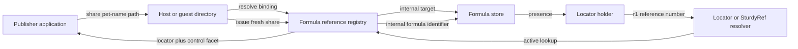
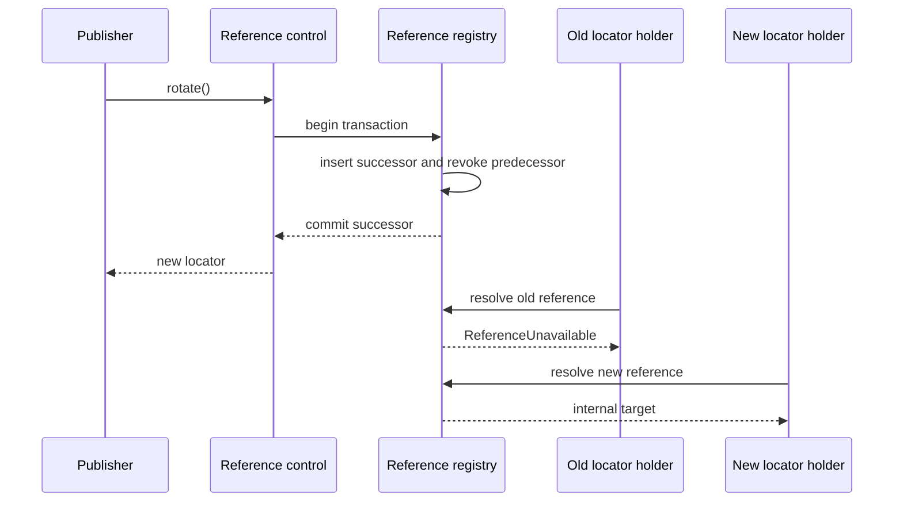
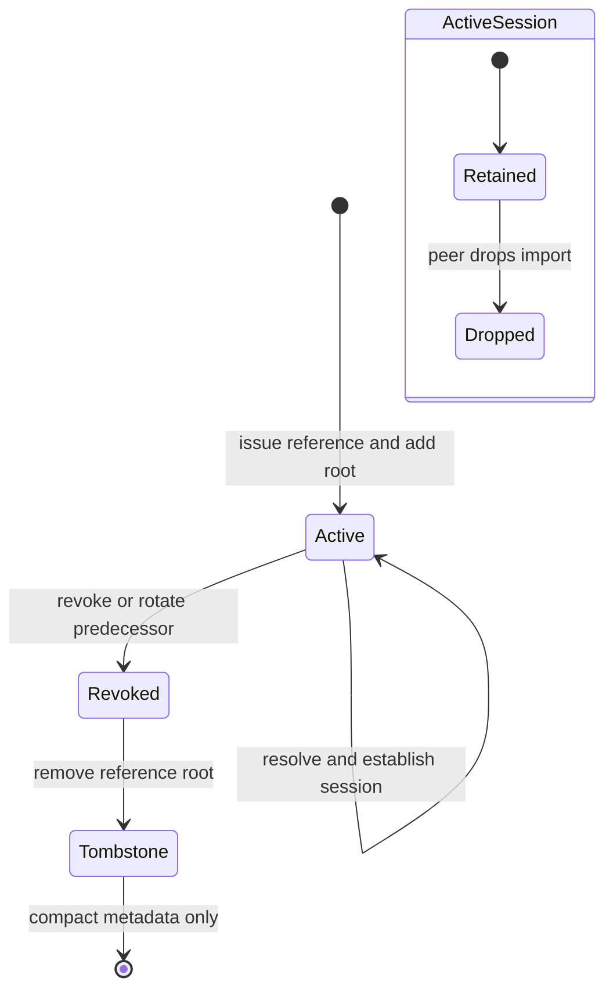

# Daemon Formula Identifier Indirection

| | |
|---|---|
| **Created** | 2026-10-08 |
| **Updated** | 2026-10-08 |
| **Author** | Kris Kowal (prompted) |
| **Status** | Proposed |

## Direction, analogy, and speculation

This section separates the maintainer's direction from an analogy that was
checked against its source and from ideas that are deliberately not part of
this design.

### Direction: design to this

The design follows these requirements as constraints:

- Formula identifiers are internal daemon addresses, not exported bearer
  capabilities.
- Locators, SturdyRef records, and pet-store entries name a durable
  indirection rather than containing a formula identifier.
- Rotating a shared link revokes one indirection and issues another for the
  same formula. It does not copy, reformulate, or otherwise change the target.

The evidence is both the maintainer's 2026-10-08 direction and the present
implementation. [`locator.js`](../packages/daemon/src/locator.js) serializes a
formula number into every locator and returns a formula identifier when it
parses one. [`pet-store.js`](../packages/daemon/src/pet-store.js) and the
`pet_store_entry.formula_id` column persist those identifiers directly. The
current SturdyRef work likewise uses a formula number as the OCapN swiss number
in its cross-peer sketches. These are the exact capture sites this design
replaces.

### Analogy: verified, with limits

The ocap-kernel analogy is directionally useful, but not a design to copy.
At source revision
[`58b3bd61`](https://github.com/Consensys-Incorporated/ocap-kernel/tree/58b3bd61bd6b9febf13f4ec6335444e528401656),
the kernel uses terse internal krefs such as `ko42`; its c-lists map those
kernel references to boundary-local slots
([glossary](https://github.com/Consensys-Incorporated/ocap-kernel/blob/58b3bd61bd6b9febf13f4ec6335444e528401656/docs/glossary.md)). For an OCap URL,
[`remote-comms.ts`](https://github.com/Consensys-Incorporated/ocap-kernel/blob/58b3bd61bd6b9febf13f4ec6335444e528401656/packages/ocap-kernel/src/remotes/kernel/remote-comms.ts)
pads a kref, encrypts it with a persistent AES-GCM key, and base58-encodes the
result. The cipher supplies per-encryption random material, so separately
issued URLs for one kref are not equal on the wire. Issuance also pins the
target because a URL holder is otherwise invisible to kernel reference counts.

The analogy holds in two places: keep the terse runtime address behind the
boundary, and make every outward bearer opaque and independently randomized.
It does not hold for rotation. The ocap-kernel token decrypts directly to the
kref; it has no per-URL registry row to revoke. Kernel revocation therefore
revokes the object, not one issued URL. Its encryption also introduces a
long-lived decryption key whose loss or rotation affects every URL.

The cheap idea to borrow is the boundary: internal address in, opaque bearer
out, plus an explicit retention root for an outstanding durable bearer. The
encrypted-kref construction is not borrowed. Endo needs state anyway to revoke
one share without revoking its siblings, so an opaque random lookup key is
simpler and gives the required revocation point.

### Speculation: recorded, not designed

This design does not generalize the registry to vat identifiers, vat slots, or
a "slot machine". A versioned, typed reference namespace and a resolver that
does not parse target meaning out of the bearer leave that possibility open.
No field, API, migration, or retention rule below is chosen for it.

## Prompt

Add a level of indirection so formula identifiers are strictly internal, while
locators, SturdyRef records, and pet-store entries refer through independently
revocable references. Rotation must return a new locator, make the old locator
fail closed, and leave the formula unchanged. Settle the durable record,
cryptographic shape, lifecycle, migration, retention, cross-peer behavior,
threat model, daemon/minion.town ownership split, options, and staged rollout.

## Summary and recommendation

Add a daemon-owned **formula reference registry**. Each externally usable
reference has a fresh 256-bit random `referenceNumber`; the durable row maps
that opaque number to an internal `FormulaIdentifier`. A formula may have any
number of reference rows. Revocation changes one row's state, and rotation
atomically revokes that row and inserts a new active row with the same target.

Use a versioned locator path so a reference number cannot be confused with the
same-width formula number:

```text
endo://{peerKey}/r1/{referenceNumber}@{hint1}@{hint2}?type={formulaType}
```

The `type` remains an unauthoritative routing/display hint. The registry target
and the formulated value determine the actual type. OCapN SturdyRefs use the
tagged swiss number `endo-ref-v1:{referenceNumber}`. Neither representation
contains or can be decoded into a formula identifier.

The `r1` invitation form also removes the legacy `from` formula-number query
parameter. The invitation formula already carries its internal relationship to
the inviter, so the resolver obtains that relationship after reference lookup.
`fromNode` and `handleNode` may remain where the network-identity work needs
them because node public keys are routing identities, not formula identifiers;
they must not be paired with a formula number. No `r1` query parameter may
carry a formula address.

The recommended first implementation stores the random reference number in the
daemon's trusted SQLite database without encryption and adds no separate salt.
The reference number is already a uniformly random, per-share nonce: it resists
guessing, prevents equality correlation between shares, and contains no target
plaintext. Encryption would add key custody without removing the state needed
for revocation. A separate salt adds no dictionary-attack protection because
the input is already 256 bits of random entropy. At-rest encryption can be
added as a database-security measure, but it is orthogonal to locator safety
and is not part of this protocol.

The mechanism belongs in `@endo/daemon`. minion.town owns the clip-specific
decision to issue, display, rotate, and remember a share. It must not carry a
second registry or a different locator codec.

## Record and authority model

### Durable record

The manager database gains a `formula_reference` table with this logical
schema (exact SQLite affinities remain an implementation choice):

| Field | Meaning |
|---|---|
| `reference_number` | 32 cryptographically random bytes, encoded canonically for the locator; primary key and bearer secret |
| `target_formula_id` | Internal `{number}:{node}` identifier; never serialized into a locator, SturdyRef, or pet-store row |
| `kind` | `binding` for a pet-store name or `share` for an exported locator/SturdyRef |
| `state` | `active` or `revoked` |
| `generation` | Monotonic generation within one rotation lineage, starting at zero |
| `predecessor` | Nullable reference number used by the administrative path for idempotent rotation and audit |
| `created_at`, `revoked_at` | Operational metadata; `revoked_at` is null while active |

`predecessor` is not returned by public resolution. A unique constraint permits
at most one successor for an old reference, so retrying rotation after an
ambiguous response returns the already-created successor rather than minting a
chain of accidental replacements.

Rows do not contain an owner identity or an ACL. Authority to issue, rotate,
or revoke comes from possession of a `FormulaReferenceControl` facet produced
at issuance. The formula-backed facet closes over the row identity, and no
manager method accepts a locator or reference number as administrative
authority. Its surface is:

```js
FormulaReferenceControl: {
  getLocator(): Promise<string>;
  rotate(): Promise<string>;
  revoke(): Promise<void>;
}
```

The control advances to the successor after `rotate()`. The returned string is
the new locator. Calling `rotate()` again returns the same successor if the
first response was lost; calling it after an explicit `revoke()` rejects. A
share-producing application persists this control facet alongside its own
record. The public locator alone grants resolution, not administration.

`locate(...petNamePath)` remains a convenience for callers that only need a
bearer string: it resolves the pet-store binding, issues a fresh `share`
reference, and discards the control facet. A new `share(...petNamePath)` method
returns the control facet for callers that need rotation. Each call issues a
new share, so two recipients can be revoked independently. `reverseLocate`
resolves an active reference to its internal formula identifier before doing
the existing reverse pet-name lookup.

Pet-store entries use `binding` references. A rename moves the binding
reference; an alias gets its own binding reference; removing a name revokes and
drops that binding. Exporting a pet name never exposes the binding reference:
it always mints a `share` reference. This separation ensures rotating a leaked
link neither renames the object nor invalidates another link.

The method boundary changes with the storage boundary. Public host and guest
facets no longer return formula-identifier strings from `identify`; callers use
`share` for a durable outward capability or an inspector session for local
diagnostics. During the compatibility release, `identify` is deprecated and
restricted to daemon-internal callers before removal from the public
interface. Internally, `resolvePetName` and `resolveReference` may still return
a formula identifier to formula machinery. `internalizeLocator` becomes a
syntax-only parse that returns a peer and reference number; registry resolution
is a separate authority-bearing step. Conversely, `externalizeId` is replaced
by issue-then-format and can no longer turn an arbitrary formula identifier
directly into a locator.

### Issue and resolve



The daemon manager mints reference numbers with its cryptographically secure
random source. Resolution performs one indexed lookup and checks `kind =
'share'` and `state = 'active'` before the formula identifier enters the
existing local/remote formulation path. Unknown, malformed, revoked, and wrong-
kind references all fail with the same non-oracular `ReferenceUnavailable`
result.

SturdyRef remains the generic pass-style object described by the ongoing
SturdyRef work: the record contains location plus an opaque secret. For Endo
daemon locations, that secret is the tagged reference number, never a formula
number. The daemon-specific handler performs registry resolution. This revises
the formula-id-as-swissnum choice in the cross-peer SturdyRef sketches without
making `@endo/pass-style` understand formulas.

### Reconciliation with current SturdyRef work

The [daemon SturdyRef design](sturdy-refs-endor-syscall.md) remains authoritative
for pass style, confinement, and on-demand enlivenment. This design supplies
the daemon-specific meaning of its opaque secret and removes the need for an
exported formula identifier.

The draft [on-demand enlivenment PR
#539](https://github.com/endojs/endo-but-for-bots/pull/539) and [agent-surface PR
#695](https://github.com/endojs/endo-but-for-bots/pull/695) can keep their opaque
handler and user-facing shapes. The draft [cross-peer bridge PR
#697](https://github.com/endojs/endo-but-for-bots/pull/697) must replace its
formula-id swiss number and its "no per-export revocation" conclusion with an
`endo-ref-v1` share. The draft [pass-style shim contract PR
#1389](https://github.com/endojs/endo-but-for-bots/pull/1389) already gives the
handler responsibility for enlivenment, memoization, and revocation, which is
the correct seam for registry resolution. None of these generic layers gains a
formula-reference table or formula parser.

The draft [formula-nonce locator PR
#1124](https://github.com/endojs/endo-but-for-bots/pull/1124) is not the new
public format: adding a nonce beside a formula number still exports the formula
number and does not provide a durable, per-share revocation record. Its parsing
work may inform the versioned codec, but its identifier-bearing wire shape is a
legacy compatibility input only.

### Inspector and retention-path reconciliation

"Strictly internal" also closes the diagnostic escape hatches in
[`formula-inspector.md`](formula-inspector.md) and
[`retention-path-notation.md`](retention-path-notation.md). A host-only method is
privileged, but a formula identifier displayed in Chat or printed by the CLI
is no longer internal.

The formula inspector therefore opens a host-local `FormulaInspectorSession`.
It accepts a pet-name path, binding reference, or locator and returns opaque
session-scoped `InspectionReference` values for dependency navigation. The
daemon maps those handles to formula identifiers in memory. They expire with
the session, are not SturdyRefs, are not registry rows, and add no retention
roots. The public host method and CLI stop accepting raw identifiers; the
CLI's `--identifier` form is supported only during the legacy compatibility
release. Formula numbers are removed from the rendered header and JSON output.

Retention-path results make the corresponding change: `groupMembers` becomes
a list of `InspectionReference` values (or only `memberCount` for a non-
interactive caller), and each segment's default click target is an inspection
reference, not an automatically minted locator. An explicit `exportLocator`
action mints a durable `share` reference when the user actually wants one.
Thus observing why a formula is retained neither leaks its address nor creates
new roots that change the answer being observed.

## Rotation and revocation semantics

Rotation is a single SQLite transaction:

1. Load the controlled row and reject if it is explicitly revoked without a
   successor.
2. If it already has a successor, return that successor's locator.
3. Insert a new active `share` row with a new random reference number, the same
   target, `generation + 1`, and the old row as predecessor.
4. Mark the old row revoked and commit.
5. Invalidate any local resolver cache entry for the old reference and format
   the new locator.

The transaction always contains either the old active root or the new active
root, so rotation cannot create a collection gap. If the process stops before
commit, the old locator remains active. If it stops after commit but before the
response arrives, retry returns the committed successor.



Revocation without reissue marks the row revoked, clears its retention root,
invalidates resolver caches, and returns only after those changes commit. The
row remains as a compact tombstone so repeated operations are idempotent and a
reference number is never reactivated.

These operations govern future resolutions, not presences already obtained:

- A locator string cached by a client fails on its next resolution after
  revocation.
- A SturdyRef cached but not enlivened fails when enlivened.
- A presence already enlivened over CapTP remains usable for the life of that
  session and whatever authority it has already delegated. Revoking the entry
  does not send `dropImports`, terminate a connection, or interpose a revocable
  forwarder.
- Resolver caches may memoize an active result only within the resolution that
  establishes a session. They must not bypass the registry on a later
  enlivenment. Cache invalidation is keyed by reference number and generation.

Retroactive revocation of live presences would require a forwarding proxy or
session termination policy. That is a separate capability with different
availability and failure semantics, and is out of scope.

## Persistence migration and compatibility

The current manager schema is version 3. This change is a versioned `v3 -> v4`
upgrade that runs before pet-store construction, formula-graph seeding, host
formulation, or network listeners. It must not be another opportunistic repair
inside startup.

Within one SQLite transaction, the upgrader:

1. Creates `formula_reference` and its state, target, and predecessor indexes.
2. Rebuilds `pet_store_entry` with `reference_number` in place of `formula_id`.
3. Creates one active `binding` reference for every existing pet-store row,
   copies its old formula identifier into the reference target, and writes the
   new reference number into the rebuilt row.
4. Rewrites stored locator-bearing rows, including
   `synced_store_entry.locator`, by parsing a legacy local locator, issuing a
   new `share` reference, and storing an `r1` locator. A foreign legacy locator
   is preserved for the compatibility resolver because this daemon cannot
   create a row in the remote peer's registry.
5. Applies explicit, type-specific visitors to any durable SturdyRef-bearing
   formula records present when the SturdyRef work lands. The present tree has
   no general durable SturdyRef table, so the initial visitor is an assertion
   that no such record exists rather than a text search through arbitrary
   formula bodies.
6. Sets `schema_version = 4` only after every row and index is complete, then
   commits.

Formula bodies may continue to contain formula identifiers for internal graph
edges. The migration must not replace those. The invariant is about boundary
and naming records, not the daemon's own formula graph.

The migration is idempotent by schema version and transactional rollback.
Startup refuses a database with a newer version or an incomplete v4 shape.
Tests must start from a checked-in v3 fixture, inject a failure at each upgrade
step, reopen it, and then restart the successfully upgraded database a second
time. This is the explicit guard against the earlier crash loop where a bumped
pin assumed a `registry` field that the saved host formula did not yet have.
Unlike that repair, v4 completes before any reader can observe the new schema.

### Legacy locators and SturdyRefs

The parser distinguishes formats structurally: `/r1/<reference>` is new, while
the old single path component is a legacy formula number. For one compatibility
release, readers accept both and writers emit only `r1`. A metric counts legacy
resolution by local versus foreign peer. Disabling legacy resolution is an
operator-visible release gate, after which every legacy locator fails closed.

There is no honest per-link rotation for a legacy locator: every copy contains
the same formula identifier. Wrapping a copy in a new reference protects only
the new copy; it cannot revoke the old string. Likewise, a legacy SturdyRef
whose swiss number is a formula number remains as powerful as that formula
number while the legacy resolver is enabled. Migration can rewrite stored
copies, but it cannot find copies outside daemon state. Operators must issue
new references, distribute them, and then disable legacy resolution to close
that authority class.

## GC and cross-peer retention

Every active reference is a formula-graph root:

- A `binding` reference replaces the root previously implied by a pet-store
  row.
- A `share` reference roots its target because a durable locator holder is not
  otherwise visible to the daemon, matching the retention lesson from the
  ocap-kernel URL implementation.
- A revoked reference and its tombstone do not root the target.

The registry projects roots into the existing formula graph with an explicit
`reference:<kind>:<reference-number-prefix>` edge label. Retention-path APIs
use session-scoped inspection references for navigation. Merely inspecting a
path does not issue or root a share; an explicit export action creates the
locator and its corresponding root.

Cross-peer retention remains additive. Resolving a share may establish a live
CapTP import; the remote peer then reports the existing retention edge under
[`daemon-cross-peer-gc.md`](daemon-cross-peer-gc.md). Revoking the share removes
the registry root and prevents new imports. An existing remote import continues
to retain the target until that session drops it and the retention-set delta is
committed. Collection occurs only after both the share root and every ordinary
local or cross-peer edge are gone.



The nested session state is independent: a reference can be revoked while a
session still retains the formula. Tombstone compaction may discard audit
metadata after policy permits, but it must never permit token reuse.

## Ownership map

| Component | Owns | Does not own |
|---|---|---|
| Formula store and formula graph (`@endo/daemon`) | Internal identifiers, formula bodies, target execution, reference-root projection | Public bearer encoding or clip policy |
| Formula reference registry (`@endo/daemon`) | Durable rows, random issuance, atomic rotate/revoke, migration, cache invalidation | Formula evaluation or application UI |
| Locator codec and daemon OCapN resolver | `r1` syntax, tagged SturdyRef swiss numbers, fail-closed resolution | Durable authority state or application retention policy |
| Pet store | Human name to `binding` reference | Formula identifiers, share issuance policy, or public locator reuse |
| Formula inspector session | Ephemeral opaque navigation handles for host diagnostics | Durable sharing, retention roots, or raw identifiers in client results |
| `@endo/pass-style` SturdyRef | Opaque location-and-secret carrier and handler dispatch | Formula semantics or daemon registry access |
| minion.town clip publisher | When to issue/rotate/revoke, durable custody of the control facet, display of the current locator | Token generation, resolver semantics, migration, or GC bookkeeping |

The registry commits or rolls back an issue/rotation/revocation operation. The
formula store commits ordinary formulation and graph changes. Rotation does not
cross that boundary because it never mutates the formula. Restart recovery
opens and migrates the registry first, reconstructs reference roots second,
then starts formula and network services. Once a reference resolves, execution
and failure classification return to the existing formula and CapTP owners.

This is a daemon feature rather than a minion.town fork because locator,
SturdyRef, pet-store, migration, and collection invariants are reusable and
must agree at one authority boundary. minion.town stays a thin configuration
and product-policy layer: for a leaked clip it calls the shared control's
`rotate()`, saves the returned locator, and republishes it.

## Threat model and cost

For newly issued `r1` references, this design protects against:

- disclosure of a formula identifier through a locator, SturdyRef, or pet-store
  record;
- correlation of two independently issued shares by their bearer text;
- continued cold resolution of one leaked share after that share is revoked;
  and
- accidentally revoking sibling shares or changing the target during rotation.

It does not protect against:

- a formula identifier already leaked under the legacy scheme while legacy
  resolution remains enabled;
- a holder that already enlivened and retained a presence;
- delegation performed by that live holder;
- compromise of the daemon database or process, which exposes active bearer
  numbers, their mappings, and target identifiers;
- traffic analysis from the peer key, connection hints, type hint, or timing;
  or
- distinguishing multiple copies of the same locator: they are one reference
  and revoke together.

The data-path cost is one indexed SQLite lookup and state check on a cold
resolution, plus one formula-graph root per active reference. Messages on an
established CapTP session pay no extra lookup. Rotation costs one insert and one
update in a transaction. The potentially unbounded resource is outstanding
shares, so the issuer surface must support listing and revoking its controls,
and deployments may impose issuance quotas without changing the wire format.

## Options considered

### 1. Do nothing

Keep formula identifiers as locator paths and swiss numbers. This has no
migration or lookup cost, but an identifier leak is permanent and all shares
are the same capability. It fails the required rotation behavior.

### 2. Mint a fresh formula and copy

On leak, formulate a replacement and copy state. This changes identity, breaks
live references and graph edges, may not be meaningful for stateful formulas,
and still does not revoke the old formula identifier. It is an application
clone operation, not capability rotation.

### 3. Encrypt and salt the formula identifier

Project the identifier as an ocap-kernel-style randomized ciphertext. This
hides and de-correlates the identifier without a lookup table, but individual
revocation then needs a denylist, which recreates a registry while retaining
encryption-key custody and key-rotation blast radius. It is useful when
stateless redemption is the goal; stateless redemption conflicts with this
design's per-share revocation goal.

### 4. Stateful opaque reference registry — recommended

Map a random per-share reference number to the internal identifier. This is one
extra lookup, but it directly models independent authority, atomic rotation,
retention, and audit. It also gives migration an explicit object to target and
keeps formula identifiers out of every external representation.

## Staged rollout

1. **Registry and grammar.** Add the v4 schema, reference manager, `r1` locator
   and SturdyRef codecs, reference-root projection, and unit tests. Keep current
   writers unchanged while the migration and dual reader soak.
2. **Internal names.** Migrate pet stores to `binding` references and make all
   daemon internals resolve through the registry. Move formula-inspector and
   retention-path navigation to session-scoped inspection references. Keep
   formula identifiers only in formula bodies, graph state, and daemon-private
   implementation calls.
3. **New shares.** Change locator and SturdyRef writers to mint `share`
   references. Add `share()` and `FormulaReferenceControl`, including atomic
   retryable rotate/revoke and cache invalidation.
4. **Consumer adoption.** Have minion.town clips retain the control facet and
   implement "rotate link" as one call followed by publication of the returned
   locator. Exercise two shares for one clip and revoke only the leaked one.
5. **Legacy shutdown.** Measure legacy reads, publish the compatibility cutoff,
   require operators to reissue durable links, then disable the legacy formula-
   number resolver. Remove it only after one further release with zero observed
   use.

Each stage is independently restart-safe. Stages 2 and 3 do not begin until the
v3 fixture upgrade and rollback tests pass; stage 5 is the point at which the
"formula identifiers are strictly internal" property becomes unconditional for
network input.

## Acceptance criteria

- No newly written locator, SturdyRef record, or pet-store row contains a
  formula number or complete formula identifier.
- Formula-inspector and retention-path public results contain opaque inspection
  references rather than formula identifiers, and inspecting does not add a
  durable root.
- Two shares for one formula have distinct reference numbers and both resolve;
  revoking either leaves the other active.
- Rotation leaves the formula identifier and formula body unchanged, returns a
  new locator, makes the old locator fail closed, and is idempotent after a
  lost response.
- A cached locator cannot bypass revocation on a new enlivenment; a presence
  already live follows the documented session semantics.
- An active share retains its target across restart. Revoking the last share
  permits collection only after all ordinary and cross-peer retention edges are
  also gone.
- A v3 database containing pet-store rows and stored locators upgrades in one
  transaction, survives injected interruption, and opens successfully twice.
- New writers never emit legacy locators. The compatibility reader can be
  disabled, after which all legacy locators fail closed.
- The three diagrams in this document parse with Mermaid's grammar.

## Follow-ups

- Implement the daemon registry, v4 migration, codecs, control facet, retention
  projection, and compatibility gate as one coordinated build.
- Adopt the control facet in the minion.town clip publisher after the daemon
  build lands; that integration owns the product wording and link-republication
  workflow.
- Treat at-rest token hashing or encryption, live-session revocable proxies,
  vat identifiers, vat slots, and any "slot machine" generalization as separate
  proposals with their own threat models.
