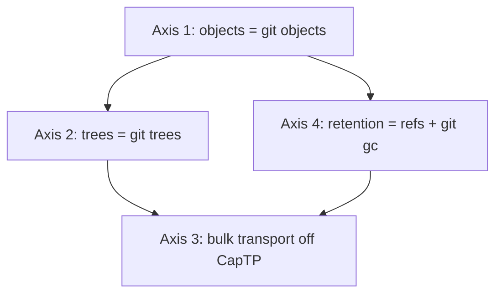

# Daemon Git Backbone

| | |
|---|---|
| **Created** | 2026-05-27 |
| **Updated** | 2026-05-29 |
| **Author** | 0xPatrick (prompted) |
| **Status** | In Progress |

## Status

Axes 1 and 4 are built on PR
[#369](https://github.com/endojs/endo-but-for-bots/pull/369) (`endo`
crate).
The git library is **`git2` (libgit2 bindings)**, not the `gix`
recommendation in Open Question 1 / § The Rust lever below — the
maintainer ratified the mature, broadly-covered library; libgit2 is
vendored (bundled C, no system dependency), so the no-C rationale for
`gix` was moot because the `endo` crate already links bundled C
(rusqlite's SQLite, xsnap's XS).
The substrate is a **bare git repository at `{dir}/cas.git`**: objects
at `{dir}/cas.git/objects/`, retention refs at
`{dir}/cas.git/refs/cas/<sha256>`, with the `sha256 → git-oid`
resolution index kept flat at `{dir}` (Open Question 2's sha256 content
key behind a SHA-1 git object DB).
GC is an in-process manual reachability sweep (libgit2 ships no
`git gc` porcelain) seeded from the `refs/cas/*` refs.

**Axis 4 is not yet complete.** Its highest-value piece — the
`refs/formulas/<id>` ↔ sqlite formula-graph mirror that makes GC
reachability-driven *from formula liveness* — is not built. The shipped
`refs/cas/<sha256>` refs are keyed by content hash, not formula id, and
nothing connects the formula graph to retain/release calls; the `cas-gc`
call sites still pass an empty caller-root set (now harmless only
because the durable `refs/cas/*` refs seed the live set). The mirror is
blocked on an architecture seam: the formula graph lives in the **JS**
daemon (`packages/daemon/src/daemon-database.js`, the SQLite `formula`
table), mutated by JS (`daemon.js` → `persistencePowers.writeFormula` /
`deleteFormula`); the Rust supervisor sees only opaque SQL strings
crossing the XS FFI and cannot observe formula liveness. The mirror wire
must live in JS, and no JS code calls the `cas-*` verbs today. See the
journal seam report (2026-05-29) for the recommended landing site.

## Summary

Back the daemon's **existing Rust content-addressed store** with git.

`endor` — the Rust daemon ([daemon-endor-architecture](daemon-endor-architecture.md),
**Active**) — already owns a SHA-256 content store in
`rust/endo/src/cas.rs` ([daemon-cas-management](daemon-cas-management.md),
**In Progress**, Phases 1–4 shipped).
That store hand-rolls four things git already does well: a flat
`{dir}/{hex-sha256}` blob directory, JSON tree manifests with
structural sharing, a `.meta` refcount, and a mark/sweep garbage
collector.
This design replaces the hand-rolled substrate underneath the existing
`ContentStore` API with a git object database, git trees, git refs +
`git gc`, and git's pack format / smart-protocol — **all four axes on
git** — while keeping the daemon's content identity, its CapTP control
plane, and the `cas-*` verb surface unchanged.

The load-bearing motivation is **GC** — axis 4, plus the axis-1
substrate it needs: a `refs/formulas/<id>` ↔ sqlite-formula-graph mirror
so git itself can do the garbage collection.
The retention roots are the formula graph; the most straightforward way
to maintain the relationship is for git to hold a ref per live formula
identifier, kept in sync with the formula rows, and to let git's own GC
collect everything no ref keeps reachable.
The other axes are extensions, not the crux: getting bulk data *out of
the CapTP data plane* (axis 3 — whole-tree reads, archive ingestion,
cross-peer content sync, the wrong shape for one-object-per-CapTP-turn)
and native git trees (axis 2) are valuable payoffs that the same git
substrate makes mechanical, but the reason to adopt git at all is the
crash-safe, reachability-driven live set the hand-rolled CAS does not
have.

The four axes map almost 1:1 onto the existing CAS's four phases:

| Axis | This design | Existing `cas.rs` it backs |
|---|---|---|
| 1 — objects | `store`/`fetch`/`has` over a git object DB, sha256-keyed | Phase 1 flat-dir `ContentStore`, `.meta` sidecars, atomic write-rename |
| 2 — trees | `TreeManifest` → native git tree objects | Phase 3 `TreeManifest`/`TreeEntry`, `read_tree`/`fetch_from_tree`, structural sharing |
| 4 — GC | retention → `refs/formulas/<id>` + `git gc` | Phases 2+4 in-memory refcount + mark/sweep (`cas-gc` / `endor gc`) |
| 3 — transport | bulk reads ride pack/smart-protocol; CapTP stays control plane | `cas_archive.rs` (ZIP → CAS blobs+trees); PR #367 `archiveTar` precedent |

Migrations are **out of scope** (see Non-Goals).

## What is the Problem Being Solved?

The existing Rust CAS reimplements git's core machinery from scratch:

- **Objects.**
  `ContentStore::store` writes `{dir}/{hex-sha256}` with a
  write-tmp-then-rename atomic step (`cas.rs:88`); git's loose-object
  writer already does content-addressing, zlib compression, and
  atomic placement.
- **Trees.**
  `TreeManifest` is a JSON `{ entries: { name → {type, hash, size} } }`
  document, itself stored as a CAS blob (`cas.rs:48`,
  `store_tree`).
  `fetch_from_tree` walks it path-component by path-component
  (`cas.rs:162`).
  A git tree object *is* this — mode + type + oid + name per entry —
  with `git read-tree` / `git cat-file -p` doing the walk.
- **Refcounts.**
  `retain`/`release` keep an in-memory `HashMap<String, u32>` flushed
  best-effort to `.meta` (`cas.rs:116`).
  This is a refcounting GC root scheme; git refs are the same idea with
  crash-safe `update-ref` atomicity instead of best-effort flushes.
- **Mark/sweep.**
  `ContentStore::gc` unions the live-roots argument with the
  in-memory refcount cache, walks tree children transitively, then
  sweeps the directory (`cas.rs:202`).
  This is exactly `git gc --prune=now` over reachable refs.

These reimplementations predate `endor`'s git ambitions and were the
pragmatic floor for a no-dependency CAS (today `cas.rs` pulls only
`sha2` + `serde`).
The reframe: rather than grow the hand-rolled scheme — packing for
disk savings, a crash-safe refcount, a pack-shaped wire format — adopt
the one mature implementation that already does all of it.

### What surprised us in the substrate

Three properties of the live `cas.rs` are load-bearing for the design,
and one of them argues *against* a naive git adoption:

1. **GC is not yet wired to formula liveness.**
   `endo.rs:602` calls `cas.gc(&HashSet::new())` — an **empty**
   live-roots set.
   Today the only thing keeping a blob alive across a GC is a non-zero
   in-memory `refs` count (set by `cas-retain`), and that cache does
   **not survive a daemon restart** (it is rebuilt empty on
   `ContentStore::open`).
   So the current GC is effectively "collect everything not explicitly
   retained this session."
   Axis 4 is therefore not just a swap — it is the first time CAS GC
   becomes durably reachability-driven.
   That makes axis 4 the highest-value *and* highest-risk axis, and it
   means the maintainer's "all four on git" ruling is the cleanest way
   to give the CAS a crash-safe live set at all.

2. **Tree hashes are content-stable but encoding-fragile.**
   A `TreeManifest` hashes the **serde JSON serialization** of the
   manifest (`store_tree` → `store(tree_json, "tree")`).
   `HashMap` iteration order is unspecified, so two semantically equal
   trees can serialize to different bytes and thus different hashes.
   The shipped tests dodge this by storing the exact JSON they assert
   on.
   Git tree objects are canonical (entries sorted by name, fixed binary
   encoding), so moving to git trees *fixes* a latent
   non-determinism — a point in git's favor for axis 2.

3. **Structural sharing is blob-level, not subtree-deduplicated by
   identity.**
   `cas.rs`'s `structural_sharing` test shares a *blob* between two
   trees, but the two trees themselves get distinct hashes even when
   they would be identical git trees, because the JSON carries
   per-entry `size` and the map order differs.
   Git deduplicates whole subtrees by oid for free.
   No axis is a poor fit on this account; it strengthens axis 2.

None of these contradict the four-axes-on-git framing.
The one genuine *tension* is the dependency posture (see § The Rust
lever) — `cas.rs` is deliberately dependency-light, and any git library
is a meaningful addition.

## Goals

1. Name each axis concretely enough that a builder dispatch can take it
   through the gap-revealing-build skill against the live `cas.rs`
   without re-deriving the shape.
2. Keep the daemon's **content identity** sha256 (locked; see
   § Hash identity) and the **`cas-*` verb surface**
   ([daemon-cas-management](daemon-cas-management.md) § Envelope verbs)
   unchanged — only the bytes-on-disk substrate moves.
3. Keep CapTP / OCapN as the **control plane**; move only the **bulk
   data plane** to git transport (axis 3).
4. Surface the open questions the maintainer must rule on before any
   axis becomes a buildable feature PR — chiefly the git-library
   choice and the sha256-key-vs-object-format call.

## Non-Goals

- **Migrations.**
  Per the maintainer (2026-05-28): "we don't need to worry about
  migrations right now."
  No design here for importing existing on-disk `store-sha256/` blobs
  or `.meta` state into the git object DB.
  A fresh daemon starts on the git substrate; an upgrading daemon's
  pre-existing CAS is a deferred concern.
- **No implementation code.**
  Implementation arrives in later builder cycles on this branch.
- Changing the `cas-*` envelope verbs, the CBOR codec, or the JS
  manager's `controlPowers`
  ([daemon-cas-management](daemon-cas-management.md) Phase 5).
  Those are the stable API above the substrate.
- Replacing the OCapN session machinery
  ([ocapn-network-transport-separation](ocapn-network-transport-separation.md)).
  Axis 3 is a *data plane* move; the control plane stays on CapTP.

## The Rust lever — the git work lives inside `endor`

Because the daemon is the Rust binary, the git work belongs **in
`endor` via a Rust git library**, not shelled to a `git` subprocess and
not a libgit2-in-JS port.
`cas.rs` is supervisor-owned, in-process, and on the hot path for
module loading and snapshot I/O
([daemon-cas-management](daemon-cas-management.md) § Supervisor-owned);
a per-operation `git` fork/exec would regress that.
The library choice is a **key open call** (Open Question 1):

| Option | For | Against |
|---|---|---|
| **`gix` (gitoxide)** | Pure Rust, **no C toolchain** — preserves `cas.rs`'s no-C posture; modern, async-friendly, `cargo`-native; object DB + pack + ref + tree APIs are mature and used in production tooling | Younger API surface; smart-protocol *client* coverage is broad but the *server*/`upload-pack` side (axis 3) is less complete than libgit2's |
| **`git2` (libgit2 bindings)** | Mature, broad coverage incl. transport; battle-tested | Adds a **C build dependency** to a crate that today links only `sha2`+`serde`; cross-compilation and the XS C-build interaction (`build.rs` already drives `cc` for XS) add burden and audit surface |

**Recommendation: `gix`, staged.**
Reasoning:

- The dependency-posture tension above is the real constraint.
  `endor`'s `xsnap` crate already compiles C (XS via `cc`), but the
  `endo` crate where `cas.rs` lives is pure-Rust + `tokio`; adding
  libgit2's C dependency *there* widens the build/audit surface of the
  daemon core specifically.
  `gix` keeps the daemon core C-free.
- Axes 1, 2, 4 need only the object DB, tree, ref, and local-pack APIs
  — `gix`'s strongest, most production-proven surface (`gix-object`,
  `gix-ref`, `gix-odb`, `gix-pack`).
- Axis 3's *remote* server side (`upload-pack` over a sideband) is the
  one place libgit2 is more complete.
  Stage it: build axes 1/2/4 on `gix`; if the axis-3 server side proves
  thin in `gix`, axis 3 can either (a) run a constrained in-process
  pack-negotiation using `gix-protocol`, or (b) ship as the narrow
  exception where a vetted `git upload-pack` subprocess is acceptable
  *for the remote hop only* — not the hot local path.

Flag both the choice and the staging for the maintainer to ratify.

## Hash identity — sha256 is the content key, git's object format is separable

The daemon's content identity is **sha256**, and that is locked.
Grounded in existing behavior: `cas.rs` stores `{dir}/{hex-sha256}`,
the JS `packages/endo-fs/src/cas.js` keys by `algorithm:hash`, and
every formula JSON field that names content names a sha256.
A substrate swap must **not** change the identity Endo formulas, the
`cas-*` verbs, and cross-peer references already speak.

Git's *internal* object format is a **separate, lower call**:

- Git's default object hash is **SHA-1** (cryptographically weak,
  universal tooling).
- Git's **SHA-256 object format** (`--object-format=sha256`) exists
  but is still experimental; interop with SHA-1 repos requires
  translation, smart-protocol negotiation for it is young, and `gix`
  SHA-256-mode coverage trails its SHA-1 coverage.

**Recommendation: keep Endo's sha256 as the content key; let git's
object DB run in its default (SHA-1) object format internally, behind a
sha256→oid index.**
Reasoning:

- The Endo content key (sha256 of the bytes) is what the verbs and
  formulas reference; it must be stable regardless of git's internal
  oid.
  A small persistent map `sha256 → git-oid` (or sha256-named refs, see
  axis 4) bridges them.
  Writing a blob computes both the Endo sha256 and the git oid; lookups
  go sha256 → git-oid → object.
- This decouples the locked decision (sha256 identity) from the
  immature one (git SHA-256 mode), and lets the project adopt git's
  SHA-256 object format later, transparently, if and when it matures —
  the Endo-facing key never changes.
- Do **not** block the swap on git SHA-256 maturity.
  Adopting it now would couple a shipped substrate to an experimental
  git feature with thin library support.

Flag this for the maintainer (Open Question 2); the alternative
(git's SHA-256 object mode directly, no mapping) is viable later but
not today.

## Axis 1 — CAS objects become git objects

`ContentStore`'s `store`/`fetch`/`has` map onto a git object database:

| `cas.rs` | Git object DB (via `gix`) |
|---|---|
| `store(data, "blob")` → hex-sha256 | write loose/packed blob → git oid; record `sha256 → oid` |
| `fetch(hash)` | sha256 → oid → read object bytes |
| `has(hash)` | sha256 → oid lookup + object existence |
| `.meta` `type` field | git object type tag (`blob`/`tree`/`commit`) |
| `.meta` `refs` count | superseded by refs (axis 4) |

The flat `{dir}/{hex-sha256}` directory and `.meta` sidecars disappear;
the bare git repository at `{dir}/cas.git/objects/` holds every blob
and tree.
The `type` advisory in `.meta`
([daemon-cas-management](daemon-cas-management.md) § Content types)
folds into git's native type tag, except for the daemon-specific
distinction `snapshot` vs. `archive` vs. `blob` (all git blobs), which
moves into the formula metadata or a thin sidecar keyed by oid.

**Why this is the cheapest, lowest-risk axis:** the `ContentStore` API
is small and well-tested (`cas.rs` tests cover store/fetch/has,
dedup, missing-key error). A `gix`-backed implementation that passes
the same tests is a drop-in.

## Axis 2 — tree manifests become git tree objects

`TreeManifest` (`cas.rs:48`) — `{ entries: { name → {type, hash,
size} } }` serialized to JSON and stored as a blob — becomes a native
git tree object:

- `store_tree(tree_json)` → `gix` tree builder writing canonical git
  tree entries (mode, type, oid, name), returning the tree's git oid
  (mapped to its Endo sha256 key).
- `read_tree`/`list_tree`/`fetch_from_tree` (`cas.rs:145`–`189`)
  become git tree reads and path walks.
- `cas_archive.rs`'s ZIP-ingest (`ingest_archive`,
  `load_archive_from_cas`) builds the same compartment-tree shape, but
  emits git trees instead of JSON manifests — and `fetch_from_tree`
  during archive load (`cas_archive.rs:167`) becomes a git tree walk.

Two properties improve on the swap (see § What surprised us):

- **Canonical encoding** removes the `HashMap`-order non-determinism
  in today's JSON tree hashing.
- **Whole-subtree dedup** by git oid generalizes the blob-level sharing
  the `structural_sharing` test demonstrates.

Axis 2 is mechanical once axis 1 lands; it has no new external
contract.

## Axis 3 — bulk transport off the CapTP data plane (extension)

CapTP / OCapN stays the **control plane**: capability handshakes,
eventual sends, retention subscriptions, GC negotiation
([ocapn-network-transport-separation](ocapn-network-transport-separation.md)).
The **bulk data plane** moves to git's pack / smart-protocol.

| Today | Under the swap |
|---|---|
| `cas-fetch` returns blob bytes inside the CapTP response envelope | `cas-fetch` resolves a `(sha256, git-oid)`; bytes ride a pack/sideband — local peers read the shared object DB directly, remote peers pull via pack negotiation |
| `cas_archive.rs` ingests a ZIP into per-file CAS blobs; whole-archive transfer would be N envelopes | a compartment tree ships as one packfile (delta-compressed, structurally shared) |
| PR #367 `archiveTar` — a backend-private `git archive` tar data plane under `ReadableTree` | generalized: any object bounded by "number of files in a tree" rides the git wire, not CapTP turns |

PR #367 (`archiveTar`, open) is the standing precedent: it already
concedes that turning a 10k-file tree into 10k CapTP turns is the wrong
cost shape and routes it through a native archive stream.
Axis 3 promotes that concession to a general rule and unifies it with
the daemon's own substrate.

Local single-daemon bulk reads stop crossing the worker/supervisor
envelope boundary: a worker holding a CapTP handle to a tree reads the
git objects directly from the supervisor-owned object DB
([daemon-cas-management](daemon-cas-management.md) § Supervisor-owned).
Remote cross-peer bulk reads use pack negotiation over an OCapN-carried
sideband (see Open Question 4).

**`streamReply`** ([daemon-message-streaming](daemon-message-streaming.md))
is **unchanged** — small token-streamed text is exactly what CapTP is
for; axis 3 targets only bulk transfers.

This is a high-value extension once the substrate is git-shaped: axes
1/2/4 make the data plane git-shaped, and axis 3 is the payoff of
getting bulk bytes out of the capability envelopes. It is not the crux
(that is axis 4's reachability-driven GC); it is the largest payoff the
crux's substrate unlocks.

## Axis 4 — retention becomes `refs/formulas/<id>` + `git gc`

Replace the in-memory refcount + empty-rooted mark/sweep
(`cas.rs:202`, `endo.rs:602`) with git refs and `git gc`.

A live formula's content is exactly what is reachable from a ref under
`refs/formulas/`:

```
refs/formulas/local/<formulaNumber>        # held by local agent
refs/formulas/peer/<publicKey>/<id>        # held by a remote peer
refs/formulas/transient/<requestId>        # in-flight host op
```

- `cas-retain` → `git update-ref refs/formulas/.../<id> <oid>`
  (crash-safe via git's ref-lock discipline — fixing the "refcount
  cache lost on restart" gap noted above).
- `cas-release` → `git update-ref -d`.
- `cas-gc` / `endor gc` → `git gc --prune=now` over reachable refs;
  the transitive tree-walk in `ContentStore::gc` becomes git's
  reachability algorithm.

The supervisor's link to **formula liveness** is the key new wire.
Today `cas.gc` gets an empty root set; under the swap the supervisor
publishes the live formula set as refs.
The natural source is the **formula graph**, persisted in SQLite
([daemon-endo-rust-sqlite](daemon-endo-rust-sqlite.md), **Complete** —
the Rust XS sqlite host methods).
The reframe couples cleanly here: the daemon already keeps the formula
graph and the cross-peer retention table in sqlite; axis 4 mirrors that
durable graph into `refs/formulas/`, so that `git gc` and the sqlite
graph agree on the live set.
**How that mirror stays atomic with respect to formula-graph writes is
Open Question 3.**

Cross-peer retention ([daemon-cross-peer-gc](daemon-cross-peer-gc.md),
**Complete**) fits without changing its wire semantics: the shipped
design is a one-way streaming retention-set sync (`followRetentionSet`,
`retention-accumulator.js`, SQLite `retention` table).
Under the swap, that retention set is mirrored to
`refs/formulas/peer/<publicKey>/<id>`, and the reconciliation primitive
becomes **`git fetch --prune`** — which is the exact shape of the
"publisher re-sends its current set, subscriber prunes" semantics the
cross-peer-gc design already specifies (its "crash and reconnect" rule
maps to fetch/prune one-for-one).
Public-key keying (matching the shipped `retention(guest_public_key,
...)` schema) is preferred over node-number keying for the ref
namespace, for the same node-rotation-robustness reason the sqlite
schema chose it.

Axis 4 is the **highest-value, highest-risk** axis: highest-value
because it gives the CAS a durable, reachability-driven live set it
does not have today; highest-risk because it touches the live system's
GC correctness invariant.

## Composition



Axis 1 (objects) is the dependency for the rest: every other axis
assumes the object DB is git.
Axes 2 (trees) and 4 (refs/GC) are otherwise independent and can land
in either order on top of axis 1.
Axis 3 (transport) is the payoff — it compounds 2 and 4 and is the
design's motivating goal — but it benefits from the substrate (1/2/4)
being stable first.

Practical order, each as a probe-then-build cycle
([gap-revealing-build](../../skills/gap-revealing-build/SKILL.md)),
because the git-library integration and the GC-correctness swap carry
real unknowns:

1. Axis 1 — `gix`-backed object DB behind the existing `ContentStore`
   API; passes the current `cas.rs` test suite. Lowest risk, validates
   the library choice.
2. Axis 2 — git tree objects behind `TreeManifest` and
   `cas_archive.rs`. Mechanical once axis 1 lands.
3. Axis 4 — `refs/formulas/` + `git gc`, mirroring the sqlite formula
   graph. Highest risk; the GC-correctness piece.
4. Axis 3 — pack/smart-protocol data plane. Newest mechanism; the
   motivating payoff; benefits from 1/2/4 stable.

## Relationship to the existing `cas.rs` scheme during rollout

The swap can land axis by axis behind a feature flag with the existing
flat-dir `ContentStore` as the implementation behind the unchanged
`cas-*` verbs.
Because migrations are out of scope, the rollout assumption is a
*fresh* git-backed store on the flag; coexistence of a live flat-dir
store and a git store on the same daemon is **Open Question 5**.

## Dependencies

| Design | Relationship |
|---|---|
| [daemon-endor-architecture](daemon-endor-architecture.md) | The substrate. The git work lives inside the `endor` Rust supervisor that owns the CAS; `gix` is the proposed in-process library. |
| [daemon-cas-management](daemon-cas-management.md) | Primary swap target. Axes 1/2/4 replace the flat-dir `ContentStore`, JSON `TreeManifest`, in-memory refcount, and mark/sweep GC with git objects/trees/refs/`git gc`, behind the unchanged `cas-*` verbs. |
| [daemon-endo-rust-sqlite](daemon-endo-rust-sqlite.md) | Axis 4's live-set source. The formula graph persisted in sqlite is mirrored into `refs/formulas/`; the atomicity of that mirror is Open Question 3. |
| [daemon-cross-peer-gc](daemon-cross-peer-gc.md) | Axis 4. The shipped one-way retention-set sync maps onto `refs/formulas/peer/<publicKey>/<id>` + `git fetch --prune`; public-key keying carries over from the `retention` table. |
| [daemon-content-store-gc](daemon-content-store-gc.md) | Prior (JS-side) GC thinking, **Complete**; context only. The live GC being swapped is the Rust mark/sweep in `cas.rs`, not the JS collector. |
| [ocapn-network-transport-separation](ocapn-network-transport-separation.md) | Axis 3. The OCapN-Noise network carries CapTP frames (control plane) and git pack/protocol frames (data plane). |
| [daemon-message-streaming](daemon-message-streaming.md) | Unchanged. `streamReply` stays CapTP; axis 3 targets bulk, not token-streamed text. |
| PR [#367](https://github.com/endojs/endo-but-for-bots/pull/367) (`archiveTar`) | Axis 3 transport-out-of-CapTP precedent: a native archive data plane under `ReadableTree`. Still valid; axis 3 generalizes it. |

## Open Questions

1. **Git library: `gix` vs. `git2`.**
   Recommendation `gix` (pure Rust, keeps the daemon core C-free,
   strongest where axes 1/2/4 need it), staged so axis 3's remote
   server side can fall back to `gix-protocol` in-process or a vetted
   `git upload-pack` subprocess for the remote hop only.
   Maintainer to ratify the choice and the staging.

2. **sha256 content key vs. git object format.**
   Recommendation: keep Endo's sha256 as the content key (locked),
   run git's object DB in its default SHA-1 format internally behind a
   `sha256 → git-oid` index, and *not* block on git's experimental
   SHA-256 object mode.
   Maintainer to ratify; git SHA-256 mode remains a transparent future
   adoption since the Endo-facing key never changes.

3. **Atomic mirror of the sqlite formula graph into
   `refs/formulas/`.**
   Axis 4 needs the git ref set and the sqlite formula graph to agree
   on the live set across crashes.
   Is the ref the source of truth and sqlite the cache, or vice versa?
   What is the atomic write order (`update-ref` + sqlite txn) so a
   crash mid-update never collects live content?

4. **Pack/smart-protocol inside or beside OCapN-Noise (axis 3).**
   Does OCapN-Noise multiplex CapTP frames and git-protocol frames on
   one stream (header-discriminated), or does git-protocol run on a
   separately negotiated transport?
   And does `gix`'s server side cover in-process pack negotiation, or
   does the remote hop need the staged subprocess fallback?

5. **Coexistence with the hand-rolled `cas.rs` scheme during rollout.**
   With migrations out of scope, a flagged git store starts fresh.
   Does a daemon ever run both the flat-dir store and the git store
   simultaneously (e.g., flat-dir read-fallback), or is the flag a hard
   either/or per daemon instance?

6. **Daemon-specific content types under git's type tag.**
   Git distinguishes blob/tree/commit; the CAS additionally
   distinguishes `snapshot` and `archive`
   ([daemon-cas-management](daemon-cas-management.md) § Content types),
   all of which are git blobs.
   Does that distinction move into formula metadata, a thin oid-keyed
   sidecar, or git notes?

## Prompt

> Redesign `designs/daemon-git-backbone.md` against the live Rust
> `endor` daemon and its existing Rust CAS (`rust/endo/src/cas.rs`),
> with all four axes backed by git. Cycle 1 mis-targeted the legacy JS
> daemon; reframe it as "back the existing Rust CAS with git." Address
> the gix-vs-git2 library choice and the sha256-content-key-vs-git-
> object-format call, and recommend on each. Migrations are out of
> scope. Design only, no implementation code; surface the maintainer-
> ruling open questions explicitly.
