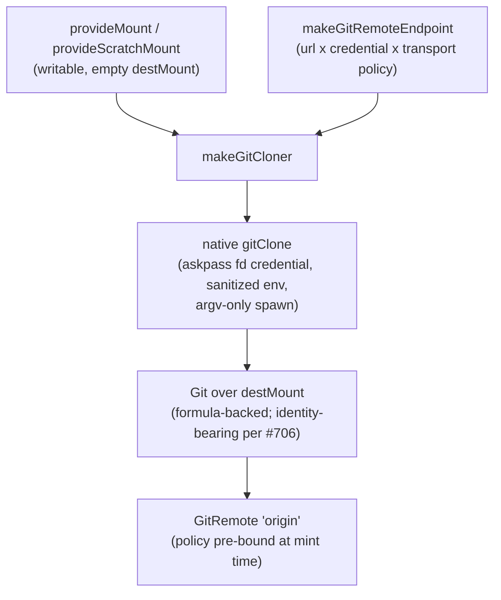

# Repository Bootstrap: `provideGitClone` and the Commit-Identity Boundary

| | |
|---|---|
| **Created** | 2026-07-12 |
| **Author** | Kris Kowal (prompted) |
| **Status** | In Progress |

> **This is a design record, not a proposal.**
> The bootstrap seam shipped before this document was written (PR
> [#538](https://github.com/endojs/endo-but-for-bots/pull/538), merged
> 2026-07-08), and the commit-identity boundary is in flight as PR
> [#706](https://github.com/endojs/endo-but-for-bots/pull/706) (Phase 2 of the
> git-capability sequencing plan, PR
> [#691](https://github.com/endojs/endo-but-for-bots/pull/691)).
> [daemon-git-remotes](daemon-git-remotes.md) § Repository Bootstrap and
> `clone` deferred the bootstrap API to "its own `daemon-git-clone.md`", and
> [daemon-git-next-steps](daemon-git-next-steps.md) § Open Work carries the
> matching item; this document is that home, written down so the shipped
> composition and its rationale are canonical rather than reconstructed from
> PR archaeology.

## Status

Shipped on `llm` via #538:

- `gitClone` (`@endo/git`, `native-git-backend.js`): the host-only native
  constructive clone helper, with the clone-time restrictions listed below.
- `makeGitRemoteEndpoint` and `makeGitCloner` (`@endo/exo-git`,
  `git-remote.js` / `git-cloner.js`): the reusable remote-endpoint authority
  and the composition seam that turns endpoint x empty destination mount into
  a fresh `(Git, GitRemote)` pair with `origin` pre-bound.
- `provideGitClone` (`@endo/daemon`, `host.js`): the host method that wires
  the daemon's formula machinery into the cloner seam.

In flight:

- PR #706 adds the formula-owned `identity` construction option to
  `provideGit` and `provideGitClone` (see § The Commit-Identity Boundary).
  Until it lands, every commit on a host is attributed to the backend default
  `Endo <endo@invalid.local>`.

## What is the Problem Being Solved?

The version-controlled filesystem loop
([daemon-git-next-steps](daemon-git-next-steps.md)) starts from a worktree
the operator pre-mounted: the host provides an `EndoMount`, derives `Git`
with `provideGit`, and binds a `GitRemote` with `provideGitRemote`. That
covers the first of the two legitimate product flows named in
[daemon-git-remotes](daemon-git-remotes.md) § Repository Bootstrap and
`clone`. The second flow, "you give me a URL, the agent runs, and its commits
are attributed correctly", had no home:

- **Cloning is constructive.** At clone time there is no repository and no
  local `Git` to attenuate, so `clone()` belongs on neither the `Git` facet
  nor a bound `GitRemote`. It must compose mount authority, endpoint policy,
  and sealed credential authority *before* the capabilities the rest of the
  loop is built from exist.
- **Attribution is authority.** The agent's commits must carry an identity
  the agent does not choose. The backend's hardcoded
  `GIT_AUTHOR_NAME: 'Endo'` / `GIT_AUTHOR_EMAIL: 'endo@invalid.local'`
  (`makeGitEnv` in `@endo/git`) had the right *shape* (guest-immutable) but
  was not *policy*: every `Git` on a host committed as the same fictional
  author, so a multi-tenant host could not distinguish two agents' work, and
  an operator could not attribute a bot's commits to the bot's own identity.

Both must stay host-mediated. Cloning arbitrary remotes into arbitrary host
paths, or choosing one's own commit identity, are exactly the authorities the
loop keeps out of the guest's hands.

## Design

### The Bootstrap Composition

```ts
provideGitClone(opts: {
  destMount: EndoMount;          // daemon-minted, writable, empty
  endpoint: {
    url: string;                 // no embedded credentials
    credential?: unknown;        // daemon-minted GitCredential cap
    allowLocalFileTransport?: boolean;  // default false
  };
  identity?: {                   // PR #706; formula-owned, guest-immutable
    authorName: string;
    authorEmail: string;
  };
}): Promise<{ git: EndoGit; remote: GitRemote }>;
```

The host method validates that `destMount` is a daemon-minted, writable mount
(read-only mounts are rejected as clone destinations), seals the endpoint
descriptor into a `GitRemoteEndpoint`, and invokes the `makeGitCloner` seam:



The cloner performs, in order: native clone into the mount's host path,
`Git` derivation over the freshly-cloned destination (via the daemon's
formula-backed `provideGit` machinery, so the cap survives restart), and
`origin` binding (a `GitRemote` minted from the same endpoint, with policy
fixed at mint time: `fetch` + `push` allowed, fetch refspec
`+refs/heads/*:refs/remotes/origin/*`, push refspec
`refs/heads/*:refs/heads/*`, no force-push / tags / deletes, file transport
carried over from the endpoint). Between every step the cloner asserts the
endpoint's credential has not been rotated or revoked
(`captureCredentialVersion` / `assertCredentialUnchanged`), and a credential
change mid-clone aborts the native subprocess through an `AbortController`
wired to the endpoint's `watchChange`.

**Deviation from the roadmap sketch.** The Open Work item in
[daemon-git-next-steps](daemon-git-next-steps.md) sketched the composition as
"mount creation + endpoint policy + sealed credential authority +
clone-into-the-new-mount, returning the resulting `EndoMount` + `Git`". The
shipped shape instead **takes the mount as an input** and returns
`{ git, remote }`:

- Mount provisioning stays its own host step (`provideMount` /
  `provideScratchMount`) so mount policy (`readOnly`, `deniedSegments`,
  scratch-versus-pinned backing) is decided at the mount layer, once, rather
  than duplicated behind a clone flag surface. The clone must not mint
  mounts.
- Returning the mount would be redundant: the caller necessarily already
  holds it.
- Returning the `origin` `GitRemote` was not in the sketch but falls out of
  the composition: the endpoint authority is already in hand, and a clone
  whose product cannot fetch or push would strand the loop it exists to
  start.

### Clone-Time Restrictions

The native `gitClone` boundary enforces, before spawning git:

- the URL must not embed credentials (`user:pass@` is rejected);
- `http:` remotes are rejected outright; a credential requires `https:`;
- `file:` transport requires the endpoint's explicit
  `allowLocalFileTransport` opt-in;
- the destination must be empty (a non-empty mount is rejected, so a clone
  cannot overwrite existing content);
- credential material reaches git only through the daemon-shipped
  `GIT_ASKPASS` fd-pipe helper (never argv, never process env), under the
  same sanitized-environment envelope as every other native invocation
  ([daemon-git-remotes](daemon-git-remotes.md) § Initial Backend);
- argv-array spawn only, `--end-of-options` before positional arguments.

### The Commit-Identity Boundary

PR #706 makes attribution a per-`Git` policy with the same ownership shape as
`GitRemote`'s endpoint policy: **formula-owned, captured at construction,
guest-immutable**.

- `provideGit(mountCap, petName, { identity: { authorName, authorEmail } })`
  and the `identity` option on `provideGitClone` are validated at the host
  boundary and persisted in the `git` formula, so the identity survives
  deincarnation and daemon restart.
- `makeNativeGitBackend({ repoRoot, identity })` projects the identity onto
  the git author/committer environment once at construction and threads it
  into every mutating invocation through the existing `withGitEnvOverrides`
  seam.
- Omitted, commits fall back to `Endo <endo@invalid.local>`: the option is
  strictly additive.
- `reword` keeps its author-preservation contract: per-call `GIT_AUTHOR_*`
  overrides take precedence at the seam, so a rewritten commit retains its
  original author while the *committer* is re-attributed to the identity.

There is deliberately no guest-visible `setIdentity()`. The guest observes
its identity only the way anyone does: in the commits it makes.

## Dependencies

| Design | Relationship |
|---|---|
| [daemon-mount-capabilities](daemon-mount-capabilities.md) | The destination: a writable, empty `EndoMount` is the clone's one content-layer input. |
| [daemon-git-capability](daemon-git-capability.md) | The product: the cloned worktree's `Git` is an ordinary mount-derived `Git`; the identity boundary rides its formula. |
| [daemon-git-remotes](daemon-git-remotes.md) | The source of the endpoint / credential / transport shapes; § Repository Bootstrap and `clone` names this document as the follow-up home. |
| [daemon-git-next-steps](daemon-git-next-steps.md) | The roadmap whose § Open Work item this record closes. |
| [daemon-capability-bank](daemon-capability-bank.md) | Future durable home for the credential material the endpoint seals (today daemon-process-local). |

## Design Decisions

1. **Host-mediated, never guest authority.** `provideGitClone` is a host
   method; a guest cannot clone arbitrary remotes into arbitrary host paths.
   This is the second product flow of
   [daemon-git-remotes](daemon-git-remotes.md) § Repository Bootstrap and
   `clone`, exactly as specified there.
2. **The mount is an input, not a product.** Mount minting stays at the
   mount layer; the clone composes an existing writable, empty mount rather
   than creating one (see § Deviation from the roadmap sketch).
3. **A standalone cloner seam, not host-method body logic.**
   `makeGitCloner` is deliberately a portable maker the host merely invokes,
   mirroring `makeGitRemote -> (remote, controller)`, so a later guest-held
   `GitCloner` facet plus `GitClonerController` is additive rather than a
   rewrite. #538 built only the host-only seam.
4. **Clone lives on neither `Git` nor `GitRemote`.** Both are attenuations
   of an existing repository; a constructive operation cannot be. The seam
   takes the endpoint and the mount, the two authorities that do exist
   before the repository does.
5. **`origin` is pre-bound with a fixed default policy.** The clone returns
   a `GitRemote` whose policy (fetch + push over `refs/heads/*`, no force /
   tags / deletes) is fixed at mint time by trusted code, not by the caller
   of the returned facet. Whether the *host caller* should be able to narrow
   it at clone time is an open question below.
6. **Identity is construction-time policy, not a guest surface.**
   Considered and rejected: a guest-visible `setIdentity()`. Commit
   attribution is exactly the authority the loop keeps out of the agent's
   hands; the formula-owned option gives the operator per-`Git` policy
   without giving the guest a pen to sign someone else's name with.

## Open Questions

- Should `provideGitClone` bind pet names? Today it takes no `petName` and
  registers no `storeIdentifier` task: the cloned `Git` and `origin` remote
  formulas persist, but the caps are reachable only through the returned
  references. The sibling providers (`provideGit`, `provideGitRemote`) all
  bind names; a host that clones and then restarts before naming the results
  must re-derive them.
- Should the host caller be able to narrow the `origin` policy at clone
  time (for example the
  [daemon-git-remotes](daemon-git-remotes.md) § Agent MVP Profile shape,
  push restricted to `refs/heads/agent/*`), instead of receiving the fixed
  `refs/heads/*` default and adjusting through the remote's controller
  afterward?
- Is a separate committer identity knob wanted, or does author = committer
  (with `reword`'s author-preservation carve-out) remain sufficient? PR #706
  deliberately ships the single `{ authorName, authorEmail }` pair.
- When [daemon-capability-bank](daemon-capability-bank.md) lands, the
  endpoint's credential sourcing moves to the bank
  ([daemon-git-next-steps](daemon-git-next-steps.md) § Beyond the Loop);
  does the clone path need anything beyond what `GitRemote` needs there?

## Prompt

> Author the new `daemon-git-clone.md` design record in
> endojs/endo-but-for-bots: specify `provideGitClone(...)` (composing mount
> creation + endpoint policy + sealed credential authority +
> clone-into-the-new-mount, returning the resulting `EndoMount` + `Git`) and
> the paired commit-author / identity boundary, closing the "you give me a
> URL, the agent runs, and its commits are attributed correctly" gap named in
> `daemon-git-next-steps.md` § Open Work; cross-link `daemon-git-remotes`
> § Repository Bootstrap and the in-flight commit-identity work (PR #706).
