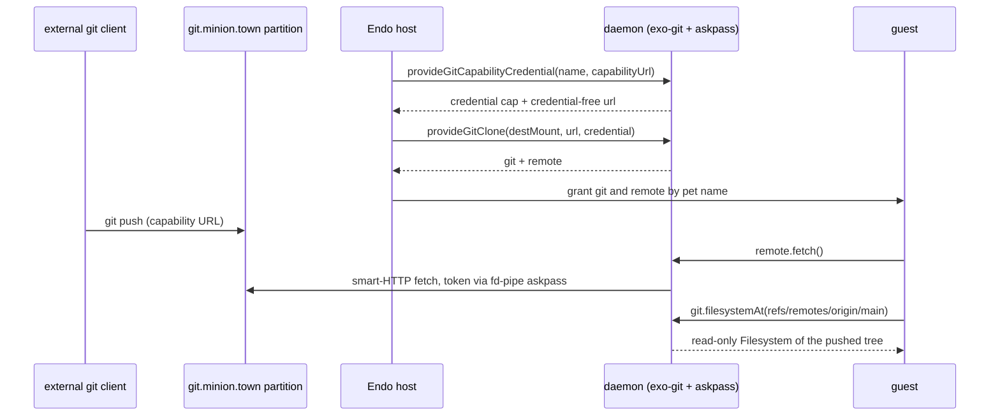

# Daemon Git Remotes over Capability URLs

| | |
|---|---|
| **Created** | 2026-09-29 |
| **Updated** | 2026-09-29 |
| **Author** | kriscendobot (prompted) |
| **Status** | Proposed |

> **Read in order.**
> This is an increment on [daemon-git-remotes](daemon-git-remotes.md) (doc 3 of the git trio) and requires it.
> It is the Endo-side consumer of the capability-addressed git remote designed in `kriscendobot/minion.town` `designs/git-remote-capability.md` ([kriscendobot/minion.town#41](https://github.com/kriscendobot/minion.town/pull/41)), whose first increment is deployed at `https://git.minion.town` ([kriscendobot/minion.town#86](https://github.com/kriscendobot/minion.town/pull/86), [kriscendobot/minion.town#136](https://github.com/kriscendobot/minion.town/pull/136)).

## Summary

Let the host adopt a **git capability URL** (`https://x-access-token:<token>@git.minion.town/<partition>`) as a daemon `GitRemote` without the token ever reaching a formula, an error message, argv, or the guest.
One new host method, `provideGitCapabilityCredential`, splits the URL in the daemon into a non-extractable `BasicCredential` and a credential-free endpoint URL; the existing `provideGitRemote` and `provideGitClone` do the rest unchanged.
The same slice fixes a live leak: today the embedded-credential rejection echoes the whole URL, token included, back over CapTP.

This is the next mergeable slice of M3's `daemon-git-remotes` row.
It closes the M3 exit criterion's git half ("a capability-addressed `git push` lands an artifact into an Endo directory") using only landed substrate: an external client pushes to a partition, and a daemon-side `GitRemote` bound to that partition fetches it into a `Git` whose `filesystemAt(ref)` is the Endo directory view.

## Reconciliation: what has landed, and what the dependency actually needs

**Landed on `llm` (as of 2026-09-29).**
Phases 1–5 of [daemon-git-remotes](daemon-git-remotes.md) § Implementation Plan shipped in #365; fd-pipe askpass in #368; host-mediated `provideGitClone` in #538; commit identity in #706.
Hardening and ergonomics followed: #532 (independent `file:` fetch of a pushed branch), #633 and #734 (public types), #929 (policy normalization, `defaultPullRef`), #973 (bounded network-sourced results), #1022 (`help()`), #1145 (`credentialHealth()`).
The agent-facing push tier `makeGitRemoteTool` shipped in #705, and nested Git grants for code mode in #958.
Phases 6 (interactive provisioning) and 7 (extended transports) remain open, and issue #378 carries the hardening follow-ups on the landed code.

**What the capability-addressed git remote needs from Endo.**
The `designs/README.md` M3 row states that minion.town § 12's Endo follow-on "is the git trio + `makeGitRemoteTool`".
That is half right, and this document corrects it.
Minion.town § 12 names two directions:

- **Endo as client** (a daemon agent fetching from or pushing to a partition). The git trio already covers this except for one gap: nothing turns a capability URL into a `GitRemote`. `normalizeGitRemoteUrl` in `@endo/exo-git` rejects embedded userinfo, and nothing splits it. **This document closes that gap.**
- **Endo as server** (§ 12 items 1, 3, 4, 7: the partition primitive, capability-URL minting and revocation, the git-object ↔ CAS database, per-partition reclamation). The trio does not cover any of this. Minion.town's increment 1 implements it outside Endo (`git http-backend` over one bare repo per partition), and its Rust backing is [endor-git-bindings](endor-git-bindings.md) (M11). Moving it into the daemon is a separate design (**to be filed**) and is not on the M3 critical path, because the deployed minion.town server already provides the server half.

Minion.town § 12 item 2 (widening the MCP guest facet with `send` attachments, `request`, and `identify`) belongs to minion.town and to [endo-guest-stdio-mcp](endo-guest-stdio-mcp.md), not to this stack.

## Design

### `provideGitCapabilityCredential`

```ts
EndoHost.provideGitCapabilityCredential(
  petName: PetName | NamePath,
  options: { capabilityUrl: string },
): Promise<{ credential: BasicCredential; url: string }>;
```

- Parsing lives in one pure helper in `@endo/exo-git`, `splitGitCapabilityUrl(text)`, next to `normalizeGitRemoteUrl`. It accepts only `https:` URLs whose userinfo carries a non-empty password (the token), and returns `{ url, audience, username, password }`. `url` is the input with userinfo removed; `audience` is `new URL(url).origin`. A missing username defaults to `x-access-token`, the fixed non-secret username minion.town mints.
- The host method mints a `BasicCredential` exactly as `provideBasicCredential` does, stores it under `petName`, and returns it together with the credential-free `url`. The token reaches only the process-local material map in `manager.js`, which is the same place `provideBasicCredential` puts a password.
- `url` is **not a secret**. The partition id in its path names a partition and grants nothing, so `GitRemote.inspect()` may show it (Design Decision 8 of [daemon-git-remotes](daemon-git-remotes.md) is unchanged).
- Errors never contain the input. An unparseable URL fails with `"capabilityUrl is not a valid https URL"`; a URL with no token fails with `"capabilityUrl carries no token"`. Neither message quotes the argument.

The host then composes with landed methods:

```js
const { credential, url } = await E(host).provideGitCapabilityCredential(
  'inbox-cred', { capabilityUrl },
);
const { git, remote } = await E(host).provideGitClone({
  destMount: scratch,
  endpoint: { url, credential },
});
// Grant the guest `git` and `remote`: after `remote.fetch()`,
// `git.filesystemAt('refs/remotes/origin/main')` is the pushed artifact.
```

`provideGitRemote(git, 'partition', { name: 'origin', url, credential, allowedDirections: ['fetch', 'push'], pushRefspecs: ['refs/heads/main:refs/heads/main'] })` binds a partition to an existing worktree the same way.

### Attenuation is stated, never inferred

A minion.town capability URL does not reveal whether it is a `read` or a `readwrite` token; minion.town's attenuation is a field on its server-side record.
The daemon therefore infers nothing from the URL.
The host states `allowedDirections` (the landed default is `['fetch']`), and the server enforces its own attenuation independently: a `read` token's push gets a 403.
Two gates, each owned by the side that holds the authority, and neither trusts the other.

### Secret hygiene fix on the landed path

`normalizeGitRemoteUrl` currently fails with `must not include embedded credentials: ${q(urlText)}` and `is not a valid URL: ${q(urlText)}`.
A host that passes a capability URL straight to `provideGitRemote` or `provideGitClone` therefore gets the token back inside a rejection that crosses CapTP and lands in logs and agent transcripts.
This slice redacts it: the embedded-credentials message prints the URL with username and password replaced by `***`, and the invalid-URL message quotes nothing.
The new message also names `provideGitCapabilityCredential` as the right entry point.

### Restart behavior

Credential material is process-local by design ([daemon-git-remotes](daemon-git-remotes.md) § Initial Backend), so after a daemon restart a capability-URL credential reports `revoked: true` through `credentialHealth()` until the host calls `rotate({ username, password })`.
For a show-once capability URL, that means the host has to keep the URL somewhere to recover.
This slice keeps the landed invariant and documents the recovery; durable custody is the bank item in [daemon-git-next-steps](daemon-git-next-steps.md) § Beyond the Loop.



## Ownership map

| Boundary | Mechanism | Policy | Durable state | Lifecycle / commit authority | Value crossing |
|---|---|---|---|---|---|
| Host caller → daemon host method | `splitGitCapabilityUrl` in `@endo/exo-git` | Host decides whether to adopt a URL | Formula: kind, audience only | Host (pet-name store, `GitCredentialController`) | The capability URL, once, in a method argument |
| Daemon → `GitRemote` formula | Landed `provideGitRemote` / `provideGitClone` | Host-stated `allowedDirections`, refspecs, force flags | Formula: credential-free URL + policy | Host via `GitRemoteController` | Credential cap reference; never material |
| `GitRemote` → minion.town server | Native git over HTTPS, token via fd-pipe askpass | Server-side attenuation (`read` / `readwrite`), partition confinement | Server: refs, objects, token hashes | Minion.town operator (mint, revoke) | Packfiles on the HTTPS data plane; never CapTP |
| `Git` → guest | Landed `filesystemAt(ref)` | Read-only view | None new | Daemon (view lifetime follows `Git`) | `Filesystem` capability |

The four ownership questions:

- **Persistent state:** the daemon persists only credential-free policy; the token lives in process memory; the minion.town server owns refs, objects, and token bindings.
- **Commit or discard:** the remote ref advance belongs to the minion.town server (the `receive-pack` ref lock); the local remote-tracking ref advance belongs to the daemon's landed `fetch` fence.
- **Restart and replay:** after a daemon restart the host re-supplies material through `rotate`; the server's durable token bindings make that replay idempotent.
- **Execution classification:** a 401 means the token was revoked server-side, a 403 means the attenuation is too weak, a 404 means the URL names the wrong partition. The server decides which one applies. The daemon currently passes all three through as the failing operation's error; mapping them to structured results is the existing in-flight-failure item in [daemon-git-remotes](daemon-git-remotes.md) § Testing Plan, not part of this slice.

## Implementation plan (one PR, base `llm`)

1. `@endo/exo-git`: `splitGitCapabilityUrl` plus unit tests (userinfo split, default username, `http:` rejected, no token rejected, messages never contain the input).
2. `@endo/exo-git`: redact both `normalizeGitRemoteUrl` messages. Update the existing `/embedded credentials/` assertions in `packages/daemon/test/git-remote.test.js` to also assert that the token substring is absent.
3. `@endo/daemon`: `EndoHost.provideGitCapabilityCredential` (interface guard in `interfaces.js`, type in `types.d.ts`, help text via `help-text-data.js`).
4. Integration test in `packages/daemon/test/git.test.js`: stand up the existing HTTP credential fixture requiring Basic `x-access-token:<token>`, adopt a capability URL, `provideGitClone`, push from an independent client, `fetch`, and read the pushed file through `filesystemAt`. Assert the token does not appear in the formula record, in `inspect()`, in the audit log, or in any rejection.
5. On merge, flip this document's status to Complete and record the PR in [daemon-git-remotes](daemon-git-remotes.md) § Implementation Progress. (The reconciliation edits to that document and to the README M3 rows land with this design.)

Out of this slice: a guest-side adoption verb (the host adopts and grants), CLI flags such as `--capability-url-file`, exact-URL credential scoping, and durable custody.

## Open questions

1. **Should a capability-URL credential bind to its exact URL rather than its origin?** The landed audience check is origin-level, so two partitions' credentials on `git.minion.town` are interchangeable to the daemon, and a host mis-binding one gets a 404 from the server rather than a construction-time refusal. Recommend: add an optional exact-URL scope to credentials minted by this method, as a follow-up, since the server's confinement already fails closed.
2. **Should git capability URLs join the `#v=1` capability-URL locator family?** Design PR #1360 (`capability-url-locators`) defines locators as `endo://` or `https` URLs with a `#v=1` fragment, while minion.town's git URL carries its token in userinfo because stock `git` needs it there. Recommend: keep them separate families, and let `endo store --locator` recognize a userinfo git URL only after #1360 is accepted.
3. **Should `provideGitClone` and `provideGitRemote` also accept `{ capabilityUrl }` directly?** It would save the host one call, at the cost of two more places that parse secrets. Recommend: not in this slice.
4. **Who keeps a show-once capability URL across a daemon restart before the bank lands?** Recommend: the adopting operator, as with any other rotated credential; revisit when [daemon-capability-bank](daemon-capability-bank.md) lands.

## Dependencies

| Design | Relationship |
|---|---|
| [daemon-git-remotes](daemon-git-remotes.md) | Parent: `GitRemote`, credentials, fd-pipe askpass, `provideGitClone`. This slice adds one host method and a message fix. |
| [daemon-git-capability](daemon-git-capability.md) | `Git.filesystemAt(ref)`, the Endo directory view of the fetched artifact. |
| [daemon-git-next-steps](daemon-git-next-steps.md) | Stack roadmap; its bank item owns durable credential custody. |
| `kriscendobot/minion.town` `designs/git-remote-capability.md` and `designs/git-remote-capability-increment-1.md` | The server this slice talks to: capability-URL shape, `x-access-token` username, server-side attenuation and confinement. |
| [endor-git-bindings](endor-git-bindings.md) | Future Rust backing for a daemon-side server half; not needed by this slice. |
| Design PR #1360 (`capability-url-locators`) | Sibling capability-URL family (`#v=1` fragment); see Open question 2. |

## Prompt

> Design the next implementation increment for `endojs/endo-but-for-bots`'s M3 `daemon-git-remotes` capability, reconciling its landed phases with the capability-addressed git-remote dependency and identifying the mergeable next slice.
