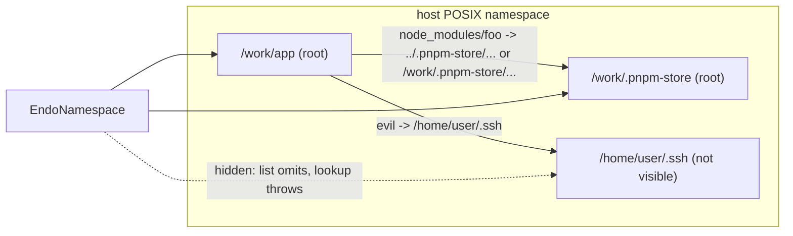

# Namespaces: visible mount roots with a root controller

| | |
|---|---|
| **Created** | 2026-09-30 |
| **Updated** | 2026-10-01 |
| **Author** | Kris Kowal (prompted) |
| **Status** | Proposed |

## What is the Problem Being Solved?

An `EndoMount` confines to one physical directory. Every operation calls
`assertConfined` (`packages/daemon/src/mount.js`), which takes the `realpath`
of the candidate and rejects it unless it lies under the mount's single
`confinementRoot`. Symlinks that resolve elsewhere are hidden from `list()`,
answer `false` from `has()`, and throw from `lookup()` and the mutators
([daemon-mount](daemon-mount.md) § Symlink Confinement Algorithm).

That rule is sound, but it treats *every* path outside the root as
nonexistent, so a tree whose links cross between directories cannot be read
confined at all. The motivating case is
[agent-confined-application-makers](https://github.com/endojs/endo-but-for-bots/pull/1340)
(`designs/agent-confined-application-makers.md`, PR #1340), which reads a
`node_modules` tree through a mount. Under pnpm, `node_modules/<name>` is a
symlink into a virtual store, and a workspace package is a symlink to a sibling
package directory. When the store or the sibling lives outside the
application's directory, the links escape, and #1340 now requires a hoisted
layout (`node-linker=hoisted`) when reading from a mount. In review
([comment](https://github.com/endojs/endo-but-for-bots/pull/1340#discussion_r4149165593)),
kriskowal asked for a fuller attenuation that "does not deny the existence of
the full posix namespace but makes all but some roots [in]visible", with "a
controller facet to add and remove roots".

## Design

### Terms: a mount has one root, a namespace has many

An `EndoMount` keeps its meaning: it has exactly **one root**, and it hides
that root's host prefix. A path into a mount is a list of segments relative to
the root, and nothing a mount returns names the host path above it.

A **namespace** (`EndoNamespace`) is the new thing: a *set* of visible roots
over the host's POSIX namespace. "Root set" and "namespace" mean the same
thing in this document; "mount" always means a single root. The two are kept
apart by name because they make opposite choices about prefixes (below).

### A namespace preserves its roots' prefixes

The underlying namespace is the host's POSIX namespace, unmodified: a symlink
is resolved by the kernel to wherever it points. Each root of an
`EndoNamespace` appears **at its own absolute path**. A namespace with roots
`/work/app` and `/work/.pnpm-store` presents exactly those two subtrees, at
those two paths, and nothing else. A path argument is a list of segments from
`/`, and a location is **visible** if it lies under one of the roots.

Preserving the prefix is what lets links keep their meaning. A relative link
(`node_modules/foo -> ../../.pnpm-store/foo@1/node_modules/foo`) and an
absolute link (`node_modules/foo -> /work/.pnpm-store/foo@1/node_modules/foo`)
both name a location that exists in the namespace, at the same path the host
would give it, so both resolve with no rewriting. A namespace that relabelled
its roots (`/store/...`) would break every absolute link and every relative
link that climbs above a root.



**This is a trade-off, and it is deliberate.** A mount hides its prefix, so
a mount holder learns nothing about where on the host its root lives. A
namespace reveals the absolute path of every root, and of every visible
location a link resolves to. It still reveals nothing about locations outside
its roots: listing `/` or `/work` shows only the path components that lead to
a root, and a link to a hidden location reports "not visible" with no target.
A host that must keep host paths private grants mounts, not a namespace.

The confinement check generalizes from one root to many:

```
assertVisible(candidatePath, roots):
  resolved = realpath(candidatePath)
  for root in roots (live roots only):
    if resolved == root.path or resolved startsWith root.path + '/':
      return root
  throw EACCES "path is not visible in this namespace"
```

A root's `path` is the `realpath` of its source mount's physical root, taken
when the root is added and re-taken on reincarnation. `assertConfined`,
`assertConfinedOrAncestor`, and `isConfinedPath` become thin wrappers over
this with a one-element set; a mount keeps its prefix-hiding public surface on
top. Checks stay at operation time, as today, so a root added or removed
between two calls takes effect at the next call with no TOCTOU window beyond
the existing one.

### Walking the namespace

Because every root is addressable by its absolute path, a holder may walk any
root directly (`lookup(['work', '.pnpm-store', 'foo@1'])`) as well as reach it
by following a link from another root. There is no separate "home" and no
root-qualified path argument: the path *is* the qualification.

- `list()` of a directory above every root (`/`, `/work`) returns only the
  child segments that lead toward a root. Such a directory is a read-only
  **scaffold**: it has no host entries of its own in the namespace, and every
  mutator on it is refused.
- `lookup()` of a directory under root `R` returns a face whose current
  directory is that path. Faces share the namespace's root set and liveness
  record (the same `ctx` spread that `makeRevocableMount` uses for
  `revocation`), so they see root additions and removals. `..` is lexical over
  the namespace path, not clamped at `R`; it climbs into scaffold directories
  and other roots, never above `/`.
- A face whose location stops being visible (its root was removed) throws
  `path is not visible in this namespace` on every operation, the same way a
  revoked face throws.

Per-root rules:

- **Write authority is the meet.** A write under root `R` requires the
  namespace and `R` both to be writable. A read-only namespace is read-only
  everywhere.
- **Denied segments apply per root.** Each root keeps the
  `deniedSegments` set of the mount it was added from.
- **Moves stay within one root.** `move()` across roots is refused, because
  a rename cannot be atomic across two confinement boundaries and it would
  let a writable root receive content from under a read-only one.

### Sub-mounts of a namespace are single-root mounts

`provideSubMount` over a namespace path yields an ordinary `EndoMount`: one
root at that path, prefix hidden, the source root's read-only bit and denied
segments, and no link-following into other roots. A holder who wants a
narrower *namespace* asks the controller holder for one. This keeps "mount"
meaning one root everywhere, and a sub-mount never carries more authority than
the subtree it names.

### The canonical location of a resolved path

`mapNodeModules` deduplicates packages by `canonical(location)`. A namespace
adds one read method that answers where a path resolves:

```ts
resolve(path: PathArg): Promise<string[]>;
```

The result is the resolved path's segments from `/`, which is safe to return
because the namespace already reveals its roots' prefixes. The tree
`ReadPowers` of #1340 (`makeTreeReadPowers`) maps a namespace path directly to
a `file://` URL of the same path and implements `canonical` with `resolve`, so
two links to one store entry canonicalize to one package, and the capture step
records the archive exactly as it does for a hoisted tree. No synthetic URL
prefixes are needed.

### Snapshot roots

A root may also be a `ReadableTree` snapshot, which is content-addressed and
has no physical backing. `addSnapshotRoot` takes one with an explicit **prefix**, the
absolute path at which the snapshot appears (typically the path it was
captured from):

```ts
addSnapshotRoot(prefix: string[], tree: ReadableTree): Promise<void>;
```

A snapshot root is always read-only. Since the kernel cannot `realpath` into
it, link resolution in a namespace with a snapshot root is done by the daemon
rather than by the kernel:

```
resolveInNamespace(segments, roots):
  path = []
  for segment in segments:
    path = lexical(path, segment)            # '..' pops, '.' skips
    root = longest root whose prefix is a prefix of path
    if root is physical:
      (defer to realpath for the rest, then assertVisible)
    else if root is a snapshot and entry(path) is a symlink:
      target = readlink(entry)
      path = target absolute ? target : lexical(dirname(path), target)
      re-run over path's remaining segments (bounded by SYMLOOP_MAX)
  assertVisible(path)
```

A physical link that resolves into a snapshot root's prefix, or a snapshot
link that resolves into a physical root, is followed the same way: each step
lands in whichever root owns the resulting path. The loop bound is the same
40-step limit POSIX uses, and a cycle reports `ELOOP`.

This needs one prerequisite outside the namespace itself: `ReadableTree` must
be able to record a symlink as an entry (target text, not content) rather than
following it at check-in. Today it has no symlink entry kind
([daemon-checkin-checkout](daemon-checkin-checkout.md)). Snapshot roots are
therefore a separate phase, gated on that tree format change.

### The root controller

The controller is a caretaker facet in the style of `EndoMountControl`: the
namespace is handed out, and the controller stays with whoever granted it.

```ts
interface EndoNamespaceControl {
  addRoot(root: EndoMount, options?: { readOnly?: boolean }): Promise<string[]>;
  addSnapshotRoot(prefix: string[], tree: ReadableTree): Promise<void>;
  removeRoot(prefix: string[]): Promise<void>;
  listRoots(): Promise<Array<{ prefix: string[]; readOnly: boolean; snapshot: boolean }>>;
  revoke(): void;
  help(method?: string): string;
}
```

- **A physical root is a mount, never a path.** `addRoot` takes an
  `EndoMount` capability, per
  [daemon-mount-capabilities](daemon-mount-capabilities.md) § Design
  Principles 1 and 2. The daemon reads its physical backing through the
  host-private `getMountBacking`; a mount that is not daemon-minted is
  refused. The controller can therefore only make visible what its holder
  could already read, so adding a root never amplifies authority. The root's
  prefix is its source's realpath, which `addRoot` returns, so the controller
  holder learns the prefix it is about to reveal.
- **A root is named by its prefix.** There are no labels: `removeRoot` and
  `listRoots` identify a root by the absolute path it occupies. Two roots may
  not overlap (neither prefix may be a prefix of the other), so every visible
  path belongs to exactly one root.
- **A root inherits its source's limits.** A read-only source yields a
  read-only root whatever `options.readOnly` says. If the source mount is
  revoked or its formula cancelled, the root becomes invisible at once,
  because the namespace consults the source's liveness record on each check.
- **`revoke()`** is today's `EndoMountControl.revoke()`: it trips the
  namespace and every derived face.

### Formulas and host methods

The root set is durable state and must survive reincarnation, but formulas
are immutable. The namespace therefore keeps its roots in a daemon-owned pet
store, the same substrate that backs an `EndoDirectory`:

| Formula | Fields | Makes |
|---|---|---|
| `namespace` | `roots` (pet-store id), `readOnly` | the namespace |
| `namespace-control` | `namespace` (namespace id) | the controller |

`addRoot` writes an entry keyed by the encoded prefix whose value is the
source mount id (or snapshot tree id) plus the `readOnly` bit; `removeRoot`
removes it. On reincarnation the namespace rebuilds its root set from the
store and re-takes each physical root's realpath; a root whose realpath has
moved is reported by `listRoots` at its new prefix. A root entry keeps its
source formula reachable for as long as the entry exists.

`EndoHost` gains one method:

```ts
provideNamespace(
  rootMountNames: NameOrPath[],
  namespaceName: NameOrPath,
  controlName: NameOrPath,
  options?: { readOnly?: boolean },
): Promise<EndoNamespace>;
```

It formulates both, adds the named mounts as initial roots, stores the
namespace under `namespaceName` and the controller under `controlName`, and
returns the namespace. A host grants the namespace to a guest and keeps the
controller. A guest gets no `provideNamespace`: a guest that holds two mounts
can already read both, and a guest-held namespace would add nothing but
link-following and prefix disclosure, which is what this design keeps under
the host's control.

## Ownership map

| Boundary | Mechanism | Policy | Durable state | Lifecycle authority | Value crossing |
|---|---|---|---|---|---|
| Namespace face → visibility check | `assertVisible` over `realpath`, or `resolveInNamespace` with a snapshot root | the live root set | none | the namespace's liveness record | absolute namespace path |
| Controller → namespace | shared root-set record | controller holder chooses roots | the roots pet store | controller (`addRoot`, `removeRoot`, `revoke`) | root prefix, source `EndoMount` or `ReadableTree` |
| Namespace → source mounts | `getMountBacking`, source liveness | source's `readOnly`, `deniedSegments` | source mount formulas | each source's own formula | physical root, read-only bit |
| Namespace → sub-mount | `provideSubMount` | one root, prefix hidden | a `mount` formula | daemon | formula identifier |
| Host → daemon formulation | `provideNamespace` | host chooses initial roots | `namespace`, `namespace-control` formulas | daemon | formula identifiers |
| Namespace → tree `ReadPowers` (#1340) | `resolve` | identity path-to-URL mapping | none | daemon capture step | absolute namespace path |

- **Persistent state**: the daemon owns it, in the two formulas and the roots
  pet store.
- **Commit or discard**: a controller call commits when the pet-store write
  lands; a refused `addRoot` writes nothing.
- **Restart and replay**: reincarnation rebuilds the root set from the pet
  store and re-reads each source's backing; no filesystem state is cached.
- **Execution classification**: a face reports "not visible" (`EACCES`) for
  a hidden path and "revoked" for a dead face, and learns nothing about
  where a hidden link points.

## Phased implementation

1. Generalize `assertConfined` and its siblings to a root set, with the
   single-root mount as the degenerate case. All existing mount tests pass
   unchanged.
2. `makeNamespace` and `EndoNamespaceControl` in `mount.js` for physical
   roots: prefix-preserving paths, scaffold directories, the shared root-set
   record, per-root read-only and denied segments, and `provideSubMount`
   yielding a single-root mount.
3. `namespace` / `namespace-control` formulas, the roots pet store, and
   `EndoHost.provideNamespace`.
4. `resolve()` on the namespace, and `makeTreeReadPowers` (#1340) using it for
   `canonical`; lift #1340's hoisted-only requirement for a namespace whose
   roots cover the store.
5. Snapshot roots: a symlink entry kind in `ReadableTree`, then
   `addSnapshotRoot` and daemon-side `resolveInNamespace`.

## Test plan

- A relative link and an absolute link from one root into another both read;
  a link to a non-visible directory is omitted by `list`, `false` from `has`,
  and throws from `lookup` and every mutator, without revealing its target.
- `list` of `/` and of an intermediate directory shows only the segments
  leading to roots; mutators on a scaffold directory are refused.
- A root is walkable directly by its absolute path, and `..` from one root
  climbs into the scaffold and down into another.
- `addRoot` makes a previously hidden link resolve on the next call;
  `removeRoot` hides it again, and a face obtained through it throws.
- `addRoot` of a mount overlapping an existing root is refused.
- Revoking or cancelling a source mount hides its root in every face.
- A read-only source root refuses writes through a writable namespace;
  `move` across roots is refused.
- `addRoot` with a non-daemon-minted remotable is refused.
- `provideSubMount` over a namespace path yields a mount that hides its prefix
  and does not follow links into other roots.
- The namespace survives a daemon restart with the same root set.
- A pnpm tree with the virtual store in a sibling root, and a pnpm workspace
  whose packages link to sibling directories, capture to the same archive as
  the hoisted layout of the same dependencies, for both relative and absolute
  store links.
- With a snapshot root: a link from a physical root into the snapshot, a link
  within the snapshot, and a link from the snapshot back to a physical root
  each resolve; a link cycle reports `ELOOP`; writes into the snapshot are
  refused.

## Dependencies

| Design | Relationship |
|---|---|
| [daemon-mount](daemon-mount.md) | the single-root confinement this generalizes |
| [daemon-mount-capabilities](daemon-mount-capabilities.md) | objects-not-paths principle; host-private backing |
| [daemon-checkin-checkout](daemon-checkin-checkout.md) | `ReadableTree`, which needs a symlink entry kind for snapshot roots |
| agent-confined-application-makers ([PR #1340](https://github.com/endojs/endo-but-for-bots/pull/1340)) | consumer: symlinked `node_modules` stores |
| [daemon-worker-import-from-mount](daemon-worker-import-from-mount.md) | another mount reader that may take a namespace |

## Design Decisions

1. The host namespace is not rewritten. The namespace filters resolved
   locations and does not rewrite link targets.
2. Roots preserve their prefixes, so both relative and absolute symlinks
   resolve unchanged. The cost is that a namespace reveals its roots' host
   paths, where a mount hides its single root's prefix; hosts that need the
   prefix hidden grant mounts (review decision, 2026-10-01).
3. "Mount" means one root; a set of roots is a "namespace", with its own
   interface and formula names (review decision, 2026-10-01).
4. `provideSubMount` over a namespace yields a single-root mount (review
   decision, 2026-10-01).
5. A `ReadableTree` snapshot may be a root, with daemon-side link resolution
   (review decision, 2026-10-01).
6. Physical roots are added as mount capabilities, never path strings, so the
   controller cannot amplify authority.
7. Considered and rejected: following escaping links into a snapshot copy.
   Reason: it breaks liveness and writes.
8. Considered and rejected: relabelling roots under synthetic names. Reason:
   it breaks absolute links and links that climb above a root.
9. Considered and rejected: a guest-callable `provideNamespace`. Reason:
   link-following reach and prefix disclosure should be granted, not
   assembled.
