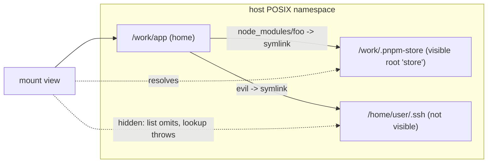

# Mount views: visible roots with a root controller

| | |
|---|---|
| **Created** | 2026-09-30 |
| **Author** | Kris Kowal (prompted) |
| **Status** | Proposed |

## What is the Problem Being Solved?

An `EndoMount` confines to one physical directory. Every operation calls
`assertConfined` (`packages/daemon/src/mount.js`), which takes the `realpath`
of the candidate and rejects it unless it lies under the mount's single
`confinementRoot`. Symlinks that resolve elsewhere are hidden from `list()`,
answer `false` from `has()`, and throw from `lookup()` and the mutators
([daemon-mount](daemon-mount.md) § Symlink Confinement Algorithm).

That rule is sound, but it treats *every* path outside the root as
nonexistent, so a tree whose links cross between directories cannot be read
confined at all. The motivating case is
[agent-confined-application-makers](https://github.com/endojs/endo-but-for-bots/pull/1340)
(`designs/agent-confined-application-makers.md`, PR #1340), which reads a
`node_modules` tree through a mount. Under pnpm, `node_modules/<name>` is a
symlink into a virtual store, and a workspace package is a symlink to a sibling
package directory. When the store or the sibling lives outside the
application's directory, the links escape, and #1340 now requires a hoisted
layout (`node-linker=hoisted`) when reading from a mount. In review
([comment](https://github.com/endojs/endo-but-for-bots/pull/1340#discussion_r4149165593)),
kriskowal asked for a fuller attenuation that "does not deny the existence of
the full posix namespace but makes all but some roots [in]visible", with "a
controller facet to add and remove roots".

## Design

### A mount view has one home and a set of visible roots

A **mount view** is an `EndoMount` whose confinement is a *set* of visible
roots rather than one root. The underlying namespace is the host's POSIX
namespace, unmodified: a symlink is resolved by the kernel to wherever it
points. The view then decides only whether the resolved location is
**visible**, meaning it lies under one of the view's roots. A link into another
visible root resolves and reads normally. A link anywhere else behaves exactly
as an escaping link does today.

One root is the **home**. Path arguments are segments relative to the home (or
to the face's current directory), `..` still clamps lexically at the face's
root, and nothing in the public surface accepts or returns an absolute host
path. Adding roots therefore widens what a *link* may reach; it does not let a
caller name an arbitrary path.



The confinement check generalizes from one root to many:

```
assertVisible(candidatePath, roots):
  resolved = realpath(candidatePath)
  for root in roots (live roots only):
    rootResolved = realpath(root.physicalRoot)
    if resolved == rootResolved or resolved startsWith rootResolved + '/':
      return root
  throw EACCES "path is not visible in this mount"
```

`assertConfined`, `assertConfinedOrAncestor`, and `isConfinedPath` become
thin wrappers over this with a one-element set, so an ordinary `EndoMount` is a
view whose only root is its home and whose root set never changes. Checks stay
at operation time, as today, so a root added or removed between two calls takes
effect at the next call with no TOCTOU window beyond the existing one.

### Following a link into another root

`lookup()` of a path that resolves into root `R` returns a face whose
`currentDir` is the resolved physical directory and whose `..` clamp is `R`'s
physical root. The face shares the view's root set and liveness record (the
same `ctx` spread that `makeRevocableMount` uses for `revocation`), so it sees
root additions and removals too. A face whose own root is later removed throws
`path is not visible in this mount` on every operation, the same way a revoked
face throws.

Per-root rules:

- **Write authority is the meet.** A write through a link into root `R`
  requires the view, the face, and `R` all to be writable. A read-only view is
  read-only everywhere.
- **Denied segments apply per root.** Each root keeps the
  `deniedSegments` set of the mount it was added from.
- **Moves stay within one root.** `move()` across roots is refused, because
  a rename cannot be atomic across two confinement boundaries and it would
  let a writable root receive content from under a read-only one.

### The canonical location of a resolved path

`mapNodeModules` deduplicates packages by `canonical(location)`. A view adds
one read method that answers where a path resolves without revealing the host
path:

```ts
resolve(path: PathArg): Promise<{ root: string; path: string[] }>;
```

`root` is the root's **label** (below) and `path` the segments under it. The
tree `ReadPowers` of #1340 (`makeTreeReadPowers`) maps each label to a
synthetic URL prefix (`file:///app/` for the home, `file:///<label>/` for the
others) and implements `canonical` with `resolve`, so two links to one store
entry canonicalize to one package. The capture step then records the archive
exactly as it does for a hoisted tree.

### The root controller

The controller is a caretaker facet in the style of `EndoMountControl`: the
view is handed out, and the controller stays with whoever granted it.

```ts
interface EndoMountRootsControl {
  addRoot(label: string, root: EndoMount, options?: { readOnly?: boolean }): Promise<void>;
  removeRoot(label: string): Promise<void>;
  listRoots(): Promise<Array<{ label: string; readOnly: boolean }>>;
  revoke(): void;
  help(method?: string): string;
}
```

- **A root is a mount, never a path.** `addRoot` takes an `EndoMount`
  capability, per [daemon-mount-capabilities](daemon-mount-capabilities.md)
  § Design Principles 1 and 2. The daemon reads its physical backing through
  the host-private `getMountBacking`; a mount that is not daemon-minted is
  refused. The controller can therefore only make visible what its holder
  could already read, so adding a root never amplifies authority.
- **A root inherits its source's limits.** A read-only source yields a
  read-only root whatever `options.readOnly` says. If the source mount is
  revoked or its formula cancelled, the root becomes invisible at once,
  because the view consults the source's liveness record on each check.
- **Labels are view-local names.** A label is a single segment
  (`assertValidTreeEntryName`), unique within the view. `home` is reserved and
  cannot be removed.
- **`revoke()`** is today's `EndoMountControl.revoke()`: it trips the view
  and every derived face.

### Formulas and host methods

The root set is durable state and must survive reincarnation, but formulas
are immutable. The view therefore keeps its roots in a daemon-owned pet store,
the same substrate that backs an `EndoDirectory`:

| Formula | Fields | Makes |
|---|---|---|
| `mount-view` | `home` (mount id), `roots` (pet-store id), `readOnly` | the view |
| `mount-view-control` | `view` (mount-view id) | the controller |

`addRoot` writes `label → <root mount id>` (plus the `readOnly` bit) into the
roots store; `removeRoot` removes it. On reincarnation the view rebuilds its
root set from the store. The view `thisDiesIfThatDies(home)`; a root entry
keeps its source mount formula reachable for as long as the entry exists.

`EndoHost` gains one method:

```ts
provideMountView(
  homeMountName: NameOrPath,
  viewName: NameOrPath,
  controlName: NameOrPath,
  options?: { readOnly?: boolean },
): Promise<EndoMount>;
```

It formulates both, stores the view under `viewName` and the controller under
`controlName`, and returns the view. A host grants the view to a guest and
keeps the controller. A guest gets no `provideMountView`: a guest that holds
two mounts can already read both, and a guest-held view would add nothing but
link-following, which is what this design keeps under the host's control.

## Ownership map

| Boundary | Mechanism | Policy | Durable state | Lifecycle authority | Value crossing |
|---|---|---|---|---|---|
| Mount face → visibility check | `assertVisible` over `realpath` | the live root set | none | the view's liveness record | resolved physical path (never leaves the daemon) |
| Controller → view | shared root-set record | controller holder chooses roots | the roots pet store | controller (`addRoot`, `removeRoot`, `revoke`) | root label, source `EndoMount` |
| View → source mounts | `getMountBacking`, source liveness | source's `readOnly`, `deniedSegments` | source mount formulas | each source's own formula | physical root, read-only bit |
| Host → daemon formulation | `provideMountView` | host chooses home | `mount-view`, `mount-view-control` formulas | daemon | formula identifiers |
| View → tree `ReadPowers` (#1340) | `resolve` | label-to-URL mapping | none | daemon capture step | `{ root, path }` |

- **Persistent state**: the daemon owns it, in the two formulas and the roots
  pet store.
- **Commit or discard**: a controller call commits when the pet-store write
  lands; a refused `addRoot` writes nothing.
- **Restart and replay**: reincarnation rebuilds the root set from the pet
  store and re-reads each source's backing; no filesystem state is cached.
- **Execution classification**: a face reports "not visible" (`EACCES`) for
  a hidden path and "revoked" for a dead face, and learns nothing about
  where a hidden link points.

## Phased implementation

1. Generalize `assertConfined` and its siblings to a root set, with the
   single-root mount as the degenerate case. All existing mount tests pass
   unchanged.
2. `makeMountView` and `EndoMountRootsControl` in `mount.js`, with the shared
   root-set record and per-root read-only and denied segments.
3. `mount-view` / `mount-view-control` formulas, the roots pet store, and
   `EndoHost.provideMountView`.
4. `resolve()` on the view, and `makeTreeReadPowers` (#1340) using it for
   `canonical`; lift #1340's hoisted-only requirement for a view whose roots
   cover the store.

## Test plan

- A link from home into a visible root reads; a link to a non-visible
  directory is omitted by `list`, `false` from `has`, and throws from
  `lookup` and every mutator.
- `addRoot` makes a previously hidden link resolve on the next call;
  `removeRoot` hides it again, and a face obtained through it throws.
- Revoking or cancelling a source mount hides its root in every view.
- A read-only source root refuses writes through a writable view; `move`
  across roots is refused.
- `addRoot` with a non-daemon-minted remotable is refused.
- The view survives a daemon restart with the same root set.
- A pnpm tree with the virtual store in a sibling root, and a pnpm workspace
  whose packages link to sibling directories, capture to the same archive as
  the hoisted layout of the same dependencies.

## Dependencies

| Design | Relationship |
|---|---|
| [daemon-mount](daemon-mount.md) | the single-root confinement this generalizes |
| [daemon-mount-capabilities](daemon-mount-capabilities.md) | objects-not-paths principle; host-private backing |
| agent-confined-application-makers ([PR #1340](https://github.com/endojs/endo-but-for-bots/pull/1340)) | consumer: symlinked `node_modules` stores |
| [daemon-worker-import-from-mount](daemon-worker-import-from-mount.md) | another mount reader that inherits the root set |

## Design Decisions

1. The namespace is the host's; the view filters resolved locations. It does
   not rewrite link targets or synthesize a namespace.
2. Roots are added as mount capabilities, never path strings, so the
   controller cannot amplify authority.
3. Considered and rejected: following escaping links into a snapshot copy.
   Reason: it breaks liveness and writes.
4. Considered and rejected: a guest-callable `provideMountView`. Reason:
   link-following reach should be granted, not assembled.

## Open Questions

1. Should a view also accept a root-qualified path argument
   (`{ root: 'store', path: [...] }`) so a holder can walk another root
   directly, or should other roots be reachable only by following links from
   the home?
2. Should `provideSubMount` over a view keep the view's root set, or yield a
   plain single-root mount?
3. Should `addRoot` accept a `ReadableTree` snapshot (content-addressed, no
   physical backing) as a root, which would need link resolution into a
   non-physical tree?
