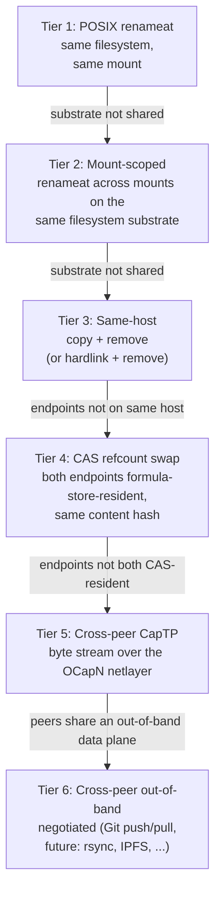
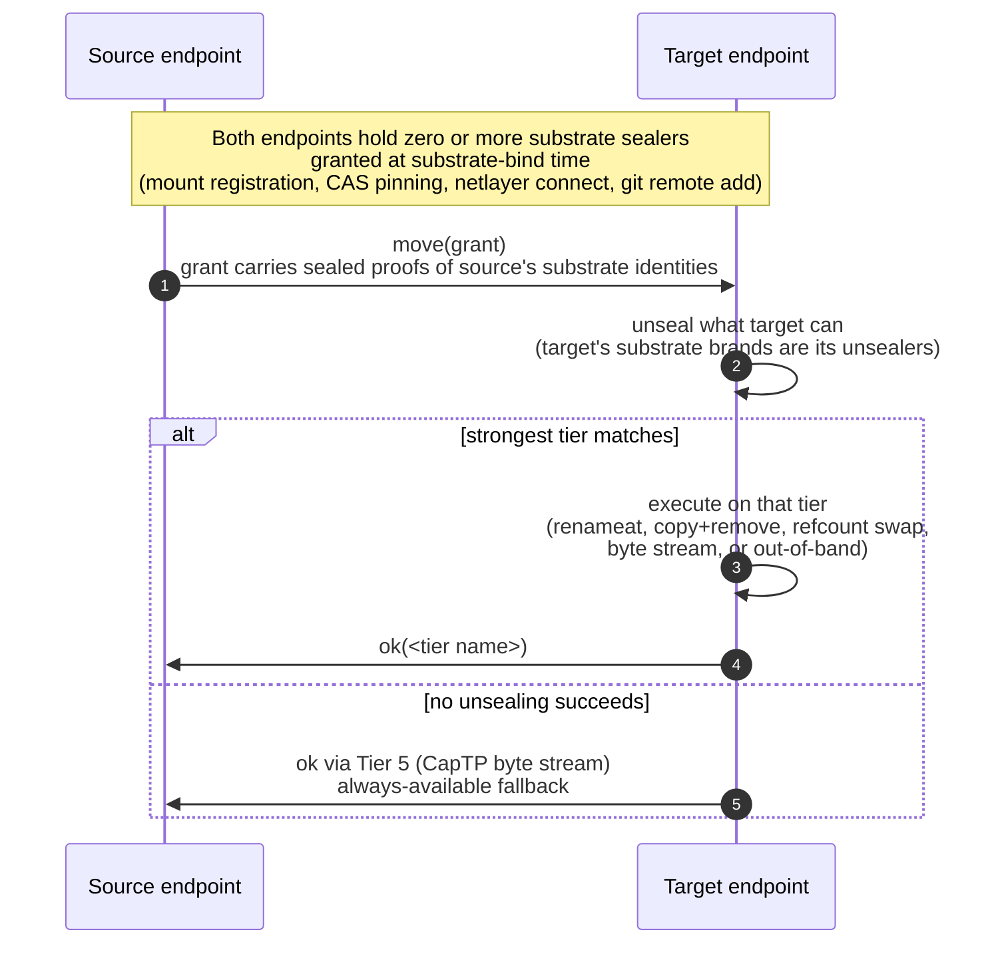
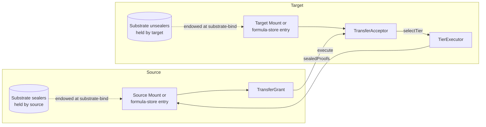

# Daemon Move Transfer Negotiation

| | |
|---|---|
| **Created** | 2026-06-08 |
| **Author** | Kris Kowal (prompted) |
| **Status** | Not Started |

## What is the Problem Being Solved?

The daemon today exposes a single `move(from, to)` method on
`MountInterface` per [daemon-mount](daemon-mount.md).
It performs an atomic rename when both endpoints are paths inside one
mount's confinement root, because the underlying `fs.promises.rename`
call is a same-filesystem `renameat(2)`.
This is correct for the "rename within one mount" case but does not
cover the cases that matter for an agent moving data through the
endo capability graph.

Concretely, the surface today does not name:

- A move between two distinct mount capabilities whose confinement
  roots happen to share a filesystem (the kernel `renameat(2)` would
  succeed but the daemon's exo surface does not allow the call to
  cross capability boundaries).
- A move from a `mount` to a `scratch-mount` (or back) on the same
  host, which today must run as a userspace copy plus a remove even
  when the kernel could splice or hardlink.
- A move whose endpoints are both formula-store-resident
  (`readable-blob` / `readable-tree`), where the strongest possible
  transfer is a refcount adjustment per
  [daemon-content-store-gc](daemon-content-store-gc.md) and no bytes
  need to flow at all.
- A move whose source and target sit on distinct peers connected
  through the OCapN substrate per
  [ocapn-network-transport-separation](ocapn-network-transport-separation.md),
  where the daemon today has no surface for negotiating an
  out-of-band transfer (a Git push between shared remotes, for
  example) and would fall through to a byte-by-byte stream over
  CapTP.

The capability lattice ranges from a single `renameat(2)` call
(microseconds, atomic, crash-safe) to a multi-gigabyte byte stream
over a CapTP session that already exists for unrelated reasons
(seconds to minutes, not atomic).
The endpoints know which side of the lattice each holds.
The daemon's exo surface should let them negotiate, find the
strongest common substrate, and execute the move on that substrate,
falling through to weaker tiers only when the stronger ones do not
apply.

The maintainer's framing
([recorded verbatim below under `## Prompt`](#prompt)) names
**grant matching equality with a sealer or unsealer** as the
mechanism.
This maps directly to the
[brand-and-trademark](../../journal/library/concepts/brand-and-trademark.md)
primitive in the library: a sealer / unsealer pair, granted at
substrate-bind time, lets two endpoints prove they share a substrate
(same filesystem, same mount, same host, same git remote) without
either learning the substrate's identity outside the pair.
The negotiation is rights-amplification at the daemon layer.

## Scope

This design adds a transfer-negotiation surface on top of
`MountInterface` and the formula-store verbs.
It defines:

1. A capability lattice from strongest to weakest tier.
2. A negotiation protocol grounded in brand-and-trademark
   (sealer / unsealer pairs).
3. The exo-interface shape (one of three options weighed below;
   option (a) is the picked shape).
4. Cross-design coordination with the existing mount, CAS, GC,
   identity, and netlayer designs.

Out of scope:

- The driver code that materializes each tier on each platform.
  Each tier is implemented in a follow-up builder dispatch.
- New out-of-band protocols beyond Git push / pull.
  The negotiation surface is defined so future protocols (rsync,
  BitTorrent, IPFS) can be added as new substrate-bind sealers
  without re-shaping the exo surface.
- Cross-peer GC.
  Refcount semantics on each peer follow the existing sweep-time
  discipline; the negotiation does not introduce a distributed
  refcount.

## Transfer-mechanism Ladder

Each tier names: the **substrate** (the structural property two
endpoints share that lets this tier apply), the **guarantees** the
tier carries, and the **fallthrough condition** under which the
negotiation walks to the next tier down.



The arrows read both ways in practice: the negotiation picks the
**strongest tier the endpoints share**, not necessarily Tier 1.
Tier 6 sits below Tier 5 only when neither peer holds the
out-of-band substrate token; when both peers share a Git remote
(the common case for source trees), Tier 6 is preferred over
Tier 5 because it pulls bytes over a path the network operator has
already provisioned for bulk traffic.

The fallthrough direction in the diagram is the
**fallback direction**: if the source presents a Tier-1 sealer but
the target cannot unseal it, the negotiation re-tries with the
Tier-2 sealer, and so on.
The endpoints converge on the strongest tier where the source's
sealer and the target's unsealer match.

### Tier 1 — POSIX `renameat` within one mount

| | |
|---|---|
| **Substrate** | Same `Mount` capability (or transient mount exo returned by `lookup`), which implies same confinement root, which implies same filesystem (Endo's mount design already requires `realpath` confinement). |
| **Guarantees** | Atomic per POSIX `renameat(2)`: the target name flips from "old entry" to "new entry" in one step. Crash-safe: a power loss mid-call leaves either the old name or the new name, never both, never neither. |
| **Condition** | Source path's resolved mount root equals target path's resolved mount root. This is today's `move(from, to)` precondition. |
| **Failure fallthrough** | Cannot happen on this tier (if `from` and `to` are both resolved-inside the same mount, the rename succeeds barring `EIO`). |

### Tier 2 — Mount-scoped `renameat` across mounts on the same filesystem

| | |
|---|---|
| **Substrate** | A **filesystem brand**: a sealer / unsealer pair created when the daemon's `FilePowers` binds a filesystem at supervisor start. Two mount caps sharing the filesystem share the same brand. The supervisor learns this from `stat(2)`'s `st_dev` field on each mount root and groups mounts by `st_dev` into one brand. |
| **Guarantees** | Atomic per POSIX `renameat(2)` across directories on one filesystem. Same crash-safety as Tier 1. Cross-mount visibility: the new entry appears on the target mount in the same instant it disappears from the source mount. |
| **Condition** | Source and target are distinct `Mount` capabilities whose internal substrate sealers stamp to the same filesystem brand. Both mounts must allow mutation (read-only target: degrade to Tier 3). |
| **Failure fallthrough** | If the kernel returns `EXDEV` (different filesystems despite matching `st_dev`, which can happen on bind-mounts with their own namespace), fall to Tier 3 same-host copy + remove. |

### Tier 3 — Same-host copy + remove

| | |
|---|---|
| **Substrate** | A **host brand**: a sealer / unsealer pair created at daemon start, granted to every `Mount` and every formula-store endpoint the daemon hosts. The host brand is one-per-daemon. |
| **Guarantees** | Non-atomic: the new entry appears before the old entry is removed. Crash-mid-copy leaves a partial target and the source intact (recoverable). Crash-after-copy-before-remove leaves both entries (recoverable). Reads of the target during copy may observe partial bytes. |
| **Condition** | Source and target both hold the host brand. Includes mount-to-formula-store and formula-store-to-mount moves, which Tier 1 / 2 cannot express. Optionally Tier 3a: hardlink + remove when both endpoints are on the same filesystem and the source's link count permits — atomic-equivalent for the target's appearance but the inode is shared. |
| **Failure fallthrough** | If the copy exceeds the target's storage quota partway through, the partial target is removed and the source is preserved; the negotiation does not retry on a lower tier. If the endpoints turn out to span hosts (a long-running mount that the supervisor lost track of, for example), fall to Tier 4 or below. |

### Tier 4 — CAS refcount swap

| | |
|---|---|
| **Substrate** | A **CAS brand**: a sealer / unsealer pair owned by the supervisor's content-address store per [daemon-cas-management](daemon-cas-management.md). Every `readable-blob` and `readable-tree` formula whose content lives in the local CAS holds the brand. The brand stamps the content's 256-bit SHA-256 hash per [daemon-256-bit-identifiers](daemon-256-bit-identifiers.md). |
| **Guarantees** | Atomic: the target formula is created pointing at the same hash; the source formula is collected on the next sweep per [daemon-content-store-gc](daemon-content-store-gc.md). No bytes flow. No new ref count is introduced; the design relies on the sweep-time refcount discipline that already governs CAS content. |
| **Condition** | Source and target are both formula-store-resident (`readable-blob` or `readable-tree`) and the source's content hash is already present in the target's CAS (which is necessarily true when source and target share the CAS brand — they share one local CAS). |
| **Failure fallthrough** | If the target is not in a formula store but in a mount (the target wants the bytes on a filesystem path), `cas-fetch` + `write` is the Tier 3 same-host copy. The negotiation walks down. |

### Tier 5 — Cross-peer CapTP byte stream

| | |
|---|---|
| **Substrate** | An **OCapN session brand**: a sealer / unsealer pair the netlayer hands to every endpoint reachable through one OCapN session per [ocapn-network-transport-separation](ocapn-network-transport-separation.md). The brand is bound to the session's Ed25519 peer key per [ocapn-noise-network](ocapn-noise-network.md). |
| **Guarantees** | Non-atomic. The bytes flow through the existing CapTP session using `cas-store-stream` / `cas-content-stream` from [daemon-cas-management](daemon-cas-management.md). Ordering follows CapTP's per-session ordering. Confidentiality and integrity follow the netlayer's session guarantees (Noise on the noise netlayer; TCP-only-for-test on the test netlayer). |
| **Condition** | Source and target are on distinct peers connected by an OCapN session. Both peers expose the CAS verbs needed to stream bytes. This is the always-available fallback when no stronger tier applies. |
| **Failure fallthrough** | If the session drops mid-transfer, the receiver removes the partial target; the source is unaffected. The negotiation retries from the top on a new session, not from a lower tier. |

### Tier 6 — Cross-peer out-of-band negotiated transfer

| | |
|---|---|
| **Substrate** | An **out-of-band data-plane brand**: a sealer / unsealer pair the supervisor mints when it learns the local daemon shares an out-of-band data plane with a remote peer. The first concrete instance is a **Git remote brand**: when the daemon has a `git remote` configured that the remote peer can also reach (the same `https://` or `ssh://` URL), both peers can mint matching brands. Future substrates (rsync over a shared SSH host, BitTorrent on a tracker both peers know, IPFS with overlapping bitswap providers) plug in as additional brands at this tier. |
| **Guarantees** | Non-atomic. Bytes flow over a path the network operator has provisioned for bulk traffic. The control plane (the "I just pushed, please pull" message) flows through the existing CapTP session; the bytes flow out of band. Crash-safety depends on the substrate (Git push is atomic per `git update-ref`; rsync with `--partial` is resumable; the design enumerates per-substrate guarantees as substrates are added). |
| **Condition** | Source and target are on distinct peers and both peers hold a matching out-of-band brand. Preferred over Tier 5 when the substrate exists, because the data plane is cheaper than CapTP for bulk bytes. |
| **Failure fallthrough** | If the out-of-band push fails (network partition between the two peers and the shared remote, for example), fall to Tier 5 CapTP byte stream. The session itself is the always-available substrate. |

## Negotiation Protocol

The exchange is brand discipline applied to substrate identity, with
the
[four-ways-to-acquire-references](../../journal/library/concepts/four-ways-to-acquire-references.md)
constraint as the structural floor: every tier must collapse to one
of Introduction / Parenthood / Endowment / Initial Conditions, and
Tier 6's out-of-band transfer must be modeled as an
*Introduction over a side channel* whose authority does not leak
outside the pair.



### Substrate-bind events

Substrate sealers are minted exactly when the supervisor binds a
substrate; the resulting sealer / unsealer pairs are granted to the
endpoints that share that substrate at that moment.
The five canonical bind events:

| Bind event | Substrate | Who mints | Granted to |
|---|---|---|---|
| `FilePowers` initialization at supervisor start | Filesystem brand (per `st_dev`) | Supervisor | Every `Mount` whose root path stats to that `st_dev` |
| Daemon start | Host brand | Supervisor | Every endpoint (mount, scratch-mount, formula-store entry) the daemon hosts |
| CAS subsystem init per [daemon-cas-management](daemon-cas-management.md) | CAS brand | Supervisor | Every `readable-blob` / `readable-tree` formula whose content is CAS-resident |
| OCapN session establishment per [ocapn-network-transport-separation](ocapn-network-transport-separation.md) | Session brand (bound to peer Ed25519 key per [ocapn-noise-network](ocapn-noise-network.md)) | Netlayer | Every endpoint reachable through the session |
| `git remote add` (and future analogues) | Out-of-band substrate brand | Supervisor | Every endpoint whose backing supports the substrate (today: every git-backed mount or formula-store entry on a tree that points at the shared remote) |

The grant follows
[four-ways-to-acquire-references](../../journal/library/concepts/four-ways-to-acquire-references.md)
Endowment: the endpoint is born holding the sealer because the
substrate that created it endowed it with the sealer.
This is the same shape per-agent keypairs follow on host / guest
construction per [daemon-256-bit-identifiers](daemon-256-bit-identifiers.md).

### TransferGrant and TransferAcceptor

Two new exo facets carry the negotiation:

```js
const TransferGrantI = M.interface('TransferGrant', {
  // Returns an array of sealed substrate proofs the source endpoint
  // can present.  Ordered strongest-first.
  sealedProofs: M.call().returns(M.promise(M.arrayOf(M.remotable('SealedProof')))),
  // Provenance trail for accounting; not load-bearing for security.
  describeSource: M.call().returns(M.promise(M.string())),
  help: M.call().returns(M.string()),
});

const TransferAcceptorI = M.interface('TransferAcceptor', {
  // Given an ordered list of sealed proofs, returns the strongest tier
  // the target can execute, or undefined if none unseal.
  selectTier: M.call(M.arrayOf(M.remotable('SealedProof')))
    .returns(M.promise(
      M.or(M.undefined(), M.splitRecord({
        tier: M.string(),
        executor: M.remotable('TierExecutor'),
      })),
    )),
  help: M.call().returns(M.string()),
});

const TierExecutorI = M.interface('TierExecutor', {
  execute: M.call(M.remotable('TransferGrant'))
    .returns(M.promise(M.splitRecord({
      tier: M.string(),
      bytes: M.number(),  // 0 for Tier 1/2/4; size for Tier 3/5/6
    }))),
  help: M.call().returns(M.string()),
});
```

The grant carries **sealed proofs**, not unsealed substrate names.
A holder who only has a Tier-1 sealer learns only that the target
either accepted Tier 1 or rejected it; the target does not leak which
of its own substrates would have matched.
This is the brand-and-trademark discipline applied at the exo
boundary.

### Exchange shape (the happy path)

1. The caller invokes `move(from, to)` on the source mount or
   formula-store endpoint, as today.
2. The source endpoint builds a `TransferGrant` carrying its sealed
   proofs (one per substrate sealer it holds, strongest-first).
3. The source presents the grant to the target endpoint's
   `TransferAcceptor` via `selectTier(sealedProofs)`.
4. The target walks the proofs in order, attempting `unseal` with
   each of its substrate unsealers, and returns the strongest match
   plus a `TierExecutor` bound to that tier.
5. The source calls `executor.execute(grant)`; the executor runs
   the tier's procedure (the kernel call, the copy, the refcount
   adjustment, the stream, or the out-of-band push).
6. The executor returns `{ tier, bytes }` for accounting; the
   source's `move(from, to)` returns `void` to preserve the existing
   shape, with the tier observable through a separate
   `moveWithReport(from, to)` (see *Exo Interface Family* below).

### Failure modes

- **No unsealing succeeds.**
  The target returns Tier 5 (CapTP byte stream) as the
  always-available fallback.
  The source streams bytes through the existing session.
  This is the "always works" floor.
- **Unseal succeeds but the tier's executor fails mid-execution.**
  Tier 1 / 2 / 4 are atomic so this case reduces to "the call
  errored, no state changed".
  Tier 3 / 5 / 6 are non-atomic; the executor cleans up the partial
  target and surfaces the error to the source.
  The source does not retry on a lower tier automatically; the
  caller decides (today's `move` already throws on rename failure).
- **The grant is rejected outright.**
  If the target's `TransferAcceptor` returns `undefined`, no Tier 5
  fallback exists (the endpoints do not share an OCapN session at
  all, which means the caller could not have reached the target).
  This case is unreachable in practice; surfacing it as an error
  detects logic bugs in the dispatcher.

### Capability flow



### Why brand-and-trademark and not raw substrate IDs

The grant could in principle carry plain substrate identifiers
(`st_dev` numbers, host IDs, CAS root paths, peer Ed25519 keys,
git remote URLs) and let the target compare for equality.
The brand-and-trademark discipline is strictly stronger:

- A plain substrate ID leaks the substrate's *identity* to every
  participant that holds the grant, including malicious or merely
  buggy ones.
  A sealed proof leaks only the substrate's *equality with the
  target's matching unsealer*; non-matching unsealers learn nothing.
- A plain substrate ID can be forged by an attacker who learns the
  ID through any channel (a log message, a stack trace, an error
  body).
  A sealed proof can only be produced by the holder of the matching
  sealer, which was granted at substrate-bind time.
  Unguessability follows from
  [four-ways-to-acquire-references](../../journal/library/concepts/four-ways-to-acquire-references.md):
  the sealer is reachable only by being explicitly handed out, so
  an attacker without a reference cannot forge a proof.
- A plain substrate ID requires endpoints to agree on a global
  namespace for substrate identities (which `st_dev` numbers
  collide across hosts; which peer keys map to which sessions).
  The brand discipline requires only that the sealer-holder and the
  unsealer-holder share a reference, with no global registry.

This is exactly the framing
[brand-and-trademark](../../journal/library/concepts/brand-and-trademark.md)
formalizes: types-by-fiat at the daemon layer.

## Exo Interface Family

Three shapes for surfacing the negotiation on top of today's `move`.

### Option (a) — Single polymorphic `move`, negotiation internal

The existing `move(from, to)` method on
`MountInterface` stays unchanged for the within-mount case.
For cross-mount and cross-host moves, the caller still calls
`move(from, to)`; the source endpoint internally builds the
`TransferGrant` and runs the negotiation.
A new sibling method `moveWithReport(from, to)` returns
`{ tier, bytes }` for callers that want the negotiation's outcome
visible.

```js
const MountInterface = M.interface('EndoMount', {
  // existing methods...
  move: M.call(M.arrayOf(M.string()), M.arrayOf(M.string()))
    .returns(M.promise()),
  // new:
  moveWithReport: M.call(M.arrayOf(M.string()), M.arrayOf(M.string()))
    .returns(M.promise(M.splitRecord({
      tier: M.string(),
      bytes: M.number(),
    }))),
});
```

**Trade-off**:
the call site stays simple; existing callers benefit from stronger
tiers without any change.
The cost is that the dispatcher is hidden inside the mount
implementation, and the caller cannot influence the tier choice
(no "force Tier 3, I don't want a refcount swap that aliases").
The mount implementation has to depend on the
`TransferAcceptor` exo as a sibling capability, which adds an
internal coupling between the mount and the formula-store endpoints.

This is the picked option.
Rationale below in *Why option (a)*.

### Option (b) — Typed methods (`moveLocal`, `moveAcrossMount`, `moveAcrossPeer`, ...)

The interface gains one method per tier (or per tier group), plus a
dispatch helper:

```js
moveLocal: M.call(...),
moveAcrossMount: M.call(...),
moveSameHost: M.call(...),
moveCasRefcount: M.call(...),
moveOverCaptp: M.call(...),
moveOutOfBand: M.call(...),
moveAutoDispatch: M.call(...),  // negotiates internally
```

**Considered and rejected: per-tier methods on the user-facing exo.
Reason: forces the caller to encode the tier ladder in their own
code, which is exactly the responsibility this design delegates to
the negotiation.**

### Option (c) — Capability-bearing facets the caller picks

The mount exposes a method `transferTo(target)` that returns a
facet tied to the tier whose substrate sealer matched.
The caller invokes the move on the facet:

```js
const transferFacet = await E(sourceMount).transferTo(targetMount);
await E(transferFacet).move(from, to);
```

**Considered and rejected: caller-facing capability per tier.
Reason: forces the caller into an explicit two-step dance for every
move, including the common within-mount case; doubles the call-site
verbosity to no benefit. The substrate-bind-time sealer is what
this design uses internally; surfacing it to every move call is
overkill.**
Option (c)'s shape *is* useful inside the implementation
(the `TierExecutor` returned by `selectTier` is exactly such a
facet), so the substrate is not lost.
What is rejected is exposing it as the primary user-facing surface.

### Why option (a)

The caller's mental model for `move` is "rename or transfer this
entry from here to there".
The negotiation is plumbing that should not appear in the call site.
Today's `move(from, to)` already hides the kernel call;
extending it to hide the tier choice is the natural next step.
The two-method split (`move` for fire-and-forget, `moveWithReport`
for accounting) keeps the simple case simple while letting tooling
and tests observe what happened.

The two rejected options remain useful internally:
option (b)'s per-tier methods exist as the `TierExecutor`'s `execute`
implementation (one executor per tier, dispatched by name);
option (c)'s capability-bearing facet is the `TierExecutor` itself.
The design rejects them only as the *primary user-facing surface*.

## Cross-Design Coordination

### daemon-mount

Today's `move` is one of the five method groupings on `MountInterface`
(reads, mutation, attenuation, snapshot, help).
This design **extends** the mutation surface with `moveWithReport`
and **strengthens** the existing `move` by routing it through the
negotiation when the source and target are not in the same mount.
The within-mount `renameat` path is unchanged.

### daemon-cas-management

Tier 4's refcount swap uses no new CAS verbs.
It calls `cas-retain` on the target's hash (which already equals the
source's hash because the CAS is content-addressed) and lets the
source's formula collection drop the source's retain count on the
next GC sweep.
The streaming Tier 5 path uses the existing `cas-store-stream` /
`cas-content-stream` verbs without modification.

### daemon-content-store-gc

Tier 4 relies on the sweep-time refcount discipline.
A move that adjusts retain counts on Tier 4 must align with the
sweep's expectation that retain counts are local-supervisor state,
not a parallel durable counter.
The design does not introduce a new durable counter.

### daemon-256-bit-identifiers

The grant-matching equality at the daemon layer is the address-
equality primitive defined here.
Peer ID is the Ed25519 public key (256-bit) per
[daemon-256-bit-identifiers](daemon-256-bit-identifiers.md);
formula numbers are 256-bit;
content addresses are SHA-256.
Two endpoints proving "we refer to the same thing" hinges on the
formula-address brand defined there.
This design's session brand and CAS brand both bind to these
256-bit primitives.

### daemon-capability-filesystem

This design **does not extend** the wider vision document
([daemon-capability-filesystem](daemon-capability-filesystem.md))
in a load-bearing way; the wider vision is a Reference document and
does not name a transfer-negotiation primitive of its own.
This design is the **concrete mergeable slice** for the move case
within today's mount surface and tomorrow's cross-peer surface.
A future revision to the wider vision could cite this design as the
canonical primitive once shipped.

### ocapn-network-transport-separation

Tier 5's session brand is minted by the netlayer when the OCapN
session establishes.
The netlayer's `OcapnNetwork.connect(location)` returns an
authenticated session per
[ocapn-network-transport-separation](ocapn-network-transport-separation.md);
the session brand is endowed to every endpoint reachable through
the session at that moment.
The brand is bound to the session's lifetime; when the session
drops, the brand becomes unforgeable-but-useless (no executor will
accept it).

### ocapn-noise-network

The session brand on the Noise netlayer is bound to the remote
peer's Ed25519 key per
[ocapn-noise-network](ocapn-noise-network.md).
Two sessions to the same peer (one fresh, one reconnected) carry
distinct session brands but the underlying *peer* brand can be
the same — the design treats per-peer brands as a sub-substrate of
the session brand, which lets a Tier-5 transfer survive a
reconnect.

### daemon-locator-terminology

The Peer Key and Formula Address brand types from
[daemon-locator-terminology](daemon-locator-terminology.md) are
the underlying types the negotiation's sealed proofs carry as
their unsealed contents.
The brand discipline wraps these types so the unsealed identity is
visible only to the matching unsealer-holder.

### daemon-value-message

The negotiation token (the `TransferGrant`) is **not** carried in
the message envelope.
It is exchanged via direct CapTP method calls
(`source.move(from, to)` invokes the target's `selectTier` via the
existing CapTP session).
This takes a stance on the
[daemon-value-message](daemon-value-message.md) prior open
question: side-channel carriage over the existing session, not
envelope carriage on a `value` message.
Reasoning: the grant has nontrivial lifetime (its sealed proofs
are bound to substrate sealers whose lifetime exceeds any one
message), and the message envelope is the wrong scope for an
authentication token whose validity outlives the message.

### endo-posix-sandbox (cap-not-string-mounts)

The negotiation surface honors the cap-not-string-mounts
discipline from
[endo-posix-sandbox](endo-posix-sandbox.md):
the `TransferGrant` carries *sealed substrate identities*, never
*host paths*.
A Tier-3 same-host copy uses the mounts' confinement roots
internally but never surfaces a host-path string to either
endpoint or to the caller.
A Tier-6 Git push uses the local remote name and the local
working-tree path, both resolved through the substrate sealer,
not through a path string the caller named.

## Open Questions

1. **Capability lattice exhaustiveness.**
   The six tiers above cover the substrates the daemon already
   touches.
   Substrates not yet on the list:
   LAN multicast (would sit between Tier 5 and Tier 6 for
   small payloads with multiple receivers);
   shared memory (would sit at Tier 1.5 for same-process
   endpoints, which today do not exist as a daemon-exposed
   capability);
   RDMA on cluster hosts (would sit between Tier 3 and Tier 4
   for endpoints on adjacent hosts of one HPC fabric).
   The design leaves Tier 6 open for any out-of-band substrate
   with a sealer / unsealer pair; whether the lattice should be
   reorganized to put substrate-class above tier-strength is an
   open question for a future revision once a second concrete
   substrate ships beyond Git.

2. **Backward compatibility with existing `move` callers.**
   Today's `move(from, to)` callers expect the within-mount
   atomic-rename semantics.
   With the negotiation, the same call site may resolve to a
   non-atomic Tier 3 copy + remove when the caller crosses mount
   boundaries (a thing the call site already could not do before,
   since the exo did not let one mount's `move` see another
   mount's paths).
   The compatibility question reduces to whether the within-mount
   shortcut should be the only path that uses today's `move`
   (so the negotiation only kicks in on a new method) or whether
   `move` should silently strengthen.
   The design picks the latter (silent strengthening) on the
   ground that within-mount calls keep their atomic semantics
   unchanged, but a follow-up may want to surface the tier in
   the within-mount case too so callers can detect when they
   accidentally crossed a boundary.

3. **Sealer / unsealer granularity.**
   The brand discipline could be applied at the
   `@endo/pass-style` makeMarshal boundary (one brand per marshal
   table) or finer (one brand per substrate kind, as this design
   proposes).
   The finer grain costs one sealer / unsealer pair per substrate
   instance, which is cheap (a few dozen pairs per daemon).
   The coarser grain would let any endpoint reachable through one
   marshal table prove substrate equality, which is too permissive
   for the host brand and the CAS brand.
   The design picks finer-grained brands; whether to introduce a
   coarser-grained brand as a roll-up for tooling that wants to
   see "are these two endpoints in the same trust domain" is an
   open question.

4. **Out-of-band protocols beyond Git.**
   The design names Git push / pull as the first concrete Tier 6
   substrate.
   Future substrates (rsync, BitTorrent, IPFS, content-addressable
   swarm, S3 multi-region replication, internal datacenter
   bulk-replication services) all fit the brand shape: each
   substrate mints a brand at supervisor-recognition time and
   endows it to the endpoints that can use it.
   The exo surface defined here permits all of them without
   change.
   The open question is whether the substrate-recognition
   procedure should be pluggable (every substrate ships its own
   recognizer) or central (the supervisor knows a registry of
   substrate types and probes for each).
   This design picks pluggable; the registry approach can
   layered on without surface change if it becomes clear it is
   needed.

5. **Performance / cost crossover.**
   For small payloads (a few kilobytes), the negotiation overhead
   (round-trip on `selectTier`) may exceed the cost of a Tier 5
   CapTP byte stream.
   A heuristic: skip negotiation and go straight to Tier 5 for
   payloads under a configurable threshold (default proposal:
   16 KiB, which is one TCP segment on common MTUs).
   Above the threshold, negotiate.
   The threshold is a property of the source endpoint and is not
   visible to callers.
   Whether the heuristic should be observable (a debug-mode
   exposure for tooling that wants to verify it negotiated) is
   open.

6. **Negotiation-token carriage.**
   The design takes the stance that the `TransferGrant` is
   exchanged via direct CapTP method calls on the existing
   session, not via a `value` message envelope per
   [daemon-value-message](daemon-value-message.md).
   The open question
   [daemon-value-message](daemon-value-message.md) names is
   resolved in this design's favor for *this* token; whether
   *every* such token in the daemon should follow the same rule
   (side channel over the existing session) is a broader
   question the value-message design's revision can settle.

## Prompt

> The daemon has a "move" command that attempts to perform the
> most local move possible.
> Please dispatch a designer to mull the ramifications and
> establish new exo interfaces that would enable us to take
> better advantage in more cases, of the best in-band or
> out-of-band transfer mechanism.
> For example, renaming a file in POSIX provides atomic swap
> guarantees if the source and target share a filesystem.
> Similarly, for mount directories in the daemon, we could do
> the same for file moves, and we can furthermore do ordinary
> copy/remove between files on the same host.
> But, we do not hesitate to copy between peers, through CapTP
> if necessary, but ideally with an out-of-band transfer, like
> Git push/pull or similar, depending on the data plane
> capabilities of the connected peers.
> This would presumably require a protocol, with grant matching
> equality and a sealer or unsealer, to establishing whatever
> degree of commonality exists between the source and target so
> it can take on an out-of-band negotiation.
