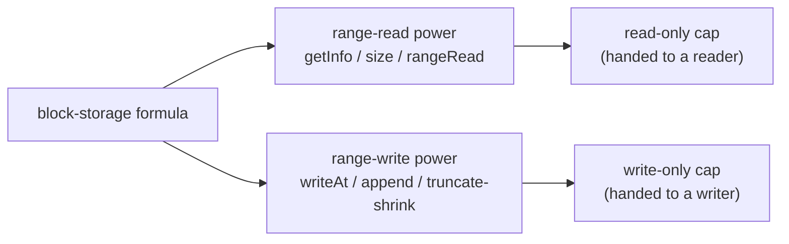

# Daemon Mutable Blob (Block Storage)

| | |
|---|---|
| **Created** | 2026-09-12 |
| **Author** | kriscendobot (prompted) |
| **Status** | Proposed |
| **Source** | Review comment on PR [#1125](https://github.com/endojs/endo-but-for-bots/pull/1125), `packages/daemon/src/formula-type.js` line 37 |

## What is the Problem Being Solved?

The daemon has a `readable-blob` formula type: an immutable, content-addressed
byte sequence whose identity **is** its SHA-256 hash. Its read surface
(`streamBase64` / `text` / `json` plus the range-I/O `getInfo` / `fetch`) is
defined by `ReadableBlobRangeInterface` in
[`packages/platform/src/fs/interfaces.js`](../packages/platform/src/fs/interfaces.js)
and realized by `makeReadableBlob` in
[`packages/daemon/src/manager.js`](../packages/daemon/src/manager.js).

There is no standalone **mutable** counterpart. Today the only live, writable
bytes in the daemon are `EndoMountFile` (`makeMountFileExo` in
[`packages/daemon/src/mount.js`](../packages/daemon/src/mount.js)), which exists
only *inside a mount* (a host-directory tree confined under a root) and whose
write surface is whole-value (`writeText`, `writeBytes`, `append`) with no
ranged write. There is a ranged **read** power (`filePowers.readFileRange`) but
no ranged **write** power. So a holder cannot be handed a first-class mutable
byte store, cannot overwrite a window in place, and cannot be given read
authority and write authority as separately delegable capabilities (why that
separation is worth having, rather than a single read+write face, is argued in
the "Two independent authorities" section below).

The originating maintainer prompt (reproduced verbatim in the "Prompt" section at
the end) asked for five things: pick a name (`blob`/`file`/`block-storage`); split
the filesystem powers into separate ranged-read and ranged-write authorities;
forbid a ranged write from extending the file in the middle while allowing append;
reserve room for a later CASK-backed variant that withstands mid-range splicing;
and restate the mechanism CASK uses for content-delimited blocks. This design
answers each in turn below.

Concretely, it adds that mutable counterpart as its own formula type, threads
**separate least-authority powers for ranged reads and ranged writes**, and
constrains the write power so it can overwrite within the current extent or
append at the end but cannot splice or extend from the middle. It reserves room
for a later splice-capable variant backed by content-defined blocks from CASK.

The new ranged-write primitive is scoped to the `block-storage` formula only;
`EndoMountFile`'s existing whole-value write surface (`writeText` / `writeBytes`
/ `append`, cited above as motivation) is left unchanged. Extending
`EndoMountFile` with a ranged write is the one real alternative to a new formula
type; the "Alternative considered and rejected" subsection under Design weighs it
against `block-storage` on delivery shape, capability split, and blast radius.

CASK is a content-addressed-storage successor system specified outside this
repository; it is not yet present here. The `cask-*` names referenced below
(`cask-entry-type-capability`, `cask-blob-cat`, `rabin-chunking`,
`cask-named-typed-pointer`) are forward references to that design line, not
links resolvable in this repo today. They are named here only to justify
reserving the `blob`/`file` names for the future splice-capable variant.

## Name

The capability is a standalone, daemon-persisted, mutable byte sequence with a
**stable formula identity** (not a content hash), ranged reads, and constrained
ranged writes. Three names were offered.

| Candidate | Verdict | Reason |
|---|---|---|
| `blob` | Reject | In this codebase "blob" means content-addressed bytes whose identity *is* the hash (`readable-blob`, `snapshot-blob`, `cask/blob`). A thing that mutates in place cannot keep a content-hash identity, so `blob` fights the established meaning. The honest "mutable blob" is a compare-and-swap *cell* that swaps among immutable content-addressed blobs (the CASK-backed splice-capable future variant, not this one). Reserve `blob` for that. |
| `file` | Reserve | Matches `EndoMountFile` / `FileInterface` and is POSIX-familiar, but that name already denotes a mount-scoped entry, and "file" invites the expectation of arbitrary in-place mutation (insert/delete splice, truncate-anywhere) that this capability deliberately forbids. Reserve `file` for the future splice-capable, CASK-backed variant. |
| `block-storage` | **Recommend** | Names the constrained medium honestly: a fixed-address byte store read and written by range, growing only by append, with no splice (exactly the semantics below). It leaves `file` and `blob` free for the splice-capable successor. |

**Recommendation: `block-storage`.** The final pick is a maintainer decision
(see the "Open questions" section). Formula type `block-storage`; the mutable exo is
`EndoBlockStorage`; the branch/PR slug is `daemon-mutable-block-storage`.

## Design

### Alternative considered and rejected: extend `EndoMountFile` with a ranged write

Before minting a new formula type, weigh the one real alternative the Problem
section surfaces: `EndoMountFile` already has whole-value write and ranged read,
so a `writeFileRange`-backed `writeAt`/`append` could be **added to the existing
mutable primitive** instead of standing up `block-storage`. This is the more
consequential architectural fork than the `blob`/`file`/`block-storage` naming
pick the table below settles, so it gets the same explicit rejection treatment
here rather than being asserted out of scope.

| Axis | Extend `EndoMountFile` | New `block-storage` formula (chosen) |
|---|---|---|
| Delivery shape | A mount file lives **only inside a mount** (a host-directory tree confined under a root); a holder must first stand up or be granted a mount to get one. | A first-class, standalone daemon-persisted capability a holder can be handed directly, with no mount ceremony. |
| Capability split | The mount-file face is a single read+write surface; splitting it into independently-delegable range-read and range-write powers means retrofitting the attenuation model onto every existing mount consumer. | Read and write are attenuated facets of one fresh cap from day one (the "Two independent authorities" split below), touching no existing consumer. |
| Blast radius | Every downstream mount consumer would then face **two divergent write surfaces** (whole-value `writeText`/`writeBytes`/`append` and the new ranged `writeAt`) on the same object, and must reason about which admission rules apply where. | The ranged-write admission rule (overwrite-or-append, no splice) is confined to one new exo; `EndoMountFile`'s existing whole-value write surface stays exactly as-is. |
| Future splice variant | Bolting the no-splice rule onto `EndoMountFile` entangles that rule with the mount lifecycle, muddying the later CASK-backed splice-capable `file`. | Keeps `file`/`blob` free for the splice-capable successor (see the naming table and the CASK section). |

The mount-file surface is **deliberately left unchanged**: a mount-file ranged
write is out of scope here, not merely deferred, and a mount file that wants
ranged writes would be a separate change. The new ranged-write primitive is scoped
to the `block-storage` formula only precisely because extending `EndoMountFile`
would force divergent write surfaces onto existing mount consumers for no gain to
a holder who just wants a standalone mutable byte store.

### Two independent authorities

The load-bearing observation: on **in-place** block storage a ranged read and a
ranged write are **content-independent** authorities. An overwrite or an append
does not need to read the current bytes, so a genuine **write-only** power is
honest for content here. The split is content-independent, **not**
state-independent: the write-admission rule below branches on the store's current
`size`, so a write-only holder can still probe size. That partial exception is
stated in full in the "The write-only cap is content-opaque but not size-opaque"
subsection below, and it is why this section claims content-independence rather
than blanket authority independence. The diagram's authority split is absolute
for bytes, not for size. This split is deliberately *unlike* the CASK-backed
splice-capable variant sketched below, whose cell capability cannot separate the
two authorities this way (the contrast is drawn where the cell is introduced, in
the "Room for a splice-capable CASK-backed variant" section). Because the two
authorities are content-independent, they split cleanly into two separately
delegable powers:



A holder can be given the read-only cap, the write-only cap, or both. The maker
(`makeBlockStorage`, see the "Daemon plumbing" section) mints the full store and returns it
to its creator; the read-only and write-only faces are then obtained by
**attenuating** that full cap down to the range-read power or the range-write
power, the same attenuation move the read face inherits from
[readableblob-range-attenuation.md](readableblob-range-attenuation.md). A facet is
therefore a delegation, not a separate mint: the creator holds the full cap and
hands a reader the read-only attenuation, a writer the write-only attenuation, or
both. The read-only cap is precisely the live-blob read face of
readableblob-range-attenuation.md; this design is its mutable, write-bearing
sibling.

**The write-only cap is content-opaque but not size-opaque.** "Independent" is a
claim about *content* authority: an overwrite or append never reveals the
current bytes. It is not a claim about *size*. Because the admission rule (below)
branches on the store's current `size`, a holder of only the write-only cap can
probe offsets and read success-versus-rejection to binary-search the current
size, a state observation that does not require the read-only cap. This is an
intentional, coarse size leak, not a content leak; the two-authority split stays
honest for bytes. A caller that needs the store's size to be opaque even to a
writer cannot be handed the write-only cap, and would need a constant-response
admission variant (noted in the "Open questions" section). The read power's `getInfo().size`
remains the sanctioned, non-probing way to observe size.

### Range-read power (least authority: read only)

Extends the existing `rangeReadMethodGuards` (`getInfo` plus `fetch` /
`rangeRead`) and **deliberately diverges** from it by adding a cheap `size()`
accessor:

```ts
getInfo(): Promise<{ algorithm: 'sha256', digest: string, size: bigint }>
size(): Promise<bigint>                                      // cheap, no hash
rangeRead(offset: bigint, length: bigint): Promise<Uint8Array>  // clamps at EOF
```

The `size()` accessor is **new**, not a mirror of the existing surface:
`rangeReadMethodGuards` in
[`packages/platform/src/fs/interfaces.js`](../packages/platform/src/fs/interfaces.js)
carries no size accessor today, and that file's own comment records that a prior
separate `sha256()` accessor was *removed* in favor of a single `getInfo()`
(the daemon's internals already hold the digest, so the cap method was
superseded). This design reintroduces a standalone accessor against that
convention because, unlike the immutable `readable-blob`, `getInfo()` here must
re-hash the *current* bytes on every call (O(n)), so a caller that needs only the
current length before a write cannot be asked to pay a full hash. That divergence
is intentional and should be reconciled with
[fs-interface-consolidation.md](fs-interface-consolidation.md) (which owns the
shared `M.interface` guard records) when the new write guard is added: `size()`
is a new shared member deliberately added, not an accidental mismatch with the
read guard it extends.

`rangeRead` reuses the established spelling from
[platform-range-and-tree-reads.md](platform-range-and-tree-reads.md)
(`rangeRead(offset, length) -> Uint8Array`, the ergonomic plain-byte-array form
alongside the streaming `fetch`), rather than inventing a fresh verb (neither a
bare `readAt` nor the endpoint-form `range(start, end)` weighed in the next
paragraph); unlike `readable-blob` it reads the *current* bytes on each call.
[readableblob-range-attenuation.md](readableblob-range-attenuation.md)'s
"Relationship to `rangeRead*`" section recommends replacing
`rangeRead(offset, length)` with the endpoint form `range(start, end)` in a
future rich-blob API version. `block-storage` deliberately keeps the
`rangeRead(offset, length)` form **now** so its read face stays identical to the
live `readable-blob` read face it attenuates from (this design is that face's
mutable sibling); the two blob-like read surfaces should migrate to
`range(start, end)` **together** in that future version, rather than
`block-storage` minting the new spelling alone now and leaving the two faces
permanently spelling range reads two different ways.

**`getInfo().digest` is a per-call snapshot, not an identity.** On the
content-addressed `readable-blob`, `getInfo()` returns `{ algorithm, hash, size }`
where `hash` *is* the stable, cacheable identity. Here the value mutates, so the
accessor deliberately spells the field `digest` (not `hash`) and the field is
**recomputed over the current bytes on every call** (O(n) in the current size).
Renaming the field keeps a generic caller from treating `getInfo().hash` as a
stable identity the way it safely can on every immutable sibling; a caller that
needs a stable content identity must take a `snapshot`/`readable-blob` of the
current bytes. Because `getInfo()` pays a full hash, it is **not** the call to
make before every write: a caller that needs only the current length uses the
cheap `size()` accessor (which the write-admission path already reads via
`statPath`, so sequential appends stay O(n) total, not O(n^2)). No `stat`
(mtime/mode/inode leak host detail, per the existing `rangeReadMethodGuards`
note).

### Range-write power (write only, no splice; ceiling: destroy any suffix)

```ts
writeAt(offset: bigint, bytes: Uint8Array): Promise<void>
append(bytes: Uint8Array): Promise<void>       // sugar re-reading size in the queue
truncate(newSize: bigint): Promise<void>       // shrink only: newSize <= size
```

This one delegable power bundles two reversible, content-preserving primitives
(`writeAt` overwrite, `append` growth) with one **irreversible, destructive**
primitive (`truncate`), so its authority ceiling is stated up front: a holder of
the write-only cap can **discard any suffix of the store** down to any
`newSize <= size`, with no read authority to have first inspected what it destroys
and no way to recover it. "Least authority: write only, no splice" is honest about
*content-independence* (neither `writeAt` nor `append` reveals existing bytes) but
must not be read as "harmless": `truncate`'s blast radius is destroy-any-suffix,
materially stronger and a different *kind* of authority than the two constructive
ops it sits beside. Whether `truncate` should therefore be split into its own
separately-delegable power (so an overwrite/append writer need not also hold the
suffix-destroy authority) is called out in the "Open questions" section; this
design states the ceiling now rather than leaving it to implementation.

`writeAt(offset, bytes)` is admitted **iff** one of:

- **Bounded overwrite:** `offset + bytes.length <= size` replaces bytes in
  place, no length change, no shift.
- **Append at the end:** `offset === size` grows the store from its exact
  current end.

All other writes reject with a thrown `Error` whose message carries the
`EINVAL:`-prefixed shape the platform already uses for out-of-bounds range
arguments. `packages/platform/src/fs/extended/cas.js`'s `cacheBackedRead`
throws `EINVAL: ... range out of bounds` for the near-identical case; the
same prefix recurs in `lock-table.js`, `xattrs-exo.js`, and
`in-memory-backend.js`, and it is the explicit convention in the sibling
[readableblob-range-attenuation.md](readableblob-range-attenuation.md) (an
invalid range rejects with `EINVAL`). Adopting that shape means a caller already
pattern-matching `EINVAL:` for invalid-range rejections elsewhere in the
daemon/platform surface sees the same coded shape here. The message is a
descriptive string, not a re-thrown POSIX errno from the OS (a bare errno appears
in this codebase only in comments describing underlying OS behavior):

- `offset > size` rejects (`EINVAL:`): a hole/gap past the end (extend into
  never-written space).
- `offset < size && offset + bytes.length > size` rejects (`EINVAL:`): a
  **middle-anchored extension**, a write that begins inside the extent and
  crosses the end. The caller must split it into an in-place overwrite of
  `[offset, size)` followed by an `append` of the remainder. This is the "extend
  the file in the middle" the write power forbids. That two-call workaround is
  safe **only under a single-writer assumption** (see the "Multi-call sequence
  race" note below, which states plainly that a concurrent writer can invalidate
  it).

There is **no** primitive for a true splice (inserting bytes that shift the
tail, or deleting bytes from the middle) on this capability. `truncate` shrinks
only; growing by truncate would create a hole and is rejected.

Forbidding `offset > size` is deliberately **stricter than the maintainer
prompt**, which asked only that a ranged write not "extend the file in the
middle" while allowing append. Rejecting a hole-punch past the end (a gap of
never-written bytes) keeps the store's bytes fully defined over `[0, size)` and
matches append-only growth. A caller that wanted sparse holes past the end would
have to relax this one rule; it is called out here so the stricter-than-literal
reading is a stated choice, not silent extrapolation.

**Concurrent writers are serialized per call by the exo.** The admission rule is
a read-then-write check (read `size` via `statPath`, then `writeFileRange`) with
an `await` between the two steps, and the write-only cap is separately delegable,
so two holders (or one holder issuing two calls) could otherwise interleave.
There are two distinct races; the exo makes each individual call atomic and
routes race-free appends through the `append()` sugar (below), but a caller that
hand-computes an append offset or needs a multi-call sequence to be atomic is not
covered.

*Single-call lost update.* Two appenders both observe the same `size`, both
target `offset === size`, and one silently clobbers the other. The
`EndoBlockStorage` write exo closes this by **serializing writes per store** (a
single-store write queue, so each individual `writeAt`/`append`/`truncate` runs
its size-read and its write atomically with respect to other writes on the same
store). `EndoMountFile`'s `append` gets this for free from an OS-level atomic
append; because this design builds on a raw `pwrite`-style `writeFileRange`, the
serialization is the exo's responsibility and is stated here rather than assumed.

**Residual hazard: a stale self-computed append is silently reinterpreted as an
overwrite.** Serialization makes each call atomic, but it does **not** carry the
caller's append-vs-overwrite *intent* across the queue, so per-call atomicity
alone does not close the lost-update race for a caller that computes its own
append offset. Walk the concrete case with values: two writers both observe
`size = 10` externally and both issue `writeAt(offset = 10, bytes)` directly.
Writer A is admitted (`offset 10 === size 10`, append), `size` becomes 15. Writer
B is now serialized *after* A and re-checked against the *current* `size` (15),
not against B's stale intent: if `10 + B.bytes.length <= 15`, the bounded-overwrite
branch (`offset + bytes.length <= size`) **admits B as a legitimate in-place
overwrite** of the bytes A just appended. No error is thrown; A's appended data is
silently clobbered. Serialization thus prevents corruption of the byte-range
independence in general (no torn write, no interleaved partial write), but it does
**not** eliminate the specific "reinterpreted-as-overwrite" lost update for a
writer that hand-computed an append offset. The design closes this by
**restricting append-shaped writes to the `append()` sugar**: `append(bytes)` (not
a self-computed `writeAt(size, bytes)`) re-reads `size` inside the serialized
critical section and appends at the current end, so a stale caller-side offset can
never be reinterpreted. A caller that means "append" must call `append()`. A
direct `writeAt(offset, bytes)` carries no append intent by construction and is
always treated as an in-place overwrite against the current `size`; a
`writeAt(offset, bytes)` whose `offset` no longer equals the size at admission
time is simply an overwrite, never a rejected-late append, and the doc no longer
claims per-call serialization *maintains* an append invariant for self-computed
offsets. The invariant it does maintain is narrower and true: each individual call
is atomic, and `append()` is race-free because it computes its offset inside the
queue.

*Multi-call sequence race.* The caller-side workaround for a middle-anchored
extension (an in-place overwrite of `[offset, size)` followed by an `append` of
the remainder) is **two** separate exo calls. Per-call serialization does not make
the pair atomic: another writer's `append` can land between them, moving `size`,
so the follow-up `append` writes past the intended end. This capability offers no
compound "overwrite-then-extend" primitive, so a caller that needs the two-step
extension to be atomic must hold the store's sole write cap (no concurrent writer
exists) or coordinate out of band. Surfacing an explicit size/compare-and-swap
token, so a caller can detect the racing writer rather than silently losing the
sequence, is deferred (see the "Open questions" section).

### Daemon plumbing

This design adds a ranged-write FilePowers primitive `writeFileRange(path, offset,
bytes)` (the sibling of the existing `readFileRange`) in the node powers
(`packages/daemon/src/manager-node-powers.js`) and the Rust/XS powers
(`packages/daemon/src/bus-manager-rust-xs-powers.js`). The daemon threads two
narrow power records into the `block-storage` formula, never the whole
`filePowers`:

- read power: `{ readFileRange, sha256, statPath }` (size only),
- write power: `{ statPath, writeFileRange, truncateFile }`.

The `EndoBlockStorage` write exo reads the current size via `statPath` and
enforces the overwrite-or-append admission rule **above** the raw
`writeFileRange` primitive (the raw primitive can seek anywhere; the exo is the
confinement point). `block-storage` is registered in
`packages/daemon/src/formula-type.js` and its record shape in
`packages/daemon/src/formula-record.js`, alongside `formulateBlockStorage` and the
incarnation `makeBlockStorage` in `manager.js` paralleling `formulateReadableBlob`
/ `makeReadableBlob`. Host/guest/directory expose a maker method
`makeBlockStorage(petName?)`, the entry-point verb a user actually calls.

The verb is `make*`, **not** `store*`, deliberately. Every existing `store*`
entry point takes the thing being stored as its first argument
(`storeBlob(readerRef, petName?)`, `storeValue(value, petNameOrPath)`,
`storeTree(remoteTree, petName)`); `store*` means "hand it a value, get back a
persisted capability." `block-storage` mints a **fresh, empty** store with no
content argument, which is exactly the shape of `makeDirectory(petNameOrPath)` and
`makeUnconfined(...)` in `packages/daemon/src/host.js`, the empty-capability
minters that spell `make*`. Spelling it `storeBlockStorage` would make it a false
sibling of `storeBlob` (a content-ingestion verb it only superficially resembles);
it is a true sibling of `makeDirectory`. The dual use of the name (one incarnation
in `manager.js` and one entry-point method on host/guest/directory) mirrors the
existing `makeUnconfined`, which lives in both places. `makeBlockStorage` returns a
`blockStorageId` resolving to the **full** cap (both range-read and range-write
powers); the read-only and write-only faces are the attenuations of that full cap
described in the "Two independent authorities" section.

The codebase does **not** consistently agree on whether `storeBlob`'s pet name is
optional: `packages/daemon/src/guest.js`'s `storeBlob` throws `'storeBlob
requires a pet name'` when it is omitted, `host.js`'s JSDoc marks it
non-optional, and only one of the `types.d.ts` overloads spells it `petName?`.
`makeBlockStorage` takes the pet name as an **optional** binding in the caller's
directory, following the host-side `storeBlob(readerRef, petName?)` overload
(and matching `makeDirectory(petNameOrPath)`); an implementation that instead
mirrored `guest.js`'s required-pet-name `storeBlob` would make it required.
Whether `makeBlockStorage` should follow the host-side or the guest-side overload
should be settled before implementation.

### Cancellation and on-disk lifecycle

The `block-storage` formula holds a persisted byte store whose lifetime the maker
should be able to end. It therefore threads a `cancelled` `Promise<never>`
argument rather than an imperative `cancel()` method, matching the daemon's
standard cancellation shape.

The on-disk lifecycle of the backing bytes must be stated alongside that
cancellation shape, because `block-storage` composes differently from the two
persisted-bytes conventions already in the daemon. `readable-blob` is
content-addressed, so many formula pointers can share and refcount one underlying
file; the mount-scratch path unlinks its file explicitly on cleanup
(`packages/daemon/src/manager.js`, scratch-mount cleanup unlinks
`{statePath}/mounts/{formulaNumber}`). `block-storage` is neither: it is a
**uniquely allocated, append-growable** file that no content hash can dedupe, so
it owns its own reclaim path:

- **Created when** `makeBlockStorage` formulates the store: the daemon allocates
  one backing file at a formula-keyed path (`{statePath}/block-storage/{formulaNumber}`,
  paralleling the mount-scratch layout) and the file is the store's sole backing
  bytes for its whole life. It is not shared with any other formula and is never
  content-addressed, so there is no refcount and no dedupe.
- **Deleted when** the formula is cancelled (its `cancelled` promise settles) or
  otherwise collected: the store owns its file exclusively, so cancellation
  **unlinks** `{statePath}/block-storage/{formulaNumber}` exactly as the
  scratch-mount cleanup unlinks its own path. There is no shared-file refcount to
  decrement first.
- **Interaction with outstanding attenuated caps.** The read-only and write-only
  faces are attenuations of the one full cap and hold **no independent lifetime**:
  they are revoked with the formula, not refcounted against it. Once the formula
  is cancelled and its file unlinked, an outstanding read-only cap a reader still
  holds fails its next `rangeRead`/`getInfo` with the store's standard
  gone-formula rejection (the same shape any revoked daemon cap yields), rather
  than reading stale bytes or keeping the file alive. Cancellation is therefore a
  clean teardown: no orphaned file survives it, and no lingering read cap can pin
  or resurrect the bytes after it.

A holder that needs the current bytes to outlive the mutable store must first take
a `snapshot`/`readable-blob` of them (the content-addressed, independently-lifetimed
copy), exactly as the read-face section already prescribes for a stable identity.

## Room for a splice-capable CASK-backed variant

The no-splice rule is a property of *in-place* block storage, not a permanent
limit on mutable bytes. A future variant (call it `file`, or `cask-file`) can
support graceful mid-range splice by backing the bytes with a CASK
content-defined-chunked blob. Such a variant is additive: it adds a
`spliceAt(offset, deleteCount, bytes)` primitive (insert/delete with tail
shift) that `block-storage` deliberately omits. Naming `block-storage` now
keeps that successor's name (`file`) free.

### The mechanism CASK uses for content-delimited blocks

> **Confidence note.** CASK is specified outside this repository and is not yet
> vendored here (see the Problem section). The algorithmic detail in this
> subsection is therefore **restated from the external CASK design line and is
> not checkable against any source in this repo**: no citation below resolves
> here today. It is included only because the maintainer prompt asked for it and
> because it justifies reserving the `blob`/`file` names. Treat the specific constants and
> boundary formulas below (`MinChunk`/`AvgChunk`/`MaxChunk`, the no-reset
> property, the internal-node CDC) as a recollection of the CASK spec to be
> reconciled with that spec's authoritative text or a future `cask-*` design
> doc, not as a definition this repo owns or can validate.

CASK's `cask/blob` package (a content-addressed tree, "CAT", which is a
content-defined-chunked (CDC) Merkle tree; see the forward references
`cask-blob-cat` and `rabin-chunking`) delimits blocks by **content**, not
by fixed byte offset:

- **Leaf chunking by a rolling hash.** A Rabin/buzhash-style rolling hash runs
  over a sliding window of the byte stream. A block boundary is cut when the
  current chunk is at least `MinChunk` **and** `(hash & (AvgChunk - 1)) === 0`,
  or unconditionally at `MaxChunk`. The boundary follows the content under the
  window, so the same bytes always chunk the same way regardless of position.
- **No reset at a boundary.** The rolling-hash state is **not** reset when a
  boundary is cut. This is the property that makes splice cheap: a local edit
  perturbs the chunk boundaries only near the edit and then **re-locks** to the
  original boundaries after a short distance. A content-addressed store
  therefore re-hashes O(log n) blocks near the edit rather than every block
  after the edit point.
- **The same trick at internal levels.** To stop one changed leaf from
  reshuffling every parent grouping, the identical CDC is applied at internal
  tree nodes, feeding the rolling hash the concatenated child entries
  (`hash || size`), honoring a boundary only after a whole entry and once
  `MinLinks` is met, with `MaxLinks` always enforced. The result is a stable
  "anchor tree" where a change stays local at every level.
- **Random access.** Each internal node carries a compact per-child subtree
  size table, so a byte-offset read is O(tree height): descend the size tables,
  subtract preceding sizes, and read `dataLen` at the leaf. The tree holds
  no global metadata; the caller keeps the root hash and total size.

Because a splice re-hashes only the blocks near the edit and re-locks, each
post-splice state is a cheaply-derived new immutable content-addressed blob.
The splice-capable mutable capability is then most honestly a **cell** (a
compare-and-swap named typed pointer, the forward reference
`cask-named-typed-pointer`) that swaps among these immutable CDC blobs. That
cell structure is exactly why the mutable *blob* name belongs to that
CASK-backed successor, and why `block-storage` (in-place, no splice) is the
right name for the capability specified here.

This is also why the CASK cell cannot offer the clean read/write authority split
`block-storage` does (the contrast the "Two independent authorities" section
points forward to). A cell mutation is a compare-and-swap: it reads the current
value, derives the next content-addressed blob, and swaps the pointer, so on a
cell `write implies read` (`cask-entry-type-capability`): a writer must be able
to observe the current value to advance it. `block-storage`'s in-place overwrite
and append need no such observation, so its write authority is genuinely
content-independent and separately delegable, whereas the cell's is not. The
splice capability the cell buys is paid for in exactly that lost authority
separation.

## Dependencies

| Design | Relationship |
|---|---|
| [readableblob-range-attenuation.md](readableblob-range-attenuation.md) | Defines the attenuatable ranged-read cap; this design's read power is its mutable sibling. This design's read face uses the identical `rangeRead(offset, length) -> Uint8Array` signature and return type that document and [platform-range-and-tree-reads.md](platform-range-and-tree-reads.md) establish (the plain-byte-array form), not a fresh `readAt`; the sole difference is that this cap reads the *current* bytes on each call rather than a fixed content-addressed value. |
| [fs-interface-consolidation.md](fs-interface-consolidation.md) | Owns the shared `M.interface` guard records the new write guard should join. |

A sibling job posted from the same review (PR
[#1125](https://github.com/endojs/endo-but-for-bots/pull/1125) comment
3996792043) will flesh out the full classification matrix crossing the
read-mutability axis (readable / snapshot / mutable) against the shape axis
(blob / file / tree / directory). This design should slot into that matrix as
the mutable-blob (block-storage) cell; the naming pick here should be reconciled
with it before implementation.

## Open questions

- Which name: `block-storage` (recommended), `file`, or `blob`? The
  recommendation reserves `file`/`blob` for a later splice-capable CASK-backed
  variant; a maintainer who prefers the POSIX noun now may pick `file` and
  treat "no splice yet" as a temporary backend limit rather than a permanent
  capability boundary.
- Is a write-only cap (no read authority) worth surfacing as a distinct
  delegable capability, or should the daemon only ever mint read-only and
  read+write faces? The independence argument says write-only is honest here;
  the question is whether it earns its keep.
- Should `truncate` (shrink only) live on the write power, or be a separate
  power? It removes tail blocks without splicing, so it is not a splice, but it
  is a different destructive authority than overwrite/append.
- Should the read face observe writes atomically? Like the live `EndoMountFile`
  face, a concurrent writer can yield a digest and size from adjacent instants; a
  caller needing a stable identity uses the snapshot/`readable-blob` path.
- Is the per-store write serialization (above) the right granularity, or should
  the exo expose an explicit compare-the-size token so a caller can detect a
  racing writer rather than silently queue behind it? The design currently
  chooses silent serialization (no lost update, no surfaced conflict).
- Given that the write-only cap leaks the store size via admission probing (see
  the "Two independent authorities" section), is a size-opaque write authority
  worth offering as a separate constant-response admission variant, or is the
  coarse size leak acceptable for every intended use?
- **Required follow-up (not an open question):** the admission boundaries
  (`offset+len<=size`, `offset===size`, `offset>size` reject,
  `offset<size && offset+len>size` reject, shrink-only `truncate`), the
  `append()`-sugar-only race-free append (see the "Concurrent writers" section),
  and the per-store write serialization are the design's entire non-obvious
  content and must carry an explicit test catalog authored **before**
  implementation starts. This is promoted out of the open-questions bikeshed
  deliberately: unlike sibling designs that skip a Test Plan at Proposed stage,
  this design's value is precisely those admission-boundary rules and the
  serialization invariant (whose subtlety the "reinterpreted-as-overwrite" hazard
  demonstrates), so the catalog is a stated prerequisite of the sibling
  implementation PR, not an equal-weight naming question. Whether the catalog
  lands as a Test Plan section here or in the implementation PR remains a
  presentation choice.

## Prompt

> Please dispatch a job to propose `blob` or `file` or `block-storage` as the
> mutable variant of `readable-blob` and thread separate filesystem powers for
> range reads and writes to block storage. A ranged write should not be able to
> extend the file in the middle but may append. We may later want to create a
> version that does withstand mid-range splicing if we introduce a CASK storage
> system that can handle splices gracefully. Remind me the mechanism that CASK
> uses for content-delimited blocks.

Source: trusted maintainer review comment on PR
[#1125](https://github.com/endojs/endo-but-for-bots/pull/1125),
`packages/daemon/src/formula-type.js` line 37.
