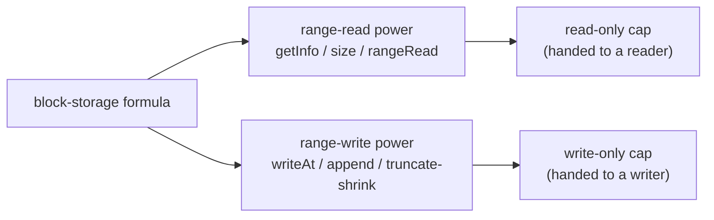

# Daemon Mutable Blob (Block Storage)

| | |
|---|---|
| **Created** | 2026-09-12 |
| **Author** | kriscendobot (prompted) |
| **Status** | Proposed |
| **Source** | Review comment on PR [#1125](https://github.com/endojs/endo-but-for-bots/pull/1125), `packages/daemon/src/formula-type.js` line 37 |

## What is the Problem Being Solved?

The daemon has a `readable-blob` formula type: an immutable, content-addressed
byte sequence whose identity **is** its SHA-256 hash. Its read surface
(`streamBase64` / `text` / `json` plus the range-I/O `getInfo` / `fetch`) is
defined by `ReadableBlobRangeInterface` in
[`packages/platform/src/fs/interfaces.js`](../packages/platform/src/fs/interfaces.js)
and realized by `makeReadableBlob` in
[`packages/daemon/src/manager.js`](../packages/daemon/src/manager.js).

There is no standalone **mutable** counterpart. Today the only live, writable
bytes in the daemon are `EndoMountFile` (`makeMountFileExo` in
[`packages/daemon/src/mount.js`](../packages/daemon/src/mount.js)), which exists
only *inside a mount* (a host-directory tree confined under a root) and whose
write surface is whole-value (`writeText`, `writeBytes`, `append`) with no
ranged write. There is a ranged **read** power (`filePowers.readFileRange`) but
no ranged **write** power. So a holder cannot be handed a first-class mutable
byte store, cannot overwrite a window in place, and cannot be given read
authority and write authority as separately delegable capabilities (why that
separation is worth having, rather than a single read+write face, is argued in
the "Two independent authorities" section below).

This design adds that mutable counterpart as its own formula type, threads
**separate least-authority powers for ranged reads and ranged writes**, and
constrains the write power so it can overwrite within the current extent or
append at the end but cannot splice or extend from the middle. It reserves room
for a later splice-capable variant backed by content-defined blocks from CASK.

CASK is a content-addressed-storage successor system specified outside this
repository; it is not yet present here. The `cask-*` names referenced below
(`cask-entry-type-capability`, `cask-blob-cat`, `rabin-chunking`,
`cask-named-typed-pointer`) are forward references to that design line, not
links resolvable in this repo today. They are named here only to justify
reserving the `blob`/`file` names for the future splice-capable variant.

## Name

The capability is a standalone, daemon-persisted, mutable byte sequence with a
**stable formula identity** (not a content hash), ranged reads, and constrained
ranged writes. Three names were offered.

| Candidate | Verdict | Reason |
|---|---|---|
| `blob` | Reject | In this codebase "blob" means content-addressed bytes whose identity *is* the hash (`readable-blob`, `snapshot-blob`, `cask/blob`). A thing that mutates in place cannot keep a content-hash identity, so `blob` fights the established meaning. The honest "mutable blob" is a compare-and-swap *cell* that swaps among immutable content-addressed blobs (the CASK-backed splice-capable future variant, not this one). Reserve `blob` for that. |
| `file` | Reserve | Matches `EndoMountFile` / `FileInterface` and is POSIX-familiar, but that name already denotes a mount-scoped entry, and "file" invites the expectation of arbitrary in-place mutation (insert/delete splice, truncate-anywhere) that this capability deliberately forbids. Reserve `file` for the future splice-capable, CASK-backed variant. |
| `block-storage` | **Recommend** | Names the constrained medium honestly: a fixed-address byte store read and written by range, growing only by append, with no splice (exactly the semantics below). It leaves `file` and `blob` free for the splice-capable successor. |

**Recommendation: `block-storage`.** The final pick is a maintainer decision
(see Open Questions). Formula type `block-storage`; the mutable exo is
`EndoBlockStorage`; the branch/PR slug is `daemon-mutable-block-storage`.

## Design

### Two independent authorities

The load-bearing observation: on **in-place** block storage a ranged read and a
ranged write are *independent* authorities. An overwrite or an append does not
need to read the current bytes, so a genuine **write-only** power is honest
here. This diverges deliberately from CASK's cell capability lattice, where
`write implies read` because a cell mutation is compare-and-swap and needs the
current value (see the forward reference `cask-entry-type-capability`). Because
the two authorities are independent, they split cleanly into two separately
delegable powers:



A holder can be given the read-only cap, the write-only cap, or both. The
read-only cap is precisely the live-blob read face of
[readableblob-range-attenuation.md](readableblob-range-attenuation.md); this
design is its mutable, write-bearing sibling.

**The write-only cap is content-opaque but not size-opaque.** "Independent" is a
claim about *content* authority: an overwrite or append never reveals the
current bytes. It is not a claim about *size*. Because the admission rule (below)
branches on the store's current `size`, a holder of only the write-only cap can
probe offsets and read success-versus-rejection to binary-search the current
size, a state observation that does not require the read-only cap. This is an
intentional, coarse size leak, not a content leak; the two-authority split stays
honest for bytes. A caller that needs the store's size to be opaque even to a
writer cannot be handed the write-only cap, and would need a constant-response
admission variant (noted in Open Questions). The read power's `getInfo().size`
remains the sanctioned, non-probing way to observe size.

### Range-read power (least authority: read only)

Mirrors the existing `rangeReadMethodGuards`:

```ts
getInfo(): Promise<{ algorithm: 'sha256', digest: string, size: bigint }>
size(): Promise<bigint>                                      // cheap, no hash
rangeRead(offset: bigint, length: bigint): Promise<Uint8Array>  // clamps at EOF
```

`rangeRead` reuses the established spelling from
[platform-range-and-tree-reads.md](platform-range-and-tree-reads.md)
(`rangeRead(offset, length) -> Uint8Array`, the ergonomic plain-byte-array form
alongside the streaming `fetch`), rather than inventing a third verb; unlike
`readable-blob` it reads the *current* bytes on each call.

**`getInfo().digest` is a per-call snapshot, not an identity.** On the
content-addressed `readable-blob`, `getInfo()` returns `{ algorithm, hash, size }`
where `hash` *is* the stable, cacheable identity. Here the value mutates, so the
accessor deliberately spells the field `digest` (not `hash`) and the field is
**recomputed over the current bytes on every call** (O(n) in the current size).
Renaming the field keeps a generic caller from treating `getInfo().hash` as a
stable identity the way it safely can on every immutable sibling; a caller that
needs a stable content identity must take a `snapshot`/`readable-blob` of the
current bytes. Because `getInfo()` pays a full hash, it is **not** the call to
make before every write: a caller that needs only the current length uses the
cheap `size()` accessor (which the write-admission path already reads via
`statPath`, so sequential appends stay O(n) total, not O(n^2)). No `stat`
(mtime/mode/inode leak host detail, per the existing `rangeReadMethodGuards`
note).

### Range-write power (least authority: write only, no splice)

```ts
writeAt(offset: bigint, bytes: Uint8Array): Promise<void>
append(bytes: Uint8Array): Promise<void>       // sugar for writeAt(size, bytes)
truncate(newSize: bigint): Promise<void>       // shrink only: newSize <= size
```

`writeAt(offset, bytes)` is admitted **iff** one of:

- **Bounded overwrite:** `offset + bytes.length <= size` replaces bytes in
  place, no length change, no shift.
- **Append at the end:** `offset === size` grows the store from its exact
  current end.

All other writes reject with a descriptive `Error` (the daemon's exo convention,
following `mount.js`/`manager.js`; this is not a thrown POSIX errno string, which
appears in this codebase only in comments describing underlying OS behavior):

- `offset > size` is a hole/gap past the end (extend into never-written space).
- `offset < size && offset + bytes.length > size` is a **middle-anchored
  extension**: a write that begins inside the extent and crosses the end. The
  caller must split it into an in-place overwrite of `[offset, size)` followed
  by an `append` of the remainder. This is the "extend the file in the middle"
  the write power forbids.

There is **no** primitive for a true splice (inserting bytes that shift the
tail, or deleting bytes from the middle) on this capability. `truncate` shrinks
only; growing by truncate would create a hole and is rejected.

**Concurrent writers are serialized by the exo.** The admission rule is a
read-then-write check (read `size` via `statPath`, then `writeFileRange`) with
an `await` between the two steps, and the write-only cap is separately delegable,
so two holders (or one holder issuing two calls) could otherwise interleave:
two appenders both observing the same `size`, both targeting `offset === size`,
one silently clobbering the other (a lost update), and the caller-side two-step
workaround for a middle-anchored extension could land its `append` at a
`size` another writer moved underneath it. The invariant is therefore not merely
*checked* but *maintained*: the `EndoBlockStorage` write exo **serializes writes
per store** (a single-store write queue, so each `writeAt`/`append`/`truncate`
runs its size-read and its write atomically with respect to other writes on the
same store). `EndoMountFile`'s `append` gets this for free from an OS-level
atomic append; because this design builds on a raw `pwrite`-style
`writeFileRange`, the serialization is the exo's responsibility and is stated
here rather than assumed.

### Daemon plumbing

Introduce a ranged-write FilePowers primitive `writeFileRange(path, offset,
bytes)` (the sibling of the existing `readFileRange`) in the node powers
(`packages/daemon/src/manager-node-powers.js`) and the Rust/XS powers
(`packages/daemon/src/bus-manager-rust-xs-powers.js`). The daemon threads two
narrow power records into the `block-storage` formula, never the whole
`filePowers`:

- read power: `{ readFileRange, sha256, statPath }` (size only),
- write power: `{ statPath, writeFileRange, truncateFile }`.

The `EndoBlockStorage` write exo reads the current size via `statPath` and
enforces the overwrite-or-append admission rule **above** the raw
`writeFileRange` primitive (the raw primitive can seek anywhere; the exo is the
confinement point). Register `block-storage` in
`packages/daemon/src/formula-type.js` and its record shape in
`packages/daemon/src/formula-record.js`, alongside `formulateBlockStorage` and
`makeBlockStorage` in `manager.js` paralleling `formulateReadableBlob` /
`makeReadableBlob`. Host/guest/directory expose a maker method
`storeBlockStorage(...)`, the entry-point verb a user actually calls, paralleling
the existing `storeBlob(readerRef, petName?)` that mints a `readableBlobId`.

### Cancellation

If the formula holds a resource whose lifetime the maker should be able to end,
thread a `cancelled` `Promise<never>` argument rather than an imperative
`cancel()` method, matching the daemon's standard cancellation shape.

## Room for a splice-capable CASK-backed variant

The no-splice rule is a property of *in-place* block storage, not a permanent
limit on mutable bytes. A future variant (call it `file`, or `cask-file`) can
support graceful mid-range splice by backing the bytes with a CASK
content-defined-chunked blob. Such a variant is additive: it adds a
`spliceAt(offset, deleteCount, bytes)` primitive (insert/delete with tail
shift) that `block-storage` deliberately omits. Naming `block-storage` now
keeps that successor's name (`file`) free.

### The mechanism CASK uses for content-delimited blocks

CASK's `cask/blob` package (a content-addressed tree, "CAT", which is a
content-defined-chunked (CDC) Merkle tree; see the forward references
`cask-blob-cat` and `rabin-chunking`) delimits blocks by **content**, not
by fixed byte offset:

- **Leaf chunking by a rolling hash.** A Rabin/buzhash-style rolling hash runs
  over a sliding window of the byte stream. A block boundary is cut when the
  current chunk is at least `MinChunk` **and** `(hash & (AvgChunk - 1)) === 0`,
  or unconditionally at `MaxChunk`. The boundary follows the content under the
  window, so the same bytes always chunk the same way regardless of position.
- **No reset at a boundary.** The rolling-hash state is **not** reset when a
  boundary is cut. This is the property that makes splice cheap: a local edit
  perturbs the chunk boundaries only near the edit and then **re-locks** to the
  original boundaries after a short distance. A content-addressed store
  therefore re-hashes O(log n) blocks near the edit rather than every block
  after the edit point.
- **The same trick at internal levels.** To stop one changed leaf from
  reshuffling every parent grouping, the identical CDC is applied at internal
  tree nodes, feeding the rolling hash the concatenated child entries
  (`hash || size`), honoring a boundary only after a whole entry and once
  `MinLinks` is met, with `MaxLinks` always enforced. The result is a stable
  "anchor tree" where a change stays local at every level.
- **Random access.** Each internal node carries a compact per-child subtree
  size table, so a byte-offset read is O(tree height): descend the size tables,
  subtracting preceding sizes, and read `dataLen` at the leaf. The tree holds
  no global metadata; the caller keeps the root hash and total size.

Because a splice re-hashes only the blocks near the edit and re-locks, each
post-splice state is a cheaply-derived new immutable content-addressed blob.
The splice-capable mutable capability is then most honestly a **cell** (a
compare-and-swap named typed pointer, the forward reference
`cask-named-typed-pointer`) that swaps among these immutable CDC blobs. That
cell structure is exactly why the mutable *blob* name belongs to that
CASK-backed successor, and why `block-storage` (in-place, no splice) is the
right name for the capability specified here.

## Dependencies

| Design | Relationship |
|---|---|
| [readableblob-range-attenuation.md](readableblob-range-attenuation.md) | Defines the attenuatable ranged-read cap; this design's read power is its mutable sibling. The read-surface spelling is reconciled with it and with [platform-range-and-tree-reads.md](platform-range-and-tree-reads.md): this design uses `rangeRead` (the established plain-byte-array form), not a fresh `readAt`. |
| [fs-interface-consolidation.md](fs-interface-consolidation.md) | Owns the shared `M.interface` guard records the new write guard should join. |

A sibling job posted from the same review (PR
[#1125](https://github.com/endojs/endo-but-for-bots/pull/1125) comment
3996792043) will flesh out the full classification matrix crossing the
read-mutability axis (readable / snapshot / mutable) against the shape axis
(blob / file / tree / directory). This design should slot into that matrix as
the mutable-blob (block-storage) cell; the naming pick here should be reconciled
with it before implementation.

## Open Questions

- Which name: `block-storage` (recommended), `file`, or `blob`? The
  recommendation reserves `file`/`blob` for a later splice-capable CASK-backed
  variant; a maintainer who prefers the POSIX noun now may pick `file` and
  treat "no splice yet" as a temporary backend limit rather than a permanent
  capability boundary.
- Is a write-only cap (no read authority) worth surfacing as a distinct
  delegable capability, or should the daemon only ever mint read-only and
  read+write faces? The independence argument says write-only is honest here;
  the question is whether it earns its keep.
- Should `truncate` (shrink only) live on the write power, or be a separate
  power? It removes tail blocks without splicing, so it is not a splice, but it
  is a different destructive authority than overwrite/append.
- Should the read face observe writes atomically? Like the live `EndoMountFile`
  face, a concurrent writer can yield a digest and size from adjacent instants; a
  caller needing a stable identity uses the snapshot/`readable-blob` path.
- Is the per-store write serialization (above) the right granularity, or should
  the exo expose an explicit compare-the-size token so a caller can detect a
  racing writer rather than silently queue behind it? The design currently
  chooses silent serialization (no lost update, no surfaced conflict).
- The write-only cap leaks the store size via admission probing (see the "Two
  independent authorities" section). Is a size-opaque write authority worth offering as a
  separate constant-response admission variant, or is the coarse size leak
  acceptable for every intended use?
- The admission boundaries (`offset+len<=size`, `offset===size`, `offset>size`
  reject, `offset<size && offset+len>size` reject, shrink-only `truncate`) and
  the per-store write serialization are the new semantics and should carry an
  explicit test catalog authored before implementation starts, even though
  sibling designs skip a Test Plan section at Proposed stage.

## Prompt

> Please dispatch a job to propose `blob` or `file` or `block-storage` as the
> mutable variant of `readable-blob` and thread separate filesystem powers for
> range reads and writes to block storage. A ranged write should not be able to
> extend the file in the middle but may append. We may later want to create a
> version that does withstand mid-range splicing if we introduce a CASK storage
> system that can handle splices gracefully. Remind me the mechanism that CASK
> uses for content-delimited blocks.

Source: trusted maintainer review comment on PR
[#1125](https://github.com/endojs/endo-but-for-bots/pull/1125),
`packages/daemon/src/formula-type.js` line 37.
