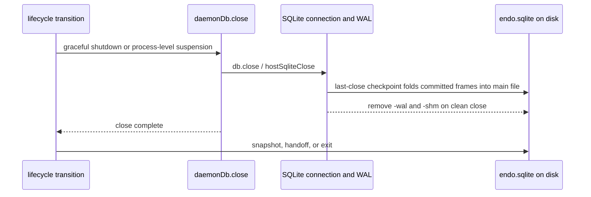

# SQLite Close at Shutdown, Cross-Platform

| | |
|---|---|
| **Created** | 2026-08-06 |
| **Updated** | 2026-08-06 |
| **Author** | Kris Kowal (prompted) |
| **Status** | Not Started |
| **Builds on** | designs/daemon-endo-rust-sqlite.md |
| **Related** | designs/daemon-endor-pet-store-sqlite.md (PR #124) |

## Motivation

The pet-store SQLite parity design left one open question unanswered:
*"WAL checkpointing on shutdown?"*
Its draft answer was that `journal_mode = WAL` plus a clean `db.close()` is
sufficient, while aggressive checkpointing is a separate performance question.
The maintainer asked for a cross-platform design and chose the full SQLite close
as the mechanism.

That answer becomes a dependable contract only when the daemon makes close part
of its lifecycle rather than merely relying on process exit:

1. **The daemon must fully close before suspension.** SQLite checkpoints the WAL
   when the last database connection closes cleanly and then normally deletes the
   `-wal` and `-shm` sidecars. The daemon must own exactly one connection, expose
   its close operation, and complete that operation before suspending or handing
   off its state directory.
2. **File-level backup otherwise captures a stale database.** A copy of
   `endo.sqlite` taken while a WAL exists may omit committed writes. A
   single-file copy is correct after the full close has folded the WAL into the
   main file.
3. **Cross-platform handoff should not depend on WAL replay.** The Rust and Node
   daemons must read each other's writes against the same database. Closing
   before a normal handoff makes the common path a single self-contained file
   instead of coupling two independently bundled SQLite versions through live
   sidecars.

The goal is one uniform full-close contract that both platforms honor before
graceful shutdown, process-level state-directory suspension, or handoff. Abrupt
termination remains a recovery-on-open case because a killed process cannot
close anything.

## Supported platforms

| Platform | Backend | Where the connection lives | Full close |
|---|---|---|---|
| Node | `better-sqlite3` (`^11`, bundles SQLite) | Node process | `db.close()` finalizes statements and closes the connection |
| Rust + XS | `rusqlite` 0.31 `bundled` (bundles SQLite) | Rust supervisor `DB_MAP`, one `Connection` per handle | `hostSqliteClose` removes and drops the `Connection` |

Both open with `PRAGMA journal_mode=WAL; PRAGMA foreign_keys=ON`.
The daemon owns one connection on one thread on either platform.
Neither backend enables `SQLITE_FCNTL_PERSIST_WAL`.

## What a full close guarantees

A WAL-mode database consists of `endo.sqlite`, `endo.sqlite-wal`, and the
coordination file `endo.sqlite-shm`.
Committed transactions remain in the WAL until SQLite checkpoints their frames
into the main file.
When the last connection closes cleanly, SQLite performs that checkpoint and
normally removes both sidecars.

The daemon maintains these invariants:

- It owns exactly one connection to its database.
- Neither backend opts into persistent WAL sidecars.
- A process-level state-directory suspension, snapshot, or handoff does not begin
  until `close()` has returned.
- Resume opens a fresh connection before serving another database request.

After the close, `endo.sqlite` is a complete standalone database that can be
copied as a single file and reopened on either platform.

## Design

### Expose one idempotent `close()` method

Expose `close()` on the `DaemonDatabase` returned by
`makeDaemonDatabase` in `manager-database.js`.
It delegates to the backend close and is idempotent so cancellation and
suspension can safely converge on the same lifecycle operation:

```js
let closed = false;
const close = () => {
  if (closed) {
    return;
  }
  db.close();
  closed = true;
};
```

The process-level suspension path calls this exposed method and waits for it to
return before snapshotting or releasing the state directory.
Worker heap suspension is distinct: it neither snapshots the daemon state
directory nor closes the process-wide database shared by other workers.

The backend behavior is symmetric:

- **Node (`better-sqlite3`).** `db.close()` closes the connection and finalizes
  the backend's prepared statements. Since this is the daemon's only connection,
  it is SQLite's last close.
- **Rust + XS (`better-sqlite3-xs.js` over host bindings).**
  `XsDatabase.close()` calls `hostSqliteClose`, which removes the one
  `rusqlite::Connection` from `DB_MAP` and drops it. No checkpoint pragma or new
  Rust host function is needed.

The Rust shim re-prepares statements per call from cached SQL text, so it holds
no long-lived `rusqlite::Statement` values that could keep the connection busy
at close.

### Graceful shutdown and suspension ordering

The daemon's normal shutdown is cancellation:
`cancelled.catch(() => daemonDb.close())` in `manager-go-powers.js` and
`manager-node-powers.js`.
The process-level suspension path uses the same exposed close method before its
snapshot or handoff callback.
Both backends close synchronously, so the lifecycle transition cannot advance
past the call before SQLite has released the connection.



### Abrupt termination

A `SIGKILL`, power loss, or process crash runs no JavaScript, so no close occurs
and the `-wal` and `-shm` sidecars remain.
This is the situation WAL recovery exists for:

- **Same-platform reopen** replays the WAL automatically on the next open.
- **Cross-platform reopen** must also replay the WAL. This is tested rather than
  assumed because it couples the two bundled SQLite versions.
- **File-level snapshot after a crash** must capture all three files. A copy of
  `endo.sqlite` alone may be stale.

The common suspension and shutdown paths avoid this case by completing a full
close. The crash path preserves all sidecars and recovers on the next open.

### WAL tuning

Set `PRAGMA wal_autocheckpoint = 1000` on both platforms alongside the existing
`journal_mode` and `foreign_keys` pragmas.
This states the shared incremental-checkpoint threshold rather than inheriting a
per-build default.

Leave `PRAGMA journal_size_limit` at SQLite's default until a planned follow-up
measures representative daemon write bursts and the WAL high-water mark.
The follow-up will recommend a concrete limit only if the measurements show a
useful disk bound without excessive mid-run truncation or write latency.

## Test plan

Extend the existing cross-supervisor parity suite rather than adding a parallel
harness:

1. **Self-contained file after graceful close.** Write pet-store entries, call
   `close()`, assert `endo.sqlite-wal` is absent or zero bytes, remove any
   sidecars, reopen `endo.sqlite`, and assert every entry reads back. Run once
   per platform.
2. **Cross-platform single-file handoff.** Platform A writes and closes; copy
   only `endo.sqlite` to a fresh directory; platform B opens the copy and reads
   A's writes. Run both directions.
3. **Crash recovery, same platform.** Write, then terminate the daemon with
   `SIGKILL`; assert the WAL survives non-empty; reopen on the same platform and
   assert all writes recover.
4. **Crash recovery, cross platform.** Platform A writes and is killed with a
   live WAL; platform B opens the same directory with all three files and reads
   A's writes. Run both directions.
5. **Close before state-directory suspension.** Instrument the exposed close
   seam, initiate process-level suspension, and assert the close returns before
   the snapshot or handoff callback begins. Resume must open a fresh connection
   before another database request.

Tests 3 and 4 need a process-kill helper.
The parity suite already drives full daemon processes, so it is the appropriate
home.

## Files to create or modify

- `packages/daemon/src/manager-database.js`: expose an idempotent `close()` on
  `DaemonDatabase` that delegates to the backend close.
- `packages/daemon/src/manager-go-powers.js` and
  `packages/daemon/src/manager-node-powers.js`: use the exposed close on graceful
  shutdown and before any process-level state-directory suspension or handoff.
- `packages/daemon/src/bus-manager-rust-xs.js`: close `daemonDb` on cancellation
  and before any process-level state-directory suspension or handoff.
- `packages/daemon/src/better-sqlite3-xs.js`: keep `XsDatabase.close()` mapped to
  `hostSqliteClose`. PR #124 renames this file to `rust-xs-sqlite.js`; track the
  current name at implementation time.
- `rust/endo/xsnap/src/powers/sqlite.rs`: no change required;
  `host_sqlite_close` already drops the `rusqlite::Connection`.
- `packages/daemon/test/sqlite-parity.test.js`: add the five cases above.

## Dependencies

| Design | Relationship |
|---|---|
| designs/daemon-endo-rust-sqlite.md | Parent. Defines the host-function surface and the WAL-mode-by-default decision this builds into a lifecycle contract. |
| designs/daemon-endor-pet-store-sqlite.md (PR #124) | Raises the open question this design answers; its database surface exposes `close()`. |
| designs/daemon-xs-worker-snapshot.md | Adjacent. Worker heap suspension does not snapshot the process-wide SQLite database. A distinct process-level state-directory suspension must fully close the database first. |

## Design decisions

1. **Rely on a full SQLite close.** Do not issue an explicit checkpoint pragma.
   The daemon completes its backend close before graceful shutdown,
   state-directory suspension, or handoff.
2. **Expose an idempotent `close()` method.** Cancellation and process-level
   suspension share one lifecycle seam, and resume opens a fresh connection.
3. **Keep worker suspension distinct.** Suspending an XS worker heap does not
   snapshot the process-wide daemon state directory and must not close a
   database shared by other workers.
4. **Measure before setting `journal_size_limit`.** Keep SQLite's default until
   the planned write-burst and WAL-size follow-up produces evidence for a
   concrete value.
5. **Answer abrupt termination with recovery-on-open.** A killed process cannot
   close; the next open on either platform recovers the WAL, and a crash-time
   snapshot carries all three files.

## Planned follow-up

Measure representative daemon write bursts and the WAL high-water mark under
the default autocheckpoint policy.
Compare candidate `journal_size_limit` values by peak disk usage, checkpoint
frequency, and write latency, then either select an evidence-backed limit or
record that SQLite's default remains preferable.

## Prompt

> Please post a job to design checkpointing at shutdown across all
> supported platforms.
>
> (kriskowal, PR #124 review comment on
> `designs/daemon-endor-pet-store-sqlite.md` line ~325, answering that file's
> *"WAL checkpointing on shutdown?"* open question, which had concluded that
> `journal_mode = WAL` plus a clean `db.close()` was sufficient.)
