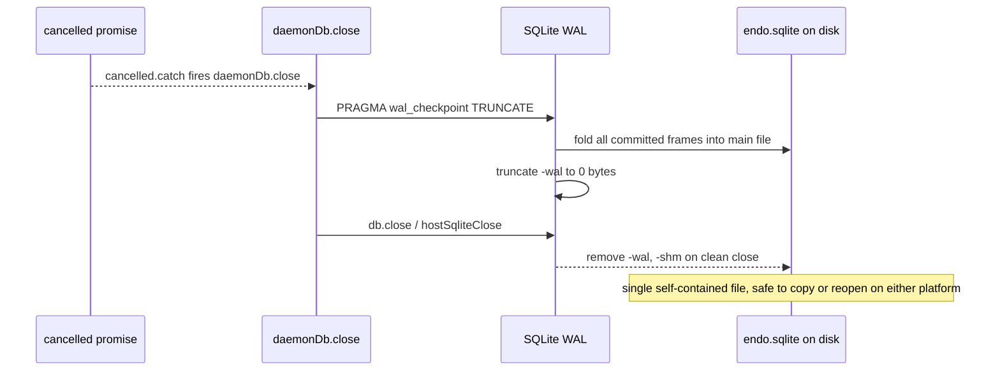

# SQLite WAL Checkpointing at Shutdown, Cross-Platform

| | |
|---|---|
| **Created** | 2026-08-06 |
| **Author** | Kris Kowal (prompted) |
| **Status** | Not Started |
| **Builds on** | designs/daemon-endo-rust-sqlite.md |
| **Related** | designs/daemon-endor-pet-store-sqlite.md (PR #124) |

## Motivation

The pet-store SQLite parity design left one open question unanswered:
*"WAL checkpointing on shutdown?"* Its draft answer was that
`journal_mode = WAL` plus a clean `db.close()` is sufficient, and
that aggressive checkpointing is a separate out-of-scope perf
question. On review (PR #124, comment on
`designs/daemon-endor-pet-store-sqlite.md` line ~325) the maintainer
asked for a design of checkpointing at shutdown *across all supported
platforms*, not just the current single-platform assumption.

The assumption is incomplete for three reasons that only surface once
the daemon runs on more than one platform, and once its state is
snapshotted or handed off:

1. **"Clean `db.close()` is sufficient" is true only incidentally.**
   SQLite auto-checkpoints the WAL when the *last* database connection
   closes cleanly, and then deletes the `-wal` and `-shm` sidecars.
   That is the mechanism the draft relies on. It is not a guarantee
   the daemon states or controls: it is skipped on abrupt termination,
   it does nothing if a stray second connection is open, and it is
   disabled outright if `SQLITE_FCNTL_PERSIST_WAL` is ever set. The
   daemon leans on a default rather than on an operation it performs.

2. **File-level backup captures a stale database.** The pet-store and
   parent designs both state that daemon backup is *at the file level*,
   not the SQL level. A file-level copy of `endo.sqlite` taken while a
   WAL exists captures a database missing every un-checkpointed write.
   A single-file copy is only correct if the WAL has been folded back
   into the main file first. Checkpoint-on-shutdown is what makes the
   single-file snapshot correct by construction.

3. **Cross-platform handoff replays one platform's WAL under another.**
   The maintainer's companion directive on the same PR is that the Rust
   and Node daemons must read each other's writes: rust hands off to
   node, node hands off to rust, against the same database. If platform
   A exits with writes still in the WAL, platform B must replay A's WAL
   on open. That couples two independently-bundled SQLite builds
   (better-sqlite3 bundles its own SQLite; rusqlite `bundled` bundles
   another) through the on-disk WAL format, and it only works if all
   three files travel together. A checkpoint at shutdown collapses the
   handoff to a single self-contained file and removes the coupling
   from the common path.

The goal of this design is to replace the incidental, per-platform
default with one explicit, uniform checkpoint-at-shutdown contract that
both supported platforms honor identically, and to pin down the crash
path the contract cannot cover.

## Supported platforms

| Platform | Backend | Where the connection lives | `close()` today |
|---|---|---|---|
| Node | `better-sqlite3` (`^11`, bundles SQLite) | Node process | `db.close()` (`XsDatabase`-shaped API via `makeDaemonDatabase`) |
| Rust + XS | `rusqlite` 0.31 `bundled` (bundles SQLite) | Rust supervisor `DB_MAP`, one `Connection` per handle | `hostSqliteClose` drops the `Connection` |

Both open with `PRAGMA journal_mode=WAL; PRAGMA foreign_keys=ON`
(`manager-database.js` on the Node side, `host_sqlite_open` in
`rust/endo/xsnap/src/powers/sqlite.rs` on the Rust side). Both run a
single connection on a single thread, so no concurrent reader can ever
block a checkpoint. A future `node:sqlite` (`DatabaseSync`) backend
would satisfy the same `Database` contract and inherit this design
unchanged.

## What checkpointing at shutdown means

A WAL-mode database is the pair (`endo.sqlite`, `endo.sqlite-wal`) plus
the coordination file `endo.sqlite-shm`. Committed transactions live in
the WAL until a *checkpoint* copies their frames back into the main
file. `PRAGMA wal_checkpoint(<mode>)` runs a checkpoint on demand in
one of four modes:

| Mode | Effect | Fit for shutdown |
|---|---|---|
| `PASSIVE` | Checkpoint as many frames as possible without blocking; leave the WAL file in place. This is the auto-checkpoint mode. | No: leaves a non-empty `-wal`; main file not self-contained. |
| `FULL` | Block until all frames are checkpointed; leave the WAL file in place (its content is now dead but the file persists). | No: main file is current but `-wal` still shadows it on disk. |
| `RESTART` | `FULL` plus reset the WAL so the next writer starts at its beginning; file persists at its current size. | Close, but the file lingers. |
| `TRUNCATE` | `RESTART` plus truncate the `-wal` file to zero bytes. | **Yes.** Main file holds every committed write; `-wal` is empty. |

At shutdown the daemon has exactly one connection and no concurrent
readers, so `TRUNCATE` always completes fully (it cannot return the
partial-checkpoint busy result that a blocked reader would cause). The
result is a `endo.sqlite` that is a complete, standalone database: safe
to copy as a single file, and safe to reopen on either platform without
the sidecars.

## Design

### One contract: `checkpoint()` on the Database, folded into `close()`

Add a `checkpoint(mode = 'TRUNCATE')` method to the `Database`
contract that both backends implement, and call it from the shared
`close()` in `makeDaemonDatabase` (`manager-database.js`) *before*
delegating to the backend close:

```js
const checkpoint = (mode = 'TRUNCATE') => {
  db.pragma(`wal_checkpoint(${mode})`);
};

const close = () => {
  // Fold the WAL back into the main file so the on-disk database is
  // self-contained: a single-file copy is complete, and either
  // platform can reopen it without the -wal/-shm sidecars.
  checkpoint('TRUNCATE');
  db.close();
};
```

`checkpoint()` is exposed on the returned facet as well as used
internally, so a caller that snapshots the state directory (file-level
backup, the suspend/resume path) can force a self-contained main file
without closing the connection.

The change is symmetric across the two backends because both already
route `PRAGMA` text through the same seam:

- **Node (`better-sqlite3`).** `db.pragma('wal_checkpoint(TRUNCATE)')`
  is a first-class better-sqlite3 call. No native change. `db.close()`
  already finalizes better-sqlite3's own prepared statements, so the
  explicit checkpoint runs against a quiescent connection.

- **Rust + XS (`better-sqlite3-xs.js` shim over the host bindings).**
  The `XsDatabase.pragma(stmt)` shim already maps to
  `exec('PRAGMA ' + stmt + ';')`, which reaches `host_sqlite_exec` ->
  `Connection::execute_batch`. So `pragma('wal_checkpoint(TRUNCATE)')`
  needs **no new Rust host function**: it rides the existing `exec`
  path. Add the `checkpoint()`/`close()` wrapping in the shim (or, if
  the shared `makeDaemonDatabase` owns `close`, only `checkpoint` on
  the `Database` needs the shim change) so the XS `close()` path emits
  the checkpoint before `hostSqliteClose`.

The Rust side has a favorable property here: statements are
re-prepared per call from cached SQL text (`PreparedStmt` holds only
`db_handle` and `sql`), so there are **no long-lived `rusqlite`
`Statement` handles** to leave the connection in a zombie
(`SQLITE_BUSY`) state at `sqlite3_close`. The explicit checkpoint does
not depend on that, but it means the Rust `close` is always a clean
close.

### Why explicit, not the implicit last-connection checkpoint

Making the checkpoint an operation the daemon performs, rather than a
default it inherits, buys three things the draft answer did not have:

- It runs on *every* graceful shutdown regardless of connection-count
  accounting or `PERSIST_WAL` state, because it is issued directly.
- It is the same operation, in the same place, on both platforms, so
  the cross-platform behavior is specified rather than emergent from
  two independent SQLite builds' close paths.
- `TRUNCATE` leaves a zero-length `-wal`, so a single-file snapshot is
  provably complete. `PASSIVE` (the implicit mode) does not.

### Graceful shutdown path (the covered case)

The daemon's normal shutdown is cancellation:
`cancelled.catch(() => daemonDb.close())` in `manager-go-powers.js`
(and `manager-node-powers.js`). Because the checkpoint lives inside
`close()`, both the cancellation path and any explicit close get it for
free. better-sqlite3 and the XS host bindings are both synchronous, so
the checkpoint completes before the process proceeds to exit; no
`await` is required and no partial-checkpoint window exists.



### Abrupt termination path (the uncovered case, and its contract)

A `SIGKILL`, power loss, or process crash runs no JavaScript, so no
checkpoint fires and the `-wal`/`-shm` sidecars remain. This is not
corruption: it is exactly the situation WAL recovery exists for. The
contract is:

- **Same-platform reopen** replays the WAL automatically on the next
  `new Database(path)` / `hostSqliteOpen(path)`. No writes are lost.
  This already works and needs only a regression test.
- **Cross-platform reopen** (rust-written WAL replayed by node, or the
  reverse) also works, because the WAL file format has been stable
  across SQLite versions since WAL shipped, and both platforms open in
  WAL mode. It must be *tested*, not assumed, because it silently
  couples two bundled SQLite builds.
- **File-level snapshot after a crash is only valid if all three files
  are captured together.** A snapshot of `endo.sqlite` alone, taken
  after an abrupt exit, is stale. The mitigation is the graceful-path
  checkpoint above (so the common snapshot path copies one complete
  file), plus a documented rule that any snapshot taken without a
  preceding `checkpoint()` must include `endo.sqlite-wal` and
  `endo.sqlite-shm`.

Recovery-on-open cannot be moved earlier than the next open, because a
killed process cannot run code. So the design's answer to abrupt
termination is not "prevent the WAL from surviving" but "guarantee the
next open on either platform recovers it, and keep the snapshot path
off the stale-single-file trap."

### Uniform WAL pragmas at open

To keep the two platforms' WAL behavior identical between shutdowns,
set the same WAL-tuning pragmas at open on both, alongside the existing
`journal_mode`/`foreign_keys`:

- `PRAGMA wal_autocheckpoint = 1000` (the default; stated explicitly so
  both platforms agree, and so the incremental-checkpoint threshold is
  a design constant rather than a per-build default).
- `PRAGMA journal_size_limit = <N>` so a burst does not leave an
  arbitrarily large `-wal` between the autocheckpoint threshold and the
  next shutdown checkpoint. `TRUNCATE` at shutdown zeroes it regardless;
  the limit bounds it during a run.

Neither platform sets `SQLITE_FCNTL_PERSIST_WAL`, and this design keeps
it that way: the sidecars should disappear on a clean close so a
snapshot cannot accidentally pick up an empty-but-present `-wal`.

## Test plan

Extend the existing cross-supervisor parity test
(`packages/daemon/test/sqlite-parity.test.js`, the rust-XS <-> Node
handoff suite) rather than adding a parallel harness:

1. **Self-contained file after graceful close.** Write pet-store
   entries, call `close()`, assert `endo.sqlite-wal` is either absent
   or zero bytes, then open `endo.sqlite` *with the sidecars removed*
   and assert every entry reads back. Run once per platform.
2. **Cross-platform single-file handoff.** Platform A writes and closes
   (checkpointed); copy only `endo.sqlite` to a fresh directory;
   platform B opens the copy and reads A's writes. Both directions.
3. **Crash recovery, same platform.** Write, then terminate the daemon
   process with `SIGKILL` (no `close()`); assert `endo.sqlite-wal`
   survives non-empty; reopen on the same platform and assert all
   writes recover.
4. **Crash recovery, cross platform.** Platform A writes and is
   `SIGKILL`ed with a live WAL; platform B opens the same directory
   (all three files present) and reads A's writes. This is the test
   that pins the two bundled SQLite builds' WAL compatibility. Both
   directions.

Tests 3 and 4 need a process-kill helper; the parity suite already
drives full daemon processes, so it is the right home.

## Files to create or modify

- `packages/daemon/src/manager-database.js`: add `checkpoint(mode)` to
  the `Database` facet; call `checkpoint('TRUNCATE')` in `close()`
  before `db.close()`; add the `wal_autocheckpoint` /
  `journal_size_limit` pragmas at open.
- `packages/daemon/src/better-sqlite3-xs.js`: ensure `pragma()` /
  `exec()` carry `wal_checkpoint(TRUNCATE)` (they already can via the
  existing `exec` path; the change is the wrapping, not a new host
  call). PR #124 renames this file to `rust-xs-sqlite.js`; track
  whichever name is current at implementation time, and cite the
  `XsDatabase` class rather than a line number.
- `rust/endo/xsnap/src/powers/sqlite.rs`: **no change required**;
  `wal_checkpoint(TRUNCATE)` runs through the existing
  `host_sqlite_exec` -> `execute_batch`. (Optional defense-in-depth:
  issue a `PRAGMA wal_checkpoint(TRUNCATE)` inside `host_sqlite_close`
  before dropping the `Connection`, so a Rust-side close that did not
  come through the shim's `close()` still checkpoints. Weigh against
  keeping the host functions thin.)
- `packages/daemon/test/sqlite-parity.test.js`: the four cases above.

## Dependencies

| Design | Relationship |
|---|---|
| designs/daemon-endo-rust-sqlite.md | Parent. Defines the host-function surface and the WAL-mode-by-default decision this builds the shutdown contract onto. |
| designs/daemon-endor-pet-store-sqlite.md (PR #124) | Raises the open question this design answers; its `close()` in the surface contract gains the checkpoint. |
| designs/daemon-xs-worker-snapshot.md | Adjacent: the daemon's SQLite state is host-side, not in an XS worker heap, so a worker snapshot does not capture it; the suspend/resume path that snapshots the *state directory* should call `checkpoint()` first (see open questions). |

## Design decisions

1. **`TRUNCATE`, not `PASSIVE`/`FULL`/`RESTART`, at shutdown.** Only
   `TRUNCATE` leaves a zero-length `-wal`, which is what makes a
   single-file snapshot and a sidecar-free reopen correct. The daemon's
   single-connection topology means `TRUNCATE` always fully completes.
2. **Checkpoint inside `close()`, one contract for both platforms.**
   The cross-platform behavior is then specified in one place rather
   than emerging from two independent SQLite builds' last-connection
   close paths.
3. **Explicit over the implicit last-connection auto-checkpoint.** The
   implicit checkpoint is a default the daemon does not control (skipped
   on `PERSIST_WAL`, on a stray second connection, on abrupt exit) and
   runs in `PASSIVE` mode, which does not zero the WAL.
4. **No new Rust host function.** `wal_checkpoint` is a pragma; the
   existing `exec` seam already carries it. Keeping the host-function
   count fixed matches the parent design's "9 functions, not more"
   decision.
5. **Abrupt termination is answered by recovery-on-open, not
   prevention.** A killed process cannot checkpoint; the design instead
   guarantees the next open on either platform recovers the WAL, and
   keeps the snapshot path off the stale-single-file trap.

## Open questions

- **Should the suspend/resume path call `checkpoint()` without
  closing?** If the daemon can snapshot its state directory while
  running (for a live backup or a warm suspend), it should force a
  self-contained main file first via the exposed `checkpoint()`. Does
  such a path exist today, or is snapshotting always preceded by a full
  `close()`? Resolving this decides whether `checkpoint()` needs to be
  public or can stay internal to `close()`.
- **Set a concrete `journal_size_limit`, or leave the WAL unbounded
  between checkpoints?** A bounded limit caps `-wal` growth during a
  long run at the cost of more mid-run truncations. The right value
  depends on the daemon's write burst profile, which is not yet
  measured. To be filed as a follow-up once there is a write-rate
  measurement; default to the SQLite default (no limit) until then.
- **Defense-in-depth checkpoint inside `host_sqlite_close`?** It closes
  the gap where a Rust-side close bypasses the shim's `close()`, at the
  cost of a host function that is no longer a thin passthrough. Which
  the maintainer prefers is a judgment call left open here.

## Prompt

> Please post a job to design checkpointing at shutdown across all
> supported platforms.
>
> (kriskowal, PR #124 review comment on
> `designs/daemon-endor-pet-store-sqlite.md` line ~325, answering that
> file's *"WAL checkpointing on shutdown?"* open question, which had
> concluded that `journal_mode = WAL` plus a clean `db.close()` was
> sufficient.)
