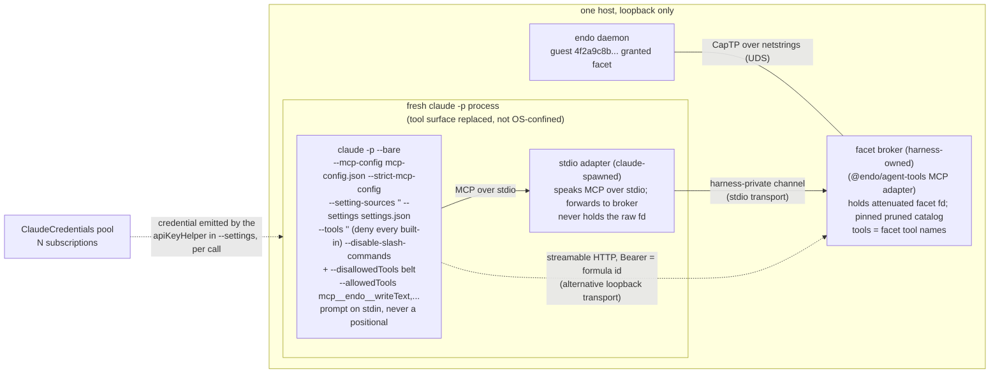
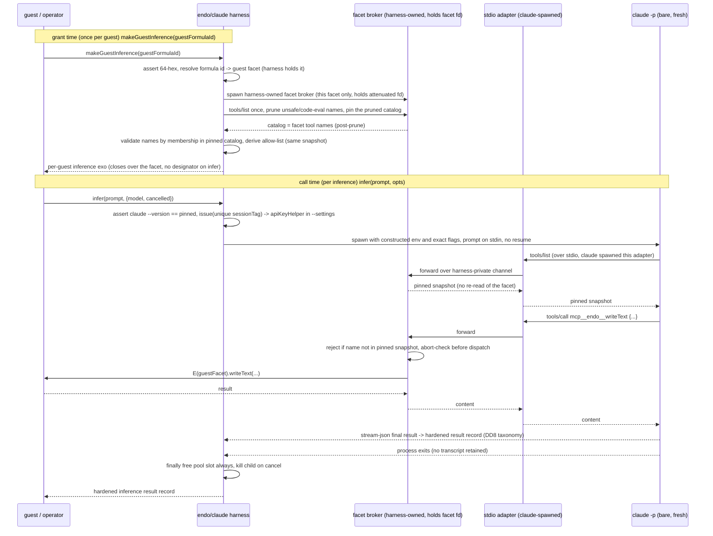

# `@endo/claude`: an unconfined Claude CLI caplet with one local MCP surface

| | |
|---|---|
| **Created** | 2026-08-16 |
| **Updated** | 2026-09-08 |
| **Author** | kriscendobot (prompted) |
| **Status** | In Progress |

## Status

**Orientation (this section stands on its own).** The originating § *Prompt* (the
document's last section, quoted verbatim there) asks for a
**hermetically-sandboxed** `claude -p`: a Claude invocation whose *only*
capability surface is the Endo tool-call surface, achieved through OS-level
isolation **and** a substituted tool surface together. It leaves the
implementation free to use either the `claude` command-line interface (**the CLI
path**) or the Claude Agent SDK. Read against that ask, this section reports where
the work stands; you do not need to jump ahead to § *Prompt* first.
This section does lean on four load-bearing terms it names before they are built
up, so each is glossed in one line here rather than by a forward pointer:
a **facet** is the attenuated capability surface a guest's host grants (one guest's
method set); the **harness** is the `@endo/claude` host code that spawns and
supervises the `claude -p` child; a **guest formula id** (the body's term; 64 lowercase
hex) names one guest; and **the one-guest MCP surface** is the stdio MCP server scoped
to a single guest (landed on `llm` in PR #1206) that projects that guest's facet as
MCP tools. § *Architecture* (and its § *Relationship to `@endo/claude-sandbox`*) builds
each out in full; this status report uses them as shorthand for the system those
sections describe.

The CLI path remains the default implementation path.
`@endo/claude` is an **unconfined host caplet** that launches a fresh
`claude -p --bare` process for each inference.
Its acceptance boundary is deliberately narrower than an operating-system
sandbox: the Claude process has no default Claude Code tool-call surface and can
call only the local MCP tools projected for one guest.
An `@endo/claude-sandbox` wrapper remains a compatible defense-in-depth layer, but
it is not a prerequisite for this caplet and this design does not claim that the CLI
flags confine filesystem or network access outside Claude's tool system.
This tool-surface-first boundary is a **proposed narrowing** of the § *Prompt*'s
"hermetically-sandboxed" ask, not a decided one: no dated maintainer decision in
this document downgrades the prompt's OS-isolation half, so OS confinement is
sequenced as an optional adapter for the first milestone while remaining required
to fully satisfy the prompt (*Design Decision 6*).
**The narrowing's rationale is architectural, not a backfill of PR #1015's sunk
scope.** It is reached independently: tool-surface substitution is the property
this caplet can itself deliver and prove with a single live test, whereas OS
isolation is a separable defense-in-depth adapter (`@endo/claude-sandbox`) that
belongs to a different package and boundary. PR #1015 having shipped 13 commits
with no OS-confinement wiring is a *consequence* of that same architectural view,
not its cause; the doc is not revising the design to match already-written code.
What remains open is only the maintainer's ratification of the narrowing itself
(DD6's open question), not the reasoning behind it.
**Vocabulary convention.** "**Unconfined**" describes the host **caplet**'s
OS posture (it applies no OS sandbox); "**confined**", "the confined process",
and "the confinement test" throughout refer to the spawned **child**'s
**tool-surface** confinement (its Claude tool surface is the one guest's MCP
catalog and nothing else). The two are different axes on different subjects, not
a contradiction.
Throughout, **`DDn`** is shorthand for **Design Decision n** in § *Design
Decisions*.

PR [#1015](https://github.com/endojs/endo-but-for-bots/pull/1015) is an open
draft at head `7cbdfb6e1f5b` (13 commits, 37 changed files).
Its last CI run, on 2026-08-29, reports 26 successful checks.
That is evidence for its dependency-injected JavaScript core, not for a live
Claude invocation: the PR contains no production `spawn`, no live CLI test, and
no composition with the local per-guest MCP bridge that has since landed on
`llm` in PR #1206.

### What PR #1015 actually builds

**This table is a per-commit conformance snapshot pinned to #1015 head
`7cbdfb6e1f5b`, not a design-level invariant. It is expected to go stale on the next
push to #1015 and is re-derivable from that PR's diff; it is kept here only until
#1015 rebases, after which it should move to the PR body or a review comment (a
design states what must be true of the system; per-commit conformance of one PR
belongs in that PR). The design-level residuals — the assumed-vs-observed evidence
split, the acceptance condition, and the interface contract — are the durable parts
and live in their own sections above and below.**

| File | Built at `7cbdfb6e1f5b` | Delta from this design |
| --- | --- | --- |
| `.changeset/add-endo-claude.md` | Declares the new private `@endo/claude` package. | Describes the whole process as hermetically confined although the PR supplies only injected seams. Revise before un-draft. |
| `.changeset/claude-sandbox-subscription-kind.md` | Declares the additive credential-kind change. | The kind exists, but no live evidence shows that its value is accepted by `apiKeyHelper` under `--bare`. |
| `packages/claude-sandbox/src/claude-credentials-factory.js` | Admits `subscription` when minting credentials. | Complete for the declared kind extension. |
| `packages/claude-sandbox/src/claude-credentials-module.js` | Admits `subscription` in the credential module. | Complete for the declared kind extension. |
| `packages/claude-sandbox/src/claude-client-module.js` | Explicitly refuses the settings-file-shaped kind on the environment-variable route. | Correct negative branch; it does not provide the positive `apiKeyHelper` route. |
| `packages/claude-sandbox/test/claude-credentials-factory.test.js` | Covers minting and materializing the new kind. | Pure caplet coverage only. |
| `packages/claude-sandbox/test/claude-client-module.test.js` | Covers refusal by the environment-variable client. | Pure refusal coverage only. |
| `packages/claude/package.json` | Adds the private package, one public entry, and an opt-in shim bin. | The bin duplicates a bridge that later landed in `claude-sandbox`; reconcile on rebase. |
| `packages/claude/LICENSE` | Adds the standard package license. | No functional delta. |
| `packages/claude/SECURITY.md` | Adds the standard security policy. | No functional delta. |
| `packages/claude/README.md` | Documents the intended confinement contract and admits the main gaps. | Calls the package hermetic and must be narrowed to tool-surface isolation. |
| `packages/claude/index.js` | Exports `make` and all internal construction helpers from the root entry. | § *Package shape* decides `make` is the sole public API, so the helper exports must be made internal on rebase; they are not intentionally public. |
| `packages/claude/claude.types.d.ts` | Re-exports the internal declarations. | Matches the package layout. |
| `packages/claude/src/claude.types.d.ts` | Declares the injected broker, file-preparer, launcher, pool, and result shapes. | Describes seams rather than implemented host effects. |
| `packages/claude/src/argv.js` | Builds argv with `--bare`, `--strict-mcp-config`, `--setting-sources ""`, `--tools ""`, `--disable-slash-commands`, explicit MCP allows, and no prompt positional; pins 2.1.232. | Joins every allow into one argument and has no `ARG_MAX` preflight, contrary to this design, which now specifies space-separated multi-token allow entries and an `ARG_MAX` preflight (§ *Argv length is an operational ceiling*). Its assertion accepts unrelated extra argv tokens, so only the builder's closed construction, not the exported assertion alone, establishes prompt omission. |
| `packages/claude/src/child-env.js` | Constructs a four-key environment and rejects known credential, proxy, and daemon variables. | The stopgap shim needs `ENDO_CLAUDE_SHIM_OPT_IN` and `ENDO_CLAUDE_BROKER_SOCK`, but neither can reach it through this environment or the generated MCP config. The shipped shim therefore cannot connect in the described path. |
| `packages/claude/src/credentials-pool.js` | Implements least-recently-used selection, cooling, reject-with-a-tag admission, and idempotent release. | Operator weights are not implemented. `release` always attempts `revoke`, while its unused `failed` option implies an unfinished success/failure distinction. |
| `packages/claude/src/formula-id.js` | Validates lowercase 64-hex guest formula identifiers. | Matches the design. |
| `packages/claude/src/mcp-config.js` | Renders one stdio or loopback HTTP server as JSON. | Does not create the file or connect it to the MCP server lifetime. The HTTP branch is outside the local-stdio acceptance condition. |
| `packages/claude/src/results.js` | Builds the nine hardened result variants and normalizes thrown values. | No live stream parser or launcher maps real Claude output and failures into them. |
| `packages/claude/src/tool-permissions.js` | Prunes names, pins a null-prototype catalog, derives literal `mcp__<server>__<tool>` names, and exposes a membership predicate. | No server in this PR calls `isDispatchable`; argument-level attenuation is also absent. The later `claude-sandbox` MCP bridge now provides the authoritative server boundary. |
| `packages/claude/src/shim.js` | Implements an opt-in newline-delimited JSON-RPC relay. | It forwards calls without enforcing the pinned catalog itself and is not runnable with the PR's generated environment/config. Prefer the one-guest MCP surface contract below (§ *Interface to the one-guest MCP surface*) over repairing a second bridge. |
| `packages/claude/src/harness.js` | Implements grant-time formula/catalog setup and a per-guest `infer` exo around injected effects. | `connectBroker`, `prepareSpawnFiles`, and `launch` have no production implementations; the acquired `issued` credential is never passed to the file preparer or materialized; `context` is ignored; child termination, bounds, per-call broker cancellation, server-side dispatch, broker cleanup, and real result parsing are delegated but not supplied. |
| `packages/claude/test/argv.test.js` | Covers flag presence/value, version mismatch, prompt omission by construction, and comma-joined values. | No real CLI semantics; the comma-join expectation now conflicts with the revised argument-length design. |
| `packages/claude/test/child-env.test.js` | Property-checks the constructed environment. | Does not start the shim or Claude. |
| `packages/claude/test/credentials-pool.test.js` | Exercises occupancy, cooling, issue failure, idempotent release, and an `fc.commands` model. | Does not exercise a real credential helper or concurrent Claude process. |
| `packages/claude/test/formula-id.test.js` | Covers the 64-hex boundary. | Matches the design. |
| `packages/claude/test/harness.test.js` | Exercises the injected happy path, cancellation checkpoints, model gate, pool exhaustion, and per-guest closure. | Every external effect is a fake; it cannot establish the acceptance condition. |
| `packages/claude/test/mcp-config.test.js` | Covers JSON rendering and loopback/header validation. | Does not start an MCP server or a Claude MCP client. |
| `packages/claude/test/results.test.js` | Covers result shape, hardening, and passability. | Does not parse real `stream-json`. |
| `packages/claude/test/shim.test.js` | Covers the pure JSON-RPC relay. | Does not exercise its bin, environment, socket, or end-to-end tool call. |
| `packages/claude/test/tool-permissions.test.js` | Property-checks pruning and allow-name derivation. | Does not prove the Claude CLI honors those names or that MCP survives `--tools ""`. |
| `packages/claude/tsconfig.json`, `packages/claude/tsconfig.build.json`, `packages/claude/tsconfig.composite.json` | Add package typechecking and composite-build participation. | Matches the package skeleton. |
| `tsconfig.composite.json` | Registers the new package. | Must be regenerated after rebasing onto current `llm`. |
| `yarn.lock` | Records the workspace and `fast-check` dependency. | Must be regenerated in a separate lockfile commit after rebasing. |

### Evidence status for the CLI claims

The earlier text mixed three different standards of evidence.
This revision uses them consistently:

- **Observed in code/tests:** PR #1015's pure builders emit the five core flags,
  omit the prompt from argv, construct the child environment from an allowlist,
  prune the catalog, and release pool occupancy in its tested model.
  The successful 2026-08-29 CI run observed those injected tests.
  It did not spawn `claude`.
- **Documented by `claude --help`:** on both the PR's pinned 2.1.232 snapshot and
  the locally installed 2.1.260 snapshot on 2026-09-08, `--bare` skips hooks,
  memory discovery, keychain reads, and the other named startup features;
  `--strict-mcp-config` ignores other MCP configurations; `--tools ""` disables
  the built-in set; and `--disable-slash-commands` disables skills.
  Version 2.1.260 additionally documents `--permission-prompts none` and
  `--no-session-persistence`, which the next implementation should include after
  the same live acceptance run used to raise the pin.
  Version 2.1.260 also documents two sibling flags this design should weigh but
  does not yet adopt: **`--restricted`** (removes the command/code-running
  built-ins and WebFetch unless `--tools` names them, ignores user/project/local
  settings files, confines file tools to the working directories, and refuses
  `bypassPermissions`) — a stronger, single-flag relative of the fail-closed
  tool-baseline and settings-suppression this design assembles from `--tools ""`
  and `--setting-sources ""`, worth measuring against them rather than assuming
  equivalence — and **`--max-budget-usd`**, a fourth bounding axis (a spend cap)
  beside DD8's three, relevant to the § *Open questions* quota residual. Note the
  `--safe-mode` rejection rationale elsewhere in this design is unaffected: the
  gap is these unconsidered siblings, not that argument.
- **Still assumed, not observed:** `--setting-sources ""` suppresses all
  user/project/local settings at runtime; MCP tools remain callable while
  `--tools ""` denies built-ins; literal `--allowedTools` entries preauthorize
  those MCP calls under `--permission-prompts none`; `--bare` leaves no other
  default tool-call path; a subscription token works through `apiKeyHelper`;
  `--max-turns` (accepted but undocumented in `claude --help` on 2.1.232/2.1.260)
  actually bounds turns CLI-side; and managed settings cannot reintroduce
  authority.
  The repository contains no durable live-spawn artifact that promotes any of
  these runtime claims to observed.

The sentence in the older design saying the flag behavior was "measured" by
short live spawns had no accompanying command, transcript, fixture, or test.
It is therefore treated as unsubstantiated rather than carried forward as
an observation.

### Acceptance condition

The caplet is accepted only when one live, version-pinned test demonstrates
**substitution**, not merely subtraction:

1. Start the one-guest MCP surface (the stdio MCP implementation scoped to one
   guest, landed on `llm` by PR #1206 and specified below in § *Interface to the
   one-guest MCP surface*) for one synthetic guest with a `sentinel` tool that
   records a nonce, plus a second local MCP server and planted user/project
   settings, `CLAUDE.md`, hook, and skill markers.
2. Spawn the real CLI with the exact candidate argv, prompt on stdin, a clean
   constructed environment, `--permission-prompts none`, and
   `--no-session-persistence`.
3. Observe, in the emitted `stream-json` and server logs, exactly one successful
   `mcp__endo__sentinel` call and its nonce result.
4. Observe no built-in call, slash-command resolution, hook marker, discovered
   settings effect, second-server connection, project-memory effect, or session
   transcript; separately **record the credential source** — that the run
   presented the intended `apiKeyHelper` and captured its emitted value's shape,
   and that `--bare` was carried, not silently dropped. Both of those are directly
   observable (the constructed argv, the settings file, and the helper the run
   invoked), so this part of the gate is satisfiable and **fails the acceptance
   run** if a metered `ANTHROPIC_API_KEY` shadowed the helper or a dropped `--bare`
   was the only way a green run was reached (the failure mode that § *Work
   required*, item 6, warns against). What this step does **not** attempt is the deeper
   **tier** determination — proving the presented credential was subscription-tier
   rather than a metered key of the same wire shape — because "a subscription token
   works through `apiKeyHelper`" names no observable in `stream-json` or the CLI
   surface that distinguishes the two; that question stays the *Design Decision 5*
   / § *Open questions* residual (resolvable only by an out-of-band account/usage
   probe), not a pass/fail assertion the live run can make. Recording the source
   and failing on a metered-key shadow or dropped `--bare` is the part of the gate;
   the tier proof is explicitly deferred, so the gate is not left unsatisfiable.
5. Repeat after omitting each core flag in turn and record the expected leak or
   refusal, so the test proves which flags are load-bearing rather than merely
   proving that the full invocation happened to work.
6. Assert the isolation gate of *Design Decision 6*. That gate is the
   `options.isolation` attestation: a caller-supplied claim
   (`separate-uid` / `sandbox-slice` / `co-located-accepted`) that `make` requires
   at construction and that marks the cross-guest-escalation residual on a
   co-located daemon. That residual is the escalation DD6 builds out in full: when
   the child shares a host with a many-guest Endo daemon, a tool-surface bypass
   that reaches the daemon's `captp0` socket holds the whole many-guest endpoint,
   so it can drive other guests, not only this one; see DD6 for the full contract.
   To assert the gate: `make` with
   **no** `options.isolation` attestation **refuses to
   construct** (fails closed rather than launching an unwrapped child against a
   co-located many-guest daemon), and `make` with each recognized attestation
   (`separate-uid`, `sandbox-slice`, `co-located-accepted`) constructs and threads
   that value through to `makeGuestInference`. The assertion checks only that the
   field is present and recognized, not that the asserted isolation actually holds,
   so what this step establishes is that the co-located residual is a required,
   refused-by-default caller-certification rather than a verified-closed property.
   The design's own acceptance test cannot pass while that certification is
   silently unenforced.
7. Exercise the `prune` predicate against the *facet's own* catalog, not only the
   external surfaces of steps 1-5. Plant a code-evaluation-shaped and a
   dunder/reserved tool name inside the target guest facet's own `tools/list`
   snapshot, then assert (a) neither name appears in the rendered
   `--allowedTools`, and (b) a raw `mcp__endo__<pruned-name>` `tools/call` made
   directly against the running server is refused, not dispatched. This proves the
   "membership-validated, post-prune" guarantee DD2 assigns to the boundary
   end-to-end against the real CLI/server pairing, rather than only against
   synthetic input in `tool-permissions.test.js`.
8. **Exercise the concurrent invariants, not only the single-spawn ones.** Steps
   1-7 are all single-spawn, single-guest, yet the package's value premise is N
   subscriptions across M concurrent guests and its most breakable invariants are
   concurrent. Run **two `infer` calls at once** — on one shared per-guest broker,
   and again on two distinct guests — and assert: (a) each carries a **distinct
   `sessionTag`**, so one call's `revoke(sessionTag)` in its `finally` does not
   invalidate the other's still-live credential or in-flight `tools/call`
   (§ *Pooling subscriptions*, the distinct-tag-or-mutual-revoke invariant); and
   (b) no cross-guest credential or tool-surface leak — guest A's spawn never sees
   guest B's facet, catalog, or credential. This closes the gap the entitlement
   bullet below only *admits* ("the live test names no cross-guest leak or
   concurrent-isolation assertion") rather than leaving it a disclaimer. The deeper
   metering-invisible cross-user leak is still ratcheted at the source per that
   bullet; this step adds the observable concurrent assertions the single-spawn
   steps cannot make.

This exact test is intentionally named here rather than run by this design job.
Its positive assertion is load-bearing: a zero-tool process is not a successful
confinement result. Step 6 exists because the tool-surface substitution the caplet
does enforce is not the whole boundary: the co-located-daemon residual DD6 flags must
be an explicit, refused-by-default attestation, not an untested deployment
convention. Step 7 closes the symmetric gap on the *inbound* catalog: DD2's
`prune` claim is proven against the facet's own names, not assumed. Step 8 adds the
concurrent assertions the single-spawn steps cannot make (distinct `sessionTag`,
no cross-guest leak).

**Not covered by this test (named here, not only in § *Open questions*).** One
load-bearing residual the document flags twice is **out of scope** for this
acceptance condition and has no test step above: the **decision-level
tool-result-steering** residual, where a `tools/call` **result** carrying
externally authored bytes can steer the model into a later *in-allow-list* call
(§ *Argv order is a confinement boundary*, DD6 body). Neither the OS slice nor
DD2's `attenuateArgs` closes it, so it is carried as an accepted residual in
§ *Open questions* rather than as a passing assertion here. A green run of steps
1-8 must not be read as closing that boundary.

### Interface to the one-guest MCP surface (#1206)

The stdio MCP implementation scoped to one guest (**the one-guest MCP surface**,
landed on `llm` by PR #1206 and named that way throughout this design) owns
capability projection and server-side authorization.
`@endo/claude` consumes, but does not duplicate, this interface.
The design assigns two invariants to this boundary (the **per-call
cancellation scope** of § *Pooling subscriptions across concurrent guests* and
the **argument-side attenuation** of *Design Decision 2*), so the published
interface must expose a seam for each; otherwise both checks silently degrade to
the client-side allow-list subtraction the § *Architecture* forbids:

```js
const {
  serverName,   // echoed back from the `serverName` input option below (default
                // 'endo'): the validated name used in mcp__<server>__<tool> and
                // the exact key written into the --mcp-config the client renders.
                // Returned so a caller reading this record can trace the
                // mcp__<server>__ key to the input it set, not a hidden default
  toolNames,    // the exact pinned catalog enforced by the server, post-prune
  serverConfig, // the server's own launch/connect config (command + argv, or
                // socket path); @endo/claude renders the --mcp-config file from
                // this, so the surface returns data, not a Claude-CLI-specific
                // artifact. (Named `serverConfig`, matching buildMcpConfig, not
                // `serverDescription`: it is launch config, not human-readable
                // prose, which is what MCP's `description` denotes)
  revoke,       // (sessionTag) -> boolean: durable per-spawn teardown that
                // refuses that sessionTag's in-flight AND future tools/call,
                // leaving every other session on the shared server unaffected
                // (the per-spawn scope § Pooling requires). Shares the verb and
                // the sessionTag of the credential pool's revoke(sessionTag)
                // because it is the same intent — tear one spawn down — on the
                // tools/call side. Returns whether a live session matched, so a
                // stale or unknown sessionTag is NOT a silent no-op on a
                // security-relevant teardown
  close,        // () -> Promise<void>: ends the guest-level listener only. The
                // per-spawn socket AND its 0700 directory are per-SPAWN state,
                // released on every spawn exit path by the harness (DD7), NOT
                // accumulated until this guest-level close; a call still in
                // flight under some sessionTag is revoked first, not raced
} = await makeGuestMcp(toolSet, {
  serverName,   // input: the server name to pin into mcp__<server>__ (default
                // 'endo'); echoed back in the returned `serverName` above
  prune,        // predicate applied to the one tools/list snapshot BEFORE it is
                // pinned, so code-eval and unsafe names (DD2) never enter the
                // pinned catalog — pruning at the boundary, not at the client
  attenuateArgs // per-call hook the server runs before dispatch, rejecting a
                // tools/call whose arguments designate a petname/path outside
                // this facet (DD2's argument-side boundary; a name-only prune is
                // otherwise cosmetic)
});
```

`toolSet` is already attenuated to one guest and exposes the one-guest surface's
`describe()`/`execute(name, args)` contract.
Every `tools/call` the server dispatches carries its spawn's `sessionTag` (the
same one-per-spawn tag the pool mints), so `revoke(sessionTag)` and the
child-kill scope to one spawn rather than the whole guest; `close` is the
guest-level teardown, distinct from per-spawn revocation.
The MCP side takes one snapshot, applies `prune` once before pinning, returns its
`toolNames`, and refuses every `tools/call` outside that pinned snapshot or whose
arguments `attenuateArgs` rejects.
The Claude side derives only literal `mcp__${serverName}__${toolName}` allow
entries from the returned names, renders the `--mcp-config` from
`serverConfig`, and owns the fresh CLI process, credential, and deadline.
Neither side independently re-reads or re-derives the catalog.

Current `llm` contains the component pieces in
`packages/claude-sandbox/src/mcp-bridge.js` (the lower-level
`makeMcpBridge({tools, execute})` seam and the `makeMcpBridgeForToolSet`
aggregate over it) and `packages/claude-sandbox/src/mcp-socket-server.js`
(`startMcpSocketServer`).
As landed, `makeMcpBridge` filters tool-name *grammar* only (`pinToolCatalog`'s
`TOOL_NAME_RE`) and threads no `sessionTag`, so `makeGuestMcp` is built over the
**lower-level** `makeMcpBridge` seam (not the aggregate), **extended** with the
`prune`/`attenuateArgs` policy and per-call `sessionTag` cancellation above,
precisely so those invariants have somewhere to live rather than being subtracted
client-side.
The implementation may expose the record above directly or an equivalent shape;
the seams, per-call scope, and lifetime here are the contract.
The acceptance condition is that the returned `mcp__<server>__<tool>` names
remain callable with every Claude built-in denied.

### Work required before #1015 can leave draft

Two of the steps below are **premise-falsifying probes**: cheap one-spawn checks
that, if they fail, void the acceptance boundary itself rather than merely reshaping
the billing. They are sequenced **first** — ahead of the rebase and the whole
server-side build — because none of the later work is worth doing if either premise
is false.

0. **Run the two premise-falsifying probes before any other work.**
   (a) A single spawn of `claude -p --bare --tools "" --strict-mcp-config` with one
   stdio MCP server and one literal `--allowedTools mcp__endo__<tool>` entry, any
   credential: confirm the MCP tool **remains callable while `--tools ""` denies the
   built-ins** (§ *Evidence status* lists this as still-assumed; if it is false the
   acceptance boundary is void, not merely the billing shape). (b) The `apiKeyHelper`
   probe of item 6: confirm a subscription credential can be presented through
   `apiKeyHelper` under `--bare` at all. Both need none of items 1-5; a failure of
   either is reported as a failed premise (§ *Status*, § *Open questions*) before the
   build proceeds.
1. Rebase #1015 onto current `llm`, resolve the `claude-sandbox` overlap from
   #1206, regenerate composite configs and the lockfile, and retain the existing
   net diff only where it is still needed.
2. Narrow its README and changesets to the unconfined caplet's tool-surface
   guarantee. Keep OS sandboxing as an optional adapter and keep the CLI backend
   as the default.
3. Replace the duplicate/unwired shim and abstract `connectBroker` with the
   one-guest MCP surface interface above. Derive the CLI allow-list from the exact
   catalog the server enforces.
4. Implement the production host effects now represented only by
   `prepareSpawnFiles` and `launch`: credential materialization/helper, direct
   process spawn, stdin and `stream-json`, deadline/output/turn limits,
   cancellation and process-group termination, cleanup, and result mapping.
5. Reconcile argv with the selected current CLI: multi-token MCP allow entries,
   an `ARG_MAX` preflight, `--permission-prompts none`,
   `--no-session-persistence`, and a pin raised only after the live test passes.
6. Resolve the `--bare` subscription mechanism and entitlement question.
   If a subscription token cannot be consumed through `apiKeyHelper`, report the
   premise as failed instead of silently substituting a metered API key or
   dropping `--bare`.
7. Run and preserve the exact live positive-and-negative acceptance test above,
   then rerun package lint, types, tests, repository CI, and review the public
   export surface before marking the PR ready for review.

The parked Agent SDK jobs
`endo-claude-agent-sdk-{design,probe,backend}` remain a parallel experiment.
They neither block nor supersede this sequence; the CLI implementation stays the
default.

## What is the Problem Being Solved?

An Endo guest needs to *think*. Today the design of record wires Claude to a
guest from the **outside**: Claude (the hosted product) is an MCP client that
connects into a minion.town `/mcp` resource server, the app resolves the
caller's identity to a guest, and Claude drives that guest's granted facet as
MCP tools. See the two companion designs, both in `kriscendobot/minion.town` @
`main`:

- [Design: a per-user Endo Pet Daemon guest behind the minion.town MCP, with
  Claude as the first-class
  client](https://github.com/kriscendobot/minion.town/blob/main/designs/mcp-endo-guest.md)
- [Design: real daemon-guest-backed MCP tools (retiring the toy
  server)](https://github.com/kriscendobot/minion.town/blob/main/designs/mcp-daemon-guest-tools.md)

`@endo/claude` runs in the **opposite direction of control**. Instead of an
external Claude reaching *in* to drive a guest, the guest (or an operator
provisioning on its behalf) gets Claude as its **inference engine**: a fresh
`claude -p --bare` process, launched by a host-side unconfined caplet, whose
**Claude tool-call surface** is the Model Context Protocol projection of one
specified guest formula's granted facet, and nothing else.
This is "the guest thinks with Claude," not "Claude drives a guest from
outside."
The distinction matters because it inverts trust: in the companion designs
Claude is the ambient client and the guest facet is the attenuated thing it
reaches; here the guest facet is the complete tool surface intentionally
presented to Claude.
This is a tool-surface guarantee, not a claim that the unconfined caplet or its
child has no operating-system filesystem or network authority.

The value is a Claude **subscription** (a Max or Pro plan reached through the
Claude Code CLI's headless credentials, not a metered API key) becoming the
inference substrate behind a confined guest, so that a fleet of concurrently
running guests can share a small pool of subscriptions the way a Claude-backed
agent fleet (a "garden" of workers, operational infrastructure separate from this
Endo repo) today pools two Max plans across its workers (see *Multiplexing by
guest identifier and pooling subscriptions*).

### Why "bare and only the Endo tool surface" is the whole design

A naive reading is "run `claude -p` with `--allowedTools` naming the guest's
tools." That is **not** a sandbox. The tool-permission flags
(`--allowedTools` / `--disallowedTools` / `--permission-mode`) do not suppress
the parts of the Claude Code startup that load *before and outside* the
tool-permission system: `CLAUDE.md` project-memory loading, hooks, `settings.json`
layers, and MCP server auto-discovery from `.mcp.json` and `~/.claude/`. Denying
the `Read` tool does not stop the initial `CLAUDE.md` read. Closing every one of
those surfaces takes a **combination** of flags, not one. The combination is
the substance of this design, not a footnote to it.

**No single flag closes all three surfaces, and `--bare` closes fewer than a
first reading suggests.** The Claude Code 2.1.232 help text says `--bare` is
*"Minimal mode: skip hooks, LSP,
plugin sync, attribution, auto-memory, background prefetches, keychain reads, and
CLAUDE.md auto-discovery"*. It does **not** name `settings.json` layers or MCP
auto-discovery, so this design does not assign either responsibility to it.
The flag whose help text
disables MCP servers and settings customizations wholesale is `--safe-mode`
(*"Start with all customizations ... disabled"*), but it is a troubleshooting
mode that also disables the MCP customization this caplet needs, leaves built-in
tools working normally, and still applies managed policy settings.
It is not a substitute for the explicit stack.
The design assigns the three discovery surfaces to three distinct flags (a
**subset** of the five core flags the spawn-refusal check requires; the other
two, `--tools ""` and `--disable-slash-commands`, close the built-in-tool and
slash-command surfaces below, and *Design Decision 1* enumerates the full set):

- **`--bare`** closes `CLAUDE.md`, hooks, LSP, plugin sync, attribution,
  auto-memory, prefetches, and keychain reads, and (the property the whole
  credential story leans on) *narrows Anthropic auth to `ANTHROPIC_API_KEY` or an
  `apiKeyHelper` via `--settings`; OAuth and keychain are never read* (its own help
  text). It does **not** close MCP auto-discovery or settings layers.
- **`--strict-mcp-config`** closes MCP auto-discovery: *"Only use MCP servers from
  `--mcp-config`, ignoring all other MCP configurations."* This (not `--bare`)
  is what prevents `.mcp.json` / `~/.claude/` servers from being added.
- **`--setting-sources ""`** closes the discovered `settings.json` layers (user /
  project / local), leaving only the one file named by `--settings`.

A live omission test must establish whether removing any one reopens the surface
assigned to it; the help text alone does not establish that runtime property.

`--bare`'s own help also warns *"Skills still resolve via /skill-name"*. So
`Skill` / `SlashCommand` survive `--bare`. Because `/skill-name` is parsed from
prompt text rather than selected from the built-in tool set that `--tools ""`
empties, they are closed by the dedicated `--disable-slash-commands` flag
(*"Disable all skills"*, 2.1.232), with `--tools ""` as the built-in-set belt
(§ *The tool baseline is fail-closed*). They are not assumed gone.

The evidence categories and the exact test that can promote these claims to
observed are now recorded in § *Status*.
In short, the five core flags are the design's candidate stack, not a runtime
fact: #1015 observes their construction in unit tests, Claude's help documents
their individual intent, and only the live positive-and-negative acceptance test
can establish that built-ins are absent while the one local MCP surface remains.

## Architecture



One sentence: `@endo/claude` grants a guest's host a **per-guest inference
capability**, minted by naming **one guest's formula id** once (the 64-hex name the
transport routes on) at grant time; the granted exo **closes over the resolved
facet** and its own `infer(prompt, {model, cancelled})` method carries **no
designator at all** (see *Design Decision 4* and *Design Decision 8*, and the
confused-deputy argument in § *Open questions*). Minting it **resolves the formula
id to the guest facet inside the harness**, stands up (or reuses) a facet-derived
MCP bridge that projects exactly that facet's tool set as MCP tools, takes **one**
`tools/list` snapshot, **prunes unsafe and code-eval names from it before pinning**,
generates the exact `mcp__<server>__<tool>` allow-list from that same pruned
snapshot, and each `infer` call spawns a fresh, `--bare`,
subscription-authenticated `claude -p` whose only reachable capability is that one
MCP endpoint. **The harness (not the confined process) holds the facet**, and the
bridge **dispatches only names in the pinned snapshot**, rejecting any `tools/call`
outside it — so withholding a tool is *pruning its name from the pinned snapshot at
the bridge*, never a client-side allow-list subtraction the bridge would still
honor. The confined process reaches the daemon only through a connection a
**harness-owned** broker has already attenuated to this one facet; the raw connected
fd is held by that
harness-owned broker, **not** inherited into the `claude`-spawned process tree, so a
leaked built-in cannot speak raw CapTP on it. Scrubbing the daemon-socket
environment variables is defense in depth: `whereEndoSock`
derives the socket path from `$XDG_RUNTIME_DIR` / `HOME` / `$TMPDIR` and ultimately
from `os.tmpdir()`/`os.userInfo()` with an entirely empty env (`packages/where/index.js`),
so unsetting `ENDO_SOCK` makes the live path the *default*, not absent.
The unconfined caplet therefore makes no structural filesystem claim.
Its required boundary is the one-guest MCP server: that server holds the guest's
attenuated tool set and rejects any call outside its pinned catalog.
The child is still spawned with a **constructed env allowlist** (§ *The child
environment is a constructed allowlist*), not the inherited environment minus one
variable.
An optional `@endo/claude-sandbox` adapter can additionally put the daemon socket
and host filesystem outside the child's mount namespace; that stronger OS-level
property is a separate layer, not this caplet's acceptance condition.

### Relationship to `@endo/claude-sandbox`

The sibling package
[`@endo/claude-sandbox`](../packages/claude-sandbox/README.md) already spawns
`claude -p` and exposes a `ClaudeClient` capability, but with a **different
confinement model**: it runs Claude inside an `@endo/sandbox` podman slice with
a *projected workspace filesystem* (a 9P-mounted Endo `Filesystem` cap at
`/workspace`) and lets Claude use its built-in `Read` / `Write` / `Bash` tools
against that workspace, with network confined by the slice. Its confinement is
**OS-level around the whole process, plus a workspace**. `@endo/claude`'s
boundary is **tool-surface-level**: strip every built-in tool, and grant exactly
the guest's MCP facet.
The two are complementary, not competing, and can compose: a bare `claude -p`
may run inside a `@endo/claude-sandbox` slice for defense in depth, but the
unconfined CLI caplet ships without waiting for that wrapper.
`@endo/claude`
builds its subscription-pooling story **on** `@endo/claude-sandbox`'s
`ClaudeCredentials` caplet, but not as a drop-in reuse: the caplet's live guard
(`packages/claude-sandbox/src/claude-credentials-factory.js`) fixes
`CREDENTIAL_KINDS = harden(['apiKey', 'oauthToken'])`, routed to
`ANTHROPIC_API_KEY` / `CLAUDE_CODE_OAUTH_TOKEN`. **Neither kind is admissible
here today**: `--bare` never reads `CLAUDE_CODE_OAUTH_TOKEN`, and `apiKey` is the
metered path this design's premise excludes. So presenting a *subscription* through
this caplet requires **extending the exo with a new credential kind** (a
subscription value the harness renders into an `apiKeyHelper`), which is work, not
reuse; the extension is named as a prerequisite in *Design Decision 5* and *Known
Gaps and TODOs*, not assumed. The allocator this design adds also does not map to
a nonexistent `release(issued)`: the live `M.interface()` is `issue(sessionTag)` /
`revoke(sessionTag)` / `rotate(newApiKey)` with a **single-shot** `materialise()`,
so `acquire` maps to `issue(sessionTag)`. But `revoke` is **not** the
return-to-pool step on the happy path: `materialise()` deletes the handle from the
caplet's `outstanding` set (`claude-credentials-factory.js:242`), so after a
successful spawn (which materialises the key) a subsequent `revoke(sessionTag)`
iterates an already-empty set and is a no-op. `revoke` is therefore the
**invalidate-on-*failure*** path — it only bites a credential granted but not yet
materialised (a spawn that aborts before the `apiKeyHelper` runs). The pool's
occupancy accounting is **allocator-owned state in `credentials-pool.js`**, not a
property read off the caplet; the pool marks a slot free in its own `finally`
regardless of whether `revoke` had anything to cancel (§ *Pooling subscriptions
across concurrent guests*).
`@endo/claude` differs from the sibling in that its Claude has **no workspace and
no built-in tools at all**, only the guest facet.

## The tool-surface invocation

The five core flags below are the candidate substitution stack.
The live omission test in § *Acceptance condition* determines which are
load-bearing at runtime; the table records the responsibility assigned to each.

| Flag | Value | What it closes |
| --- | --- | --- |
| `--bare` | (present) | Per its 2.1.232 help text, skips hooks, LSP, plugin sync, attribution, auto-memory, background prefetches, keychain reads, and `CLAUDE.md` auto-discovery. It does **not** close settings layers or MCP auto-discovery. Those are the jobs of `--setting-sources ""` and `--strict-mcp-config` below; do not conflate them (a first reading over-credits `--bare`). It is still the single most important flag for one reason beyond the above: **it narrows the credential surface.** Under `--bare`, Anthropic auth is strictly an `ANTHROPIC_API_KEY` or an `apiKeyHelper` named via `--settings`; the OAuth / keychain credentials `claude` normally reads (including `CLAUDE_CODE_OAUTH_TOKEN`) are **never** consulted. It also warns that Skills still resolve via `/skill-name`, so `Skill` / `SlashCommand` survive it (closed by `--disable-slash-commands`, with the `--tools ""` baseline emptying the built-in set, not by `--bare`). This shapes how the subscription reaches the process (see the `--settings` row and *Design Decision 5*). |
| `--mcp-config <configs...>` | path to a generated config naming only the Endo endpoint | **Variadic** (space-separated) and accepts a JSON **file path or a JSON string**. Carries the generated MCP config (the stdio shim command, or the loopback URL, plus the guest's bearer). The path belongs here, **not** on `--strict-mcp-config`. Because it accepts inline JSON *and* is variadic, it is the highest-value argv-injection target (§ *Argv order is a confinement boundary*): a positional that lands after it is read as another server definition. The harness always renders this as a file path, never inline JSON, so the value never rides argv (§ *Argv length is an operational ceiling*). |
| `--strict-mcp-config` | (present; takes **no** argument) | Boolean. Restricts the process to only the servers named in `--mcp-config`, ignoring all other MCP configuration (`.mcp.json`, `~/.claude/`). **This (not `--bare`) is the flag that closes MCP auto-discovery.** Without it, auto-discovery can add servers the design did not intend to expose. Writing a path after this flag is a silent error: it binds to the prompt positional and the process starts with **zero** MCP servers, so confinement "passes" by exposing nothing. |
| `--setting-sources ""` | empty | Drops the discovered user / project / local `settings.json` layers. Composes with `--settings` below: `--setting-sources ""` removes everything *discovered*, and `--settings` injects exactly one *named* file, so the sole settings surface the process sees is that one generated file. **Open:** whether *managed* (enterprise-policy) settings can be suppressed at all is undocumented. `--safe-mode`'s help states admin-managed policy settings still apply even in that stronger mode, so this design assumes managed settings cannot be dropped until verified against a real managed-settings deployment, and a host that runs `@endo/claude` must not carry managed Claude settings that grant tools. |
| `--settings <file>` | a generated file carrying only an `apiKeyHelper` | The one credential escape `--bare` honors (see *Design Decision 5*). The pool renders a minimal settings file whose **sole** key is an `apiKeyHelper` that emits the acquired credential; combined with `--setting-sources ""` it is the only settings the process reads. This is the deliberate, tightly scoped re-admission of a settings file into a design that otherwise treats settings as a leak surface, accepted because `--bare` leaves no other authenticated path. The `apiKeyHelper` is itself an *executed* command outside the tool-permission system (§ *The `apiKeyHelper` is an execution grant, not a value*), so its argv must be harness-fixed and never prompt-influenceable. |
| `--tools ""` | empty string (disable **all** built-ins) | **The fail-closed baseline.** `--tools` selects the available built-in set; `--tools ""` makes **zero** built-ins available (its help: *"Use `""` to disable all tools"*), so the deny is by construction rather than by enumerating an open-ended list. It empties the built-in set and does not depend on the harness keeping an exhaustive built-in name list current across CLI versions. It does **not** by itself close the `Skill` / `SlashCommand` surface `--bare` leaves resolving: `/skill-name` is parsed from prompt text, not selected from the built-in set, so `--disable-slash-commands` (next row) is what closes that path. MCP tools are unaffected: they arrive via `--mcp-config` + `--allowedTools`, not the built-in set. |
| `--disable-slash-commands` | (present) | **Closes the `/skill-name` slash-command surface `--tools ""` cannot.** `--bare`'s help warns *"Skills still resolve via /skill-name"*, and this flag's help is *"Disable all skills"* (2.1.232), strong evidence `/skill-name` is parsed from conversation/prompt text rather than selected from the `--tools` built-in set. Since the prompt is the one guest-influenceable input (§ *Argv order is a confinement boundary*), a prompt containing `/some-skill` could otherwise resolve a surface outside the confined tool set (exactly *Design Decision 6*'s threat model). Load-bearing; the negative-confinement test asserts no `/skill-name` resolves (see *Known Gaps and TODOs*). |
| `--permission-prompts <mode>` | `none` | Documented in 2.1.260. Suppresses the host permission callback, so an unlisted request cannot escape to a host permission handler while explicit `--allowedTools` entries remain the intended positive grant. Add when the pin is raised and verify the composition live. |
| `--no-session-persistence` | (present) | Documented in 2.1.260 for print mode. Prevents the otherwise-fresh invocation from writing a resumable transcript. It is defense in depth over never passing `--resume` / `--continue`. |
| `--disallowedTools` | an explicit deny of the known built-in names (`Bash`, `Read`, `Write`, `Edit`, `Glob`, `Grep`, `WebFetch`, `WebSearch`, `Task`, `NotebookEdit`) | **Redundant belt over `--tools ""`, not the primary mechanism.** Denies each named built-in for defense in depth; **not** `"*"` (deny outranks allow, so a `"*"` deny also cancels the `mcp__<server>__<tool>` allow entries and grants *nothing*). Because this list is measured against one CLI version and cannot be exhaustive across future ones, it is **not** trusted as the baseline. `--tools ""` is, being deny-by-construction. There is no "deny-by-default permission mode" to lean on either (`--permission-mode` offers only `acceptEdits`, `auto`, `bypassPermissions`, `manual`, `dontAsk`, `plan`, none a deny-all). Pin the CLI version and re-derive this list on upgrade; a live negative-confinement test must confirm no built-in survives (see *Known Gaps and TODOs*). |
| `--allowedTools <tools...>` | `mcp__<server>__<toolA>,mcp__<server>__<toolB>,...` | **Variadic.** The exact per-tool entries generated from the guest facet's method set, each validated (§ *Working around the `mcp__*` wildcard trap*). In headless `-p` mode a tool absent from this list has no interactive prompt to approve it, so this list is the positive half of the baseline. Because it is variadic, a positional after it is swallowed (§ *Argv order is a confinement boundary*). |
| `--model <value>` | a value from a harness-pinned model list | Caller-supplied via `infer(prompt, {model, ...})`, so it is a **second** value that reaches argv (§ *Argv order is a confinement boundary*); validated by **membership in a pinned model set**, not a charset check, before rendering. A `model` outside the set fails closed. |
| `--max-turns <n>` | a harness-fixed ceiling | Bounds the number of agent turns a launched inference may take. One of the three bounds on a launched inference (§ *Pooling subscriptions*, *A launched inference is bounded on three axes*), alongside a wall-clock deadline and an output-byte cap; the bridge independently counts dispatches so a CLI that ignores `--max-turns` is still bounded, each terminating into `{type: 'limit-exceeded', which}` (DD8). **Still assumed, not documented:** `--max-turns` is *accepted* but absent from `claude --help` on both 2.1.232 and 2.1.260 (verified 2026-09-08; `claude --max-turns 3 mcp list` runs, `claude --help \| grep -i turn` returns nothing), so it belongs in § *Evidence status*'s still-assumed partition, not among the documented flags. The load-bearing bound is therefore the bridge's own dispatch count; `--max-turns` is a redundant belt whose CLI-side effect the live acceptance run must confirm before it is relied upon. |
| (never) `--resume` / `--continue` | omitted, always | Both restore the *full* prior transcript, including past tool calls and their results, with no documented filter, regardless of the new invocation's tool-permission flags. A tool-surface-confined call must never resume. |

### Argv length is an operational ceiling (`spawn E2BIG`)

The prompt already rides stdin (§ *Argv order is a confinement boundary*), but two
caller/facet-derived values still reach *argv* and can grow with the facet: the
per-guest `--allowedTools` allow-list and `--mcp-config`. Both are rendered so neither
approaches Linux's per-argument `MAX_ARG_STRLEN` (~128 KB, the per-argument cap,
distinct from the whole-command-line `ARG_MAX` ceiling), whose breach surfaces as
`spawn E2BIG`.

`--mcp-config` is passed by **file path, not inline JSON — always, with no size
threshold** (the `--mcp-config` table row above records this unconditional contract),
so that value never rides argv at all; the credential-bearing config never touches the
argv surface § *Argv order is a confinement boundary* guards, regardless of facet
size.

That file path need not be an on-disk temp file, but the descriptor-backed rendering
rests on **two premises this design must tier as assumed, not assert.** First, that the
config is **read exactly once, at spawn**: this is a runtime property of the CLI absent
from § *Evidence status*'s observed list and asserted by no acceptance step. If Claude
re-reads the `--mcp-config` on an MCP reconnect, a path backed by an **anonymous pipe**
(non-seekable, drained on first read) returns EOF on the second read, the config parses
as **zero servers**, and the sole server silently vanishes — exactly the vacuous
"confinement passes by exposing nothing" failure this design names at the acceptance
condition. Second, that `/proc` is mounted: a `/dev/fd/N` path resolves through `/proc`,
which may be absent inside the hardened `@endo/claude-sandbox` slice DD6 recommends, so
the mechanism can break precisely in the isolated deployment.
Given both premises, the harness — if it renders descriptor-backed at all — must prefer a
**`memfd`** (seekable, so a re-read returns the same bytes rather than EOF) over an
anonymous pipe, and must state the `/proc` precondition; where either premise is
unproven or `/proc` is unavailable, it keeps the on-disk per-spawn file of *Design
Decision 7* (created `0600` in a `0700` directory, unlinked on every exit path). The
descriptor-backed path is thus an **optimization** for a long-running pool — it drops the
per-invocation cleanup obligation, the temp garbage an autonomous agent would otherwise
have to remember to collect — **guarded on the read-once and `/proc` assumptions**, not a
default the design leans on; either rendering preserves the file-path contract that keeps
the credential-bearing config off the argv surface.

`--allowedTools` has no documented file-path form, but it **is variadic** (comma-**or**-space
separated; the same table row and § *Argv order is a confinement boundary*). The
harness renders each tool name as its **own space-separated argv token**, not one
comma-joined string, so no single argument grows with the catalog and the governing
limit becomes the whole-command `ARG_MAX` (typically low-single-digit MB), not the
~128 KB per-argument cap — a realistic tool-name catalog never approaches it.
(Considered and rejected: routing the allow-list through the generated `--settings`
file instead. Design Decision 5 keeps that file deliberately minimal — a single
`apiKeyHelper` key — to hold its leak surface small; the multi-token argv form
relocates the ceiling without widening the settings surface, so the allow-list stays
on argv as multiple tokens and the settings file stays minimal.)

Because the allow-list is a **static** function of the pinned `tools/list` snapshot,
fixed once at grant time (§ *Design Decision 2*), a catalog large enough to push even
the multi-token command past `ARG_MAX` is a property of the *guest*, not of any one
call. The harness therefore checks it **once at `makeGuestInference`**, alongside the
other grant-time throws (§ *Design Decision 8*: a non-64-hex formula id, an
unresolvable guest, an empty post-prune catalog), and refuses to mint an inference
capability whose every spawn would fail identically — rather than deferring a
pre-determined static failure to every `infer` call, which would draw and release a
credential-pool slot on each doomed attempt (the per-call churn § *Pooling
subscriptions across concurrent guests* is careful to avoid). It surfaces as a
**throw** at grant time, on the same footing as those other grant-time refusals, not a
per-call `{type: 'cancelled'}` tagged record — so error visibility stays uniform and
the check fails closed, consistent with the argv invariant. A builder should size
against this ceiling rather than rediscover it live; the property-test checklist below
names a case that exercises the grant-time refusal.

### Argv order is a confinement boundary, not a formatting detail

The prompt is the **first** attacker-controlled input in the invocation (a guest
may influence it; DD6), but it is **not the only caller-supplied value that
reaches argv**: `infer(prompt, {model, cancelled})` also takes a caller-supplied
`model`, which the harness renders as `--model <value>`. So `model` is a *second*
value on the argv attack surface, and the argv invariant below must not be read as
"only the prompt could collide." `model` is therefore **validated by membership in
a harness-pinned model list** before it is rendered — a bare charset check is not
enough, because a value like `opus --mcp-config '{...}'` would satisfy a charset
check yet, swallowed by an adjacent variadic flag, inject a server definition
exactly as a swallowed prompt would. A `model` outside the pinned set fails closed
(refuse to spawn); the pinned list is versioned with the CLI pin.

Neither caller-supplied argv value is the *only* attacker-controlled input to the
running inference: every `tools/call` **result** the facet returns re-enters the
model's context and can steer the model into a later **in-allow-list** call. The
influence a guest exerts comes not only from a guest-authored prompt but from any
`tools/call` **result** that returns externally authored bytes. This is a **distinct residual**
from the co-located-daemon escalation *Design Decision 6* names, and the OS slice
does **not** close it: an in-allow-list call is inside the pinned MCP catalog
regardless of OS confinement, so moving the daemon socket out of the child's mount
namespace does nothing about the model's *decision* to make an allowed-but-harmful
call on attacker-chosen input. *Design Decision 2*'s `attenuateArgs` narrows
*which* petnames or paths such a call may name, but not the decision to call it;
this decision-level residual has **no full mitigation named in this document** and
is owned as an open gap (see § *Open questions*). The `@endo/claude-sandbox` OS
slice stays an optional adapter rather than an acceptance-condition prerequisite;
see *Design Decision 6*.

On 2.1.232 the prompt is a **bare positional**
(`claude [options] [prompt]`), and **four** of the flags above (`--mcp-config`,
`--allowedTools`, `--disallowedTools`, and `--tools`) are **variadic**
(`<configs...>` / `<tools...>`, comma-**or**-space separated), derived from the
pinned CLI's own `claude --help` rather than hand-listed. A variadic flag greedily
consumes following tokens, so **a prompt emitted as a positional after any of them
is swallowed as configuration, not delivered as the prompt.** Two swallows are
especially dangerous. `--mcp-config` also accepts inline JSON **strings**: a crafted
prompt read there becomes an arbitrary MCP **server definition**, adding a server and
defeating the entire confinement. And `--tools ""` is the *fail-closed baseline*: a
token swallowed into its value run is read as a built-in tool **name**, so a
swallowed `Bash` silently **re-populates** the empty built-in set the deny-by-
construction argument rests on — a swallow that grants rather than denies. Both are
distinct traps from the `--strict-mcp-config` path-swallow already named above.

The harness must therefore treat argv construction as security-critical:

- **Never pass the prompt as a trailing positional.** Deliver it on **stdin**
  (`claude -p` reads a piped prompt) or, if a positional is unavoidable, place it
  after a `--` end-of-options terminator, never adjacent to a variadic flag.
- **Assert the spawned argv pre-exec as a *construction* invariant, not a value
  comparison against the prompt.** The earlier drafts of this design phrased the
  check as "no argv element equals the prompt string at any index," but *any*
  legal input can collide with that: a well-formed argv already contains `""` as a
  value element twice (`--tools ""` and `--setting-sources ""`), so the empty
  prompt `""` — which this section explicitly supports (spawned as empty stdin) —
  would match a harness token and refuse every spawn; likewise a prompt equal to a
  legitimate token (`--bare`, `mcp__endo__list`) would false-fire. A value
  comparison against a legal input domain is the wrong shape. The correct
  invariant is a **construction** one: **the harness emits the prompt into argv at
  no index at all** (it is delivered only on stdin), and it verifies this
  positively — every emitted argv element is one of the exact tokens the harness
  itself built (a fixed flag name, a fixed literal value, or a generated
  `--allowedTools` / `--mcp-config` / `--model` token from the harness's own
  builders), and no argv slot is ever populated from the prompt. Because the check
  quantifies over *what the harness put there* rather than *whether any element
  looks like the prompt*, it is satisfiable for the empty prompt and for a prompt
  equal to any token, while still refusing a spawn where a prompt leaked into a
  positional. Two corollaries of the same construction check:
    - **Each variadic flag's value run consists only of the exact tokens the
      harness supplied for it, terminated by the next `--`-prefixed flag or the
      `--` terminator.** (The naive "every variadic flag is immediately followed by
      a `--`-prefixed flag" is unsatisfiable — `--mcp-config <path>` is followed by
      its own value token — so the run is validated against the harness's own token
      list, which it knows because it built it.)
    - **`--tools` and `--setting-sources` are value-asserted, not presence-asserted:
      each must carry exactly the empty string.** DD1's five-flag refusal is
      presence-only, but these two carry their confinement in their *value*
      (`--tools Bash` re-opens the built-in set; a non-empty `--setting-sources`
      re-admits a discovered layer). Presence-only is the `"alg": "none"` shape, so
      the construction check asserts the *value* run of each is a single `""` token.
  The empty-prompt case is spawned as an empty stdin, never as a zero-length
  positional. Fail closed (refuse to spawn) on any violation, rather than trusting
  the CLI to disambiguate.

### Working around the `mcp__*` wildcard trap, and validating every allow-list name

`mcp__*` **does not work as an allow-rule wildcard.** Allow rules require a
literal `mcp__<server>__` prefix before any glob; an unanchored `mcp__*` allow
pattern is silently skipped with a warning and grants nothing. (It *does* work
for deny and ask rules, which is the opposite of what is needed here.) So the
allow-list cannot be hand-wildcarded. It must be **generated per guest from that
guest's actual granted facet**: enumerate the pinned catalog's **tool names**
(§ *Design Decision 2*: membership is the catalog's *tool* names, not `E(facet)`
own-methods), and emit one `mcp__<endo-server>__<tool>` entry per tool name. This
is a concrete build step (*compose the allow-list from the catalog's tool names*),
and it is the same enumeration the MCP bridge already performs to build its
`tools/list` catalog, so the two derive from one source (see *The facet-to-MCP
bridge*). A guest whose
facet exposes `writeText`, `readText`, `list`, `remove` yields exactly
`--allowedTools mcp__endo__writeText,mcp__endo__readText,mcp__endo__list,mcp__endo__remove`,
computed at spawn time, never a static string.

**Every method name is validated by *membership*, not merely by shape, before it
reaches `--allowedTools`; the generator fails closed on a violation.** The entries
are comma/space-joined into one flag value, and anchored globs are honored, so an
unconstrained method name is itself a capability-escalation vector: a name
containing a comma or space **splits into extra allow entries**, and a name of `*`
or `read*` becomes a **wildcard grant** after the literal `mcp__<server>__` prefix.
A pure syntactic charset check (`/^[A-Za-z0-9_-]+$/`) is **not enough**: it admits
dunder names (`__proto__`, `constructor`, `__getMethodNames__`) that an unguarded
shim could dispatch into an inherited intrinsic (prototype pollution /
intrinsic-shadow), and it admits the `__` sequence, so a method `foo__bar` renders
`mcp__endo__foo__bar`, which parses ambiguously against the CLI's own
`mcp__<server>__<tool>` grammar.

**The filter runs once, at snapshot construction, so the boundary and the belt
derive from the same pruned value.** At grant time the harness takes the `tools/list`
snapshot, applies the rules below to it **before pinning it**, and pins the *pruned*
result. Both the server-side dispatch check (the bridge rejects any `tools/call`
whose name is not in the pinned snapshot; § *Design Decision 2*) and the client-side
`--allowedTools` list are then derived from that one pruned snapshot — so a name the
filter removes is absent at the **boundary**, not merely omitted from the belt. The
rules:

- **membership is against the pinned `tools/list` catalog, not
  `E(facet).__getMethodNames__()`.** The catalog's tool names are what the bridge
  actually dispatches, and on the live Lal surface those names are *tool* names
  routed through an `executeTool(name, args)` switch (`readText` / `writeText`
  resolve as `E(powers).lookup(path)` then a call on the resolved capability), **not**
  own methods of a facet reachable by `__getMethodNames__()`. Validating against the
  facet's method set would fail closed on every Lal entry and permit no spawn at all,
  so membership is checked against the catalog the bridge serves; a name absent from
  that catalog never reaches the flag. (Once the capability-scoped surface of
  [daemon-agent-tools](daemon-agent-tools.md) is live, its catalog is likewise the
  membership set; the rule is "member of the bridge's own catalog", stated against
  whichever surface is live — § *Which tool surface the catalog projects*.)
- **the snapshot is pruned of unsafe and code-eval names before it is pinned.** Any
  name containing `__`, matching a dunder / reserved-property name (`__proto__`,
  `constructor`, `prototype`, `__getMethodNames__`, ...), or matching a
  code-evaluation name (`evaluate`, `eval`, `define`) is **removed from the snapshot
  at construction**, so the pinned snapshot the bridge enforces does not contain it.
  The Lal static surface exposes an `evaluate` tool (§ *Which tool surface the
  catalog projects*), and `mcp__endo__evaluate` would hand the confined process
  arbitrary code execution against the guest; pruning `evaluate` from the snapshot
  means the **bridge itself** rejects a `tools/call` for it, never relying on
  `--allowedTools` (belt) or the `--disallowedTools` deny set to cancel an injected
  entry. This is the decomplection the panel required: the code-eval deny is applied
  at the boundary the design names authoritative, not only at the layer it has
  declared insufficient.
- **each surviving name also passes a syntactic charset check
  (`/^[A-Za-z0-9_-]+$/`), as a conjunct with membership, not a substitute for it.**
  Membership alone is not sufficient at the *rendering* step: the entries are
  comma/space-joined into one `--allowedTools` value and anchored globs are honored,
  so a catalog name that is itself malformed — `a,b` (splits into two allow
  entries), `a b` (same), `*` or `read*` (a **wildcard grant** after the literal
  `mcp__<server>__` prefix) — would escalate even while "present in the catalog," if
  the catalog is itself adversarial (the threat model admits "a malformed or
  adversarial catalog"). The charset check pins those four shapes out before the
  name is rendered into the flag; the `__`/dunder/code-eval prune above is a
  *further* conjunct, not covered by the charset class (which admits `__`).
- **the bridge attenuates or rejects capability-returning and petname-designating
  tools, because pruning code-eval *names* does not withhold code-eval *reach*.**
  Pruning `evaluate`/`eval`/`define` removes those names, but the surviving Lal
  tools take **petname arguments**: `lookup` (`E(powers).lookup(petNameOrPath)`),
  plus `list`/`move`/`copy`/`remove` that resolve arbitrary petname paths
  (`packages/lal/tool-dispatch.js`). A post-prune call to `mcp__endo__lookup` naming
  the guest's `host` or a worker petname reaches exactly the capability `evaluate`
  was pruned to deny — the name filter is the only argument-side check the flags
  give, and `executeTool(name, args)` never constrains `args`. So the bridge must
  either **reject** a `tools/call` whose *arguments* designate a petname/path
  outside the facet's own attenuated surface, or attenuate the resolver so a
  capability-returning tool can only reach the one granted facet; a name-only prune
  is otherwise cosmetic. The build resolves which (reject vs attenuate) against the
  live catalog, but the design states the requirement here so the prune is not
  mistaken for the whole argument-side boundary.
- **keys every catalog lookup through a `harden`ed null-prototype record**, never a
  plain object and **never a bare `Map`**: `harden(new Map())` freezes the object
  but `Map.prototype.set`/`delete` mutate internal slots freezing does not reach, so
  a harness-side holder could re-add `evaluate` or a dunder name to a "pinned" `Map`
  after pinning and the bridge would dispatch it — reverting the boundary to
  belt-only. The pinned snapshot is a `harden`ed null-prototype record; a `Map` may
  appear only as a *derived, non-authoritative* lookup built from that record, never
  as the pinned value itself.

(A well-behaved Endo facet catalog already satisfies these rules; the checks defend
against a malformed or adversarial catalog, and against a future capability-scoped
surface whose names are less controlled.)

### Fresh process per call; memory is Endo's job

Each guest-inference call is a fresh `claude -p` process. Turn-to-turn memory is
**not** the harness's responsibility, because the only way Claude Code carries it
(`--resume` / `--continue`) restores the entire prior transcript with no filter,
which would leak past tool results across a confinement boundary the fresh flags
were chosen to enforce. If a guest needs continuity across inferences, that is
Endo's job: the guest's own durable state (its pet-name directory, its mailbox),
or a memory capability the facet itself exposes as a tool (the threaded-session
extension below is one such capability). The harness stays stateless so the
confinement holds identically on every call.

Fresh process per call does cost a CLI spawn on every turn, so it is fair to read it
as a latency trade. It is not merely that. Amortizing that spawn cost with a keepalive
process pool would be a false economy for an isolated (bring-your-own-credential)
turn: one shared authenticated process reused across callers would run one caller's
prompt inside another caller's still-live in-memory session, a cross-user leak, not a
slow start. A reused authenticated process is thus a confinement hole, so the
structural boundary here is that the underlying `claude -p` **process** is never
reused across calls, full stop: every call gets a freshly spawned child. The
per-`sessionTag` identity minted per spawn (§ *Pooling subscriptions across concurrent
guests*) is an orthogonal credential-occupancy and cancellation bookkeeping label, not
the mechanism that prevents reuse; a distinct `sessionTag` handed to a pooled, reused
process would still be the same confinement hole. Fresh process per call, not the tag,
is what makes cross-guest session reuse impossible, so the harness treats the fresh
spawn as a confinement invariant rather than a performance cost it might optimize
away.

### An optional threaded session models follow-up — as an Endo capability, not `--resume`

The stateless default is not the only mode a guest may want. Sometimes a guest needs
to *deliberately* continue a prior line of thought — to ask a follow-up that builds on
what a previous inference concluded, rather than restating the whole context from its
own durable state each time. The design models this as an **optional, capability-gated
extension** that preserves every confinement invariant above: the harness stays
stateless per call by default, and continuity, when wanted, is an **Endo-side
capability the facet exposes as a tool**, never harness-owned `--resume` / `--continue`
transcript replay.

Concretely, the facet may expose a **threaded-session (follow-up) method** alongside
its one-shot inference method. Invoking it does not change the spawn model — each turn
is still a fresh `claude -p` process with the same fail-closed tool baseline (`--tools
""` plus `--disable-slash-commands`), constructed-allowlist environment, and pooled
credential. What the follow-up method adds is a **session handle**: an opaque, host-held
continuation the guest names to resume. The harness projects that handle into the next
spawn by re-supplying the prior turns **the guest itself authored** — its prompts and
the model's text replies — so the guest picks up its own line of thought. The guest
never receives, and cannot forge, the underlying transcript; it holds only the handle.

What the handle deliberately does **not** carry forward is the raw prior **tool
results**. `--resume` / `--continue` restore the entire transcript with no filter,
including every tool result an earlier turn obtained under whatever capability surface
was attenuated for it; splicing that verbatim into a later turn — which may run under a
different or narrower facet grant — would leak results across the confinement boundary
the fresh flags were chosen to enforce. This is exactly why the harness does not build
follow-up on the CLI's resume flags. The threaded capability instead threads only the
conversational content, and lets any capability the later turn *still holds* re-derive
tool results freshly under its own current grant. Continuity of **thought** is
preserved; continuity of **authority** is not smuggled across calls.

Because the handle is itself a capability, its confinement properties follow the same
ocap rules the rest of this design relies on: it is unforgeable, it is only as powerful
as the facet that minted it, and revoking that facet revokes the ability to resume. A
guest never granted the follow-up method sees exactly the stateless default; a guest
granted it opts in explicitly, per thread — the harness never turns threading on
implicitly, and a threaded turn is confined identically to a fresh one.

### The tool baseline is fail-closed

The built-in tool baseline is **deny-by-construction, not deny-by-enumeration.**
`--tools ""` makes the available built-in set empty, so nothing in it can run
regardless of what a future CLI adds or renames; `--disallowedTools` names the
known built-ins on top of that only as redundant belt. The consequence the design
depends on: a built-in that appears in a later CLI version is denied without a
harness edit, because it was never *added* to the empty set. The open-ellipsis
enumeration a name list would carry is gone. `Skill` / `SlashCommand`, though, are
a **separate** surface `--tools ""` does not reach: `--bare` explicitly leaves them
resolving (*"Skills still resolve via /skill-name"*), and `/skill-name` is parsed
from prompt text, not selected from the built-in set that `--tools ""` empties, so
emptying that set does not deny it. `--disable-slash-commands` (*"Disable all
skills"*, 2.1.232) is the flag that closes the slash-command path, and the harness
passes it alongside `--tools ""`. The design pins the CLI version anyway (the
negative-confinement test is version-specific), but the built-in baseline's
correctness does not rely on the pin being current.

### The `apiKeyHelper` is an execution grant, not a value

The credential reaches the process through an `apiKeyHelper` (a **command the CLI
executes** and whose stdout it reads as the key), not a static value. That is a
command-execution path *outside* the tool-permission system this design otherwise
closes (`Bash` is denied, yet the helper runs). It is admissible only under two
constraints the harness enforces: the helper's **argv is fixed by the harness** and
carries **no** prompt-derived or guest-derived bytes (so the one attacker-controlled
input cannot steer what executes), and the helper does nothing but emit the credential
the pool acquired for this spawn. Naming it as an execution grant, rather than
treating `--settings` as an inert file, is what keeps the re-admission honest.

### The child environment is a constructed allowlist, not the inherited env minus one variable

The child is spawned with a **constructed environment** (an explicit allowlist of
named variables plus an otherwise-empty base), never the harness's inherited
environment with a few names deleted. A denylist of one is unsafe here for two
reasons the design must close:

- Under `--bare`, `ANTHROPIC_API_KEY` is an **honored credential path**. An
  inherited `ANTHROPIC_API_KEY` in the harness's environment would silently
  authenticate the child *outside* the pool — bypassing `selectSubscription`, the
  occupancy accounting, and the whole subscription-pooling story — and the harness
  would not even observe the bypass. So the harness both starts from an empty base
  *and* **asserts, per spawn, that the pooled `apiKeyHelper` was the credential the
  process consumed** (no inherited key shadowed it).
- An inherited `ANTHROPIC_BASE_URL` (or the various proxy variables) would redirect
  inference off-target, to an endpoint the operator did not choose. Only variables
  the harness explicitly sets — the `apiKeyHelper`'s fixed inputs, a locale, a
  `PATH` scoped to the shim — appear in the child; the daemon-socket variables
  (`ENDO_SOCK`, `XDG_RUNTIME_DIR` where it would re-derive the socket) are absent by
  construction rather than scrubbed after the fact.

The env allowlist is thus a peer of the argv invariant: both fail closed, and both
are asserted before the child runs, not trusted to the inherited process state.

**The named failure mode these flags exist to prevent:
*fail-open-onto-operator-credential*.** `--setting-sources ""` and the constructed env
allowlist are not mere tidiness; they close a specific worst-direction failure. If the
child were allowed to read a credential store out of `HOME` (the CLI's own discovered
user settings, the `--setting-sources user` shape, or an inherited OAuth/keychain
path), an *unauthenticated* run would not fail: it would **silently fall back to the
operator's own login**, running a guest's prompt under the operator's subscription and
identity. That is the worst direction an auth fallback can fail: an unauthenticated
caller silently inheriting the host's credential rather than being refused.
`@endo/claude` fails closed the other way on purpose: `--bare` consults no
keychain/OAuth path, `--setting-sources ""` drops every discovered store, and the sole
credential is the one the harness injects through the generated `--settings`
`apiKeyHelper`, so a run with no pooled credential is *refused*, never quietly promoted
onto the operator's login.

## The facet-to-MCP bridge (the local/remote question)

`@endo/claude` is the MCP **client** side (the unconfined host harness that
spawns the tool-surface-confined `claude -p` child, plus the allow-list
generation). It needs an MCP **server** that projects one guest's facet.
Since the first draft, PR #1206 landed a one-guest implementation on `llm`.
`@endo/claude` builds on it rather than inventing a second bridge:

1. The projection logic (a facet's method set to an MCP `tools/list` catalog, and
   an MCP `tools/call` to `E(facet).<method>(args)`) is specified in the
   **merged** design [Endo Gateway: MCP Termination](endo-gateway-mcp.md)
   (PR [#376](https://github.com/endojs/endo-but-for-bots/pull/376)), *Tool
   catalog* (the "translate the tool schema to MCP's `Tool` shape" one-line
   projection).
   The working local seam now lives in
   `packages/claude-sandbox/src/mcp-bridge.js`: `makeMcpBridgeForToolSet` snapshots
   a `HostedToolSet`'s `describe()` result and dispatches through
   `execute(name, args)` only after membership in that snapshot.
2. The bearer-auth shape for a machine MCP client is already decided by
   [gateway-bearer-token-auth](gateway-bearer-token-auth.md) and reused in
   [endo-gateway-mcp](endo-gateway-mcp.md): the bearer is the 64-hex formula id
   of the target agent, looked up in a bearer-token table. That is exactly the
   credential a non-human `claude -p` client needs (no OAuth browser dance, no
   human, no PKCE).
3. `packages/claude-sandbox/src/mcp-socket-server.js` and
   `mcp-stdio-bridge.mjs` implement the **stdio local-shim** pattern: a host-side
   Unix-socket server owns the bridge, while the CLI-spawned plain-Node relay
   carries only newline-delimited JSON-RPC.

So the answer to "does `@endo/claude` carry its own bridge?" is **no**.
It consumes the one-guest MCP lifecycle (#1206), using the interface in
§ *Interface to the one-guest MCP surface*.
The eventual extraction of the general adapter into `@endo/agent-tools` may move
code without changing that consumer contract.

### Which tool surface the catalog projects (a carried-over limitation)

The projection above covers exactly one surface today: **Lal's static tool
schemas**. The catalog and the `executeTool(name, args)` dispatch that
[endo-gateway-mcp](endo-gateway-mcp.md) projects are lifted straight out of
`packages/lal/agent.js` (its OpenAI-function-calling tool array and its
`executeTool` switch, extracted into `@endo/agent-tools`), so the enumeration
`@endo/claude` derives its `--allowedTools` from is Lal's current fixed
namespace / mail / evaluate tool set, one MCP entry per Lal tool name. That is a
real answer to "compose the allow-list from the facet's method set" and it is not
something `@endo/claude` invents a derivation for: it is the *same* projection the
bridge already performs for `tools/list`.

The limitation is the one [endo-gateway-mcp](endo-gateway-mcp.md) names in its
Open Questions, item 1 (*Capability-scoped tools timing*): this static surface is
**not** the capability-scoped tool surface of
[daemon-agent-tools](daemon-agent-tools.md). That per-guest, capability-derived
surface (whose tools reflect the actual capabilities granted to a specific guest,
rather than Lal's fixed set) is a separate, still-maturing design that composes
into the same catalog "via `extra`" only once it ships; endo-gateway-mcp leaves
the catalog ordering, name-collision resolution, and absent-capability behavior
open until the first capability-scoped tool lands. So `@endo/claude`'s
guest-formula scoping is only as fine-grained as the surface that is actually live
when it is built:

- If it is built against the **static Lal surface**, every guest sees the same
  Lal tool namespace, and the `--allowedTools` list is that namespace minus
  anything the deployment chooses to withhold. **Withholding is done by pruning the
  name from the pinned `tools/list` snapshot at bridge construction, not by
  subtracting a name from `--allowedTools`.** `--allowedTools` is a *client-side*
  flag inside the confined process; the bridge still projects and would still
  dispatch a name still present in its catalog, so a `tools/call` for a withheld name
  (from a leaked path that ignores the client-side allow-list) would reach the facet
  regardless. Pruning at the snapshot works uniformly for *tool* names whatever their
  dispatch shape — a Lal tool like `readText` is an `executeTool` name, not a facet
  own-method, so it cannot be withheld by attenuating the facet's *method* set, but
  removing `readText` from the pinned catalog withholds it correctly. The bridge
  therefore **rejects any `tools/call` whose name is not in the pinned snapshot it
  was stood up with** (§ *Design Decision 2*); a withheld tool is a name the pinned
  snapshot does not contain, enforced on the server side of the confinement boundary,
  with the client-side `--allowedTools` as belt. The bearer still scopes *which
  guest's facet* the calls act on, but not *which subset of tools* that guest may
  reach, because the static surface is uniform across guests.
- If genuine **per-guest, capability-scoped** tooling is what is wanted (each
  guest's `--allowedTools` reflecting only the capabilities its formula was
  granted), then [daemon-agent-tools](daemon-agent-tools.md) is a hard dependency,
  named here explicitly: `@endo/claude` must derive its allow-list from that
  capability-scoped catalog, not Lal's static one, and cannot do so until
  daemon-agent-tools and the endo-gateway-mcp `extra`-composition it depends on
  are both live. This design does not assume the capability-scoped surface is
  ready; it targets whichever surface the MCP adapter actually exposes when the
  build starts, and treats the capability-scoped surface as the upgrade that
  tightens per-guest scoping once available.

### Local deployment



An Endo MCP server on the same host as the `claude -p` process, not reachable
off-box. Two transports, in preference order:

- **Preferred: a claude-spawned stdio adapter that reaches a separate,
  harness-owned facet broker.** This transport has **two distinct processes**, and
  keeping them distinct is the confinement:
    - the **facet broker** — a **harness-owned** process the *harness* spawns. It
      resolves the formula id, holds the attenuated CapTP connection to the daemon
      (the raw connected fd lives here), and listens on a harness-private channel (a
      harness-owned Unix socket, or an fd it holds directly). Its fd is **never**
      inherited into the `claude`-spawned process tree.
    - the **stdio adapter** — the command the generated `--mcp-config` names, which
      **`claude -p` spawns**. It speaks MCP over its stdio to `claude`, and forwards
      each `tools/call` to the facet broker over the harness-private channel. It
      never opens the daemon socket and never holds the raw CapTP fd.

  The generated `--mcp-config` file names the stdio adapter as its one server (the
  "local shim subprocess" [endo-gateway-mcp](endo-gateway-mcp.md) names).
  The authoritative one-guest MCP server lives outside the Claude process, receives an
  already one-guest `HostedToolSet`, snapshots `describe()` once, and refuses any
  `execute(name, args)` name outside that snapshot.
  Only JSON-RPC crosses the local socket; neither a guest capability nor the raw
  daemon connection enters the Claude-spawned process tree.
  The exact consumer/producer interface is in § *Interface to the one-guest MCP
  surface*.
  There is **no** listening port and **no** HTTP surface for the local case, no
  shared endpoint, no `Authorization` header; the formula id designates which facet
  the harness resolved at grant time, not a bearer on a wire. This is the tightest
  local shape and the primary target.
  An optional sandbox wrapper may bind-mount the socket directory read-only, as the
  current `claude-sandbox` hosted backend does, but the unconfined caplet does not
  require that mount namespace.
- **Alternative: a loopback HTTP listener.** The same `@endo/agent-tools` MCP
  adapter mounted on a `127.0.0.1` listener (explicitly **not** `0.0.0.0`) on a
  port or a Unix domain socket, with `--mcp-config` naming that one URL and the
  guest's bearer and `--strict-mcp-config` pinning the process to it. This is the
  shape that *does* carry `Authorization: Bearer` and shares **one** endpoint
  across guests, discriminated by bearer (see *Routing a call to that guest's
  facet*, whose one-endpoint-many-guests model describes **this** transport, not
  the stdio one). Use it where the streamable-HTTP transport is wanted for parity
  with the remote case; it costs a loopback listener the stdio shim avoids.
  This transport is outside the first acceptance condition.
  A sandboxed adapter would additionally need an explicit host-loopback egress
  grant; that constraint belongs to the adapter, not the unconfined caplet.

Either way the generated `--mcp-config` file names exactly one endpoint and the
process is pinned to one guest: by a dedicated shim under stdio, by a bearer on a
shared loopback listener under HTTP. This is the minion.town-shaped target.

### Remote deployment

The Endo MCP endpoint lives elsewhere (the minion.town deployment topology
today). A machine `claude -p` client is not a browser: it cannot complete an
OAuth 2.1 PKCE authorization-code flow, and it should not. What a non-human MCP
client needs is a **pre-issued bearer credential**, which is exactly the
[endo-gateway-mcp](endo-gateway-mcp.md) shape: `Authorization: Bearer <64-hex>`
where the hex is the target agent's formula id, over MCP streamable HTTP. The
bearer is minted once by the daemon at agent-publish time and handed to
`@endo/claude` as a capability (or a credentials sidecar in the
`ClaudeCredentials` mold), never negotiated interactively. The transport is
MCP-over-HTTPS to the gateway's `/mcp`, TLS-terminated at the gateway. This
design does **not** assume the browser-facing OAuth 2.1 stack of the companion
minion.town design applies to the machine client, and it does **not** assume the
CapTP-over-Noise daemon-to-daemon transport applies either; the machine MCP
client's contract is bearer-over-HTTPS-streamable-HTTP, named here so a future
`@endo/mcp` or gateway revision knows what a headless client actually requires.

## Multiplexing by guest identifier and pooling subscriptions

The deployment target is minion.town-shaped: a local MCP stood up per host,
loopback-only, multiplexed by guest identifier, so one or more Claude
subscriptions can be pooled across concurrently running guest agents.

### Routing a call to *that* guest's facet

Guest routing takes one of two shapes depending on the transport chosen in
*Local deployment*, and they are **not** the same topology:

- **Under the preferred stdio transport, isolation is per-process, not per-bearer.**
  Each guest's `claude -p` spawns its own **stdio adapter**, and that adapter is
  bound to that one guest's **facet broker** — the harness-owned process that
  resolved the formula id and holds the attenuated facet connection (§ *Local
  deployment*, *Preferred*). There is no shared endpoint and no `Authorization`
  header; the confined process can reach only the adapter it spawned, the adapter
  can reach only its one broker, and the broker holds only its one facet.
  Multiplexing here is just "many processes, each with its own adapter and broker,"
  and the daemon's one shared socket sits *behind* the brokers, not in front of the
  confined processes.
- **Under the alternative loopback HTTP listener, isolation is per-bearer on one
  shared endpoint.** Here the existing daemon's one shared socket (`whereEndoSock(...)`,
  `packages/where/index.js`) and the gateway MCP design's **bearer = formula
  id** routing on **one `/mcp` endpoint** carry over directly: the `claude -p`
  process for guest `4f2a9c8b...` carries that guest's formula id as its
  `Authorization: Bearer`, the bridge resolves the bearer to that guest's facet
  and no other's, and the generated `--mcp-config` file pins the server URL and
  that one bearer so the process can only ever act as its own guest. This is the
  [endo-gateway-mcp](endo-gateway-mcp.md) routing model reused unchanged for the
  loopback case; the guest identifier is the bearer, not a port or a path segment.
- Considered and rejected (for the HTTP case): a port-per-guest or
  socket-per-guest scheme. Reason: it multiplies listeners, complicates the
  `--mcp-config` generation, and discards the daemon's already-proven
  one-socket-many-guests shape for no isolation gain (the bearer already scopes
  each process to one facet, and the `claude -p` process cannot forge a different
  guest's formula id because it never sees another's).

**The formula id is validated as 64 hex at the harness boundary, and carried as a
branded type thereafter.** It flows into a JSON `--mcp-config`, into the shim argv,
and (HTTP transport) into an `Authorization: Bearer` line. So an unvalidated
designator carrying a `"`, a newline, or a CR would break the JSON, split the argv,
or inject a header. The harness asserts `/^[0-9a-f]{64}$/` on entry to
`makeGuestInference(guestFormulaId)` — the one place the designator is named, at
grant time — and refuses otherwise; the per-guest `infer(prompt, opts)` exo it
returns carries **no** designator at all (§ *Design Decision 4*), and downstream
code consumes only the branded, validated value, never a caller-supplied string.

### Pooling subscriptions across concurrent guests

This is the pooling problem, and the agent fleet that authored this design (a
"garden" of Claude-backed workers, operational infrastructure separate from the
Endo repo) is a working instance of it, not a proof about sandboxing. That fleet
pools Claude across two Max plans on two hosts, with a per-host concurrent-worker
count held in its own operational state and rebalanced by hand when one account's
weekly-quota burn outpaces the other's. Borrow the
**allocation pattern** ("N accounts, M concurrent consumers, keep utilization
roughly level"), not the isolation model (that fleet's workers run with full host
tool access; a `@endo/claude` process runs with the Endo-only surface this design
requires).

Concretely, build the pool **on** `@endo/claude-sandbox`'s `ClaudeCredentials`
caplet, extended with the new subscription credential kind named in *Design
Decision 5* (the live guard admits only `apiKey`/`oauthToken`, neither usable
here), a pool of one exo per subscription. The allocator maps directly onto the
caplet's **actual** `M.interface()` rather than a nonexistent `release(issued)`:

- `acquire(sessionTag, {cancelled})` returns an `IssuedCredential`, and is kept as
  **two separated seams** rather than one braided step: a **selection policy** that
  picks *which* subscription's exo to draw from, and the **issue/revoke mechanism**
  that draws it. The `sessionTag` is **minted uniquely per spawn** (not per guest):
  two concurrent `infer` calls against the same guest must carry *distinct*
  sessionTags, or one call's `revoke(sessionTag)` in its `finally` would invalidate
  the other's still-live credential. The policy is a swappable strategy object
  (`selectSubscription(pool, sessionTag) -> exo`), so the default
  (least-recently-burned, or a weight the operator sets the way that fleet sets its
  per-host worker count) can be replaced without touching the allocator, and the
  still-unsettled accounting question (§ *Open questions*: read burn from the
  subscription, or operator-set weights) resolves behind that seam. The mechanism
  then calls the chosen exo's `issue(sessionTag)`. A subscription hitting its weekly
  cap is marked cooling by the policy and skipped until it resets, so no single
  account gates every guest.
- **return-to-pool is allocator-owned bookkeeping, not a caplet call that always
  bites.** `credentials-pool.js` marks the selected subscription's slot free in its
  own state on every exit path. It *also* calls the caplet's `revoke(sessionTag)`
  (there is no `release` method), but `revoke` is only the **invalidate-on-failure**
  path: on the happy path `materialise()` has already deleted the handle from the
  caplet's `outstanding` set (`claude-credentials-factory.js:242`), so the later
  `revoke` iterates an empty set and is a no-op. `revoke` therefore only cancels a
  credential *granted but not yet materialised* (a spawn that aborted before the
  `apiKeyHelper` ran). Occupancy — "is this subscription's slot in use?" — is
  **allocator state the pool owns**, never a property read off the single-shot
  caplet, precisely because the caplet drops its own bookkeeping at `materialise`.

The credential does **not** reach the process as `CLAUDE_CODE_OAUTH_TOKEN`, because
`--bare` never consults that variable (§ *The tool-surface invocation*). Instead the
harness renders the minimal `--settings` file whose sole `apiKeyHelper` emits the
acquired credential, the only authenticated path `--bare` honors. Because `issue`
and `materialise` are eventual-sends, the pool can live on a remote peer that holds
the long-lived subscription auth and mints short-lived per-session credentials, so
the box running the guest never holds the durable secret.

**Return-to-pool is a `finally`, not an on-success step. One leak per failure
exhausts the pool.** The allocator's occupancy release (and its `revoke(sessionTag)`
invalidate-on-failure call) must run on **every** exit path of a spawn: clean
success, a non-zero `claude -p` exit, a stream-parse failure, and the `{cancelled}`
signal (whose settled/mid-stream/after-exit cases the failure taxonomy in *Design
Decision 8* names). Skipping the occupancy release on any failure path strands a
subscription per failed inference: a slow denial of service on the pool. The
allocator therefore wraps the spawn in a `finally`-equivalent that frees the slot
unconditionally, and the confinement test asserts the pool returns to full occupancy
after an induced crash.

**Cancellation must terminate the child, not merely revoke — and it must be scoped
to the one call, because the broker outlives the call.** `revoke(sessionTag)` cannot
stop an already-spawned `claude -p`: after cancel the child keeps issuing
`tools/call` requests, mutating the facet past the abort point. So the `{cancelled}`
signal (and any abort) must (1) be **checked before every `tools/call` dispatch** at
the bridge — a dispatch after cancel is refused — and (2) **explicitly terminate the
`claude -p` child process** (kill the process group), then run the `finally` that
frees the slot. Revoking the credential is necessary but not sufficient; killing the
child is what actually stops the guest-influenced mutations.

The **facet broker is spawned once per guest** (§ *Local deployment*), yet a guest
can have **two concurrent `infer` calls** in flight (that is why each carries a
distinct per-spawn `sessionTag`). So the abort check at the broker cannot be a
single per-broker "cancelled" boolean: cancelling call A must refuse only A's
dispatches, never B's, and must not leak (A keeps mutating) either. The per-call
scoping mechanism is explicit: every `tools/call` forwarded to the broker carries
its spawn's **`sessionTag`** (the same one-per-spawn tag the pool mints), the
harness registers a **per-`sessionTag` cancel token** at spawn and settles it
one-shot when that call's `{cancelled}` fires, and the broker's pre-dispatch check
refuses a `tools/call` **iff that call's own `sessionTag` token is cancelled** —
leaving every other session on the shared broker unaffected. The child-kill in (2)
likewise targets only the process spawned for that `sessionTag`. So "each with its
own adapter and broker" (§ *Routing*) is read as **one broker per guest, one adapter
and one child per call**, with the `sessionTag` as the per-call identity that scopes
both the abort check and the kill.

**A launched inference is bounded on three axes, not only cancellable.** `{cancelled}`
requires an *external* party to fire it; nothing in it stops a guest-influenced
prompt (DD6's own threat model) from driving an **unbounded loop of in-allow-list
`tools/call`s** — every one permitted — that holds its pool slot forever and mutates
the facet without limit, or a runaway stream-json stdout the harness buffers
unboundedly. Enumerating *which* calls are permitted is not enough; a repeatable
capability must also bound *how much*. So every spawn carries three harness-fixed
limits, each terminating the child and settling `infer` to
`{type: 'limit-exceeded', which}` (DD8): a **per-call wall-clock deadline**
(`which: 'wall-clock'`), an **output-byte cap** on the buffered stream-json stdout
(`which: 'output-bytes'`), and a **`--max-turns` / dispatch-count ceiling**
(`which: 'max-turns'`, passed as `--max-turns` and independently counted at the
bridge so a CLI that ignores it is still bounded). The limits are operator-set with
conservative defaults, versioned with the CLI pin, and — like the argv invariant —
asserted by the harness, not trusted to the CLI. This closes the hold-the-slot DoS
the pooling section only half-addressed (it named the *leaked-slot* path but not the
*held-slot* one).

**Load-bearing residual (see *Design Decision 5* and *Known Gaps and TODOs*).** Whether a
Max/Pro *subscription* value can be presented through `apiKeyHelper` at all is
unverified: `apiKeyHelper` output is consumed as an API key, and a subscription's
auth is not an API key. If it cannot, `--bare` forces a metered `ANTHROPIC_API_KEY`
(losing the "subscription, not metered" premise) or the subscription is reachable
only by dropping `--bare` (losing the design's strongest confinement flag). The two
load-bearing decisions (`--bare` confinement and subscription-not-metered billing)
are in genuine tension; this design keeps `--bare` primary and names the
credential-path verification as the decision that resolves the tension, rather than
asserting a path measured not to work.

**A second, orthogonal residual: entitlement.** The credential-path question above
is a *mechanism* question (can `apiKeyHelper` present a subscription at all). Pooling
one Max/Pro subscription across a fleet of concurrently running guests is separately
a *permission* question — whether the Claude subscription terms and usage policy
allow that fleet-multiplexing use at all. A negative answer collapses the value
premise even if the mechanism works, and it is not something the design can resolve
by measurement; it is named here as a third load-bearing residual (alongside the
credential mechanism and the live confinement test) so the build does not treat a
working `apiKeyHelper` as sufficient. The agent fleet that authored this design
pools two Max plans today, which is evidence the shape is used, not a ruling that it
is entitled.

**A third residual the pool's own invariants create: token burn.** The
fresh-process-per-call invariant (§ *Fresh process per call*) is costed above in
spawn *latency*, but the resource the pool actually rations is **subscription
quota**, and the no-session-persistence invariant spends it: with no server-side
session, every call re-sends its full context, and § *An optional threaded session*
re-supplying prior guest-authored turns makes a thread's token burn grow
**quadratically** in turns. So the same invariants that buy the confinement
guarantee consume the scarce resource the pool exists to ration. Token burn is
therefore a load-bearing residual beside entitlement, not a wall-clock footnote: the
pool's selection policy (§ *Pooling subscriptions*) must ration against measured
burn, and a threaded session must bound its turn count, or a single long thread can
exhaust a subscription the pool assumed it was spreading across guests.

## Build sequencing against the MCP bridge

**Transport question resolved 2026-09-08; server extension still to build.** PR
#1206 landed the **lower-level** stdio substrate on `llm`: `makeMcpBridge`
(grammar-only `TOOL_NAME_RE` filtering, no `sessionTag`), `makeMcpBridgeForToolSet`,
`startMcpSocketServer`, and `mcp-stdio-bridge.mjs`. That settles the transport
question below (stdio-first, no wait on gateway HTTP termination) and lets version
1 delete #1015's duplicate stopgap shim. It does **not** mean the one-guest MCP
surface this design consumes (§ *Interface to the one-guest MCP surface*) exists as
landed: `makeGuestMcp` is specified here as an **extension** built over that
lower-level seam, adding the `prune` predicate, per-call `attenuateArgs`, and
per-call `sessionTag` cancellation that DD2 and the pooling section make
load-bearing. Those are new server-side implementation tasks with security
consequences (an unpruned catalog or a missing `attenuateArgs` reopens the
code-eval / cross-facet leak DD2 exists to close), not pure client wiring against
existing infrastructure. So work-item 3 below is a server-side build, not a rebind.
The option analysis below is retained as decision history; where it says the
local adapter is unimplemented or recommends carrying a shim in
`@endo/claude`, this resolution supersedes it.
Remote gateway MCP remains a version-2 option and is not on #1015's un-draft
path.

Now that the dependency is named (the `@endo/agent-tools` MCP adapter, a
declared stub, and, for the remote case, the [endo-gateway-mcp](endo-gateway-mcp.md)
`/mcp` HTTP surface, designed with implementation not started), the sequencing that
the local/remote discussion left open has a precise shape. Three options:

- **(a) Wait on `endo-gateway-mcp` implementation.** `@endo/claude` ships only
  once the gateway's `/mcp` streamable-HTTP endpoint and the `@endo/agent-tools`
  adapter behind it are both live, then talks to that endpoint for local and
  remote alike. Simplest dependency story, latest delivery: it blocks the entire
  package on a gateway phase that is itself Not Started, and it pays for an HTTP
  surface the local case does not need.
- **(b) Implement the local adapter/broker path itself as a smaller first
  increment.** `@endo/claude` carries the claude-spawned **stdio adapter** plus the
  separate **harness-owned facet broker** (the *Preferred: a claude-spawned stdio
  adapter that reaches a separate, harness-owned facet broker* transport above): the
  broker holds the attenuated CapTP connection to the daemon socket (the raw fd
  never inherited into the claude-spawned tree), and the adapter speaks MCP over
  stdio and forwards each `tools/call` to the broker over the harness-private
  channel — the adapter **never** opens the daemon socket or holds the raw CapTP fd.
  It projects the catalog's tool names to MCP and needs **no** gateway `/mcp` HTTP
  surface at all. It depends only on the daemon socket (reached by the broker) and
  the facet-to-MCP projection (which it can carry as the stopgap already named in
  *Known gaps* if the `@endo/agent-tools` adapter is not yet extracted). Earliest
  delivery, tightest local confinement, but it does not by itself serve the
  remote / pooled-across-hosts deployment.
- **(c) Both, phased: shim as v1, gateway `/mcp` as v2.** Ship the local stdio
  shim (option b) as v1 to unblock the minion.town-shaped single-host case, and
  adopt the gateway `/mcp` endpoint (option a) as v2 for the remote / pooled
  deployment once endo-gateway-mcp lands, without changing the harness's
  confinement contract (both transports scope a process to exactly one guest's
  facet and drive the same generated `--allowedTools`, even though the isolation
  *mechanism* differs: the stdio shim resolves the facet per-process from the
  formula id and carries **no** bearer on a wire, while the HTTP transport carries
  the formula id as an `Authorization: Bearer` on one shared endpoint).

**Recommendation: (c), with (b) as the concrete v1.** The reasons: the local
stdio shim is on the critical path anyway: it is the *Preferred* local transport
regardless of what the remote path does, and its "no listening port, no HTTP
surface" property is the tightest confinement this design can offer, so building
it first delivers the best-confined shape earliest. It also has the shallowest
dependency (the daemon socket, already live), so it does not block on the Not
Started gateway `/mcp` phase, avoiding option (a)'s stall. And it leaves the
harness contract stable across the two increments: v1 and v2 change only the
generated `--mcp-config` entry (a stdio shim command in v1, an HTTPS `/mcp` URL
plus a formula-id bearer in v2) and, with it, the isolation *model* (per-process
facet resolution with no bearer under stdio, per-bearer on a shared endpoint under
HTTP). The `--allowedTools`, `--bare`, and fail-closed baseline are unchanged, so
promoting to the pooled remote deployment is a transport-and-isolation swap behind
a stable confinement contract, not a redesign. Note this is a change to the
isolation topology, not merely one config entry with the same bearer: the stdio
transport carries no bearer at all. Option (a) alone is rejected for coupling the whole package to a phase
it does not need for its primary (local, minion.town-shaped) target; option (b)
alone is rejected for leaving the pooled-across-hosts case permanently unaddressed
when (c) reaches it at no extra harness cost.

This ordering matches the roadmap sequencing recorded in the merged groom
PR [#400](https://github.com/endojs/endo-but-for-bots/pull/400)
(*rebucket roadmap for shortest-route MCP-bridge gateway*), whose Milestone B
sequences the bridge as **P0 gateway-implementation completion, then P1 MCP
termination, then P2 AWS hosting**. The gateway `/mcp` surface `@endo/claude`'s
remote path depends on is P1, downstream of a P0 gateway phase that is mostly
still open, so waiting on it (option a) would gate the whole package behind that
chain. The local stdio shim needs neither the gateway P0 nor P1, but it is **not**
dependency-free: it still needs the `@endo/agent-tools` MCP adapter (the
adapter-implementation prerequisite), carrying the stopgap in-package
shim only if that adapter is not yet extracted (§ *Known Gaps and TODOs*). With
that groundwork it is the shortest route to a confined `@endo/claude`, the same
shortest-route bias #400 applies to the bridge itself; the remote gateway path then
rides P1 when it lands, as v2.

**This transport recommendation is gated on the credential residual, not
independent of it.** The v1 artifact it specs (`credentials-pool.js` rendering an
`apiKeyHelper` under `--bare`) rests on the load-bearing, still-unverified premise
of *Design Decision 5* and § *Pooling subscriptions across concurrent guests*: that
a Max/Pro *subscription* can be presented through an `apiKeyHelper` at all. A
negative answer does not change the transport ordering above (stdio-first still
holds), but it does invalidate the `--bare`-plus-`apiKeyHelper` credential model
that v1 assumes, forcing either a metered `ANTHROPIC_API_KEY` (losing the
subscription premise) or dropping `--bare` (losing the strongest confinement flag).
So treat the (c)/(b) recommendation as settled on **transport sequencing** and
contingent on that credential verification for its **billing/credential** shape.

## Package shape and dependencies

All modules but the entry point live under `src/`, so the package's public surface
is the `exports` map only; the `src/` internals do
**not** resolve as accidental public entry points (drawn at the package root,
`harness.js` etc. would each resolve as `@endo/claude/harness.js` under the legacy
directory walk that an `exports` map does not cover):

```text
packages/claude/
├── package.json            # @endo/claude (private until published; skel-templated; the "exports" map below)
├── index.js                # entry module; exports `make` (see below); no other public subpath
├── claude.types.d.ts       # the InferResult union (DD8), the powers record, and the branded 64-hex formula id live here (repo convention: <entry>.types.d.ts, the .gitignore !*.types.d.ts allow-form)
├── src/
│   ├── harness.js          # make(powers, context, options) -> inferenceProvider exo (host-only, non-passable; options.isolation attestation required, fails closed, DD6); makeGuestInference(guestFormulaId) -> Promise<per-guest infer exo> (DD8)
│   ├── tool-permissions.js # guest tools/list snapshot -> membership-validated mcp__server__tool[] allow entries AND the built-in deny set / --tools "" baseline (DD2)
│   ├── credentials-pool.js # allocator: swappable selectSubscription policy + issue(sessionTag) mechanism over a set of ClaudeCredentials; allocator-owned occupancy; reject-with-tag admission; renders the apiKeyHelper --settings file
│   ├── mcp-config.js        # render the --mcp-config file (one endpoint; a bearer only under HTTP)
│   └── (no shim)           # consume the one-guest MCP lifecycle (#1206)
└── test/                   # dependency-injected + fast-check property tests (no live claude, no daemon)
```

The intended `exports` map is exactly one public entry plus the self-`package.json`
read that skel and 103 of 112 packages carry (omitting it breaks self-`package.json`
reads under exports encapsulation), types pointed at the `<entry>.types.d.ts` form
the repo's `.gitignore` allows (`!*.types.d.ts`; a bare `types.d.ts` would need a
hand-added legacy-exception line and nothing in skel's `build` generates one):

```json
"exports": {
  ".": {
    "types": "./claude.types.d.ts",
    "default": "./index.js"
  },
  "./package.json": "./package.json"
}
```

`index.js`'s module-level export is the maker **`make(powers, context, options)`**
(the in-tree caplet-module contract — `packages/claude-sandbox/src/*`,
`packages/fetch/src/index.js`, `packages/sandbox/src/agent.js` all take
`(powers, context, options)`, and the `context` is the daemon **cancellation**
context this design leans on; and the `make*` key repo precedent —
`packages/agent-tools/test/exports.test.js` deep-equals the `make*` key set, so the
build PR has a named identifier to agree on): `powers` carries the daemon connection
used to resolve a formula id to a facet and the `ClaudeCredentials` pool;
`options` carries the `isolation` attestation DD6 requires (`separate-uid` /
`sandbox-slice` / `co-located-accepted`), and `make` **fails closed** (it refuses
to construct absent a recognized value rather than launching an unwrapped child
against a co-located many-guest daemon). `make`
returns an `inferenceProvider` exo (host-only and **non-passable**, DD8) whose
`makeGuestInference(guestFormulaId)` resolves and closes over one facet and
**returns a `Promise<inferExo>`** — the per-guest `infer(prompt, {model, cancelled})`
exo (DD8; the confused-deputy resolution of § *Open questions*).
The package carries no MCP shim bin: the one-guest MCP surface owns the relay
and returns its `serverName`, `toolNames`, `serverConfig` (from which
`@endo/claude` renders the `--mcp-config`), per-spawn `revoke`, and `close`
lifetime (§ *Interface to the one-guest MCP surface*).
This keeps the package's public surface to the single `exports` entry.

The package is templated on **`packages/skel`** (the project's new-package
template, enforced by the `check-package-uniformity.mjs` CI gate) and is created
**`private: true`** until it is ready to publish. Because it is a new package, it
owes an **`add-endo-claude` changeset** (new package -> `major` -> `1.0.0`); the
*build* PR that lands `packages/claude/` carries it (this docs-only PR owes none per
repo precedent). The build PR owes **two** changesets because it touches two
packages:

- **`add-endo-claude`** — `major` (new package -> `1.0.0`).
- **`@endo/claude-sandbox`: `minor`** — this design **extends** the sibling's
  exported `ClaudeCredentials` caplet with a new subscription credential kind,
  widening the live `harden(['apiKey','oauthToken'])` kind set — an additive
  observable change to an exported exo, on a package whose `.changeset` entries are
  version-managed (`.changeset/config.json` sets `privatePackages: {version: true,
  tag: true}`, and `.changeset/claude-sandbox.md` already exists), so `private: true`
  is no exemption. The extension is not one site: `CREDENTIAL_KINDS` is duplicated at
  `packages/claude-sandbox/src/claude-credentials-factory.js` **and**
  `packages/claude-sandbox/src/claude-credentials-module.js` (validated there), and
  `packages/claude-sandbox/src/claude-client-module.js` maps kind -> env var — and a
  subscription kind is settings-file-shaped, not env-var-shaped, so that third site
  must explicitly **refuse** it rather than take it as-is (extending only the factory
  throws at the module's kind check on first use). All three sites are named in
  *Known Gaps and TODOs*.

This docs-only PR carries neither changeset (repo precedent for a design
doc, e.g. `4b4ede37f7`, `e50ffce8cf`); they are the build PR's.

| Dependency | Relationship |
| --- | --- |
| [`@endo/agent-tools`](endo-agent-tools.md) MCP adapter | **Future extraction target**: the general projection belongs here, but the local one-guest `HostedToolSet` bridge needed for version 1 already lives in `@endo/claude-sandbox` after PR #1206. Extraction must preserve the one-guest MCP consumer contract and does not block #1015. |
| [`@endo/claude-sandbox`](../packages/claude-sandbox/README.md) | **Sibling / credential reuse plus optional OS wrapper**: the `ClaudeCredentials` caplet supplies the pooled subscriptions. Its live surface is `issue(sessionTag)` / `revoke(sessionTag)` / `rotate(newApiKey)` returning an `IssuedCredential` with single-shot `materialise()`, over kinds `harden(['apiKey','oauthToken'])`. Neither kind is usable here (§ *Design Decision 5*), so this design **extends** the caplet with a subscription credential kind, then wraps `issue`/`revoke` in the `acquire`/return allocator. Its podman slice is an optional adapter, not a prerequisite for the unconfined caplet. Current `llm` also contains the one-guest MCP bridge pieces in this package; `@endo/claude` consumes their one-guest interface instead of carrying a second bridge. |
| [`@endo/eventual-send`](../packages/eventual-send/README.md) | The bridge invokes the resolved facet with `E(facet).<method>(...)`; the credential caplet's methods are eventual-sends. |
| [endo-posix-sandbox](endo-posix-sandbox.md) (`@endo/sandbox`) | **Optional hardening dependency**: used only by the OS-confined adapter. It does not block the unconfined caplet or its local stdio MCP acceptance test. |
| [gateway-bearer-token-auth](gateway-bearer-token-auth.md) / [endo-gateway-mcp](endo-gateway-mcp.md) | The bearer-is-formula-id auth shape reused for the loopback **HTTP** bridge and the remote endpoint (the stdio shim carries no bearer; it resolves the facet from the formula id directly). |

Naming: the maintainer's prompt (§ *Prompt*, below) names the package `@endo/claude`, matching the sibling
`@endo/claude-sandbox`, which does not carry the `exo-` prefix despite exposing a
passable `ClaudeClient` over CapTP. `@endo/claude`'s primary export is the maker
`make`, and the per-guest `infer` it ultimately yields is a passable exo (*Design
Decision 8*); the `exo-` prefix does not follow from a passable export on the
project's own precedent, so the unprefixed name is consistent with the sibling and
the project convention. (The export *shape* is settled as the maker plus the
per-guest passable exo in *Design Decision 8*; *Open questions* covers only the
remaining, independent axis of who triggers an inference.)

## Design Decisions

1. **The confinement takes five flags, not one; `--bare` is mandatory but not
   sufficient.** `--bare` closes `CLAUDE.md` / hooks / auto-memory / keychain and
   narrows the credential surface, but on 2.1.232 it closes **neither** MCP
   auto-discovery (that is `--strict-mcp-config`) **nor** the discovered
   `settings.json` layers (that is `--setting-sources ""`). Those three flags close
   the three *discovery surfaces* (§ *Why "bare and only the Endo tool surface"*);
   the full spawn-refusal set adds two more. The harness refuses to spawn unless
   **all five** appear in the argv: the three surface-closers plus `--tools ""` for
   the built-in baseline and `--disable-slash-commands` for the `/skill-name`
   slash-command surface `--bare` leaves resolving and `--tools ""` does not reach
   (§ *The tool baseline is fail-closed*). It **also asserts the pinned CLI version**
   (`claude --version` equals the version whose flag semantics this design measured,
   2.1.232) and refuses otherwise: confinement here is a *measurement* of one
   version's flag behavior, so an upgraded `claude` on `PATH` — spawning happily
   with silently changed semantics — must fail closed until the live confinement test
   (§ *Known Gaps and TODOs*) is re-run against the new version. (`--disallowedTools`,
   `--allowedTools`, `--mcp-config`, and `--settings` are also present but carry
   values rather than being flag-presence assertions; the never-`--resume` /
   `--continue` rule is a refusal, not a flag to add.)
2. **The allow-list and the bridge's dispatch check both derive from one pinned,
   pre-pruned `tools/list` snapshot.** `mcp__*` is silently ignored as an allow rule;
   only literal, well-formed `mcp__<server>__<tool>` entries grant. A syntactic
   charset check is insufficient. At grant time the harness takes **one** `tools/list`
   snapshot, then **prunes it once, before pinning**: any name containing `__`, a
   dunder/reserved name, or a code-evaluation name (`evaluate`/`eval`/`define`) is
   removed from the snapshot itself, so the pinned value the bridge enforces cannot
   contain it — every deny, code-eval included, is applied at the **boundary**, not
   only at the client-side allow-list layer. Membership is validated against that
   **pinned catalog** (the tool names the bridge dispatches), **not**
   `E(facet).__getMethodNames__()`: on the live Lal surface the catalog names are
   `executeTool` tool names, not facet own-methods, so a `__getMethodNames__()`
   membership test would fail closed on every entry and permit no spawn (§ *Working
   around the `mcp__*` wildcard trap*, § *Which tool surface the catalog projects*).
   Both the `--allowedTools` list and the catalog the process reads are served from
   that **same pruned value**, not a shared *source* each side re-reads (which could
   diverge). The pinned value is a **`harden`ed null-prototype record**, never a bare
   `Map` (`harden(new Map())` freezes the object but not the internal slots
   `set`/`delete` reach, so a "pinned" `Map` could be re-populated with `evaluate`
   after pinning); a `Map` may appear only as a derived, non-authoritative lookup
   built from that record. `tool-permissions.js` derives the allow entries from the pinned snapshot, and the
   **harness-owned bridge rejects any `tools/call` whose name is not in that
   snapshot** — the confinement is enforced server-side at the bridge, with the
   client-side `--allowedTools` as belt, so a leak that ignores `--allowedTools`
   still cannot reach a withheld or code-eval method. **Pruning code-eval *names* is
   not the whole argument-side boundary**, though: surviving petname-designating
   tools (`lookup`, `list`, `move`, `copy`, `remove`, which resolve arbitrary petname
   paths) can reach the same capability `evaluate` was pruned to deny, because
   `executeTool(name, args)` never constrains `args`. So the bridge additionally
   **rejects or attenuates** a `tools/call` whose *arguments* designate a
   petname/path outside the facet's own attenuated surface (§ *Working around the
   `mcp__*` wildcard trap*, the petname-designating rule); a name-only prune is
   otherwise cosmetic. Specify the empty-catalog /
   zero-tool boundary explicitly: a spawn whose post-prune catalog exposes no tools
   is a hard error, not a silent confinement pass.
3. **Fresh process per inference; never `--resume` / `--continue`.** Resuming
   restores the full unfiltered transcript across the confinement boundary.
   Continuity, where a guest needs it, is an Endo capability the facet exposes,
   not harness state.
4. **The formula id is named once at grant time, not on every call; the granted
   `infer` carries no designator (no confused deputy).** A single central
   `infer(guestFormulaId, ...)` would be **ambient authority over every resolvable
   guest** — whoever holds it drives inference for any guest by naming its id, the
   classic confused deputy. Instead, `makeGuestInference(guestFormulaId)` (the
   privileged step the guest's host performs) validates the 64-hex id, resolves it to
   the facet, and **returns a `Promise<inferExo>`** — a per-guest exo whose
   `infer(prompt, {model, cancelled})` **closes over that one facet and takes no
   designator** (it must be a promise: it does eventual-sends before it can yield the
   exo, and DD8's pre-spawn rejection needs a promise return; DD8, § *Package
   shape*). The `makeGuestInference` maker itself lives on the **host-only,
   non-passable** `inferenceProvider` exo `make` returns — which resolves *any* id
   against ambient powers and so must never be handed to a guest (only the per-guest
   `infer` it mints does; DD8 guards and hardens the provider too, not only the leaf).
   "The guest thinks with Claude" is then literally a capability the guest can hold
   and exercise, and no holder can reach another guest. The formula id is still the routing key, the
   catalog lookup, and (in the HTTP transport) the bearer, but it is consumed at
   grant time, not accepted from a caller per call. Under the preferred
   stdio shim, isolation is per-process: each process spawns its own shim bound to
   its one facet, no shared endpoint, no bearer on a wire. Under the loopback HTTP
   transport, isolation is per-bearer on one shared endpoint, preserving the
   daemon's one-socket-many-guests shape and the gateway's one-endpoint-many-agents
   routing; a process whose `--mcp-config` pins its own bearer cannot act as
   another guest. Under HTTP the id complects a routing/addressing designator
   (transport-visible, appears in logs) with the bearer (must stay confidential),
   so the design rests a per-process invariant on a value it also asks to keep
   secret. The stdio shim sidesteps this (it carries no bearer on a wire, only a
   pre-resolved facet). Under HTTP the harness must either name the id
   confidential wherever it is logged or displayed (never emitting the bearer to a
   log line) or mint a **distinct** short-lived bearer value keyed to the formula
   id, so routing identity and bearer authority stop being the same secret. This
   is called out as the residual to settle when the loopback HTTP transport lands
   (§ *Open questions*).
5. **Subscriptions pool through an *extended* `ClaudeCredentials`, presented via a
   harness-fixed `apiKeyHelper`.** The caplet's live kinds (`apiKey`/`oauthToken`)
   are both inadmissible here (`--bare` ignores `CLAUDE_CODE_OAUTH_TOKEN`; `apiKey`
   is metered), so the caplet is **extended** with a subscription kind. This is
   work, not drop-in reuse. The allocator maps `acquire -> issue(uniqueSessionTag)`
   (a distinct tag per spawn, so concurrent same-guest calls do not revoke each
   other), and **return-to-pool is allocator-owned occupancy bookkeeping** freed in a
   `finally` on every exit path; `revoke(sessionTag)` is only the
   invalidate-on-*failure* path (on success `materialise()` has already emptied the
   caplet's `outstanding`, so `revoke` no-ops), not the thing that frees the slot
   (the caplet has no `release`). The credential reaches
   the process **only** through a minimal generated `--settings` file whose sole key
   is an `apiKeyHelper` (the one credential path `--bare` honors), and the helper's
   argv is harness-fixed and never prompt-influenceable (§ *The `apiKeyHelper` is an
   execution grant, not a value*). Whether a *subscription* value can be presented
   this way at all is the load-bearing residual named in § *Pooling subscriptions
   across concurrent guests* and *Known Gaps and TODOs*; this decision keeps `--bare`
   primary and resolves the tension by verification, not assertion.
6. **The required boundary is tool-surface substitution; OS confinement is an
   optional adapter (a *proposed* narrowing of the § *Prompt*, not a decided
   one).** The § *Prompt* asks for a **hermetically-sandboxed** `claude -p` whose
   *only* capability surface is the Endo tool call surface: a conjunction of two
   independent properties, tool-surface substitution **and** OS-level isolation.
   No dated maintainer decision in this document downgrades that conjunction to
   tool-surface substitution alone; this revision **proposes** delivering and
   testing tool-surface substitution first and sequencing OS confinement as an
   optional adapter, and records that as a scope proposal pending maintainer
   confirmation rather than as authority already granted. OS confinement remains
   **required to fully satisfy the § *Prompt***. The isolation gate this decision
   adds is a **presence-and-recognition check on a caller attestation, not a
   verified control**: read the "fails closed" language below as "refuses to
   construct when the field is absent or unrecognized," never as "confirms the
   asserted isolation actually holds."

   `@endo/claude` strips Claude's default tool surface and substitutes the
   one-guest MCP catalog. `@endo/claude-sandbox` can wrap the same launch to add a
   mount and network boundary, but that wrapper does not block this CLI-default
   package and is not part of the acceptance condition above.

   The escalation an unwrapped launch leaves open is **specific, not generic**:
   the daemon runs a **many-guest `captp0` endpoint**, and `whereEndoSock`
   re-derives that socket path from an entirely empty environment
   (`$XDG_RUNTIME_DIR` / `HOME` / `$TMPDIR`, ultimately `os.tmpdir()` /
   `os.userInfo()`; `packages/where/index.js`). So on a **co-located** daemon a
   tool-surface bypass (arbitrary native code, a CLI defect, or a future escape)
   that opens that socket does not merely "reach the host filesystem or network":
   it holds the **full many-guest daemon endpoint**, that is, cross-guest
   escalation.

   What keeps that out of reach is a **deployment constraint** the caller must
   supply: run the child under a **separate uid** with no route to the daemon
   socket, **or** apply the `@endo/claude-sandbox` OS slice that moves the socket
   outside the child's mount namespace. The constructed environment remains a
   worthwhile defense-in-depth layer, not an OS sandbox, and does not by itself
   close this escalation.

   Because that constraint is safety-critical yet exogenous to the tool-surface
   flags, the harness must not model it as deployment *place* alone; instead it
   makes the precondition an **attestation the caller must supply at
   construction**. `make(powers, context, options)` takes an `options.isolation`
   attestation with one of three explicit values: `separate-uid` (the caller
   asserts the child runs under a uid with no route to the daemon socket),
   `sandbox-slice` (the caller asserts the launch is wrapped by
   `@endo/claude-sandbox`), or `co-located-accepted` (the caller knowingly accepts
   the cross-guest residual on a co-located daemon). `make` **fails closed on
   absence**: with no recognized attestation it refuses to construct rather than
   launching an unwrapped child against a co-located many-guest daemon by default,
   and `makeGuestInference(guestFormulaId)` inherits the attestation the
   surrounding `make` recorded.

   What the harness enforces is **narrow and must not be overstated**: it checks
   that the field is *present and one of the recognized values* and refuses
   otherwise. It does **not** verify the asserted fact. Nothing here confirms the
   child actually runs under a separate uid or actually sits inside a
   `@endo/claude-sandbox` slice; a false `separate-uid` or a blanket
   `co-located-accepted` passes the gate. The value therefore does not by itself
   impose OS isolation (only a truthful `sandbox-slice` or `separate-uid`
   deployment does); its guarantee is only that the co-located residual is made an
   **explicit, recorded caller-certification** at construction rather than a silent
   default, not that the residual is verified closed.

   **This design's own default deployment triggers the residual, not closes it.**
   The § *Architecture* topology this document treats as primary (one host,
   loopback only, the daemon and the `claude -p` child co-located) is exactly the
   co-located shape this residual names, and no default-deployment text here
   requires `separate-uid` or the `@endo/claude-sandbox` slice. So a caller
   following the recommended default has no *truthful* attestation available except
   `co-located-accepted`: the two real-isolation values would be false assertions
   for that topology. For the primary deployment, then, the gate is **record-keeping
   (a required, refused-by-default risk acknowledgment), not mitigation**. It
   forces the co-located residual to be named and accepted at construction, but
   closes nothing until the deployment itself changes to a `separate-uid` or
   `sandbox-slice` shape (or the future verified-handle hardening of § *Open
   questions* lands). The narrowing is proposed with that limitation stated, not
   left to be inferred by cross-reading the architecture diagram against § *Open
   questions*.

   (Turning the string into a checked capability is a possible future hardening,
   noted in § *Open questions*: a `sandbox-slice` validated against a slice handle
   the harness itself holds, say.)
7. **Credential and config files have a specified mode and lifetime.** The
   `--mcp-config` and `--settings` files are created per spawn with exclusive
   creation at mode `0600` inside a per-spawn directory at mode `0700`, then
   unlinked on every exit path. The local stdio config names only the one-guest
   MCP relay and contains no daemon bearer. The settings file names the fixed
   `apiKeyHelper`. These modes protect against other local users; they do not
   protect the reusable credential from the same confined Claude process that
   invokes the helper. A harness-side egress proxy or per-guest credentials are
   separable hardening options, not prerequisites for demonstrating the requested
   tool-surface substitution. The package and documentation must state that
   boundary honestly.
8. **`infer` is a guarded, hardened, passable exo (and its return taxonomy is
   normative here, not deferred).** Because the intended shape is a capability a
   guest's host grants (§ *Open questions*), the export crosses CapTP, so the
   per-guest exo `makeGuestInference` returns is a `makeExo` remotable with an
   `M.interface()` guard. **`makeGuestInference` itself returns a `Promise`** (it
   does three eventual-sends before it can yield the exo — resolve the formula id to
   the facet, spawn the broker, take and pin the pruned `tools/list` — and DD8 says
   a pre-spawn `infer` may reject, which only a promise-returning function does), so
   its declared signature is `makeGuestInference(guestFormulaId) -> Promise<inferExo>`
   here, at § *Package shape*, and in DD4, and the `inferenceProvider` exo's own
   `M.interface()` gives `makeGuestInference` a matching `.returns(M.promise())` (the
   guard cannot stop at the inner `infer`). **The `inferenceProvider` exo that
   `make` returns is host-only and must never be passed to a guest:** it is the
   root that resolves *any* formula id against ambient daemon powers (the
   confused-deputy shape DD4 removes at the leaf), so it carries its own
   `M.interface()`, is `harden`ed, and is documented as non-passable — only the
   per-guest `infer` exo it mints crosses to a guest.

   **`infer`'s full argument guard is stated, not only its return.** Its method
   takes the prompt and an options record (`{model, cancelled}`) — **no formula-id
   argument** (DD4; the id was consumed at grant time). The guard is
   `M.call(M.string(), M.splitRecord({}, {model: M.string(), cancelled:
   M.promise()})).returns(M.promise())`: `prompt` is guarded `M.string()` (a
   non-string prompt — a remotable or copyRecord — would otherwise make the argv
   construction check compare against a non-string and the stdin write coerce it),
   `model` is guarded `M.string()` at the boundary and additionally validated by
   membership in the pinned model list before rendering (§ *Argv order*), and
   `cancelled` is guarded `M.promise()` and consumed as a **one-shot** cancel
   signal — the harness attaches exactly one settle handler and never re-reads a
   caller-varied `then`, so a caller thenable cannot settle twice (double kill /
   double slot-free) or drive harness code. (The sibling takes cancellation from a
   daemon `context`, not a caller record field,
   `packages/claude-sandbox/src/claude-client-module.js`; this design keeps it a
   guarded `M.promise()` field and treats it as one-shot for the same reason.)

   The `infer` promise resolves to a **hardened, tagged result record** whose
   taxonomy is **settled here, not left to the open question**: a `type` discriminant
   field with these cases and payloads — `{type: 'ok', text, usage}`;
   `{type: 'rate-limited', retryAfterMs?}`; `{type: 'pool-exhausted', retryAfterMs?}`;
   `{type: 'bridge-down', detail}`; `{type: 'facet-threw', method, error}`;
   `{type: 'nonzero-exit', code}`; `{type: 'parse-error', detail}`;
   `{type: 'limit-exceeded', which: 'wall-clock'|'output-bytes'|'max-turns'}`;
   `{type: 'cancelled', at: 'before-spawn'|'mid-stream'|'after-exit'}`. (The `type`
   field follows the sibling's `{type: 'end'}`/`{type: 'abort', reason}` precedent,
   `packages/claude-sandbox/README.md`.) **Every value crossing the boundary is not
   merely `harden`ed but *passable*:** `harden` freezes, it does not make a value
   passable, so `{type: 'facet-threw', ...}` carries `error: toPassableError(caught)`
   (`packages/pass-style/src/passStyleOf.js`), never the raw caught value (a
   non-Error, an Error with extra own properties, a proxy, a promise — all of which
   `passStyleOf` rejects), and `usage` is a copyRecord of primitives; otherwise the
   guarded `M.promise()` return would throw a marshalling error in exactly the
   failure case the taxonomy exists to report.

   **Two pre-launch resource cases are inside the taxonomy, not outside it.**
   `{type: 'pool-exhausted', retryAfterMs?}` is the admission outcome when every
   subscription slot is cooling or capped (§ *Pooling subscriptions*): the admission
   rule is **reject-with-a-tag, not block-and-queue** (an unbounded queue would
   strand pending prompts in harness memory — the very slow-DoS the pooling section
   warns of), so `acquire` failing to find a free slot settles `infer` to this tagged
   record rather than rejecting or queueing. And `{type: 'limit-exceeded', which}`
   is how the **bounds on a launched inference** terminate (§ *Pooling subscriptions
   across concurrent guests*, *A launched inference is bounded on three axes*): a per-call
   wall-clock deadline, an output-byte cap on the buffered stream-json stdout, and a
   `--max-turns` / dispatch-count ceiling each terminate the child and settle to this
   tag, so a guest-influenced prompt cannot hold its pool slot forever by looping
   *in-allow-list* `tools/call`s.

   **The throw-vs-return rule is stated, not left for a caller to guess:** grant-time
   validation failures (a non-64-hex formula id, an unresolvable guest, an empty
   post-prune catalog, a tool allow-list whose multi-token render would exceed
   `ARG_MAX`) and harness-invariant violations (a failed argv or env
   assertion, a `claude --version` mismatch, a refused spawn) **throw** — they are
   programmer / deployment errors surfaced *before* any inference runs, so
   `makeGuestInference` and a pre-spawn `infer` may reject with them. Every **per-call
   outcome of a spawn that actually launched, plus the two pre-launch resource
   outcomes above** (`pool-exhausted`, and `cancelled at 'before-spawn'`), resolves
   to a tagged record and **never rejects**: the taxonomy above is exhaustive over
   how a call ends — a caller `try`/`catch`es only grant / spawn-refusal errors and
   `switch`es on the tagged record for everything else, including admission failure,
   which is an expected transient, not a deployment error. The deliberate seams that
   **return** tagged rather than throwing even though they settle before (or without)
   a launched process are `{type: 'cancelled', at: 'before-spawn'}` and
   `{type: 'pool-exhausted'}`, because both are expected per-call signals, not
   errors. The *Open questions* entry is reduced to the residual — the exact payload
   of the rarer cases as the build measures them — not the existence of the taxonomy.
   Property tests (below) exercise the guard as universally quantified claims, not
   spot checks.

   **Considered and rejected: a provider-spend ring / multi-provider router.** One
   could generalize this harness into multi-provider machinery: a spend-attenuation
   ring across `local | subscription | paid` tiers (a policy layer that routes each
   call to the cheapest capable tier — a free local model, then a flat-rate
   subscription, then a metered paid API — and caps spend per tier), and a router that
   self-describes a provider by a model-id prefix (dispatching to Anthropic versus
   another vendor by inspecting the requested `--model` string). That is **out of
   scope** for `@endo/claude`, which is
   *single-provider confinement* (confine one subscription's `claude -p` to one facet),
   not a multi-provider gateway. Adding a routing tier would dilute the one property
   this package exists to prove. The one transferable *principle* worth keeping: when a
   call must be attenuated or degraded (a limit hit, a cooling subscription), the
   **host composes the limit/degradation notice**, never routing that explanation
   *through the model* (an agent asked to explain a limit it just hit will improvise
   one). That is already this design's posture: the harness
   settles a host-built tagged record (`{type: 'limit-exceeded', which}`,
   `{type: 'rate-limited', ...}`, `{type: 'pool-exhausted', ...}` above), authored
   outside the confined process, rather than asking the model to narrate why it
   stopped.

## Known Gaps and TODOs

- [x] Implement the one-guest local MCP server and stdio relay.
      PR #1206 landed `makeMcpBridgeForToolSet`, `startMcpSocketServer`, and
      `mcp-stdio-bridge.mjs` in `@endo/claude-sandbox`.
      The remaining work is the narrow aggregate one-guest MCP surface interface
      (§ *Interface to the one-guest MCP surface*) and consumption by
      `@endo/claude`, not another protocol implementation.
- [ ] Delete #1015's duplicate `packages/claude/src/shim.js` and consume the
      one-guest MCP lifecycle instead.
- [ ] Verify the credential path under `--bare`: whether a Max/Pro subscription can
      be presented through an `apiKeyHelper`, or whether `--bare` forces a metered
      `ANTHROPIC_API_KEY` (or dropping `--bare`). This resolves the load-bearing
      tension in *Design Decision 5*.
- [x] Extend `@endo/claude-sandbox`'s `ClaudeCredentials` for the new subscription
      credential kind at **all three** duplicated sites, not just the factory:
      `packages/claude-sandbox/src/claude-credentials-factory.js` (the
      `CREDENTIAL_KINDS` set) **and**
      `packages/claude-sandbox/src/claude-credentials-module.js` (its own
      `CREDENTIALS_KIND` validation) **and**
      `packages/claude-sandbox/src/claude-client-module.js` (the kind -> env-var map,
      which is settings-file-shaped for a subscription and must **explicitly refuse**
      the subscription kind rather than take it as an env var). Extending only the
      factory throws at the module's kind check on first use. Owes a
      `@endo/claude-sandbox`: `minor` changeset (§ *Package shape*).
      Implemented and unit-tested in draft PR #1015; not yet landed.
- [ ] Optional OS/credential hardening: attenuate the pooled subscription
      credential so it is not held by the confined child as a re-usable secret.
      Build one of: a
      **harness-side egress proxy** the child authenticates to (the harness injects
      the real credential outbound, so a leaked child never holds a re-usable one),
      or **per-guest rather than pooled** credentials so a leak cannot
      cross-contaminate. Until one lands, `0600` on the `--settings` file is not
      sufficient confinement of the credential. A caution on scoping the fix: it is
      tempting to reach for **per-holder** isolation: give each pooled subscription
      owner a **fresh `HOME` / `CLAUDE_CONFIG_DIR`** so one holder's login can neither
      read nor overwrite another's, with the credential **riding the call rather than
      any `process.env` global** (a process-global is one value for every concurrent
      caller, the exact cross-user leak this residual guards against). That isolates
      one *subscription owner* from another, and is sound for the allocator side
      (keeping the pool's N subscriptions from contaminating each other), but it is
      **not** the same axis as per-guest: guests can outnumber subscriptions
      (§ *Pooling subscriptions across concurrent guests*, "N accounts, M concurrent
      consumers"), so a genuinely per-guest credential branch would have to abandon
      pooling below the guest-concurrency ceiling rather than inherit per-holder
      isolation for free. Per-holder isolation is thus the right shape for the
      allocator, not a drop-in per-guest confinement; the egress-proxy branch remains
      the other option.
- [ ] Resolve the **entitlement** question (orthogonal to the mechanism above):
      whether the Claude subscription terms and usage policy permit pooling one
      Max/Pro plan across a fleet of concurrent confined guests at all. A negative
      answer collapses the value premise regardless of whether `apiKeyHelper` works
      (§ *Pooling subscriptions across concurrent guests*). A structural hazard argues
      for the same conclusion: a flat-rate subscription lane may be
      **metering-invisible** — whether any burn signal is observable at all through the
      CLI or token is itself still open (§ *Open questions*, the pool-allocator
      quota-accounting question) — so to whatever extent such a lane never appears in a
      metered purse, a cross-user leak on it would surface
      in no usage accounting and could persist unnoticed. The isolation properties must
      therefore be **ratcheted at the source (the spawn/credential construction) rather
      than trusted to metering**. That is why the live confinement test below asserts
      the single-spawn confinement it *does* cover structurally rather than inferring it
      from usage. It does **not** follow that cross-guest credential isolation is
      already verified: that property is the still-open credential-attenuation
      residual in the preceding bullet (*Optional OS/credential hardening*; the
      *Design Decision 7* concern)
      (the pooled credential is not yet held outside the confinement boundary, and the
      live test below names no cross-guest leak or concurrent-isolation assertion). The
      metering-invisibility hazard is therefore a reason to close that residual at the
      source, not a claim that the current test already covers it.
- [ ] Run a live positive-and-negative confinement test: spawn the real confined
      `claude -p`. **Negative:** no built-in tool (Bash, Read, Write, and the rest)
      executes; a prompt containing a `/skill-name` resolves **no** skill (asserting
      `--disable-slash-commands` closes the slash-command parse path `--tools ""`
      does not); no MCP server but the one guest's is reachable; an unanchored
      `mcp__*` allow rule **grants nothing** (silently skipped), verifying the
      wildcard-trap premise the allow-list generator rests on; and the credential
      pool returns to full occupancy after an induced crash. **Positive (so the test
      cannot pass vacuously on a zero-tool config — the exact failure this design
      names, "confinement passes by exposing nothing"):** the guest's MCP tools
      **do** invoke (a `tools/call mcp__endo__...` reaches the facet and returns);
      an **anchored** glob after the literal `mcp__<server>__` prefix (e.g.
      `mcp__endo__read*`) **is** honored (the other direction of the wildcard rule,
      the reason the name validator prunes `read*`); `--tools ""` leaves the MCP
      surface reachable (measure the documented claim, do not assert it); a planted
      user/project `settings.json` demonstrably has **no** effect (measure that
      `--setting-sources ""` drops it); and the pooled `apiKeyHelper` **is** the
      credential consumed (no inherited `ANTHROPIC_API_KEY` shadows it). The
      dependency-injected unit tests cannot catch a wrong-flag confinement gap, and
      negative-only assertions cannot catch a broken-positive one.
- [ ] Derive **property tests** for the `forall` confinement claims rather than spot
      checks: `@endo/agentry` already depends on `fast-check ^4.9.0` for this domain,
      so model:
    - the **argv construction invariant** — over an arbitrary prompt (including the
      empty and one-char prompt, and a prompt equal to a harness token like `--bare`
      or `mcp__endo__list`): every emitted argv element is one of the harness's own
      built tokens and no argv slot is populated from the prompt, and each variadic
      flag's value run is exactly the harness-supplied tokens terminated by a flag or
      `--`. (State it as construction, not `argv element != prompt` — the latter
      false-fires on the empty prompt and any token-valued prompt.)
    - the **five-flag spawn-refusal predicate** — DD1's central `forall`: over every
      strict subset of the required five flags plus arbitrary noise tokens,
      `buildArgv` **refuses** (`fc.subarray(REQUIRED_FIVE, {maxLength: 4})`), with the
      complement (all five present -> spawns) and a version-mismatch generator
      (`fc.string().filter(v => v !== PINNED_VERSION)` -> refuses). Shrinkage names
      *which* flag went missing; a subset quantifier, never a single spot-checked
      omission.
    - the **env allowlist** — the peer of the argv invariant (§ *The child
      environment is a constructed allowlist*) deserves peer treatment: over an
      arbitrary parent environment (seeded with `ANTHROPIC_API_KEY`,
      `ANTHROPIC_BASE_URL`, `ENDO_SOCK`, `XDG_RUNTIME_DIR`, `HTTPS_PROXY` so the
      pool-bypass and off-target-redirect cases are generated, not hoped for), every
      key of the constructed child env is in the allowed set.
    - the **`--tools`/`--setting-sources` value assertion** — over arbitrary flag
      values, a spawn is refused unless each carries exactly the empty string
      (presence-only would admit `--tools Bash`).
    - the **allow-list round-trip** — catalog tool names in -> exactly those `mcp__...`
      entries out; non-member, dunder, `__`-bearing, code-eval, or charset-violating
      (`a,b`, `a b`, `*`, `read*`) names -> fail closed.
    - the **credential-pool lifecycle** — an `fc.commands` model of acquire/return
      under induced failures that never strands a subscription, and whose admission
      failure settles to `{type: 'pool-exhausted'}` rather than blocking.
    - the **argv-length ceiling** (§ *Argv length is an operational ceiling*): over a
      large-facet catalog generator whose rendered multi-token `--allowedTools` tokens
      would push the whole command past `ARG_MAX`, `makeGuestInference` **refuses at
      grant time** (throwing before any inference capability is minted), never reaching
      a `claude -p` spawn or `spawn E2BIG`; the complement (an under-ceiling catalog
      grants) fixes the boundary.
- [ ] Verify on a real managed-settings deployment whether `--setting-sources ""`
      can suppress managed settings, or whether the host must be kept free of
      managed Claude settings that grant tools (`--safe-mode`'s help states managed
      policy settings still apply even there). A managed layer the flags cannot drop
      is a *fail-open-onto-operator-credential* surface (§ *The child environment is a
      constructed allowlist*), not just an extra tool grant.
- [ ] Write a minion.town-side deployment plus configuration companion design (see
      below).

## Follow-on: a minion.town deployment companion

The two companion designs live in `kriscendobot/minion.town`, not in this repo,
because minion.town is "a deployment + configuration layer, not a code home."
`@endo/claude` is the code home; the concrete deployment of it on the
minion.town box (the systemd unit for the loopback MCP bridge, the
`ClaudeCredentials` pool wiring across the box's subscriptions, the
`--strict-mcp-config` generation per guest, and how a running guest triggers an
inference) is a **separate follow-on design that belongs in minion.town**,
mirroring how [mcp-endo-guest](https://github.com/kriscendobot/minion.town/blob/main/designs/mcp-endo-guest.md)
and [mcp-daemon-guest-tools](https://github.com/kriscendobot/minion.town/blob/main/designs/mcp-daemon-guest-tools.md)
sit there. It should be filed as a separate design job once this package design
is accepted, not written in this pass.

## Open questions

- Which is the canonical trigger for a guest inference: does the guest itself
  `request` an inference of its host (Claude as a capability the guest holds), or
  does an operator/scheduler outside the guest drive it on the guest's behalf? This
  is the sole remaining axis: the *shape* is already settled (DD4/DD8) as a per-guest
  `infer(prompt, opts)` exo that `makeGuestInference(guestFormulaId)` mints closing
  over one facet, precisely so no holder is a confused deputy over other guests.
  Recommend: the guest's host grants that exo to the guest, so "the guest thinks" is
  literally a capability the guest can hold and exercise; an operator driving it is
  the same exo held by the operator instead. Either way the *decision to infer* comes
  from outside the confined process, which holds only the facet.
- Can *managed* (enterprise-policy) Claude settings be suppressed by
  `--setting-sources ""`? Undocumented; treat as "assume they cannot" until
  verified against a real managed-settings deployment, and keep `@endo/claude`
  hosts free of managed settings that grant tools until then. This is the same
  *fail-open-onto-operator-credential* hazard named in § *The child environment is a
  constructed allowlist*: a managed layer the flags cannot drop that grants a tool or
  a credential is precisely the store an unauthenticated run would silently inherit,
  so a host that carries one has re-opened the failure `--setting-sources ""` exists to
  close.
- Does the pool allocator's quota accounting read burn from the subscription
  (is a weekly-cap signal observable through the Claude Code CLI or the token?),
  or must the operator set weights manually the way that agent fleet edits its
  per-host worker count today? Recommend: start with operator-set weights plus a
  cooling flag on a detected rate-limit response, and make burn-reading a later
  refinement if a signal exists.
- The failure taxonomy's *shape* is settled in DD8 (a hardened, `type`-tagged result
  record over `ok` / `rate-limited` / `bridge-down` / `facet-threw` / `nonzero-exit` /
  `parse-error` / `cancelled`, following the sibling's `{type: ...}` precedent). The
  residual open question is narrower: the exact payload fields of the rarer cases
  (does a rate-limit response expose a `retryAfterMs`? what detail does a stream
  parse error carry?) as the build measures them against the real `claude -p`
  stream-json output — refinement within a settled record, not the record's
  existence.
- **Is the acceptance boundary permitted to narrow from the § *Prompt*'s
  conjunction (hermetic OS isolation **and** tool-surface substitution) down to
  tool-surface substitution alone, with OS confinement sequenced as an optional
  adapter?** This is the single load-bearing premise change in the current
  revision (the title itself moved from "confined" to "unconfined"), and § *Status*
  and *Design Decision 6* both record it as a **proposed** narrowing pending
  maintainer confirmation, not authority already granted, so it belongs on this
  canonical decision surface rather than only in the body. Until a dated maintainer
  decision lands here, OS confinement remains **required** to fully satisfy the
  § *Prompt*, and no derivative document (the `designs/README.md` roadmap table,
  its dependency graph) should restate the narrowing as settled without the same
  hedge. Recommend: confirm the narrowing (delivering and testing tool-surface
  substitution first, OS slice as defense in depth) as the M3 scope.
- **Should the `options.isolation` attestation stay a caller-supplied claim, or be
  upgraded to a harness-verified capability?** As specified in DD6, `make` only
  checks the field is present and one of the recognized values; it cannot verify
  the child actually runs under a separate uid or inside a `@endo/claude-sandbox`
  slice, so a false `separate-uid` or a blanket `co-located-accepted` passes the
  gate. Upgrading `sandbox-slice` to a slice **handle the harness itself holds**
  (and can therefore verify) would make the attestation an enforced control rather
  than a recorded certification. Recommend: ship the recorded-certification gate
  first (it already removes the silent-default failure mode) and treat the
  verified-handle form as a later hardening once `@endo/claude-sandbox` exposes a
  passable slice handle.
- **What mitigates the decision-level tool-result residual?** A `tools/call`
  **result** the facet returns can steer the model into a later *in-allow-list*
  call on attacker-chosen input (§ *Argv order is a confinement boundary*). Neither
  the OS slice (the call is inside the pinned catalog regardless of OS confinement)
  nor DD2's `attenuateArgs` (which narrows *which* petnames a call may name, not the
  *decision* to call) closes it, so this threat has no full mitigation named above.
  Candidate mitigations are confirmation gating or rate limiting on
  facet-result-triggered calls; whether either is in scope for the first milestone
  remains open. Recommend: name it explicitly as an accepted residual for the
  tool-surface-substitution milestone and revisit gating when the acceptance test
  measures real facet-result-driven call patterns.

## Prompt

> Design an `@endo/claude` package: an Endo package that provides LLM inference
> for an Endo guest **from a Claude subscription**, via a hermetically-sandboxed
> `claude -p` (or the Claude Agent SDK) invocation whose *only* capability
> surface is the Endo tool call surface for one specified guest formula
> identifier. Maintainer request, 2026-08-15/16. This is
> the inverse direction of the two minion.town designs (mcp-endo-guest,
> mcp-daemon-guest-tools): the guest thinks with Claude, rather than Claude
> driving a guest from outside. Ground the confinement in the confirmed
> Claude Code CLI mechanics (`--bare` is load-bearing; `--strict-mcp-config`;
> `--setting-sources ""`; never `--resume`/`--continue`; deny all built-ins then
> allow only literal `mcp__<server>__<tool>` entries generated per guest from the
> facet method set, because `mcp__*` is silently ignored as an allow rule).
> Address the local/remote MCP question and the `@endo/mcp` sequencing, and the
> multiplexing-by-guest-id and subscription-pooling story. Deliverable: this
> file, draft PR against `llm`; name a minion.town deployment companion as a
> follow-on rather than writing both.
