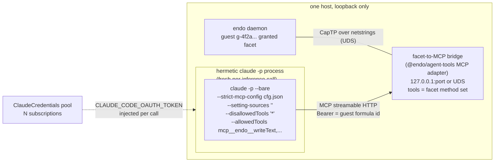
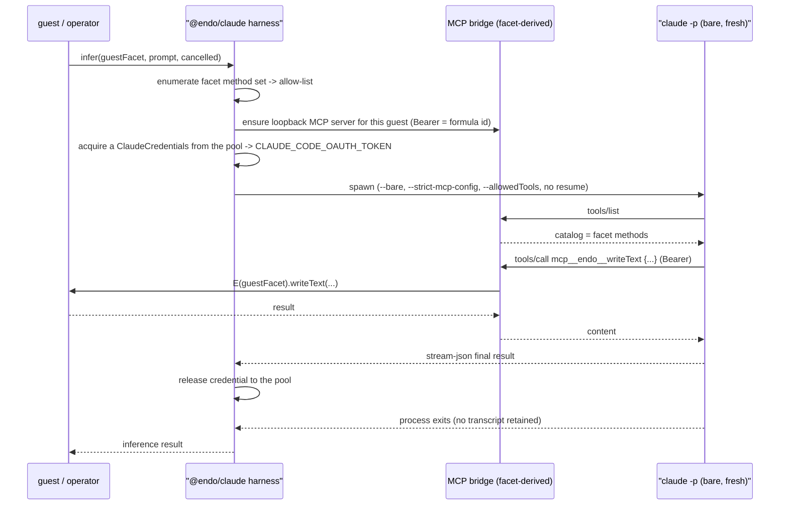

# `@endo/claude`: Claude subscription inference confined to one guest's tool surface

| | |
|---|---|
| **Created** | 2026-08-16 |
| **Author** | kriscendobot (prompted) |
| **Status** | Not Started |

## What is the Problem Being Solved?

An Endo guest needs to *think*. Today the design of record wires Claude to a
guest from the **outside**: Claude (the hosted product) is an MCP client that
connects into a minion.town `/mcp` resource server, the app resolves the
caller's identity to a guest, and Claude drives that guest's granted facet as
MCP tools. See the two companion designs, both in `kriscendobot/minion.town` @
`main`:

- [Design: a per-user Endo Pet Daemon guest behind the minion.town MCP, with
  Claude as the first-class
  client](https://github.com/kriscendobot/minion.town/blob/main/designs/mcp-endo-guest.md)
- [Design: real daemon-guest-backed MCP tools (retiring the toy
  server)](https://github.com/kriscendobot/minion.town/blob/main/designs/mcp-daemon-guest-tools.md)

`@endo/claude` runs in the **opposite direction of dependency**. Instead of an
external Claude reaching *in* to drive a guest, the guest (or an operator
provisioning on its behalf) gets Claude as its **inference engine**: a
`claude -p` process running *inside* a hermetic sandbox whose *only* capability
surface is the Model Context Protocol projection of one specified guest
formula's granted facet, and nothing else. This is "the guest thinks with
Claude," not "Claude drives a guest from outside." The distinction matters
because it inverts trust: in the companion designs Claude is the ambient,
fully-capable client and the guest facet is the attenuated thing it reaches; here
the guest facet is the *entire world* the Claude process can touch, and Claude
is the thing that must be confined.

The value is a Claude **subscription** (a Max or Pro plan reached through the
Claude Code CLI's headless credentials, not a metered API key) becoming the
inference substrate behind a confined guest, so that a fleet of concurrently
running guests can share a small pool of subscriptions the way this garden today
pools two Max plans across its worker fleet (see *Multiplexing and pooling*).

### Why "bare and only the Endo tool surface" is the whole design

A naive reading is "run `claude -p` with `--allowedTools` naming the guest's
tools." That is **not** a sandbox. The tool-permission flags
(`--allowedTools` / `--disallowedTools` / `--permission-mode`) do not suppress
the parts of the Claude Code startup that load *before and outside* the
tool-permission system: `CLAUDE.md` project-memory loading, hooks, `settings.json`
auto-discovery, and MCP server auto-discovery from `.mcp.json` and `~/.claude/`.
Denying the `Read` tool does not stop the initial `CLAUDE.md` read. A `claude -p`
invocation that omits `--bare` is not sandboxed no matter how restrictive its
allow-list is. Getting the confinement right is the substance of this design, not
a footnote to it.

The mechanics below were verified against the current Claude Code CLI
documentation for this design (2026-08-16), not inferred from general impression.

## Architecture



One sentence: `@endo/claude` takes a reference to one guest's granted facet,
stands up (or reuses) a loopback-only MCP server that projects exactly that
facet's method set as MCP tools, generates the exact `mcp__<server>__<tool>`
allow-list from that same method set, and spawns a fresh, `--bare`,
subscription-authenticated `claude -p` whose only reachable capability is that
one MCP endpoint. The Claude process cannot read the host filesystem, cannot
open a network connection the sandbox does not permit, cannot load any project
or user memory, and cannot see any MCP server but the one guest's.

### Relationship to `@endo/claude-sandbox`

The sibling package
[`@endo/claude-sandbox`](../packages/claude-sandbox/README.md) already spawns
`claude -p` and exposes a `ClaudeClient` capability, but with a **different
confinement model**: it runs Claude inside an `@endo/sandbox` podman slice with
a *projected workspace filesystem* (a 9P-mounted Endo `Filesystem` cap at
`/workspace`) and lets Claude use its built-in `Read` / `Write` / `Bash` tools
against that workspace, with network confined by the slice. Its confinement is
**OS-level around the whole process, plus a workspace**. `@endo/claude`'s
confinement is **tool-surface-level**: strip every built-in tool, and grant
exactly the guest's MCP facet. The two are complementary, not competing, and
they compose (see *Design Decisions*, #6): a bare `claude -p` can itself run
inside a `@endo/claude-sandbox` slice for defense in depth. `@endo/claude`
reuses `@endo/claude-sandbox`'s `ClaudeCredentials` caplet verbatim for the
subscription-pooling story; it differs in that its Claude has **no workspace and
no built-in tools at all**, only the guest facet.

## The hermetic invocation

Every knob below is load-bearing. Removing any one re-opens a capability leak
the others do not close.

| Flag | Value | What it closes |
| --- | --- | --- |
| `--bare` | (present) | Skips `CLAUDE.md` loading, hooks, `settings.json` auto-discovery, and MCP auto-discovery **in one shot**. These load unconditionally at startup, before the tool-permission system, so no `--allowedTools` / `--disallowedTools` combination substitutes for it. This is the single most important flag. |
| `--strict-mcp-config` | path to a generated config naming only the Endo endpoint | Makes the injected Endo MCP endpoint the *only* MCP server the process can see. Without it, `.mcp.json` / `~/.claude/` auto-discovery can add servers the design did not intend to expose (belt-and-suspenders with `--bare`, and the explicit contract for *which* server is present). |
| `--setting-sources ""` | empty | Drops the user / project / local `settings.json` layers. **Open:** whether *managed* (enterprise-policy) settings can be suppressed at all is undocumented; this design assumes they cannot until verified against a real managed-settings deployment, so a host that runs `@endo/claude` must not carry managed Claude settings that grant tools. |
| `--disallowedTools "*"` | deny all built-ins | Denies every built-in tool. Paired with a deny-by-default permission mode so the baseline is "nothing," then the allow-list re-admits only the Endo tools. |
| `--allowedTools` | `mcp__<server>__<toolA>,mcp__<server>__<toolB>,...` | The exact per-tool entries generated from the guest facet's method set. See the wildcard trap below. |
| (never) `--resume` / `--continue` | omitted, always | Both restore the *full* prior transcript, including past tool calls and their results, with no documented filter, regardless of the new invocation's tool-permission flags. A sandboxed call must never resume. |

### The `mcp__*` wildcard trap is an implementation requirement, not a caveat

`mcp__*` **does not work as an allow-rule wildcard.** Allow rules require a
literal `mcp__<server>__` prefix before any glob; an unanchored `mcp__*` allow
pattern is silently skipped with a warning and grants nothing. (It *does* work
for deny and ask rules, which is the opposite of what is needed here.) So the
allow-list cannot be hand-wildcarded. It must be **generated per guest from that
guest's actual granted facet**: enumerate the facet's method set, and emit one
`mcp__<endo-server>__<method>` entry per method. This is a concrete build step
(*compose the allow-list from the facet's method set*), and it is the same
enumeration the MCP bridge already performs to build its `tools/list` catalog, so
the two derive from one source (see *The facet-to-MCP bridge*). A guest whose
facet exposes `writeText`, `readText`, `list`, `remove` yields exactly
`--allowedTools mcp__endo__writeText,mcp__endo__readText,mcp__endo__list,mcp__endo__remove`,
computed at spawn time, never a static string.

### Fresh process per call; memory is Endo's job

Each guest-inference call is a fresh `claude -p` process. Turn-to-turn memory is
**not** the harness's responsibility, because the only way Claude Code carries it
(`--resume` / `--continue`) restores the entire prior transcript with no filter,
which would leak past tool results across a confinement boundary the fresh flags
were chosen to enforce. If a guest needs continuity across inferences, that is
Endo's job: the guest's own durable state (its pet-name directory, its mailbox),
or a memory capability the facet itself exposes as a tool. The harness stays
stateless so the confinement holds identically on every call.

## The facet-to-MCP bridge (the local/remote question)

`@endo/claude` is the MCP **client** side (the confined `claude -p` harness plus
the allow-list generation). It needs an MCP **server** that projects one guest's
facet. As both companion designs note in their "grounded against" sections, **no
`@endo/mcp` package exists yet**; the guest-facing MCP tool server is today
bespoke code in `kriscendobot/minion.town`'s `src/server.ts` / `src/http.ts`,
talking CapTP over netstrings to the daemon over a Unix domain socket
(`/run/endo-daemon/endo.sock`). Two facts change the sequencing question in this
project's favor:

1. The projection logic (a facet's method set to an MCP `tools/list` catalog, and
   an MCP `tools/call` to `E(facet).<method>(args)`) is already being extracted
   into **`@endo/agent-tools`** as a planned MCP adapter (see
   [`@endo/agent-tools`](endo-agent-tools.md), *Target package layout*:
   `src/adapters/` with "MCP/Codex/Claude Code planned"), and the same
   "translate the OpenAI-format tool schema to MCP's `Tool` shape" projection is
   specified in [Endo Gateway: MCP Termination](endo-gateway-mcp.md), *Tool
   catalog*.
2. The bearer-auth shape for a machine MCP client is already decided by
   [gateway-bearer-token-auth](gateway-bearer-token-auth.md) and reused in
   [endo-gateway-mcp](endo-gateway-mcp.md): the bearer is the 64-hex formula id
   of the target agent, looked up in a bearer-token table. That is exactly the
   credential a non-human `claude -p` client needs (no OAuth browser dance, no
   human, no PKCE).

So the answer to "does `@endo/claude` carry its own bridge or depend on a
not-yet-built `@endo/mcp`?" is: **`@endo/claude` composes with the `@endo/agent-tools`
MCP adapter to host the server, and does not reinvent the projection.** The
adapter is a named prerequisite, not in scope of this design to build; the
adapter's MCP-server-hosting seam (a minimal loopback HTTP listener that mounts
the adapter) is the one small piece that must exist for the local case, and this
design names it as a prerequisite dependency rather than carrying it. If the
`@endo/agent-tools` MCP adapter is not ready when `@endo/claude` is built, the
fallback is a minimal loopback-only MCP server carried inside `@endo/claude`
itself as a stopgap, explicitly marked for deletion once the adapter lands
(*Known gaps*).

### Local deployment



An Endo MCP server on the same host as the `claude -p` process, bound to
loopback (`127.0.0.1`, explicitly **not** `0.0.0.0`) on a port, or a Unix domain
socket. Either way it is not reachable off-box. This is the minion.town-shaped
target and the primary case. The `--strict-mcp-config` file names exactly this
one endpoint.

### Remote deployment

The Endo MCP endpoint lives elsewhere (the minion.town deployment topology
today). A machine `claude -p` client is not a browser: it cannot complete an
OAuth 2.1 PKCE authorization-code flow, and it should not. What a non-human MCP
client needs is a **pre-issued bearer credential**, which is exactly the
[endo-gateway-mcp](endo-gateway-mcp.md) shape: `Authorization: Bearer <64-hex>`
where the hex is the target agent's formula id, over MCP streamable HTTP. The
bearer is minted once by the daemon at agent-publish time and handed to
`@endo/claude` as a capability (or a credentials sidecar in the
`ClaudeCredentials` mold), never negotiated interactively. The transport is
MCP-over-HTTPS to the gateway's `/mcp`, TLS-terminated at the gateway. This
design does **not** assume the browser-facing OAuth 2.1 stack of the companion
minion.town design applies to the machine client, and it does **not** assume the
CapTP-over-Noise daemon-to-daemon transport applies either; the machine MCP
client's contract is bearer-over-HTTPS-streamable-HTTP, named here so a future
`@endo/mcp` or gateway revision knows what a headless client actually requires.

## Multiplexing by guest identifier and pooling subscriptions

The deployment target is minion.town-shaped: a local MCP stood up per host,
loopback-only, multiplexed by guest identifier, so one or more Claude
subscriptions can be pooled across concurrently running guest agents.

### Routing a call to *that* guest's facet

The existing daemon already speaks CapTP per-guest over **one shared socket**
(`/run/endo-daemon/endo.sock`), and the gateway MCP design already routes by
**bearer = formula id** on **one `/mcp` endpoint**. This design preserves the
one-socket-many-guests / one-endpoint-many-agents shape rather than fanning out
to a listener per guest:

- **One loopback MCP endpoint per host, discriminated by bearer.** The
  `claude -p` process for guest `g-4f2a...` carries that guest's formula id as
  its `Authorization: Bearer`; the bridge resolves the bearer to that guest's
  facet and no other's. The `--strict-mcp-config` file for the process pins the
  server URL and that one bearer, so the process can only ever act as its own
  guest. This is the [endo-gateway-mcp](endo-gateway-mcp.md) routing model reused
  unchanged for the loopback case, and it means the guest identifier is the
  bearer, not a port or a path segment.
- Considered and rejected: a port-per-guest or socket-per-guest scheme. Reason:
  it multiplies listeners, complicates the `--strict-mcp-config` generation, and
  discards the daemon's already-proven one-socket-many-guests shape for no
  isolation gain (the bearer already scopes each process to one facet, and the
  `claude -p` process cannot forge a different guest's formula id because it never
  sees one).

### Pooling subscriptions across concurrent guests

This is the pooling problem, and this garden is a working existence proof of
**that** problem (not the sandboxing one). The garden runs Claude-backed workers
pooled across two Max plans on two hosts, with per-host worker counts declared in
journal state (`hosts/<host>`, `gardeners: N`) and rebalanced by hand when one
account's weekly-quota burn outpaces the other's. Borrow the **allocation
pattern** ("N accounts, M concurrent consumers, keep utilization roughly level"),
not the isolation model (the garden's workers run with full host tool access; a
`@endo/claude` process runs with the Endo-only surface this design requires).

Concretely, reuse `@endo/claude-sandbox`'s `ClaudeCredentials` caplet: a pool of
`ClaudeCredentials` exos, one per subscription, each of `kind: oauthToken` (the
short-lived token from `claude setup-token`, injected as
`CLAUDE_CODE_OAUTH_TOKEN`; a subscription, not an `apiKey`). Each inference call
**acquires** a credential from the pool, injects its token into the fresh
`claude -p` process env, and **releases** it on process exit. Because
`ClaudeCredentials.issue()` / `materialise()` are eventual-sends, the pool can
live on a remote peer that holds the long-lived subscription auth and mints
short-lived per-session tokens, so the box running the guest never holds the
durable credential. The allocator is a small capability with three moves:
`acquire(cancelled) -> IssuedCredential`, quota-aware selection (least-recently-
burned, or a weight the operator sets the way the garden sets `gardeners: N`),
and `release`. A subscription hitting its weekly cap is marked cooling and
skipped until it resets, so no single account gates every guest.

## Package shape and dependencies

```text
packages/claude/
├── package.json            # @endo/claude
├── harness.js              # infer(guestFacet, prompt, {model, cancelled}) -> result
├── allow-list.js           # facet method set -> mcp__server__method[] + strict-mcp-config
├── credentials-pool.js     # acquire/release over a set of ClaudeCredentials
├── mcp-config.js           # render the --strict-mcp-config file (one endpoint, one bearer)
└── test/                   # dependency-injected unit tests (no live claude, no daemon)
```

| Dependency | Relationship |
| --- | --- |
| [`@endo/agent-tools`](endo-agent-tools.md) MCP adapter | **Prerequisite** (to be filed if not yet built): projects a facet's method set to an MCP `tools/list` catalog and dispatches `tools/call` to `E(facet).<method>`. `@endo/claude` composes with it; it does not reinvent the projection. |
| [`@endo/claude-sandbox`](../packages/claude-sandbox/README.md) | **Sibling / reuse**: the `ClaudeCredentials` caplet (`kind: oauthToken` subscription tokens) is reused verbatim for the pool. Optionally the podman slice for defense-in-depth (Design Decisions #6). |
| [`@endo/eventual-send`](../packages/eventual-send/README.md) | Facet references are `E(...)`-invoked. |
| [gateway-bearer-token-auth](gateway-bearer-token-auth.md) / [endo-gateway-mcp](endo-gateway-mcp.md) | The bearer-is-formula-id auth shape reused for both the loopback bridge and the remote endpoint. |

Naming: the mandate names the package `@endo/claude`, matching the sibling
`@endo/claude-sandbox`, which does not carry the `exo-` prefix despite exposing a
`ClaudeClient` over CapTP. `@endo/claude`'s primary surface is a harness
(`infer(...)`), not a passable interface exchanged over CapTP, so the unprefixed
name is consistent with the sibling and the project convention. (See *Open
questions* if the harness grows a passable `Inference` exo as its primary export.)

## Design Decisions

1. **`--bare` is mandatory, not a hardening option.** Without it the process
   loads `CLAUDE.md`, hooks, settings, and auto-discovered MCP servers before the
   tool-permission system runs, so the allow-list confines nothing. The harness
   refuses to spawn without `--bare` in the argv.
2. **The allow-list is generated per guest from the facet method set.** `mcp__*`
   is silently ignored as an allow rule; only literal `mcp__<server>__<tool>`
   entries grant. The enumeration is shared with the MCP bridge's `tools/list`, so
   the catalog Claude sees and the tools it is allowed to call derive from one
   source and cannot drift apart.
3. **Fresh process per inference; never `--resume` / `--continue`.** Resuming
   restores the full unfiltered transcript across the confinement boundary.
   Continuity, where a guest needs it, is an Endo capability the facet exposes,
   not harness state.
4. **One loopback endpoint, discriminated by bearer = formula id.** Preserves the
   daemon's one-socket-many-guests shape and the gateway's one-endpoint-many-agents
   routing; the guest identifier is the bearer, and a process pinned by
   `--strict-mcp-config` to its own bearer cannot act as another guest.
5. **Subscriptions pool through `ClaudeCredentials`, allocated per call.** Reuse
   the existing caplet; acquire on spawn, release on exit; quota-aware selection
   keeps utilization level across accounts the way the garden balances
   `gardeners: N` by hand, but as a capability rather than a manual edit.
6. **Tool-surface confinement composes with OS-level confinement.** `@endo/claude`
   confines the tool surface; `@endo/claude-sandbox` confines the process and OS.
   Running a bare `claude -p` inside a `@endo/claude-sandbox` slice with
   `network: private` and no workspace mount gives both: even if a future Claude
   Code change leaked a built-in tool past `--bare` + `--disallowedTools`, the
   slice would still deny it host reach. Recommended for any deployment exposing a
   guest to untrusted prompts.

## Known Gaps and TODOs

- [ ] The `@endo/agent-tools` MCP adapter's server-hosting seam (a loopback HTTP
      listener mounting the adapter) must exist for the local case; file a
      prerequisite job if it is not ready when `@endo/claude` is built.
- [ ] Stopgap-only: a minimal loopback MCP server carried inside `@endo/claude`
      if the adapter is not ready, explicitly marked for deletion once the adapter
      lands.
- [ ] Verify on a real managed-settings deployment whether `--setting-sources ""`
      can suppress managed settings, or whether the host must be kept free of
      managed Claude settings that grant tools.
- [ ] A minion.town-side deployment + configuration companion design (see below).

## Follow-on: a minion.town deployment companion

The two companion designs live in `kriscendobot/minion.town`, not in this repo,
because minion.town is "a deployment + configuration layer, not a code home."
`@endo/claude` is the code home; the concrete deployment of it on the
minion.town box (the systemd unit for the loopback MCP bridge, the
`ClaudeCredentials` pool wiring across the box's subscriptions, the
`--strict-mcp-config` generation per guest, and how a running guest triggers an
inference) is a **separate follow-on design that belongs in minion.town**,
mirroring how [mcp-endo-guest](https://github.com/kriscendobot/minion.town/blob/main/designs/mcp-endo-guest.md)
and [mcp-daemon-guest-tools](https://github.com/kriscendobot/minion.town/blob/main/designs/mcp-daemon-guest-tools.md)
sit there. It should be filed as a separate design job once this package design
is accepted, not written in this pass.

## Open questions

- Which is the canonical trigger for a guest inference: does the guest itself
  `request` an inference of its host (Claude as a capability the guest holds), or
  does an operator/scheduler outside the guest drive `infer(...)` on the guest's
  behalf? The mandate says "the guest thinks with Claude," which leans toward the
  former, but the confined process holds only the facet, so the *decision to
  infer* comes from outside the confined process either way. Recommend: expose
  `infer(...)` as a capability the guest's host grants, so "the guest thinks" is
  literally a capability the guest can hold and exercise.
- Should the primary export be a harness function `infer(...)` or a passable
  `Inference` exo that the guest holds as a capability? If the latter, the
  `exo-` package-name convention would apply (`@endo/exo-claude`), diverging from
  the unprefixed sibling `@endo/claude-sandbox`. Recommend: start unprefixed as
  the mandate names it, and revisit if a passable exo becomes the primary surface.
- Can *managed* (enterprise-policy) Claude settings be suppressed by
  `--setting-sources ""`? Undocumented; treat as "assume they cannot" until
  verified against a real managed-settings deployment, and keep `@endo/claude`
  hosts free of managed settings that grant tools until then.
- Does the pool allocator's quota accounting read burn from the subscription
  (is a weekly-cap signal observable through the Claude Code CLI or the token?),
  or must the operator set weights manually the way the garden edits
  `gardeners: N` today? Recommend: start with operator-set weights plus a
  cooling flag on a detected rate-limit response, and make burn-reading a later
  refinement if a signal exists.
- What is the failure taxonomy at the harness boundary (subscription rate-limited,
  MCP bridge down, guest facet method threw, `claude -p` non-zero exit, stream
  parse error), and how does each surface back to the caller? The companion
  design's impedance exercise X4 (error taxonomy) is the precedent; a similar
  small enumeration should land with the build.

## Prompt

> Design an `@endo/claude` package: an Endo package that provides LLM inference
> for an Endo guest **from a Claude subscription**, via a hermetically-sandboxed
> `claude -p` (or the Claude Agent SDK) invocation whose *only* capability
> surface is the Endo tool call surface for one specified guest formula
> identifier. Maintainer request, 2026-08-15/16, liaison conversation. This is
> the inverse direction of the two minion.town designs (mcp-endo-guest,
> mcp-daemon-guest-tools): the guest thinks with Claude, rather than Claude
> driving a guest from outside. Ground the confinement in the confirmed
> Claude Code CLI mechanics (`--bare` is load-bearing; `--strict-mcp-config`;
> `--setting-sources ""`; never `--resume`/`--continue`; deny all built-ins then
> allow only literal `mcp__<server>__<tool>` entries generated per guest from the
> facet method set, because `mcp__*` is silently ignored as an allow rule).
> Address the local/remote MCP question and the `@endo/mcp` sequencing, and the
> multiplexing-by-guest-id and subscription-pooling story. Deliverable: this
> file, draft PR against `llm`; name a minion.town deployment companion as a
> follow-on rather than writing both.
