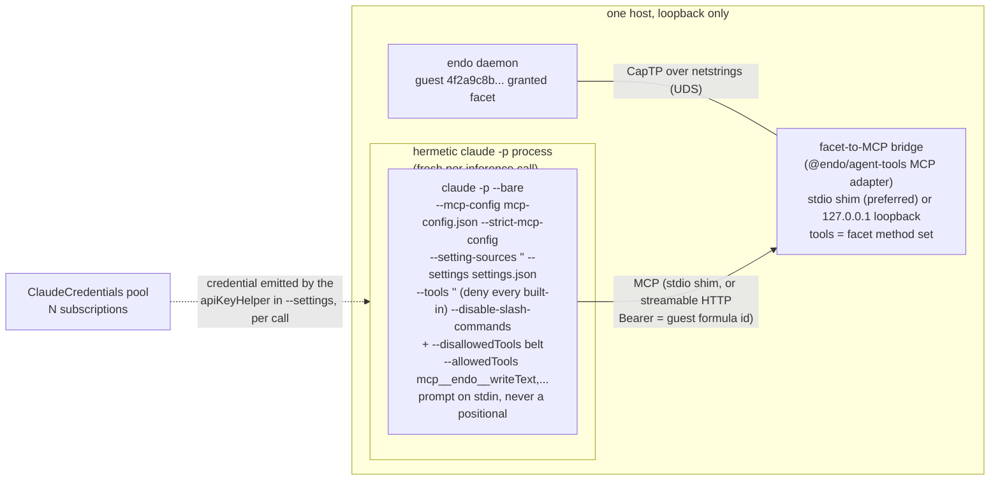

# `@endo/claude`: Claude subscription inference confined to one guest's tool surface

| | |
|---|---|
| **Created** | 2026-08-16 |
| **Updated** | 2026-08-16 |
| **Author** | kriscendobot (prompted) |
| **Status** | Not Started |

## What is the Problem Being Solved?

An Endo guest needs to *think*. Today the design of record wires Claude to a
guest from the **outside**: Claude (the hosted product) is an MCP client that
connects into a minion.town `/mcp` resource server, the app resolves the
caller's identity to a guest, and Claude drives that guest's granted facet as
MCP tools. See the two companion designs, both in `kriscendobot/minion.town` @
`main`:

- [Design: a per-user Endo Pet Daemon guest behind the minion.town MCP, with
  Claude as the first-class
  client](https://github.com/kriscendobot/minion.town/blob/main/designs/mcp-endo-guest.md)
- [Design: real daemon-guest-backed MCP tools (retiring the toy
  server)](https://github.com/kriscendobot/minion.town/blob/main/designs/mcp-daemon-guest-tools.md)

`@endo/claude` runs in the **opposite direction of control**. Instead of an
external Claude reaching *in* to drive a guest, the guest (or an operator
provisioning on its behalf) gets Claude as its **inference engine**: a
`claude -p` process running *inside* a hermetic sandbox whose *only* capability
surface is the Model Context Protocol projection of one specified guest
formula's granted facet, and nothing else. This is "the guest thinks with
Claude," not "Claude drives a guest from outside." The distinction matters
because it inverts trust: in the companion designs Claude is the ambient,
fully capable client and the guest facet is the attenuated thing it reaches; here
the guest facet is the *entire world* the Claude process can touch, and Claude
is the thing that must be confined.

The value is a Claude **subscription** (a Max or Pro plan reached through the
Claude Code CLI's headless credentials, not a metered API key) becoming the
inference substrate behind a confined guest, so that a fleet of concurrently
running guests can share a small pool of subscriptions the way a Claude-backed
agent fleet (a "garden" of workers, operational infrastructure separate from this
Endo repo) today pools two Max plans across its workers (see *Multiplexing by
guest identifier and pooling subscriptions*).

### Why "bare and only the Endo tool surface" is the whole design

A naive reading is "run `claude -p` with `--allowedTools` naming the guest's
tools." That is **not** a sandbox. The tool-permission flags
(`--allowedTools` / `--disallowedTools` / `--permission-mode`) do not suppress
the parts of the Claude Code startup that load *before and outside* the
tool-permission system: `CLAUDE.md` project-memory loading, hooks, `settings.json`
layers, and MCP server auto-discovery from `.mcp.json` and `~/.claude/`. Denying
the `Read` tool does not stop the initial `CLAUDE.md` read. Closing every one of
those surfaces takes a **combination** of flags, not one. The combination is
the substance of this design, not a footnote to it.

**No single flag closes all three surfaces, and `--bare` closes fewer than a
first reading suggests.** Measured on Claude Code 2.1.232 (`claude --help` and
short live spawns, 2026-08-16), `--bare` is *"Minimal mode: skip hooks, LSP,
plugin sync, attribution, auto-memory, background prefetches, keychain reads, and
CLAUDE.md auto-discovery"*. It does **not** name `settings.json` layers or MCP
auto-discovery, and it does **not** suppress them. The flag whose help text
disables MCP servers and settings customizations wholesale is `--safe-mode`
(*"Start with all customizations ... disabled"*), but it is a troubleshooting
mode, not a confinement primitive, and *"Admin-managed (policy) settings still
apply."* So the design closes the three surfaces with three distinct flags, each
load-bearing:

- **`--bare`** closes `CLAUDE.md`, hooks, LSP, plugin sync, attribution,
  auto-memory, prefetches, and keychain reads, and (the property the whole
  credential story leans on) *narrows Anthropic auth to `ANTHROPIC_API_KEY` or an
  `apiKeyHelper` via `--settings`; OAuth and keychain are never read* (its own help
  text). It does **not** close MCP auto-discovery or settings layers.
- **`--strict-mcp-config`** closes MCP auto-discovery: *"Only use MCP servers from
  `--mcp-config`, ignoring all other MCP configurations."* This (not `--bare`)
  is what prevents `.mcp.json` / `~/.claude/` servers from being added.
- **`--setting-sources ""`** closes the discovered `settings.json` layers (user /
  project / local), leaving only the one file named by `--settings`.

A `claude -p` invocation missing any one of the three re-opens the surface that
flag closes, no matter how restrictive its allow-list is.

`--bare`'s own help also warns *"Skills still resolve via /skill-name"*. So
`Skill` / `SlashCommand` survive `--bare`. Because `/skill-name` is parsed from
prompt text rather than selected from the built-in tool set that `--tools ""`
empties, they are closed by the dedicated `--disable-slash-commands` flag
(*"Disable all skills"*, 2.1.232), with `--tools ""` as the built-in-set belt
(§ *The tool baseline is fail-closed*). They are not assumed gone.

The mechanics below were checked against `claude --help` and short live spawns on
Claude Code 2.1.232 (2026-08-16), not inferred from general impression: the
`--bare` suppression set and credential narrowing quoted above; that
`--strict-mcp-config` takes no argument (the path belongs to `--mcp-config`, which
is variadic, see § *Argv order is a confinement boundary*); that `--tools ""`
disables every built-in tool (§ *The tool baseline is fail-closed*); and that no
`--permission-mode` offers a deny-by-default baseline (the choices are
`acceptEdits`, `auto`, `bypassPermissions`, `manual`, `dontAsk`, `plan`). Where a
claim is still unverified against a real deployment (managed settings; a negative
confinement test that no built-in tool survives) it is called out as such rather
than asserted.

## Architecture



One sentence: `@endo/claude` takes **one guest's formula id** (the 64-hex name the
transport already routes on, the same designator throughout), **resolves it to
the guest facet inside the harness**, stands up (or reuses) a facet-derived MCP
bridge that projects exactly that facet's method set as MCP tools, asks that
bridge for the guest's `tools/list` catalog and generates the exact
`mcp__<server>__<tool>` allow-list from it, and spawns a fresh, `--bare`,
subscription-authenticated `claude -p` whose only reachable capability is that one
MCP endpoint. **The harness (not the confined process) holds the facet.** The
confined process reaches the daemon only through a connection the harness has
already attenuated to this one facet (an inherited socketpair fd handed to the
stdio shim, or a per-guest loopback listener), and the unattenuated daemon socket
(`ENDO_SOCK`) is **scrubbed from the child environment** so a leaked built-in
cannot re-open it. In tool-surface terms the Claude process can load no project or
user memory and can see no MCP server but the one guest's; it holds *only* the
facet's method set. Broader OS-level guarantees (no host filesystem, no
un-permitted network) are **not** properties of `@endo/claude` alone: they hold
only when it is run inside the `@endo/claude-sandbox` slice (*Design
Decision 6*), which is **required, not merely recommended, for any guest-influenced
prompt**.

### Relationship to `@endo/claude-sandbox`

The sibling package
[`@endo/claude-sandbox`](../packages/claude-sandbox/README.md) already spawns
`claude -p` and exposes a `ClaudeClient` capability, but with a **different
confinement model**: it runs Claude inside an `@endo/sandbox` podman slice with
a *projected workspace filesystem* (a 9P-mounted Endo `Filesystem` cap at
`/workspace`) and lets Claude use its built-in `Read` / `Write` / `Bash` tools
against that workspace, with network confined by the slice. Its confinement is
**OS-level around the whole process, plus a workspace**. `@endo/claude`'s
confinement is **tool-surface-level**: strip every built-in tool, and grant
exactly the guest's MCP facet. The two are complementary, not competing, and
they compose (see *Design Decision 6*): a bare `claude -p` can itself run
inside a `@endo/claude-sandbox` slice for defense in depth. `@endo/claude`
builds its subscription-pooling story **on** `@endo/claude-sandbox`'s
`ClaudeCredentials` caplet, but not as a drop-in reuse: the caplet's live guard
(`packages/claude-sandbox/src/claude-credentials-factory.js`) fixes
`CREDENTIAL_KINDS = harden(['apiKey', 'oauthToken'])`, routed to
`ANTHROPIC_API_KEY` / `CLAUDE_CODE_OAUTH_TOKEN`. **Neither kind is admissible
here today**: `--bare` never reads `CLAUDE_CODE_OAUTH_TOKEN`, and `apiKey` is the
metered path this design's premise excludes. So presenting a *subscription* through
this caplet requires **extending the exo with a new credential kind** (a
subscription value the harness renders into an `apiKeyHelper`), which is work, not
reuse; the extension is named as a prerequisite in *Design Decision 5* and *Known
Gaps and TODOs*, not assumed. The allocator this design adds also does not map to
a nonexistent `release(issued)`: the live `M.interface()` is `issue(sessionTag)` /
`revoke(sessionTag)` / `rotate(newApiKey)` with a **single-shot** `materialise()`,
so `acquire` maps to `issue(sessionTag)` and the credential's return-to-pool maps
to `revoke(sessionTag)` (§ *Pooling subscriptions across concurrent guests*).
`@endo/claude` differs from the sibling in that its Claude has **no workspace and
no built-in tools at all**, only the guest facet.

## The hermetic invocation

Every knob below is load-bearing. Removing any one re-opens a capability leak
the others do not close.

| Flag | Value | What it closes |
| --- | --- | --- |
| `--bare` | (present) | Per its 2.1.232 help text, skips hooks, LSP, plugin sync, attribution, auto-memory, background prefetches, keychain reads, and `CLAUDE.md` auto-discovery. It does **not** close settings layers or MCP auto-discovery. Those are the jobs of `--setting-sources ""` and `--strict-mcp-config` below; do not conflate them (a first reading, and this doc's own earlier draft, over-credited `--bare`). It is still the single most important flag for one reason beyond the above: **it narrows the credential surface.** Under `--bare`, Anthropic auth is strictly an `ANTHROPIC_API_KEY` or an `apiKeyHelper` named via `--settings`; the OAuth / keychain credentials `claude` normally reads (including `CLAUDE_CODE_OAUTH_TOKEN`) are **never** consulted. It also warns that Skills still resolve via `/skill-name`, so `Skill` / `SlashCommand` survive it (closed by `--disable-slash-commands`, with the `--tools ""` baseline emptying the built-in set, not by `--bare`). This shapes how the subscription reaches the process (see the `--settings` row and *Design Decision 5*). |
| `--mcp-config <configs...>` | path to a generated config naming only the Endo endpoint | **Variadic** (space-separated) and accepts a JSON **file path or a JSON string**. Carries the generated MCP config (the stdio shim command, or the loopback URL, plus the guest's bearer). The path belongs here, **not** on `--strict-mcp-config`. Because it accepts inline JSON *and* is variadic, it is the highest-value argv-injection target (§ *Argv order is a confinement boundary*): a positional that lands after it is read as another server definition. |
| `--strict-mcp-config` | (present; takes **no** argument) | Boolean. Restricts the process to only the servers named in `--mcp-config`, ignoring all other MCP configuration (`.mcp.json`, `~/.claude/`). **This (not `--bare`) is the flag that closes MCP auto-discovery.** Without it, auto-discovery can add servers the design did not intend to expose. Writing a path after this flag is a silent error: it binds to the prompt positional and the process starts with **zero** MCP servers, so confinement "passes" by exposing nothing. |
| `--setting-sources ""` | empty | Drops the discovered user / project / local `settings.json` layers. Composes with `--settings` below: `--setting-sources ""` removes everything *discovered*, and `--settings` injects exactly one *named* file, so the sole settings surface the process sees is that one generated file. **Open:** whether *managed* (enterprise-policy) settings can be suppressed at all is undocumented. `--safe-mode`'s help states admin-managed policy settings still apply even in that stronger mode, so this design assumes managed settings cannot be dropped until verified against a real managed-settings deployment, and a host that runs `@endo/claude` must not carry managed Claude settings that grant tools. |
| `--settings <file>` | a generated file carrying only an `apiKeyHelper` | The one credential escape `--bare` honors (see *Design Decision 5*). The pool renders a minimal settings file whose **sole** key is an `apiKeyHelper` that emits the acquired credential; combined with `--setting-sources ""` it is the only settings the process reads. This is the deliberate, tightly-scoped re-admission of a settings file into a design that otherwise treats settings as a leak surface, accepted because `--bare` leaves no other authenticated path. The `apiKeyHelper` is itself an *executed* command outside the tool-permission system (§ *The `apiKeyHelper` is an execution grant, not a value*), so its argv must be harness-fixed and never prompt-influenceable. |
| `--tools ""` | empty string (disable **all** built-ins) | **The fail-closed baseline.** `--tools` selects the available built-in set; `--tools ""` makes **zero** built-ins available (its help: *"Use `""` to disable all tools"*), so the deny is by construction rather than by enumerating an open-ended list. It empties the built-in set and does not depend on the harness keeping an exhaustive built-in name list current across CLI versions. It does **not** by itself close the `Skill` / `SlashCommand` surface `--bare` leaves resolving: `/skill-name` is parsed from prompt text, not selected from the built-in set, so `--disable-slash-commands` (next row) is what closes that path. MCP tools are unaffected: they arrive via `--mcp-config` + `--allowedTools`, not the built-in set. |
| `--disable-slash-commands` | (present) | **Closes the `/skill-name` slash-command surface `--tools ""` cannot.** `--bare`'s help warns *"Skills still resolve via /skill-name"*, and this flag's help is *"Disable all skills"* (2.1.232), strong evidence `/skill-name` is parsed from conversation/prompt text rather than selected from the `--tools` built-in set. Since the prompt is the one guest-influenceable input (§ *Argv order is a confinement boundary*), a prompt containing `/some-skill` could otherwise resolve a surface outside the confined tool set (exactly *Design Decision 6*'s threat model). Load-bearing; the negative-confinement test asserts no `/skill-name` resolves (see *Known Gaps and TODOs*). |
| `--disallowedTools` | an explicit deny of the known built-in names (`Bash`, `Read`, `Write`, `Edit`, `Glob`, `Grep`, `WebFetch`, `WebSearch`, `Task`, `NotebookEdit`) | **Redundant belt over `--tools ""`, not the primary mechanism.** Denies each named built-in for defense in depth; **not** `"*"` (deny outranks allow, so a `"*"` deny also cancels the `mcp__<server>__<tool>` allow entries and grants *nothing*). Because this list is measured against one CLI version and cannot be exhaustive across future ones, it is **not** trusted as the baseline. `--tools ""` is, being deny-by-construction. There is no "deny-by-default permission mode" to lean on either (`--permission-mode` offers only `acceptEdits`, `auto`, `bypassPermissions`, `manual`, `dontAsk`, `plan`, none a deny-all). Pin the CLI version and re-derive this list on upgrade; a live negative-confinement test must confirm no built-in survives (see *Known Gaps and TODOs*). |
| `--allowedTools <tools...>` | `mcp__<server>__<toolA>,mcp__<server>__<toolB>,...` | **Variadic.** The exact per-tool entries generated from the guest facet's method set, each validated (§ *Working around the `mcp__*` wildcard trap*). In headless `-p` mode a tool absent from this list has no interactive prompt to approve it, so this list is the positive half of the baseline. Because it is variadic, a positional after it is swallowed (§ *Argv order is a confinement boundary*). |
| (never) `--resume` / `--continue` | omitted, always | Both restore the *full* prior transcript, including past tool calls and their results, with no documented filter, regardless of the new invocation's tool-permission flags. A sandboxed call must never resume. |

### Argv order is a confinement boundary, not a formatting detail

The prompt is the **one attacker-controlled input** in the whole invocation (a
guest may influence it; DD6). On 2.1.232 the prompt is a **bare positional**
(`claude [options] [prompt]`), and three of the flags above (`--mcp-config`,
`--allowedTools`, `--disallowedTools`) are **variadic** (`<configs...>` /
`<tools...>`, comma-**or**-space separated). A variadic flag greedily consumes
following tokens, so **a prompt emitted as a positional after any of them is
swallowed as configuration, not delivered as the prompt.** The worst case is
`--mcp-config`, which also accepts inline JSON **strings**: a crafted prompt read
there becomes an arbitrary MCP **server definition**, adding a server and defeating
the entire confinement. This is a distinct trap from the `--strict-mcp-config`
path-swallow already named above.

The harness must therefore treat argv construction as security-critical:

- **Never pass the prompt as a trailing positional.** Deliver it on **stdin**
  (`claude -p` reads a piped prompt) or, if a positional is unavoidable, place it
  after a `--` end-of-options terminator, never adjacent to a variadic flag.
- **Assert the spawned argv pre-exec**: the prompt bytes appear on stdin (or after
  `--`) and **nowhere** in the flag vector; every variadic flag is immediately
  followed by another `--`-prefixed flag or the terminator. Fail closed (refuse to
  spawn) on any violation, rather than trusting the CLI to disambiguate.

### Working around the `mcp__*` wildcard trap, and validating every allow-list name

`mcp__*` **does not work as an allow-rule wildcard.** Allow rules require a
literal `mcp__<server>__` prefix before any glob; an unanchored `mcp__*` allow
pattern is silently skipped with a warning and grants nothing. (It *does* work
for deny and ask rules, which is the opposite of what is needed here.) So the
allow-list cannot be hand-wildcarded. It must be **generated per guest from that
guest's actual granted facet**: enumerate the facet's method set, and emit one
`mcp__<endo-server>__<method>` entry per method. This is a concrete build step
(*compose the allow-list from the facet's method set*), and it is the same
enumeration the MCP bridge already performs to build its `tools/list` catalog, so
the two derive from one source (see *The facet-to-MCP bridge*). A guest whose
facet exposes `writeText`, `readText`, `list`, `remove` yields exactly
`--allowedTools mcp__endo__writeText,mcp__endo__readText,mcp__endo__list,mcp__endo__remove`,
computed at spawn time, never a static string.

**Every method name is validated before it reaches `--allowedTools`; the generator
fails closed on a violation.** The entries are comma/space-joined into one flag
value, and anchored globs are honored, so an unconstrained method name is itself a
capability-escalation vector: a name containing a comma or space **splits into
extra allow entries**, and a name of `*` or `read*` becomes a **wildcard grant**
after the literal `mcp__<server>__` prefix. The generator therefore requires each
method name to match `/^[A-Za-z0-9_-]+$/` and **refuses to spawn** on any
violation. It never relies on the downstream deny set to cancel an injected
entry, because deny/allow disjointness (above) is only maintained if the allow
side is well-formed in the first place. (A well-behaved Endo facet method set
already satisfies this; the check defends against a malformed or adversarial
catalog, and against a future capability-scoped surface whose names are less
controlled.)

### Fresh process per call; memory is Endo's job

Each guest-inference call is a fresh `claude -p` process. Turn-to-turn memory is
**not** the harness's responsibility, because the only way Claude Code carries it
(`--resume` / `--continue`) restores the entire prior transcript with no filter,
which would leak past tool results across a confinement boundary the fresh flags
were chosen to enforce. If a guest needs continuity across inferences, that is
Endo's job: the guest's own durable state (its pet-name directory, its mailbox),
or a memory capability the facet itself exposes as a tool. The harness stays
stateless so the confinement holds identically on every call.

### The tool baseline is fail-closed

The built-in tool baseline is **deny-by-construction, not deny-by-enumeration.**
`--tools ""` makes the available built-in set empty, so nothing in it can run
regardless of what a future CLI adds or renames; `--disallowedTools` names the
known built-ins on top of that only as redundant belt. The consequence the design
depends on: a built-in that appears in a later CLI version is denied without a
harness edit, because it was never *added* to the empty set. The open-ellipsis
enumeration a name list would carry is gone. `Skill` / `SlashCommand`, though, are
a **separate** surface `--tools ""` does not reach: `--bare` explicitly leaves them
resolving (*"Skills still resolve via /skill-name"*), and `/skill-name` is parsed
from prompt text, not selected from the built-in set that `--tools ""` empties, so
emptying that set does not deny it. `--disable-slash-commands` (*"Disable all
skills"*, 2.1.232) is the flag that closes the slash-command path, and the harness
passes it alongside `--tools ""`. The design pins the CLI version anyway (the
negative-confinement test is version-specific), but the built-in baseline's
correctness does not rely on the pin being current.

### The `apiKeyHelper` is an execution grant, not a value

The credential reaches the process through an `apiKeyHelper` (a **command the CLI
executes** and whose stdout it reads as the key), not a static value. That is a
command-execution path *outside* the tool-permission system this design otherwise
closes (`Bash` is denied, yet the helper runs). It is admissible only under two
constraints the harness enforces: the helper's **argv is fixed by the harness** and
carries **no** prompt-derived or guest-derived bytes (so the one attacker-controlled
input cannot steer what executes), and the helper does nothing but emit the credential
the pool acquired for this spawn. Naming it as an execution grant, rather than
treating `--settings` as an inert file, is what keeps the re-admission honest.

## The facet-to-MCP bridge (the local/remote question)

`@endo/claude` is the MCP **client** side (the confined `claude -p` harness plus
the allow-list generation). It needs an MCP **server** that projects one guest's
facet. Unlike the minion.town companion designs (whose "grounded against"
sections predate the MCP projection work and record "no `@endo/mcp` package exists
yet"), **this project already has the MCP projection designed and stubbed**, so
`@endo/claude` builds on it rather than inventing it:

1. The projection logic (a facet's method set to an MCP `tools/list` catalog, and
   an MCP `tools/call` to `E(facet).<method>(args)`) is specified in the
   **merged** design [Endo Gateway: MCP Termination](endo-gateway-mcp.md)
   (PR [#376](https://github.com/endojs/endo-but-for-bots/pull/376)), *Tool
   catalog* (the "translate the tool schema to MCP's `Tool` shape" one-line
   projection), and its home is **`@endo/agent-tools`**, where the adapter
   already exists as a **declared stub** at
   `packages/agent-tools/src/adapters/mcp.js` ("Planned adapter shape only": map a
   `ToolRecord`'s `name` / `description` / `parameters` / `invoke` to an MCP tool
   without adding MCP runtime dependencies). The projection is designed and
   named, not yet implemented. `@endo/claude` composes with it; it does not
   reinvent it.
2. The bearer-auth shape for a machine MCP client is already decided by
   [gateway-bearer-token-auth](gateway-bearer-token-auth.md) and reused in
   [endo-gateway-mcp](endo-gateway-mcp.md): the bearer is the 64-hex formula id
   of the target agent, looked up in a bearer-token table. That is exactly the
   credential a non-human `claude -p` client needs (no OAuth browser dance, no
   human, no PKCE).
3. [endo-gateway-mcp](endo-gateway-mcp.md) also names the **stdio local-shim**
   pattern (*MCP Wire Shape and Transport*, and Design Decision 6): the gateway
   terminates streamable HTTP only, and "clients that need stdio run a local shim
   subprocess" that itself opens an OCapN connection or a `/mcp` HTTP connection.
   That shim is the cleanest local transport for `@endo/claude` (see *Local
   deployment*), so the pattern this design leans on is already the project's
   stated one.

So the answer to "does `@endo/claude` carry its own bridge, depend on a
not-yet-built `@endo/mcp`, or compose with something already designed?" is the
third: **`@endo/claude` composes with the `@endo/agent-tools` MCP adapter (a
designed, stubbed surface) and does not reinvent the projection.**
Implementing that adapter stub, plus the small MCP-server-hosting seam around it
(a stdio shim command for the local case, or a loopback HTTP listener), is a
named prerequisite rather than in scope of this design. The groundwork for it is
tracked as the follow-up job `design-endo-claude-mcp-groundwork`. If the adapter
is still unimplemented when `@endo/claude` is built, the fallback is a minimal
stdio MCP shim carried inside `@endo/claude` as a stopgap, explicitly marked for
deletion once the `@endo/agent-tools` adapter lands (*Known Gaps and TODOs*).

### Which tool surface the catalog projects (a carried-over limitation)

The projection above covers exactly one surface today: **Lal's static tool
schemas**. The catalog and the `executeTool(name, args)` dispatch that
[endo-gateway-mcp](endo-gateway-mcp.md) projects are lifted straight out of
`packages/lal/agent.js` (its OpenAI-function-calling tool array and its
`executeTool` switch, extracted into `@endo/agent-tools`), so the enumeration
`@endo/claude` derives its `--allowedTools` from is Lal's current fixed
namespace / mail / evaluate tool set, one MCP entry per Lal tool name. That is a
real answer to "compose the allow-list from the facet's method set" and it is not
something `@endo/claude` invents a derivation for: it is the *same* projection the
bridge already performs for `tools/list`.

The limitation is the one [endo-gateway-mcp](endo-gateway-mcp.md) names in its
Open Questions, item 1 (*Capability-scoped tools timing*): this static surface is
**not** the capability-scoped tool surface of
[daemon-agent-tools](daemon-agent-tools.md). That per-guest, capability-derived
surface (whose tools reflect the actual capabilities granted to a specific guest,
rather than Lal's fixed set) is a separate, still-maturing design that composes
into the same catalog "via `extra`" only once it ships; endo-gateway-mcp leaves
the catalog ordering, name-collision resolution, and absent-capability behavior
open until the first capability-scoped tool lands. So `@endo/claude`'s
guest-formula scoping is only as fine-grained as the surface that is actually live
when it is built:

- If it is built against the **static Lal surface**, every guest sees the same
  Lal tool namespace, and the `--allowedTools` list is that namespace minus
  anything the deployment chooses to withhold. The bearer still scopes *which
  guest's facet* the calls act on, but not *which subset of tools* that guest may
  reach, because the static surface is uniform across guests.
- If genuine **per-guest, capability-scoped** tooling is what is wanted (each
  guest's `--allowedTools` reflecting only the capabilities its formula was
  granted), then [daemon-agent-tools](daemon-agent-tools.md) is a hard dependency,
  named here explicitly: `@endo/claude` must derive its allow-list from that
  capability-scoped catalog, not Lal's static one, and cannot do so until
  daemon-agent-tools and the endo-gateway-mcp `extra`-composition it depends on
  are both live. This design does not assume the capability-scoped surface is
  ready; it targets whichever surface the MCP adapter actually exposes when the
  build starts, and treats the capability-scoped surface as the upgrade that
  tightens per-guest scoping once available.

### Local deployment

```mermaid
sequenceDiagram
  participant G as guest / operator
  participant H as endo/claude harness
  participant M as MCP bridge (facet-derived)
  participant P as claude -p (bare, fresh)
  G->>H: infer(guestFormulaId, prompt, {model, cancelled})
  H->>H: resolve formula id -> guest facet (harness holds it)
  H->>M: stand up facet-derived bridge over an attenuated connection (this facet only)
  H->>M: tools/list once; pin the returned catalog as this spawn's snapshot
  M-->>H: catalog = facet methods
  H->>H: validate names, catalog -> allow-list (same pinned snapshot)
  H->>H: issue(sessionTag) a credential from the pool -> apiKeyHelper in --settings
  H->>P: spawn (--bare, --mcp-config, --strict-mcp-config, --setting-sources empty, --settings, --tools empty, --allowedTools; prompt on stdin; ENDO_SOCK scrubbed; no resume)
  P->>M: tools/list
  M-->>P: pinned snapshot (no re-read of the facet)
  P->>M: tools/call mcp__endo__writeText {...}
  M->>G: E(guestFacet).writeText(...)
  G-->>M: result
  M-->>P: content
  P-->>H: stream-json final result
  P-->>H: process exits (no transcript retained)
  H->>H: finally revoke(sessionTag), always, incl. crash/cancel path
  H-->>G: inference result
```

An Endo MCP server on the same host as the `claude -p` process, not reachable
off-box. Two transports, in preference order:

- **Preferred: a stdio MCP shim, handed an already-attenuated connection.** The
  generated `--mcp-config` file names a **stdio** MCP server whose command is a thin
  Endo CLI shim (the "local shim subprocess"
  [endo-gateway-mcp](endo-gateway-mcp.md) already names). The critical point the
  first draft got wrong: `claude -p` spawns the shim, so if the shim opened the
  daemon socket **itself** it would first hold the *full* daemon socket (the
  many-guest `captp0` endpoint) and only *voluntarily* narrow to one facet: a
  runtime choice by code running **inside** the confinement, not a structural
  absence. A leaked built-in in the confined tree could then reach the whole
  one-socket-many-guests surface, not just one facet. So the **harness**, not the
  shim, resolves the formula id and holds the facet, and hands the shim a connection
  **already attenuated to that one facet** (an inherited connected socketpair fd,
  or a per-guest loopback listener the harness owns) while the unattenuated daemon
  socket (whose path is **not** a hardcoded `/run/endo-daemon/endo.sock` but
  `whereEndoSock(...)`: `ENDO_SOCK` -> `$XDG_RUNTIME_DIR/endo/captp0.sock` -> the
  macOS path -> `$TMPDIR/endo-<user>/captp0.sock` -> a Windows named pipe;
  `packages/where/index.js`) is **scrubbed from the child environment**. With that,
  the confined process reaches only the shim, and the shim reaches only the
  pre-attenuated facet: a structural boundary, not a courtesy. There is **no**
  listening port and **no** HTTP surface for the local case, no shared endpoint, no
  `Authorization` header; the formula id designates which facet the harness resolves,
  not a bearer on a wire. This is the tightest local shape and the primary target.
  **It still runs inside a `@endo/claude-sandbox` slice for any guest-influenced
  prompt** (DD6), so even a leak past `--tools ""` cannot reach the scrubbed socket
  path.
- **Alternative: a loopback HTTP listener.** The same `@endo/agent-tools` MCP
  adapter mounted on a `127.0.0.1` listener (explicitly **not** `0.0.0.0`) on a
  port or a Unix domain socket, with `--mcp-config` naming that one URL and the
  guest's bearer and `--strict-mcp-config` pinning the process to it. This is the
  shape that *does* carry `Authorization: Bearer` and shares **one** endpoint
  across guests, discriminated by bearer (see *Routing a call to that guest's
  facet*, whose one-endpoint-many-guests model describes **this** transport, not
  the stdio one). Use it where the streamable-HTTP transport is wanted for parity
  with the remote case; it costs a loopback listener the stdio shim avoids.

Either way the generated `--mcp-config` file names exactly one endpoint and the
process is pinned to one guest: by a dedicated shim under stdio, by a bearer on a
shared loopback listener under HTTP. This is the minion.town-shaped target.

### Remote deployment

The Endo MCP endpoint lives elsewhere (the minion.town deployment topology
today). A machine `claude -p` client is not a browser: it cannot complete an
OAuth 2.1 PKCE authorization-code flow, and it should not. What a non-human MCP
client needs is a **pre-issued bearer credential**, which is exactly the
[endo-gateway-mcp](endo-gateway-mcp.md) shape: `Authorization: Bearer <64-hex>`
where the hex is the target agent's formula id, over MCP streamable HTTP. The
bearer is minted once by the daemon at agent-publish time and handed to
`@endo/claude` as a capability (or a credentials sidecar in the
`ClaudeCredentials` mold), never negotiated interactively. The transport is
MCP-over-HTTPS to the gateway's `/mcp`, TLS-terminated at the gateway. This
design does **not** assume the browser-facing OAuth 2.1 stack of the companion
minion.town design applies to the machine client, and it does **not** assume the
CapTP-over-Noise daemon-to-daemon transport applies either; the machine MCP
client's contract is bearer-over-HTTPS-streamable-HTTP, named here so a future
`@endo/mcp` or gateway revision knows what a headless client actually requires.

## Multiplexing by guest identifier and pooling subscriptions

The deployment target is minion.town-shaped: a local MCP stood up per host,
loopback-only, multiplexed by guest identifier, so one or more Claude
subscriptions can be pooled across concurrently running guest agents.

### Routing a call to *that* guest's facet

Guest routing takes one of two shapes depending on the transport chosen in
*Local deployment*, and they are **not** the same topology:

- **Under the preferred stdio shim, isolation is per-process, not per-bearer.**
  Each guest's `claude -p` spawns its own shim, and that shim is bound to that one
  guest's facet (resolved from the formula id the harness hands it). There is no
  shared endpoint and no `Authorization` header; the confined process can reach
  only the shim it spawned, which can reach only its one facet. Multiplexing here
  is just "many processes, each with its own shim," and the daemon's one shared
  socket sits *behind* the shims, not in front of the confined processes.
- **Under the alternative loopback HTTP listener, isolation is per-bearer on one
  shared endpoint.** Here the existing daemon's one shared socket (`whereEndoSock(...)`,
  `packages/where/index.js`) and the gateway MCP design's **bearer = formula
  id** routing on **one `/mcp` endpoint** carry over directly: the `claude -p`
  process for guest `4f2a9c8b...` carries that guest's formula id as its
  `Authorization: Bearer`, the bridge resolves the bearer to that guest's facet
  and no other's, and the generated `--mcp-config` file pins the server URL and
  that one bearer so the process can only ever act as its own guest. This is the
  [endo-gateway-mcp](endo-gateway-mcp.md) routing model reused unchanged for the
  loopback case; the guest identifier is the bearer, not a port or a path segment.
- Considered and rejected (for the HTTP case): a port-per-guest or
  socket-per-guest scheme. Reason: it multiplies listeners, complicates the
  `--mcp-config` generation, and discards the daemon's already-proven
  one-socket-many-guests shape for no isolation gain (the bearer already scopes
  each process to one facet, and the `claude -p` process cannot forge a different
  guest's formula id because it never sees another's).

**The formula id is validated as 64 hex at the harness boundary, and carried as a
branded type thereafter.** It flows into a JSON `--mcp-config`, into the shim argv,
and (HTTP transport) into an `Authorization: Bearer` line. So an unvalidated
designator carrying a `"`, a newline, or a CR would break the JSON, split the argv,
or inject a header. The harness asserts `/^[0-9a-f]{64}$/` on entry to `infer(...)`
and refuses otherwise; downstream code consumes only the branded, validated value,
never a caller-supplied string.

### Pooling subscriptions across concurrent guests

This is the pooling problem, and the agent fleet that authored this design (a
"garden" of Claude-backed workers, operational infrastructure separate from the
Endo repo) is a working instance of it, not a proof about sandboxing. That fleet
pools Claude across two Max plans on two hosts, with per-host worker counts held
in its own operational state (a `gardeners: N` count per host) and rebalanced by
hand when one account's weekly-quota burn outpaces the other's. Borrow the
**allocation pattern** ("N accounts, M concurrent consumers, keep utilization
roughly level"), not the isolation model (that fleet's workers run with full host
tool access; a `@endo/claude` process runs with the Endo-only surface this design
requires).

Concretely, build the pool **on** `@endo/claude-sandbox`'s `ClaudeCredentials`
caplet, extended with the new subscription credential kind named in *Design
Decision 5* (the live guard admits only `apiKey`/`oauthToken`, neither usable
here), a pool of one exo per subscription. The allocator maps directly onto the
caplet's **actual** `M.interface()` rather than a nonexistent `release(issued)`:

- `acquire(sessionTag, {cancelled})` returns an `IssuedCredential`, and is kept as
  **two separated seams** rather than one braided step: a **selection policy** that
  picks *which* subscription's exo to draw from, and the **issue/revoke mechanism**
  that draws it. The policy is a swappable strategy object (`selectSubscription(pool,
  sessionTag) -> exo`), so the default (least-recently-burned, or a weight the
  operator sets the way that fleet sets its `gardeners: N`) can be replaced without
  touching the allocator, and the still-unsettled accounting question (§ *Open
  questions*: read burn from the subscription, or operator-set weights) resolves
  behind that seam. The mechanism then calls the chosen exo's `issue(sessionTag)`. A
  subscription hitting its weekly cap is marked cooling by the policy and skipped
  until it resets, so no single account gates every guest.
- **return-to-pool** calls the caplet's `revoke(sessionTag)` (there is no `release`
  method; `revoke` keyed on the same `sessionTag` is the counterpart), after which
  that session's `materialise()` throws, which is correct, since `materialise()` is
  **single-shot** anyway (the `apiKeyHelper` reads the key exactly once per spawn).

The credential does **not** reach the process as `CLAUDE_CODE_OAUTH_TOKEN`, because
`--bare` never consults that variable (§ *The hermetic invocation*). Instead the
harness renders the minimal `--settings` file whose sole `apiKeyHelper` emits the
acquired credential, the only authenticated path `--bare` honors. Because `issue`
and `materialise` are eventual-sends, the pool can live on a remote peer that holds
the long-lived subscription auth and mints short-lived per-session credentials, so
the box running the guest never holds the durable secret.

**Release is a `finally`, not an on-success step. One leak per failure exhausts
the pool.** `revoke(sessionTag)` must run on **every** exit path of a spawn:
clean success, a non-zero `claude -p` exit, a stream-parse failure, and the
`{cancelled}` signal (whose settled/mid-stream/after-exit cases the failure taxonomy
in *Open questions* enumerates). Skipping it on any failure path strands a
subscription per failed inference: a slow denial of service on the pool. The
allocator therefore wraps the spawn in a `finally`-equivalent that revokes
unconditionally, and the negative-confinement test asserts the pool returns to full
occupancy after an induced crash.

**Load-bearing residual (see *Design Decision 5* and *Known Gaps and TODOs*).** Whether a
Max/Pro *subscription* value can be presented through `apiKeyHelper` at all is
unverified: `apiKeyHelper` output is consumed as an API key, and a subscription's
auth is not an API key. If it cannot, `--bare` forces a metered `ANTHROPIC_API_KEY`
(losing the "subscription, not metered" premise) or the subscription is reachable
only by dropping `--bare` (losing the design's strongest confinement flag). The two
load-bearing decisions (`--bare` confinement and subscription-not-metered billing)
are in genuine tension; this design keeps `--bare` primary and names the
credential-path verification as the decision that resolves the tension, rather than
asserting a path measured not to work.

## Build sequencing against the MCP bridge

Now that the dependency is named (the `@endo/agent-tools` MCP adapter, a
declared stub, and, for the remote case, the [endo-gateway-mcp](endo-gateway-mcp.md)
`/mcp` HTTP surface, designed with implementation not started), the sequencing that
the local/remote discussion left open has a precise shape. Three options:

- **(a) Wait on `endo-gateway-mcp` implementation.** `@endo/claude` ships only
  once the gateway's `/mcp` streamable-HTTP endpoint and the `@endo/agent-tools`
  adapter behind it are both live, then talks to that endpoint for local and
  remote alike. Simplest dependency story, latest delivery: it blocks the entire
  package on a gateway phase that is itself Not Started, and it pays for an HTTP
  surface the local case does not need.
- **(b) Implement the local CLI-shim path itself as a smaller first increment.**
  `@endo/claude` carries a thin stdio shim that speaks CapTP over netstrings to
  the daemon socket directly (the *Preferred: a stdio MCP shim* transport above)
  and projects the facet method set to MCP in-process, needing **no** gateway
  `/mcp` HTTP surface at all. It depends only on the daemon socket and the
  facet-to-MCP projection (which it can carry as the stopgap already named in
  *Known gaps* if the `@endo/agent-tools` adapter is not yet extracted). Earliest
  delivery, tightest local confinement, but it does not by itself serve the
  remote / pooled-across-hosts deployment.
- **(c) Both, phased: shim as v1, gateway `/mcp` as v2.** Ship the local stdio
  shim (option b) as v1 to unblock the minion.town-shaped single-host case, and
  adopt the gateway `/mcp` endpoint (option a) as v2 for the remote / pooled
  deployment once endo-gateway-mcp lands, without changing the harness's
  confinement contract (both transports scope a process to exactly one guest's
  facet and drive the same generated `--allowedTools`, even though the isolation
  *mechanism* differs: the stdio shim resolves the facet per-process from the
  formula id and carries **no** bearer on a wire, while the HTTP transport carries
  the formula id as an `Authorization: Bearer` on one shared endpoint).

**Recommendation: (c), with (b) as the concrete v1.** The reasons: the local
stdio shim is on the critical path anyway: it is the *Preferred* local transport
regardless of what the remote path does, and its "no listening port, no HTTP
surface" property is the tightest confinement this design can offer, so building
it first delivers the best-confined shape earliest. It also has the shallowest
dependency (the daemon socket, already live), so it does not block on the Not
Started gateway `/mcp` phase, avoiding option (a)'s stall. And it leaves the
harness contract stable across the two increments: v1 and v2 change only the
generated `--mcp-config` entry (a stdio shim command in v1, an HTTPS `/mcp` URL
plus a formula-id bearer in v2) and, with it, the isolation *model* (per-process
facet resolution with no bearer under stdio, per-bearer on a shared endpoint under
HTTP). The `--allowedTools`, `--bare`, and fail-closed baseline are unchanged, so
promoting to the pooled remote deployment is a transport-and-isolation swap behind
a stable confinement contract, not a redesign. Note this is a change to the
isolation topology, not merely one config entry with the same bearer: the stdio
transport carries no bearer at all. Option (a) alone is rejected for coupling the whole package to a phase
it does not need for its primary (local, minion.town-shaped) target; option (b)
alone is rejected for leaving the pooled-across-hosts case permanently unaddressed
when (c) reaches it at no extra harness cost.

This ordering matches the roadmap sequencing recorded in the merged groom
PR [#400](https://github.com/endojs/endo-but-for-bots/pull/400)
(*rebucket roadmap for shortest-route MCP-bridge gateway*), whose Milestone B
sequences the bridge as **P0 gateway-implementation completion, then P1 MCP
termination, then P2 AWS hosting**. The gateway `/mcp` surface `@endo/claude`'s
remote path depends on is P1, downstream of a P0 gateway phase that is mostly
still open, so waiting on it (option a) would gate the whole package behind that
chain. The local stdio shim needs neither the gateway P0 nor P1, but it is **not**
dependency-free: it still needs the `@endo/agent-tools` MCP adapter (the
`design-endo-claude-mcp-groundwork` prerequisite), carrying the stopgap in-package
shim only if that adapter is not yet extracted (§ *Known Gaps and TODOs*). With
that groundwork it is the shortest route to a confined `@endo/claude`, the same
shortest-route bias #400 applies to the bridge itself; the remote gateway path then
rides P1 when it lands, as v2.

**This transport recommendation is gated on the credential residual, not
independent of it.** The v1 artifact it specs (`credentials-pool.js` rendering an
`apiKeyHelper` under `--bare`) rests on the load-bearing, still-unverified premise
of *Design Decision 5* and § *Pooling subscriptions across concurrent guests*: that
a Max/Pro *subscription* can be presented through an `apiKeyHelper` at all. A
negative answer does not change the transport ordering above (stdio-first still
holds), but it does invalidate the `--bare`-plus-`apiKeyHelper` credential model
that v1 assumes, forcing either a metered `ANTHROPIC_API_KEY` (losing the
subscription premise) or dropping `--bare` (losing the strongest confinement flag).
So treat the (c)/(b) recommendation as settled on **transport sequencing** and
contingent on that credential verification for its **billing/credential** shape.

## Package shape and dependencies

```text
packages/claude/
├── package.json            # @endo/claude (private until published; "exports" map; skel-templated)
├── index.js                # entry module; exports the passable infer exo (makeExo remotable; see DD8)
├── harness.js              # builds the infer exo; its guarded method takes (guestFormulaId, prompt, {model, cancelled}) -> hardened result record
├── tool-permissions.js     # guest tools/list catalog -> validated mcp__server__method[] allow entries AND the built-in deny set / --tools "" baseline
├── credentials-pool.js     # allocator: swappable selectSubscription policy + issue(sessionTag)/revoke(sessionTag) mechanism over a set of ClaudeCredentials; renders the apiKeyHelper --settings file
├── mcp-config.js           # render the --mcp-config file (one endpoint, one bearer)
└── test/                   # dependency-injected + fast-check property tests (no live claude, no daemon)
```

The package is templated on **`packages/skel`** (the project's new-package
template, enforced by the `check-package-uniformity.mjs` CI gate), carries an
explicit **`exports`** map, and is created **`private: true`** until it is ready to
publish. Because it is a new package, it owes an **`add-endo-claude` changeset**
(new package -> `major` -> `1.0.0`) if repo precedent requires one. The panel's
changeset-auditor read this docs-only PR as owing none, but the *build* PR that
lands `packages/claude/` will. Separately, implementing the prerequisite adapter at
`packages/agent-tools/src/adapters/mcp.js` is **not** an internal fill-in: that path
is an **already-published** entry point pinned empty by
`packages/agent-tools/test/exports.test.js`, so landing it is a **`minor`** on
`@endo/agent-tools` **plus** an update to that exports test, tracked with
`design-endo-claude-mcp-groundwork`.

| Dependency | Relationship |
| --- | --- |
| [`@endo/agent-tools`](endo-agent-tools.md) MCP adapter | **Prerequisite**: projects a facet's method set to an MCP `tools/list` catalog and dispatches `tools/call` to `E(facet).<method>`. Designed in the merged [endo-gateway-mcp](endo-gateway-mcp.md) and present as a declared stub at `packages/agent-tools/src/adapters/mcp.js` ("Planned adapter shape only"); implementing it plus the stdio-shim / loopback hosting seam is tracked as `design-endo-claude-mcp-groundwork`. `@endo/claude` composes with it; it does not reinvent the projection. |
| [`@endo/claude-sandbox`](../packages/claude-sandbox/README.md) | **Sibling / extend + reuse**: the `ClaudeCredentials` caplet supplies the pooled subscriptions. Its live surface is `issue(sessionTag)` / `revoke(sessionTag)` / `rotate(newApiKey)` returning an `IssuedCredential` with single-shot `materialise()`, over kinds `harden(['apiKey','oauthToken'])`. Neither kind is usable here (§ *Design Decision 5*), so this design **extends** the caplet with a subscription credential kind, then wraps `issue`/`revoke` in the `acquire`/return allocator. It does not replace the caplet's protocol. The podman slice is **required** for guest-influenced prompts (*Design Decision 6*), not merely optional. |
| [`@endo/eventual-send`](../packages/eventual-send/README.md) | The bridge invokes the resolved facet with `E(facet).<method>(...)`; the credential caplet's methods are eventual-sends. |
| [gateway-bearer-token-auth](gateway-bearer-token-auth.md) / [endo-gateway-mcp](endo-gateway-mcp.md) | The bearer-is-formula-id auth shape reused for the loopback **HTTP** bridge and the remote endpoint (the stdio shim carries no bearer; it resolves the facet from the formula id directly). |

Naming: the maintainer's prompt (§ *Prompt*, below) names the package `@endo/claude`, matching the sibling
`@endo/claude-sandbox`, which does not carry the `exo-` prefix despite exposing a
passable `ClaudeClient` over CapTP. `@endo/claude`'s primary export is likewise a
passable exo (the guarded `infer`, *Design Decision 8*), and the `exo-` prefix does
not follow from a passable export on the project's own precedent, so the unprefixed
name is consistent with the sibling and the project convention. (The export *shape*
is settled as the passable exo in *Design Decision 8*; *Open questions* covers only
the remaining, independent axis of who triggers an inference.)

## Design Decisions

1. **The confinement takes three flags, not one; `--bare` is mandatory but not
   sufficient.** `--bare` closes `CLAUDE.md` / hooks / auto-memory / keychain and
   narrows the credential surface, but on 2.1.232 it closes **neither** MCP
   auto-discovery (that is `--strict-mcp-config`) **nor** the discovered
   `settings.json` layers (that is `--setting-sources ""`). The harness refuses to
   spawn unless all three appear in the argv, plus `--tools ""` for the built-in
   baseline and `--disable-slash-commands` for the `/skill-name` slash-command
   surface `--bare` leaves resolving and `--tools ""` does not reach (§ *The tool
   baseline is fail-closed*). (An earlier draft over-credited `--bare` with the
   other two flags' effects, and credited `--tools ""` with closing the
   slash-command surface; corrected against the live `--help`.)
2. **The allow-list is generated per guest from one pinned `tools/list` snapshot,
   and every name is validated.** `mcp__*` is silently ignored as an allow rule;
   only literal, well-formed `mcp__<server>__<tool>` entries grant, so each method
   name must match `/^[A-Za-z0-9_-]+$/` or the generator fails closed. To make the
   non-drift claim real, the harness takes **one** `tools/list` snapshot per spawn
   and both the allow-list and the catalog the process reads are served from that
   **same value**, not a shared *source* each side re-reads (which the local-
   deployment sequence would otherwise show as two independent reads, and which
   could diverge). `tool-permissions.js` derives the allow entries from the pinned
   snapshot. Specify the empty-catalog / zero-tool boundary explicitly: a spawn
   whose facet exposes no tools is a hard error, not a silent confinement pass.
3. **Fresh process per inference; never `--resume` / `--continue`.** Resuming
   restores the full unfiltered transcript across the confinement boundary.
   Continuity, where a guest needs it, is an Endo capability the facet exposes,
   not harness state.
4. **The guest formula id is the single designator; isolation shape follows the
   transport.** The formula id names the guest everywhere: the routing key, the
   catalog lookup, and (in the HTTP transport) the bearer. Under the preferred
   stdio shim, isolation is per-process: each process spawns its own shim bound to
   its one facet, no shared endpoint, no bearer on a wire. Under the loopback HTTP
   transport, isolation is per-bearer on one shared endpoint, preserving the
   daemon's one-socket-many-guests shape and the gateway's one-endpoint-many-agents
   routing; a process whose `--mcp-config` pins its own bearer cannot act as
   another guest. Under HTTP the id complects a routing/addressing designator
   (transport-visible, appears in logs) with the bearer (must stay confidential),
   so the design rests a per-process invariant on a value it also asks to keep
   secret. The stdio shim sidesteps this (it carries no bearer on a wire, only a
   pre-resolved facet). Under HTTP the harness must either name the id
   confidential wherever it is logged or displayed (never emitting the bearer to a
   log line) or mint a **distinct** short-lived bearer value keyed to the formula
   id, so routing identity and bearer authority stop being the same secret. This
   is called out as the residual to settle when the loopback HTTP transport lands
   (§ *Open questions*).
5. **Subscriptions pool through an *extended* `ClaudeCredentials`, presented via a
   harness-fixed `apiKeyHelper`.** The caplet's live kinds (`apiKey`/`oauthToken`)
   are both inadmissible here (`--bare` ignores `CLAUDE_CODE_OAUTH_TOKEN`; `apiKey`
   is metered), so the caplet is **extended** with a subscription kind. This is
   work, not drop-in reuse. The allocator maps `acquire -> issue(sessionTag)` and
   return-to-pool `-> revoke(sessionTag)` (the caplet has no `release`), in a
   `finally` so a failed spawn cannot strand a credential. The credential reaches
   the process **only** through a minimal generated `--settings` file whose sole key
   is an `apiKeyHelper` (the one credential path `--bare` honors), and the helper's
   argv is harness-fixed and never prompt-influenceable (§ *The `apiKeyHelper` is an
   execution grant, not a value*). Whether a *subscription* value can be presented
   this way at all is the load-bearing residual named in § *Pooling subscriptions
   across concurrent guests* and *Known Gaps and TODOs*; this decision keeps `--bare`
   primary and resolves the tension by verification, not assertion.
6. **Tool-surface confinement composes with (and here *requires*) OS-level
   confinement.** `@endo/claude` confines the tool surface; `@endo/claude-sandbox`
   confines the process and OS. Running a bare `claude -p` inside a
   `@endo/claude-sandbox` slice with `network: private` and no workspace mount gives
   both: even if a future Claude Code change leaked a built-in tool past `--tools ""`
   + `--disallowedTools`, the slice would still deny it host reach and the scrubbed
   `ENDO_SOCK` would keep the daemon socket out of its environment. The slice is
   **required, not merely recommended, for any prompt a guest can influence**. This
   is the design's whole premise ("the guest thinks with Claude"). Only a fully
   operator-controlled prompt may run without it.
7. **The credential/config files have a specified path, mode, and lifetime.** The
   `--mcp-config` file is a bearer token at rest (bearer = facet authority) and the
   `--settings` `apiKeyHelper` file emits a pooled subscription secret. Each is
   created **per spawn** with **exclusive creation at mode `0600`** under a private
   per-process runtime directory (`$XDG_RUNTIME_DIR`-derived, owner-only), and
   **unlinked on exit including the crash path** (the same `finally` that revokes the
   credential), so a crash never leaves a live secret in plaintext and no other local
   reader can acquire the facet.
8. **`infer` is a guarded, hardened, passable exo, not a bare function.** Because
   the intended shape is a capability a guest's host grants (§ *Open questions*), the
   export crosses CapTP, so it is a `makeExo` remotable with an `M.interface()`
   guard: `infer` takes the validated 64-hex formula id, the prompt, and an options
   record (`{model, cancelled}`), and returns a **hardened result record** whose
   shape is a named, load-bearing failure taxonomy (success payload;
   rate-limited; MCP-bridge-down; facet-method-threw; `claude -p` non-zero exit;
   stream-parse error; cancelled). Every value crossing the boundary is `harden`ed.
   Property tests (below) exercise the guard as universally-quantified claims, not
   spot checks.

## Known Gaps and TODOs

- [ ] Implement the `@endo/agent-tools` MCP adapter (today a declared stub at
      `packages/agent-tools/src/adapters/mcp.js`) plus its server-hosting seam (a
      stdio shim command for the local case, or a loopback HTTP listener). Tracked
      as `design-endo-claude-mcp-groundwork`; a prerequisite for `@endo/claude`.
- [ ] Carry a minimal stopgap stdio MCP shim inside `@endo/claude` if the adapter
      is not ready, gated behind an explicit opt-in so the fallback cannot ship
      silently, and marked for deletion once the adapter lands.
- [ ] Verify the credential path under `--bare`: whether a Max/Pro subscription can
      be presented through an `apiKeyHelper`, or whether `--bare` forces a metered
      `ANTHROPIC_API_KEY` (or dropping `--bare`). This resolves the load-bearing
      tension in *Design Decision 5*.
- [ ] Run a live negative-confinement test: spawn the real confined `claude -p` and
      confirm no built-in tool (Bash, Read, Write, and the rest) executes, that a
      prompt containing a `/skill-name` resolves **no** skill (asserting
      `--disable-slash-commands` closes the slash-command parse path `--tools ""`
      does not), no MCP server but the one guest's is reachable, and the credential
      pool returns to full occupancy after an induced crash. The dependency-injected
      unit tests cannot catch a wrong-flag confinement gap.
- [ ] Derive **property tests** for the `forall` confinement claims rather than spot
      checks: `@endo/agentry` already depends on `fast-check ^4.9.0` for this domain,
      so model the argv invariant (prompt never in the flag vector; every variadic
      flag followed by a flag or `--`), the allow-list round-trip (validated names
      in -> exactly those `mcp__...` entries out, malformed names -> fail closed), and
      the credential-pool lifecycle (an `fc.commands` model of acquire/return under
      induced failures that never strands a subscription).
- [ ] Verify on a real managed-settings deployment whether `--setting-sources ""`
      can suppress managed settings, or whether the host must be kept free of
      managed Claude settings that grant tools (`--safe-mode`'s help states managed
      policy settings still apply even there).
- [ ] Write a minion.town-side deployment plus configuration companion design (see
      below).

## Follow-on: a minion.town deployment companion

The two companion designs live in `kriscendobot/minion.town`, not in this repo,
because minion.town is "a deployment + configuration layer, not a code home."
`@endo/claude` is the code home; the concrete deployment of it on the
minion.town box (the systemd unit for the loopback MCP bridge, the
`ClaudeCredentials` pool wiring across the box's subscriptions, the
`--strict-mcp-config` generation per guest, and how a running guest triggers an
inference) is a **separate follow-on design that belongs in minion.town**,
mirroring how [mcp-endo-guest](https://github.com/kriscendobot/minion.town/blob/main/designs/mcp-endo-guest.md)
and [mcp-daemon-guest-tools](https://github.com/kriscendobot/minion.town/blob/main/designs/mcp-daemon-guest-tools.md)
sit there. It should be filed as a separate design job once this package design
is accepted, not written in this pass.

## Open questions

- Which is the canonical trigger for a guest inference: does the guest itself
  `request` an inference of its host (Claude as a capability the guest holds), or
  does an operator/scheduler outside the guest drive `infer(...)` on the guest's
  behalf? The maintainer's prompt says "the guest thinks with Claude," which leans toward the
  former, but the confined process holds only the facet, so the *decision to
  infer* comes from outside the confined process either way. Recommend: expose
  `infer(...)` as a capability the guest's host grants, so "the guest thinks" is
  literally a capability the guest can hold and exercise.
- Can *managed* (enterprise-policy) Claude settings be suppressed by
  `--setting-sources ""`? Undocumented; treat as "assume they cannot" until
  verified against a real managed-settings deployment, and keep `@endo/claude`
  hosts free of managed settings that grant tools until then.
- Does the pool allocator's quota accounting read burn from the subscription
  (is a weekly-cap signal observable through the Claude Code CLI or the token?),
  or must the operator set weights manually the way that agent fleet edits its
  `gardeners: N` today? Recommend: start with operator-set weights plus a
  cooling flag on a detected rate-limit response, and make burn-reading a later
  refinement if a signal exists.
- What is the failure taxonomy at the harness boundary (subscription rate-limited,
  MCP bridge down, guest facet method threw, `claude -p` non-zero exit, stream
  parse error), and how does each surface back to the caller? The precedent is the
  sibling `@endo/claude-sandbox`, whose reply reader terminates with a `{type:
  'end'}` or `{type: 'abort', reason}` record (`packages/claude-sandbox/README.md`
  § `ClaudeClient`); a similar small enumeration should land with the build.

## Prompt

> Design an `@endo/claude` package: an Endo package that provides LLM inference
> for an Endo guest **from a Claude subscription**, via a hermetically-sandboxed
> `claude -p` (or the Claude Agent SDK) invocation whose *only* capability
> surface is the Endo tool call surface for one specified guest formula
> identifier. Maintainer request, 2026-08-15/16, liaison conversation. This is
> the inverse direction of the two minion.town designs (mcp-endo-guest,
> mcp-daemon-guest-tools): the guest thinks with Claude, rather than Claude
> driving a guest from outside. Ground the confinement in the confirmed
> Claude Code CLI mechanics (`--bare` is load-bearing; `--strict-mcp-config`;
> `--setting-sources ""`; never `--resume`/`--continue`; deny all built-ins then
> allow only literal `mcp__<server>__<tool>` entries generated per guest from the
> facet method set, because `mcp__*` is silently ignored as an allow rule).
> Address the local/remote MCP question and the `@endo/mcp` sequencing, and the
> multiplexing-by-guest-id and subscription-pooling story. Deliverable: this
> file, draft PR against `llm`; name a minion.town deployment companion as a
> follow-on rather than writing both.
