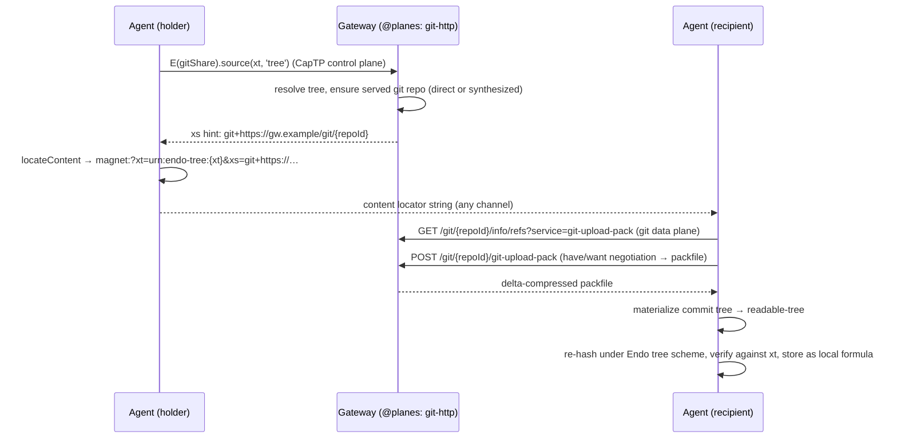

# Endo Content Plane: Git over HTTP (`endo-content-plane-git-http`)

| | |
|---|---|
| **Created** | 2026-07-18 |
| **Author** | Kris Kowal (prompted) |
| **Status** | Not Started |

> **Read [endo-content-locators-magnet-urn](endo-content-locators-magnet-urn.md) first.**
> This is a follow-up back-plane design that design explicitly reserves
> ([§ Follow-up back-planes](endo-content-locators-magnet-urn.md), *Git over HTTP*).
> It assumes the content-locator grammar, the `@planes` registry, the
> `ContentDataPlane` contract, and Design Decisions 5 (untrusted plane, `xt` is
> the trust root) and 11 (readable-tree `xt` hashing scheme) from that design in
> one-line form and extends them; it does not re-introduce them.

## What is the Problem Being Solved?

The content-locator design ([endo-content-locators-magnet-urn](endo-content-locators-magnet-urn.md))
lands **one** data plane end to end — the HTTP **web seed** (`ws`), a direct
`GET /content/{sha256hex}` that returns raw bytes for a blob and a canonical
`tar` archive for a tree — and defines a `ContentDataPlane` **registry** so
further planes can be added as **individual, incremental** designs, each
extending the source-hint vocabulary. It names **Git over HTTP** as the strong
candidate for the **second** plane, "the natural carrier for readable-**tree**
content", precisely because most of its substrate already exists.

The web-seed plane is the right minimal proof, but it is a poor **tree** carrier:

- **It re-downloads the whole tree every time.** A `ws`-tar source serves the
  tree's entire canonical archive on every fetch, with no negotiation. A
  recipient who already holds a *prior version* of the same tree (the common
  case for source trees under revision) still pays for the full payload.
- **It has no delta or object reuse.** Trees under active work differ by a few
  files between versions; a bulk tar cannot exploit that. Git's smart-HTTP
  protocol negotiates `have`/`want` and ships a delta-compressed packfile,
  transferring only the objects the recipient lacks.
- **A tree *is* a git tree.** Endo already models immutable revision-backed trees
  on git ([daemon-git-capability](daemon-git-capability.md)), already serves the
  git **smart-HTTP** protocol from the Gateway
  ([gateway-package](gateway-package.md) § Feature 3), and already runs the
  CapTP-control / HTTP-data split for git bulk bytes
  ([daemon-git-remotes](daemon-git-remotes.md)). Serving readable-tree content
  over git-over-HTTP reuses machinery that is built rather than co-designing a
  new bulk protocol.

So this design registers a **second** `ContentDataPlane`: a Gateway that vends a
**read-only, content-scoped smart-HTTP git endpoint** for a readable-**tree**,
and a source hint that names the clone URL and ref. It sits beside the web-seed
plane in exactly the extensibility slot the parent reserved: the web-seed `ws`
source remains the blob carrier and a tree fallback; the git source becomes the
**preferred** tree carrier where both are advertised.

The one genuinely new problem this plane must solve — the one the parent design
flags by name in its follow-up entry — is **reconciling the readable-tree `xt`
(the Endo tree-JSON content hash, per Design Decision 11) with git's own tree
identity**, which is a *different hash over a different serialization*. That
reconciliation is [§ Reconciling `xt` with git tree identity](#reconciling-xt-with-git-tree-identity)
below, and it is what keeps the plane honest under the parent's Design Decision 5
(every plane is untrusted; `xt` is the trust root).

## Design

### Where this plugs into the landed registry

The parent design's Phase 3 landed the registry
(`packages/daemon/src/content-data-plane.js`) and its Phase 4 (the web-seed
plane, PR endojs/endo-but-for-bots#792) lands the first `ContentDataPlane`
value and the `@planes` sharing capability that a Gateway vends. The relevant
landed shapes this plane conforms to, unchanged:

```ts
// packages/daemon/src/types.d.ts (landed)
type ContentIdentity   = { hash: string; kind: 'blob' | 'tree' };
type ContentSourceHint = { plane: string; payload: string };  // plane ∈ ws|xs|as|tr
type ContentDataPlane  = {
  name: string;
  source: (hash: string, kind: ContentKind, share: unknown)
    => Promise<ContentSourceHint[]>;
  fetch?: unknown;  // Phase 4/5 verifying-fetch hook
};
```

`makeContentDataPlaneRegistry()` exposes `register(plane)`,
`getAllContentSources(entries, identity)`, and (Phase 4)
`getPlaneForSource(letter)`. A plane's `source` returns `[]` when it cannot
serve the given content — the parent's explicit "returns [] if this plane cannot
serve the given content right now" contract. This design adds exactly one
`register(makeGitHttpContentDataPlane(...))` call and one Gateway-vended share
maker; it changes **no** existing plane and **no** grammar letter (see
[§ Design Decision 1](#design-decisions)).

### The two halves, mirroring the web-seed plane

The web-seed plane is two values: `makeHttpContentDataPlane(fetch)` (the
recipient-side plane, registered on every daemon: `source` + verifying `fetch`)
and `makeHttpContentShare(gatewayAddress)` (the holder-side `@planes` sharing
capability a Gateway vends). The git plane mirrors that shape exactly.

**Holder side — `makeGitHttpContentShare(gatewayAddress, serveTree)`.** The
capability a Gateway puts into an agent's `@planes` directory. Its `source`
advertises this Gateway's git endpoint for a tree, and returns `[]` for a blob:

```js
// sketch, mirroring packages/daemon/src/http-content-plane.js
export const makeGitHttpContentShare = (gatewayAddress, serveTree) =>
  Far('git-http content share', {
    /** @param {string} hash @param {ContentKind} kind */
    source: async (hash, kind) => {
      if (kind !== 'tree') return harden([]);       // blobs stay on web seed
      // Ask the Gateway to begin serving a read-only, content-scoped git repo
      // whose advertised commit's tree is exactly this readable-tree, and to
      // report the clone URL + ref.  This is the control-plane act.
      const { repoId, ref } = await E(serveTree)(hash);
      const url = new URL(`git/${repoId}`, gatewayAddress);
      // git+ scheme prefix is the payload disambiguator (Design Decision 2).
      return harden([{ plane: 'xs', payload: `git+${url.href}#${ref}` }]);
    },
  });
```

**Recipient side — `makeGitHttpContentDataPlane(powers)`.** Registered on the
daemon; understands the `xs` + `git+` payload, fetches over smart-HTTP, and
returns **bytes-or-tree for the caller to verify** — it never returns content as
trusted:

```js
export const makeGitHttpContentDataPlane = ({ boundedHttp, materializeGitTree }) =>
  harden({
    name: 'git-http',
    sourcePlanes: harden(['xs']),           // claims xs, disambiguated by git+ prefix
    async source(hash, kind, share) {
      if (kind !== 'tree') return harden([]);
      return E(share).source(hash, kind);
    },
    /**
     * Fetch a readable-tree over git-over-HTTP.  The caller re-hashes the
     * returned tree under the Endo readable-tree scheme and verifies it against
     * `xt` before trusting it — this plane never asserts identity itself.
     */
    async fetch(hint, _hash, kind) {
      if (hint.plane !== 'xs' || !hint.payload.startsWith('git+')) {
        throw makeError(`git-http plane cannot fetch ${q(hint.plane)}`);
      }
      if (kind !== 'tree') throw makeError('git-http plane serves trees only');
      const { cloneUrl, ref } = parseGitSource(hint.payload);   // strips git+, splits #ref
      // Bounded, credential-free, read-only upload-pack fetch into scratch/CAS.
      const gitTree = await E(boundedHttp).uploadPackFetch(cloneUrl, ref);
      // Materialize git objects → an Endo readable-tree (a NEW local formula).
      return materializeGitTree(gitTree);   // caller re-hashes → verify → copy semantics
    },
  });
```

The parenthetical division of labor is deliberate: this file names *what* to
fetch and *how* to turn a git tree into a readable-tree; the **verification gate
and the copy-into-CAS** stay in the shared `loadContent` path the parent's Phase
5 owns, so every plane feeds the same hash-verification wrapper and no plane can
return unverified content as trusted.

### The source hint: `xs` with a `git+` payload

The parent grammar reserves `ws` / `xs` / `as` / `tr`
(`ContentSourcePlane = 'ws' | 'xs' | 'as' | 'tr'`). This plane **reuses `xs`**
— the *exact / verifiable source* letter — rather than coining a new one:

```
magnet:?xt=urn:endo-tree:{sha256hex}&dn={name}&xs=git+https://gw.example/git/{repoId}#{ref}
```

`xs` is apt because a git endpoint is a **verifiable** source: whatever it
serves is re-hashed against `xt` before use, so the letter's "verifiable source"
semantics hold literally. The payload is a `git+`-prefixed clone URL with the
ref as a URL fragment. A tree may carry **both** a `ws` (web-seed tar) and an
`xs` (git) source; `loadContent` prefers the git source for a tree and falls
through to the web-seed tar, then to in-band CapTP
([§ Design Decision 3](#design-decisions)).

Reusing `xs` surfaces one **registry refinement** the second plane is the first
to need, and which the parent's Phase-4 `getPlaneForSource(letter)` does not yet
express: a single magnet letter can map to **more than one** plane once
BitTorrent (also a follow-up, also an `xs`/`tr` claimant) arrives. The minimal
refinement is to resolve `(letter, payload)` rather than `letter` alone — each
candidate plane tests the payload's scheme prefix (`git+` here, a `magnet:`/
`urn:btih:` shape for BitTorrent) and the first that claims it wins. This design
proposes that refinement and is content to be the forcing function for it; it is
a small, additive change to `getPlaneForSource`, not a grammar change.

### Serving side: a read-only, content-scoped git endpoint

The Gateway already hosts the git **smart-HTTP** protocol
(`info/refs?service=git-upload-pack` + `git-upload-pack`) with the repo formula's
exo exposing `gitUploadPack(reader, writer)`
([gateway-package](gateway-package.md) § Feature 3). This plane serves the
readable-tree over exactly that machinery, with two deliberate departures from
Feature 3's shape, both flowing from the parent's model that a content locator
is a **read-capability-by-content**, not an object capability:

1. **Read-only, `upload-pack` only.** No `git-receive-pack`; a content endpoint
   is never writable. The recipient can `clone`/`fetch`, never `push`.
2. **Content-scoped and unauthenticated.** Feature 3 authenticates with a
   formula-identifier bearer token granting the authority of a repo *handle*.
   A content endpoint instead serves **exactly one tree's content** — like the
   web-seed's `/content/{hash}`, the address itself is the whole grant, and a
   wrong or unreachable URL just falls through. It conveys no authority over the
   agent or its other formulas.

Two cases for producing the served git objects, from the two ways a readable-tree
can be backed:

- **Git-backed tree** (a `GitTreeProvider` result, an `EndoMount` over a git
  worktree, or an immutable revision-backed tree per
  [daemon-git-capability](daemon-git-capability.md)): the Gateway serves
  `upload-pack` directly over the backing object store, advertising the commit
  whose tree is the readable-tree. No synthesis needed.
- **CAS-backed tree** (an Endo tree-JSON in the content store, not git-backed):
  the Gateway **synthesizes** git objects — a git blob per leaf, a git tree per
  directory, and one commit — from the CAS tree on demand, then serves
  `upload-pack` over the synthesized pack. This is the inverse of the existing
  git-tree → CAS import ([daemon-git-capability](daemon-git-capability.md)
  § Bulk Tree Data Plane, the `git archive` tar path and its `MakeFromTree`
  materialization). The synthesis is deterministic and cacheable: the same CAS
  tree always yields the same git objects, so a content-addressed git mirror can
  be memoized per `xt`.

`serveTree(hash)` (the second argument to `makeGitHttpContentShare`) is the
Gateway-side method that resolves the readable-tree for `hash`, ensures a served
git repo exists (direct or synthesized), and returns `{ repoId, ref }`. It is
the git analogue of the web-seed Gateway's `fetchContent(hash, 'tree')`, and
lives beside it on the Gateway exo.



### Reconciling `xt` with git tree identity

This is the crux the parent design names. A readable-tree's `xt` is the SHA-256
of the Endo **tree-JSON** serialization — the root tree-JSON hash the CAS keys
on, which recursively references child blob/tree hashes
(`manager.js` `getContentIdentityForId` returns `formula.content` for a
`readable-tree`; `collectTransitiveTreeHashes` walks the tree-JSON). Git, by
contrast, identifies a tree by hashing its **own** object serialization (mode +
name + child-oid entries, in git's canonical order). **These are different
hashes over different byte layouts and never coincide.** There is no shortcut by
which a git tree/commit oid can stand in for `xt`.

The reconciliation is therefore *transport uses git identity; trust uses `xt`*:

1. **Git identity is transport-and-dedup only.** The commit/tree oids the
   endpoint advertises exist to drive smart-HTTP negotiation and object reuse.
   The recipient need neither trust nor even retain them.
2. **`xt` is re-established by re-serialization.** After the pack arrives, the
   recipient materializes the commit's tree into an Endo readable-tree
   (tree-JSON + child blobs in CAS), computes the tree-JSON hash, and
   **verifies it equals `xt`**. A mismatch — a malicious mirror, a wrong ref, a
   corrupted pack, a Gateway that synthesized the wrong tree — is rejected, and
   `loadContent` falls through to the next source. This is the parent's Design
   Decision 5 applied unchanged: the git plane is an **untrusted** data plane;
   the mirror must be *available*, not *trusted*.
3. **Empty/degenerate cases.** An empty tree, symlinks, and executable-bit
   entries must round-trip: the git↔readable-tree materialization obeys the same
   validation rules as the existing archive path
   ([daemon-git-capability](daemon-git-capability.md) § Bulk Tree Data Plane —
   absolute paths, `..`, NUL bytes, duplicate entries, and unsupported modes are
   rejected during trusted extraction), and the mode/symlink handling must be
   explicit so the re-serialized tree-JSON is byte-identical to the holder's.
   Any mode git can express that the readable-tree model cannot (e.g. gitlinks /
   submodule entries) makes a tree **not** git-servable, and `serveTree` reports
   that so `source` returns `[]` and the tree stays on the web-seed plane.

**Robust to the CASK hashing change (Design Decision 11).** The parent reserves
the right to change the readable-tree hashing scheme when CASK is integrated
(Rabin-fingerprinting, GC-transparent child hashes). Because this plane **never**
relies on git identity equalling `xt` — it re-hashes under whatever the current
Endo scheme is — the git-over-HTTP transport is **unaffected** by that change.
Only the verification/materialization step swaps its hash function; the serving
and fetching machinery is untouched. This is a direct benefit of keeping git
identity strictly on the transport side of the boundary, and is the reason the
`xt`/git-identity split is drawn exactly here rather than trying to align the two
serializations.

### Recipient network authority

The recipient's `fetch` clones an **advertised, third-party** URL — unlike
[daemon-git-remotes](daemon-git-remotes.md), where a `GitRemote` is a
pre-authorized bundle bound to a local `Git`. So the fetch must **not** confer
ambient network authority. It runs through a **bounded outbound-HTTP authority**
(`@endo/fetch` / an `HttpClient`-shaped cap, [endo-fetch](endo-fetch.md)),
origin-checked against the recipient's policy, **credential-free**, and
**`upload-pack`-only** (never `receive-pack`, never a call-time URL the guest
supplies). The same "no ambient git config, no ambient credential helpers,
argv-array spawn, sanitized environment" hardening from
[daemon-git-remotes](daemon-git-remotes.md) § Transport and Backend Boundary
applies to any native-git backend used for the anonymous clone. A recipient
whose policy does not allow the advertised origin simply cannot use that source,
and falls through — the content locator remains advisory.

### Incremental transfer (the payoff) and its limit

The reason to prefer git for trees is object reuse: if the recipient retains a
git mirror of a *related* tree, smart-HTTP negotiation ships only the delta. The
**minimal** design does a full anonymous clone + materialize + verify every
time, which already delivers git's delta-compression *within* one pack but not
*across* fetches. Cross-fetch reuse (a recipient-side content-addressed git
mirror keyed so a prior version's objects are offered as `have`s) is a natural
**optimization follow-up**, not part of the minimal plane; it interacts with GC
of the mirror and is out of scope here. The minimal plane is already a strict
improvement over the web-seed tar for any tree large enough that
delta-compression pays for the protocol overhead.

## Dependencies

| Design | Relationship |
|---|---|
| [endo-content-locators-magnet-urn](endo-content-locators-magnet-urn.md) | The parent. Defines the `ContentDataPlane` registry, `@planes`, the magnet grammar, `loadContent`/`storeContent`, and Design Decisions 5 and 11 this plane extends. This is the reserved *second* back-plane. |
| [gateway-package](gateway-package.md) | § Feature 3 (Git over HTTP, smart-HTTP `upload-pack`, repo-formula `gitUploadPack`) is the serving substrate. This plane departs from it in being read-only and content-scoped rather than authenticated-repo-handle. |
| [daemon-git-remotes](daemon-git-remotes.md) | The CapTP-control / HTTP-data split this generalizes, and the native-git hardening (sanitized env, no ambient credentials, argv-array spawn) the recipient clone reuses. |
| [daemon-git-capability](daemon-git-capability.md) | § Bulk Tree Data Plane and the git-tree ↔ CAS materialization (`git archive` tar path, `MakeFromTree`) — the inverse of the CAS→git synthesis on the serving side and the model for the recipient materialization. |
| [daemon-cas-management](daemon-cas-management.md) | The tree-JSON content store whose hash is `xt` and the re-hash verification target. |
| [endo-fetch](endo-fetch.md) / [cli-http-client](cli-http-client.md) | The bounded, credential-free outbound-HTTP authority the recipient clone runs through. |
| [endo-fs-from-git](endo-fs-from-git.md) | The git-tree → readable read-surface direction that informs both the CAS→git synthesis and the recipient materialization. |

## Phased implementation

1. **Source hint and grammar reuse.** Teach the content-locator parser/formatter
   that `xs` may carry a `git+`-prefixed payload with a `#ref` fragment
   (round-trip invariant tests; no network). Refine `getPlaneForSource` to
   resolve `(letter, payload)` so `xs` can route to git-http vs a future
   BitTorrent plane by payload prefix.
2. **Recipient plane (`makeGitHttpContentDataPlane`).** `name: 'git-http'`,
   `sourcePlanes: ['xs']`, `source` (delegates to the share, `[]` for blobs),
   and `fetch` (bounded `upload-pack` clone → git-tree materialization → returns
   the readable-tree for the shared verification gate). Register it on the daemon
   beside the web-seed plane.
3. **Serving side — git-backed trees.** `serveTree(hash)` on the Gateway for a
   tree already backed by git: resolve the commit, expose a read-only
   content-scoped `/git/{repoId}` `upload-pack` endpoint, return `{ repoId, ref }`.
   `makeGitHttpContentShare(gatewayAddress, serveTree)` for `@planes`.
4. **Serving side — CAS synthesis.** Synthesize deterministic git objects (blob /
   tree / commit) from a CAS tree-JSON on demand for trees not already
   git-backed; memoize the synthesized mirror per `xt`. Extend `serveTree` to
   cover this case.
5. **`xt` reconciliation and verification.** The git↔readable-tree
   materialization with explicit mode/symlink/empty-tree handling and the
   untrusted-entry validation rules; wire the re-hash-against-`xt` check into the
   shared `loadContent` verification gate; source-preference ordering (git before
   web-seed tar before in-band CapTP for trees). Non-git-servable trees
   (unsupported modes) report so `source` returns `[]`.
6. **(Follow-up, out of scope) Cross-fetch object reuse.** A recipient-side
   content-addressed git mirror offering a prior version's objects as `have`s,
   with its own GC story.

## Design Decisions

1. **A second `ContentDataPlane`, no grammar change and no existing-plane
   change.** The plane is purely additive: one `register()` call, one
   Gateway-vended share maker. It reuses the reserved `xs` letter rather than
   coining a new magnet parameter, so the `ContentSourcePlane` union is
   untouched.
2. **`xs` + a `git+` payload prefix; disambiguate on `(letter, payload)`.** A
   git endpoint is a *verifiable source*, so `xs` fits its semantics. The `git+`
   scheme prefix disambiguates it from other future `xs` claimants (BitTorrent),
   which forces the small `getPlaneForSource` refinement from resolving a bare
   letter to resolving `(letter, payload)`.
3. **Git is the preferred **tree** carrier; blobs stay on the web seed.** The
   git plane's `source` returns `[]` for a blob (a single git blob is strictly
   worse than a `ws` byte fetch). For a tree, `loadContent` prefers the `xs` git
   source, falls through to the `ws` web-seed tar, then to in-band CapTP.
4. **The served endpoint is read-only and content-scoped, unlike Gateway Feature
   3.** No `receive-pack`; the address is the whole grant (like `/content/{hash}`),
   authenticated by nothing and conveying no authority beyond fetch-and-verify of
   exactly one tree's content. This follows the parent's read-capability-by-
   content model.
5. **Transport uses git identity; trust uses `xt`.** The advertised commit/tree
   oids drive smart-HTTP negotiation and object reuse only. Trust is
   re-established by materializing the fetched tree and re-hashing it under the
   Endo tree-JSON scheme against `xt`. The git plane is an untrusted data plane
   (parent Design Decision 5); a mirror must be available, not trusted.
6. **Robust to the CASK hashing change (parent Design Decision 11) by
   construction.** Because the plane never equates git identity with `xt`, a
   change to the readable-tree hashing scheme swaps only the verification hash
   function; the serving and fetching machinery is untouched.
7. **CAS-backed trees are served by deterministic on-demand git synthesis,
   memoized per `xt`.** Trees already backed by git are served directly. The
   synthesis is the inverse of the existing git→CAS import and reuses its mode /
   symlink / untrusted-entry validation rules.
8. **The recipient clone carries no ambient authority.** Unlike a pre-authorized
   `GitRemote`, the fetch of an advertised third-party URL runs through a
   bounded, origin-checked, credential-free, `upload-pack`-only outbound-HTTP
   authority. A disallowed origin falls through; the locator stays advisory.
9. **Copy semantics, matching the parent.** `loadContent` returns a new local
   content-addressed readable-tree formula (parent Design Decision 10); a
   lazy-streaming remote-backed tree is a future extension, not this plane.
10. **Cross-fetch object reuse is a follow-up, not the minimal plane.** The
    minimal plane does a full anonymous clone + materialize + verify each time,
    already gaining intra-pack delta compression. A recipient-side git mirror for
    cross-fetch `have`-negotiation, with its own GC story, is deferred.

## Open Questions

- **Ref naming for the served endpoint.** Whether the advertised ref is a stable
  synthetic content-addressed ref (`refs/endo/content/{xt}`), `HEAD` of a
  per-content synthetic repo, or the natural branch/tag of a git-backed tree.
  Verification is by re-hash regardless, so this is an addressing/ergonomics
  choice, not a correctness one; settled at implementation.
- **Synthesized-mirror lifecycle.** How long a Gateway retains a synthesized git
  mirror for a CAS tree, and whether it participates in the content-store GC
  ([daemon-content-store-gc](daemon-content-store-gc.md)). The mirror is a pure
  cache (re-derivable from the CAS tree), so eviction is safe; the tuning is
  deferred.
- **Milestone placement, dependency-graph edges, and a size/duration estimate
  for `designs/README.md`** are not yet classified and remain for the next
  journalist classification cycle. This draft is filed as the reserved
  `endo-content-plane-git-http` sibling; the summary-table row and milestone
  wiring are left to that pass, matching how the parent
  ([endo-content-locators-magnet-urn](endo-content-locators-magnet-urn.md))
  deferred the same.

## Prompt

> File the follow-up back-plane design the merged magnet-URN content-locator
> design explicitly reserves
> ([endo-content-locators-magnet-urn](endo-content-locators-magnet-urn.md)
> § Follow-up back-planes): `designs/endo-content-plane-git-http.md`, the
> Git-over-HTTP carrier for readable-TREE content — the strong candidate for the
> SECOND plane because most of its substrate exists (daemon-git-remotes already
> runs the smart-HTTP data plane with the CapTP control split;
> daemon-git-capability's "Bulk Tree Data Plane" section is prior art). Scope:
> the Gateway vends a per-tree smart-HTTP endpoint; the source hint names the
> clone URL and ref; extend the ContentDataPlane registry and source-hint
> vocabulary per the extensibility contract; reconcile the tree `xt` (current
> readable-tree hashing scheme per Design Decision 11) with git tree identity.
> Open a DRAFT design PR. This job promotes only after the HTTP web-seed plane
> merges, so write against the landed registry surface, not a moving one.
>
> (Originating maintainer directive, kriskowal, on
> [kriskowal/garden#34](https://github.com/kriskowal/garden/issues/34).
> Promoted from the content-locator design's reserved follow-up.)
