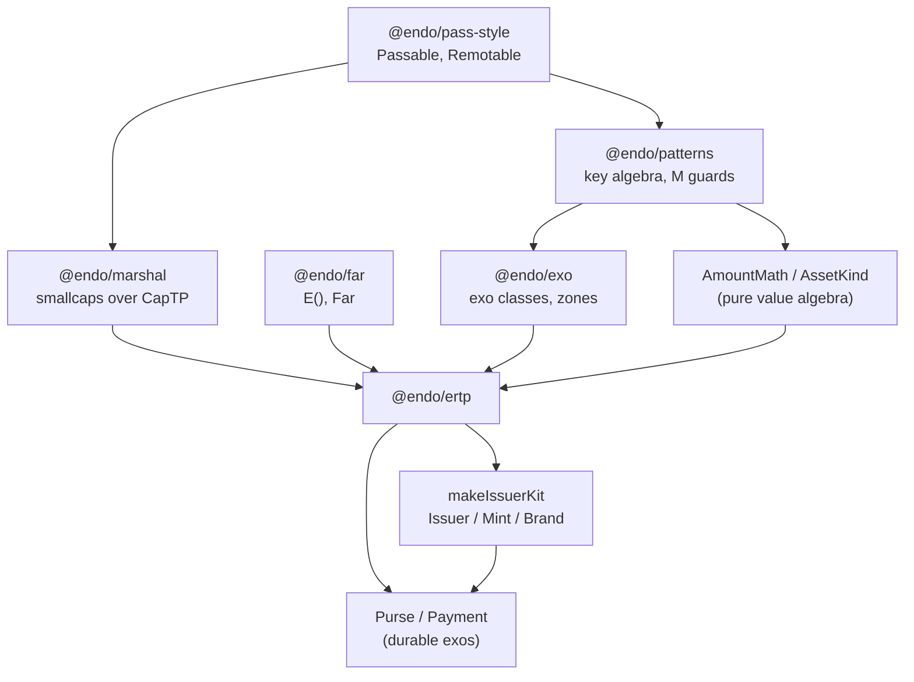
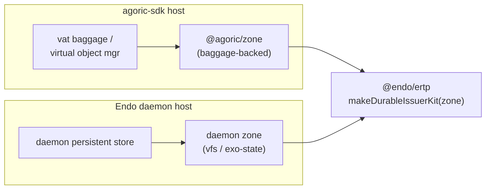

# Recast ERTP as `@endo/ertp`

| | |
|---|---|
| **Created** | 2026-07-17 |
| **Author** | Kris Kowal (prompted) |
| **Status** | Not Started |

## What is the Problem Being Solved?

ERTP — the Electronic Rights Transfer Protocol (Amount, Brand, Issuer, Mint,
Purse, Payment, and the AmountMath / AssetKind value algebra) — lives today in
`agoric-sdk`'s `packages/ERTP`, structurally entangled with SwingSet (its
durability rides vat baggage) and with Zoe (issuer provenance, ZCFMint,
invitation amounts). ERTP is, however, a general-purpose model for conserved,
exclusively-transferable digital rights. Nothing in its core requires a
blockchain, a vat, or a specific contract framework.

The Endo daemon and its agents now need exactly this model — conserved rights
minted, split, and transferred between mutually-suspicious peers over CapTP —
and Endo already ships every primitive ERTP needs (`@endo/pass-style`,
`@endo/marshal`, `@endo/patterns`, `@endo/exo`, `@endo/far`, `@endo/errors`).
This design recasts ERTP as a standalone Endo package, **`@endo/ertp`**, decoupled
from vats / Zoe / SwingSet, and lays out a migration path so `agoric-sdk` can
adopt it rather than fork from it.

The recast is also the vehicle that finally realizes the long-dormant "ERTP v2"
ambitions. A survey of the `agoric-sdk` issue corpus (below) found there is **no
single umbrella issue** titled or tracking "ERTP v2"; the redesign ambition is
distributed across a dozen threads, of which the durability and AmountMath halves
*shipped* under launch pressure while the non-fungible-performance, rights-as-
patterns, and issuer-provenance halves remain open. Tellingly, **no issue in the
corpus proposes extracting ERTP as a standalone package decoupled from
Zoe/SwingSet** — that ambition is implied by the durability-API work but has no
home. This design is that home.

## The surveyed ERTP-evolution corpus

Cited link-free (plain `agoric-sdk issue NNNN` text) to avoid creating upstream
cross-reference backlinks. Grouped by the theme each thread pushes ERTP toward.

**Refactor / vision epics.** amountMath-refactor Epic (`agoric-sdk issue 2311`,
closed — made AmountMath pass-by-copy and static, split absolute vs. relative
brand checks; the archetype of ERTP modernization), `ERTP — Nice to Have`
(`issue 2365`, closed), `ERTP Updates Required for Applications` (`issue 2232`,
closed), `Small Zoe/ERTP Tasks` (`issue 3959`, closed), `EPIC: Zoe/ERTP Audit
Issues` (`issue 4059`, open — the closest live cross-cutting tracker),
`Add design.md to ERTP` (`issue 12432`, open).

**Durability / upgrade** (the "v2" half that shipped). `Durability for ERTP`
(`issue 5333`, closed — the umbrella), `feat(ertp): durability` (`issue 5283`,
merged), `plan for durable/non-durable/soft-durable tests in ERTP/zoe/contracts`
(`issue 5593`, closed — durability *tightens* the API contract: everything stored
must be durable-compatible, a requirement pushed onto every client), `Virtual
objects and virtual stores for ERTP` (`issue 4504`, closed), `Make purses virtual
objects` (`issue 2841`, closed), `turn Payments back into Remotables`
(`issue 3356`, closed — a **partial reversal** of virtualization, walked back for
RAM/GC reasons), `add "destroyLedgerWithFailure"?` (`issue 3434`, closed).

**AmountMath / AssetKind.** `Algebraic properties of amounts` (`issue 557`, open —
formalize amount as a commutative group per asset kind), `Amounts should be
parameterized (Amount<V>)` (`issue 2845`, closed — blocked historically on JSDoc
default type params), `Rename amountMathKind/mathKind to assetKind`
(`issue 2849`, closed), `rename identity to additiveIdentity` (`issue 3587`,
closed), `Only allow bigint NatValues` (`issue 3960`, closed), `Protect against
accidental arithmetic of Amounts` (`issue 2064`, closed), `setMathHelpers leaks
history-dependent ordering` (`issue 4261`, closed — set ordering over remotables
is a covert channel), `min()/max() incorrect for non-fungibles` (`issue 6691`,
closed).

**Issuer / mint / purse / payment.** `payment ledger can just store values`
(`issue 3167`, open — the ledger need not store whole Amounts, since the brand is
constant), `Require ERTP Issuers made through Zoe contracts` (`issue 3717`,
closed — issuer provenance), `Mark/Stamp non-standard ERTP Issuers?`
(`issue 4237`, closed), `Need so-called "use objects"` (`issue 4320`, closed —
rights both exercisable and exclusively transferable across upgrade), `fixed total
supply limit for a mint` (`issue 2140`, closed).

**Non-fungibles / performance** (the live dormant frontier). `Improved
representation of Non-fungibles amounts in ERTP` (`issue 10920`, open — needs a
Store for non-scalar values; O(N) CopyBag insert/delete must be fixed before real
NFTs), `KREAd triggers expensive ERTP NFT handling` (`issue 8862`, closed — the
diagnosis), `cryptic "Withdrawal failed" on copyBag withdraw` (`issue 8132`,
open).

**Rights as patterns (Want Patterns).** `NFTs are easy to specify` umbrella
(`issue 2334`, open), `Want Patterns Implementation Plan` (`issue 2230`, open —
match invitations by instance/description, not opaque handle), `Express shared
rights` (`issue 397`, open — ERTP today expresses only exclusive rights but was
intended to express shared rights too), `Amount Patterns test cases`
(`issue 2355`, open).

**Brand metadata / provenance.** `remove getDisplayInfo()` (`issue 10235`, open),
`deprecate getDisplayInfo` (`issue 9220`, closed), `update boardAux when new ERTP
brands are added` (`issue 8627`, open) — a coherent arc pulling display metadata
*out of* the brand object into a published surface, reducing phishing surface.

**Security / audit.** `Purple Team Vulnerability Assessment of ERTP + Zoe`
(`issue 4264`, closed), input-validation hardening (`issues 4057 / 3885 / 3046`,
closed), `Zoe is gullible to issuer's allegation of brand` (`issue 1378`, closed).

## Design: `@endo/ertp`

### The core model on Endo primitives

ERTP's shapes map onto Endo passable types with no adaptation layer:

- **Amount** is a passable `copyRecord` `{ brand, value }` — already a plain
  `@endo/pass-style` Passable. No change; existing amounts marshal across CapTP
  today.
- **Brand, Issuer, Mint, Purse, Payment** are Remotables. In `@endo/ertp` they are
  **`@endo/exo`** instances (`Far`/exo facets) rather than hand-rolled `Far()`
  objects with hand-written argument coercion. Each carries an `M.interface`
  method guard, so shape validation at the trust boundary is declarative — this
  directly retires the hand-written input-validation work the audit threads asked
  for (`issues 4057 / 3885 / 3046`, `4264`).
- **AmountMath** is a pass-by-copy static module of pure functions over
  `(AssetKind, value)`, exactly the shape `agoric-sdk issue 2311` landed. Its set /
  copySet / copyBag algebra is **delegated to `@endo/patterns`' key algebra**
  (`keyEQ`, `elementsIsSuperset`, bag union / difference, `rankOrder`) rather than
  re-implemented. This is the largest structural win: `agoric-sdk`'s AmountMath
  predates mature `@endo/patterns`, so its set-math lives in bespoke
  `mathHelpers`; the recast makes AmountMath a thin brand-coercing wrapper over the
  key algebra Endo already ships and tests. The covert-channel bug in set ordering
  (`issue 4261`) and the non-fungible comparison bug (`issue 6691`) are resolved by
  construction, because `@endo/patterns` defines the total order and the
  incomparability semantics once.
- **AssetKind** ∈ `nat | copySet | copyBag` (with legacy `set` as a deprecated
  alias). `nat` values are `bigint` (`issue 3960`); the copy kinds are
  `@endo/patterns` CopySet / CopyBag. `Amount<K extends AssetKind>` is expressible
  as a real TypeScript generic under Endo's `.ts`-types-index convention, which
  clears the JSDoc blocker that stalled `issue 2845`.

### Durability decoupled from SwingSet: the Zone seam

ERTP's durability in `agoric-sdk` is welded to SwingSet: `defineDurableKind`
rooted in vat `baggage`. `@endo/ertp` breaks that weld by taking a **Zone power**
(the `@agoric/zone`-shaped abstraction over `@endo/exo`: `zone.exoClass`,
`zone.mapStore`, `zone.weakMapStore`) as a maker argument, rather than importing a
durability mechanism. The value algebra is zone-free; only the stateful facets
(the `paymentLedger`, purse balances, mint supply) touch the zone.

- **Heap zone** → ephemeral issuer kits (tests, transient agents).
- **Durable zone** → persistent kits. The zone's stores are the system of record.

The durability requirement `issue 5593` flagged — everything stored must be
durable-compatible — becomes a property of the injected zone, not a global ERTP
constraint. The `paymentLedger` stores bare **values** keyed by payment, not whole
Amounts (`issue 3167`), reconstituting the Amount at the method boundary; with the
brand constant per ledger this saves store space and falls out naturally from the
zone-store shape. The `Payments-back-to-Remotables` reversal (`issue 3356`) is
re-expressed as a zone choice: payments are heap-zone exos (Remotables) even when
the ledger is durable, so their identities need not survive upgrade — the ledger
does.

In the Endo daemon, the durable zone is backed by the daemon's own persistence
(the exo-state / vfs store), so `@endo/ertp` durability rides Endo's durability
story, never SwingSet's baggage:

### How the dormant ERTP v2 propositions fold in

| v2 ambition (corpus) | `@endo/ertp` disposition |
|---|---|
| AmountMath pass-by-copy static (`2311`) | Satisfied — carried as the design's baseline |
| Amount parameterized `Amount<V>` (`2845`) | Satisfied — real TS generics via types-index |
| Algebraic laws for amounts (`557`) | Satisfied — laws become property tests over the `@endo/patterns` key algebra reference |
| assetKind / naming cleanup (`2849`, `3587`, `3960`, `2064`) | Satisfied — adopted natively |
| Set-order covert channel, non-fungible min/max (`4261`, `6691`) | Satisfied by construction (delegated to `@endo/patterns`) |
| Durability / upgrade participation (`5333`, `5283`, `5593`) | Satisfied — mapped onto the Zone seam |
| Payment ledger stores values (`3167`) | Satisfied |
| Declarative input validation / audit hardening (`4057`, `3885`, `4264`) | Satisfied — `@endo/exo` method guards |
| Non-fungible store performance (`10920`, `8862`, `8132`) | **Deferred** — needs a non-scalar Store; see roadmap Phase 4 |
| Rights as patterns / Want Patterns (`2334`, `2230`, `2355`) | **Deferred** — Zoe-adjacent; a sibling design |
| Shared (non-exclusive) rights (`397`) | **Deferred** — needs its own model; noted, not built |
| Issuer/brand provenance, published metadata (`3717`, `4237`, `8627`, `10235`) | **Partially deferred** — `@endo/ertp` drops `getDisplayInfo` from the brand and expects an out-of-band metadata surface, but the published registry is out of scope |

### Migration path and interop

`@endo/ertp` is a **source-compatible reimplementation** of `packages/ERTP`'s
public surface (`makeIssuerKit`, `AmountMath`, `AssetKind`, `amountMath` helpers).
Migration is by adoption, not fork:

1. `@endo/ertp` lands and is exercised on the Endo daemon (its first consumer),
   where there is no legacy amount population to preserve.
2. `agoric-sdk`'s `@agoric/ertp` becomes a **thin adapter** that re-exports
   `@endo/ertp` and supplies `@agoric/zone` as the zone power, plus the
   Agoric-specific glue that must stay in `agoric-sdk`: ZCFMint, invitation
   amounts, vbank / bridge integration, board / nameHub, and smart-wallet ERTP
   plumbing. This preserves **brand and issuer identity** — the migration must not
   parallel-reimplement the kit, because a brand minted by the old code must remain
   `===` to the same brand under the new code for existing purses and payments to
   validate. Re-export (not reimplementation) is the mechanism.
3. Cross-boundary interop is already free: amounts are plain `copyRecord`s under
   `@endo/marshal` smallcaps, so an amount minted under `@endo/ertp` and an amount
   under `@agoric/ertp` are structurally identical over CapTP.

**What moves vs. what stays.** Moves to `@endo/ertp`: the core `makeIssuerKit`,
AmountMath, AssetKind, and the Issuer/Mint/Brand/Purse/Payment exo definitions.
Stays in `agoric-sdk`: everything coupled to Zoe or cosmos — ZCFMint, invitation
issuer semantics, vbank, board publication, smart-wallet.

## Dependencies

| Design / package | Relationship |
|---|---|
| `@endo/patterns` | Value algebra + `M` interface guards — the AmountMath substrate |
| `@endo/exo` | Exo classes and the Zone abstraction for durable facets |
| `@endo/pass-style`, `@endo/marshal`, `@endo/far`, `@endo/errors` | Passable/Remotable, CapTP marshalling, `E()`, structured errors |
| A Zone abstraction in Endo | **Open** — either vendor a minimal `@endo/zone` or take an abstract zone-power interface that agoric's `@agoric/zone` and the Endo daemon each satisfy |

## Phased roadmap

- **Phase 0 — value core.** `Amount`, `AmountMath`, `AssetKind` as a pure,
  zone-free module over `@endo/patterns`. Property tests encode the `issue 557`
  group laws. No remotables, no durability. Ships independently useful.
- **Phase 1 — heap issuer kit.** `makeIssuerKit` as heap-zone `@endo/exo` classes
  with `M.interface` guards; `paymentLedger` stores values (`issue 3167`).
- **Phase 2 — durable kit via the Zone seam.** `makeDurableIssuerKit(zone)`;
  daemon-backed durable zone adapter (vfs / exo-state). Upgrade-participation tests
  modeled on `issue 5593`.
- **Phase 3 — agoric interop.** `@agoric/ertp` re-exports `@endo/ertp` and injects
  `@agoric/zone`; brand-identity-preservation test; migration guide. Boatman
  ferries the Endo-side package upstream when authorized.
- **Phase 4 — deferred v2 frontier (separate designs, to be filed).** Non-scalar
  Store for NFT-scale copyBag purses (`issue 10920`); shared-rights model
  (`issue 397`); Want-Patterns integration (`issue 2230`) — each its own design,
  none blocking Phases 0–3.

## Design Decisions

1. **AmountMath delegates to `@endo/patterns`, not bespoke mathHelpers.** The key
   algebra is already defined, tested, and canonical in Endo; re-implementing it
   would re-introduce the exact set-ordering and comparison bugs the corpus logged.
2. **Durability is an injected Zone power, not an imported mechanism.** This is the
   single edit that decouples ERTP from SwingSet while letting `agoric-sdk` keep
   its baggage-backed durability unchanged. The seam is the whole point of the
   recast.
3. **Migration is re-export, not reimplementation.** Preserving brand/issuer
   remotable identity across the boundary is a hard correctness constraint;
   `@agoric/ertp` adopts `@endo/ertp` rather than mirroring it.
4. **Considered and rejected: a parallel from-scratch `@endo/ertp` that agoric
   later reconciles to.** Reason: it forks brand identity and guarantees a painful,
   possibly impossible, reconciliation of live on-chain amounts.

## Open Questions

- Package name: `@endo/ertp` vs. `@endo/exo-ertp`? The `exo-` convention marks
  `@endo` packages whose primary surface is passable interfaces over CapTP, which
  the Issuer/Mint/Purse facets are — yet the package's canonical, headline exports
  (`Amount`, `AmountMath`) are pure passable *data*, not CapTP interfaces, and
  "ERTP" is an established protocol name. Proposed: `@endo/ertp`; flagging the
  convention tension for the maintainer.
- Does Endo want its own minimal `@endo/zone`, or should `@endo/ertp` take an
  abstract zone-power interface that both `@agoric/zone` and the Endo daemon's
  store satisfy? The latter keeps Endo free of an agoric dependency but requires
  pinning the zone interface `@endo/ertp` depends on.
- Where does the durable store physically live in the Endo daemon — a dedicated
  store formula, the exo-state, or the vfs? (Interacts with the daemon durability
  and mount designs.)
- Does `@endo/ertp` drop `brand.getDisplayInfo()` outright (following `issue 9220`
  / `issue 10235`) and require an out-of-band metadata surface, or retain it for
  source-compatibility during migration?
- Shared rights (`issue 397`): in scope as a deferred Phase-4 design, or
  explicitly out of the `@endo/ertp` charter?

## Prompt

> Research the Agoric ERTP-evolution issue corpus (especially the long-dormant
> "ERTP v2" proposition — issuer/mint/purse redesign, durable/upgradable ERTP,
> ERTP decoupled from Zoe/SwingSet, amount-math and asset-kind rework,
> invitation/rights modeling) read-only, then design `@endo/ertp`: ERTP recast as
> a standalone Endo package built on Endo primitives and decoupled from
> vats/Zoe/SwingSet, with the dormant v2 propositions folded in, a migration path
> and interop story with agoric-sdk's ERTP, open questions and risks, and a phased
> roadmap. Keep agoric/agoric-sdk comment-and-link-free: cite issues in plain
> non-linking text.
