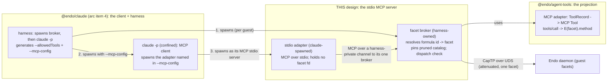

# A stdio MCP server scoped to one guest's tool-call surface

| | |
|---|---|
| **Created** | 2026-09-08 |
| **Author** | endolinbot (prompted) |
| **Status** | Not Started |

## What is the Problem Being Solved?

A confined `claude -p` running as the inference engine for one Endo guest
([endo-claude](endo-claude.md), arc item 4) has every built-in tool denied
(`--tools ""`) and reaches the world only through the Model Context Protocol
surface named in its generated `--mcp-config`. That surface has to be a real MCP
server, speaking MCP over **stdio**, that projects exactly **one guest's**
tool-call surface and no other's, with the guest denoted by its 64-hex formula
identifier. This document specifies that server: the transport, how the formula
id scopes it, how the tool catalog is derived and pinned, what happens when the
child dies, and how the tool names survive the denied built-in set without
colliding with the reconciled reserved names.

### Why this is its own document, not an extension of an existing one

Every neighboring design describes the **HTTP-plus-bearer** surface and stops
short of stdio. [endo-gateway-mcp](endo-gateway-mcp.md) Design Decision 6 puts
stdio explicitly **out of scope** ("Streamable HTTP only; no stdio"); that surface
terminates JSON-RPC over a listening port authenticated by an `Authorization:
Bearer` header. [daemon-agent-tools](daemon-agent-tools.md) owns the *capabilities* the
tools project, not any transport. The three minion.town companions
(`mcp-daemon-guest-tools`, `mcp-endo-guest`, `mcp-oauth`) are the browser-facing
OAuth 2.1 deployment. And [endo-claude](endo-claude.md) is the **client** side:
it names the stdio server (a claude-spawned adapter plus a harness-owned facet
broker) as an "adapter-implementation prerequisite ... rather than in scope of
this design." So there is a real, named gap: nobody has specified the stdio MCP
server itself, the one thing a process spawned as a child of the daemon on the
same host actually needs, where OAuth is neither available nor meaningful. This
document fills exactly that prerequisite and composes with the
[endo-agent-tools](endo-agent-tools.md) MCP-adapter projection rather than
reinventing it; this document does not re-derive endo-claude's client flags.

## Division of labor with the neighboring designs

The diagram below names five terms the next section defines in full; a one-line
gloss up front so the boxes read on first pass (define-before-diagram): a
**guest** is a confined counterparty the Endo daemon grants an attenuated set of
capabilities to; the **harness** is the arc-item-4 `@endo/claude` caplet that
spawns and supervises that guest's confined `claude -p`; a **formula id** is
Endo's stable 64-hex identifier for the persistent recipe that instantiated a
guest; a **facet** is the attenuated capability handle the daemon hands out for
one guest's daemon-side object surface; and **CapTP** is Endo's capability
transport protocol, carried here over a Unix domain socket (UDS).

[endo-claude](endo-claude.md) decides **when** to spawn, **with what flags**, and
generates the per-guest `--allowedTools` from the same pinned catalog this server
pins. [endo-agent-tools](endo-agent-tools.md) owns the **projection** (mapping a facet's
tool set to an MCP `tools/list` catalog, and an MCP `tools/call` to
`E(facet).<method>(args)`), present today as a declared stub at
`packages/agent-tools/src/adapters/mcp.js`. This document owns the **server**
that hosts that projection over stdio and enforces the one-guest boundary: the
two-process adapter/broker seam, the catalog pinning and server-side dispatch
check, the fail-closed rules, and the naming.

## Scoping by formula identifier (the confinement boundary)

This is the centerpiece. The server must speak for exactly one guest, and a
compromised or confused Claude must not be able to reach a different guest.

A **guest** here is a confined counterparty the Endo daemon grants an attenuated
set of capabilities to, and the **harness** is the arc-item-4 `@endo/claude`
caplet that spawns and supervises that guest's confined `claude -p` (both defined
in full by [endo-claude](endo-claude.md)). A **formula id** here is Endo's stable
64-hex identifier for the *formula* (the
persistent recipe) that instantiated a guest (content-derived and not something
the guest can mint or vary to name a different guest), and a **facet** is the
attenuated capability handle the daemon hands out for one guest's daemon-side
object surface (defined in full by the linked [endo-claude](endo-claude.md) and
[daemon-agent-tools](daemon-agent-tools.md)).

**The server is told which guest once, at construction, out of band from the
client.** The formula id never travels on the MCP wire and is never accepted from
the confined process. The harness-owned **facet broker** is constructed with the
64-hex formula id, validated against `/^[0-9a-f]{64}$/` (the same boundary
[endo-claude](endo-claude.md) asserts in `makeGuestInference`), resolves it to the
guest facet against the daemon's ambient powers **before `claude` is spawned**,
holds the resulting attenuated CapTP connection, and pins the pruned catalog
(below). The confined `claude -p` process is then spawned with a `--mcp-config`
that names the stdio **adapter** as its one server. The adapter carries no
designator: it forwards MCP frames to the one broker it was wired to. So "which
guest" is a property of the broker's construction, not a value the client can
name, forge, or vary per call.

**Why a compromised Claude cannot reach another guest**, stated as a chain of
structural facts rather than a policy check:

- The confined process holds **no daemon-socket fd**. The raw connected CapTP fd
  lives in the harness-owned broker and is **never inherited** into the
  claude-spawned process tree. A built-in leaked past `--tools ""` therefore has
  no descriptor on which to speak raw CapTP, and no socket path in reach (the
  path is additionally hidden by the required `@endo/claude-sandbox` slice, per
  [endo-claude](endo-claude.md) Design Decision 6; scrubbing `ENDO_SOCK` alone is
  not the boundary because `whereEndoSock` re-derives the default path from an
  empty env, `packages/where/index.js`).
- The confined process holds **no formula id and no bearer**. Unlike the HTTP
  transport, where the formula id is the `Authorization: Bearer` on one shared
  endpoint (a routing designator complected with a secret), the stdio server
  carries **no endpoint, no port, no header, no shared surface**. There is
  nothing to steal, replay, or point at a different id.
- The adapter can reach **only its one broker**, and the broker holds **only its
  one pre-resolved facet**. The channel between them is not spawned by the
  adapter (that would make the broker per-call, contradicting its one-per-guest
  lifetime below): the **broker owns and listens on** a harness-private endpoint,
  a per-guest **filesystem-path** UDS whose path the harness bakes into the
  adapter's `--mcp-config` command line, and to which the adapter connects at
  startup. That path is a *wire to the one broker*, not a guest designator:
  connecting to it reaches only the broker's one pre-resolved facet behind the
  server-side dispatch check, so even a built-in that discovered the path
  escalates nothing. It lands at the same one-facet boundary the adapter already
  sits behind. Even arbitrary code execution inside the confined `claude` tree
  bottoms out at the one guest's pinned catalog.

**Why a sibling guest cannot dial this broker (the socket-discovery boundary).**
The escapes-nothing claim above covers a leak *within* the same guest's confined
tree. The cross-guest case (a compromised process in guest A's tree discovering
and dialing guest B's broker) needs a named OS mechanism, not just an
"unguessable address" argument, because the naive choice would be enumerable
host-wide: an **abstract-namespace** UDS is scoped by *network* namespace, not
mount namespace, and every abstract address bound on the host is listed in the
world-readable `/proc/net/unix`, so any co-resident process could enumerate every
guest's broker and `connect()` to it. This design therefore rules the abstract
namespace **out** and closes the vector with two concrete, layered mechanisms:

  1. **A filesystem-path socket re-mounted into each per-spawn slice.**
     The broker binds its UDS at a path under a **stable per-guest** directory
     created `0700` and **owned by the harness outside any single spawn's
     ephemeral tree** (disjoint from `whereEndoSock`, the way
     [endo-claude](endo-claude.md) Design Decision 7 keeps its per-spawn
     credential directory disjoint from the daemon socket path). This rests on one
     lifetime mismatch a careful reader must not miss, resolved by one move:
     - **The mismatch.** The `@endo/claude-sandbox` slice is created **per spawn**,
       not per guest ([endo-claude](endo-claude.md) Design Decisions 6 and 7 render
       confinement-relevant paths into a fresh
       `.../endo-claude-spawn/<sessionTag>/` tree "created per spawn" and mount only
       that tree into the slice). The broker and its socket, by contrast, are **one
       per guest** and outlive every one of those ephemeral slices (§ *Process
       lifetime and topology*). So a persistent per-guest socket cannot simply
       "live inside" a namespace that is torn down and recreated on every spawn.
     - **The resolution.** The harness **re-mounts the same stable per-guest
       broker-socket directory into each freshly created per-spawn slice**
       (structurally the same per-spawn scoped-mount move Design Decision 7 makes
       for its per-spawn credential *files*), while excluding every *sibling*
       guest's broker-socket directory and the raw daemon socket path from that
       slice's view. Note the scope difference: Design Decision 7 mounts a
       per-spawn credential directory, not a per-guest broker-socket directory, so
       re-mounting a *per-guest* socket path into each *per-spawn* slice is a
       **new cross-document obligation** this design places on
       [endo-claude](endo-claude.md)'s slice construction and on
       [endo-posix-sandbox](endo-posix-sandbox.md)'s mount plumbing, not plumbing
       either already specifies. It is carried as such in the Open Questions
       section below, symmetric with the broker-teardown obligation.
     - **The resulting isolation.** A filesystem-path UDS is reachable only by a
       process that can traverse to its path. A sibling guest, whose per-spawn
       slices receive only *its own* broker-socket directory, cannot name, `stat`,
       or `connect()` to a path absent from its filesystem view, and the address is
       absent from `/proc/net/unix`'s abstract-socket listing entirely. Cross-guest
       socket discovery is thus a structural absence, resting on the *same*
       per-spawn scoped-mount primitive the daemon socket and credential files
       already rely on rather than on secrecy.
  2. **`SO_PEERCRED` peer verification at `accept`.** As defense in depth against
     a misconfigured or shared namespace, the broker reads the connecting peer's
     credentials (`SO_PEERCRED`: pid/uid/gid) at accept and admits only a process
     belonging to this guest's confined tree. The matching predicate is a single,
     deterministic one: a **per-guest uid** the sandbox assigns to every process it
     spawns for this guest (**not** a bare pid). Two independent reasons rule the
     bare-pid match out, so the uid is *the* mechanism, not an interchangeable
     alternative:
     - **Concurrency forces it.** The broker is reused across a guest's
       **sequential and concurrent** inferences (§ *Process lifetime and
       topology*), and each concurrent `claude -p` spawns its **own** adapter
       subprocess with a **distinct pid**, all dialing this one broker socket. A
       pid-matched check authorizes exactly one adapter pid and would reject the
       legitimate concurrent siblings; only a per-guest uid (shared by every
       adapter the sandbox spawns for the guest) admits the whole legitimate set.
     - **Pid reuse breaks it.** A pid is a recyclable OS handle, not a stable
       identity for "the process the harness spawned as this guest's adapter." If a
       legitimate adapter exits (the per-call `claude` cycling per § *Process
       lifetime and topology*) and the kernel recycles its pid before the broker
       updates any expected-peer record, an unrelated process that lands the
       recycled pid would pass a pid check *by construction, not by attack*. A
       per-guest uid is stable for the entire life of the confinement boundary and
       has no such window.
     A connection whose peer uid is not this guest's assigned uid is refused before
     a single MCP frame is read, so even if a sibling reached the path, the
     peer-identity check rejects it. This per-guest-uid assignment is a stated
     precondition of this check that [endo-posix-sandbox](endo-posix-sandbox.md)
     does **not** yet commit to (it specifies an unrelated `uid_map` sizing probe,
     not a contract that distinct guests receive distinct host-visible uids); as
     with the re-mount above, requiring it is a **new cross-document obligation**
     this design places on the sandbox, carried in the Open Questions section
     below rather than assumed as settled. Where a deployment cannot assign one (a
     single-uid sandbox), the filesystem-path mount isolation of mechanism 1
     remains the load-bearing boundary and this credential check degrades to a
     coarse same-uid gate rather than a false per-guest guarantee; the Test plan's
     negative-confinement criterion exercises **both** the assigned-uid path and
     this degraded fallback so the admitted-real degraded case is not left
     untested.

Naming the primitive is the point: the boundary is network/mount-namespace
isolation plus peer-credential verification, not an unguessable address on a
shared surface.

This is the "isolation is per-process, not per-bearer" model
[endo-claude](endo-claude.md) names: many guests mean many broker+adapter pairs,
each private, with the daemon's one shared socket sitting *behind* the brokers,
never in front of a confined process. The two processes are kept distinct
**because** collapsing them re-opens the boundary: a single-process stdio server
that opened the daemon socket itself would first hold the *full* many-guest
`captp0` endpoint and only voluntarily narrow to one facet (a runtime choice by
code inside the confinement, not a structural absence), and its connected fd
would sit in the confined process's own descriptor table.

## Tool catalog derivation

The catalog is derived **once, at broker construction, and pinned**: the single
pinned, pre-pruned `tools/list` snapshot that [endo-claude](endo-claude.md)
Design Decision 2 requires, driving **both** the client-side `--allowedTools` and
the **server-side dispatch check**. This document owns the server half of that
contract.

- **One snapshot, pruned before pinning.** At construction the broker takes one
  `tools/list` from the projection over the resolved facet, then prunes (in the
  snapshot itself, before it is pinned) any name containing `__`, any
  dunder/reserved-property name (`__proto__`, `constructor`, `prototype`,
  `__getMethodNames__`), and any code-evaluation name (`evaluate`, `eval`,
  `define`). The pinned value is a `harden`ed null-prototype record, never a bare
  `Map` (freezing a `Map` leaves `set`/`delete` reachable on internal slots, so a
  "pinned" `Map` could be re-populated with `evaluate` after pinning).
- **The dispatch check is the boundary; `--allowedTools` is the belt.** The
  broker **rejects any `tools/call` whose name is not in the pinned snapshot**,
  server-side, so a leak that ignores the client-side `--allowedTools` still
  cannot reach a withheld or code-eval tool. Withholding a tool is *pruning its
  name from the pinned snapshot*, not subtracting it from the client flag.
- **Arguments, not only names (the argument-scope check), as defense in depth.**
  Surviving petname-designating tools (`lookup`, `list`, `move`, `copy`, `remove`)
  take **petname** arguments (a petname being a guest-local nickname bound to a
  capability in that guest's own name table), and `executeTool(name, args)` does
  not itself constrain `args`. The facet is **not** otherwise open here:
  [daemon-agent-tools](daemon-agent-tools.md) § Granting already resolves
  capability-valued petname arguments **fail-closed against the guest's own
  petstore**, and path arguments are authenticated by the mount or git capability
  at that boundary. So a guest can only ever name capabilities and paths already
  inside its one facet's attenuated surface, and cross-facet reach *by argument*
  is foreclosed at the facet before the broker looks. The broker's
  **argument-scope check** is therefore **defense in depth**, not the sole gate
  standing between the guest and another facet: it re-checks, server-side, that a
  `tools/call`'s arguments fall within the facet's attenuated surface and
  **rejects** (never silently narrows) one that does not, returning the same
  visible `-32001` JSON-RPC error a name-level rejection returns. To avoid a
  second, independently-maintained copy of the facet's scope policy (which would
  drift from the facet's own petstore resolution), the check derives its answer
  from the **same lookup the facet already owns**: the broker resolves each
  argument's petname through the facet's own fail-closed petstore resolution as a
  **pre-flight call**, and treats a resolution failure as the rejection, rather
  than maintaining a separate authorization table. This keeps a single source of
  truth for "which capabilities are in scope"; its distinct value over letting the
  facet fail at dispatch time is only the wire shape below. Its distinct
  value over relying on the facet alone is a **uniform, reject-only wire shape**:
  an out-of-scope argument surfaces as the same visible failure the caller can see,
  never as a narrower success it mistakes for what it asked, regardless of how the
  underlying facet chooses to fail. (Where [endo-claude](endo-claude.md) Design
  Decision 2 describes this same server-side check as one that "rejects **or
  attenuates**" an out-of-scope-argument call, this document's reject-only rule is
  the narrower, authoritative form for the server half of the contract it owns: the
  "or attenuates" branch is **superseded**: an out-of-scope argument is always a
  visible rejection here, never a silently attenuated success.) This is explicitly
  a **per-call policy** check, distinct from the cross-guest boundary of § *Scoping
  by formula identifier* (which is purely structural and needs no policy check):
  the structural facts confine every call to the *one* facet, and the
  argument-scope check re-confirms, at the server, that a call stays *within* that
  one facet's attenuated surface.
- **Projection source.** The membership set is the broker's own pinned catalog
  against whichever surface is live: the static Lal tool set today
  ([endo-gateway-mcp](endo-gateway-mcp.md) *Tool catalog*), or the capability-
  scoped [daemon-agent-tools](daemon-agent-tools.md) surface once it composes in
  via the projection's `extra` seam. The server does not invent a derivation; it
  is the same enumeration the projection already performs for `tools/list`.

**Pinned at spawn, not discovered live; mid-session capability change is
deliberately not honored.** `tools.listChanged` is advertised **false**. If the
guest's granted capabilities change while a broker is live, the pinned catalog
does **not** change, and the broker does not emit a `notifications/tools/list_changed`.
Two reasons make this the correct behavior rather than a limitation:

1. **Client/server agreement.** The client's `--allowedTools` was generated from
   the same snapshot the broker pinned. A catalog that grew live would expose,
   server-side, tools the client's allow-list does not name, and a catalog that
   shrank live would leave the client naming tools the server now rejects. Both
   are divergence; pinning keeps the two halves derived from one value that never
   moves.
2. **Staleness is bounded by broker teardown, not by call lifetime.**
   [endo-claude](endo-claude.md) spawns a fresh `claude -p` per inference, but
   that freshness is a property of the **client** process only: the entity that
   holds and enforces the pinned catalog is the **broker**, which is one per guest
   and *outlives* an individual call (§ *Process lifetime and topology*). So a
   fresh client says nothing about the staleness of the server-side pinned value
   that answers every one of those fresh clients identically. What actually bounds
   staleness is **broker teardown**: a legitimately changed grant is picked up
   when the broker is reconstructed and takes a **new** snapshot, not on the next
   client spawn against a still-live broker. Keeping the client/server agreement of
   reason 1 from diverging on a long-lived guest therefore **requires that
   re-provisioning a guest's grants tears down and reconstructs the broker** (any
   capability-set change, not only full revocation), so the pinned catalog is never
   older than the last grant change. This is an obligation this design **places on**
   the harness lifecycle owned by [endo-claude](endo-claude.md), not a guarantee it
   can lean on today: that document specifies per-call cancellation and pool
   occupancy (§ *Local deployment*, § *Pooling subscriptions*) but does **not** yet
   commit to capability-grant-triggered broker teardown. Adopting that teardown is a
   **new cross-document obligation** on [endo-claude](endo-claude.md) (carried as
   such in the Open Questions section below), rather than settled behavior this
   staleness argument may assume. Continuity of a long line of thought is an
   Endo-side capability, never live catalog mutation (that design's threaded-session
   extension).

The narrower open question is only whether to *add* an explicit,
capability-gated re-pin that refreshes the catalog **without** a full broker
teardown (see below); the teardown-and-reconstruct default above already keeps
the agreement sound, so the open question is an optimization, not a gap in the
invariant.

## The stdio transport

**Framing.** The server speaks the MCP stdio transport: JSON-RPC 2.0 messages on
the adapter's stdout, one message per line, delimited by `\n` **only**, each line
a single UTF-8 JSON object with **no embedded newline**. stdin carries the
client's requests in the same framing. **stderr is never protocol**: it carries
logs and diagnostics out of band, read by the harness, never by the peer parser.
The adapter splits strictly on `\n` (it does not also split on `\r`, `U+2028`, or `U+2029`; Node's
`readline` is non-compliant here, as the lesson [endopi-stdio-rpc-bridge](endopi-stdio-rpc-bridge.md)
records). This is the transport MCP clients reach when they "run a local shim
subprocess," the pattern [endo-gateway-mcp](endo-gateway-mcp.md) names for stdio
clients.

**`initialize`.** The adapter answers with `serverInfo: { name: "endo", version }`
(the fixed `mcp__endo__` label of § *Naming*) and the same self-identifying
`initialize` **response shape** [endo-gateway-mcp](endo-gateway-mcp.md) uses. The
two sibling transports share the handshake *shape*, not the label *string*: each
pins its own `serverInfo.name` (`endo` here, `endo-gateway` in
[endo-gateway-mcp](endo-gateway-mcp.md)). So an implementer reconciling both
transports reads two deliberately distinct server-identity labels for the same
projection, one per transport, not a single shared name. This server further sets
`tools: { listChanged: false }`
(reflecting the pinned catalog) and, optionally, `logging: {}` so facet
diagnostics can ship back as `notifications/message` (whether to advertise
`logging` at all is an open question, since stderr already reaches the harness
out of band). `resources` and `prompts` are omitted, as in
[endo-gateway-mcp](endo-gateway-mcp.md).

**Process lifetime and topology.**

- The **adapter** is spawned **by `claude`** as the command its `--mcp-config`
  names. It lives for the one `claude -p` process's lifetime and exits on EOF
  when `claude` closes its stdin or exits. It holds no facet fd and no daemon
  connection; it forwards each frame to its broker over the harness-private
  channel and writes the reply back.
- The **broker** is spawned **by the harness** (the item-4 caplet), **one per
  guest**, and **outlives an individual call**: it is reused across a guest's
  sequential and concurrent inferences. It is torn down when the guest's
  inference capability is revoked or its `cancelled` promise settles.
- So the answer to "spawned per agent or shared" is: the MCP **server the client
  sees (the adapter) is spawned per call**; the facet **broker is one per
  guest**; there is **no shared multi-guest server** (that is the HTTP shape).

**When the child dies.**

- **`claude` dies** (crash, timeout kill, cancel): its stdin closes, the adapter
  reads EOF and exits, and the broker observes its channel to that adapter close
  and settles that call's per-`sessionTag` state, **without** disturbing any
  other call multiplexed on the same guest's broker. Per-call cancel scoping is
  the broker's `sessionTag`-keyed cancel token ([endo-claude](endo-claude.md)
  *Pooling subscriptions*): a `tools/call` is refused iff its own `sessionTag`
  token is canceled, so canceling call A never blocks call B on the same
  broker.
- **the broker dies** (or its daemon connection drops): the adapter's forward
  fails, and it returns an MCP JSON-RPC **error** for the in-flight `tools/call`
  (never a fabricated success). The harness observes the failure and settles the
  inference to `{type: 'bridge-down', detail}` ([endo-claude](endo-claude.md)
  Design Decision 8). The broker **fails closed**: a lost facet connection
  serves errors, never an ambient or re-widened surface.

## Fail-closed behavior

An empty or underivable catalog is an **error at construction**, never a running
server that exposes zero tools. Concretely, the broker **refuses to construct**
(throws, so the harness never spawns `claude`) when:

- the formula id is not 64-hex, or does not resolve to a guest facet;
- the projection over the resolved facet yields **no** tools; or
- the catalog is **empty after pruning** (every projected name was unsafe/code-eval).

**A discriminated construction throw, matching the request-time shape.** The
construction throw is not undifferentiated: it carries the same `reason`-style
discriminant the request-time table below models, so an operator or harness reading
a construction failure gets the same "why, and what to do about it" clarity a
request-time failure gives, and can branch on config bug versus attacker-shaped
guest versus implementation bug. The discriminant values are `invalid-formula-id`
(not 64-hex or unresolvable), `empty-facet` (the projection yields zero tools),
`empty-after-prune` (every projected name was unsafe/code-eval), and
`malformed-catalog` (a projected name that is `__`-containing, dunder/reserved,
code-eval, internally duplicate, or case-confusable: the well-formedness guard of
§ *Naming*). The parity with the request-time surface is of **grammar**, not only
of "there is a discriminant field": both surfaces use compound hyphenated-kebab
discriminant values (`name-scope`/`argument-scope` at request time; the four values
above at construction), so a single harness parser reads the same string shape on
both. This unifies both construction-throw sites (this section's derivation
refusals and § *Naming*'s well-formedness refusals) under one discriminated failure
the harness reads exactly as it reads the request-time `data.reason`.

A zero-tool server that "passes confinement by exposing nothing" is the exact
anti-pattern this rule rejects: confinement must be demonstrated positively (the
guest's real tools can be invoked), not by an empty surface. This mirrors
[endo-claude](endo-claude.md) Design Decision 2's empty-catalog throw and its
positive-confinement test. At **request** time the same posture holds: an unknown
`tools/call` name is a JSON-RPC error, a malformed frame is an error, and the
server never falls back to an unscoped surface on any error path.

**Distinct wire-visible error shapes per failure class.** The model must be able
to tell "you're not allowed to call this" from "the backend just died," a
distinction that decides whether to retry, rephrase, or give up. So each
request-time failure class carries its own JSON-RPC error, not one
undifferentiated error, and the adapter is a pass-through that relays the broker's
classification without
collapsing it:

| Failure class | JSON-RPC error | Retry? |
|---|---|---|
| Malformed frame / not valid JSON-RPC | `-32700` parse error / `-32600` invalid request | client bug: fix and resend |
| Unknown method (not `tools/list`/`tools/call`) | `-32601` method not found | no |
| Policy rejection (name or arguments outside the pinned catalog / facet scope: the dispatch check, including the argument-scope check) | application code `-32001` `tool-not-permitted`, `data.reason` = `name-scope` \| `argument-scope` | no (the surface will not widen) |
| Broker or daemon connection down (the harness-side `bridge-down`) | application code `-32010` `bridge-down`, `data.detail` mirroring the harness's `{type: 'bridge-down', detail}` | transient (the harness may respawn on the next call) |
| **Facet method threw** (an in-catalog, in-scope `tools/call` that *reached* the facet and the target application code raised, for example `readText` on a missing path) | **not** a JSON-RPC error: a successful `tools/call` **result** with `isError: true` and the failure in the result `content`, the standard MCP "the tool ran and failed" shape; the harness settles it to `{type: 'facet-threw', method, error}` ([endo-claude](endo-claude.md) Design Decision 8), carrying `error: toPassableError(caught)` | application-level: up to the model, given the surfaced error |

The first four rows are **protocol** failures (the request was refused *before or
instead of* invoking the facet method): the wire carries a JSON-RPC **error**
response. The last row is an **application** failure (the request was in-catalog,
in-scope, dispatched, and the facet method itself threw): the tool *ran*, so per
the MCP tool-call contract the wire carries a successful JSON-RPC **result** that
carries `isError: true`, with `content` describing the throw, never a JSON-RPC
transport error. Collapsing the two would defeat the very distinction this section exists to
preserve: "you're not allowed to call this" (`-32001`) and "the backend just
died" (`-32010`) are protocol errors, while "the tool ran and the application code
threw" is a normal result the model can read and act on. The broker classifies;
the adapter relays without collapsing, in both directions (a JSON-RPC error stays
an error, an `isError` result stays a result).

The `-3200x`/`-3201x` application codes sit in JSON-RPC's implementation-defined
server-error range and are the wire counterpart of the harness-side typed
outcomes, so the two consumers (the MCP client and the harness) see the same
failure at matching specificity rather than one typed and one opaque. A policy
rejection is never reported as a transport error, `bridge-down` is never reported
as a policy rejection, and a facet-method throw is never reported as either (it is
a tool-result `isError`, not a protocol error at all), so none is mistaken for
another.

## Naming

Claude Code presents an MCP tool to the model as **`mcp__<server>__<tool>`**.
That prefix is exactly what survives the denied built-in set: `--tools ""`
empties the *built-in* tools, while `mcp__<server>__<tool>` names arrive through
`--mcp-config` plus the generated `--allowedTools`
([endo-claude](endo-claude.md) *The tool baseline is fail-closed*). Two naming
obligations follow.

- **The server label is a fixed harness literal**, `endo`, so every tool lands as
  `mcp__endo__<tool>` and the client's `--allowedTools` entries are computable
  from the pinned catalog. It is not guest-derived and cannot be influenced by the
  confined process.
- **The `<tool>` portion is the flat, interface-native name from the reconciled
  namespace**, carrying **no transport or category prefix** (never
  `endo_readText`, never `stdio__readText`). The `mcp__<server>__` prefix that
  namespaces the surface is added by Claude Code, not baked into the tool name, so
  the tool name itself stays in the bare camelCase grammar. The `__`-containing
  names pruned above are pruned partly for this reason: a tool named `foo__bar`
  would render `mcp__endo__foo__bar` and parse ambiguously against the CLI's own
  `mcp__<server>__<tool>` grammar.

**Well-formed names, and no collision the server can actually cause.** The
construction guard enforces exactly the invariants this server *owns*: the
projected catalog must carry no `__`-containing name, no dunder/reserved-property
name, no code-eval name (all pruned above), no two names that duplicate or are
case-confusable twins of each other (`readtext` beside `readText`), and no
malformed name. A projected catalog that violates any of these **throws before
the server ships** (a fail-closed construction refusal, of a piece with the
empty-catalog rule above). These are all properties of *this catalog against
itself*, decidable from the projection alone, with no external artifact in the
pass/fail boundary.

What the guard deliberately does **not** do is fail construction on a bare-name
collision against a *different* MCP server's reserved namespace. The flat naming
convention (interface-native camelCase, no transport/category prefix) is shared
with `kriscendobot/minion.town` PR
[#79](https://github.com/kriscendobot/minion.town/pull/79) (approved in PR
[#77](https://github.com/kriscendobot/minion.town/pull/77)), whose load-time
guard reserves names like `submit`, `invite`, `listReminders`, and
`cancelReminder` ahead of minion.town's *own* future sites/reminders facets. But
this server's label is the fixed literal `endo`, and Claude Code namespaces every
tool as `mcp__endo__<tool>`, so a bare name shared with minion.town's `endo`-**un**prefixed
manifest cannot produce a wire-level collision: the server-scoping already keeps
the two surfaces disjoint. Keying a **security-critical construction throw** on an
**unmerged, externally-owned** reservation list would let a new reserved reminder
name landed by minion.town make an otherwise-correct Endo confinement server
refuse to construct for a guest: an availability failure whose root cause sits
entirely outside this design's change surface. So collision against minion.town's
prospective reservations is demoted to a **construction-time warning**, not a
throw. The warning carries the **same discriminated shape** as the construction
throws above (rather than unstructured stderr text), so the harness can branch on
it the same way: a `{ warning: 'reserved-name-collision', names: [...] }` record
naming the colliding tool names, written to stderr where the harness reads it. The
convention is adopted; the foreign reservation list is advisory, not a gate. What
the server owns and enforces fail-closed is that its own projected names are
well-formed and internally non-colliding.

## Package shape and code home

The **projection** is the `@endo/agent-tools` MCP adapter (the declared stub at
`packages/agent-tools/src/adapters/mcp.js`); implementing it is the
adapter-implementation prerequisite [endo-claude](endo-claude.md) already names.
The **stdio server host** (the claude-spawned adapter, spawned as the
`--mcp-config` command) is a thin `bin` that runs **only the MCP framing loop**:
it decodes a `tools/list`/`tools/call` frame off stdin, forwards it verbatim to
the broker over the harness-private channel, and writes the reply back to stdout.
It does **not** hold the facet, the pinned catalog, or the `tools/call ->
E(facet).method` dispatch; those live entirely in the broker (Design Decision 1),
so this host process never gains daemon or facet reach even though it is the
claude-spawned side. That framing-only host is the same shape as the "standalone
MCP" host [endo-agent-tools](endo-agent-tools.md) describes
(`makeCompartmentEvaluate` "is the host for ... the standalone MCP demo"), and the
analogy is apt precisely because that backend, like this framing loop, has "no
daemon, credentials, or network authority"; the facet-dispatching **projection**
it runs is invoked *by the broker*, on the broker's side of the channel, never in
this claude-spawned process. The **broker** (formula-id resolution, facet
attenuation, catalog pinning, the argument-scope dispatch check, and the projection
that maps `tools/call -> E(facet).method`, plus the harness-private channel) holds
the daemon connection and the ambient powers, so it sits on the harness side that
already holds those powers: the `@endo/claude` caplet instantiates it. The precise split of the broker's logic
between `@endo/agent-tools` and `@endo/claude` follows the fd-ownership boundary
(the daemon-connection-holding half is where powers live) and is settled at build
time; this design fixes the *structure* (two processes, fd never inherited) and
the *contract* (one pinned pruned catalog, server-side dispatch check), not the
module boundary.

Until the `@endo/agent-tools` MCP adapter lands, [endo-claude](endo-claude.md)
carries a minimal stopgap stdio shim gated behind an explicit opt-in and marked
for deletion; this design is the specification that the stopgap and the real adapter
both implement.

## Test plan (acceptance criteria)

The confinement boundary is the centerpiece, so it is demonstrated **positively
and negatively**, mirroring [endo-claude](endo-claude.md) Design Decision 2's
positive-confinement test. An implementation is accepted only when these pass.

**Positive confinement (the surface actually works):**

- **Real tools invoke.** With a broker constructed for a guest whose facet
  projects a non-empty catalog, a `tools/list` returns exactly the pinned,
  pruned catalog, and a `tools/call` for an in-catalog name reaches
  `E(facet).<method>(args)` and returns its result. Confinement is shown by real
  tools working, not by an empty surface.
- **Catalog parity.** The `tools/list` the adapter serves and the
  `--allowedTools` the harness generated for the same guest derive from one
  snapshot: every name in one appears in the other, with no live drift after a
  simulated mid-session grant change (`tools.listChanged` stays false, no
  `notifications/tools/list_changed` is emitted).

**Negative confinement (the boundary holds):**

- **Cross-guest reach is impossible.** Two guests A and B each get a
  broker+adapter pair. A process in A's confined tree cannot reach B's facet:
  (a) B's broker socket path is absent from A's mount-namespace filesystem view
  and from `/proc/net/unix`, so it cannot be discovered; and (b) a connection
  forged directly to B's broker socket from a process whose peer uid is not B's
  assigned per-guest uid is refused at `accept` by the `SO_PEERCRED` check before
  any frame is read. Both peer-check regimes are exercised: the assigned-per-guest-uid
  path (distinct uids per guest, forged sibling refused at `accept`) **and** the
  degraded single-uid fallback (where the sandbox assigns no per-guest uid, the
  filesystem-path mount isolation of mechanism 1 alone keeps A from reaching B's
  socket, and the credential check is a coarse same-uid gate that does not claim a
  false per-guest guarantee). A `tools/call` issued on A's adapter only ever reaches
  A's one facet.
- **Name-scope rejection.** A `tools/call` for a name not in the pinned catalog
  (a pruned code-eval name, a `__`-containing name, or an unknown name) returns
  the `-32001` `tool-not-permitted` error with `data.reason = name-scope`, and
  never reaches the facet.
- **Argument-scope rejection.** A `tools/call` for an in-catalog petname-designating
  tool whose *arguments* designate a petname/path outside the facet's own
  attenuated surface returns `-32001` with `data.reason = argument-scope`: a
  visible rejection, never a silently narrowed success.
- **Fail-closed construction.** Construction throws (claude never spawns) for:
  an unresolvable or non-64-hex formula id; a facet projecting zero tools; a
  catalog empty after pruning; and a projected catalog carrying an internally
  duplicate, case-confusable, `__`-containing, or malformed name. A bare-name
  collision against minion.town's reserved list produces a **warning**, not a
  throw, and construction still succeeds.
- **Fail-closed at request and on broker death.** A malformed frame returns
  `-32700`/`-32600`; an unknown method returns `-32601`; a broker or daemon
  connection drop returns `-32010` `bridge-down` for the in-flight call and never
  a fabricated success or a re-widened surface. Canceling one call's
  `sessionTag`-keyed token never blocks a concurrent call on the same broker.
- **Facet-method throw is a result, not a protocol error.** An in-catalog,
  in-scope `tools/call` whose facet method raises (for example `readText` on a
  missing path) returns a **successful** `tools/call` result with `isError: true` and the
  error in `content` (not a JSON-RPC `-3200x`/`-3201x` error), and the harness
  settles it to `{type: 'facet-threw', method, error}`, distinct from both the
  `-32001` policy rejection and the `-32010` `bridge-down` paths.

## Dependencies

| Design | Relationship |
|---|---|
| [endo-claude](endo-claude.md) | **Consumer / harness.** Spawns the broker and the confined `claude -p`, generates `--allowedTools` from the catalog this server pins, and settles inference outcomes on this server's errors. Names this server as its "adapter-implementation prerequisite." |
| [endo-agent-tools](endo-agent-tools.md) | **Projection.** The MCP adapter (`packages/agent-tools/src/adapters/mcp.js`, a declared stub) that maps a `ToolRecord`'s name/description/parameters/invoke to an MCP tool and dispatches `tools/call` to the facet. This server hosts it over stdio; it does not reinvent it. |
| [endo-gateway-mcp](endo-gateway-mcp.md) | **Sibling transport.** The HTTP-plus-bearer termination of the same projection; Design Decision 6 defers stdio to a local shim, which is this design. Shares the projection, the `initialize` response *shape*, and the `mcp__<server>__<tool>` naming *grammar* (each transport pins its own `serverInfo.name` label, `endo` here vs `endo-gateway` there, so the shape is shared but the label string is not); differs in transport and isolation model (per-bearer on one endpoint there, per-process here). |
| [daemon-agent-tools](daemon-agent-tools.md) | **Future catalog source.** The capability-scoped tool surface that composes into the projection via `extra`; once live it tightens per-guest scoping (each guest's catalog reflects only its granted capabilities). |
| [endo-posix-sandbox](endo-posix-sandbox.md) | **Slice/mount plumbing (new obligations placed here).** Owns the per-spawn slice's mount namespace and uid mapping. This design places two not-yet-specified obligations on it: re-mounting a per-guest broker-socket directory into each per-spawn slice (§ *Scoping* mechanism 1), and assigning a distinct per-guest uid so the `SO_PEERCRED` check (mechanism 2) can be per-guest rather than a coarse same-uid gate. Both are carried in Open Questions until adopted there. |
| [endopi-stdio-rpc-bridge](endopi-stdio-rpc-bridge.md) | **Framing precedent, not the same surface.** Its LF-delimited JSONL framing lesson (split on `\n` only) carries over; but it is a *drive-the-agent* RPC (prompt/steer/abort), not an MCP *tool-call* server, so it is prior art for framing only. |
| `kriscendobot/minion.town` PR [#79](https://github.com/kriscendobot/minion.town/pull/79) | **Naming convention, adopted (not a construction gate).** A cross-repo reference, open and unmerged at the time of writing. This server adopts its flat interface-native camelCase convention; it does **not** key any fail-closed construction throw on that PR's reserved-name list (server-scoping already prevents wire collisions, and a security-critical construction path must not depend on an unmerged external artifact). A bare-name collision against its reservations is at most an advisory warning here. |

## Design Decisions

1. **Two processes, not one; the raw CapTP fd is never in the confined tree.**
   The claude-spawned adapter speaks MCP and holds no facet fd; the harness-owned
   broker holds the one attenuated facet connection. A single-process server that
   opened the daemon socket itself would hold the full many-guest endpoint and
   put its connected fd in the confined process's own descriptor table, making
   one-guest scoping a runtime courtesy rather than a structural absence.
2. **The formula id scopes the broker at construction and never rides the wire.**
   No bearer, no header, no port, no shared endpoint. The confined process holds
   no designator, so it cannot name, forge, or vary the guest. This is the stdio
   counterpart to the HTTP transport's per-bearer routing, and it is strictly
   tighter (nothing secret is on any wire to steal).
3. **One pinned, pre-pruned catalog drives the server dispatch check (boundary)
   and the client allow-list (belt).** Both derive from one hardened
   null-prototype snapshot taken once at construction. The server rejects any
   `tools/call` outside it, names and arguments alike. `tools.listChanged` is
   false; a changed grant is seen on the next spawn's fresh snapshot, not live.
4. **Fail closed at construction and at request time.** An unresolvable formula
   id, a facet with no projectable tools, or an empty post-prune catalog is a
   construction throw (claude never spawns); a projected catalog whose own names
   are malformed, `__`-containing, or internally duplicate/case-confusable is
   likewise a construction throw; an unknown or malformed request is a JSON-RPC
   error. The construction throw keys only on properties of *this catalog against
   itself*, never on an unmerged, externally-owned reservation list (a bare-name
   collision against minion.town's reserved namespace is a warning, not a gate,
   since the fixed `mcp__endo__` server-scoping already prevents any wire-level
   collision). The server never exposes an empty surface as "confined" and never
   falls back to an unscoped one.
5. **Names are flat, interface-native, and reconciled.** The server label is the
   fixed literal `endo`; tool names follow the interface-native camelCase
   convention shared with the minion.town PR #79 manifest, with **no**
   transport/category prefix ever added (the `mcp__<server>__` namespacing is
   Claude Code's, not the tool name's). What is fixed here is the well-formedness
   the server enforces on its own projected catalog (no `__`, no dunder, no
   code-eval, no internal duplicate/case-confusable/malformed name); the shared
   *naming convention* is adopted while the foreign *reservation list* stays
   advisory. *Where* a shared manifest might physically live so a future
   endo-side server could enforce a convention across the repo boundary is left
   to the open question below, not settled by this decision.

## Open Questions

- **The per-guest broker-socket re-mount is a new obligation on the slice
  plumbing.** § *Scoping by formula identifier* mechanism 1 requires the harness
  to re-mount a **per-guest** broker-socket directory into each **per-spawn**
  slice, excluding every sibling guest's. [endo-claude](endo-claude.md) Design
  Decision 7 mounts a per-spawn credential directory, not a per-guest socket path,
  and [endo-posix-sandbox](endo-posix-sandbox.md) does not specify this mount, so
  the re-mount is a new cross-document obligation those two designs must adopt
  (structurally the same scoped-mount primitive, applied to a longer-lived path).
  Confirm the slice construction can mount a per-guest path that outlives the slice
  before the cross-guest negative-confinement test can be built.
- **The `SO_PEERCRED` per-guest-uid assignment is a new obligation on the
  sandbox.** Mechanism 2's peer check keys on a per-guest uid the sandbox assigns
  to every process it spawns for a guest. [endo-posix-sandbox](endo-posix-sandbox.md)
  has no such contract today (only an unrelated `uid_map` sizing probe), so
  distinct-uid-per-guest is a precondition that document must commit to for the
  strong form of the check to hold. Where it cannot (a single-uid sandbox), the
  check degrades to a coarse same-uid gate and the filesystem-path mount isolation
  of mechanism 1 is the load-bearing boundary; the Test plan exercises both
  regimes. Resolve which regime a given deployment is in before relying on the
  per-guest peer guarantee.
- **Where does a shared naming manifest live, if the endo side ever wants
  cross-repo enforcement?** The naming convention is today reconciled in
  `kriscendobot/minion.town` (PR #79). This server enforces only its *own*
  catalog's well-formedness fail-closed and treats minion.town's reservation list
  as advisory, so it needs no dependency on that PR to construct correctly. If a
  future need arises to enforce a *shared* reservation list at the endo side, the
  convention would first duplicate into `@endo/agent-tools` (owned at the point of
  enforcement) rather than reaching across the repo boundary into an
  externally-owned artifact. Resolve if and when such cross-repo enforcement is
  actually required; it is not required for the confinement boundary this design
  centers on.
- **Does a reused, long-lived broker need a capability-gated re-pin?** Fresh
  process per call makes mid-session catalog change moot for a single inference,
  but a broker reused across many calls of a long-lived guest will not observe a
  legitimate grant change until torn down. Safe default: re-provisioning a
  guest's grants tears down and reconstructs the broker. [endo-claude](endo-claude.md),
  which owns the broker lifecycle, must adopt this obligation (it does not state
  teardown-on-reprovision today). Whether an explicit,
  capability-gated re-pin is worth adding **instead of** the teardown is deferred
  to the first consumer that needs a grant change to take effect without a broker
  teardown.
- **Should the stdio server advertise the MCP `logging` capability?** Forwarding
  facet diagnostics as `notifications/message` mirrors
  [endo-gateway-mcp](endo-gateway-mcp.md), but stderr already reaches the harness
  out of band under stdio, so the value of the in-band channel is lower here.
  Decide when a consumer needs the model to see a diagnostic mid-turn.
- **Broker code home.** Whether the broker's daemon-connection-holding half lives
  in `@endo/claude` (with powers) or a new `@endo/agent-tools` server module, with
  only the projection shared, is a build-time module-boundary question this design
  leaves to the build; the structure (two processes, fd never inherited) and the
  contract (one pinned pruned catalog, server-side dispatch check) are fixed here.

## Prompt

> Design a **stdio** MCP server such that a confined Claude has access to the
> tool-call surface **for a particular guest, denoted by formula identifier**.
> This is the surface the caplet of arc item 4 substitutes for Claude's built-in
> tools. Prior art (all HTTP-plus-OAuth): `endo-gateway-mcp`, `daemon-agent-tools`,
> `endo-agent-tools` (endojs/endo-but-for-bots); `mcp-daemon-guest-tools`,
> `mcp-endo-guest`, `mcp-oauth` (kriscendobot/minion.town). The arc needs the
> stdio one, for a process spawned as a child of the daemon on the same host,
> where OAuth is neither available nor meaningful. Decide whether an existing
> design extends cleanly to stdio or warrants its own document, and justify.
> Cover: scoping by formula identifier (the confinement boundary; the centerpiece);
> tool catalog derivation (pinned pre-pruned catalog driving both the allow-list
> and a server-side dispatch check, per `endo-claude`); the stdio transport
> (process lifetime, framing, child death, per-agent vs shared); fail-closed
> behavior (empty/underivable catalog is an error); naming (`mcp__<server>__<tool>`
> shape surviving a denied built-in set, no collision with the reconciled reserved
> names from kriscendobot/minion.town PR #79). Child of arc
> https://github.com/kriscendobot/garden/issues/89 (item 5). Deliverable: one
> design document, created or evolved. Do not build.
