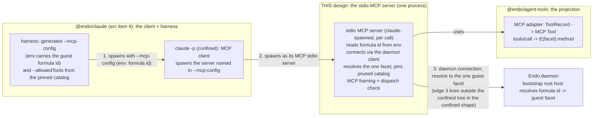

# A stdio MCP server scoped to one guest's tool-call surface

| | |
|---|---|
| **Created** | 2026-09-08 |
| **Updated** | 2026-09-22 |
| **Author** | endolinbot (prompted) |
| **Status** | Not Started |

## Status

Revised 2026-09-17 to adopt the simplification kriskowal requested in the
[PR #1226 review](https://github.com/endojs/endo-but-for-bots/pull/1226#pullrequestreview-5231787250):
**no per-guest domain socket, named pipe, or facet-broker process.** The server
is a single stdio process, spawned by `claude` from `--mcp-config`, that receives
its guest's 64-hex formula id out of band (from the config, via its environment),
uses the usual Endo daemon client to reach the daemon's bootstrap root host, and
resolves that one guest's capability by formula id. The prior draft's two-process
adapter/broker split, per-guest filesystem-path UDS, socket-discovery analysis,
and `SO_PEERCRED` per-guest-uid machinery are removed; § *Scoping* now records
exactly how the confinement properties change under the simpler transport, and
which of them become runtime rather than structural. The broker model is retained
only as the documented multi-tenant hardening path (§ *Design Decisions*, item 1)
should a deployment need structural cross-guest isolation before ocapn's
domain-socket transport lands.

## What is the Problem Being Solved?

A confined `claude -p` running as the inference engine for one Endo guest
([endo-claude](endo-claude.md), arc item 4) has every built-in tool denied
(`--tools ""`) and reaches the world only through the Model Context Protocol
surface named in its generated `--mcp-config`. That surface has to be a real MCP
server, speaking MCP over **stdio**, that projects exactly **one guest's**
tool-call surface and no other's, with the guest denoted by its 64-hex formula
identifier. This document specifies that server: how the formula id is threaded
from the configuration into the server process, how the server reaches the guest
capability through the ordinary daemon client, how the tool catalog is derived and
pinned, what happens when the child dies, how the tool names survive the denied
built-in set without colliding with the reconciled reserved names — and, honestly,
which confinement properties are structural under this transport and which become
runtime.

### Why this is its own document, not an extension of an existing one

Every neighboring design describes the **HTTP-plus-bearer** surface and stops
short of stdio. [endo-gateway-mcp](endo-gateway-mcp.md) Design Decision 6 puts
stdio explicitly **out of scope** ("Streamable HTTP only; no stdio"); that surface
terminates JSON-RPC over a listening port authenticated by an `Authorization:
Bearer` header. [daemon-agent-tools](daemon-agent-tools.md) owns the *capabilities* the
tools project, not any transport. The three minion.town companions
(`mcp-daemon-guest-tools`, `mcp-endo-guest`, `mcp-oauth`) are the browser-facing
OAuth 2.1 deployment. And [endo-claude](endo-claude.md) is the **client** side: it
names the stdio server as an "adapter-implementation prerequisite ... rather than
in scope of this design."

What is genuinely net-new here, and the reason for a separate document, is the
part endo-claude leaves as a bare prerequisite: **how the formula id is threaded
from an MCP configuration entry into the spawned server** (§ *Threading the formula
id from configuration*), **how that server reaches the one guest through the
ordinary daemon client and what authority that hands it** (§ *Scoping*), the
**server half** of catalog pinning and the dispatch check (§ *Tool catalog
derivation*), the request- and construction-time **error-code taxonomy**
(§ *Fail-closed behavior*), and the **naming** rules. This document composes with
the [endo-agent-tools](endo-agent-tools.md) MCP-adapter projection rather than
reinventing it, and does not re-derive endo-claude's client flags.

**A cross-document note.** [endo-claude](endo-claude.md)'s *Local deployment* and
*Multiplexing by guest identifier* sections describe the two-process adapter/broker
split with an fd never inherited into the confined tree. That split is **not** to be
consolidated away (maintainer, PR #1226: "there is more than one way to use Claude
and we expect to use them"): it is the **confined, structural** topology, in which
the harness owns the daemon connection outside the slice. This document adds a
**second, coexisting** topology — a server-held connection for the single-tenant,
non-adversarial deployment that does not confine `claude` against the socket — and
§ *Scoping* carries both. The two documents therefore agree: endo-claude owns the
harness-owned-broker shape, this document owns the server half of the contract common
to both shapes plus the smaller single-tenant shape. No reconciliation-by-consolidation
is owed.

## Division of labor with the neighboring designs

The diagram below names four terms. A one-line gloss up front (define-before-
diagram): a **guest** is a confined counterparty the Endo daemon grants an
attenuated set of capabilities to; the **harness** is the arc-item-4 `@endo/claude`
caplet that spawns and supervises that guest's confined `claude -p`; a **formula
id** is Endo's stable 64-hex identifier for the persistent recipe that instantiated
a guest; and a **facet** is the attenuated capability handle the daemon resolves
for one guest's daemon-side object surface.



The diagram shows the **single-tenant** shape, where the claude-spawned server holds
the daemon connection itself (edge 3). In the **confined** shape the confinement
premise moves edge 3 **out** of the `claude` subgraph: a harness-owned process (a
broker, or a daemon-issued guest-scoped bootstrap) holds the daemon connection
outside the slice, and the claude-spawned server speaks MCP over a channel it is
given rather than opening the socket — because the sandbox denies the confined
`claude` tree the daemon socket (§ *Scoping*). The server-side contract (resolve to
one facet, pin the pruned catalog, dispatch check) is identical either way.

[endo-claude](endo-claude.md) decides **when** to spawn, **with what flags**, and
generates the per-guest `--allowedTools` from the same pinned catalog this server
pins. [endo-agent-tools](endo-agent-tools.md) owns the **projection** (mapping a
facet's tool set to an MCP `tools/list` catalog, and an MCP `tools/call` to
`E(facet).<method>(args)`), present today as a declared stub at
`packages/agent-tools/src/adapters/mcp.js`. This document owns the **server** that
hosts that projection over stdio: how it is told which guest, how it reaches that
one guest's facet, the catalog pinning and server-side dispatch
check, the fail-closed rules, and the naming.

## Scoping by formula identifier (the confinement boundary)

This is the centerpiece. The server must speak for exactly one guest. The mechanism
common to every topology is: the server is told the guest's formula id out of band,
the one guest's facet is resolved through a daemon connection, and **all** traffic is
served against that one facet and no other. What varies — and what the confinement
premise decides — is **where the daemon connection lives**: held by a harness-owned
process outside the confined tree in the confined shape, or by the claude-spawned
server itself in the single-tenant shape (*How the confinement properties change*,
below). The one-guest resolution and the always-dispatch-through-that-guest contract
are identical across both.

**The server is told which guest once, at startup, out of band from the MCP
client.** The 64-hex formula id is delivered through the server process's
**environment**, populated by the harness-generated `--mcp-config` (§ *Threading
the formula id from configuration*). It is validated against `/^[0-9a-f]{64}$/` (the
same boundary [endo-claude](endo-claude.md) asserts in `makeGuestInference`), and
it is **never accepted from the MCP client over the wire**: no `tools/call`, no
`initialize` param, no JSON-RPC field carries or overrides it. So "which guest" is
a property of the server's configured environment, not a value the confined client
can name, forge, or vary per call.

**How the server reaches the guest capability (checked against the daemon client
API).** The server uses the usual Endo daemon client, exactly as
`packages/cli/src/context.js` does: `makeEndoClient` (`@endo/daemon`,
`packages/daemon/src/client.js`) over the socket path
`whereEndoSock(process.platform, process.env, info)` (`@endo/where`,
`packages/where/index.js`) returns a `getBootstrap`, and `E(getBootstrap()).host()`
yields the **bootstrap root host**. That host resolves the configured formula id to
the one guest's value by the agent-only registry method
**`E(host).lookupById(formulaId)`** — guarded as
`lookupById: M.call(IdShape).returns(M.promise())` on `HostInterface`
(`packages/daemon/src/interfaces.js`), where `IdShape` is the formula-identifier
string. This is the concrete daemon-client form of "the root that resolves *any*
formula id against ambient daemon powers" that [endo-claude](endo-claude.md) Design
Decision 8 names, and `lookupById` already exists on the host the ordinary client
reaches, so no new daemon surface is required to reach one guest. Once the one
guest's facet is resolved, **all** subsequent `tools/list` / `tools/call` traffic is
served against **that one facet and no other**: the server drills down to the guest
facet and always dispatches through that guest (maintainer, PR #1226). The confined
`claude` is then free to use whatever authority the guest itself holds — the guest
facet *is* the ceiling, and the MCP surface never widens past it.

**Where the daemon connection lives depends on the confinement posture** (developed
fully in *How the confinement properties change*, below). The socket reach the
resolution above needs is **not** unconditionally granted to the claude-spawned
server: in the confined, potentially-adversarial deployment the sandbox denies
`claude`'s whole tree the daemon socket, so a **harness-owned** process outside the
slice holds the connection and the claude-spawned side speaks MCP over a channel it
is given; only in a single-tenant, non-adversarial deployment does the claude-spawned
server itself open the ordinary client over a socket the slice exposes. Either way
the client can never name a different guest: no other guest's connection, no bearer,
no listening port.

**The ocapn framing.** Over an ocapn session the same operation is a **delivery to
the bootstrap nonce locator (the "gateway") at export offset 0**: the connection's
offset-0 export is the object you deliver the formula-id lookup to, and the daemon
publishes a per-session bootstrap there. ocapn is **not yet ready to use a domain-
socket network transport layer**, so today the server uses the ordinary daemon
client and the root-host resolution above rather than an ocapn offset-0 delivery.
When ocapn's domain-socket transport lands, the offset-0 gateway is the path to a
**scoped** bootstrap (below), and the resolution moves from the root host to that
gateway with no change to this server's catalog, dispatch, or naming contracts.

### How the confinement properties change under this transport

Structural cross-guest isolation means the raw daemon connection lives outside the
confined tree — in a harness-owned process whose fd is never inherited into `claude`'s
slice — so a compromised `claude` has no descriptor on which to speak to the daemon
and no socket path in reach. That is the required posture wherever the sandbox
confines `claude` against the socket; the smaller server-held-connection shape is
available only where it is not. Stated honestly, per property:

- **Formula id never on the MCP wire — preserved.** The id arrives through the
  server's environment from the harness-generated config, never through the MCP
  protocol, and is never read from a client request. What *changes* is that the id
  is now present **inside the confined tree** — in the MCP server's environment (and
  in the `--mcp-config` `claude` reads to spawn it) — where the broker model kept it
  entirely outside. This is acceptable because a formula id is **not a secret
  bearer**: it is content-derived, it names the guest's *own* recipe, and possessing
  it grants nothing without a daemon connection *and* the authority to resolve it.
- **Per-process isolation — preserved.** Each inference is a fresh `claude -p` that
  spawns its own MCP server process (§ *The stdio transport*); each inference has its
  own daemon connection — held by the claude-spawned server in the single-tenant
  shape, or by a per-inference harness-owned broker in the confined shape — and its
  own freshly-pinned catalog. There is **no shared multi-guest server** (that is the
  HTTP shape) and no long-lived multiplexed connection across guests. Isolation is per
  process, not per bearer, exactly as [endo-claude](endo-claude.md) names.
- **Fail-closed on empty/underivable catalog — preserved.** Unchanged: an
  unresolvable formula id, a facet projecting zero tools, or an empty post-prune
  catalog is a construction throw before any tool is served (§ *Fail-closed
  behavior*).
- **Cross-guest isolation — where the daemon connection lives is the boundary, and
  it is not negotiable.** The confinement premise ([endo-posix-sandbox](endo-posix-sandbox.md),
  [endo-claude](endo-claude.md) Design Decision 6) is that the sandbox slice denies
  the confined `claude` — **and its whole spawned process tree** — direct access to
  every system resource, the daemon's Unix domain socket included; the confined agent
  reaches all authority **only** through the MCP surface. **If `claude` can open an
  arbitrary domain socket on the shared host, this design is forfeit** (maintainer,
  PR #1226): a `claude` that can reach the daemon socket itself is not confined at
  all. So the socket must be **structurally out of the slice's reach**, not merely
  "present but relied on not to be misused." This has a direct consequence for a
  claude-**spawned**, in-slice stdio server: because that server lives inside
  `claude`'s slice, a server that itself opened the daemon connection would require
  the socket to be mounted **into** the slice — which grants `claude` the same reach
  and forfeits confinement. **The daemon connection must therefore be held outside
  the confined tree.** That is exactly [endo-claude](endo-claude.md)'s topology: a
  **harness-owned** process (the facet broker) holds the raw connected fd, resolves
  the one guest's facet, and hands the claude-spawned side only MCP over a channel it
  is given; the raw fd is never inherited into the `claude` tree, and the socket path
  is never inside the slice. Cross-guest isolation is then **structural**: the
  confined process has no descriptor and no socket path on which to speak to the
  daemon, so it cannot resolve *any* guest — its own or another — except by asking
  the harness-held connection, which is pinned to its one facet.

**How this constrains where the connection-holding process may live.** The 2026-09-17
simplification collapsed the earlier adapter+broker pair into one claude-spawned
process that holds the daemon connection. Under the confinement premise above that
collapse is only sound where `claude` is **not** being confined against the daemon
socket — a single-tenant, non-adversarial deployment where the guest resolving its
own id over a reachable socket is acceptable and there is no sibling to reach. It is
**not** sound for the confined, potentially-adversarial case, where the socket must
be denied to `claude`: there, a claude-spawned in-slice server cannot be the process
that opens the connection, and the connection lives in a harness-owned process
outside the slice. Both shapes are legitimate and expected — there is more than one
way to run this (maintainer, PR #1226) — so this document keeps **both** rather than
electing one as canonical:

1. **Harness-owned connection (the confined, structural case).** The daemon
   connection is held by a harness-owned process outside the confined tree — either
   the earlier draft's two-process broker, or, better, a daemon that hands that
   process a bootstrap **already scoped to the one guest** (the ocapn offset-0
   gateway brought forward over the daemon UDS: a guest-scoped agent rather than the
   host root, so the connection resolves only this guest and exposes no enumeration
   or host authority). The claude-spawned stdio side speaks MCP over its given
   channel and never holds the raw fd. This is the shape a shared or adversarial host
   **requires**, and it is what makes cross-guest isolation structural.
2. **Server-held connection (the single-tenant, non-confined-against-the-socket
   case).** Where the deployment does not need `claude` denied the socket — one
   guest's own `claude` on a host it already trusts — the claude-spawned stdio server
   may itself open the ordinary daemon client and resolve its one guest. This is the
   smaller shape; it does **not** provide structural cross-guest isolation (the
   connection is inside the confined tree), and it must not be used where the
   confinement premise applies.

Naming the boundary is the point: structural cross-guest isolation is a property of
**where the daemon connection lives** — outside the confined tree — never of formula-id
secrecy. Formula ids are content-derived, not bearer secrets; the design does not lean
on their secrecy for confinement.

## Threading the formula id from configuration

The formula id must reach the server process from the harness's configuration
without ever passing through the MCP client. Two carriers were considered — an
**environment variable** and an **initial stdin handshake message** — and this
design recommends the environment variable.

**Recommended: an environment variable, `ENDO_GUEST_FORMULA_ID`.** Claude Code's
`--mcp-config` entry for a stdio server carries a `command`, `args`, and an `env`
map; the harness populates `env.ENDO_GUEST_FORMULA_ID` with the 64-hex id (and, if
the daemon socket is not at the default `whereEndoSock(...)` path, `env.ENDO_SOCK`).
The server reads the variable once at startup, validates it as 64-hex, resolves the
facet, and never reads it again. This is the natural carrier, needs no protocol
phase, and works regardless of how the server is spawned.

**Rejected in the stdio topology: an initial stdin handshake message.** Under stdio
MCP the server's **stdin is the MCP client's channel** — it is `claude` that writes
the server's stdin, frame by frame, starting with `initialize`. A "handshake
message on stdin" would therefore have to come **from the confined `claude`
itself**, which is exactly the thing this design must not do (the client naming its
own guest is the forgery vector § *Scoping* forecloses). The only way to make a
trusted party write the server's stdin is to interpose a trusted process between
`claude` and the server — which *is* the broker this simplification removes. So in
the stdio topology the stdin handshake is either unsafe (client-supplied) or
self-defeating (reintroduces the broker); the environment variable has neither
problem. (An stdin handshake is the right carrier for a *different* topology — one
where the harness, not the client, owns the server's stdin — but that is not stdio
MCP.)

**The MCP configuration entry.** The generated config names one server:

```json
{
  "mcpServers": {
    "endo": {
      "command": "endo-mcp-stdio",
      "args": [],
      "env": { "ENDO_GUEST_FORMULA_ID": "<64-hex>" }
    }
  }
}
```

The formula id and (when non-default) the daemon socket path ride in `env`. The
catalog is **not** in the config — the server derives it live from the resolved
facet (§ *Tool catalog derivation*) — and the client's `--allowedTools` is generated
separately by the harness from the same pinned catalog. `--strict-mcp-config` pins
`claude` to exactly this one server.

**Avoiding a temporary config file — decided, not left open.** The maintainer asked
to prefer process substitution over a temp config file and, in PR #1226, to pin the
carrier down now rather than defer it. It is already pinned, by the sibling harness
design: [endo-claude](endo-claude.md)'s `--mcp-config` contract (its argv table and
§ *Argv length is an operational ceiling*) records that `claude`'s `--mcp-config` is
**variadic and accepts a JSON file path *or* an inline JSON string**, and that the
harness **always renders it as a file path, never inline JSON** — because an inline
JSON value rides argv and a large catalog would hit `spawn E2BIG`, and because a
positional landing after a variadic `--mcp-config` is an argv-injection sink. This
document adopts that same decision, so the two harness surfaces stay identical:

- **The config is passed as a file *path*, backed by an anonymous pipe or `memfd` —
  no on-disk file.** The harness opens a pipe/`memfd`, writes the JSON, and passes the
  `/dev/fd/NN` (or `/proc/self/fd/NN`) path on argv. There is no temporary file on
  disk to create, secure, or unlink, and the config value never rides argv. This is
  the "avoid a temp file" goal met without inline JSON.
- **Not shell process substitution `<(…)`.** `<(…)` is a *shell* construct, and both
  this server's harness and `claude` are spawned **directly, never through a shell**
  (endo-claude § *Argv order is a confinement boundary*), so `<(…)` cannot be
  expanded; the harness performs the equivalent pipe/`memfd` plumbing itself. The
  fd-based path is read once at startup, so the non-seekable-pipe hazard that would
  break a re-`stat`/re-open consumer does not arise for a single startup read; if a
  future pinned `claude` re-reads config mid-session, back the fd with a `memfd`
  (seekable) rather than a pipe.
- **The formula id never touches a file at all.** It rides in the config's `env` map
  (§ above), delivered to the server process's environment, so even the pipe/`memfd`-
  backed config carries only a non-secret, content-derived id (§ *Scoping*), never a
  bearer.

No `0600` on-disk fallback is needed on the pinned platform (Linux, `memfd`/`/dev/fd`
available); it survives only as the degenerate carrier for a platform without an
fd-path form, and even there the id itself stays in `env`.

## Tool catalog derivation

The catalog is derived **once, at server startup, and pinned**: the single pinned,
pre-pruned `tools/list` snapshot that [endo-claude](endo-claude.md) Design Decision
2 requires, driving **both** the client-side `--allowedTools` and the **server-side
dispatch check**. This document owns the server half of that contract.

- **One snapshot, pruned before pinning.** At startup the server takes one
  `tools/list` from the projection over the resolved facet, then prunes (in the
  snapshot itself, before it is pinned) any name containing `__`, any
  dunder/reserved-property name (`__proto__`, `constructor`, `prototype`,
  `__getMethodNames__`), and any code-evaluation name (`evaluate`, `eval`,
  `define`). The pinned value is a `harden`ed null-prototype record, never a bare
  `Map` (freezing a `Map` leaves `set`/`delete` reachable on internal slots, so a
  "pinned" `Map` could be re-populated with `evaluate` after pinning).
- **The dispatch check is the boundary; `--allowedTools` is the belt.** The server
  **rejects any `tools/call` whose name is not in the pinned snapshot**, server-side,
  so a leak that ignores the client-side `--allowedTools` still cannot reach a
  withheld or code-eval tool. Withholding a tool is *pruning its name from the pinned
  snapshot*, not subtracting it from the client flag.
- **Client/server agreement by shared derivation.** The client's `--allowedTools`
  and the server's pinned snapshot must name the same tools. Both derive from the
  **same facet** with the **same deterministic prune**, so they agree by
  construction: the harness (which already holds daemon authority) derives the
  catalog to generate `--allowedTools`, and the server independently re-derives the
  same catalog from the same facet and pins it. Any drift between the harness's
  derivation and the server's is bounded by "pinned at startup" (below).
- **Arguments, not only names (the argument-scope check), as defense in depth.**
  Surviving petname-designating tools (`lookup`, `list`, `move`, `copy`, `remove`)
  take **petname** arguments (a petname being a guest-local nickname bound to a
  capability in that guest's own name table), and `executeTool(name, args)` does not
  itself constrain `args`. The facet is **not** otherwise open here:
  [daemon-agent-tools](daemon-agent-tools.md) § Granting already resolves
  capability-valued petname arguments **fail-closed against the guest's own
  petstore**, and path arguments are authenticated by the mount or git capability at
  that boundary. So a guest can only ever name capabilities and paths already inside
  its one facet's attenuated surface, and cross-facet reach *by argument* is
  foreclosed at the facet before the server looks. The server's **argument-scope
  check** is therefore **defense in depth**: it re-checks, server-side, that a
  `tools/call`'s arguments fall within the facet's attenuated surface and **rejects**
  (never silently narrows) one that does not, returning the same visible `-32001`
  JSON-RPC error a name-level rejection returns. To avoid a second, independently-
  maintained copy of the facet's scope policy (which would drift from the facet's own
  petstore resolution), the check derives its answer from the **same lookup the facet
  already owns**: the server resolves each argument's petname through the facet's own
  fail-closed petstore resolution as a **pre-flight call**, and treats a resolution
  failure as the rejection, rather than maintaining a separate authorization table.
  This keeps a single source of truth for "which capabilities are in scope"; its
  distinct value over the facet failing on its own is a **uniform, reject-only wire
  shape**: an out-of-scope argument surfaces as the same visible failure the caller
  can see, never as a narrower success it mistakes for what it asked. (Where
  [endo-claude](endo-claude.md) Design Decision 2 describes this same server-side
  check as one that "rejects **or attenuates**" an out-of-scope-argument call, this
  document's reject-only rule is the narrower, authoritative form for the server half
  of the contract it owns: the "or attenuates" branch is **superseded** — an
  out-of-scope argument is always a visible rejection here, never a silently
  attenuated success.) This is explicitly a **per-call policy** check that
  re-confirms, at the server, that a call stays *within* the one facet's attenuated
  surface.
- **Projection source.** The membership set is the server's own pinned catalog
  against whichever surface is live: the static Lal tool set today
  ([endo-gateway-mcp](endo-gateway-mcp.md) *Tool catalog*), or the capability-scoped
  [daemon-agent-tools](daemon-agent-tools.md) surface once it composes in via the
  projection's `extra` seam. The server does not invent a derivation; it is the same
  enumeration the projection already performs for `tools/list`.

**Pinned at startup, not discovered live; mid-session capability change is
deliberately not honored.** `tools.listChanged` is advertised **false**. If the
guest's granted capabilities change while a server is live, the pinned catalog does
**not** change, and the server emits no `notifications/tools/list_changed`. Two
reasons make this correct rather than a limitation:

1. **Client/server agreement.** The client's `--allowedTools` was generated from
   the same snapshot the server pinned. A catalog that grew live would expose,
   server-side, tools the client's allow-list does not name; a catalog that shrank
   live would leave the client naming tools the server now rejects. Pinning keeps
   both halves derived from one value that never moves within a call.
2. **Staleness is bounded by process lifetime.** Because the server is **per call**
   — a fresh process per `claude -p` inference (§ *The stdio transport*) — a
   legitimately changed grant is simply picked up by the **next** inference's fresh
   snapshot. There is no long-lived broker whose pinned value could outlast a grant
   change, so the earlier draft's "tear down and reconstruct the broker on
   reprovision" obligation and its capability-gated-re-pin open question both
   dissolve: staleness cannot exceed one inference's lifetime. Continuity of a long
   line of thought is an Endo-side capability, never live catalog mutation.

## The stdio transport

**Framing.** The server speaks the MCP stdio transport: JSON-RPC 2.0 messages on
stdout, one message per line, delimited by `\n` **only**, each line a single UTF-8
JSON object with **no embedded newline**. stdin carries the client's requests in the
same framing. **stderr is never protocol**: it carries logs and diagnostics out of
band, read by the harness, never by the peer parser. The server splits strictly on
`\n` (it does not also split on `\r`, `U+2028`, or `U+2029`; Node's `readline` is
non-compliant here, as [endopi-stdio-rpc-bridge](endopi-stdio-rpc-bridge.md)
records). This is the transport MCP clients reach when they "run a local shim
subprocess," the pattern [endo-gateway-mcp](endo-gateway-mcp.md) names for stdio
clients.

**`initialize`.** The server answers with `serverInfo: { name: "endo", version }`
(the fixed `mcp__endo__` label of § *Naming*) and the same self-identifying
`initialize` **response shape** [endo-gateway-mcp](endo-gateway-mcp.md) uses. The
two sibling transports share the handshake *shape*, not the label *string*: each
pins its own `serverInfo.name` (`endo` here, `endo-gateway` there). It further sets
`tools: { listChanged: false }` (reflecting the pinned catalog) and advertises
`logging: {}` so facet diagnostics ship back as `notifications/message`. A **logging
facet is exposed** (maintainer, PR #1226); *how* the logs are obtained is immaterial,
so the server is free to source them from stderr, from the facet's own diagnostics,
or both, and to forward whichever the consumer wants over the in-band `logging`
channel — the exposed facet is the contract, the plumbing behind it is not.
`resources` and `prompts` are omitted, as in [endo-gateway-mcp](endo-gateway-mcp.md).

**Process lifetime and topology.** The server is a **single process, spawned per
call.** `claude` spawns it as the command its `--mcp-config` names; it lives for the
one `claude -p` process's lifetime and exits on EOF when `claude` closes its stdin
or exits. Because [endo-claude](endo-claude.md) spawns a fresh `claude -p` per
inference, there is one server process per inference, each with its own daemon
connection and freshly-pinned catalog. Concurrent inferences for the same guest are
**separate processes**, each with its own connection — no shared, long-lived,
multiplexed server. So the answer to "spawned per agent or shared" is: **spawned per
call**, one guest per process, never a shared multi-guest server (that is the HTTP
shape).

**When the child dies.**

- **`claude` dies** (crash, timeout kill, cancel): its stdin closes, the server
  reads EOF, tears down its daemon connection, and exits. Because the process is
  per-call, cancellation is just process exit; there is no cross-call state on this
  process to protect, and no sibling call multiplexed onto it.
- **The daemon connection drops** (daemon restart, socket gone): the in-flight
  `tools/call` returns an MCP JSON-RPC **error** (`-32010` `bridge-down`, below),
  never a fabricated success. The harness observes the failure and settles the
  inference to `{type: 'bridge-down', detail}` ([endo-claude](endo-claude.md) Design
  Decision 8). The server **fails closed**: a lost facet connection serves errors,
  never an ambient or re-widened surface, and the next inference's fresh process
  re-establishes the connection.

## Fail-closed behavior

An empty or underivable catalog is an **error at startup**, never a running server
that exposes zero tools. Concretely, the server **refuses to construct** (throws
before answering `initialize`, so the harness/client observe a dead server rather
than a zero-tool one) when:

- the formula id is missing or not 64-hex, or does not resolve to a guest facet;
- the daemon is unreachable (the client cannot open a session);
- the projection over the resolved facet yields **no** tools; or
- the catalog is **empty after pruning** (every projected name was unsafe/code-eval).

**A discriminated construction throw, matching the request-time shape.** The
construction throw carries the same `reason`-style discriminant the request-time
table below models, so an operator or harness reading a construction failure gets
the same "why, and what to do about it" clarity a request-time failure gives, and
can branch on config bug versus attacker-shaped guest versus implementation bug. The
discriminant values are `invalid-formula-id` (missing, not 64-hex, or unresolvable),
`daemon-unreachable` (the daemon client could not open a session),
`empty-facet` (the projection yields zero tools), `empty-after-prune` (every
projected name was unsafe/code-eval), and — for the two well-formedness failure
classes of § *Naming* — `malformed-name` (a projected name that is structurally
invalid, `__`-containing, dunder/reserved, or code-eval reaching the guard unpruned:
an **implementation bug in the projection**) and `catalog-name-conflict` (two
projected names that are internally duplicate or case-confusable twins: a
**naming-hygiene collision** within the catalog). These are kept distinct on
purpose: collapsing them would defeat the discriminant's stated goal of letting the
reader branch on why the catalog is bad. Both surfaces use the same compound
hyphenated-kebab grammar (`name-scope`/`argument-scope` at request time; the values
above at construction), so a single harness parser reads the same string shape on
both.

A zero-tool server that "passes confinement by exposing nothing" is the exact
anti-pattern this rule rejects: confinement must be demonstrated positively (the
guest's real tools can be invoked), not by an empty surface. This mirrors
[endo-claude](endo-claude.md) Design Decision 2's empty-catalog throw and its
positive-confinement test. At **request** time the same posture holds: an unknown
`tools/call` name is a JSON-RPC error, a malformed frame is an error, and the server
never falls back to an unscoped surface on any error path.

**Distinct wire-visible error shapes per failure class.** The model must be able to
tell "you're not allowed to call this" from "the backend just died," a distinction
that decides whether to retry, rephrase, or give up. So each request-time failure
class carries its own JSON-RPC error, not one undifferentiated error:

| Failure class | JSON-RPC error | Retry? |
|---|---|---|
| Malformed frame / not valid JSON-RPC | `-32700` parse error / `-32600` invalid request | client bug: fix and resend |
| Unknown method (not `tools/list`/`tools/call`) | `-32601` method not found | no |
| Policy rejection (name or arguments outside the pinned catalog / facet scope: the dispatch check, including the argument-scope check) | application code `-32001` `tool-not-permitted`, `data.reason` = `name-scope` \| `argument-scope` | no (the surface will not widen) |
| Daemon connection down (the harness-side `bridge-down`) | application code `-32010` `bridge-down`, `data.detail` mirroring the harness's `{type: 'bridge-down', detail}` | transient (the harness may respawn on the next call) |
| **Facet method threw** (an in-catalog, in-scope `tools/call` that *reached* the facet and the target application code raised, for example `readText` on a missing path) | **not** a JSON-RPC error: a successful `tools/call` **result** with `isError: true` and the failure in the result `content`, the standard MCP "the tool ran and failed" shape; the harness settles it to `{type: 'facet-threw', method, error}` ([endo-claude](endo-claude.md) Design Decision 8), carrying `error: toPassableError(caught)` | application-level: up to the model, given the surfaced error |

The first four rows are **protocol** failures (the request was refused *before or
instead of* invoking the facet method): the wire carries a JSON-RPC **error**
response. The last row is an **application** failure (the request was in-catalog,
in-scope, dispatched, and the facet method itself threw): the tool *ran*, so per the
MCP tool-call contract the wire carries a successful JSON-RPC **result** with
`isError: true`, never a JSON-RPC transport error. Collapsing the two would defeat
the very distinction this section exists to preserve. A policy rejection is never
reported as a transport error, `bridge-down` is never reported as a policy
rejection, and a facet-method throw is never reported as either.

The `-3200x`/`-3201x` application codes sit in JSON-RPC's implementation-defined
server-error range and are the wire counterpart of the harness-side typed outcomes,
so the two consumers (the MCP client and the harness) see the same failure at
matching specificity.

## Naming

Claude Code presents an MCP tool to the model as **`mcp__<server>__<tool>`**. That
prefix is exactly what survives the denied built-in set: `--tools ""` empties the
*built-in* tools, while `mcp__<server>__<tool>` names arrive through `--mcp-config`
plus the generated `--allowedTools` ([endo-claude](endo-claude.md) *The tool
baseline is fail-closed*). Two naming obligations follow.

- **The server label is a fixed harness literal**, `endo`, so every tool lands as
  `mcp__endo__<tool>` and the client's `--allowedTools` entries are computable from
  the pinned catalog. It is not guest-derived and cannot be influenced by the
  confined process.
- **The `<tool>` portion is the flat, interface-native name from the reconciled
  namespace**, carrying **no transport or category prefix** (never `endo_readText`,
  never `stdio__readText`). The `mcp__<server>__` prefix is added by Claude Code, not
  baked into the tool name, so the tool name itself stays in the bare camelCase
  grammar. The `__`-containing names pruned above are pruned partly for this reason:
  a tool named `foo__bar` would render `mcp__endo__foo__bar` and parse ambiguously
  against the CLI's own `mcp__<server>__<tool>` grammar.

**Well-formed names, and no collision the server can actually cause.** The
construction guard enforces exactly the invariants this server *owns*: the projected
catalog must carry no `__`-containing name, no dunder/reserved-property name, no
code-eval name (all pruned above), no two names that duplicate or are
case-confusable twins of each other (`readtext` beside `readText`), and no malformed
name. A projected catalog that violates any of these **throws before the server
ships** (a fail-closed construction refusal, of a piece with the empty-catalog rule
above). These are all properties of *this catalog against itself*, decidable from
the projection alone.

What the guard deliberately does **not** do is fail construction on a bare-name
collision against a *different* MCP server's reserved namespace. The flat naming
convention (interface-native camelCase, no transport/category prefix) is shared with
`kriscendobot/minion.town` PR
[#79](https://github.com/kriscendobot/minion.town/pull/79) (approved in PR
[#77](https://github.com/kriscendobot/minion.town/pull/77)), whose load-time guard
reserves names like `submit`, `invite`, `listReminders`, and `cancelReminder` ahead
of minion.town's *own* future facets. But this server's label is the fixed literal
`endo`, and Claude Code namespaces every tool as `mcp__endo__<tool>`, so a bare name
shared with minion.town's `endo`-**un**prefixed manifest cannot produce a wire-level
collision. Keying a **security-critical construction throw** on an **unmerged,
externally-owned** reservation list would let a new reserved name landed by
minion.town make an otherwise-correct Endo confinement server refuse to construct: an
availability failure whose root cause sits entirely outside this design's change
surface. So collision against minion.town's prospective reservations is demoted to a
**construction-time warning**, not a throw. The warning carries the **same
discriminated shape** as the construction throws — `{ reason:
'reserved-name-collision', level: 'warning', names: [...] }` — with the explicit
`level: 'warning'` marking it advisory rather than fatal, written to stderr where the
harness reads it. The convention is adopted; the foreign reservation list is
advisory, not a gate.

## Package shape and code home

The **projection** is the `@endo/agent-tools` MCP adapter (the declared stub at
`packages/agent-tools/src/adapters/mcp.js`); implementing it is the
adapter-implementation prerequisite [endo-claude](endo-claude.md) already names. The
**stdio server** (the claude-spawned command named by `--mcp-config`) is a single
process that, at startup: reads and validates `ENDO_GUEST_FORMULA_ID` from its
environment, opens a daemon session with the usual client, resolves the one guest's
facet at the bootstrap root host (`E(host).lookupById(formulaId)`), takes and pins
the pruned `tools/list` snapshot,
then runs the MCP framing loop — decoding `tools/list`/`tools/call` frames off
stdin, applying the name- and argument-scope dispatch check, invoking the projection
(`tools/call -> E(facet).method`), and writing replies to stdout.

**Who holds the daemon connection depends on the confinement posture** (§ *Scoping*).
In the **single-tenant** shape the claude-spawned server itself resolves the facet and
holds the daemon reach; in the **confined** shape the connection is held by a
harness-owned process outside the slice (a broker, or a daemon-issued scoped
bootstrap) and the claude-spawned side holds only MCP over the channel it is given —
never the raw fd, never a socket path. Either way the server-side contract this
document owns is the same: resolve to **one** guest facet, pin the pruned catalog,
apply the name- and argument-scope dispatch check, and dispatch `tools/call` to that
one facet and no other. The exact split of the resolution-and-dispatch logic between
`@endo/agent-tools` (the projection), `@endo/claude` (the harness that generates the
config and, in the confined shape, owns the connection), and the claude-spawned stdio
process follows the ordinary module boundary and is settled at build time; this design
fixes the *contract* (one pinned pruned catalog, server-side dispatch check, one-guest
dispatch) and the *confinement invariant* (the daemon connection never inside the
confined tree when `claude` is confined against the socket), not the module boundary.

Until the `@endo/agent-tools` MCP adapter lands, [endo-claude](endo-claude.md)
carries a minimal stopgap stdio shim gated behind an explicit opt-in and marked for
deletion; this design is the specification that the stopgap and the real adapter both
implement.

## Test plan (acceptance criteria)

The confinement boundary is the centerpiece, so it is demonstrated **positively and
negatively**, mirroring [endo-claude](endo-claude.md) Design Decision 2's
positive-confinement test. An implementation is accepted only when these pass.

**Positive confinement (the surface actually works):**

- **Real tools invoke.** With a server started for a guest whose facet projects a
  non-empty catalog, a `tools/list` returns exactly the pinned, pruned catalog, and a
  `tools/call` for an in-catalog name reaches `E(facet).<method>(args)` and returns
  its result. Confinement is shown by real tools working, not by an empty surface.
- **Catalog parity.** The `tools/list` the server serves and the `--allowedTools`
  the harness generated for the same guest derive from one facet under one
  deterministic prune: every name in one appears in the other, with no live drift
  after a simulated mid-session grant change (`tools.listChanged` stays false, no
  `notifications/tools/list_changed` is emitted), and the changed grant is reflected
  only by the **next** server process's fresh snapshot.

**Negative confinement (the boundary holds):**

- **The MCP client cannot name a different guest.** No `tools/call`, `initialize`
  param, or other client-supplied field changes which guest the server speaks for; a
  request attempting to carry a formula id is ignored (the id comes only from the
  server's environment). A `tools/call` issued on the server only ever reaches the one
  configured guest's facet.
- **The formula id is not on the MCP wire.** Across a full session the id never
  appears in any request or response frame; it is read only from the environment at
  startup.
- **The daemon connection is not inside the confined tree (confined shape).** For the
  confined deployment the confinement premise is structural, and its test is
  structural: with the sandbox slice active, the confined `claude` tree has **no**
  daemon socket path in its filesystem namespace and **no** connected fd inherited, so
  an attempt from within the confined tree to open a daemon connection or reach the
  socket fails outright (`if claude can open an arbitrary domain socket the design is
  forfeit` — this test is the assertion that it cannot). The one guest's facet is
  reached only through the harness-owned connection (broker or scoped bootstrap), which
  is pinned to that guest. (The smaller **single-tenant** shape — server-held
  connection — does not claim this structural guarantee and is used only where the
  deployment does not confine `claude` against the socket; there the corresponding
  assertion is only that the server resolves solely its configured id, with no
  enumeration code path.)
- **Name-scope rejection.** A `tools/call` for a name not in the pinned catalog (a
  pruned code-eval name, a `__`-containing name, or an unknown name) returns the
  `-32001` `tool-not-permitted` error with `data.reason = name-scope`, and never
  reaches the facet.
- **Argument-scope rejection.** A `tools/call` for an in-catalog petname-designating
  tool whose *arguments* designate a petname/path outside the facet's own attenuated
  surface returns `-32001` with `data.reason = argument-scope`: a visible rejection,
  never a silently narrowed success.
- **Fail-closed construction.** Construction throws (the server never serves
  `initialize`) for: a missing/non-64-hex/unresolvable formula id
  (`invalid-formula-id`); an unreachable daemon (`daemon-unreachable`); a facet
  projecting zero tools (`empty-facet`); a catalog empty after pruning
  (`empty-after-prune`); a projected catalog carrying a `__`-containing or otherwise
  malformed name (`malformed-name`); and a projected catalog carrying an internally
  duplicate or case-confusable name (`catalog-name-conflict`) — the two
  well-formedness classes asserted as **distinct** discriminant values, not one
  collapsed `malformed-catalog`. A bare-name collision against minion.town's reserved
  list produces a **warning** record (`{ reason: 'reserved-name-collision', level:
  'warning', names: [...] }`), not a throw, and construction still succeeds.
- **Fail-closed at request and on connection loss.** A malformed frame returns
  `-32700`/`-32600`; an unknown method returns `-32601`; a daemon connection drop
  returns `-32010` `bridge-down` for the in-flight call and never a fabricated success
  or a re-widened surface.
- **Facet-method throw is a result, not a protocol error.** An in-catalog, in-scope
  `tools/call` whose facet method raises (for example `readText` on a missing path)
  returns a **successful** `tools/call` result with `isError: true` and the error in
  `content` (not a JSON-RPC `-3200x`/`-3201x` error), and the harness settles it to
  `{type: 'facet-threw', method, error}`, distinct from both the `-32001` policy
  rejection and the `-32010` `bridge-down` paths.

## Dependencies

| Design | Relationship |
|---|---|
| [endo-claude](endo-claude.md) | **Consumer / harness.** Generates `--mcp-config` (with the guest formula id in `env`) and `--allowedTools` from the catalog this server pins, spawns the confined `claude -p`, and settles inference outcomes on this server's errors. Names this server as its "adapter-implementation prerequisite," and — in the confined shape — owns the harness-side connection process (broker) that holds the daemon reach outside the confined tree. **No consolidation owed** (PR #1226): endo-claude keeps its harness-owned broker (the confined, structural shape) and this document keeps the server-held connection (the single-tenant shape); both topologies stand, per the maintainer's "more than one way to use Claude" steer (Open Questions). |
| [endo-agent-tools](endo-agent-tools.md) | **Projection.** The MCP adapter (`packages/agent-tools/src/adapters/mcp.js`, a declared stub) that maps a `ToolRecord`'s name/description/parameters/invoke to an MCP tool and dispatches `tools/call` to the facet. This server hosts it over stdio; it does not reinvent it. |
| [endo-gateway-mcp](endo-gateway-mcp.md) | **Sibling transport.** The HTTP-plus-bearer termination of the same projection; Design Decision 6 defers stdio to a local shim, which is this design. Shares the projection, the `initialize` response *shape*, and the `mcp__<server>__<tool>` naming *grammar* (each transport pins its own `serverInfo.name`, `endo` here vs `endo-gateway` there); differs in transport and isolation model (per-bearer on one endpoint there, per-process here). |
| [daemon-agent-tools](daemon-agent-tools.md) | **Future catalog source.** The capability-scoped tool surface that composes into the projection via `extra`; once live it tightens per-guest scoping (each guest's catalog reflects only its granted capabilities). |
| Endo daemon (`@endo/daemon`, `packages/where`) | **Session substrate.** Provides the client (`makeEndoClient` over `whereEndoSock(...)`, `getBootstrap`, `E(bootstrap).host()`) and the bootstrap root host against which `E(host).lookupById(formulaId)` (guarded `M.call(IdShape)` on `HostInterface`) resolves the formula id to a facet — the existing surface that reaches one guest with no new daemon method. A **daemon obligation for the confined shape** (direction set, PR #1226): publish a per-session, formula-id-scoped bootstrap (the ocapn offset-0 gateway brought forward) so the connection resolves only the one guest and carries no host authority into the confined tree; until then the confined shape rides the harness-owned broker narrowing a host-root connection (Open Questions). |
| [endo-posix-sandbox](endo-posix-sandbox.md) | **The confinement boundary (load-bearing).** Owns the per-spawn `bwrap` slice confining `claude`. The premise (PR #1226): the slice must **deny the confined `claude` tree the daemon socket and all system resources** — via the `none`/`private` network profile and filesystem-namespace isolation that keep the socket path out of the slice — forcing all authority through the MCP surface; **if `claude` can open an arbitrary domain socket, this design is forfeit**. Consequence: in the confined shape the daemon-connection process runs **outside** the slice (§ *Scoping*). The earlier draft's per-guest-socket re-mount and per-guest-uid `SO_PEERCRED` machinery stay withdrawn; the remaining obligation is to confirm the slice denies `claude` the socket while the harness-owned connection process reaches it from outside. |
| [endopi-stdio-rpc-bridge](endopi-stdio-rpc-bridge.md) | **Framing precedent, not the same surface.** Its LF-delimited JSONL framing lesson (split on `\n` only) carries over; but it is a *drive-the-agent* RPC (prompt/steer/abort), not an MCP *tool-call* server, so it is prior art for framing only. |
| `kriscendobot/minion.town` PR [#79](https://github.com/kriscendobot/minion.town/pull/79) | **Naming convention, adopted (not a construction gate).** This server adopts its flat interface-native camelCase convention; it does **not** key any fail-closed construction throw on that PR's reserved-name list. A bare-name collision against its reservations is at most an advisory warning here. |

## Design Decisions

1. **Told its guest by env; always dispatch through that one guest facet and no
   other; where the daemon connection lives depends on the confinement posture.** The
   server reads the guest formula id from its environment (never from the MCP wire),
   resolves the one guest's facet, and serves **all** traffic against that one facet
   and no other — the confined `claude` is free to use whatever authority that guest
   holds, and nothing past it. The connection premise is not negotiable: the sandbox
   denies the confined `claude` (and its whole spawned tree) the daemon socket — **if
   `claude` can open an arbitrary domain socket the design is forfeit** (maintainer,
   PR #1226) — so a claude-spawned in-slice server cannot be the process that opens the
   connection in the confined case, because the socket it needs would then be
   `claude`'s too. Two legitimate, coexisting topologies follow, and this design keeps
   **both** rather than electing one (the maintainer's "more than one way to use
   Claude" steer, PR #1226): **(a) a harness-owned connection** — a broker outside the
   confined tree, or a daemon-issued **scoped bootstrap** (the ocapn offset-0 gateway
   brought forward) — for the confined, structural case; and **(b) a server-held
   connection** — the claude-spawned server opens the ordinary client itself — for the
   single-tenant deployment that does not confine `claude` against the socket. Structural
   cross-guest isolation is a property of the connection living outside the confined
   tree, never of formula-id secrecy (§ *Scoping*).
2. **The formula id is threaded from configuration through the environment, and
   never rides the MCP wire.** No bearer, no header, no port, no `initialize` param,
   no client-supplied field. An initial stdin handshake was considered and rejected
   for stdio MCP specifically, because the server's stdin is the *client's* channel, so
   a handshake would be either client-supplied (a forgery vector) or would require a
   trusted stdin intermediary (a broker-shaped process interposed on the server's
   stdin). The environment variable has neither problem, and the id can avoid an
   on-disk file entirely (§ *Threading the formula id from configuration*).
3. **One pinned, pre-pruned catalog drives the server dispatch check (boundary) and
   the client allow-list (belt).** Both derive from one hardened null-prototype
   snapshot taken once at startup, from the same facet under the same deterministic
   prune. The server rejects any `tools/call` outside it, names and arguments alike.
   `tools.listChanged` is false; because the server is per-call, a changed grant is
   seen on the next inference's fresh snapshot, and staleness never exceeds one call.
4. **Fail closed at construction and at request time.** A missing/unresolvable
   formula id, an unreachable daemon, a facet with no projectable tools, or an empty
   post-prune catalog is a construction throw (the server never serves `initialize`);
   a projected catalog whose own names are malformed, `__`-containing, or internally
   duplicate/case-confusable is likewise a construction throw; an unknown or malformed
   request is a JSON-RPC error. The construction throw keys only on properties of
   *this catalog against itself*, never on an unmerged, externally-owned reservation
   list. The server never exposes an empty surface as "confined" and never falls back
   to an unscoped one.
5. **Names are flat, interface-native, and reconciled.** The server label is the
   fixed literal `endo`; tool names follow the interface-native camelCase convention
   shared with the minion.town PR #79 manifest, with **no** transport/category prefix
   ever added. What is fixed here is the well-formedness the server enforces on its own
   projected catalog (no `__`, no dunder, no code-eval, no internal
   duplicate/case-confusable/malformed name); the shared *naming convention* is
   adopted while the foreign *reservation list* stays advisory.

## Open Questions

- **Do NOT consolidate [endo-claude](endo-claude.md) onto a single topology
  (resolved, PR #1226).** An earlier revision proposed reconciling endo-claude's
  two-process adapter/broker split down to this document's single-process
  daemon-client model. The maintainer's steer is the opposite: *do not consolidate
  these yet — there is more than one way to use Claude and we expect to use them.*
  So both topologies stand as legitimate and expected, and neither document is
  "corrected" toward the other: endo-claude keeps its harness-owned broker (the
  structural, confined shape), this document keeps the server-held connection as the
  smaller single-tenant shape, and § *Scoping* now carries **both** explicitly rather
  than electing one. No cross-document reconciliation is owed; the remaining work is
  only to keep each document's confinement claims accurate to the shape it describes.
- **A per-session, formula-id-scoped bootstrap is the target for the confined shape
  (direction set, PR #1226).** The maintainer's model: the MCP server reaches the
  daemon through its Unix domain socket, **drills down to the guest facet, and always
  dispatches through that one guest and no other**; the confined `claude` is then free
  to use whatever authority that guest holds. The clean realization is a daemon that
  hands each session a bootstrap **already scoped to the one guest** (the ocapn
  offset-0 gateway brought forward over the daemon UDS: a guest-scoped agent rather
  than the host root), so the connection resolves only this guest and exposes no host
  authority. Remaining question: schedule — is this daemon obligation taken up now
  (the cleanest confined shape) or does the confined deployment first ride the
  harness-owned broker holding a host-root connection it narrows to one facet? Both
  keep the "always dispatch through the one guest" contract; they differ only in
  whether the narrowing is enforced by the daemon (scoped bootstrap) or by the
  harness (broker).
- **`claude`'s `--mcp-config` intake (resolved, PR #1226).** Pinned now, not
  deferred: `claude`'s `--mcp-config` is variadic and accepts a JSON file path or an
  inline JSON string, but the carrier is a **file *path* backed by an anonymous pipe /
  `memfd`** (no on-disk file, no inline JSON on argv, no shell process substitution),
  matching [endo-claude](endo-claude.md)'s already-pinned `--mcp-config` contract; the
  formula id rides in the config's `env` map and never touches a file
  (§ *Threading the formula id from configuration*). The only residual is re-checking
  the pinned CLI's config read pattern on each version bump (single startup read ⇒ a
  pipe is fine; a mid-session re-read ⇒ back the fd with a seekable `memfd`).
- **The daemon socket must NOT be reachable by `claude` from inside the slice
  (resolved, PR #1226).** Not an option to weigh: the confinement premise is that the
  sandbox denies the confined `claude` (and its whole spawned tree) access to all
  system resources, the daemon socket included, forcing it through the MCP surface —
  **if `claude` can open an arbitrary domain socket on the shared host, this design is
  forfeit** (maintainer). The "accept that `claude` can reach the socket and rely on
  formula-id secrecy" branch is struck. The engineering consequence is settled in
  § *Scoping*: because a claude-spawned in-slice server sharing the socket would grant
  `claude` the same reach, the daemon connection is held **outside** the confined tree
  (harness-owned broker, or a daemon-issued scoped bootstrap) in the confined shape.
  Remaining verification with [endo-posix-sandbox](endo-posix-sandbox.md): confirm the
  bwrap slice's `none`/`private` network profile plus filesystem-namespace isolation
  denies the socket path to the confined tree (the maintainer's "with sufficient flags"
  expectation), and that the harness-owned connection process runs *outside* that slice.
- **Logging (resolved, PR #1226).** The server **exposes a logging facet** and
  advertises the MCP `logging` capability; *how the logs are obtained is immaterial*
  (maintainer), so the source (stderr, facet diagnostics, or both) is an
  implementation choice behind the exposed facet, not a design fork
  (§ *The stdio transport*, `initialize`).

## Prompt

> Design a **stdio** MCP server such that a confined Claude has access to the
> tool-call surface **for a particular guest, denoted by formula identifier**.
> This is the surface the caplet of arc item 4 substitutes for Claude's built-in
> tools. Prior art (all HTTP-plus-OAuth): `endo-gateway-mcp`, `daemon-agent-tools`,
> `endo-agent-tools` (endojs/endo-but-for-bots); `mcp-daemon-guest-tools`,
> `mcp-endo-guest`, `mcp-oauth` (kriscendobot/minion.town). The arc needs the
> stdio one, for a process spawned as a child of the daemon on the same host,
> where OAuth is neither available nor meaningful. Decide whether an existing
> design extends cleanly to stdio or warrants its own document, and justify.
> Cover: scoping by formula identifier (the confinement boundary; the centerpiece);
> tool catalog derivation (pinned pre-pruned catalog driving both the allow-list
> and a server-side dispatch check, per `endo-claude`); the stdio transport
> (process lifetime, framing, child death, per-agent vs shared); fail-closed
> behavior (empty/underivable catalog is an error); naming (`mcp__<server>__<tool>`
> shape surviving a denied built-in set, no collision with the reconciled reserved
> names from kriscendobot/minion.town PR #79). Child of arc
> https://github.com/kriscendobot/garden/issues/89 (item 5). Deliverable: one
> design document, created or evolved. Do not build.

**Revision note (2026-09-17 → 2026-09-22, PR #1226 review).** The 2026-09-17 revision
adopted kriskowal's earlier steer to feed the guest formula id through the environment
and resolve the guest through the ordinary daemon client, adding § *Threading the
formula id from configuration* (environment variable over a stdin handshake). The
2026-09-22 revision applies kriskowal's follow-up review (rsvp): the two topologies —
the harness-owned-broker (confined, structural) and the server-held connection
(single-tenant) — are **both** kept rather than consolidated ("more than one way to use
Claude"); the confinement premise is restored as non-negotiable (the sandbox denies
the confined `claude` tree the daemon socket, else the design is forfeit), so the
daemon connection lives outside the confined tree in the confined shape and the
"rely on formula-id secrecy" fallback is struck; the always-dispatch-through-one-guest
contract is stated explicitly; the `--mcp-config` carrier is pinned to a
pipe/`memfd`-backed file path (matching endo-claude) rather than left open; and a
logging facet is exposed with its log source left as an implementation detail.
