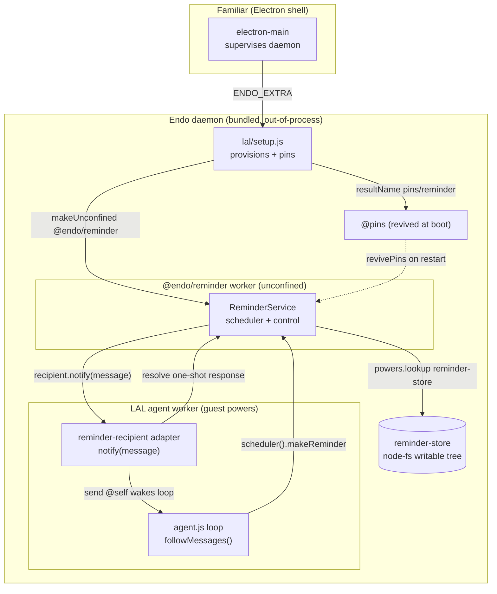

# Integrating `@endo/reminder` into Familiar

| | |
|---|---|
| **Created** | 2026-08-06 |
| **Author** | Kris Kowal (prompted) |
| **Status** | Not Started |
| **Source** | [endojs/endo-but-for-bots#721 review by kriskowal](https://github.com/endojs/endo-but-for-bots/pull/721#pullrequestreview-4701251219) (2026-07-15): "Please post plans to follow-up with integration of this plugin into Chat, Familiar, and minion.town." |

## What is the Problem Being Solved?

Agents under SES lockdown have no `setTimeout`/`setInterval`; without a
scheduling capability they are purely reactive. The merged
[`@endo/reminder`](../packages/reminder/README.md) plugin
([endojs/endo-but-for-bots#721](https://github.com/endojs/endo-but-for-bots/pull/721),
merged 2026-07-30 and approved) supplies scheduled *messages*. This plan works
out how the **Familiar** desktop app lets its resident agent schedule reminders
and act on them when they fire, and whether the unconfined-plugin shape fits
Familiar's trust posture.

`@endo/reminder` is final: its API landed and was approved, and its delivery
baseline (Phase 2, a subscriber capability resolved by name) needs no SturdyRef
work. So this integration is **not** blocked on the plugin changing shape, nor on
the gated Phase 4 mailbox-delivery upgrade. See [`endo-reminder.md`](endo-reminder.md)
§ Phase 3, which names "one worked integration (Familiar app or online Gateway)
demonstrating restart-survival end to end" as its own deliverable. This plan is
that worked integration.

## Where the integration actually lives

The load-bearing finding: **Familiar is a thin Electron supervisor with no
capability code of its own.** `packages/familiar` contains no `makeUnconfined`,
no guest/`powers`, no pet-name manipulation (grep is empty). It spawns and
supervises an out-of-process Endo daemon (`src/daemon-manager.js`
`makeDaemonManager` -> `startDaemon`) and injects the LAL setup caplet via
`ENDO_EXTRA` (`daemon-manager.js` -> `endo-lal-setup.mjs`, bundled from
`packages/lal/setup.js`). All capability wiring lives in the bundled daemon and
`packages/lal` (the LLM agent).

So "integrate into Familiar" means: **wire `@endo/reminder` against the LAL
agent, and have the Familiar deployment own the retention that makes it wake on
restart.** Familiar's own contribution is (a) that the reminder plugin and its
persistence ride the app's bundle and state directory, and (b) that the app is
the first deployment to prove restart-survival. The agent-facing substrate
(recipient adapter, store, provisioning, scheduling tool) is shared with the
Chat and minion.town plans and should be built once in `packages/lal` (see
§ Ordering).

## Integration points

1. **Recipient adapter — the one genuinely missing seam.** The reminder plugin
   delivers by `E(recipient).notify(message)` to whatever `reminder-recipient`
   resolves to (`packages/reminder/src/index.js` `make`, line
   `onMessage: message => E(recipient).notify(message)`). LAL exposes **no**
   inbound notify facet: its only exo is `Lal.help` (`agent.js` `LalInterface`),
   and the agent wakes **only** by polling `E(powers).followMessages()`
   (`inbox-loop.js`). So a `notify(message)` call has nothing to land on today. A
   small adapter exo must be built with a `notify(message)` method that (a) posts
   the reminder into the agent's own inbox so the `followMessages()` loop wakes
   the LLM, and (b) settles the one-shot response. Recommended body:
   `E(powers).send('@self', [formatReminder(message)], ...)` then
   `E(message.reminderResponse).resolve()` once the send is durably enqueued; on
   a send rejection, call `reschedule()` instead so the backoff retries. Waking
   the agent (rather than surfacing straight to `@host`) keeps *policy* with the
   agent, which the plugin's README explicitly reserves to the recipient.

2. **Durable store.** `reminder-store` must resolve to a **writable** VFS
   directory (the tests use `makeInMemoryFilesystem().root().makeDirectory('reminder-store')`;
   production needs a **node-fs-backed** writable tree from
   `@endo/platform/fs/extended` rooted under the Endo state directory so the
   store survives restart). The plugin needs only the reconciled writable-tree
   verbs (`lookup`/`list`/`write`/`makeDirectory`/`remove`/`move`) and requires
   atomic within-directory `move` as a store contract.

3. **Provisioning + pinning.** In `packages/lal/setup.js` (the caplet Familiar
   bundles as `endo-lal-setup.mjs`), idempotently provision:
   `E(agent).makeUnconfined(workerName, '@endo/reminder', { powersName, resultName: ['@pins', 'reminder'], env })`,
   guarded by an existence check the way `setup.js` already guards `setup-lal`
   and `controller-for-lal` (`has(...)`). `setup.js` is the right home because it
   is the once-per-host provisioning entry Familiar already injects; pinning into
   `@pins` there gives the app automatic wake-on-restart (design decision 10's
   "candidate future owner", realized).

4. **The powers guest.** The reminder worker's `powersName` must point at a guest
   whose pet-store resolves `reminder-store` and `reminder-recipient`. The LAL
   guest (`profile-for-lal`) is the natural hub: it is already the `powers` object
   the agent runs against (`agent.js` `make(guestPowers)`), and names are added
   to it exactly as `provisionPrimer` adds `primer`
   (`E(guest).storeIdentifier(name, id)` / `storeValue`). Either grant a dedicated
   attenuated guest holding only those two names (design § Delegation, Mode B) or
   reuse the LAL guest; see Open questions.

5. **Agent-facing scheduling.** Retain the `ReminderScheduler`
   (`E(service).scheduler()`: `makeReminder(label, periodMs, opts)`, `list`) for
   the agent and add a thin LAL tool (`packages/lal/tools/`) exposing
   make/list/cancel, plus a `primer/howto-reminders.md` teaching the agent that
   the capability exists. Keep `ReminderControl`
   (`pause`/`resume`/`revoke`/`setMaxActive`/`setMinPeriodMs`) with the
   integration (setup), not the agent, so the human deployment can throttle or
   kill a runaway schedule.

6. **Bundle.** `@endo/reminder` and `@endo/platform/fs/extended` must be reachable
   in the esbuild graph of a bundled entry (they become reachable once `setup.js`
   or `agent.js` imports them; both are pure JS over node builtins, which stay
   external under `platform: 'node'`). The `familiar-bundle` CI check
   (`yarn workspace @endo/familiar step:bundle`) and `test/bundle.test.js`
   (asserts the seven expected artifacts) are the live gate: any unbundleable
   import fails there.

## API surface actually used

Read directly from the merged sources and tests, not assumed:

| Surface | Signature / shape | Source |
|---|---|---|
| Provision | `E(host).makeUnconfined(worker, '@endo/reminder', { powersName, resultName, env })` | `README.md`, `src/index.js` |
| `powers.lookup` | resolves `'reminder-store'` (writable dir) and `'reminder-recipient'` (has `notify`) | `src/index.js` `make`; `test/plugin.test.js` |
| `env` | `{ maxActive, minPeriodMs, paused }` (strings; store is authoritative after first boot) | `src/index.js` `parseOptionalInteger` |
| Delivery | `E(recipient).notify(message)` | `src/index.js` `onMessage` |
| `message` | `{ type:'reminder-message', reminderId, label, periodMs, messageNumber, scheduledAt, actualAt, missedMessages, annotation, reminderResponse }` | `README.md` § The delivered message |
| Response | one-shot `reminderResponse.resolve()` \| `.reschedule()` | `src/interfaces.js` `ReminderResponseInterface` |
| Scheduler facet | `E(service).scheduler()` -> `makeReminder(label, periodMs, opts?)`, `list()`, `help()` | `README.md` § Facets |
| Control facet | `E(service).control()` -> `setMaxActive`, `setMinPeriodMs`, `pause`, `resume`, `revoke`, `listAll`, `help` | `README.md` § Facets |
| `makeReminder` opts | `firstDelayMs`, `messageTimeoutMs`, `catchUpPolicy` (`coalesce`\|`skip`), `annotation` (`count`\|`timestamps`), `backoff` | `README.md` |
| Wake-on-restart | pin id into `@pins`; `revivePins()` incarnates; `make()` runs recovery | `README.md` § The `@pins` recipe |

No new plugin surface is required; the delegation/attenuation modes the agent
might use for subagents are ordinary capability passing over these facets
([`endo-reminder.md`](endo-reminder.md) § Delegation, decision 17).

## Persistence and lifetime

- **Store:** `reminder-store/config.json` (`{ maxActive, minPeriodMs, paused }`)
  and `reminder-store/reminders/<id>.json` (one doc per reminder;
  `nextTickAt` absolute epoch ms, `catchUpPolicy`, `annotation`, backoff params,
  `consecutiveFailures`). Atomic replacement is write-then-`move`. Lives under the
  Endo state directory so it persists with the daemon.
- **Lifetime:** pinning into `@pins` makes `revivePins()` incarnate the plugin at
  each daemon boot; `make()` reads the store, coalesces (or `skip`s) messages
  missed while down, re-arms timers, and resumes delivery. Unpinning
  decommissions (no wake next boot); the store persists until deleted. Timers
  tear down on caplet cancellation (`src/index.js`, `context.whenCancelled()`).
- **Recipient durability caveat:** because the reminder worker resolves
  `reminder-recipient` **by name** on every `make()`, that name must resolve to a
  capability with a stable formula identity across restart — not an ephemeral exo
  the LAL worker rebuilds each boot (which would leave the name pointing at a dead
  formula, and `revivePins` runs eagerly at daemon boot, independent of and
  possibly ahead of LAL re-binding it). The adapter should therefore be a small
  durable formula (its own exo/caplet), named once, revived when the plugin looks
  it up. Whether it needs its own pin to be *alive* when a `notify` arrives, or is
  revived-on-demand by that lookup, depends on daemon lazy-revival semantics (Open
  questions).

## What changes on each side

- **`@endo/reminder`:** nothing. The API is merged and final; this integration
  consumes it as published.
- **`packages/lal` (the shared substrate):** the recipient adapter (IP1), the
  node-fs store provisioning + naming (IP2, IP4), the `makeUnconfined` + `@pins`
  provisioning in `setup.js` (IP3), the scheduler tool + primer howto (IP5).
- **`packages/familiar`:** likely **no source change** — the integration rides
  the bundled `setup.js`/`agent.js`. The only Familiar-specific work is
  confirming the bundle picks up the new reachable deps (IP6) and that the state
  directory hosts the store. Confirm no `electron-main.js` change is needed
  (Open questions).

## Trust posture: does the unconfined-plugin shape fit?

Yes. The reminder worker runs **unconfined** (full Node worker authority) — but
so does LAL itself (`@endo/lal` is "an unconfined `@endo/daemon` plugin"), so the
plugin adds no trust surface beyond what Familiar already grants its agent. Within
that, the plugin is confined by object-capability: it holds only the two names its
`powers` resolves plus `env`, and no ambient daemon authority. It must not import
`ses`/`@endo/init` (it runs in an already-locked-down worker, per
`familiar/AGENTS.md`); the merged plugin does not. The two live risks and their
existing mitigations:

- **Interval-bomb / self-driving loop.** A fired reminder waking the LLM loop is
  the intended drive, but it lets a schedule spend agent turns. Bounded by
  `maxActive` and `minPeriodMs` (host-set via `env`, thereafter via
  `ReminderControl`), and the human deployment retains `ReminderControl` to
  `pause`/`revoke`. Keep control **out** of the agent's hands (IP5).
- **Store scope.** `reminder-store` should be a directory scoped to the agent, not
  a broad filesystem mount, so the plugin cannot read or write beyond its store.

## Test strategy

- **Recipient adapter (unit):** `notify(message)` posts to the agent inbox and
  `resolve()`s the response; a rejected send triggers `reschedule()`. Mirror the
  in-memory shape of `packages/reminder/test/plugin.test.js`.
- **Restart-survival (integration) — the Phase 3 deliverable:** provision + pin a
  reminder, stop and restart the daemon, assert `revivePins()` incarnates the
  plugin, recovery coalesces the missed message, and the agent loop receives it.
  This is the end-to-end demonstration [`endo-reminder.md`](endo-reminder.md)
  § Phase 3 asks for.
- **Bundle (CI):** `familiar-bundle` green with the new reachable deps;
  `test/bundle.test.js` still lists the expected artifacts. Run locally before
  pushing per the pre-push gates.
- **Agent tool (unit):** the LAL make/list/cancel tool dispatches to the scheduler
  facet.

## Ordering

- **Against [endojs/endo-but-for-bots#721](https://github.com/endojs/endo-but-for-bots/pull/721):**
  no gate — it is merged and approved.
- **Against Phase 4 / SturdyRef:** not required. The Phase 2 subscriber-capability
  baseline carries all delivery for Familiar; the gated `send` + `storeValue`
  upgrade is an independent later phase.
- **Against the sibling integration plans** (`endo-reminder-integrate-chat`,
  `endo-reminder-integrate-minion-town`, both in flight): the recipient adapter,
  store, `setup.js` provisioning, and scheduler tool are **one shared LAL
  substrate**. Build it once. Suggested sequence: (1) land the shared LAL
  substrate; (2) **Familiar** pins it and proves restart-survival end to end (this
  plan, the Phase 3 deliverable); (3) **Chat** layers a UI surface over the agent
  tool (show reminders in-thread, create/list/cancel affordances); (4)
  **minion.town / online Gateway** owns retention server-side for the hosted
  deployment (the design's other named candidate owner). Cross-reference the three
  designs so the substrate is not triplicated; the coordination note is on the
  bus to the Chat peer.

## Dependencies

| Design / PR | Relationship |
|---|---|
| [`endo-reminder.md`](endo-reminder.md) | The plugin being integrated; this plan realizes its Phase 3 "one worked integration" and its decision-10 "Familiar app as candidate retention owner". |
| [endojs/endo-but-for-bots#721](https://github.com/endojs/endo-but-for-bots/pull/721) | Merged implementation; the API surface consumed here. |
| `endo-reminder-integrate-chat` design (in flight) | Shares the LAL substrate; layers the UI surface. |
| `endo-reminder-integrate-minion-town` design (in flight) | Shares the LAL substrate; the parallel server-side retention owner. |
| [`familiar-daemon-bundling.md`](familiar-daemon-bundling.md) | Familiar's daemon-bundling shape that the reminder deps must ride. |

## Open Questions

- How is a persistent, node-fs-backed writable `reminder-store` directory minted
  and named in the daemon/LAL world? Could not fully establish from the sources.
  Candidates: a daemon mount of a state subdirectory (the `/mount <path> <name>`
  path the primer documents), or a daemon-native `@endo/platform/fs/extended`
  node-backed writable tree stored under a pet-name. The build must pick one and
  confirm the writable-tree verbs the plugin needs are satisfied.
- Should provisioning + pinning live in `packages/lal/setup.js` (recommended:
  once-per-host, idempotent, already Familiar-injected) or in `agent.js`
  (per-incarnation)? Resolve toward `setup.js` unless the recipient-adapter
  lifetime forces otherwise.
- Recipient-adapter lifetime: does the adapter need its own `@pins` entry to be
  alive when a `notify` arrives after restart, or is revive-on-demand by the
  reminder plugin's `lookup('reminder-recipient')` sufficient? Depends on daemon
  lazy-revival semantics and the boot ordering between `revivePins()` and LAL
  re-binding the name.
- Should the adapter `resolve()` immediately on durable enqueue to the agent inbox
  (recommended, so a periodic schedule keeps firing), or only after the agent
  finishes acting on the reminder? The former treats reminders as fire-and-forget
  messages; the latter couples the schedule to agent throughput.
- One shared scheduler for the top-level agent, or a per-subagent scheduler via
  the design's Mode B (attenuated powers, retained `ReminderControl`)? Familiar's
  single resident agent suggests one shared scheduler to start; Mode B is the
  documented path if subagents later need independent, revocable schedules.
- Does Familiar need **any** `electron-main.js` / `packages/familiar` source
  change, or is the integration entirely inside the bundled `packages/lal`?
  Expected: bundle-graph reachability and the state directory only. Confirm during
  the build.

## Design Decisions

1. **The integration lives in `packages/lal` + the app's bundle/state, not in
   `packages/familiar` source.** Familiar has no capability code; forcing wiring
   into the Electron shell would misplace it.
2. **`setup.js` owns provisioning and `@pins` retention.** It is the once-per-host
   entry Familiar already injects; pinning there is design decision 10's "Familiar
   as retention owner" realized, with no daemon-core change.
3. **Fired reminders wake the agent, not the user directly.** Policy about what to
   do on a schedule belongs to the recipient (the plugin's stated contract); the
   agent decides whether and how to surface a reminder to `@host`.
4. **`ReminderControl` stays with the deployment, `ReminderScheduler` goes to the
   agent.** Keeps the throttle/kill lever out of the agent's own hands.
5. **The recipient adapter is a durable, stably-identified formula.** Name
   resolution must survive restart; an ephemeral per-boot exo would break
   `revivePins`-time lookup.
6. **The shared LAL substrate is built once across the three integration plans;
   Familiar is the first worked integration proving restart-survival.**
