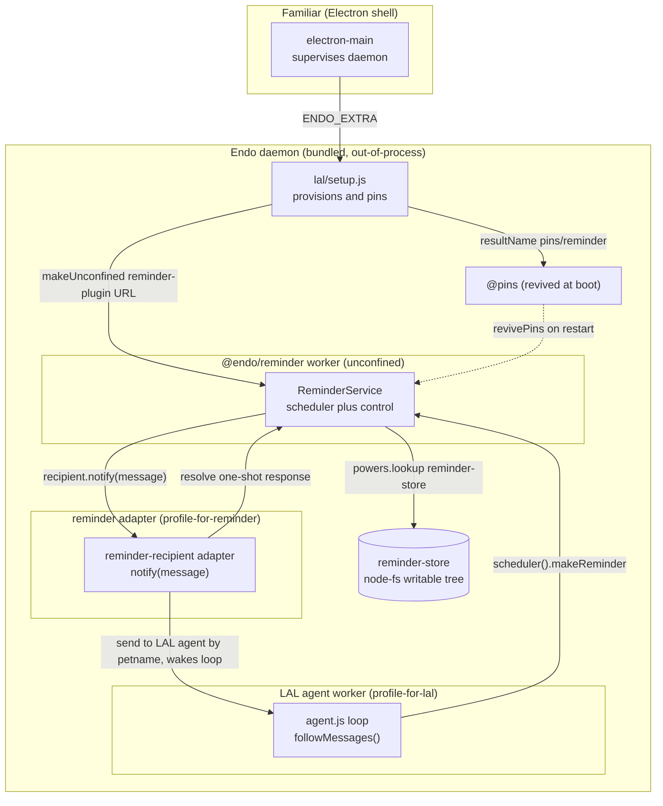

# Integrating `@endo/reminder` into Familiar

| | |
|---|---|
| **Created** | 2026-08-06 |
| **Author** | Kris Kowal (prompted) |
| **Status** | Not Started |
| **Source** | [endojs/endo-but-for-bots#721 review by kriskowal](https://github.com/endojs/endo-but-for-bots/pull/721#pullrequestreview-4701251219) (2026-07-15): "Please post plans to follow-up with integration of this plugin into Chat, Familiar, and minion.town." |

## Prompt

From the [endojs/endo-but-for-bots#721 review](https://github.com/endojs/endo-but-for-bots/pull/721#pullrequestreview-4701251219):
"Please post plans to follow-up with integration of this plugin into Chat,
Familiar, and minion.town."
This document is the **Familiar** plan of that trio.

## What Is the Problem Being Solved?

Agents under SES lockdown have no `setTimeout` or `setInterval`.
Without a scheduling capability they are purely reactive.
The merged [`@endo/reminder`](../packages/reminder/README.md) plugin
([endojs/endo-but-for-bots#721](https://github.com/endojs/endo-but-for-bots/pull/721),
merged 2026-07-30 and approved) supplies scheduled *messages*.
This plan works out how the **Familiar** desktop app lets its resident agent
schedule reminders and act on them when they fire, and whether the
unconfined-plugin shape fits Familiar's trust posture.

`@endo/reminder` is final.
Its API landed and was approved, and its delivery baseline (Phase 2, a
subscriber capability resolved by name) needs no SturdyRef work.
So this integration is **not** blocked on the plugin changing shape, nor on the
gated Phase 4 mailbox-delivery upgrade.
See [`endo-reminder.md`](endo-reminder.md) § Phase 3, which names "one worked
integration (Familiar app or online Gateway) demonstrating restart-survival end
to end" as its own deliverable.
This plan is that worked integration.

### A model of the LAL agent's parts

The integration argument below turns on three distinct Endo objects, so this
section draws them once.
**LAL** (the LLM agent, `packages/lal`) runs as a caplet inside a daemon worker.
That worker's authority is a **guest** named `profile-for-lal`: a pet-store-bearing
identity whose names the agent resolves through its `powers` object
(`agent.js` `make(guestPowers)`).
A **formula** is the daemon's durable, content-addressed recipe for a capability;
a **name** in a pet store resolves to a formula, and a formula can be *revived*
(re-incarnated) at daemon boot from that durable recipe.
The distinction matters at restart: a name that points at a formula survives a
reboot, while a name bound to an ephemeral in-worker exo points at nothing once
the worker that built it is gone.

## Where the Integration Actually Lives

The load-bearing finding: **Familiar is a thin Electron supervisor with no
capability code of its own.**
`packages/familiar` contains no `makeUnconfined`, no guest or `powers`, and no
pet-name manipulation (grep is empty).
It spawns and supervises an out-of-process Endo daemon (`src/daemon-manager.js`
`makeDaemonManager` then `startDaemon`) and injects the LAL setup caplet via
`ENDO_EXTRA` (`daemon-manager.js` to `endo-lal-setup.mjs`, bundled from
`packages/lal/setup.js`).
All capability wiring lives in the bundled daemon and `packages/lal` (the LLM
agent).

So "integrate into Familiar" means: **wire `@endo/reminder` against the LAL
agent, and have the Familiar deployment own the retention that makes it wake on
restart.**
Familiar's own contribution is (a) that the reminder plugin and its persistence
ride the app's bundle and state directory, and (b) that the app is the first
deployment to prove restart-survival.
The agent-facing substrate (recipient adapter, store, provisioning, scheduling
tool) is shared with the Chat and minion.town plans and should be built once in
`packages/lal` (see § Ordering).

The pieces above are explained in § Integration Points, which labels them IP1
through IP6.

## Integration Points

The six points below are referenced elsewhere in this document as IP1 through
IP6, in the order listed here.

**IP1. Recipient adapter, the one genuinely missing seam.**

*What is missing.*
The reminder plugin delivers by `E(recipient).notify(message)` to whatever
`reminder-recipient` resolves to (`packages/reminder/src/index.js` `make`, line
`onMessage: message => E(recipient).notify(message)`).
LAL exposes **no** inbound notify facet.
Its only exo is `Lal.help` (`agent.js` `LalInterface`), and the agent wakes
**only** by polling `E(powers).followMessages()` (`inbox-loop.js`).
So a `notify(message)` call has nothing to land on today.

*What to build.*
A small adapter exo with a `notify(message)` method that (a) posts the reminder
into the LAL agent's inbox so the `followMessages()` loop wakes the LLM, and (b)
settles the one-shot response.

*Why the adapter cannot simply send `@self`.*
`inbox-loop.js:118` skips every message whose `from` locator equals the loop's
own `E(powers).locate('@self')` ("only act on inbound mail"), and
`packages/daemon/src/mail.js:912` stamps `from: selfId` on `send`.
So an adapter that holds the **LAL guest** powers and calls
`E(powers).send('@self', ...)` produces a message with `from === selfLocator`,
which the loop silently drops; the reminder never wakes a round.
The adapter therefore runs as a **dedicated attenuated guest**
(`profile-for-reminder`, see IP4), which addresses the LAL agent by a pet name
(`@lal-agent`) that resolves to the LAL agent's mailbox.
The message it sends then carries `from = profile-for-reminder`, distinct from the
LAL loop's `@self`, so `inbox-loop.js` treats it as inbound and wakes the round.
Recommended body:
`E(reminderPowers).send('@lal-agent', [formatReminder(message)], [], [])`, then
`E(message.reminderResponse).resolve()` once the send is durably enqueued; on a
send rejection, call `E(message.reminderResponse).reschedule()` so the backoff
retries.
Waking the agent (rather than surfacing straight to `@host`) keeps *policy* with
the agent, which the plugin's README explicitly reserves to the recipient.

*The rendered message.*
`formatReminder(message)` is the agent's whole user interface for a fired
reminder, so the projected text must carry `reminderId` and `label` (so the agent
can call `cancelReminder(reminderId)` on what it just read) plus a marker
distinguishing a reminder from an ordinary `@self` note (for example a leading
`[reminder <label>]` tag).
Because Design Decision 3 resolves the response on durable enqueue, a periodic
reminder accretes one inbox entry per firing; the agent is responsible for
dismissing entries it has acted on, the same way it manages ordinary mail.

**IP2. Durable store.**

`reminder-store` must resolve to a **writable** virtual-file-system directory.
The tests use
`makeInMemoryFilesystem().root().makeDirectory('reminder-store')`; production
needs a **node-fs-backed** writable tree from `@endo/platform/fs/extended`, rooted
under the Endo state directory so the store survives restart.
The plugin needs the reconciled writable-tree verbs
(`lookup`, `list`, `write`, `makeDirectory`, `remove`, `move`, the
[reconciled surface](fs-interface-reconciliation.md)) and requires atomic
within-directory `move` as a store contract.
It also needs `list()` to return a cursor whose `toArray()` yields the entries
(`packages/reminder/src/store.js:105-106`) and file `snapshot()` to return a blob
whose `json()` parses the contents (`store.js:81-82`).
The daemon mount candidate in Open Question 1 fails both shapes: `mount.js:777`
`list()` returns a plain array, and `mount.js:1205` `write(path, value)` takes a
remotable, not the string `store.js:60` passes.
The build must pick a store that satisfies these verbs; `provideScratchMount`
(`daemon/src/host.js:637`) is a stronger candidate than the raw mount.

**IP3. Provisioning and pinning.**

In `packages/lal/setup.js` (the caplet Familiar bundles as `endo-lal-setup.mjs`),
idempotently provision:
`E(agent).makeUnconfined(workerName, reminderSpecifier, { powersName, resultName: ['@pins', 'reminder'], env })`.
The `reminderSpecifier` **must be a resolvable href**, not the bare package name
`'@endo/reminder'`.
`packages/daemon/src/worker.js:98` runs the specifier through `normalizeFilePath`,
which prepends `file://` to anything that is not already a file URL, so
`file://@endo/reminder` fails to import; every working call site passes an href,
and `setup.js:15` already resolves its own agent caplet as
`new URL('agent.js', import.meta.url).href`.
So provisioning resolves the plugin the same way:
`const reminderSpecifier = new URL('reminder-plugin.js', import.meta.url).href;`,
where `reminder-plugin.js` is a one-line re-export shim in `packages/lal/`
(`export * from '@endo/reminder';`) that gives the bundle a stable entry name (see
IP6).

*The provisioning must be hoisted above the early return.*
`setup.js:28-31` is a whole-function early `return` on `has('controller-for-lal')`,
not a per-item guard, so any provisioning appended after the existing
`makeUnconfined('@main', ...)` call never runs on an **already-provisioned**
Familiar (every existing install).
The reminder provisioning must therefore sit **before** that early return, each
step guarded by its own `has(...)` existence check so it is idempotent per item
(provision the reminder adapter guest, the store, the recipient name, and the
plugin only if each is absent).
This resolves Open Question 2 toward `setup.js`, with the guard corrected.

**IP4. The powers guest.**

The reminder worker's `powersName` must point at a guest whose pet store resolves
`reminder-store` and `reminder-recipient`.
This plan grants a **dedicated attenuated guest** (`profile-for-reminder`) holding
only those two names plus `@lal-agent` (the recipient the adapter sends to), and
does **not** reuse the LAL guest.
Two independent findings force this choice, so it is a design decision, not an
open question (see Design Decision 4):

- The self-message filter (IP1) drops any reminder the adapter sends while holding
  the LAL guest's identity, so only a distinct guest wakes the loop.
- Reusing the LAL guest (`profile-for-lal`) braids the plugin's private state with
  the agent's own namespace: that guest *is* the agent's `powers`
  (`packages/lal/setup.js:42`), and the agent already calls `E(powers).lookup`,
  `.remove`, and `.move` (`packages/lal/agent.js`), so it could `lookup('reminder-store')`
  and rewrite `config.json` directly.
  Because `packages/reminder/src/scheduler.js:107-120` treats the persisted config
  as authoritative over `env` on every boot after the first, the agent would reach
  the throttle through the store without ever touching `ReminderControl`, voiding
  the Design Decision 4 invariant.

Names are added to the dedicated guest exactly as `provisionPrimer` adds `primer`
(`E(guest).storeIdentifier(name, id)` or `storeValue`).

**IP5. Agent-facing scheduling.**

Retain the `ReminderScheduler` (`E(service).scheduler()`) for the agent and add a
thin LAL tool (`packages/lal/tools/`) plus a `primer/howto-reminders.md` teaching
the agent that the capability exists.
Two surface facts from the sibling tool registry constrain the tool:

- LAL tools are one flat array (`packages/lal/tools/index.js`) dispatched by a
  single `switch (name)` (`packages/lal/tool-dispatch.js:141-429`), and `list` is
  **already taken** by the pet-names directory tool (`tools/petnames.js:31`,
  documented as `list(name?)` in `primer/tools.md`).
  So the reminder tool names must be `makeReminder`, `listReminders`, and
  `cancelReminder`, following the verb-plus-noun convention every disambiguable
  sibling uses (`listMessages`, `editMessage`, `messageHistory`, `makeDirectory`).
- `cancel()` lives on the per-reminder **handle** returned by `makeReminder`
  (`packages/reminder/src/scheduler.js` `makeReminderHandle`), not on
  `ReminderScheduler`, and LAL tools address stateful things by **id in JSON args**
  (`messageNumber`, `tools/mail.js:51`), never by object reference.
  So `cancelReminder(reminderId)` requires an adapter-held `reminderId`-to-handle
  table populated at `makeReminder` time; the tool looks up the handle and calls
  its `cancel()`.
  The table lives with the adapter guest, not the agent.

`listReminders` returns a **projection**, not the raw `scheduler.list()` entries
(which carry `nextTickAt`, `consecutiveFailures`, and backoff params); mirror the
curation `listMessages` applies, surfacing `reminderId`, `label`, `period`, and
`nextTickAt` in a form the model can act on.
Keep `ReminderControl` (`pause`, `resume`, `revoke`, `setMaxActive`,
`setMinPeriodMs`) with the integration (setup), not the agent, so the human
deployment can throttle or kill a runaway schedule.
Register `howto-reminders.md` in `primer/README.md` § How-To Guides and reference
the new tools in `primer/tools.md`, or the how-to is undiscoverable.

**IP6. Bundle.**

`makeUnconfined`'s specifier is resolved **at runtime by the daemon worker**, not
by esbuild, so a bare `'@endo/reminder'` import is *not* in the static bundle graph
and has no `node_modules` beside `bundles/`.
This is exactly why `packages/familiar/scripts/bundle.mjs:69-77` gives
`packages/lal/agent.js` its **own** entry point, with the comment "lal/setup.js
resolves it as new URL('agent.js', import.meta.url)".
The reminder plugin needs the same treatment:

- an **eighth** esbuild entry point in `scripts/bundle.mjs` building
  `packages/lal/reminder-plugin.js` (the re-export shim from IP3) to
  `bundles/reminder-plugin.js`;
- a new line `'reminder-plugin.js'` in the `expectedArtifacts` array of
  `packages/familiar/test/bundle.test.js:49` (currently seven artifacts:
  `endo-cli.mjs`, `endo-daemon.mjs`, `worker-node.mjs`, `endo-lal-setup.mjs`,
  `agent.js`, `electron-main.mjs`, `primer`);
- the URL specifier in `setup.js` (IP3) resolving to that bundled artifact, which
  in the packaged layout sits beside `endo-lal-setup.mjs` and in dev resolves to
  `packages/lal/reminder-plugin.js`, giving dev-and-packaged parity the same way
  `agent.js` already has it.

`@endo/platform/fs/extended` (imported statically by the store code) stays
`external` under `platform: 'node'` since it is pure JS over node builtins.
The `familiar-bundle` CI check (`yarn workspace @endo/familiar step:bundle`) and
`test/bundle.test.js` are the live gate; any unbundleable import fails there.

## API Surface Actually Used

Read from the merged sources and tests (each row cites the working call site, not
README prose):

| Surface | Signature / shape | Source |
|---|---|---|
| Provision | `E(host).makeUnconfined(worker, reminderSpecifier, { powersName, resultName, env })`, `reminderSpecifier` an href | `worker.js:98` `normalizeFilePath`; `setup.js:15` href pattern |
| `powers.lookup` | resolves `'reminder-store'` (writable dir) and `'reminder-recipient'` (has `notify`) | `src/index.js` `make`; `test/plugin.test.js` |
| `env` | `{ maxActive, minPeriodMs, paused }` (strings; a first-boot seed only, the store is authoritative thereafter) | `src/index.js` `parseOptionalInteger`; `scheduler.js:107-120` |
| Delivery | `E(recipient).notify(message)` | `src/index.js` `onMessage` |
| `message` | `{ type:'reminder-message', reminderId, label, periodMs, messageNumber, scheduledAt, actualAt, missedMessages, annotation, reminderResponse }` | `src/index.js`, `src/interfaces.js` |
| Response | one-shot `reminderResponse.resolve()` or `.reschedule()` | `src/interfaces.js` `ReminderResponseInterface` |
| Scheduler facet | `E(service).scheduler()` yields `makeReminder(label, periodMs, opts?)`, `list()`, `help()` | `src/index.js` `scheduler()` facet |
| `Reminder` handle | returned by `makeReminder`: `label`, `period`, `setPeriod`, `cancel`, `info`, `help` | `src/scheduler.js` `makeReminderHandle` |
| Control facet | `E(service).control()` yields `setMaxActive`, `setMinPeriodMs`, `pause`, `resume`, `revoke`, `listAll`, `help` | `src/index.js` `control()` facet |
| `makeReminder` opts | `firstDelayMs`, `messageTimeoutMs`, `catchUpPolicy` (`coalesce` or `skip`), `annotation` (`count` or `timestamps`), `backoff` | `src/scheduler.js` |
| Wake-on-restart | pin id into `@pins`; `revivePins()` incarnates; `make()` runs recovery | `src/index.js`; `endo-reminder.md` § Wake-on-restart |

No new plugin surface is required.
The delegation and attenuation modes the agent might use for subagents are
ordinary capability passing over these facets
([`endo-reminder.md`](endo-reminder.md) § Delegation and attenuation).

## A Worked Example

1. The agent calls `makeReminder('water the plants', 3600000)`.
   The LAL tool dispatches to `E(scheduler).makeReminder(...)`, receives a
   `Reminder` handle, and records `reminderId` to `handle` in the adapter's table.
2. An hour passes.
   The reminder worker's scheduler fires and calls
   `E(reminder-recipient).notify(message)` where `message.label` is "water the
   plants".
3. The adapter (running as `profile-for-reminder`) calls
   `E(reminderPowers).send('@lal-agent', ['[reminder water the plants] ...'], [], [])`.
   Because the sender is `profile-for-reminder`, not the LAL loop's `@self`,
   `inbox-loop.js` does **not** skip it.
4. The adapter calls `E(message.reminderResponse).resolve()` once the send is
   durably enqueued, so the periodic schedule keeps firing (Design Decision 3).
5. The LAL loop wakes on the new inbound message, the LLM reads the `[reminder ...]`
   text, and decides whether to act, to surface it to `@host`, or to
   `cancelReminder(reminderId)`.

## Persistence and Lifetime

- **Store:** `reminder-store/config.json` (`{ maxActive, minPeriodMs, paused }`)
  and `reminder-store/reminders/<id>.json` (one doc per reminder;
  `nextTickAt` absolute epoch ms, `catchUpPolicy`, `annotation`, backoff params,
  `consecutiveFailures`).
  Atomic replacement is write-then-`move`.
  It lives under the Endo state directory so it persists with the daemon.
- **Lifetime:** pinning into `@pins` makes `revivePins()` incarnate the plugin at
  each daemon boot.
  `make()` reads the store, coalesces (or skips) messages missed while down,
  re-arms timers, and resumes delivery.
  Unpinning decommissions the plugin (no wake next boot); the store persists until
  deleted.
  Timers tear down on caplet cancellation (`src/index.js`,
  `context.whenCancelled()`).
- **Recipient durability caveat:** the reminder worker resolves
  `reminder-recipient` **by name** on every `make()`, so that name must resolve to
  a capability with a stable formula identity across restart.
  It must not be an ephemeral exo the LAL worker rebuilds each boot.
  Such an exo would leave the name pointing at a dead formula.
  `revivePins()` runs eagerly at daemon boot, independent of (and possibly ahead
  of) LAL re-binding the name, so the adapter must already resolve when the plugin
  looks it up.
  The adapter should therefore be a small durable formula (its own exo or caplet),
  named once and revived when the plugin looks it up.
  Whether it needs its own pin to be *alive* when a `notify` arrives, or is
  revived on demand by that lookup, depends on daemon lazy-revival semantics (see
  Open Questions).
- **Failure mode:** a rejected `notify` is only `console.error`'d today
  (`scheduler.js:355-361`), and the deadline then auto-resolves and zeroes
  `consecutiveFailures` (`:329-331`, `:394`), so a dead adapter silently drops
  every message with backoff never engaging.
  The adapter's `reschedule()`-on-rejection path (IP1) is what keeps a transient
  send failure from being swallowed; the restart-survival test must assert this
  failure mode, not only the happy path.
  Relatedly, `messageTimeoutMs` defaults to `periodMs/2`, so Open Question 4's
  "resolve only after the agent acts" branch needs a stated timeout policy to be
  implementable.

## What Changes on Each Side

- **`@endo/reminder`:** nothing.
  The API is merged and final; this integration consumes it as published.
- **`packages/lal` (the shared substrate):** the recipient adapter (IP1), the
  node-fs store provisioning and naming (IP2, IP4), the dedicated
  `profile-for-reminder` guest (IP4), the `makeUnconfined` plus `@pins`
  provisioning hoisted above the early return in `setup.js` (IP3), the scheduler
  tool plus primer how-to (IP5), and the `reminder-plugin.js` re-export shim (IP3,
  IP6).
- **`packages/familiar`:** one bundle change, not "no source change".
  `scripts/bundle.mjs` gains the eighth entry point and `test/bundle.test.js`
  gains the eighth expected artifact (IP6).
  Beyond the bundle, confirm the state directory hosts the store and that no
  `electron-main.js` change is needed (see Open Questions).

## Trust Posture: Does the Unconfined-Plugin Shape Fit?

Yes.
The reminder worker runs **unconfined** (full Node worker authority), but so does
LAL itself (`@endo/lal` is "an unconfined `@endo/daemon` plugin"), so the plugin
adds no trust surface beyond what Familiar already grants its agent.
Within that, the plugin is confined by object-capability discipline: it holds only
the two names its `powers` resolves plus `env`, and no ambient daemon authority.
It must not import `ses` or `@endo/init` (it runs in an already-locked-down worker,
per `familiar/AGENTS.md`); the merged plugin does not.
The two live risks and their mitigations:

- **Interval-bomb or self-driving loop.**
  A fired reminder waking the LLM loop is the intended drive, but it lets a
  schedule spend agent turns.
  It is bounded by `maxActive` and `minPeriodMs` (host-set via `env`, thereafter
  via `ReminderControl`), and the human deployment retains `ReminderControl` to
  `pause` or `revoke`.
  Keeping control **out** of the agent's hands (IP4, IP5) is what makes this bound
  real, which is why the dedicated guest, not the shared LAL guest, is mandatory.
- **Store scope.**
  `reminder-store` should be a directory scoped to the agent, not a broad
  filesystem mount, so the plugin cannot read or write beyond its store.

## Test Strategy

- **Recipient adapter (unit):** `notify(message)` posts to the LAL agent inbox and
  `resolve()`s the response; a rejected send triggers `reschedule()`.
  Mirror the in-memory shape of `packages/reminder/test/plugin.test.js`.
- **Restart-survival (integration), the Phase 3 deliverable:** provision and pin a
  reminder, stop and restart the daemon, assert `revivePins()` incarnates the
  plugin, recovery coalesces the missed message, and the LAL loop receives it.
  This is the end-to-end demonstration [`endo-reminder.md`](endo-reminder.md)
  § Phase 3 asks for.
- **Bundle (CI):** `familiar-bundle` green with the eighth entry point;
  `test/bundle.test.js` lists all eight expected artifacts.
  Run locally before pushing per the pre-push gates.
- **Agent tool (unit):** the LAL `makeReminder`, `listReminders`, and
  `cancelReminder` tools dispatch to the scheduler facet and the adapter's
  id-to-handle table.

## Ordering

- **Against [endojs/endo-but-for-bots#721](https://github.com/endojs/endo-but-for-bots/pull/721):**
  no gate; it is merged and approved.
- **Against Phase 4 / SturdyRef:** not required.
  The Phase 2 subscriber-capability baseline carries all delivery for Familiar; the
  gated `send` plus `storeValue` upgrade is an independent later phase.
- **Against the sibling integration plans** (`endo-reminder-integrate-chat.md` and
  `endo-reminder-integrate-minion-town.md`, both planned but not yet in
  `designs/`): the recipient adapter, store, `setup.js` provisioning, and scheduler
  tool are **one shared LAL substrate**.
  Build it once.
  Suggested sequence:
  (1) land the shared LAL substrate;
  (2) **Familiar** pins it and proves restart-survival end to end (this plan, the
  Phase 3 deliverable);
  (3) **Chat** layers a UI surface over the agent tool (show reminders in-thread,
  create, list, and cancel affordances);
  (4) **minion.town / online Gateway** owns retention server-side for the hosted
  deployment.
  Cross-reference the three designs so the substrate is not triplicated.

## Dependencies

| Design / PR | Relationship |
|---|---|
| [`endo-reminder.md`](endo-reminder.md) | The plugin being integrated; this plan realizes its Phase 3 "one worked integration" and design decision 10, under which "the Familiar app / online Gateway remain candidate future owners" of retention. |
| [endojs/endo-but-for-bots#721](https://github.com/endojs/endo-but-for-bots/pull/721) | Merged implementation; the API surface consumed here. |
| `endo-reminder-integrate-chat.md` (planned, not yet in `designs/`) | Shares the LAL substrate; layers the UI surface. |
| `endo-reminder-integrate-minion-town.md` (planned, not yet in `designs/`) | Shares the LAL substrate; the parallel server-side retention owner. |
| [`familiar-daemon-bundling.md`](familiar-daemon-bundling.md) | Familiar's daemon-bundling shape that the reminder deps must ride. |

## Open Questions

- How is a persistent, node-fs-backed writable `reminder-store` directory minted
  and named in the daemon and LAL world?
  This could not be fully established from the sources.
  Candidates: a daemon mount of a state subdirectory (the `/mount <path> <name>`
  path the primer documents), or a daemon-native `@endo/platform/fs/extended`
  node-backed writable tree stored under a pet name.
  IP2 shows the raw mount fails the store's `list()` and `write()` contracts, so
  the build should evaluate `provideScratchMount` first and confirm the
  writable-tree verbs the plugin needs are satisfied.
- Recipient-adapter lifetime: does the adapter need its own `@pins` entry to be
  alive when a `notify` arrives after restart, or is revive-on-demand by the
  reminder plugin's `lookup('reminder-recipient')` sufficient?
  This depends on daemon lazy-revival semantics and the boot ordering between
  `revivePins()` and LAL re-binding the name.
- Should the adapter `resolve()` immediately on durable enqueue to the agent inbox
  (recommended in Design Decision 3, so a periodic schedule keeps firing), or only
  after the agent finishes acting on the reminder?
  The former treats reminders as fire-and-forget messages; the latter couples the
  schedule to agent throughput and needs an explicit `messageTimeoutMs` policy.
- Does Familiar need **any** `electron-main.js` or other `packages/familiar` source
  change beyond the bundle entry point (IP6), or is the rest of the integration
  entirely inside the bundled `packages/lal`?
  Expected: bundle-graph reachability and the state directory only.
  Confirm during the build.

(Open Question 2, whether provisioning lives in `setup.js` or `agent.js`, is now
resolved in IP3 and Design Decision 2: `setup.js`, with the provisioning hoisted
above the early return.
The powers-guest question is likewise resolved in IP4 and Design Decision 4: a
dedicated attenuated guest.)

## Design Decisions

1. **The integration lives in `packages/lal` plus the app's bundle and state, not
   in `packages/familiar` source.**
   Familiar has no capability code, so forcing wiring into the Electron shell would
   misplace it; the sole `packages/familiar` change is the bundle entry point.
2. **`setup.js` owns provisioning and `@pins` retention, hoisted above its early
   return.**
   It is the once-per-host entry Familiar already injects, and pinning there is
   design decision 10's candidate-owner retention realized with no daemon-core
   change; because `setup.js` early-returns on `has('controller-for-lal')`, the
   reminder provisioning must sit before that return, each step guarded by its own
   `has(...)` so already-provisioned installs still gain the reminder.
3. **Fired reminders wake the agent, not the user directly, and the response
   resolves on durable enqueue.**
   Policy about what to do on a schedule belongs to the recipient (the plugin's
   stated contract), so the agent decides whether and how to surface a reminder to
   `@host`; resolving on enqueue keeps a periodic schedule firing rather than
   coupling it to agent throughput.
4. **`ReminderControl` stays with the deployment and `ReminderScheduler` goes to
   the agent, over a dedicated attenuated guest.**
   Keeping the throttle and kill lever out of the agent's own hands requires the
   reminder plugin's `powers` to be a dedicated `profile-for-reminder` guest, not
   the shared LAL guest; sharing the LAL guest would let the agent reach the
   throttle through the persisted store and would defeat the self-message filter,
   so the dedicated guest is a decision here, not an open question.
5. **The recipient adapter is a durable, stably identified formula.**
   Name resolution must survive restart, so an ephemeral per-boot exo would break
   the `revivePins`-time lookup.
6. **The shared LAL substrate is built once across the three integration plans.**
   Familiar is the first worked integration, and it is the one that proves
   restart-survival end to end.
