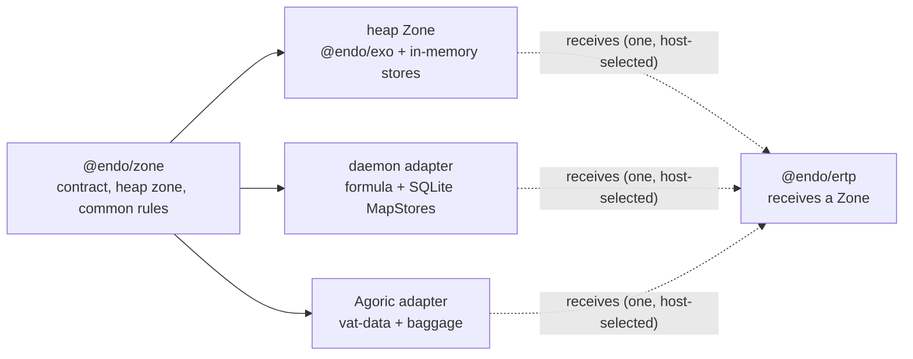

# Back-Port `@endo/zone`

| | |
|---|---|
| **Created** | 2026-07-30 |
| **Updated** | 2026-09-04 |
| **Author** | Kris Kowal (prompted) |
| **Status** | Proposed |

## What is the Problem Being Solved?

`@endo/ertp` needs one vocabulary for allocating its stateful facets and
collections, while keeping the choice of heap, daemon persistence, or Agoric
vat durability with its host. The existing `@agoric/zone` solves that problem,
but its package boundary pulls in `@agoric/store` for heap collections and
`@agoric/vat-data` for virtual and durable ones. A direct dependency would put
an Endo package back behind Agoric's vat runtime; merely accepting an untyped
object would leave every consumer to rediscover the persistence and collision
rules.

Terms of art this design leans on:

- **ERTP** (Electronic Rights Transfer Protocol) is Agoric's asset-issuance
  library, the primary consumer this contract serves.
- **SwingSet** is Agoric's deterministic vat runtime.
- A **vat** is a unit of that runtime with its own durable heap.
- An **incarnation** is one run of a vat between upgrades. Durable state carries
  across incarnations; heap state does not.
- **baggage** is the per-vat durable root store SwingSet hands a contract on each
  incarnation.
- A **vatstore key** is the string under which SwingSet persists a durable object.
- An **exo** is an exposed (remotable) object minted from an interface guard and a
  set of methods (this repo's `@endo/exo` makes them).
- A **kind** is the reusable definition an exo instance is made from; a *durable*
  kind must be re-defined at the start of every incarnation.

SwingSet, vat, baggage, and vatstore key are host runtime internals the portable
contract deliberately keeps out of its core; exo, kind, and incarnation are the
vocabulary the contract itself uses.

This design **back-ports** the portable contract as `@endo/zone`: it extracts
the reusable shape *out of* the downstream `@agoric/zone` package (which lives in
Agoric's `agoric-sdk` repository and sits atop Endo) and lands it *upstream* in
the Endo tree, so Agoric's package can later depend on Endo's rather than the
reverse. It is a prerequisite for the durable phase of the `@endo/ertp` design on
[PR #778](https://github.com/endojs/endo-but-for-bots/pull/778), not an ERTP
implementation and not a replacement for SwingSet's durable storage.

## Design

The work lands in four phases, referenced by number throughout this section:
**Phase 1** the portable core and heap Zone; **Phase 2** an Agoric compatibility
adapter (a cross-org proposal, may be declined); **Phase 3** the Endo daemon
durable adapter; **Phase 4** ERTP adoption. Full detail is under
[Phased Implementation](#phased-implementation) below.

### A portable allocation contract

A **Zone** is a namespace-scoped allocator: it hands out exos, stores, and
sub-zones under stable names, and remembers which names it has already used so an
allocation happens at most once per name. It is a synchronous, **intra-worker**
construct: every method returns its value directly, and a Zone is used only
within the worker that holds it, never as a remote reference reached with `E()`.

`@endo/zone` exports the `Zone` and store-provider types, `makeHeapZone`, the
`makeOnce` machinery, and promise-watcher helpers. A Zone groups compatible
allocation powers:

```js
const issuerZone = zone.subZone('issuer');
const makePurse = issuerZone.exoClass('Purse', PurseI, init, methods);
const balances = issuerZone.mapStore('balances');
const ledger = issuerZone.makeOnce('ledger', () => balances);
```

The public surface stays compatible with the existing `@agoric/zone` shape:
`exo`, `exoClass`, `exoClassKit`, `subZone`, `makeOnce`, `watchPromise`,
`mapStore`, `setStore`, `weakMapStore`, `weakSetStore`, `isStorable`, and
`detached`. One member is deliberately narrowed: `detached()` stays on the exported
`Zone` type for compatibility (a `zone.detached().mapStore(...)` caller keeps
working), but its result carries the restricted contract described under
[Naming and `makeOnce`](#naming-and-makeonce) below. It is the only member whose
contract differs from `@agoric/zone`'s; every other member matches.

Every Zone and every value a Zone mints is hardened before it is returned, as
this repo's own `@endo/exo` already enforces
([`packages/exo/src/exo-makers.js`](../packages/exo/src/exo-makers.js) hardens
`self` and `methods`): the Zone from `makeHeapZone`/`makeAdapterZone`, the exos
`exoClass`/`exoClassKit` produce, their `methods` and `init` results, the stores,
and the `makeAdapterZone({...})` options bag are all hardened. Every Zone is a
capability, and a capability that is not hardened is a mutation channel for any
consumer that receives a sub-zone, so hardening is part of the contract, not an
implementation nicety.

A Zone and its sub-zones are local, in-worker capabilities that can be handed to
and held by other code **within the worker that holds them**. They are
deliberately **not** classified as `remotable` (the pass style `@endo/pass-style`
reserves for objects meant to be marshalled and reached across a boundary with
`E()`, per [`packages/pass-style/README.md`](../packages/pass-style/README.md)),
because a Zone is never meant to cross that boundary. What keeps it off the marshal
boundary is structural, not a naming convention: the surface is wholly synchronous,
so there is no async method a marshalled far reference could answer, and every
adapter (Phase 3 below) is required to run *in the consumer's worker* and expose a
resolved synchronous view rather than marshalling the Zone itself, so no code path
hands a Zone to CapTP to be reached remotely. Handing a consumer a sub-zone
therefore gives it a separate label namespace rather than access to its parent
store; the isolation claim below relies on this local-handoff property, so it is
stated here rather than left to the implementation. (This is why the daemon durable
adapter of Phase 3 presents a synchronous surface over a resolved local view of its
durable stores, rather than exposing the daemon's marshalled store directly; see
Phase 3.)

`makeHeapZone(baseLabel?)` is the first concrete implementation. It uses
`@endo/exo` and Endo-owned in-memory collection implementations with the
`MapStore` / `SetStore` error and key semantics. It does not import
`@agoric/store`. The store layer must support scalar and full `M.key()` keys,
reject duplicate `init`/`add`, distinguish absent-key errors from `has`, and
provide no enumeration or size operation for weak stores.

The package also exports a narrow host-adapter constructor, `makeAdapterZone`.
It is the entry point a Phase-2 or Phase-3 adapter author starts from. Because it
takes more than three collaborators, it takes a single options bag rather than
positional arguments: `makeAdapterZone({ exoMakers, storeProviders,
isStorable, makeSubZone, baseLabel? })`. A host supplies its exo makers,
named-store providers, a storable predicate, and a sub-zone maker; the
constructor supplies label scoping, one-use enforcement, and the common surface.
The `isStorable` option refines the same admission-check responsibility the core
exports as its default `isStorable`. It **composes as a conjunction, never a
replacement**: the effective predicate is `coreIsStorable(v) && hostIsStorable(v)`,
so a host predicate can only *narrow* what is admitted, never widen it. A durable
adapter passes a predicate that additionally rejects non-durable values; a host
with no extra rule passes nothing and gets the core default alone. Framing it as a
plain override would let a lax host pass `() => true` and silently drop the core
floor, so the contract fixes the composition rather than trusting adapter
discipline. The checked value is the already-hardened value (hardening happens
before admission), and the backing store re-reads nothing between the check and
the write, so an accessor-bearing or proxied value cannot present one shape to the
check and another to persistence. Thus the Endo
daemon can provide a durable Zone over its formula and SQLite MapStores without
teaching `@endo/zone` about SQLite, and Agoric can continue to provide its
baggage-backed adapters without a reverse dependency.



### Naming and `makeOnce`

Named allocation is a correctness boundary, not a convenience. `makeOnce(key,
maker)` is synchronous and uses a backing map when the host supplies one. The
core tracks each key through three states (**free**, **in-progress**, and
**used**) in a heap `Map` from the key's **fully scoped label** to its state (a
plain in-memory map, not a Zone store; its lifetime is exactly the incarnation), so
two sibling sub-zones that each declare `mapStore('balances')` occupy distinct
entries and do not collide. The state machine on a call:

1. **Revival.** If the backing map already holds a value under the key (restart
   or upgrade), return it *and mark the key **used*** in the same step. The maker
   does not run on this path, so marking on the maker's success alone would leave
   a revived key unmarked and let a second `makeOnce(sameKey, ...)` in the revived
   incarnation succeed silently. That is the exact duplicate this boundary exists
   to catch. Duplicate detection must hold on every path that yields a value, so the
   revival path marks the key too.
2. **Collision.** If the key is already **in-progress** or **used**, fail before
   the maker runs. The **in-progress** state is what closes the reentrancy
   window: a maker that re-enters `makeOnce` on the same key (directly, or
   through a sub-zone or exo it constructs) finds the key **in-progress** and
   fails, rather than recursing or double-defining a kind.
3. **First creation.** Otherwise mark the key **in-progress**, run the maker,
   check its result against the composed `isStorable`, and hand it to the backing
   store. On acceptance, mark the key **used**. If the maker throws or the result
   is non-storable, return the key to **free** and propagate the exception.

Retry after a released key is guaranteed **only for makers that allocate nothing
in the Zone and leave no persisted effect**. A maker that itself calls
`exoClass`/`mapStore`/`subZone` (the shape of the example under
[A portable allocation contract](#a-portable-allocation-contract)) has already marked
*those inner keys* **used** before it threw, and under a durable adapter it may
have already reserved a durable kind handle in the backing store that the caught
throw does not unwind; retrying then collides on the inner key or orphans the
kind. So the contract is: a durable adapter either makes the maker's provider
writes atomic with the maker (rolled back on throw), or the retry guarantee is
scoped to allocation-free makers, and the adapter states which. "Maker throws on
first use" and "maker allocates, then throws, then retries" are both Phase-1
scenarios for the heap Zone, where no maker has a persisted effect; the durable
partial-effect case moves to the Phase-3 adapter suite.

Revival is **eager, not lazy**, for durable adapters. SwingSet requires every
durable kind with prior-incarnation instances to be re-defined before the first
delivery of the new incarnation completes, so a durable adapter's `makeOnce`
calls run at incarnation start, not on first access; a lazily-revived durable
`exoClass` would fail upgrade on any kind not yet reconnected. The heap Zone has
one incarnation and no revival, so a Phase-1 revival test simulates the
incarnation boundary by constructing a **second Zone over a pre-populated backing
map** rather than restarting anything. Revival returns the stored value as-is; it
does **not** re-validate the value against the current maker's kind or interface
guard, so the injective label-derivation rule below is the sole defense against a
stale or mis-scoped value being cached under a name. An adapter that needs
revalidation adds it, and the design says plainly that the core does not.

The core package owns only category-to-key policy: classes and class kits use a
stable kind key; singleton exos reserve both that kind key and a singleton key;
stores and sub-zones reserve their labels. The parent->child label derivation is
**injective**: labels are drawn from a restricted alphabet that excludes the
scope separator (or are length-prefixed), so `subZone('a').mapStore('b/c')`
cannot alias `subZone('a/b').mapStore('c')` and no child label can reconstruct a
sibling's or parent's prefix. A host that supplies its own key mapper for legacy
durable keys must preserve injectivity: the key-state map runs pre-mapping and
cannot catch a mapper-induced alias. "Sub-zone isolation" in the Phase-1 list is
specifically the separator-collision case (a sibling-alias test), not merely two
distinct labels. Backends do not expose their vatstore-key encoding through the
public API; a host with legacy durable keys supplies its key mapper so
back-porting preserves existing data.

`detached()` stays on the exported `Zone` type, but a detached store is
explicitly anonymous: it may not be a Zone's **named, revivable system of
record**. That is the whole of the restriction: embedding a detached store as a
value inside another durable object *is* legal and is the intended
per-instance-collection idiom (Agoric's ERTP holds a per-purse recovery set this
way, `zone.detached().setStore('recovery set')` returned from a purse kit's
`init`; the store is durable *through its containing exo*, revived with it, never
independently by name). The rejected case is registering a detached store under a
*name* the Zone would revive on its own (a named-store provider slot or a
`makeOnce` result) because nothing then reconstructs it across an upgrade.

The restriction is enforced by a **runtime-observable, core-held** brand, not a
type-level tag and not prose. The core holds a per-incarnation `WeakSet` of the
detached stores it makes (house precedent:
[`packages/agentry/src/code-mode-grants.js`](../packages/agentry/src/code-mode-grants.js));
the TypeScript `detached` tag on the store's type is the compile-time *reflection*
of that membership, not the check itself. Because the brand lives in a WeakSet the
core owns, a look-alike store that merely omits a tag is not in the set and a
type cast cannot forge membership. Enforcement is **core-side**: the core wraps
each host-supplied named-store provider and its `makeOnce` machinery, and rejects
a value in the detached set *before delegating* to the host: the host's own
provider never gets the chance to persist it, so a buggy or lax adapter cannot
satisfy the property by construction. This makes "may not be a named system of
record" a checkable property of the store rather than a convention a reviewer
must police. The negative test ("an adapter tries to register a `detached()`
store as a named store or `makeOnce` result -> core rejects it") is a Phase-1
scenario.

## Design Regrets and Constraints

| Observed regret | Consequence in `@endo/zone` |
|---|---|
| The current package splits portable helpers into `@agoric/base-zone` but makes heap Zones depend on `@agoric/store` (base-zone's heap path still routes through `@agoric/store`, so depending on `@agoric/base-zone` directly would not remove the dependency; only a full portable back-port would). | Publish one Endo-owned portable package; move or implement only the heap collection substrate it needs. No `@agoric/*` runtime dependency. |
| `virtual.js` and `durable.js` name SwingSet allocation modes as if they were universal Zone semantics. | Keep those as host adapters. The core contract says what a provider promises, not how a runtime persists it. |
| `isPassable` is enough for heap storage but not proof that a value can survive an upgrade. | Keep `isStorable` as the provider's admission check. Durable adapters must enforce their own durable-value rule and test rejection before persistence. |
| Reusing a label can create a different durable kind or overwrite an assumed singleton. | Preserve per-incarnation duplicate detection across all provider categories; test same-label cross-category collisions. |
| A backend-specific label-to-vatstore-key convention leaks durability representation into clients. | Put stable category naming in the core and legacy encoding behind an adapter; no client constructs storage keys. |
| A generic `Map` does not supply `MapStore` key equality, weak-key handling, ordering, or absent-key semantics. | Treat the collection contract as part of the prerequisite; do not substitute JS `Map` or daemon pet-name directories. |
| Persistent stores need retention accounting and restart reconstruction, not only a serializable value codec. | The daemon adapter builds on the daemon persistent-MapStore work, including write-through rows, retention edges, and restart tests; it is not a wrapper around a heap Zone. |
| `watchPromise` is sometimes a VatData primitive and sometimes an `E.when` fallback. | Specify only its observable callback contract in the core; a host may replace the implementation when it needs upgrade-aware scheduling. |

The characterizations of `@agoric/zone`'s internals above (the
`@agoric/store`/`@agoric/vat-data` package boundary, the `virtual.js` /
`durable.js` allocation modes, the `base-zone` split, and the
`isPassable`/`watchPromise` behavior) were read from `agoric-sdk` at
[`packages/zone`](https://github.com/Agoric/agoric-sdk/tree/master/packages/zone)
and [`packages/base-zone`](https://github.com/Agoric/agoric-sdk/tree/master/packages/base-zone).
They describe that package as of this design's authoring; if its heap path later
splits from `@agoric/store`, the first regret narrows and Phase 1's substrate
scope shrinks accordingly.

The MapStore constraint follows the daemon's related design,
[persistent stores](../packages/daemon/designs/daemon-persistent-stores.md):
strong entries retain their remotable keys and values, weak stores do not retain
their key, and restart restoration must seed retention before collection. The
daemon's store is a durable-adapter input, not code to copy into the portable
heap implementation.

## Phased Implementation

1. **Portable core and heap Zone.** Add `packages/zone` as `@endo/zone`, with
   types, `makeOnce`, category key policy, promise-watcher fallback, and heap
   exos/stores. Port focused compatibility tests for: labels; `makeOnce` revival
   (a second Zone over a pre-populated backing map); the maker-throws and
   maker-allocates-then-throws-then-retries release cases; **same-label
   cross-category collisions** and the sub-zone **separator-collision**
   (sibling-alias) case; the core rejection of a `detached()` store registered as
   a named store or `makeOnce` result; store failures; weak-store restrictions;
   and watchers.
2. **Agoric compatibility adapter.** *Propose* to `@agoric/zone` (which lives
   in `agoric-sdk`, a separate repository under Agoric's governance, not this
   one) that it depend on and re-export the Endo contract while retaining its
   vat-data virtual and baggage-backed durable constructors. Exercise an
   existing durable-zone upgrade fixture to prove stable legacy keys and
   `makeOnce` revival. This phase is a **cross-org coordination dependency**, not
   a change this repository can land on its own: it requires Agoric's
   maintainers to accept the reverse dependency and the re-export shape. If they
   decline or want a different shape, the fallback is that `@endo/zone` ships and
   is adopted by Endo consumers regardless, and Agoric's `@agoric/zone` stays
   independently maintained and unconverged. Phases 1, 3, and 4 do not depend on
   Phase 2 landing upstream. See the Open Questions for the acceptance risk.
3. **Daemon durable adapter.** Once the daemon MapStore phases provide the
   required strong and weak operations, implement its Zone adapter over the
   formula/SQLite substrate. The daemon's persistent-store surface is asynchronous
   (`M.callWhen(...)` to a marshalled far reference, per
   [persistent stores](../packages/daemon/designs/daemon-persistent-stores.md)),
   while the Zone surface is synchronous, so the adapter **runs in the consumer's
   worker** and bridges the two at a **named synchronization point**, not an
   asserted one.

   *Construction is the synchronization point.* For the daemon adapter,
   `makeAdapterZone` is an **async factory the host `await`s during worker
   bootstrap, before any user code runs** (the one stated exception to the
   otherwise-synchronous construction contract of
   [A portable allocation contract](#a-portable-allocation-contract)). That awaited
   construction performs the eager revival described under
   [Naming and `makeOnce`](#naming-and-makeonce): it drives the daemon's async
   `M.callWhen(...)` round-trips to load every previously-opened store into a
   resolved in-worker view and to re-define every durable kind, and it resolves
   only once that view is populated. Because the host awaits it at incarnation
   start, the durable-kind re-definitions land before the first delivery completes
   (SwingSet's requirement) without any later synchronous call ever having to await
   mid-flight. After the factory resolves, every `mapStore` read and `makeOnce`
   revival answers synchronously from the resolved view; there is no lazy
   first-access async path to bridge, because first access can only follow the
   awaited construction.

   *Write-through is provisional, with defined failure semantics.* A synchronous
   mutation (`init`/`set`/`add`, or a `makeOnce` first-creation) updates the
   resolved view synchronously and enqueues a write-through to the async daemon
   substrate, so the synchronous return is **provisional**: it is not a claim the
   row is durably committed. The adapter exposes a per-incarnation commit barrier
   the host `await`s before it treats the incarnation's work as landed. On a
   write-through failure the affected key is rolled back to **free** in the resolved
   view and the failure surfaces through that barrier, so no incarnation ever
   observes a key marked **used** that the durable substrate did not commit. That
   is what keeps the once-only invariant survivable across a crash between the
   synchronous return and the daemon ack: a lost write leaves the key **free** for
   the next incarnation to re-allocate cleanly, never half-committed under a name a
   later `makeOnce` would both revive and re-create. Test restart, this
   write-through-failure rollback, and collection-retention behavior through the
   Zone surface, not by inspecting tables. The prerequisite daemon MapStore work is
   **Status: Not Started** today, so this phase is gated on it (see the exit
   criterion in Phase 4).
4. **ERTP adoption.** Make `@endo/ertp` accept a Zone, use a heap Zone for its
   initial kit, and add durable-kit tests against the adapters that landed. The
   **runnable exit criterion this repository can land on its own today is
   heap-only**: the daemon durable adapter of Phase 3 is gated on the
   `daemon-persistent-stores` work, which is **Not Started**, so heap is the only
   Zone reachable without a prerequisite landing first. As the daemon adapter
   lands, the matrix widens to heap-plus-daemon; the Agoric adapter is added only
   if Phase 2 lands upstream. An adapter may declare a Zone surface subset it does
   not yet support, so ERTP's conformance run against it skips the unsupported
   properties rather than blocking the whole matrix. `@endo/ertp` does not import
   any adapter.

## Testing Considerations

The portable suite is a **shared conformance suite** each implementation runs,
not a heap-only suite plus host extras: the store contract properties (duplicate
`init`/`add` rejection, absent-key-vs-`has`, weak-store non-enumeration, and
`M.key()` equality and rank iteration order) are owed by every provider, so each
adapter runs the same suite against its own Zone. Because the central claim ("a
kit's observable API is the same under every Zone") is universally quantified
over operation sequences, the suite is model-based rather than a single example
fixture: fast-check `fc.commands` over `{mapStore.init/get/set/delete/has,
setStore.add, subZone, makeOnce, exoClass}` checked against an in-memory model,
run once per implementation (`packages/exo-git/test/kit-conformance.test.js` is
the in-repo precedent). Adapter suites then add the properties their host alone
can promise: an Agoric upgrade returns the same `makeOnce` value, and a daemon
restart retains a strong-store value **without** retaining a weak key: a
negative-retention assertion, so the test must force the host's collection point
(the `daemon-persistent-stores` collection trigger) and then observe the weak
key's absence through the Zone surface, or it passes whether or not the key
leaks. The cross-adapter ERTP fixture covers **whichever Zones have landed** (heap
plus daemon at minimum, and the Agoric Zone if Phase 2 has landed upstream); it
does not require the Agoric adapter to be runnable. Identity preservation during the
Agoric migration remains an ERTP test, not a Zone test.

## Open Questions

- Should the Endo heap collection substrate be a private implementation detail
  of `@endo/zone`, or an independently exported `@endo/store` package for
  direct users?
- Which exact daemon MapStore phases are required before the daemon adapter can
  claim the full Zone surface, especially weak stores?
- Does `watchPromise` need an explicit host capability in the adapter
  constructor, or is the Endo fallback sufficient until a host overrides it?
- Will Agoric accept the reverse dependency of Phase 2, `@agoric/zone`
  depending on and re-exporting `@endo/zone`? This is a cross-org acceptance
  question outside this repository's control; the phase plan treats it as such
  and provides the independent-adapter fallback above.

## Prompt

The review that requested this design carried its instruction in two inline
comments, quoted verbatim below.

> We should back-port `@endo/zone` as a prerequisite. Please post a job to do a
> parallel exercise for the creation of an `@endo/zone` researching all design
> regrets for zones. Post a link to the new design PR here.

(kriskowal, [endojs/endo-but-for-bots#778 (comment)](https://github.com/endojs/endo-but-for-bots/pull/778#discussion_r3679796366), 2026-07-30.)

> We have options. Please look at related work in the garden from dckc and
> especially MapStores.

(kriskowal, [endojs/endo-but-for-bots#778 (comment)](https://github.com/endojs/endo-but-for-bots/pull/778#discussion_r3679800383), 2026-07-30.)
