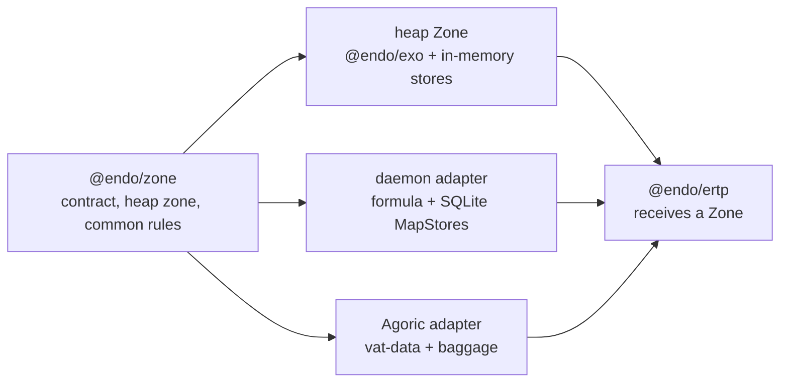

# Back-port `@endo/zone`

| | |
|---|---|
| **Created** | 2026-07-30 |
| **Author** | Kris Kowal (prompted) |
| **Status** | Proposed |

## What is the Problem Being Solved?

`@endo/ertp` needs one vocabulary for allocating its stateful facets and
collections, while keeping the choice of heap, daemon persistence, or Agoric
vat durability with its host. The existing `@agoric/zone` solves that problem,
but its package boundary pulls in `@agoric/store` for heap collections and
`@agoric/vat-data` for virtual and durable ones. A direct dependency would put
an Endo package back behind Agoric's vat runtime; merely accepting an untyped
object would leave every consumer to rediscover the persistence and collision
rules.

This design back-ports the portable contract as `@endo/zone`. It is a
prerequisite for the durable phase of the `@endo/ertp` design on
[PR #778](https://github.com/endojs/endo-but-for-bots/pull/778), not an ERTP
implementation and not a replacement for SwingSet's durable storage.

## Design

### A portable allocation contract

`@endo/zone` exports the `Zone` and store-provider types, `makeHeapZone`, the
`makeOnce` machinery, and promise-watcher helpers. A Zone groups compatible
allocation powers:

```js
const issuerZone = zone.subZone('issuer');
const makePurse = issuerZone.exoClass('Purse', PurseI, init, methods);
const balances = issuerZone.mapStore('balances');
const ledger = issuerZone.makeOnce('ledger', () => balances);
```

The public surface stays compatible with the useful `@agoric/zone` shape:
`exo`, `exoClass`, `exoClassKit`, `subZone`, `makeOnce`, `watchPromise`,
`mapStore`, `setStore`, `weakMapStore`, `weakSetStore`, and `isStorable`.
Every Zone is a capability, so passing a sub-zone gives a consumer a separate
label namespace rather than access to its parent store.

`makeHeapZone(baseLabel?)` is the first concrete implementation. It uses
`@endo/exo` and Endo-owned in-memory collection implementations with the
`MapStore` / `SetStore` error and key semantics. It does not import
`@agoric/store`. The store layer must support scalar and full `M.key()` keys,
reject duplicate `init`/`add`, distinguish absent-key errors from `has`, and
provide no enumeration or size operation for weak stores.

The package also exports a narrow host-adapter constructor. A host supplies its
exo makers, named-store providers, storable predicate, and sub-zone maker; the
constructor supplies label scoping, one-use enforcement, and the common
surface. Thus the Endo daemon can provide a durable Zone over its formula and
SQLite MapStores without teaching `@endo/zone` about SQLite, and Agoric can
continue to provide its baggage-backed adapters without a reverse dependency.



### Naming and `makeOnce`

Named allocation is a correctness boundary, not a convenience. `makeOnce(key,
maker)` uses a backing map when the host supplies one: an existing value is
returned after restart or upgrade, otherwise the maker's storable result is
initialized under the key. A detached, per-incarnation set records every key
used by `makeOnce` and every wrapped provider. Reusing a key in one
incarnation fails before the provider runs. This detects accidental duplicate
kind, singleton, store, and sub-zone definitions rather than silently creating
incompatible state.

The core package owns only category-to-key policy: classes and class kits use a
stable kind key; singleton exos reserve both that kind key and a singleton key;
stores and sub-zones reserve their labels. Backends do not expose their
vatstore-key encoding through the public API. A host that has legacy durable
keys supplies its own key mapper so back-porting preserves existing data.

`detached()` remains available to the implementation and adapter providers for
the ephemeral used-key set, but detached stores are explicitly anonymous: they
must not be used as a durable zone's system of record.

## Design Regrets and Constraints

| Observed regret | Consequence in `@endo/zone` |
|---|---|
| The current package splits portable helpers into `@agoric/base-zone` but makes heap zones depend on `@agoric/store`. | Publish one Endo-owned portable package; move or implement only the heap collection substrate it needs. No `@agoric/*` runtime dependency. |
| `virtual.js` and `durable.js` name SwingSet allocation modes as if they were universal Zone semantics. | Keep those as host adapters. The core contract says what a provider promises, not how a runtime persists it. |
| `isPassable` is enough for heap storage but not proof that a value can survive an upgrade. | Keep `isStorable` as the provider's admission check. Durable adapters must enforce their own durable-value rule and test rejection before persistence. |
| Reusing a label can create a different durable kind or overwrite an assumed singleton. | Preserve per-incarnation duplicate detection across all provider categories; test same-label cross-category collisions. |
| A backend-specific label-to-vatstore-key convention leaks durability representation into clients. | Put stable category naming in the core and legacy encoding behind an adapter; no client constructs storage keys. |
| A generic `Map` does not supply `MapStore` key equality, weak-key, ordering, or absent-key semantics. | Treat the collection contract as part of the prerequisite; do not substitute JS `Map` or daemon pet-name directories. |
| Persistent stores need retention accounting and restart reconstruction, not only a serializable value codec. | The daemon adapter builds on the daemon persistent-MapStore work, including write-through rows, retention edges, and restart tests; it is not a wrapper around a heap Zone. |
| `watchPromise` is sometimes a VatData primitive and sometimes an `E.when` fallback. | Specify only its observable callback contract in the core; a host may replace the implementation when it needs upgrade-aware scheduling. |

The MapStore constraint follows the daemon's related design,
[persistent stores](../packages/daemon/designs/daemon-persistent-stores.md):
strong entries retain their remotable keys and values, weak stores do not retain
their key, and restart restoration must seed retention before collection. The
daemon's store is a durable-adapter input, not code to copy into the portable
heap implementation.

## Phased Implementation

1. **Portable core and heap Zone.** Add `packages/zone` as `@endo/zone`, with
   types, `makeOnce`, category key policy, promise-watcher fallback, and heap
   exos/stores. Port focused compatibility tests for labels, `makeOnce`, store
   failures, weak-store restrictions, sub-zone isolation, and watchers.
2. **Agoric compatibility adapter.** Change `@agoric/zone` to depend on and
   re-export the Endo contract while retaining its vat-data virtual and
   baggage-backed durable constructors. Exercise an existing durable-zone
   upgrade fixture to prove stable legacy keys and `makeOnce` revival.
3. **Daemon durable adapter.** Once the daemon MapStore phases provide the
   required strong and weak operations, implement its Zone adapter over the
   formula/SQLite substrate. Test restart and collection-retention behaviour
   through the Zone surface, not by inspecting tables.
4. **ERTP adoption.** Make `@endo/ertp` accept a Zone, use a heap Zone for its
   initial kit, and add durable-kit tests against both daemon and Agoric
   adapters. `@endo/ertp` does not import either adapter.

## Testing Considerations

The portable suite runs each semantic test against the heap Zone. Adapter suites
add the properties their host alone can promise: an Agoric upgrade returns the
same `makeOnce` value and a daemon restart retains a strong-store value without
retaining a weak key. A cross-adapter ERTP fixture must show that a kit's
observable API is the same under all three Zones; identity preservation during
the Agoric migration remains an ERTP test, not a Zone test.

## Open Questions

- Should the Endo heap collection substrate be a private implementation detail
  of `@endo/zone`, or an independently exported `@endo/store` package for
  direct users?
- Which exact daemon MapStore phases are required before the daemon adapter can
  claim the full Zone surface, especially weak stores?
- Does `watchPromise` need an explicit host capability in the adapter
  constructor, or is the Endo fallback sufficient until a host overrides it?

## Prompt

> Back-port `@endo/zone` as a prerequisite for the ERTP migration. Research
> design regrets for zones, including related work from dckc and especially
> MapStores. Produce a parallel design exercise before the ERTP migration
> proceeds.

Source review: [endojs/endo-but-for-bots PR #778 review](https://github.com/endojs/endo-but-for-bots/pull/778#pullrequestreview-4815067371).
