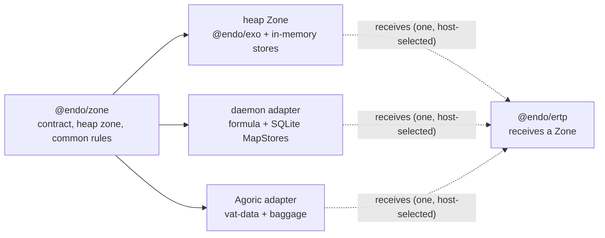

# `@endo/zone`: A Portable Allocation Contract Back-Ported from `@agoric/zone`

| | |
|---|---|
| **Created** | 2026-07-30 |
| **Updated** | 2026-09-05 |
| **Author** | Kris Kowal (prompted) |
| **Status** | Proposed |

## What is the Problem Being Solved?

`@endo/ertp` needs one vocabulary for allocating its stateful facets and
collections, while keeping the choice of heap, daemon persistence, or Agoric
vat durability with its host. The existing `@agoric/zone` solves that problem,
but its package boundary pulls in `@agoric/store` for heap collections and
`@agoric/vat-data` for virtual and durable ones. A direct dependency would put
an Endo package back behind Agoric's vat runtime; merely accepting an untyped
object would leave every consumer to rediscover the persistence and collision
rules.

Terms of art this design leans on:

- **ERTP** (Electronic Rights Transfer Protocol) is Agoric's asset-issuance
  library, the primary consumer this contract serves.
- **SwingSet** is Agoric's deterministic vat runtime.
- A **vat** is a unit of that runtime with its own durable heap.
- An **incarnation** is one run of a vat between upgrades. Durable state carries
  across incarnations; heap state does not.
- **baggage** is the per-vat durable root store SwingSet hands a contract on each
  incarnation.
- A **vatstore key** is the string under which SwingSet persists a durable object.
- An **exo** is an exposed (remotable) object minted from an interface guard and a
  set of methods (this repo's `@endo/exo` makes them).
- A **kind** is the reusable definition an exo instance is made from; a *durable*
  kind must be re-defined at the start of every incarnation.

SwingSet, vat, baggage, and vatstore key are host runtime internals the portable
contract deliberately keeps out of its core; exo, kind, and incarnation are the
vocabulary the contract itself uses.

This design **back-ports** the portable contract as `@endo/zone`: it extracts
the reusable shape *out of* the downstream `@agoric/zone` package (which lives in
Agoric's `agoric-sdk` repository and sits atop Endo) and lands it *upstream* in
the Endo tree, so Agoric's package can later depend on Endo's rather than the
reverse. It is a prerequisite for the durable phase of the `@endo/ertp` design on
[PR #778](https://github.com/endojs/endo-but-for-bots/pull/778), not an ERTP
implementation and not a replacement for SwingSet's durable storage.

## Design

The work lands in four phases, referenced by number throughout this section:
**Phase 1** the portable core and heap Zone; **Phase 2** an Agoric compatibility
adapter (a cross-org proposal, may be declined); **Phase 3** the Endo daemon
durable adapter; **Phase 4** ERTP adoption. Full detail is under
[Phased Implementation](#phased-implementation) below.

### A portable allocation contract

A **Zone** is a namespace-scoped allocator: it hands out exos, stores, and
sub-zones under stable names, and remembers which names it has already used so an
allocation happens at most once per name. It is a synchronous, **intra-worker**
construct: every method returns its value directly, and a Zone is used only
within the worker that holds it, never as a remote reference reached with `E()`.

`@endo/zone` exports, from a single root entry point (`.`; the package has no
`exports` subpath map — adapter authors reach `makeAdapterZone` from the root
too): the `Zone` and store-provider types, `makeHeapZone`, `makeAdapterZone`, the
default `isStorable` predicate, and the `watchPromise` promise-watcher helper
(`makeOnce`, `detached`, and the store makers are `Zone` members, not standalone
exports). A Zone groups compatible allocation powers:

```js
const issuerZone = zone.subZone('issuer');
const makePurse = issuerZone.exoClass('Purse', PurseI, init, methods);
const balances = issuerZone.mapStore('balances');
const ledger = issuerZone.makeOnce('ledger', () => balances);
```

The public surface stays compatible with the existing `@agoric/zone` shape:
`exo`, `exoClass`, `exoClassKit`, `subZone`, `makeOnce`, `watchPromise`,
`mapStore`, `setStore`, `weakMapStore`, `weakSetStore`, `isStorable`, and
`detached`. One member is deliberately narrowed: `detached()` stays on the exported
`Zone` type for compatibility (a `zone.detached().mapStore(...)` caller keeps
working), but its result carries the restricted contract described under
[Naming and `makeOnce`](#naming-and-makeonce) below. It is the only member whose
contract differs from `@agoric/zone`'s; every other member matches.

Every Zone and every value a Zone mints is hardened before it is returned, as
this repo's own `@endo/exo` already enforces
([`packages/exo/src/exo-makers.js`](../packages/exo/src/exo-makers.js) hardens
`self` and `methods`): the Zone from `makeHeapZone`/`makeAdapterZone`, the exos
`exoClass`/`exoClassKit` produce, their `methods` and `init` results, the stores,
and the `makeAdapterZone({...})` options bag are all hardened. Every Zone is a
capability, and a capability that is not hardened is a mutation channel for any
consumer that receives a sub-zone, so hardening is part of the contract, not an
implementation nicety.

Hardening is a **core-side** obligation on *every* path that yields a value to a
consumer, not only the mint path and not adapter discipline. The core hardens (or
rejects a non-frozen value) whatever a host store returns on a revival read, and
whatever the Phase-3 resolved view loads back over the substrate, and whatever a
host `exoMakers` returns — exactly as it composes `isStorable` and holds the
detached brand core-side (below) rather than trusting the adapter. Otherwise a
durable adapter whose unmarshal yields a mutable record would hand ERTP a mutable
object under a name the contract advertises as safe. This whole property rests on
a `lockdown()`/`@endo/init` precondition, which `@endo/zone` therefore declares:
without SES initialized, `harden` is absent or a no-op and the not-a-mutation-channel
guarantee evaporates, so the package requires it and the suite exercises the
fake-`harden` case.

A Zone and its sub-zones are local, in-worker capabilities that can be handed to
and held by other code **within the worker that holds them**. They are
deliberately **not** classified as `remotable` (the pass style `@endo/pass-style`
reserves for objects meant to be marshalled and reached across a boundary with
`E()`, per [`packages/pass-style/README.md`](../packages/pass-style/README.md)),
because a Zone is never meant to cross that boundary. What keeps it off the marshal
boundary is structural, not a naming convention: a Zone is a plain hardened object,
not an exo or other remotable, so `passStyleOf` does not classify it as passable
and marshal refuses to serialize it (synchrony alone would not stop this — `E()`
answers a synchronous method fine and wraps the result in a promise, so the real
barrier is pass-style rejection, not the absence of async methods). Every adapter
(Phase 3 below) is additionally required to run *in the consumer's worker* and
expose a resolved synchronous view rather than marshalling the Zone itself, so no
code path hands a Zone to CapTP to be reached remotely. Handing a consumer a sub-zone
therefore gives it a separate label namespace rather than access to its parent
store; the isolation claim below relies on this local-handoff property, so it is
stated here rather than left to the implementation. (This is why the daemon durable
adapter of Phase 3 presents a synchronous surface over a resolved local view of its
durable stores, rather than exposing the daemon's marshalled store directly; see
Phase 3.)

`makeHeapZone(baseLabel?)` is the first concrete implementation. It uses
`@endo/exo` and Endo-owned in-memory collection implementations with the
`MapStore` / `SetStore` error and key semantics. It does not import
`@agoric/store`. The store layer must support scalar and full `M.key()` keys,
reject duplicate `init`/`add`, distinguish absent-key errors from `has`, and
provide no enumeration or size operation for weak stores.

The package also exports a narrow host-adapter constructor, `makeAdapterZone`.
It is the entry point a Phase-2 or Phase-3 adapter author starts from. Its
**construction contract is synchronous**: `makeAdapterZone(opts) => Zone` returns
a hardened Zone directly, exactly as `makeHeapZone` does, and never a promise. A
host with an asynchronous substrate (the Phase-3 daemon) performs its async
revival *itself*, before calling the constructor, and passes the already-resolved
providers and view in through the options bag; the async bootstrap is
daemon-adapter code, not a second return contract on this core export (see
Phase 3). Because it takes more than three collaborators, it takes a single
options bag rather than positional arguments: `makeAdapterZone({ exoMakers,
storeProviders, detachedStoreProvider, hostIsStorable, makeSubZone, keyMapper?,
baseLabel? })`. A host supplies its exo makers, its named-store providers, an
**anonymous** detached-store provider, its narrowing storable predicate, a
sub-zone maker, and optionally a legacy key mapper (see
[Naming and `makeOnce`](#naming-and-makeonce)); the constructor supplies label
scoping, one-use enforcement, and the common surface. The dedicated
`detachedStoreProvider` is what lets `detached()` construct a *host-durable*
anonymous store on a durable adapter — `storeProviders` are named-store providers
and a detached store is anonymous, so without this slot `detached()` could only
fall back to a core heap store, which then could not be durable-through-its-containing-exo
and which the adapter's narrowing predicate would reject when a purse kit's `init`
returned it, breaking the ERTP recovery-set idiom this design names as the intended
use.

The `hostIsStorable` option is deliberately *not* named `isStorable`, because it
is not the predicate: it only **narrows** the core floor. Three roles that the
single name `isStorable` used to conflate are now distinct: the exported default
predicate is `isStorable`; the Zone member `zone.isStorable` reports the
**composed** predicate for that Zone (not the core floor), so a consumer probing
admission through it under a durable adapter gets the right answer; and the option
a host passes to narrow the floor is `hostIsStorable`. Admission **composes as a
conjunction, never a replacement**: the effective predicate is `coreIsStorable(v)
&& hostIsStorable(v)`, so a host predicate can only *narrow* what is admitted,
never widen it. The core default (`coreIsStorable`) admits `isPassable` values and
is fixed to be a **superset of `@agoric/zone`'s current heap `isStorable`
admission set**, so the Phase-2 re-export narrows no existing Agoric caller's
stored value. A durable adapter passes a `hostIsStorable` that additionally
rejects non-durable values; a host with no extra rule passes nothing and gets the
core default alone. Framing the host predicate as a plain override would let a lax
host pass `() => true` and silently drop the core floor, so the contract fixes the
composition rather than trusting adapter discipline. A `hostIsStorable` that
throws or returns a non-boolean is treated as a rejection. The composed predicate
gates **every value-admitting seam** — `mapStore.init`/`set`, `setStore.add`,
store **keys**, `exoClass`/`exoClassKit` `init` results, `makeOnce` results, and
the persisted `watchPromise` watcher — not the `makeOnce` path alone, so a lax
host cannot admit at the store seam what the core floor rejects at the `makeOnce`
seam. The checked value is the already-hardened value (hardening happens before
admission); the structural defense against a read-time-varying value is that
pass-style admission rejects accessor-bearing values outright (`harden` freezes
descriptors but a frozen getter still runs per read, so `harden` is *not* what
closes this), and the backing store re-reads nothing between the check and the
write. Thus the Endo daemon can provide a durable Zone over its formula and SQLite
MapStores without teaching `@endo/zone` about SQLite, and Agoric can continue to
provide its baggage-backed adapters without a reverse dependency.



### Naming and `makeOnce`

Named allocation is a correctness boundary, not a convenience. `makeOnce(key,
maker)` is synchronous and uses a backing map when the host supplies one. The
core tracks each key through three states (**free**, **in-progress**, and
**used**) in a heap `Map` from the key's **fully scoped label** to its state (a
plain in-memory map, not a Zone store; its lifetime is exactly the incarnation), so
two sibling sub-zones that each declare `mapStore('balances')` occupy distinct
entries and do not collide. The state machine on a call:

1. **Collision.** Consult the key-state map *first*, before reading the backing
   map or running the maker. If the key is already **in-progress** or **used**,
   fail. Checking state first is what makes the **used** mark load-bearing: a
   second `makeOnce(sameKey, ...)` in a revived incarnation — whose first call
   marked the key **used** on the revival path below — is caught here rather than
   silently returning the stored value again, which is the exact duplicate this
   boundary exists to catch. (If revival ran first, step 2 would always match a
   key with a backing value and this step would be unreachable.) The
   **in-progress** state closes the reentrancy window: a maker that re-enters
   `makeOnce` on the same key (directly, or through a sub-zone or exo it
   constructs) finds the key **in-progress** and fails, rather than recursing or
   double-defining a kind.
2. **Revival.** Otherwise, if the backing map already holds a value under the key
   (restart or upgrade; tested with `has`, so a stored `undefined`/`null` still
   revives), return it *and mark the key **used*** in the same step. The maker
   does not run on this path, so marking on the maker's success alone would leave
   a revived key unmarked and let a second `makeOnce(sameKey, ...)` in the revived
   incarnation succeed silently; marking here is exactly what step 1 reads on the
   next call, so duplicate detection holds on every path that yields a value.
3. **First creation.** Otherwise mark the key **in-progress**, run the maker,
   check its result against the composed `isStorable`, and hand it to the backing
   store. On acceptance, mark the key **used**. If the maker throws or the result
   is non-storable, return the key to **free** and propagate the exception.

Retry after a released key is guaranteed **only for makers that allocate nothing
in the Zone and leave no persisted effect**. A maker that itself calls
`exoClass`/`mapStore`/`subZone` (the shape of the example under
[A portable allocation contract](#a-portable-allocation-contract)) has already marked
*those inner keys* **used** before it threw, and under a durable adapter it may
have already reserved a durable kind handle in the backing store that the caught
throw does not unwind; retrying then collides on the inner key or orphans the
kind. So the contract is: a durable adapter either makes the maker's provider
writes atomic with the maker (rolled back on throw), or the retry guarantee is
scoped to allocation-free makers, and the adapter states which. "Maker throws on
first use" and "maker allocates, then throws, then retries" are both Phase-1
scenarios for the heap Zone, where no maker has a persisted effect; the durable
partial-effect case moves to the Phase-3 adapter suite.

Revival is **eager, not lazy**, for durable adapters. SwingSet requires every
durable kind with prior-incarnation instances to be re-defined before the first
delivery of the new incarnation completes, so a durable adapter's `makeOnce`
calls run at incarnation start, not on first access; a lazily-revived durable
`exoClass` would fail upgrade on any kind not yet reconnected. The heap Zone has
one incarnation and no revival, so a Phase-1 revival test simulates the
incarnation boundary by constructing a **second Zone over a pre-populated backing
map** rather than restarting anything. Revival returns the stored value as-is; it
does **not** re-validate the value against the current maker's kind or interface
guard, so the injective label-derivation rule below is the sole defense against a
stale or mis-scoped value being cached under a name. An adapter that needs
revalidation adds it, and the design says plainly that the core does not.

The core package owns only category-to-key policy: classes and class kits use a
stable kind key; singleton exos reserve both that kind key and a singleton key;
stores and sub-zones reserve their labels. A label is a **well-formed string**:
the core rejects a non-string label, an empty label, a lone surrogate, or an
embedded NUL at the `subZone`/store/`makeOnce` call site (using the repo's own
`assertPassableString` / `@endo/is-well-formed-string`), so no ill-formed label
reaches a UTF-8/CBOR/SQLite key encoding where a `U+FFFD` substitution or a NUL
truncation could fold two distinct labels onto one durable key. The parent->child
label derivation is **injective**: because the scope separator is outside the
label alphabet (or the derivation is length-prefixed), `subZone('a').mapStore('b/c')`
cannot alias `subZone('a/b').mapStore('c')` and no child label can reconstruct a
sibling's or parent's prefix. Where a host's own storage-key grammar is stricter
than the portable label alphabet — the daemon binds each named store to a pet name
([`packages/daemon/src/pet-name.js`](../packages/daemon/src/pet-name.js): no `/`,
`\0`, or `@`, not `.`/`..`, at most 255 characters) — it is the adapter's
`keyMapper` (below) that injectively encodes a portable label (including a
separator-bearing or long one) into a grammar-legal, length-bounded storage key,
so a kit written and tested against the heap Zone binds unchanged at the daemon
Zone rather than failing late at bind time. Injectivity is a
universally-quantified property, so Phase 1 pins it with a **property-based** test
over arbitrary label paths (`fc.property(arbLabelPath, arbLabelPath, …)` that
shrinks to the minimal aliasing pair), not one hand-picked example. A host that
supplies its own `keyMapper` (an options-bag hook, not prose-only discipline) for
legacy durable keys must preserve injectivity; because the key-state map runs
pre-mapping and cannot catch a mapper-induced alias, the core additionally holds a
**per-incarnation reverse map of post-mapping keys** and rejects a second label
landing on an already-in-use post-mapping key, so a lax or aliasing mapper is
caught structurally rather than left to adapter discipline. The shared adapter
conformance suite carries a mapper-injectivity property (distinct labels —
including case-variant and NFC/NFD-variant labels — map to distinct host keys).
"Sub-zone isolation" in the Phase-1 list is specifically the separator-collision
case (a sibling-alias test), not merely two distinct labels. Backends do not
expose their vatstore-key encoding through the public API; a host with legacy
durable keys supplies its key mapper so back-porting preserves existing data.

`detached()` stays on the exported `Zone` type, but a detached store is
explicitly anonymous: it may not be a Zone's **named, revivable system of
record**. That is the whole of the restriction: embedding a detached store as a
value inside another durable object *is* legal and is the intended
per-instance-collection idiom (Agoric's ERTP holds a per-purse recovery set this
way, `zone.detached().setStore('recovery set')` returned from a purse kit's
`init`; the store is durable *through its containing exo*, revived with it, never
independently by name). The rejected case is registering a detached store under a
*name* the Zone would revive on its own (a named-store provider slot or a
`makeOnce` result) because nothing then reconstructs it across an upgrade.

The restriction is enforced by a **runtime-observable, core-held** brand, not a
type-level tag and not prose. The core holds a per-incarnation `WeakSet` of the
detached stores it makes (house precedent:
[`packages/agentry/src/code-mode-grants.js`](../packages/agentry/src/code-mode-grants.js));
the TypeScript `detached` tag on the store's type is the compile-time *reflection*
of that membership, not the check itself. Because the brand lives in a WeakSet the
core owns, a look-alike store that merely omits a tag is not in the set and a
type cast cannot forge membership. A `WeakSet` is per-incarnation, so the brand
would otherwise **lapse across an upgrade**: a detached store legally revived
*through its containing exo* in incarnation N+1 was minted by incarnation N's core
and is not in the new set, which would silently stop the check firing on exactly
the stores the endorsed idiom creates. The design closes this rather than scoping
the guarantee to the first incarnation: a durable adapter's eager revival
(Phase 3) **re-brands** each detached store it reconstructs — re-entering it into
the new incarnation's `WeakSet` as it loads — so `detached()` membership survives
the persistence boundary and the check fires identically in every incarnation. The
adapter carries the obligation because only it knows, at revival time, which
reconstructed stores were detached; the core exposes the re-branding hook, and the
conformance suite asserts that a *revived* detached store is still rejected as a
named store. Enforcement is **core-side**: the core wraps *every* host-supplied
hook that can widen the boundary — each named-store provider, its `makeOnce`
machinery, and `makeSubZone` (whose result the core re-wraps in the same adapter
shell and rejects if it is identical to any ancestor zone, so a `makeSubZone`
returning a parent or an un-adapted zone cannot drop the composed `isStorable`,
the detached brand, or label scoping for the child) — and rejects a value in the
detached set *before delegating* to the host: the host's own provider never gets
the chance to persist it, so a buggy or lax adapter cannot satisfy the property by
construction. Note that the two checks over a detached store are **distinct
predicates**, not one: the composed `isStorable` still *admits* a detached store
as an embedded member value (it is a legal value inside a durable exo), while the
named-provider/`makeOnce` wrapper *rejects* it as a name of record; folding them
would break the ERTP recovery-set idiom. This makes "may not be a named system of
record" a checkable property of the store rather than a convention a reviewer must
police. The negative test ("an adapter tries to register a `detached()` store as a
named store or `makeOnce` result -> core rejects it", and the same after a
revival) is a Phase-1 scenario.

## Design Regrets and Constraints

| Observed regret | Consequence in `@endo/zone` |
|---|---|
| The current package splits portable helpers into `@agoric/base-zone` but makes heap Zones depend on `@agoric/store` (base-zone's heap path still routes through `@agoric/store`, so depending on `@agoric/base-zone` directly would not remove the dependency; only a full portable back-port would). | Publish one Endo-owned portable package; move or implement only the heap collection substrate it needs. No `@agoric/*` runtime dependency. |
| `virtual.js` and `durable.js` name SwingSet allocation modes as if they were universal Zone semantics. | Keep those as host adapters. The core contract says what a provider promises, not how a runtime persists it. |
| `isPassable` is enough for heap storage but not proof that a value can survive an upgrade. | Keep `isStorable` as the provider's admission check. Durable adapters must enforce their own durable-value rule and test rejection before persistence. |
| Reusing a label can create a different durable kind or overwrite an assumed singleton. | Preserve per-incarnation duplicate detection across all provider categories; test same-label cross-category collisions. |
| A backend-specific label-to-vatstore-key convention leaks durability representation into clients. | Put stable category naming in the core and legacy encoding behind an adapter; no client constructs storage keys. |
| A generic `Map` does not supply `MapStore` key equality, weak-key handling, ordering, or absent-key semantics. | Treat the collection contract as part of the prerequisite; do not substitute JS `Map` or daemon pet-name directories. |
| Persistent stores need retention accounting and restart reconstruction, not only a serializable value codec. | The daemon adapter builds on the daemon persistent-MapStore work, including write-through rows, retention edges, and restart tests; it is not a wrapper around a heap Zone. |
| `watchPromise` is sometimes a VatData primitive and sometimes an `E.when` fallback. | Specify only its observable callback contract in the core; a host may replace the implementation when it needs upgrade-aware scheduling. |

The characterizations of `@agoric/zone`'s internals above (the
`@agoric/store`/`@agoric/vat-data` package boundary, the `virtual.js` /
`durable.js` allocation modes, the `base-zone` split, and the
`isPassable`/`watchPromise` behavior) were read from `agoric-sdk` at
[`packages/zone`](https://github.com/Agoric/agoric-sdk/tree/master/packages/zone)
and [`packages/base-zone`](https://github.com/Agoric/agoric-sdk/tree/master/packages/base-zone).
They describe that package as of this design's authoring; if its heap path later
splits from `@agoric/store`, the first regret narrows and Phase 1's substrate
scope shrinks accordingly.

The MapStore constraint follows the daemon's related design,
[persistent stores](../packages/daemon/designs/daemon-persistent-stores.md):
strong entries retain their remotable keys and values, weak stores do not retain
their key, and restart restoration must seed retention before collection. The
daemon's store is a durable-adapter input, not code to copy into the portable
heap implementation.

## Phased Implementation

1. **Portable core and heap Zone.** Add `packages/zone` as `@endo/zone`, with
   types (a hand-written `.d.ts` the package's `types` export condition points at,
   not a runtime-free `types.js` masquerade), `makeOnce`, category key policy,
   promise-watcher fallback, and heap exos/stores. Landing the package regenerates
   the root `tsconfig.composite.json` (via
   `scripts/generate-composite-tsconfigs.mjs` — regenerated, never hand-edited),
   lands type-clean with **no** new root `tsconfig` exclude entry, needs no
   `.yarnrc.yml` catalog touch (`fast-check` / `@fast-check/ava` are per-package
   devDependencies), and carries a `'@endo/zone': major` changeset introducing the
   package and naming the heap-only scope of this phase. Port focused compatibility
   tests for: labels (including a **property-based injectivity** test over
   arbitrary label paths, and rejection of ill-formed and out-of-alphabet labels);
   `makeOnce` revival (a second Zone over a pre-populated backing map) **plus a
   second `makeOnce` on the revived key asserting it rejects**; a **maker that
   re-enters `makeOnce` on its own key** (directly and via a sub-zone/exo it
   constructs) asserting it fails rather than recursing; the maker-throws and
   maker-allocates-then-throws-then-retries release cases; the **`isStorable`
   conjunction** (a lax host `() => true` cannot widen the core floor, and the host
   predicate is *not invoked* once the core floor already rejects — a spy
   provider); **same-label cross-category collisions** and the sub-zone
   **separator-collision** (sibling-alias) case; a host **key-mapper alias**
   rejected by the post-mapping reverse map; the core rejection of a `detached()`
   store registered as a named store or `makeOnce` result (and the same after a
   simulated revival, once re-branding lands with the Phase-3 adapter); store
   failures; weak-store restrictions; and watchers.
2. **Agoric compatibility adapter.** *Propose* to `@agoric/zone` (which lives
   in `agoric-sdk`, a separate repository under Agoric's governance, not this
   one) that it depend on and re-export the Endo contract while retaining its
   vat-data virtual and baggage-backed durable constructors. Exercise an
   existing durable-zone upgrade fixture to prove stable legacy keys and
   `makeOnce` revival. This phase is a **cross-org coordination dependency**, not
   a change this repository can land on its own: it requires Agoric's
   maintainers to accept the reverse dependency and the re-export shape. If they
   decline or want a different shape, the fallback is that `@endo/zone` ships and
   is adopted by Endo consumers regardless, and Agoric's `@agoric/zone` stays
   independently maintained and unconverged. Phases 1, 3, and 4 do not depend on
   Phase 2 landing upstream. See the Open Questions for the acceptance risk.
3. **Daemon durable adapter.** Once the daemon MapStore phases provide the
   required strong and weak operations, implement its Zone adapter over the
   formula/SQLite substrate. The daemon's persistent-store surface is asynchronous
   (`M.callWhen(...)` to a marshalled far reference, per
   [persistent stores](../packages/daemon/designs/daemon-persistent-stores.md)),
   while the Zone surface is synchronous, so the adapter **runs in the consumer's
   worker** and bridges the two at a **named synchronization point**, not an
   asserted one.

   *Host-side async bootstrap is the synchronization point.* `makeAdapterZone`
   itself stays synchronous (§ [A portable allocation contract](#a-portable-allocation-contract));
   there is no promise-returning variant of the core export. The daemon adapter's
   **host bootstrap code** — not the core constructor — is what awaits, during
   worker bootstrap and before any user code runs: it drives the daemon's async
   `M.callWhen(...)` round-trips to load every previously-opened store into a
   resolved in-worker view (the eager revival described under
   [Naming and `makeOnce`](#naming-and-makeonce)), then calls the synchronous
   `makeAdapterZone`, passing that resolved view in as its `storeProviders` /
   `detachedStoreProvider`. The durable *kinds* are re-defined not by the factory
   but by user code's own early `exoClass(...)` calls in the first delivery — a
   kind's re-definition needs its behavior, which is user code the factory is never
   handed — and the resolved handles make those calls synchronous, so SwingSet's
   re-define-before-first-delivery requirement is met by early user code running
   over an already-populated view, not by the factory re-defining kinds it could
   not construct. No later synchronous call ever awaits mid-flight, because first
   access can only follow the awaited bootstrap. This eager load makes
   incarnation-start wall time and resident view size grow with the total
   persisted-allocation count; the design does not bound or optimize that now, but
   names the metric here (incarnation-start wall time and resident view size versus
   persisted-store count) and defers measuring it to the Phase-3 adapter suite, so
   the generic Zone surface does not silently conceal the cost.

   *Write-through is provisional, with defined failure semantics.* A synchronous
   mutation (`init`/`set`/`add`, or a `makeOnce` first-creation) updates the
   resolved view synchronously and enqueues a write-through to the async daemon
   substrate, so the synchronous return is **provisional**: it is not a claim the
   row is durably committed. The adapter exposes a per-incarnation commit barrier
   the host `await`s before it treats the incarnation's work as landed. A
   write-through failure has two windows, and they need different terminal states.
   Across a **crash** between the synchronous return and the daemon ack, no value
   escaped a live incarnation, so the key is left **free** for the next incarnation
   to re-allocate cleanly — never half-committed under a name a later `makeOnce`
   would both revive and re-create. But *within a live incarnation* the synchronous
   return already handed the caller a live value and marked the key **used**;
   rolling that key back to **free** would let a later `makeOnce(sameKey)` mint a
   **second** live value under one name while the first is still reachable — the
   once-only invariant broken without any crash. So an in-incarnation write-through
   failure moves the key to a distinct terminal **failed** (poisoned) state, not
   **free**: the key refuses re-allocation for the rest of the incarnation, and the
   failure is made **fatal** through the commit barrier (the host aborts the
   incarnation rather than continuing), so the escaped value is never joined by a
   second under its name. The next incarnation then revives or re-allocates from
   the last committed state cleanly, so no incarnation ever observes a key marked
   **used** that the durable substrate did not commit. A partial-bootstrap failure
   (some durable kinds re-defined, others not) is fatal for the same reason:
   SwingSet cannot safely continue from a half-defined kind set. Test restart, this
   in-incarnation write-through-failure poisoning, the crash-window free path, and
   collection-retention behavior through the Zone surface, not by inspecting tables.
   The prerequisite daemon MapStore work is **Status: Not Started** today, so this
   phase is gated on it (see the exit criterion in Phase 4).
4. **ERTP adoption.** Make `@endo/ertp` accept a Zone, use a heap Zone for its
   initial kit, and add durable-kit tests against the adapters that landed. The
   **runnable exit criterion this repository can land on its own today is
   heap-only**: the daemon durable adapter of Phase 3 is gated on the
   `daemon-persistent-stores` work, which is **Not Started**, so heap is the only
   Zone reachable without a prerequisite landing first. Phase 4 is additionally
   gated on the `@endo/ertp` design itself, which is not yet landed: it is the open
   draft [PR #778](https://github.com/endojs/endo-but-for-bots/pull/778) carrying
   kriskowal's request for changes (2026-07-30) — the review this design answers —
   so Phase 4 cannot begin until that design settles. `@endo/zone` is its
   prerequisite, not a build atop a settled seam. As the daemon adapter
   lands, the matrix widens to heap-plus-daemon; the Agoric adapter is added only
   if Phase 2 lands upstream. An adapter may declare a Zone surface subset it does
   not yet support, so ERTP's conformance run against it skips the unsupported
   properties rather than blocking the whole matrix. `@endo/ertp` does not import
   any adapter.

## Testing Considerations

The portable suite is a **shared conformance suite** each implementation runs,
not a heap-only suite plus host extras: the store contract properties (duplicate
`init`/`add` rejection, absent-key-vs-`has`, weak-store non-enumeration, and
`M.key()` equality plus rank iteration order **up to rank ties**) are owed by
every provider, so each adapter runs the same suite against its own Zone. The
iteration-order property is qualified because rank order is not a total order over
keys — `compareRank` treats all remotables as tied, and the tie propagates into
containers — so a heap `Map` (insertion order) and a SQLite/encoded-key store
(B-tree order) legitimately differ among tied keys. The suite therefore asserts
that iteration agrees with `compareRank` only where it is a total order; order
among tied keys is unspecified and must not be asserted. Because the central claim ("a
kit's observable API is the same under every Zone") is universally quantified
over operation sequences, the suite is model-based rather than a single example
fixture: fast-check `fc.commands` over `{mapStore.init/get/set/delete/has,
setStore.add/delete/has, the weak-store operations, subZone, makeOnce (including a
throwing maker, a non-storable result, and a re-entrant maker), exoClass}` checked
against an in-memory model. It draws keys and values from the repo's own
`@endo/pass-style/tools/arb-passable.js` arbitraries (`arbKey`, `arbPassable`,
whose `exclusions` parameter expresses a durable adapter's narrowed domain) plus
adversarial inputs (`NaN`, `-0`, `1n` vs `1`, structurally-equal distinct
copyRecords, distinct remotables), and runs under `@fast-check/ava` (at
`catalog:dev`, as `packages/pass-style` / `packages/patterns` / `packages/exo-git`
already do), once per implementation.
`packages/exo-git/test/kit-conformance.test.js` is the in-repo precedent for
**property-based** fast-check conformance — it uses `fc.asyncProperty`, not
`fc.commands`, which appears nowhere in the tree yet, so this model-based suite
would be the first of its shape here. Adapter suites then add the properties their host alone
can promise: an Agoric upgrade returns the same `makeOnce` value, and a daemon
restart retains a strong-store value **without** retaining a weak key: a
negative-retention assertion, so the test must force the host's collection point
(the `daemon-persistent-stores` collection trigger) and then observe the weak
key's absence through the Zone surface, or it passes whether or not the key
leaks. The cross-adapter ERTP fixture covers **whichever Zones have landed** (heap at
minimum, plus the daemon Zone once its Phase-3 adapter lands, and the Agoric Zone
if Phase 2 has landed upstream); it does not require the Agoric adapter to be
runnable. Identity preservation during the
Agoric migration remains an ERTP test, not a Zone test.

## Open Questions

- Should the Endo heap collection substrate be a private implementation detail
  of `@endo/zone`, or an independently exported `@endo/store` package for
  direct users?
- Which exact daemon MapStore phases are required before the daemon adapter can
  claim the full Zone surface, especially weak stores?
- Does `watchPromise` need an explicit host capability in the adapter
  constructor, or is the Endo fallback sufficient until a host overrides it?
- Will Agoric accept the reverse dependency of Phase 2, `@agoric/zone`
  depending on and re-exporting `@endo/zone`? This is a cross-org acceptance
  question outside this repository's control; the phase plan treats it as such
  and provides the independent-adapter fallback above.

## Prompt

The review that requested this design carried its instruction in two inline
comments, quoted verbatim below.

> We should back-port `@endo/zone` as a prerequisite. Please post a job to do a
> parallel exercise for the creation of an `@endo/zone` researching all design
> regrets for zones. Post a link to the new design PR here.

(kriskowal, [endojs/endo-but-for-bots#778 (comment)](https://github.com/endojs/endo-but-for-bots/pull/778#discussion_r3679796366), 2026-07-30.)

> We have options. Please look at related work in the garden from dckc and
> especially MapStores.

(kriskowal, [endojs/endo-but-for-bots#778 (comment)](https://github.com/endojs/endo-but-for-bots/pull/778#discussion_r3679800383), 2026-07-30.)
