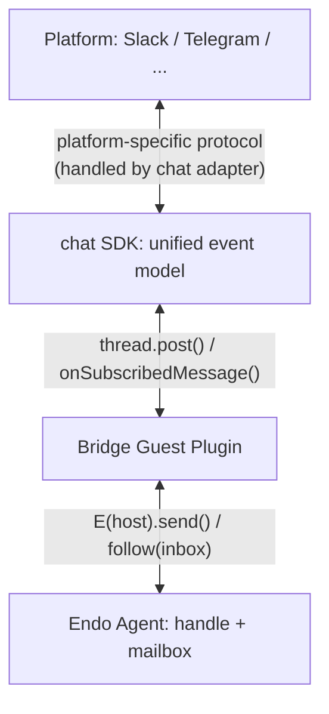

# EndoClaw: Channel Bridges

| | |
|---|---|
| **Created** | 2026-03-03 |
| **Updated** | 2026-06-08 |
| **Author** | Kris Kowal (prompted) |
| **Status** | Not Started |
| **Parent** | [endoclaw](endoclaw.md) |

## Summary

A channel bridge adapts an Endo agent (handle and mailbox) to an
external messaging platform, holding a particular account on that
platform.
The bridge is a confined guest plugin that translates between Endo's
inbox messaging and the platform's message protocol.
Each bridge instance is scoped to one agent and one platform account.

The [`chat`](https://www.npmjs.com/package/chat) package (Vercel) is
the recommended foundation.
It provides a unified adapter SDK: write bridge logic once against
`Chat` + `thread.post()` / `thread.subscribe()`, and platform adapters
handle protocol differences for Slack, Microsoft Teams, Discord,
Telegram, Google Chat, GitHub, Linear, Twilio, WhatsApp, Messenger,
and a generic Web endpoint.

The bridge is a concrete instance of the abstract *service connector*
pattern described in
[daemon-capability-persona](daemon-capability-persona.md) (DCP).
The DCP-level vocabulary (*delegate*, *epithet*, *connector*,
*credential custody*) is normative for this design; the channel bridge
inherits DCP's anti-impersonation invariant and its identity-vs-action
facet split.
This document specialises DCP to the npm `chat` package's adapter
shape and to Endo's mailbox primitives.

## The `chat` SDK

The `chat` package is a TypeScript SDK with an adapter pattern:

```ts
import { Chat } from 'chat';
import { createSlackAdapter } from '@chat-adapter/slack';

const bot = new Chat({
  userName: 'endo-bridge',
  adapters: { slack: createSlackAdapter() },
  state: createMemoryState(), // or Redis
});

bot.onNewMention(async (thread) => {
  await thread.subscribe();
  // Forward to Endo agent inbox
});

bot.onSubscribedMessage(async (thread, message) => {
  // Forward platform message to Endo inbox
  // Forward Endo reply to platform thread
});
```

### Available adapters

The adapter set has grown since the 2026-03-03 initial draft.
As of 2026-06-08 the npm `chat` package ships ten platform adapters
plus the generic web endpoint:

| Package | Platform | Features |
|---------|----------|----------|
| `@chat-adapter/slack` | Slack | Mentions, reactions, cards (Block Kit), modals, streaming, DMs, files |
| `@chat-adapter/teams` | Microsoft Teams | Mentions, cards (Adaptive Cards), DMs |
| `@chat-adapter/discord` | Discord | Mentions, reactions, cards, DMs |
| `@chat-adapter/telegram` | Telegram | Mentions, reactions, DMs |
| `@chat-adapter/gchat` | Google Chat | Mentions, reactions, cards, DMs |
| `@chat-adapter/github` | GitHub | Mentions, reactions (issues/PRs) |
| `@chat-adapter/linear` | Linear | Mentions, reactions (issues) |
| `@chat-adapter/twilio` | SMS via Twilio | Text-only delivery; reply threading by phone number |
| `@chat-adapter/whatsapp` | WhatsApp | Mentions, reactions, media; Meta Cloud API |
| `@chat-adapter/messenger` | Facebook Messenger | Mentions, reactions; Meta Cloud API |
| `@chat-adapter/web` | Generic Web | Bridge-defined webhook in / webhook out; for unsupported platforms or for self-hosted UIs |

The first bridge implementation does not need to support all ten.
A reasonable first cut is Slack, Discord, and Telegram (the three with
the richest feature coverage in the SDK); the remaining adapters land
incrementally as users ask.

### Key SDK features

- **Unified event model:** `onNewMention`, `onSubscribedMessage`,
  `onReaction`, `onButtonClick`, `onSlashCommand`.
- **Thread abstraction:** `thread.post()`, `thread.subscribe()`,
  ephemeral messages, streaming.
- **JSX card components:** Platform-agnostic cards that render as
  Block Kit (Slack), Adaptive Cards (Teams), or Google Chat Cards.
- **State management:** `@chat-adapter/state-redis`,
  `@chat-adapter/state-memory`, `@chat-adapter/state-ioredis`.

## Architecture



The bridge plugin is a standard Endo guest module (`make(powers)`)
that:

1. Receives platform credentials as an opaque capability (OAuth or
   `HttpClient`): the bridge never sees raw tokens directly.
   This realises DCP's *credential custody* property at the
   channel-bridge layer.
2. Instantiates the `chat` SDK with the appropriate adapter.
3. On platform message, forwards to the Endo agent's inbox via
   `E(host).send(agentName, text)`.
4. Subscribes to the agent's inbox (`follow`) and forwards outgoing
   messages to the platform thread via `thread.post()`.
5. Maps Endo message types to platform features:
   - `package` messages, to text with `@`-mentions for embedded
     references.
   - `form` messages, to platform cards (JSX) with input fields, or
     fallback to text prompts.
   - `value` messages, to text summary with a link back to the Chat UI
     for full inspection.

### Message mapping

| Endo Message | Platform Rendering |
|--------------|--------------------|
| `package` (text + refs) | Text message; refs rendered as names |
| `form` (fields) | JSX card with input fields (Slack/Teams/Discord) or text prompt (Telegram/GitHub) |
| `value` (reply with value) | Text summary + Chat UI link for inspection |
| `request` (promise) | Text notification; resolution posted as reply |

### Form bridging

The `chat` SDK's JSX card system maps well to Endo's form fields:

```tsx
// Endo form fields, to platform card
const renderForm = (fields) => (
  <Card>
    <Section>
      {fields.map(f => (
        <TextInput label={f.label} placeholder={f.example} id={f.name} />
      ))}
    </Section>
    <Actions>
      <Button action="submit">Submit</Button>
    </Actions>
  </Card>
);
```

On Slack and Teams, this renders as a native interactive card.
On Telegram and GitHub, where cards are limited, the bridge falls back
to a text prompt listing the fields, with the user replying in a
structured format.

### Streaming bridging

[daemon-message-streaming](daemon-message-streaming.md) (Phase 1
landed as PR #287; the design is currently in revision against the
linked-list edit-history reshape per PR #125) adds an optional
`streamId` field to the message envelope and exposes
`streamReply(messageNumber, options?)` on the mail facet.
A streaming message is delivered immediately and the recipient
consumes a `StreamReader` (async iterator of `StreamEvent` records:
`append`, `phase`, `end`, `abort`).
On `end()` the assembled text is persisted as the message's `strings`
payload; on `abort()` the partial text plus an abort reason are
persisted.

The npm `chat` SDK has its own streaming primitive that posts the
first chunk as a normal message and edits the message on each
subsequent chunk (`streamingUpdateIntervalMs` debounces edits to
respect platform rate limits).
The bridge maps Endo's CapTP-rides-method-calls stream onto the SDK's
post-then-edit model:

- The bridge's `followMessages` loop notices a `streamId` on an
  outbound inbox entry and switches the entry's platform rendering
  from `thread.post(text)` to `thread.post(initialChunk)` followed by
  per-chunk `message.edit(...)` calls.
- The bridge wraps the `StreamReader` and emits `message.edit` calls
  on each `append` event, debouncing to the SDK's configured
  `streamingUpdateIntervalMs` (default 250 ms; the bridge should not
  set a value below the platform's rate-limit floor).
- On `phase`, the bridge updates a UI affordance the SDK exposes
  (Slack: "is typing..." indicator; Discord: bot status; on platforms
  without a native affordance, the phase is folded into the message
  body as a status line).
- On `end`, the bridge issues a final `message.edit(...)` and stops
  the loop.
  The Endo daemon has already persisted the assembled text, so a
  later restart re-reads the settled message and posts no further
  edits.
- On `abort`, the bridge appends an error suffix (for example,
  "[interrupted: <reason>]") via one last `message.edit(...)`.

The reverse direction (platform-side editing back into Endo) is
covered by the edit-history section below.

### Edit-history bridging

PR #125 reshapes the daemon's edit-history surface as a linked list
of revisions.
The maintainer's 2026-06-08T04:47Z answers on PR #125 fix four
ground-truth properties this bridge inherits:

1. The initial `send`/`reply` reserves a *slot*; each subsequent edit
   replaces the message in that slot.
2. Only after the message is `done: true` does the daemon persist the
   chain by capturing a `previous` link from the now-current revision
   to the prior settled one.
   The formula type of the prior revision is identical (this is
   *messages link prior edition messages* rather than a separate
   *message-revision* formula type).
3. On daemon restart, an ephemeral (`done: false`) message left
   hanging by an aborted process persists as a *ghost* in the slot,
   and cleanup is the user's or their agent's choice rather than the
   daemon's.
4. There is no reasonable signal for when an ephemeral message
   quiesces except the `done` bit, so a recipient must survive
   streams of message updates that potentially never settle.
   A new `cancelMessage` verb (which the daemon lacks today) is
   acknowledged as the sender-side affordance for terminating an
   ephemeral message that will never settle on its own; the bridge
   surfaces platform-side cancellation through this verb when it
   lands (see *Open questions* for the bridge's stance while the verb
   is absent).

The bridge's two platform-edit cases:

- **Platform-side edit of a bridged outbound message** (the user
  edits a message the *agent* already posted to the platform; for
  example, a moderator corrects a typo in a bot's Slack post).
  In the maintainer's framing the agent is the sender, so the agent's
  daemon-side message is the one that should change.
  The bridge has two options.
  (a) Treat the platform edit as an out-of-band fact and ignore it
  Endo-side; the platform copy diverges from the daemon copy.
  (b) Open a Bridge-authored edit on the agent's behalf via the
  per-guest *edit-on-behalf* configurability the maintainer flagged
  (PR #125 answer #1 hints at this as a per-guest property: *"This
  might be a property of a guest, configurable at the time a guest is
  created."*); the bridge passes the new text plus a `previous` link
  to the prior revision, the daemon walks the chain on the recipient
  side, and the Endo copy converges with the platform copy.
  The default in the first cut is (a), with (b) reserved for a
  follow-up that requires the per-guest edit-on-behalf configurability.
- **Platform-side edit of an inbound bridged message** (the user
  edits a Slack message they sent that was forwarded as an inbound
  inbox entry to the agent).
  The platform-side sender is the human, not the agent, so the agent
  (and any other inbox watcher) should see the edit.
  The bridge issues `editMessage(slot, newPayload, { done: true })`
  on behalf of the inbound message's sender-side Handle.
  The persisted chain captures `previous`; readers (Chat UI,
  recipient agent) walk it on `loadMailboxState`.

Both cases assume the per-guest edit-on-behalf configurability exists.
While it does not, the bridge falls back to the default-(a) stance for
outbound edits and **treats inbound platform edits as new inbox
messages** (a thread-reply, with a body that begins with "[edited
prior:]" plus a reference to the prior message's slot).
This degrades politely until the daemon surface matures.

### Endo Idiom

**Bridge is a confined guest.** The bridge plugin runs in a SES-locked
worker with only its granted capabilities.
It cannot read other agents' inboxes, access the filesystem, or make
network requests outside the platform API.

**One bridge per agent per account.** Each bridge instance is scoped
to a single Endo agent and a single platform account.
The host decides which agents are bridged and to which platforms.
This avoids a single bridge becoming a choke point with broad
authority.

**Platform credentials are capabilities.** The bridge receives an
`OAuth` or `HttpClient` capability for the platform API; it never
sees the raw bot token.
Revocation of the platform credential is instant via
`OAuthControl.revoke()`.
This is DCP's *credential custody* property; the bridge is the
*connector* in DCP's vocabulary.

**State is Endo-native.** Rather than using the `chat` SDK's Redis
state adapter, the bridge can persist thread-to-inbox mappings in the
Endo formula store via pet names.
Each platform thread maps to an Endo message number.

**Identity rendering inherits from DCP.** The agent's epithet chain
(per DCP) is the source of truth for the bridge's platform-side
identity disclosure.
The bridge reads the agent's epithet chain at startup (and on each
change) and renders it into the platform's identity fields per
platform convention:

- **Slack**: bot display name carries the epithet chain
  (for example, "Aifred [AI assistant to Alice]"); BOT badge is native.
- **Discord**: bot bio carries the epithet chain; BOT badge is native.
- **Telegram**: the bot's profile bio carries the epithet chain;
  no native bot badge, so the bridge prepends a `[BOT]` marker on
  first message in a thread.
- **GitHub**: the bot's GitHub login is the persistent identity;
  the epithet chain is rendered into the bot's bio and into a
  one-line preamble at the top of each issue or PR comment when the
  epithet chain has changed since the bot's last comment.
- **Linear**, **Twilio**, **WhatsApp**, **Messenger**, **Web**: the
  bridge falls back to prepending the epithet chain to the message
  body when the platform lacks an identity field the bot can author.
  This is DCP's *generic OAuth* fallback case applied at the
  channel-bridge layer.

The mapping is an interpretation; the per-platform choice belongs to
the per-adapter bridge implementation rather than to this design.

## Daemon mail verbs the bridge exercises

The bridge consumes the daemon's existing mail surface from
[`packages/daemon/src/interfaces.js`](../packages/daemon/src/interfaces.js).
Today's `EndoHost` and `EndoGuest` mail facets expose:

| Verb | Direction | Bridge use |
|---|---|---|
| `handle()` | self | Read agent's Handle to query epithets per DCP |
| `listMessages()` | inbound snapshot | One-shot inbox dump for bridge bootstrap |
| `followMessages()` | inbound stream | Primary outbound platform feed |
| `send(recipient, strings, edgeNames, refs)` | outbound | Bridge-authored inbound messages from platform to agent |
| `reply(messageNumber, strings, edgeNames, refs)` | outbound | Bridge replies to specific bridged messages |
| `request(recipient, label, resultName?)` | outbound | Bridge-issued question to agent on platform's behalf |
| `resolve(messageNumber, refName)` / `reject(messageNumber, reason?)` | inbound | Bridge-mediated resolution of an agent's outstanding request from the platform |
| `dismiss(messageNumber)` / `dismissAll()` | bookkeeping | Bridge-managed inbox cleanup |
| `adopt(messageNumber, edgeName, petName)` | bookkeeping | Bridge captures a reference from a bridged message into the bridge's own namespace |
| `submit(messageNumber, values)` | outbound | Bridge submits a form on behalf of the platform-side user |
| `sendValue(messageNumber, refPath)` | outbound | Bridge replies to a `value`-expecting message with a stored value |

Streaming and edit-history (per the *Streaming bridging* and
*Edit-history bridging* sections above) introduce additional verbs that
the bridge composes with the existing surface:

| Verb | Status | Bridge use |
|---|---|---|
| `streamReply(messageNumber, options?)` | PR #287 phase 1 landed | Recipient-side: bridge observes the `streamId` envelope field and consumes the `StreamReader`; sender-side: bridge issues streaming replies for slow platform-to-agent ingestion if useful (deferred to a later cut) |
| `editMessage(messageNumber, newPayload, { done })` | PR #125 in CHANGES_REQUESTED, awaiting linked-list reshape | Bridge edits an outbound bridged message after a platform-side edit, with the recipient seeing a persisted chain on the next `loadMailboxState` once `done: true` |
| `messageHistory(messageNumber)` | PR #125 in CHANGES_REQUESTED | Bridge reads the persisted chain to render a platform-side revision affordance |

### Gaps the bridge surfaces

The bridge implementation exposes three gaps in the daemon mail
surface that this design records for follow-up rather than resolves:

1. **`cancelMessage(messageNumber)`** is missing.
   PR #125 answer #4 acknowledges this: there is no sender-side verb
   for terminating an ephemeral message that will never settle on its
   own.
   The bridge needs this verb to surface a platform-side
   cancellation (a user closes the Slack thread that triggered the
   agent's streaming reply, or the platform rate-limits the bridge
   and the bridge needs to give up cleanly).
   The verb's shape is not designed here; the design depends on the
   `cancelMessage` decision the daemon-message-streaming or PR #125
   builder makes.
2. **A sender-side ephemeral-message cleanup verb** is missing.
   Per PR #125 answer #3, a daemon restart leaves the *ghost* of an
   in-flight ephemeral message in its slot, and cleanup is the
   user's or their agent's responsibility.
   The bridge cannot decide for the agent which ghosts to clear; the
   right shape is probably a per-guest sweep verb (the agent
   iterates its own ghost messages and dismisses or finalises
   each), but the design belongs to the daemon-message-streaming
   author rather than this one.
3. **A per-guest *edit-on-behalf* configurability** is missing.
   PR #125 answer #1 hints at this as a per-guest property: *"This
   might be a property of a guest, configurable at the time a guest
   is created."*
   The bridge needs the ability to author edits on the agent's
   behalf so platform-side edits of bridged outbound messages
   converge the Endo copy with the platform copy.
   Without it, the bridge degrades to the default-(a) stance
   described in *Edit-history bridging* (platform edit diverges from
   daemon copy).

These three gaps are not blockers for the channel-bridges
implementation; they shape the bridge's behaviour at the edges
(platform-side cancellation, sender-side cleanup, edit-on-behalf
parity).
The bridge ships against today's surface and adopts each verb as it
lands.

## Tokenised references / capability-links

The bridge crosses a capability-reference boundary on every message
in both directions.
Endo's [token chip](../journal/library/concepts/token-chip.md) idiom
(carries a locator, displays a pet name) does not translate directly
to most chat platforms: Slack `@`-mentions, Discord pings, and GitHub
`@`-mentions are all platform-local user references with no capability
content.
This design records the round-trip discipline that follows from the
DCP and dehydrate/hydrate framing without proposing a new
capability-link wire format:

- **Outbound (Endo, to platform)**.
  When a bridged outbound `package` message carries an embedded
  reference (a chip), the bridge resolves the chip's locator to the
  recipient agent's directory entry for that reference and renders
  the chip as that name plus a platform-local `@`-mention when one
  exists.
  When the platform has no matching `@`-able user, the bridge falls
  back to plain text and (optionally) a link back to the Endo Chat
  UI for full inspection.
  This is *dehydrate-at-platform-edge*: the chip's locator is the
  identity, the display is the platform's local rendering.
- **Inbound (platform, to Endo)**.
  When a user sends a platform message that contains an `@`-mention,
  the bridge translates the platform's user identifier to a Handle
  (via the connector's `handleFor(platformIdentifier)` per DCP §
  *Connectors as hubs*) and emits the message with the Handle as an
  embedded reference (an edge name in the `EdgeNamesShape`-typed
  argument of `send`).
  The bridged inbound message's payload retains the original
  platform `@`-mention text in the body alongside the embedded
  reference.
  This is *hydrate-at-platform-edge*: the platform's local
  identifier becomes a real Endo Handle on the inbound side.

The discipline lets a bridged conversation participate in Endo's
capability-graph (the recipient agent can `adopt` the inbound
Handle into its own directory and forward it elsewhere) without
proposing a new capability-link encoding.
The bridge does not need to ship a new wire format; the existing
edge-name + reference shape on `send` is sufficient.

What this design does **not** propose, but flags as future work:

- A **bridge-to-bridge capability link** (Slack user A in
  workspace W1 talks to Slack user B in workspace W2 via two
  bridges that exchange Handles directly rather than through their
  respective agents).
  Today this requires a routing decision the bridge does not have.
  Future work: a *bridge directory* design.
- A **capability-bearing platform message format** (a Slack message
  whose body carries a serialised Endo locator that another bridge
  on the recipient side can hydrate without going through an
  intermediary agent).
  This is a research question rather than a near-term feature.

## SES Compatibility

The `chat` SDK is a TypeScript package with dependencies on
`unified`, `remark-parse`, and `remark-stringify` (Markdown
processing).
These are pure JavaScript and should be compatible with SES
lockdown, but the `chat` SDK itself has not been audited for SES
compatibility.
The bridge plugin would need to:

1. Bundle the `chat` SDK and adapters via esbuild (same pattern as
   Lal/Fae bundling in
   [familiar-bundled-agents](familiar-bundled-agents.md)).
2. Test under SES lockdown for frozen-primordial compatibility.
3. Potentially shim or patch any SES-incompatible patterns
   (mutable module-level state, prototype mutation).

If the `chat` SDK proves incompatible with SES, the bridge could run
as an unconfined plugin (like the web server) in an
already-locked-down worker, accepting the reduced confinement in
exchange for ecosystem access.

## Implementation Notes

### `@endo/chat` versus npm `chat` namespace collision

The in-tree workspace package
[`packages/chat`](../packages/chat) is published as `@endo/chat`
(the Endo web chat client; the `@endo/*` workspace prefix makes the
collision asymmetric).
The npm package `chat` (Vercel's SDK) shares the bare name `chat`
without a workspace prefix.
The bridge plugin's `import 'chat'` resolves to the npm package only
after a workspace install adds `chat` as a dependency; in that
configuration there is no Node-resolver collision.

The discipline this design enforces on the implementer:

- Bridge code uses the bare specifier `import { Chat } from 'chat'`
  to address the npm package.
- The in-tree Endo client is always addressed by its workspace
  specifier `import ... from '@endo/chat'` (or the more-specific
  subpath `import ... from '@endo/chat/<file>.js'`).
  Bridge code does not, in any circumstance, alias `@endo/chat` to
  the bare `chat`.
- A bridge plugin's `package.json` declares `chat` and the
  per-platform `@chat-adapter/*` packages as `dependencies`, in
  addition to any `@endo/*` workspace dependencies the bridge needs.

Adding the npm `chat` package and its adapter set to the workspace
widens the Endo dependency footprint substantially (the chat SDK
plus the Markdown stack plus each adapter's platform SDK is many
hundreds of additional transitive packages).
A reasonable mitigation is to ship the bridge in a separate
workspace package per platform (`@endo/chat-bridge-slack`,
`@endo/chat-bridge-discord`, and so on) so each bridge brings only its
adapter's dependencies, and to use the `endopi` extension manifest
pattern described in
[endopi-extension-package-manifest](endopi-extension-package-manifest.md)
so a user installs only the bridges they need.

### Plugin shape

The bridge is an Endo guest module per
[endopi-extension-package-manifest](endopi-extension-package-manifest.md).
It exports `make(powers)`; its declared powers are the platform
credential capability (`OAuth` per
[endoclaw-oauth](endoclaw-oauth.md), or a confined `HttpClient` per
[endoclaw-network-fetch](endoclaw-network-fetch.md)), the agent's
mailbox handle, and (optionally) a `Timer` for periodic
liveness probes.
The bridge does **not** request `Shell`, `Dir`, or unrestricted
network.

### Transport-agnostic-agent precedent

The agent the bridge is bound to remains the same agent regardless
of which transport reaches it.
This is the precedent set by
[endopi-stdio-rpc-bridge](endopi-stdio-rpc-bridge.md) and the
Familiar WebSocket gateway: the daemon enforces *what an agent can
do, independent of how it was invoked*.
A Slack message arriving via this bridge has the same
capability-grant shape as a chat-UI message arriving via the
WebSocket gateway: the message lands in the agent's inbox, the agent
holds the same Handles it would otherwise hold, and the agent's
authorisations are unchanged.

## Depends On

| Design | Relationship |
|---|---|
| [daemon-capability-persona](daemon-capability-persona.md) | Connector/delegate/epithet vocabulary; anti-impersonation invariant; credential custody. The bridge is a concrete *service connector* in DCP's framing. |
| [daemon-message-streaming](daemon-message-streaming.md) | `streamReply`/`StreamWriter`/`StreamReader` + optional `streamId` envelope field (PR #287 phase 1 landed; PR #125 reshapes the related edit-history surface as a linked list). |
| [chat-edit-message-ui](chat-edit-message-ui.md) | UI sibling for the daemon `editMessage`/`messageHistory` surface PR #125 introduces; the bridge consumes the same daemon verbs from the platform side. |
| [endoclaw-network-fetch](endoclaw-network-fetch.md) | `HttpClient` with origin allowlist; the bridge's platform API access. |
| [endoclaw-oauth](endoclaw-oauth.md) | OAuth credential capability; the bridge's preferred credential custody. |
| [endopi-extension-package-manifest](endopi-extension-package-manifest.md) | Bridge plugin shape, install verb, per-kind confinement. |
| [endopi-stdio-rpc-bridge](endopi-stdio-rpc-bridge.md) | Precedent for *transport-agnostic agent*: bridge is a third transport. |
| [familiar-bundled-agents](familiar-bundled-agents.md) | esbuild bundling pattern for shipping the `chat` SDK + adapters confined. |
| External: [`chat`](https://www.npmjs.com/package/chat) (v4.x) and platform adapters (`@chat-adapter/slack` and the rest) | The SDK and per-platform adapter set. |
| Existing Endo messaging (`send`, `reply`, `request`, `inbox`, `follow`, `submit`, `sendValue`, `adopt`, `dismiss`) | The mail surface the bridge composes. |
| Guest plugin infrastructure (`endo install`) | The bridge's deployment surface. |

## Open Questions

1. **Bridge stance on platform-side outbound edits while
   edit-on-behalf is missing.**
   Default (a) (platform edit diverges from daemon copy) is the
   first-cut behaviour.
   If the per-guest edit-on-behalf property in PR #125 answer #1
   does not land in the M5 window, the bridge ships with default (a)
   and a follow-up design tracks the convergence work.

2. **Inbound platform-edit shape while edit-on-behalf is missing.**
   The fallback (a thread-reply with body prefix "[edited prior:]")
   is the minimum-disruption choice; a richer encoding (such as a
   structured edge name on the new message that points at the prior
   message's slot) requires a daemon-side convention this design
   does not own.

3. **Streaming cadence per platform.**
   `streamingUpdateIntervalMs` defaults to 250 ms in the SDK; per
   platform there is a rate-limit floor (Slack tier-3 channels:
   1 message/second per channel; Discord: 5 message-edits/5 seconds
   per channel; Telegram: 30 messages/second globally, 1
   message/second per chat).
   The bridge's per-adapter configuration declares the floor; the
   designer of each adapter integration picks the floor's value
   relative to the SDK's debouncer.

4. **`cancelMessage(messageNumber)` shape.**
   The verb is acknowledged as missing in PR #125 answer #4 but its
   signature is not yet decided.
   Candidates: (a) a top-level mail verb that the daemon resolves
   to the slot's owner; (b) a method on `StreamWriter` that
   composes with the streaming primitive; (c) both.
   The bridge ships against whichever shape the daemon-message-
   streaming or PR #125 builder lands.

5. **Per-platform first-cut subset.**
   Of the ten adapters available, Slack, Discord, and Telegram are
   the recommended first cut.
   Teams, GChat, Linear, GitHub, Twilio, WhatsApp, Messenger, and
   Web ship as follow-ups.
   The first-cut choice belongs to the implementer based on
   platform demand at implementation time; this design records the
   default rather than fixing it.

6. **DCP epithet-to-platform-identity mapping per platform.**
   The mapping for Slack, Discord, Telegram, and GitHub is sketched
   under *Identity rendering inherits from DCP* above.
   The mapping for Linear, Twilio, WhatsApp, Messenger, and Web
   defaults to body-prepending the epithet chain; each adapter's
   bridge may overload this with a richer per-platform convention.

7. **Re-parenting versus amend.**
   The 2026-06-08 amend keeps the channel-bridges design under
   `designs/endoclaw-channel-bridges.md` and under the `endoclaw`
   parent.
   A future librarian or maintainer may choose to re-parent the
   bridge as a daemon-layer design (`designs/daemon-channel-
   bridge.md`); the in-place amend does not preclude that move.

## Prompt

> Please dispatch a designer to integrate the npm `chat` package as
> a platform-bridge plugin for Endo, with adapters for the platforms
> the Vercel `chat` SDK supports.
> Or acknowledge that the design already exists.

Source: Kris Kowal's 2026-06-08 directive on the liaison's open
thread (recorded in the journal as
`entries/2026/06/08/045800Z-dispatch-researcher-52156c.md` and the
companion researcher result).
The design already existed at `designs/endoclaw-channel-bridges.md`;
this amend incorporates the DCP integration, the streaming and
edit-history substrate shifts that have landed since 2026-03-03, the
`@endo/chat` versus npm `chat` namespace clarification, and the
ten-adapter refresh of the available adapter list.
