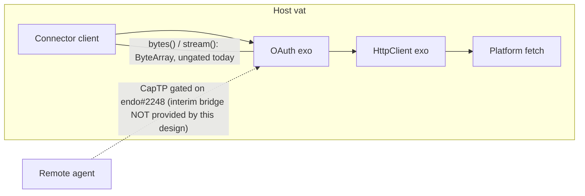

# EndoClaw: Binary Media on the Fetch Surface (`bytes()` and `stream()`)

| | |
|---|---|
| **Created** | 2026-07-10 |
| **Author** | Kris Kowal (prompted) |
| **Status** | Proposed |
| **Parent** | [endoclaw-network-fetch](endoclaw-network-fetch.md) |

## Summary

Adds binary media to the confined fetch surface in both directions: a
`bytes()` accessor and a `stream()` accessor on the response, and byte-array
request bodies (with a streaming-upload phase behind them). The surface is
expressed in terms of the **passable byte array** (pass style `byteArray`, an
immutable `ArrayBuffer`) from day one, so no bespoke transfer type ever enters
the API. **Same-vat** consumers (connectors the host composes in-process over
the `OAuth` exo, so a call reaches the `fetch` surface as an ordinary
same-heap invocation with no cross-agent message hop) are ungated today; only
the **CapTP hop** (a call that crosses an agent boundary over Endo's
object-capability transfer protocol, CapTP, and is therefore marshalled) is
gated, on upstream marshal support for `byteArray`
([endojs/endo#2248](https://github.com/endojs/endo/issues/2248)), with the
existing `@endo/exo-stream` base64 byte readers as the documented interim for
remote streaming. This same-vat composition model is the one the
[endoclaw-oauth](endoclaw-oauth.md) Connector Contract is *expected to*
specify: that document is `Status: Not Started` and its Connector Contract
section lives only in an open, unmerged revision
([endojs/endo-but-for-bots#621](https://github.com/endojs/endo-but-for-bots/pull/621),
open as of 2026-07-10). This design assumes the same-vat model as its premise
and does not depend on that revision having landed.

## What is the Problem Being Solved?

`FetchResponse` in [endoclaw-oauth](endoclaw-oauth.md) exposes `text()` and
`json()` only, and `FetchOptions.body` is `string` only; the realized
`HttpResponse` exo in `@endo/exo-http-client` (landed via PR #566, per
[endoclaw-network-fetch](endoclaw-network-fetch.md)) has the same shape. A
connector moving binary media has no path in either direction: Drive file
download and upload (`files.get?alt=media`, `uploadType=media`), Gmail raw
RFC 822 message import and export outside the JSON envelope. These Drive and
Gmail scenarios are **illustrative, not catalog-listed**: no `endoclaw-drive`
or `endoclaw-gmail` design exists in [designs/README.md](README.md), and the
only landed M7 connector ([exo-google-sheets](exo-google-sheets.md)) needs
none of this. This is infrastructure planned ahead of a concrete consumer, on
the strength of the general OAuth binary-media use cases, not a reaction to a
committed connector. The gap was noted and deferred in the endoclaw-oauth
Connector Contract revision (endojs/endo-but-for-bots#621, open as of
2026-07-10) with the directive to plan `bytes()` and `stream()` gated on
passable-byte-array progress. This design is that plan.

## The Passable-Byte-Array Dependency (the gate)

State on `llm` as of 2026-07-10, by layer:

| Layer | State | Evidence |
|---|---|---|
| Construction | **Available everywhere** | `ses` `lockdown.js` imports `@endo/immutable-arraybuffer/shim.js`, so every hardened environment has `ArrayBuffer.prototype.sliceToImmutable` and `transferToImmutable` (the TC39 Immutable ArrayBuffer proposal's methods); XS ships them natively |
| Pass style | **Available** | `@endo/pass-style` `ByteArrayHelper` recognizes an immutable `ArrayBuffer` as `passStyleOf(x) === 'byteArray'`; exports the `ByteArray` type |
| Patterns | **Available** | `@endo/patterns` `matchByteArrayHelper` provides `M.byteArray()` with a byte-length limit, usable in interface guards |
| Marshal | **Not available** | `encodeToSmallcaps.js` and `encodeToCapData.js` both throw `marsal of byteArray not yet implemented` on the `byteArray` case |
| CapTP / daemon | **Not available** (consequence of marshal) | Upstream tracking: [endojs/endo#2248](https://github.com/endojs/endo/issues/2248) |
| Interim wire idiom | **Available** | `@endo/exo-stream` bytes readers and writers (`bytesReaderFromIterator`, `iterateBytesReader`, and writer twins) haul base64 over CapTP and self-describe as temporary "until CapTP supports passable byte arrays" |

The gate rule that falls out:

- **Phases 1 and 2 below do not wait.** The connector composition is same-vat
  (the host closes the connector over the `OAuth` exo's `fetch` in-process;
  no CapTP hop per request; see the § Summary definition), so a `ByteArray`
  returned by `bytes()` or carried as a request body never reaches marshal.
  This holds as long as connectors compose same-vat; that model is the premise
  this design carries (the endoclaw-oauth Connector Contract that would pin it
  down is still in the open #621 revision). Everything the illustrative Drive
  or Gmail connectors would need is buildable today under that premise.
- **The remote surface rides endojs/endo#2248.** Until marshal lands, a
  `ByteArray` crossing CapTP (a remote caller of `E(response).bytes()`, or a
  `Reader<ByteArray>` iterated remotely) fails at the marshal layer with the
  explicit not-implemented error: a loud, structural failure, not corruption.
  Remote consumers keep `text()` and `json()`, or use the interim below.
- **The interim for remote streaming is the existing base64 idiom, not a new
  type.** Where a remote consumer must move binary before #2248 lands, the
  bridge is `@endo/exo-stream`'s bytes reader (the same `streamBase64` idiom
  the daemon already uses throughout, per
  [base64-native-fallthrough](base64-native-fallthrough.md)). It is applied at
  the CapTP boundary by the consumer, never baked into this surface.
- **Migration is a flip, not a rewrite.** Because the signatures are written
  in `ByteArray` from day one, marshal support landing makes the remote
  surface work with zero signature change, and the exo-stream base64 bridge
  retires exactly as that package already anticipates.

## Capability Shape

```ts
import type { ByteArray } from '@endo/pass-style'; // an immutable ArrayBuffer
import type { Reader } from '@endo/stream';        // hardened async iterator

type FetchOptions = {
  method?: string;
  headers?: Record<string, string>;
  body?: string | ByteArray;  // Phase 4 widens with Reader<ByteArray>
  stream?: boolean;           // request a streaming response; default false
};

type FetchResponse = {
  status: number;
  ok: boolean;
  headers: Record<string, string>;
  text(): Promise<string>;              // buffered mode only
  json(): Promise<unknown>;             // buffered mode only
  bytes(): Promise<ByteArray>;          // buffered mode only; whole capped body
  stream(): Promise<Reader<ByteArray>>; // both modes
};
```

The `HttpResponse` exo of `@endo/exo-http-client` gains the same two methods
(`bytes` guarded with `M.callWhen().returns(M.byteArray())`, `stream` returning
a remotable), keeping the design-level `FetchResponse` and the realized exo in
lockstep as they are today.

### Semantics

**Buffered mode (default).** `@endo/http-confine` already reads the platform
body reader chunk by chunk into one accumulation buffer, capped at
`maxResponseBytes` with a `truncated` flag; when accumulation reaches the cap
it stops reading and cancels the underlying platform reader, then sets
`truncated` (this cancel-on-truncate is the existing buffered behavior the
streaming path below mirrors). `bytes()` returns that
accumulation buffer's `transferToImmutable()` result: one zero-copy transfer,
performed once, after which `text()` and `json()` decode from a `Uint8Array`
view over the immutable buffer (views over immutable buffers are readable).
All body accessors coexist on one response; there is no one-shot "body used"
state, because the body is already fully buffered. `truncated()` is unchanged.

**Streaming mode (`stream: true`).** The confinement does not accumulate.
`stream()` resolves to a hardened `@endo/stream` `Reader` whose values are
`ByteArray` chunks (each platform chunk sliced to immutable as it arrives).
Byte-cap accounting is cumulative across chunks: the chunk that would exceed
`maxResponseBytes` is not delivered; the stream breaks with a structured error
(`code: 'max-response-bytes'`) and the underlying platform reader is
cancelled, mirroring the buffered path's cancel-on-truncate. Revocation
mid-stream breaks the reader the same way (`code: 'revoked'`). A plain
mid-stream transport failure (connection reset, timeout) is **not** a garden
policy break: the reader rejects with the platform's raw error and carries no
`code`, so a consumer distinguishes a policy-imposed break (has `code`) from a
network fault (no `code`) by the field's presence. In streaming mode `text()`,
`json()`, and `bytes()` throw a structured `'body-streaming'` error. In
buffered mode `stream()` still works, yielding the single buffered body as one
chunk, then signalling done, so a consumer can be written uniformly against
`stream()` regardless of mode. These `code:`-bearing structured errors are a
deliberate new convention for the streaming surface (Design Decision 9), not
the message-only style the existing synchronous `HttpClient` errors use.

**Upload.** A `ByteArray` body is forwarded to the platform fetch as a
`Uint8Array` view (fetch only reads it). String bodies are unchanged. Method
policy is untouched: uploads ride POST, PUT, and PATCH, which a `readOnly`
OAuth facet **will** deny once that facet ships. It is **not implemented
today** (endoclaw-oauth § only *describes* a read-only method check as part of
its own still-`Not Started` design; no read-only/write-scope gating exists
anywhere in the tree yet, only `exo-http-client`'s TOFU origin/method
allowlist, which is not a write-scope check). Phase 1's buffered upload path
therefore carries **no method-scope enforcement** until the `endoclaw-oauth`
read-only facet lands; a builder must not treat write-scope restriction as
already covered.

**OAuth layer passthrough.** [endoclaw-oauth](endoclaw-oauth.md)'s
`FetchOptions` and `FetchResponse` widen identically (to be folded into the
#621 revision or a follow-up edit of that document). The `OAuth` exo forwards
bodies opaquely; path normalization, method policy, and header hygiene are
unchanged. No new authority is introduced in either direction.

## How Connectors Consume It



The dashed remote arrow is drawn for orientation only; **this design does not
provide the remote-interim path**. A remote caller cannot invoke
`E(response).bytes()` or iterate a `Reader<ByteArray>` across CapTP today: the
yielded `ByteArray` values fail marshal exactly as a bare `ByteArray` would.
Where a remote consumer must move binary before endojs/endo#2248 lands, the
consumer itself applies the `@endo/exo-stream` base64 bridge at the CapTP
boundary (per § The Passable-Byte-Array Dependency); this surface never bakes
it in and this design assigns no owner to it. See Open Question 4.

- **Drive download**: `files.get?alt=media` via `bytes()` for small files,
  `stream: true` plus `stream()` for large ones (bounded memory under the
  byte cap).
- **Drive upload**: `uploadType=media` with `body: ByteArray`; resumable
  uploads are per-request whole-body chunks, so they need no streaming upload.
- **Gmail raw messages**: `messages.import` / `messages.send` with
  `uploadType=media` carry raw RFC 822 bytes up; raw export comes down via
  `bytes()`.
- The Sheets connector ([exo-google-sheets](exo-google-sheets.md)) needs none
  of this; it is unaffected.

## Dependencies

| Design / package | Relationship |
|---|---|
| [endoclaw-network-fetch](endoclaw-network-fetch.md) | Parent; `@endo/http-confine` and `@endo/exo-http-client` are the implementation site |
| [endoclaw-oauth](endoclaw-oauth.md) (`Status: Not Started`; Connector Contract in the open revision endojs/endo-but-for-bots#621) | Consumer layer; its `FetchOptions` / `FetchResponse` widen in lockstep. The same-vat composition that makes phases 1 and 2 ungated is the premise this design carries; the Connector Contract that would pin it down is **not yet landed** (it lives only in unmerged #621) |
| `@endo/pass-style`, `@endo/patterns` | `ByteArray` pass style and `M.byteArray()` guard, both present on `llm` |
| `@endo/stream`, `@endo/exo-stream` | Stream idiom for `stream()`; exo-stream's base64 bytes readers are the interim CapTP bridge |
| [endojs/endo#2248](https://github.com/endojs/endo/issues/2248) (upstream) | The gate on the remote surface: marshal / CapTP `byteArray` encoding |
| [base64-native-fallthrough](base64-native-fallthrough.md) | Keeps the interim base64 hop cheap (native `Uint8Array` base64 intrinsics) |

## Phased Implementation

1. **`bytes()` and `ByteArray` request bodies, buffered mode.**
   `@endo/http-confine`: accept `ByteArray` bodies; hand the accumulation
   buffer over as immutable. `@endo/exo-http-client`: add `bytes()` to
   `HttpResponse` with an `M.byteArray()` guard. Small; the bytes are already
   in hand.
2. **OAuth surface widening.** Fold the widened `FetchOptions` /
   `FetchResponse` into [endoclaw-oauth](endoclaw-oauth.md) (coordinating with
   #621, which is open as of 2026-07-10). Additive; breaks nothing.
3. **Streaming download.** `stream: true` mode in `@endo/http-confine`
   (incremental delivery, cumulative cap, cancel-on-break), `stream()` on
   `HttpResponse`. Document the exo-stream base64 bridge as the remote interim.
4. **Streaming upload.** Widen `body` with `Reader<ByteArray>`. Gated on
   platform half-duplex request streaming (undici `duplex: 'half'`); deferred
   until a connector needs it, since Drive resumable upload covers the known
   large-upload cases with whole-body chunks.
5. **Remote flip.** When endojs/endo#2248 lands and the `llm` branch picks it
   up, the remote surface works unchanged, and the base64 bridge retires per
   exo-stream's own stated expectation. No local code change beyond deleting
   interim documentation.

## Design Decisions

1. **Express the surface in `ByteArray` now rather than waiting for #2248.**
   Pass style, patterns, and construction are all present; only the wire hop
   is missing, and the contract consumers are same-vat. Waiting would idle the
   Drive and Gmail connectors on a dependency they do not have.
2. **Considered and rejected: a base64 string accessor on the response.**
   Reason: a bespoke marshal-visible text encoding with 33% inflation;
   exo-stream already treats base64 hauling as a temporary bridge, so baking
   it into the durable surface would move backwards. The base64 bridge stays
   at the CapTP boundary only, and only until #2248.
3. **Considered and rejected: `bytes()` returning `Uint8Array` (the WHATWG
   `Response.prototype.bytes()` shape).** Reason: a `Uint8Array` is not
   passable and is mutably aliasable. `FetchResponse` is already a named
   subset that deliberately does not masquerade as the WHATWG `Response`
   (per the #621 revision); returning `ByteArray` extends the same argument.
4. **Considered and rejected: WHATWG `ReadableStream` for `stream()`.**
   Reason: not hardened, not passable, no eventual-send affinity;
   `@endo/stream`'s hardened async iterator is the house idiom and carries
   back-pressure.
5. **Streaming is chosen at fetch time (`stream: true`), not inferred from
   the first accessor called.** Reason: the confinement either accumulates or
   it does not; a lazy dual mode would leave the platform reader unread across
   an unbounded await gap and complicate cap and revocation accounting. The
   uniform-consumer story is preserved by letting `stream()` work in buffered
   mode.
6. **No one-shot body in buffered mode.** The body is capped and buffered
   once; `text()`, `json()`, and `bytes()` all derive from the same immutable
   buffer, so the WHATWG "body already used" statefulness would add a failure
   mode with no benefit.
7. **Cap overrun breaks the stream with an error instead of truncating.**
   A streaming consumer cannot observe an after-the-fact `truncated()` flag;
   silent truncation of media is corruption. Buffered mode keeps the existing
   truncate-and-flag behavior for compatibility.
8. **The buffered/streaming split is a mode discriminant, accepted as an
   explicit asymmetry to Decision 6.** Decision 6 rejects mode-dependent method
   validity for the buffered accessor family because all three derive from one
   immutable buffer, so no runtime "already used" state is needed. The
   buffered-vs-streaming split cannot be dissolved the same way: the two modes
   are physically different confinement behaviors (accumulate vs. do not), so
   `text()`/`json()`/`bytes()` genuinely cannot service a streaming response,
   and the validity of calling them is `stream`-flag-dependent. Rather than
   pretend one flat `FetchResponse` shape serves both, the implementation is
   expected to make the mode legible to the type system: a discriminated
   response type (or a `mode` discriminant field) so a consumer keys on the
   mode statically instead of learning it from a runtime `'body-streaming'`
   throw. The design fixes the *behavior* (streaming accessors throw
   `'body-streaming'`); which type-level form expresses it (two TS types, a
   discriminated union, or a runtime getter) is the implementation PR's choice
   for the code panel, not a design-completeness gap. The cap/revocation
   accounting is unaffected either way; it lives in the confinement layer, not
   the response object.
9. **Structured `code:`-bearing errors are a deliberate new convention for the
   streaming break points (`max-response-bytes`, `revoked`, `body-streaming`),
   scoped to the streaming surface.** The existing synchronous `HttpClient`
   errors (including the same revocation condition) are plain `makeError`
   messages with no `code`. A streaming consumer must branch on the break
   *reason* programmatically mid-iteration (a plain message cannot be matched
   robustly), so the streaming surface adopts `code:` tags where a synchronous
   caller reading a thrown message does not need them. This is an intentional
   asymmetry, not an oversight; if the surrounding surface later standardizes
   on structured codes, the synchronous errors adopt them too, but that
   widening is out of scope here. A plain transport fault stays code-less (see
   § Semantics) precisely so a `code` always means "garden policy break."

## Open Questions

1. Should the `stream()` chunks be re-chunked to a normalized size, or passed
   through at whatever granularity the platform reader delivers? Passthrough
   is simplest and leaks nothing an origin does not already control; a
   normalized chunk size would make byte-cap accounting and tests more
   deterministic.
2. Phase 4's gate: is undici `duplex: 'half'` request streaming acceptable on
   the daemon's supported Node.js window, or should streaming upload wait for
   a concrete connector need (the current assumption)?
3. When #2248 lands upstream, does the `llm` branch adopt it via the routine
   `actual/master` merge, or does it warrant a targeted sync so the remote
   flip (Phase 5) is not held behind unrelated upstream drift?
4. The remote-interim path (a remote agent moving binary over the exo-stream
   base64 bridge before #2248 lands, shown dashed in § How Connectors Consume
   It) is **owned by no design**: this surface disclaims baking it in, and no
   `endoclaw-*` document assigns the bridging method on the OAuth/HttpResponse
   remote surface. Should the interim remote path get a design owner (e.g. a
   note in the #621 revision, or a dedicated bridge design), or does it stay a
   per-consumer concern applied ad hoc at the CapTP boundary until Phase 5
   retires the need entirely?

## Prompt

> Plan the addition of a `bytes()` accessor on `FetchResponse` and a
> bytes/stream upload body on `FetchOptions`, so OAuth domain connectors can
> move binary media in both directions (Drive file download, Gmail raw
> attachments outside JSON). Today `FetchResponse` exposes `text()` and
> `json()` only and `FetchOptions.body` is `string` only. The gap was noted
> and deferred in `designs/endoclaw-oauth.md` (Capability Shape section) and
> owned by `designs/endoclaw-network-fetch.md`.
>
> Gate the design on progress on **passable byte arrays** in Endo: the
> response/stream shapes should be expressed in terms of passable byte arrays
> once those land, rather than inventing a bespoke transfer type. Call out the
> dependency explicitly and, if passable byte arrays are not yet available,
> propose the interim shape and the migration path.
>
> Origin: maintainer review directive on endojs/endo-but-for-bots#621 (inline
> comment 3560153009): "Post a job to plan the addition of `stream()` and
> `bytes()` and gate on progress on passable byte arrays."
