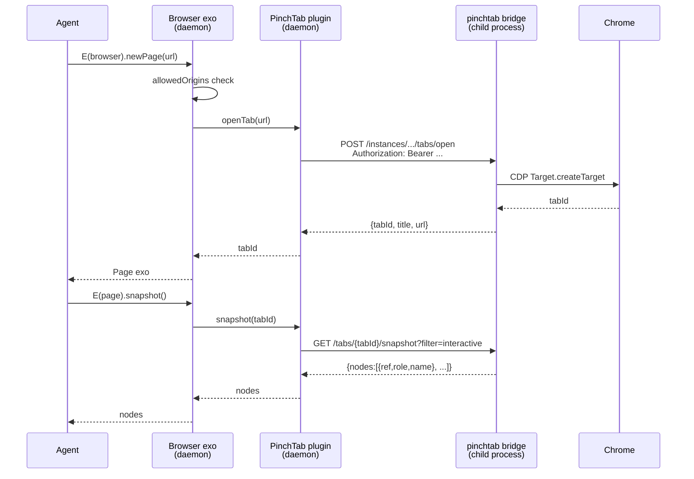

# EndoClaw: PinchTab Browser Backend

| | |
|---|---|
| **Created** | 2026-05-22 |
| **Author** | endolinbot (prompted) |
| **Status** | Speculative |
| **Parent** | [endoclaw](endoclaw.md) |
| **Sibling** | [endoclaw-browser-interfaces](endoclaw-browser-interfaces.md) |
| **Related** | [endoclaw-browser](endoclaw-browser.md), [endoclaw-network-fetch](endoclaw-network-fetch.md), [endoclaw-oauth](endoclaw-oauth.md), [lal-fae-form-provisioning](lal-fae-form-provisioning.md) |

## Summary

A Daemon-side plugin that exposes a [PinchTab](https://pinchtab.com/)
instance as a `Browser` capability to an Endo agent.
PinchTab is a 12&nbsp;MB Go binary that runs Chrome and serves a plain HTTP
API designed for low token cost (accessibility tree with stable refs
`e0, e1, ...` instead of full DOM snapshots).
The plugin renders that HTTP API as the same `Browser` Exo shape that
the Playwright-backed proposal in
[endoclaw-browser](endoclaw-browser.md) renders, so an agent that holds
a `Browser` capability is indifferent to which backend produced it.

The unified Exo shape itself, and the recommendation to revise
`endoclaw-browser.md` to match it, are the subject of the sibling
design [endoclaw-browser-interfaces](endoclaw-browser-interfaces.md).
This document covers what is specific to PinchTab: the wire protocol,
the host-side process lifecycle, the auth and trust posture, the
phased implementation, and the open questions about PinchTab itself.

## What Is PinchTab?

PinchTab is a single-binary HTTP bridge that an agent can drive instead
of speaking the Chrome DevTools Protocol (CDP) directly.
Source: <https://github.com/pinchtab/pinchtab> (MIT License).

**Evidence-pointer caveat.**
The wire shape, version pins, and CVE references below describe a
prospective upstream whose existence and exact shape this design has
not independently verified against a checked-out release.
The metadata table accordingly carries `Status: Speculative`, and the
phased implementation in this document stops at design-only review
until the implementing builder confirms the upstream's release
artifact (a git tag and the corresponding commit SHA) and re-captures
the wire shape against it.
If the upstream proves fictitious or its wire was misread, this
document remains useful as the unified-shape sibling's first concrete
PinchTab-flavored consumer, and the phasing in
[endoclaw-browser](endoclaw-browser.md) carries the unified shape into
implementation via Playwright.

Wire shape (from <https://pinchtab.com/docs> and the project README,
captured 2026-05-22 against PinchTab release `v0.8.4` at commit SHA
`pinchtab/pinchtab@<tbd-on-implementation>`; the implementing builder
re-captures against the then-current tag and replaces the placeholder
with the exact SHA before phase 1 begins):

- Two processes: `pinchtab server` (control plane, default port 9867)
  and one `pinchtab bridge` per browser instance (default port 9868+).
- Hierarchical addressing: `{instanceId}` (one Chrome process)
  &rarr; `{tabId}` (one CDP target inside it).
- All endpoints are HTTP with JSON bodies; mutations are POST, reads
  are GET.
  Representative endpoints:
  - `POST /profiles` &rarr; `{"id":"prof_..."}`.
  - `POST /instances/start` with `{"profileId":"...","mode":"headless"}`
    &rarr; `{"id":"inst_...","port":"9868","status":"starting", ...}`.
  - `POST /instances/{instanceId}/tabs/open` with `{"url":"..."}`
    &rarr; `{"tabId":"CDP_TARGET_ID","title":"...","url":"..."}`.
  - `POST /tabs/{tabId}/action` with
    `{"kind":"click|type|fill|press|focus|hover|select|scroll","ref":"e5", ...}`
    &rarr; `{"success":true,"result":{...}}`.
  - `GET /tabs/{tabId}/snapshot?filter=interactive` &rarr;
    `{"nodes":[{"ref":"e0","role":"link","name":"Docs"}, ...]}`.
  - `GET /tabs/{tabId}/text` &rarr; readability or raw text.
  - `GET /tabs/{tabId}/screenshot` &rarr; PNG bytes.
  - `GET /tabs/{tabId}/pdf` &rarr; PDF bytes.
  - `POST /tabs/{tabId}/eval` with `{"script":"..."}` &rarr; JS result
    (optional; may be disabled by the operator).
- Authentication: `Authorization: Bearer <token>`; the token is the
  `PINCHTAB_TOKEN` environment variable seeded at server start.
  Historical CVE: versions `v0.7.8`&ndash;`v0.8.3` also accepted the
  token from a URL query parameter; `v0.8.4` removed query-string auth.
  The plugin pins `v0.8.4+`.
- Default bind: `127.0.0.1` only; non-local exposure is the operator's
  problem.

Positioning: PinchTab claims roughly 10&times; token reduction relative
to a full-DOM snapshot, by exposing the accessibility tree with stable
refs the agent calls back into.
This is exactly the read shape an LLM-driven agent benefits from.

## Daemon-vs-Familiar Placement

The plugin lives **in the daemon** (host side of the Endo capability
boundary), not in the Familiar (Electron) shell.
Rationale:

1. **Subprocess lifecycle is a daemon concern.**
   The plugin owns one `pinchtab server` child process and one Chrome
   profile directory per `Browser` capability granted.
   The daemon already supervises worker subprocesses; it has the
   nearest analogue to the lifecycle PinchTab needs.

2. **Self-hosted agents need browser access.**
   The Familiar is a desktop shell; agents accessed via
   [daemon-docker-selfhost](daemon-docker-selfhost.md) and the
   [gateway-bearer-token-auth](gateway-bearer-token-auth.md) bearer
   token reach a headless daemon with no Electron.
   Putting the plugin in the daemon makes it available to both
   delivery modes.

3. **The Familiar already gets browser screenshots for free.**
   When the Familiar surfaces a Chat message containing a screenshot
   the agent took, it is consuming the daemon-side capability's
   output, not running the browser itself.

The Familiar may grow a UX layer later (a panel showing live tabs, a
prompt-and-pin dialog for new origins) but the capability shape and the
process supervision live in the daemon.

## Auth and Trust Posture

There are two trust boundaries.
The first is between the agent and the daemon: standard Endo ocap, the
agent holds an opaque `Browser` exo and cannot reach beyond its
attenuation.
The second is between the daemon and the PinchTab server: a `127.0.0.1`
HTTP socket with a bearer token.
The second boundary is **trust-on-first-bind** territory, the same
shape [`trust-on-first-bind`](trust-on-first-bind.md) gives the
`HttpClient`.

Token handling:

- The daemon generates a fresh `PINCHTAB_TOKEN` (256 random bits, hex
  encoded) per spawned `pinchtab server` instance.
- The token is passed into the server's environment at launch and
  retained in the formula store, never surfaced to the agent.
- The `Browser` exo prepends `Authorization: Bearer <token>` to every
  outbound request internally; the agent has no method that returns
  the token or that lets the agent construct a raw HTTP request to the
  bridge port.
- The PinchTab bridge port is bound to `127.0.0.1` only.
  The daemon writes a `firewall:` retention path note when granting a
  `Browser` capability so the operator can audit which agents have
  live browser sessions.

Origin allowlist (the only host-side knob the agent's capability
guard checks):

- The host supplies an explicit allowlist on `BrowserControl`
  (`['https://airline.example.com']`); navigate calls outside the
  allowlist throw before the PinchTab request is issued.
- This is enforced inside the Exo, not inside PinchTab, because
  PinchTab itself has no origin restriction (the agent has full
  control of a real logged-in browser).
- Wildcards (`'https://*.example.com'`) are allowed; arbitrary regex
  is not.

Profile / persistence trust:

- The Chrome profile directory belongs to the `Browser` capability's
  formula identity.
  Cookies, auth state, and tab state survive daemon restarts but are
  scoped to that capability; revoking the capability disincarnates
  the profile.
- Two `Browser` capabilities granted to two different guests are two
  separate PinchTab profiles and therefore two separate logged-in
  identities; PinchTab's profile model maps cleanly onto Endo's
  formula-isolated guest model.
- The daemon treats the profile directory as **sensitive**
  (per PinchTab's own warning: "treat profile directories as
  sensitive"); it lives under `$ENDO_STATE/state/browser-profiles/<id>`
  with mode 0700 and is excluded from any "show me the state dir"
  CLI verb output.

Revocation:

- `BrowserControl.revoke()` closes the bridge's connection to the
  PinchTab server, terminates the bridge process, and removes the
  exo from the capability graph.
  The profile directory may be retained (configurable, default
  retained) so the agent can be re-granted later.

## How It Works

1. Host calls `makeBrowser({ backend: 'pinchtab', allowedOrigins,
   profileName? })` and receives a `(browser, browserControl)` exo
   pair.
2. The daemon's PinchTab plugin spawns a `pinchtab server` **per
   `Browser` capability** (one server, one `pinchtab bridge`, one
   token, one Chrome profile per capability granted).
   The plugin generates the per-capability token and stashes it in
   the formula store.
   The per-capability server is the structural guarantee that the
   token in § Auth and Trust Posture isolates capabilities from each
   other: a token leaked from one capability cannot reach another
   capability's bridge port, because each bridge is bound to a
   distinct local port and reachable only through that capability's
   exo.
   The cost is one Chrome process per concurrent `Browser`
   capability; the operator caps the count via
   `BrowserControl.setMaxConcurrentPages` on the host side and via
   `endoclaw`-parent grant policy.
3. Host grants the `browser` facet to an agent via pet name.
4. Agent calls `E(browser).newPage('https://airline.example.com/checkin')`
   (the unified `Browser` shape; see the sibling design).
5. The exo:
   - validates the URL against `allowedOrigins`;
   - issues `POST /instances/{instanceId}/tabs/open` with the URL;
   - returns a `Page` exo wrapping the returned `tabId`.
6. Agent reads via `E(page).snapshot({ filter: 'interactive' })`;
   the exo issues `GET /tabs/{tabId}/snapshot?filter=interactive`
   and returns the structured node list.
7. Agent acts via `E(page).click({ ref: 'e5' })`; the exo issues
   `POST /tabs/{tabId}/action` with `{kind:'click',ref:'e5'}`.

## Endo Idiom

**The token is the daemon's secret, not the agent's.**
The agent has no path through the `Browser` or `Page` exos that
exposes `PINCHTAB_TOKEN` or that admits an attacker-supplied
`Authorization` header.

**Structural origin confinement above PinchTab.**
PinchTab itself has no origin restriction.
The exo's `allowedOrigins` check, identical to the one in
[endoclaw-network-fetch](endoclaw-network-fetch.md), is the structural
gate.
PinchTab is the wire; the exo is the policy.

**Caretaker revocation closes the bridge.**
A revoked capability terminates the per-capability `pinchtab bridge`
subprocess.
The Chrome profile dir survives by default and can be reincarnated;
that survival is itself a host policy knob on `BrowserControl`.

**One profile, one logged-in identity.**
PinchTab profiles map onto Endo guest profiles.
The host who grants a `Browser` capability is granting a logged-in
browsing identity; subsequent grants to other guests use other
profiles by default.

## Phased Implementation

| Phase | Scope | Size |
|---|---|---|
| 1. PinchTab supervisor | Daemon-side child-process manager for `pinchtab server`; token generation; health check. Profile dir layout. No Exo yet. | S (~1 day) |
| 2. `Browser` Exo (PinchTab backend) | The unified `Browser` shape from the sibling interface design, with PinchTab as the only backend. Origin allowlist enforcement. Per-capability bridge instance. Revocation tears down the bridge. | M (~3 days) |
| 3. `Page` Exo | `goto`, `snapshot`, `text`, `screenshot`, `click`, `type`, `fill`. Read-only mode disables mutations. | M (~3 days) |
| 4. Lal/Fae tool integration | Register `browser.newPage`, `browser.snapshot`, `browser.click` as Lal tools. Snapshot-driven loop is the agent's primary read mode. | S (~1 day) |
| 5. Auth via [lal-fae-form-provisioning](lal-fae-form-provisioning.md) | Form-grant flow for the agent to *request* a Browser capability with a proposed origin allowlist; host approves. | S (~1 day) |
| 6. (Optional) Eval | Instantiate the `EvalCapableBrowser` extension interface declared in the sibling design's § `EvalCapableBrowser extends Browser`, wiring its `eval(page, script)` to `POST /tabs/{tabId}/eval`. `EvalCapableBrowser` is a separate capability the host hands out only when the operator opts in; the base `Browser` carries no `eval` method, flag-gated or otherwise. The `BrowserControl.setEvalAllowed(true)` toggle on the sibling design's `BrowserControl` is the operator's opt-in; flipping it on causes the daemon to surface the `EvalCapableBrowser` facet beside the existing `Browser` facet. Default: not granted. | S (~1 day) |

Phase 6 is intentionally last and intentionally off by default.
Even with stealth mode and a real logged-in profile, JS `eval` can
reach `fetch()` to any origin and so escapes the structural gate.
Modeling `eval` as a separate `EvalCapableBrowser` extension
(rather than a flag-gated method on `Browser`) is how the agent
**cannot** call `eval` without being explicitly granted the eval
capability; the structural separation is the audit trail.

**Total estimate: M-L (about 1.5 weeks of focused work).**

## Open Questions

1. **Multi-tab grants.**
   Does a `Browser` capability hand out one `Page` at a time, or
   multiple concurrent pages?
   PinchTab supports many tabs per instance.
   The sibling interfaces design proposes `newPage()` returning a
   fresh `Page`; the open question is whether `BrowserControl`
   should be able to cap the concurrent-page count.

2. **Profile sharing.**
   Should two `Browser` capabilities ever share a PinchTab profile
   (one guest sees another's logged-in sessions)?
   Current assumption: no, one capability one profile.
   Pinning this changes whether the formula store stores
   `profileId` or `(profileId, capabilityId)`.

3. **Stealth mode posture.**
   PinchTab ships stealth-by-default (`navigator.webdriver`
   patched, UA spoofed).
   The host-side default should be on for "use my logged-in Gmail"
   workflows and off for "evade-Anubis web scraping" workflows.
   Open question: is the stealth toggle a `BrowserControl` knob, or
   a per-`makeBrowser` invariant?

4. **Wire-protocol stability.**
   PinchTab's README does not commit to a wire-protocol version.
   The plugin's source must pin a PinchTab version and a small
   adapter layer such that a major-bump in PinchTab is a one-file
   change.
   Pin: `pinchtab@>=0.8.4 <0.10.0` (above the CVE, below an as-yet
   unreleased major).

5. **Out-of-band browser control.**
   PinchTab supports "attach to running Chrome" mode for debugging.
   The plugin will *not* expose this to the agent; it is a
   host-side debug knob only.
   Open question: should the host-side debug knob exist as a
   formula at all, or be CLI-only?

6. **Token rotation.**
   PinchTab does not document a token-rotation endpoint.
   Current plan: rotation = restart the bridge.
   If PinchTab grows rotation, the plugin should adopt it; until
   then, no rotation.

7. **License compatibility.**
   PinchTab is MIT; Endo packages are typically Apache-2.0 or
   MIT.
   The plugin **downloads PinchTab as a release binary** (similar
   to how [familiar-daemon-bundling](familiar-daemon-bundling.md)
   downloads Node), it does **not** vendor or rebuild the Go
   source.
   This keeps the license boundary clean.

8. **CVE response posture.**
   PinchTab has had one disclosed CVE
   ([CVE-2026-33620](https://advisories.gitlab.com/pkg/golang/github.com/pinchtab/pinchtab/CVE-2026-33620/),
   query-string token leakage, fixed in v0.8.4).
   The plugin should subscribe to its own advisory feed; this is
   a steward concern, captured here as a forward note rather than
   a design constraint.

## Dependencies

| Design | Relationship |
|---|---|
| [endoclaw](endoclaw.md) | Parent; defines the capability-grant vocabulary. |
| [endoclaw-browser](endoclaw-browser.md) | Sibling backend (Playwright); shares the unified `Browser` Exo shape. |
| [endoclaw-browser-interfaces](endoclaw-browser-interfaces.md) | The sibling design that *defines* the unified shape both backends speak. |
| [endoclaw-network-fetch](endoclaw-network-fetch.md) | Same origin-allowlist idiom. |
| [endoclaw-oauth](endoclaw-oauth.md) | A Browser capability is sometimes the host of an OAuth flow; the OAuth capability layers on top. |
| [lal-fae-form-provisioning](lal-fae-form-provisioning.md) | Host grants a Browser capability via the same form-based flow that grants API keys. |
| [trust-on-first-bind](trust-on-first-bind.md) | Precedent for the host-prompt-on-new-origin pattern, if added later. |
| [daemon-capability-bank](daemon-capability-bank.md) | The Browser capability is one row in the bank's network/process category. |

## Prompt

> Author one design (or up to two siblings, designer's call per the
> 1-3-screens rule) covering: (a) a Daemon/Familiar plugin for
> pinchtab.com &mdash; including its capability shape,
> daemon-vs-familiar placement, auth model, trust posture, phased
> implementation &mdash; and (b) a coherent-Exo-interfaces analysis
> that unifies the new pinchtab plugin's shape with the existing
> Playwright proposal in `endoclaw-browser.md`, naming a base
> `Browser` Exo interface both backends implement plus per-backend
> extensions for the unreconcilable features. Recommend whether
> `endoclaw-browser.md` should be revised to match the unified base
> (decision with rationale).
