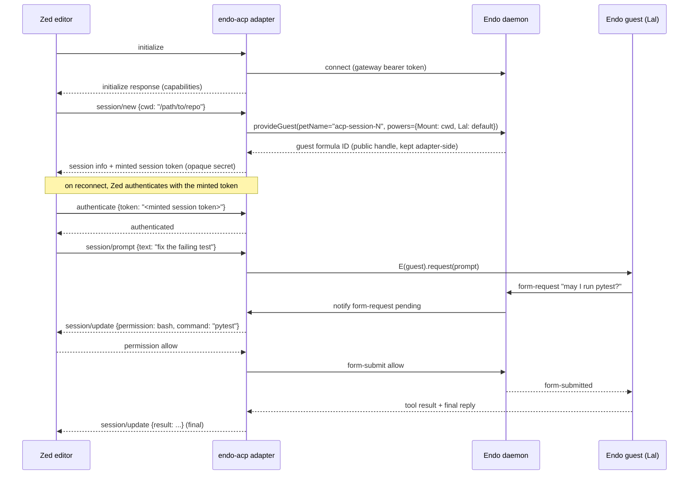

# EndOpen: ACP Server Adapter

|             |                                              |
|-------------|----------------------------------------------|
| **Created** | 2026-05-15                                   |
| **Updated** | 2026-05-20                                   |
| **Author**  | kriscendobot (prompted by kriskowal)         |
| **Status**  | Not Started                                  |
| **Source**  | [`endopen.md`](endopen.md) § Gap 4           |

## What is the Problem Being Solved?

The [Agent Client Protocol](https://agentclientprotocol.com/) is a
JSON-RPC over stdio protocol for editor / IDE clients to drive coding
agents.
Zed integrates with OpenCode via ACP;
the Zed configuration is a four-line `agent_servers` block in
`~/.config/zed/settings.json`
(per [`packages/opencode/src/acp/README.md`](https://github.com/anomalyco/opencode/blob/d59d9966/packages/opencode/src/acp/README.md)).

Endo has no ACP surface, so Endo guests are not addressable from
Zed or any other ACP-aware client.
Closing this gap is operationally significant:
it makes Endo a *drop-in* alternative to OpenCode for ACP clients,
without the client needing to learn OCapN or CapTP.

The capability story has to be preserved.
OpenCode's ACP server auto-approves all permission requests
([`acp/README.md`](https://github.com/anomalyco/opencode/blob/d59d9966/packages/opencode/src/acp/README.md)
*Current Limitations*, point 4);
Endo's ACP server must route permission requests through the existing
form-request machinery
([daemon-form-request](daemon-form-request.md)) so the user-in-the-loop
guarantee survives the protocol bridge.

## Design

### The adapter shape

ACP is a JSON-RPC protocol with the following methods (per
OpenCode's
[`acp/agent.ts`](https://github.com/anomalyco/opencode/blob/d59d9966/packages/opencode/src/acp/agent.ts)
imports lines 1 through 32).
The object of every session-scoped method is the session;
where a method also acts on something inside the session, that
something is named after the colon.

- `initialize`: protocol version negotiation, capability advertisement.
- `authenticate`: authentication flow (ACP supports OAuth / API key / none).
- `session/new`: create a new session with a working directory and MCP servers.
- `session/load`: resume an existing session.
- `session/prompt`: send a prompt into a session; stream back updates.
- `session/cancel`: interrupt a session's in-flight prompt.
- `session/close`: tear down a session.
- `session/list`: enumerate active sessions.
- `session/fork`: branch a session into a child session.
- `session/resume`: re-attach to a paused session.

The adapter is a standalone node process at `packages/endo-acp/`
(or `packages/cli/src/acp.js` as a verb) that:

1. Speaks JSON-RPC on stdio
   (using `@agentclientprotocol/sdk` for the protocol parser).
2. Holds a single Endo client connection to the user's daemon
   (via the standard `@endo/client` library or the gateway's
   bearer-token-auth endpoint).
3. Maps each ACP session onto one Endo *guest*.
   ACP `session/new` calls `provideGuest`;
   ACP `session/load` looks up by formula ID stored in a per-process
   session map.
4. Maps `session/prompt` onto `E(guest).request(prompt)` plus a
   subscription on the guest's inbox;
   streams `session/update` notifications for each tool call and result.
5. Translates ACP permission requests into Endo form-request submissions;
   the daemon's existing UI surfaces (Familiar / Chat) render the prompt,
   the user answers, and the answer flows back as the ACP permission
   response.

### Wire diagram



### Capability preservation

The adapter holds **the user's authority**, not the ACP client's.
The bearer token in the adapter's connection identifies the user;
each new ACP session is a new guest with capabilities the *user*
granted (typically: `Mount` to the working directory, `Lal` to the
default LLM provider, `Shell` if the agent-mode rules permit). The
ACP client cannot escalate beyond this; the structural confinement
the daemon provides is preserved across the protocol bridge.

This is in deliberate contrast to OpenCode's ACP server, which
auto-approves. Endo's strength is the capability story, and the
ACP adapter must not undermine it.

### Authentication and multiplexing

The formula identifier is **not** a credential. A formula ID is a
durable, freely displayable *addressing handle*: the daemon surfaces it
in Chat, it is enumerable via `session/list`, and it appears in logs and
shared transcripts (see [daemon-256-bit-identifiers](daemon-256-bit-identifiers.md),
whose design goal is that "Chat displays identifiers correctly"). A
credential, by contrast, must be an independently mintable, independently
revocable *secret*. Making a resource's own public name double as the
credential that authenticates as it means anyone who observes the name
(a log line, a `session/list` response, a shared transcript, another ACP
client's lookup) can authenticate as that guest, the exact
"ambient-authority" failure mode this design contrasts Endo *against*.

So the adapter **mints a distinct per-session bearer token** at
`session/new`: an opaque random secret, bound server-side (in the
adapter's session map) to the guest's formula ID, and independently
revocable without renaming the guest. The ACP `authenticate` step
presents that minted token, never the formula ID. The formula ID stays
the public addressing handle for `session/list` / `session/load`; the
minted token stays the secret. The two are decoupled, so displaying or
sharing a formula ID never leaks the authority to act as its guest.

Two bearer surfaces are in play and must not be conflated:

- **adapter -> daemon**: the adapter authenticates to the daemon once,
  as the user, via the existing
  [gateway-bearer-token-auth](gateway-bearer-token-auth.md) token
  (shown in the wire diagram). This carries the user's authority.
- **ACP client -> adapter**: each ACP client authenticates per session
  via the adapter-minted session token above. This selects *which*
  guest the client drives, within the authority the adapter already
  holds.

One adapter process serves multiple ACP clients by multiplexing on the
minted session tokens: each connection presents its session token on
`authenticate`, and the per-process session map resolves it to the
backing guest's formula ID. The daemon does not learn about ACP clients
or their tokens; it sees ordinary `E(guest).request(prompt)` traffic
from the adapter, demultiplexed per-guest on the way in.

Because `authenticate` presents a token minted at `session/new`, an ACP
client with no prior session calls `session/new` first (the adapter
issues the token in its response) and then `authenticate` on subsequent
reconnects; a client resuming a known session presents the stored token
directly. The adapter never requires the client to have witnessed a
formula ID.

### ACP cwd as a virtual mount on the guest agent

The ACP client's `cwd` is exposed to the session as a *virtual mount*
on the guest agent rather than as a freshly delegated host-filesystem
`Mount` capability per session.
The guest agent itself owns a parent `Mount` (granted at guest
creation, typically scoped to the user's projects root);
each ACP `session/new` narrows that parent into a child mount rooted
at the ACP-supplied `cwd`.
The narrowing happens in the guest agent's address space, so the host
filesystem capability never leaks to the ACP client and the daemon
does not have to mint a new `Mount` per session.

**When the `cwd` falls outside the parent `Mount`.** The narrowing
assumes the ACP-supplied `cwd` lies *within* the guest agent's parent
`Mount` (typically the user's projects root). When a client opens a
repository the parent mount does not cover, narrowing is impossible, and
this is exactly the boundary where the "host filesystem capability never
leaks" guarantee is tested. The adapter does **not** widen the mount or
fall back to host-filesystem access. Instead `session/new` routes the
out-of-scope `cwd` through the existing form-request machinery
([daemon-form-request](daemon-form-request.md)): the user is prompted to
grant (or decline) a fresh parent-scoped mount covering that path. On
decline, `session/new` fails with an ACP error rather than silently
opening a session with no filesystem access or, worse, ambient access.
The grant, when given, extends the guest agent's parent-mount set
explicitly and auditably; it is never implicit in the ACP request.

### Session lifecycle

| ACP method        | Endo translation                                                           |
|-------------------|----------------------------------------------------------------------------|
| `session/new`     | `provideGuest(pet-name, powers)`; the ACP `cwd` becomes a virtual mount narrowed from the guest agent's parent `Mount` |
| `session/load`    | Resolve the presented session token to its guest's formula ID (adapter-local SQLite); re-attach |
| `session/prompt`  | `E(guest).request(prompt)`; subscribe to guest inbox; stream as session/update |
| `session/cancel`  | `E(guest).cancel()`; every guest agent module implements `cancel()` (Design Decision 9), so no silent degradation |
| `session/close`   | Adapter forgets the session; the guest persists in the daemon (durable)    |
| `session/list`    | Enumerate the adapter's per-process session map (by session token, not raw formula ID) |
| `session/fork`    | `E(guest).fork()`, required on the guest agent interface (Design Decision 9); forks the transcript into a child guest |
| `session/resume`  | Re-attach to the token's guest; replay any unread inbox messages           |

The key insight: ACP "sessions" are ephemeral references to durable
Endo guests. Closing an ACP session does **not** delete the guest;
the next `session/list` on the next adapter run shows it under
its pet name, and `session/resume` re-attaches. This is the right
default for a capability-graph store; OpenCode's session model
(rows that disappear when archived) is the wrong default here.

### Configuration

The adapter accepts a config file at `~/.config/endo-acp/config.json`:

```json
{
  "daemon": {
    "url": "ws://127.0.0.1:8920",
    "bearerToken": "..."
  },
  "session": {
    "agentModule": "lal",
    "defaultModel": "anthropic/claude-3.5-sonnet",
    "permission": {
      "auto": false,
      "bash": "ask"
    }
  }
}
```

The `permission.auto` flag explicitly defaults to `false` (in
contrast to OpenCode). Setting it to `true` makes the adapter
auto-approve, matching OpenCode's behavior; the user opts into the
weaker security posture knowingly.

### Zed integration

```json
{
  "agent_servers": {
    "Endo": {
      "command": "endo",
      "args": ["acp"]
    }
  }
}
```

`endo acp` is a new CLI subcommand at
[`packages/cli/src/`](../packages/cli/src/) that launches the
adapter as a subprocess.

### MCP server adapter (orthogonal)

The same shape supports an **MCP server adapter** that exposes
Endo's tools to MCP-aware clients (Claude Desktop, Cline, etc.).
The MCP server adapter is a sibling of the ACP server adapter and
shares the same daemon-connection infrastructure. It is named here
as a future follow-up; this design's scope is ACP only.

### MCP client (the other direction)

OpenCode is also an MCP *client*: it calls out to MCP servers
configured in `opencode.json` and exposes their tools to its agent
([`packages/opencode/src/mcp/index.ts`](https://github.com/anomalyco/opencode/blob/d59d9966/packages/opencode/src/mcp/index.ts)).
This is a different feature (consuming MCP tools, not exposing
Endo's tools as MCP). It composes naturally with the
[trust-on-first-bind](trust-on-first-bind.md) capability-policy
pattern. Listed as out of scope for this design's first cut;
deserves an `endopen-mcp-client.md` follow-up if prioritized.

## Phased Implementation

| Phase | What                                                            | Size | Notes                                |
|-------|-----------------------------------------------------------------|------|--------------------------------------|
| 1     | Adapter scaffold + `initialize` + `session/new` + `session/prompt` | M | ~600 LOC, basic single-turn echo via Lal |
| 2     | Streaming `session/update` notifications                        | M    | ~300 LOC; subscribes to guest inbox  |
| 3     | Permission routing through form-request                         | M    | ~250 LOC; user-in-the-loop story     |
| 4     | `session/load` / `session/resume` / formula-ID persistence      | S-M  | ~200 LOC; per-adapter SQLite or simple JSON store |
| 5     | `session/cancel`, `session/fork`, `session/list`                | M    | ~300 LOC adapter + new guest-agent-surface work: request-interruption `cancel()` and transcript+grant `fork()` (~100-150 LOC host facet, Decision 9) — neither exists today |
| 6     | `endo acp` CLI verb                                             | S    | ~80 LOC                              |
| 7     | Optional `permission.auto` mode                                 | S    | ~50 LOC                              |

Total: 4-5 weeks for Phases 1-6; Phase 7 is a follow-on toggle.

## Dependencies

| Design                          | Relationship                                              |
|---------------------------------|-----------------------------------------------------------|
| [gateway-bearer-token-auth](gateway-bearer-token-auth.md) | Adapter authenticates against the daemon via bearer token |
| [daemon-form-request](daemon-form-request.md) | Permission requests route through form-request UX |
| [daemon-mount](daemon-mount.md) | Each session's `cwd` is a `Mount` capability               |
| [endoclaw-network-fetch](endoclaw-network-fetch.md) | When the session's agent makes HTTP calls       |

## Open Questions

- **Streaming format**:
  ACP's `session/update` is one update-per-tool-call;
  how do we render a many-second LLM token stream?
  Proposal: emit `session/update` per assistant *message* (post-streaming),
  and per *tool call* (start, result).
  OpenCode does not stream tokens to ACP today
  ([`acp/README.md`](https://github.com/anomalyco/opencode/blob/d59d9966/packages/opencode/src/acp/README.md)
  *Current Limitations*, point 1);
  we match this and revisit when ACP gains a token-stream channel.

## Design Decisions

1. **Adapter is a separate process, not a daemon module.** The
   daemon does not learn ACP; the adapter is an out-of-tree
   protocol translator. This keeps the daemon's surface area
   focused on OCapN and keeps the adapter independently versionable.
2. **Permission auto-approve is opt-in.** OpenCode's default is
   auto-approve; Endo's is ask. The user can flip the switch
   knowing what they trade.
3. **Sessions are durable; ACP references are ephemeral.** A
   session that the ACP client closes still exists as an Endo
   guest under its pet name. The user can resume from any client
   that re-attaches.
4. **ACP `authenticate` uses an adapter-minted per-session bearer
   token, not the formula identifier.** A formula ID is a public
   addressing handle (displayed in Chat, enumerable via `session/list`,
   present in logs and shared transcripts); a credential must be a
   separately mintable, separately revocable secret. The adapter mints
   an opaque token at `session/new`, binds it server-side to the guest's
   formula ID, and accepts it on `authenticate`. Displaying or sharing a
   formula ID never leaks the authority to act as its guest, and a
   compromised session token is revocable without renaming the guest.
5. **One adapter process serves multiple clients by multiplexing on
   the minted session tokens.** Each ACP connection presents its
   session token on `authenticate`; the per-process session map resolves
   the token to the backing guest's formula ID. The daemon sees ordinary
   per-guest traffic, demultiplexed at the adapter boundary; it never
   learns the ACP tokens.
6. **The ACP `cwd` is exposed as a virtual mount on the guest
   agent, not as a fresh host-filesystem `Mount` per session.** The
   guest agent owns the parent `Mount` (typically the user's
   projects root); each session narrows that parent in the guest's
   address space to the ACP-supplied `cwd`. The host filesystem
   capability never leaves the guest. When the `cwd` falls outside the
   parent mount, narrowing is impossible; the adapter routes the request
   through form-request for an explicit fresh grant and fails the session
   if the user declines, rather than widening authority silently (see
   § ACP cwd as a virtual mount on the guest agent).
7. **Considered and rejected: making the daemon directly speak
   ACP.** Reason: protocol coupling. The daemon is the OCapN node;
   adding ACP to its top-level routing makes it harder to keep
   the OCapN story clean and harder to deprecate ACP if the
   ecosystem moves elsewhere.
8. **Considered and rejected: also implementing the MCP server
   in the same adapter.** Reason: scope. The MCP server is a
   sibling design, not part of this one.
9. **Guest agent modules implement a minimal required interface
   (`cancel()`, `fork()`); the adapter never silently degrades a
   protocol method.** ACP exposes one `session/cancel` and one
   `session/fork`. Backing them with an "if implemented, else
   best-effort approximation" branch would give the ACP client the same
   method name with different semantics depending on which agent module
   happens to back the guest, a hidden, unadvertised precondition and
   the least-surprise trap. Instead the guest agent interface *requires*
   `cancel()` and `fork()`, so each protocol method has one meaning.
   These are **new guest-agent-surface work, not already-satisfied
   primitives**: neither exists on the guest agent interface today
   (`grep -rn "\bfork(" packages/daemon/src/guest.js packages/lal
   packages/genie` returns nothing), and the daemon's existing
   `cancel(petNameOrPath, reason?)` is formula-store *value release*,
   not interruption of an in-flight LLM request — the semantics
   `session/cancel` actually needs. `fork()` is heavier still: copying a
   guest's transcript *and* capability grants into a child guest is the
   same host-mediated attenuated-creation plumbing the sibling
   [`endopen-concurrent-subagents`](endopen-concurrent-subagents.md)
   prices as a Size-M ~100-150 LOC host facet, not a shim. This work is
   scoped into Phase 5 (the `session/cancel` / `session/fork` phase,
   which already flags "depends on guest API extensions"); its estimate
   folds in the request-interruption `cancel()` and the transcript+grant
   `fork()` rather than treating them as free. If a future guest kind
   genuinely cannot fork, the adapter advertises the missing capability
   to the client (at `initialize` / `session/new`) rather than degrading
   silently.

## Verification

Each phase lands with checks that make its load-bearing claims
falsifiable:

- **Capability preservation (Phases 1, 3).** A conformance test drives
  the adapter with an ACP client that requests a tool the session's
  guest was not endowed with (e.g. `Shell` when only `Mount` / `Lal`
  were granted) and asserts the request is refused structurally, never
  auto-approved. A second test asserts a permission request surfaces as
  a form-request and blocks until answered.
- **Credential hygiene (Phases 1, 4).** A test asserts that a formula ID
  observed via `session/list` cannot be used as the `authenticate`
  bearer token, and that a minted session token authenticates exactly
  one guest and is revocable without renaming the guest.
- **cwd containment (Phases 1, 3).** A test opens a `session/new` whose
  `cwd` lies outside the guest agent's parent `Mount` and asserts the
  adapter neither widens the mount silently nor grants host-filesystem
  access: the request either surfaces a form-request grant or fails with
  an ACP error.
- **Session durability (Phases 4, 5).** A test closes an ACP session,
  restarts the adapter, and asserts `session/list` still shows the guest
  and `session/resume` re-attaches.
- **No silent degradation (Phase 5).** A test asserts every guest agent
  module the adapter can back implements `cancel()` and `fork()`, so no
  `session/cancel` / `session/fork` call falls into a best-effort path.

## Related Designs

- [endopen](endopen.md): primary comparative analysis.
- [gateway-bearer-token-auth](gateway-bearer-token-auth.md): auth substrate.
- [daemon-form-request](daemon-form-request.md): permission UX.
- [trust-on-first-bind](trust-on-first-bind.md): capability-policy
  adapter referenced by future MCP-client design.
- OpenCode reference:
  [`packages/opencode/src/acp/agent.ts`](https://github.com/anomalyco/opencode/blob/d59d9966/packages/opencode/src/acp/agent.ts)
  and
  [`acp/README.md`](https://github.com/anomalyco/opencode/blob/d59d9966/packages/opencode/src/acp/README.md).

## Prompt

> isolating chunks of code that might translate well to close feature gaps between these projects ... missing features citing sources that might be applicable
>
> kriskowal, 2026-05-15
