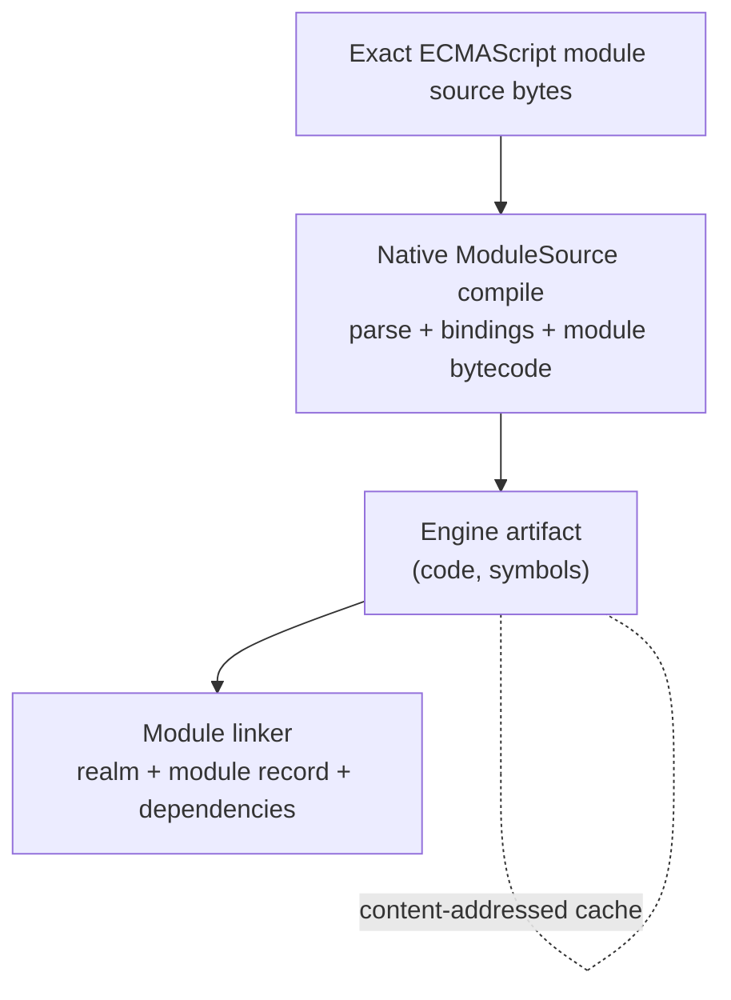

# Endor Bytecode Precompile and Content-Addressed Cache

| | |
|---|---|
| **Created** | 2026-08-06 |
| **Author** | Kris Kowal (prompted) |
| **Status** | Not Started |

## What is the Problem Being Solved?

Every time a worker imports a module, the engine parses the JavaScript source
and compiles it to bytecode before it can run. That parse-and-compile cost is
paid again on every cold start, in every worker, for source that has not
changed. Endo now has two engines that pay it: XS (the C engine embedded by the
`xsnap` crate) and Ironhorse (the Rust reimplementation of XS landed in
[#600](https://github.com/endojs/endo-but-for-bots/pull/600)). Both contain the
machinery to compile source to bytecode and to run a pre-compiled artifact
without reparsing. Neither caches the result.

The goal is a content-addressed cache for the bytecode produced when native
`ModuleSource` compiles one ECMAScript module. It lets either engine skip that
module's compile step when the same executable has already compiled the same
source bytes with the same options. The cache must span both engines without
letting one engine load the other's bytecode by accident, and it must coexist
with the deliberately **source-only** wire contract that
[`daemon-make-archive.md`](daemon-make-archive.md) and
[`daemon-worker-import-from-mount.md`](daemon-worker-import-from-mount.md)
enforce: portable archives carry source, never engine bytecode.

## Vocabulary

Settled architecture terms, used throughout:

- **XS** is the existing engine: Moddable's XS, compiled from `c/moddable/xs/sources`
  by `rust/endo/xsnap/build.rs` and wrapped by the `xsnap` crate's `Machine`.
- **Ironhorse** is the new engine: the pure-Rust reimplementation of XS in the
  `rust/engine/` workspace (`ironhorse-vm`, `ironhorse-compile`, `ironhorse-snapshot`).
- **Endor** is the platform binding: the `rust/endo` supervisor binary (`endor`)
  that embeds an engine, routes messages between workers, and owns the
  content-addressed store. Endor owns the cache integration described here.

Historical names (C-XS, Rust XS, xs2rust) survive only as immutable provenance
(the merged branch was `xs2rust-endor`); they are not used as current-facing
names.

## The cached seam

The cache is deliberately at the native `ModuleSource` boundary. It does not
cache Babel transforms, compartment-mapper analysis, CommonJS wrappers, JSON,
text, or whole-application zygotes.

Portable archives, mounts, and CAS-backed trees already carry the exact source
bytes. `ModuleSource` parses those bytes as a module goal, records the bindings
needed by the linker, and produces engine bytecode. The cache stores only the
engine artifact `(code, symbols)`. The linker state remains live, per-compartment
state and is reconstructed normally on every load.

This is the low-hanging win tracked by
[#296](https://github.com/endojs/endo-but-for-bots/issues/296). A source-analysis
cache such as [#295](https://github.com/endojs/endo-but-for-bots/issues/295) is a
separate design and is not a prerequisite.

## Where each engine exposes compile and load

### XS (C engine)

- **Compile.** `fxParseScript(machine, stream, getter, flags)` runs the
  lexer, parser, scoper, and coder and returns a `txScript*` whose
  `codeBuffer` / `codeSize` hold the XS bytecode and whose
  `symbolsBuffer` / `symbolsSize` hold the symbol atom needed to relink
  intrinsic references by name. This is already exercised in-tree by
  `rust/engine/xs-oracle/csrc/xs_shim.c`: its `xs_oracle_compile_module` compiles
  a module goal (`flags == 0`, "compile only, never run") and `memcpy`s both
  `codeBuffer` and `symbolsBuffer` out. A script goal
  (`mxProgramFlag | mxEvalFlag`) produces bytecode that is directly runnable by
  `fxRunScript`; a module goal produces bytecode that needs the module linker
  (`fxResolveModule` / `fxRunModule` plus a module record and realm) before it
  can run.
- **Load a precompiled artifact.** `fxRunScript(machine, script, realm, ...)`
  for scripts; `fxResolveModule` / `fxRunModule` for modules. Both accept a
  `txScript` the caller supplies rather than one `fxParseScript` just produced,
  so a cached `(codeBuffer, symbolsBuffer)` can be wrapped in a synthetic
  `txScript` and executed without reparsing. Direct inspection of the pinned XS
  sources answers the portability question: `fxParserCode` encodes branches as
  offsets from `codeBuffer` and symbol operands as compilation-local integer
  IDs, not pointers. `fxRemapScript` reads the strings in `symbolsBuffer`, interns
  them in the destination machine, and rewrites those IDs in `codeBuffer` before
  execution. There is no callback-table pointer in ordinary ECMAScript module
  output. The pair is therefore position-independent across processes running
  the same executable. Because remapping mutates the code buffer in place and
  `fxRunScript` then owns and frees a symbol-bearing `txScript`, each load must
  copy the cached bytes into an owned buffer before wrapping them.
- **What is NOT available.** This fork does **not** vendor the Moddable archive
  toolchain. There is no `xsc` / `xsl`, no `.xsb` / `.xsa` / `mc.xsa`, and no
  `fxMapArchive`; the `archive` argument to `fxCreateMachine` is compiled through
  but every caller passes null. So the Moddable "mod" bytecode-archive format is
  not a container this cache can build on. The only binary-artifact persistence
  that exists today is the **heap snapshot** (`fxWriteSnapshot` / `fxReadSnapshot`,
  streamed to the CAS by `suspend_to_cas` / `resume_from_cas` under the
  `SNAPSHOT_SIGNATURE` guard). A snapshot is whole-machine, not per-module; it is
  the precedent for storing signature-bound binary artifacts in the CAS, but it
  is a coarser granularity than a source-keyed bytecode cache (a snapshot loses
  every cache hit when any one module changes).

### Ironhorse (Rust engine)

- **Compile.** `ironhorse-compile` exposes the module-goal
  `compile_module_atoms(source) -> (Vec<u8>, Vec<u8>)` alongside script-goal
  variants. The `_atoms` variants return the `(bytecode, symbols)` pair;
  `compile()`'s comment
  states the bytecode is "the `codeBuffer` half of XS's `txScript`, exactly what
  `xs_oracle::run(source).bytecode` returns." The opcode ISA
  (`ironhorse-compile/src/opcodes.rs`, `XS_CODE_*`) is generated from `c/moddable`'s
  `xsCommon.h` at the engine pin, so Ironhorse emits XS bytecode by construction.
- **Load a precompiled artifact.** The existing script-goal seam,
  `Compartment::evaluate_with_symbols(&bytecode, &symbols)`, demonstrates what
  the module loader needs: `symbols` is parsed into the program-local name table,
  a fresh `Interp` links those names to the destination machine's intrinsics,
  compartment globals are seeded, and then `bytecode` runs. Direct inspection
  confirms that `(bytecode, symbols)` is the complete compiled input across a
  fresh `Interp`; intrinsics, globals, the module record, and its linked
  dependencies are execution context, not compiler output and not key material.
  Ironhorse's current `ModuleGraph` models linking separately and does not yet
  execute `compile_module_atoms` output. The cache integration therefore adds a
  module-goal counterpart to `evaluate_with_symbols` that accepts the live module
  record/linker context plus the cached pair. It does not serialize that context.
- **What is NOT available.** There is no framing, magic number, format version,
  length prefix, checksum, or serde on the compiled `(bytecode, symbols)` bytes,
  and no compiled-bytecode cache. The reusable discipline lives in the
  **snapshot** subsystem, which serializes the heap rather than code:
  `ironhorse-snapshot/src/format.rs` defines the `IRON` magic,
  `IRONHORSE_FORMAT_VERSION: u32 = 1` ("the reader refuses a version it does not
  understand"), a FourCC atom container (`atom.rs`), an append-only host
  `Signature` gate, a `COST_TABLE_VERSION` gate, and a dependency-free
  `sha256.rs`. The loader is already hardened against corrupt input: the fuzz
  target `bytecode_decoder.rs` requires that arbitrary or truncated bytes degrade
  to `Halt::Decode`, never a panic. A bytecode cache mirrors that snapshot
  discipline for the `(code, symbols)` artifact, which does not exist yet.

The two engines' compiled artifacts have the **same shape** (a `(code, symbols)`
pair) because Ironhorse is built and differentially tested to emit byte-identical
XS bytecode. That symmetry is what makes a shared source-identity key natural and
a proven shared format achievable (see the cross-engine invariant below).

## `@endo/module-source` as the compilation seam

`@endo/module-source/src-xs` already exports the engine's native
`globalThis.ModuleSource`. In XS, its constructor calls `fxParseScript` with the
module goal, executes the resulting module prologue to construct the module
record, and exposes `bindings` for linkage. This native constructor is the seam
to accelerate: its source text and module options are the cache input; its
compiled `(codeBuffer, symbolsBuffer)` is the cache payload; its module record
and bindings remain ordinary live loader state.

The JavaScript shim's `PrecompiledModuleSource` / `pre-mjs-json` representation
is not the cache payload. It is a Babel-produced transformed program used on
engines without native `ModuleSource`, and caching it would be a separate
source-analysis concern. The present design neither changes that contract nor
requires normalizing native bindings into it.

Neither engine currently exposes its native module artifact as a supported,
framed API. The minimal refactor is:

1. Split XS native `ModuleSource` construction into compile and instantiate
   operations. The compile operation returns owned `(code, symbols)` bytes; the
   instantiate operation takes those bytes plus the destination realm and builds
   the same module record the constructor builds today.
2. Promote `xs_oracle_compile_module`'s extraction pattern into supported
   `xsnap`/Endor FFI, copying both buffers before the parser-owned `txScript` is
   released.
3. Pair Ironhorse's `compile_module_atoms` with a module-goal loader that accepts
   the same two byte strings and supplies the live `ModuleGraph` context.
4. Frame the pair at the cache boundary. Callers do not persist a `txScript`, a
   `Vec` layout, bindings, realm data, or pointers.

CommonJS support is a follow-up. It adds its analyzer/wrapper step before this
same ECMAScript-module pipeline; it does not require a second bytecode cache
format or a survey of every archive module type.

## Cache identity: the key

Cache identity is defined over the exact source bytes plus everything that can
change what is compiled from them.

- **Source identity** `S = SHA-256(exact source bytes)`. Exact bytes, **not**
  normalized: no whitespace folding, no re-encoding, no shebang stripping. This
  is the same SHA-256 the CAS already assigns to a module blob
  (`store-sha256/{hex}`), so a module already in the CAS is addressable in the
  cache with no source rehash, and source identity is shared across both engines.
  SHA-256 is the project's settled content-address algorithm
  ([`daemon-256-bit-identifiers.md`](daemon-256-bit-identifiers.md)); on XS the
  digest must come from injected `cryptoPowers`, not a static `node:crypto`
  import ([`platform-neutral-hash.md`](platform-neutral-hash.md)).

- **Compile identity** `C`, a tuple folded into the cache key so a stale-format
  entry can never be mis-loaded as a fresh one:
  - `engine`: `xs` or `ironhorse`.
  - `executable_sha256`: SHA-256 of the exact Endor executable bytes. The
    executable incorporates the Moddable pin, generated opcode table, compiler
    crate, build defines, and bytecode reader. Any build change automatically
    selects a new namespace without maintaining a second, fallible list of
    compilation-relevant defines.
  - `compile_options`: the native `ModuleSource` options that alter emitted
    module bytecode. Today this distinguishes ECMAScript from JSON module goal;
    the first implementation caches ECMAScript only.

- **Cache key** = `SHA-256("bytecode" || S || CBOR(C))`.

Folding `C` into the address (rather than storing it only in a sidecar) means two
engines, or two executable builds, that compiled the same source never collide on
the same cache entry. SHA-256 is used for both source and executable identity so
the implementation needs one content-identity primitive and may later fetch the
corresponding executable from a CAS by the same digest.

## Cross-engine key compatibility invariant

**Invariant:** an XS artifact must never be loaded as Ironhorse bytecode, or vice
versa, unless an explicitly proven shared format exists. Common content identity,
the source hash `S`, is preserved across engines; compiled payloads are
namespaced by engine and executable through `C`.

- **Default: namespaced.** Because `engine` and `executable_sha256` are part
  of the cache key, a load is fail-closed by construction: the loader computes
  the key for its own engine and executable, and a hit is guaranteed same-engine,
  same-format. A cross-engine entry is simply not at the address the loader looks
  up. On any miss or integrity failure, it falls back to source compilation.

- **The proven-shared-format escape.** Ironhorse is designed to emit byte-identical
  XS bytecode and is differentially tested to do so: `xs-oracle`'s `compile-diff`
  runs both compilers over a corpus, and `ironhorse-262` drives test262 convergence.
  If, at a given engine pin `P`, that harness certifies byte-for-byte equality of
  the `(code, symbols)` pair across the whole corpus, a **shared format tag**
  `xsbc/
` MAY be minted, and both engines MAY write and read cache entries
  under that tag (setting `engine = shared:xsbc/
` in `C`) so an artifact
  compiled once serves both. The executable hashes of both certified compilers
  are part of the attestation. This is an explicit, versioned format-compat
  record the loader checks, **never** an assumption inferred
  from "Ironhorse is based on XS." Until such a record exists for pin `P`, entries
  stay engine-namespaced. Corollary: a bug that makes the two compilers diverge is
  caught by the differential harness before the shared tag is minted, not by a
  runtime mismatch after.

## Precompile-ahead vs lazy population

Both, feeding the same `S`-keyed cache.

- **Lazy (compile-then-cache).** At native `ModuleSource` construction, compute
  `S`, look up the cache for this engine and executable. On hit, copy and wrap the
  cached `(code, symbols)` and instantiate it through the engine's module linker.
  On miss, compile from source, run, and write the framed artifact back. This is
  the default and needs no build step.
- **Precompile-ahead (AOT).** An `endor precompile <archive> [-e <engine>]` step
  walks a module graph and compiles every module for the target engine and
  executable, warming the cache before first run. This is the source-keyed analog of
  [`worker-rust-xs.md`](worker-rust-xs.md)'s build-time bytecode, but stored in the
  side cache keyed by source identity instead of baked into a worker image, so it
  is re-derivable and engine-namespaced rather than frozen into one engine's build.

Population sources (all reduce to `S`, so all share entries):

- **Archives.** `endor precompile <archive.zip>` walks `compartment-map.json` and
  compiles each source module. The archive stays source-only on disk and on the
  wire; only the local cache is populated.
- **Mounts.** At import-from-mount time
  ([`daemon-worker-import-from-mount.md`](daemon-worker-import-from-mount.md)), each
  resolved module already has a source hash; lazy population caches it as it is
  first compiled.
- **CAS-backed module trees.** A `readable-tree`'s entries are already
  SHA-256-addressed blobs; warming the cache is a walk of the tree computing cache
  keys from the blob hashes plus `C`.

## Location, invalidation, corruption detection, eviction, concurrent writers

- **Location.** Under the distinct `ENDO_CACHE_PATH` (`~/Library/Caches/Endo` on
  macOS, `$XDG_CACHE_HOME/endo` on Linux), which `rust/endo/src/paths.rs` already
  separates from State and Ephemeral. The bytecode cache is a **cache**, not
  authoritative state: it must never live under the CAS `store-sha256/` tree,
  because losing an entry is free (recompile) whereas losing CAS content is data
  loss. Layout mirrors the CAS for familiarity: `cache/bytecode/{key-hex}` blobs
  with `{key-hex}.meta` JSON sidecars, atomically written.

- **Framed payload and corruption detection.** Every entry is framed, mirroring the
  snapshot discipline: a header of `{ magic, format_version, S, C, payload_len,
  payload_sha256 }` followed by the bytes. On load, the reader verifies magic,
  `format_version`, the embedded `C` against its own, and `payload_sha256` against
  the bytes. Any mismatch evicts the entry and falls back to source compilation.
  This layers a positive integrity check on top of the loaders that already refuse
  to trust corrupt bytecode (Ironhorse's `Halt::Decode`).

- **Invalidation.** Purely by key: a changed source changes `S`; a rebuilt
  executable changes `C`. Stale entries are never read (their key is never
  recomputed by a current build) and age out by eviction. There is no in-place
  mutation and no cache-wide flush needed on an engine upgrade.

- **Eviction.** Size-bounded LRU by recorded last-used timestamp (or filesystem
  atime), because every entry is re-derivable. A configurable byte cap on
  `ENDO_CACHE_PATH/cache/` with LRU eviction is sufficient and safe. This
  deliberately differs from the CAS's refcount plus mark-sweep GC
  ([`daemon-cas-management.md`](daemon-cas-management.md)): the CAS must not drop
  referenced content, but a cache may drop anything and simply pay a recompile.

- **Concurrent writers.** Temp-file, hash-on-write, atomic rename, the same model
  `packages/daemon-cas/src/content-store.js` uses. Two workers compiling the same
  module race to write the same key; compilation is deterministic (the XS build
  sets `mxCanonicalNaN` for exactly this reason), so both produce identical bytes
  and the atomic rename makes last-writer-wins harmless and idempotent.

- **Deterministic fallback.** Every read path degrades to source compilation on a
  miss, a version or engine mismatch, a corruption check failure, or an absent
  cache directory. A cache is never on the critical path for correctness, only for
  speed.

## Reconciliation with the source-only archive and mount contracts

[`daemon-make-archive.md`](daemon-make-archive.md) Design Decision 3 and
[`daemon-worker-import-from-mount.md`](daemon-worker-import-from-mount.md) Goal 3
enforce a normative source-only contract: portable archives, trees, and mounts
carry only source-language modules (`mjs`, `cjs`, `json`, `text`, `bytes`) and
actively reject even the `pre-mjs-json` / `pre-cjs-json` precompiled forms, "no
precompiled-parser code lives in the Rust worker at all," and "the ZIP on the wire
is identical between the two paths." make-archive rejected the precompiled forms
because their Babel functor source is larger than the original and "cannot be
re-shared with workers that lack the precompile parsers."

This design does not weaken that contract; it adds a tier beneath it.

- **The portable artifact is unchanged.** Archives, trees, and mounts stay
  source-only and engine-neutral, byte-identical across engines and across the
  wire. The cache never rides the wire or enters an archive. The bytecode
  cache is a **local, non-portable, re-derivable side cache** keyed off the same
  source SHA-256 that the archive and CAS already assign. A peer that receives a
  source-only archive computes its own entries locally for its own engine and
  executable; nothing about one engine's bytecode format crosses a boundary.

- **How the contract evolves.** It does not change on the wire. It gains an
  internal acceleration layer: Endor's import path, given a source-only archive or
  mount, transparently consults the bytecode cache at native `ModuleSource`
  construction beneath the existing source-only import, and populates it on a
  miss. The "cannot be re-shared with workers that lack the precompile parsers"
  objection is answered because the cache is never shared as source, only ever
  recomputed locally from source that every worker already has.

- **The one seam that may embed bytecode is explicitly not the portable archive.**
  A future engine-pinned **deployment bundle** (the
  [`worker-rust-xs.md`](worker-rust-xs.md) build-time-image case, a fixed target
  device or worker) MAY carry engine-namespaced bytecode sidecars alongside its
  source. Such a bundle is a distinct, self-describing, deliberately non-portable
  artifact: each sidecar carries its `C` tuple and the load path falls back to the
  co-located source on any mismatch. It is clearly separated from `makeArchive`'s
  output, which never depends on one engine's bytecode format. This keeps the
  portability guarantee ("archives are source, forever") while giving a fixed
  deployment the option to ship warmed bytecode.

## Integration points in Endor and endo-but-for-bots

- **Compile accessors.** Promote `rust/engine/xs-oracle/csrc/xs_shim.c`'s
  `xs_oracle_compile_module` into a supported `xsnap` FFI returning framed
  `(code, symbols)`; wrap `ironhorse-compile::compile_module_atoms` in the
  same framing. Both land behind the cache facade so callers never touch raw
  `txScript` or `Vec<u8>`.
- **Cache module.** A new `rust/endo/src/bytecode_cache.rs` sibling to
  `cas.rs` / `cas_archive.rs`, owning the framed store under `ENDO_CACHE_PATH`, the
  key derivation, the LRU cap, and the fallback. Reuse `ironhorse-snapshot/src/sha256.rs`
  and `atom.rs` framing patterns.
- **Load interception.** In `rust/endo/xsnap/src/archive.rs` and
  `rust/endo/src/ironhorse_engine.rs`, the point where a compartment compiles a
  native `ModuleSource` is where the cache is consulted and populated.
- **Executable identity.** At Endor startup, SHA-256 the path returned by
  `std::env::current_exe()` once and retain the digest in the cache facade. The
  engine discriminator remains separate because one Endor executable embeds both
  XS and Ironhorse.
- **Hashing on XS.** Via injected `cryptoPowers` host functions
  (`hostSha256Init` / `hostSha256UpdateBytes` / `hostSha256Finish`), never a static
  `node:crypto` import ([`platform-neutral-hash.md`](platform-neutral-hash.md)).

## Dependencies

| Design | Relationship |
|---|---|
| [`daemon-make-archive.md`](daemon-make-archive.md) | Source-only wire contract this cache sits beneath without weakening. |
| [`daemon-worker-import-from-mount.md`](daemon-worker-import-from-mount.md) | Source-only mount import; the lazy-population seam. |
| [`daemon-cas-management.md`](daemon-cas-management.md) | Provides SHA-256 addressing, temp-file/atomic-rename writers, `.meta` sidecars; the cache reuses the disciplines but lives outside the CAS. |
| [`daemon-256-bit-identifiers.md`](daemon-256-bit-identifiers.md) | Settles SHA-256 hex as the content address `S`. |
| [`daemon-xs-worker-snapshot.md`](daemon-xs-worker-snapshot.md) | Precedent for signature-bound binary artifacts in a store; coarser (whole-heap) granularity contrasted with per-module bytecode. |
| [`ironhorse-engine.md`](ironhorse-engine.md) | Defines the shared `XS_CODE` ISA, the snapshot format discipline, and the differential oracle that a proven shared format depends on. |
| [`worker-rust-xs.md`](worker-rust-xs.md) | Proposes build-time XS bytecode; reconciled here as the engine-pinned deployment-bundle case, distinct from the portable archive. |
| [`platform-neutral-hash.md`](platform-neutral-hash.md) | SHA-256 on XS via injected powers, not static `node:crypto`. |

## Design Decisions

1. **Cache native `ModuleSource` bytecode, per module.** Source-analysis caches,
   other module types, and whole-application zygotes are separate follow-ups.
2. **Fold the compile identity into the address, not just a sidecar.** Making
   `engine` and `executable_sha256` part of the key makes cross-engine and
   cross-build mis-load structurally impossible rather than a check that could be
   forgotten.
3. **The cache lives outside the CAS, under `ENDO_CACHE_PATH`.** Cache entries are
   re-derivable, so they use size-bounded LRU eviction and must never be confused
   with authoritative CAS content that requires refcount plus mark-sweep GC.
4. **Persist only an owned `(code, symbols)` pair.** Module records, bindings,
   realms, compartments, and native pointer layouts are reconstructed live.
5. **A shared cross-engine format is proven, never assumed.** The differential
   `xs-oracle` / test262 harness must certify byte-identical output at a pin before
   a `shared:xsbc/<pin>` tag is minted; until then, engine-namespaced.
6. **Do not embed bytecode in the portable archive.** Bytecode acceleration is a
   local side cache; the only artifact that may ship bytecode is a separate,
   self-describing, non-portable engine-pinned deployment bundle.
7. **Deterministic fallback everywhere.** Every miss, mismatch, or corruption
   degrades to source compilation; the cache is never on the correctness path.

## Follow-ups

- Cache whole-application zygotes for workloads where restoring one heap is
  cheaper than linking cached modules. This complements rather than changes the
  per-module cache.
- Feed CommonJS through its analyzer and wrapper before the same native
  ECMAScript-module cache pipeline. No additional bytecode format is needed.
- Consider a source-analysis cache independently under
  [#295](https://github.com/endojs/endo-but-for-bots/issues/295).

## Prompt

> Design: bytecode precompile and content-addressed cache for XS, C and Rust
> engines.
>
> Maintainer's premise (2026-07-25): both the C XS engine and the Rust XS engine
> (#600) contain the machinery necessary to precompile and/or cache byte code
> compiled from a JavaScript source, keyed on a hash of the source. Produce a
> design covering both implementations: where each engine exposes bytecode compile
> plus load; a content-addressed cache keyed on a hash of the JS source (define the
> key precisely; must it fold in engine build / bytecode-format version so a stale
> entry cannot be mis-loaded?); precompile-ahead vs lazy compile-then-cache; cache
> location, population, invalidation, and eviction; cross-engine key compatibility
> (can a C-XS cache entry be reused by Rust XS, or are keys engine/format-namespaced?
> state the invariant); integration points in endo-but-for-bots / endor.
>
> Maintainer amendment (2026-07-29): use the settled architecture vocabulary
> throughout (XS is the existing engine; Ironhorse is the new Rust engine; Endor is
> the platform binding that embeds an engine and owns the cache integration). Make
> @endo/module-source internals an explicit design input and identify the stable
> source-analysis/compilation seam Endor should consume. Prefer a documented
> serializable intermediate contract over coupling Endor or Ironhorse to
> undocumented in-memory object layouts; if existing ModuleSource internals are
> insufficient, specify the minimal API/internal refactor required. Define cache
> identity over exact source bytes plus all compilation-relevant language/options
> and engine bytecode-format/build version. Preserve a common content/source
> identity while namespacing compiled payloads by engine and format: an XS artifact
> must never be loaded as Ironhorse bytecode or vice versa unless an explicitly
> proven shared format exists. Cover ahead-of-time and lazy population through
> archives, mounts, and CAS-backed module trees; invalidation, corruption
> detection, eviction, concurrent writers, and deterministic fallback to source
> compilation. Reconcile this design with daemon-make-archive and
> daemon-worker-import-from-mount, explaining how their source-only contract evolves
> without making portable archives depend on one engine bytecode format.
</content>
</invoke>
