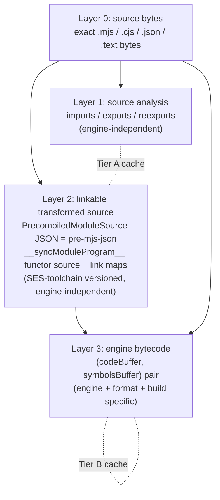

# Endor Bytecode Precompile and Content-Addressed Cache

| | |
|---|---|
| **Created** | 2026-08-06 |
| **Author** | Kris Kowal (prompted) |
| **Status** | Not Started |

## What is the Problem Being Solved?

Every time a worker imports a module, the engine parses the JavaScript source
and compiles it to bytecode before it can run. That parse-and-compile cost is
paid again on every cold start, in every worker, for source that has not
changed. Endo now has two engines that pay it: XS (the C engine embedded by the
`xsnap` crate) and Ironhorse (the Rust reimplementation of XS landed in
[#600](https://github.com/endojs/endo-but-for-bots/pull/600)). Both contain the
machinery to compile source to bytecode and to run a pre-compiled artifact
without reparsing. Neither caches the result.

The goal is a content-addressed cache, keyed on a hash of the JavaScript source,
that lets either engine skip the compile step when it has already compiled that
exact source under that exact engine build. The cache must span both engines
without letting one engine load the other's bytecode by accident, and it must
coexist with the deliberately **source-only** wire contract that
[`daemon-make-archive.md`](daemon-make-archive.md) and
[`daemon-worker-import-from-mount.md`](daemon-worker-import-from-mount.md)
enforce: portable archives carry source, never engine bytecode.

## Vocabulary

Settled architecture terms, used throughout:

- **XS** is the existing engine: Moddable's XS, compiled from `c/moddable/xs/sources`
  by `rust/endo/xsnap/build.rs` and wrapped by the `xsnap` crate's `Machine`.
- **Ironhorse** is the new engine: the pure-Rust reimplementation of XS in the
  `rust/engine/` workspace (`ironhorse-vm`, `ironhorse-compile`, `ironhorse-snapshot`).
- **Endor** is the platform binding: the `rust/endo` supervisor binary (`endor`)
  that embeds an engine, routes messages between workers, and owns the
  content-addressed store. Endor owns the cache integration described here.

Historical names (C-XS, Rust XS, xs2rust) survive only as immutable provenance
(the merged branch was `xs2rust-endor`); they are not used as current-facing
names.

## The compilation layers

A single module passes through distinct representations. Naming them precisely
is what lets the cache key be precise and lets the cross-engine invariant hold.

- **Layer 0** is what portable archives, mounts, and CAS-backed module trees
  carry today. It is the shared content identity across everything below.
- **Layer 1** is the bindings analysis (`imports`, `exports`, `reexports`) that
  the compartment-mapper's dependency graph walk consumes. It is
  engine-independent: XS's native `ModuleSource.bindings`, Ironhorse's
  `ironhorse_vm::module::ModuleSource` reflection, and Babel all produce the same
  three arrays.
- **Layer 2** is `@endo/module-source`'s `PrecompiledModuleSource` record,
  serialized as the compartment-mapper `pre-mjs-json` language: the analysis
  arrays plus the SES functor source string `__syncModuleProgram__` and the
  `__liveExportMap__` / `__fixedExportMap__` / `__reexportMap__` link metadata.
  It is engine-independent (any SES-compatible engine can evaluate the functor)
  but is versioned by the toolchain that produced the functor source (Babel today).
- **Layer 3** is engine bytecode: for XS the `txScript { codeBuffer, symbolsBuffer }`
  produced by `fxParseScript`, for Ironhorse the `(bytecode, symbols)` pair
  produced by `compile_atoms`. Engine and build specific.

This design proposes **two cache tiers**, both keyed off the Layer-0 source
identity:

- **Tier A, the source-analysis cache:** payload is the Layer-2
  `PrecompiledModuleSource` JSON. Engine-independent, versioned by the analyzer.
  It accelerates the bundling/graph-walk pass (the ambition tracked as
  [#295](https://github.com/endojs/endo-but-for-bots/issues/295)).
- **Tier B, the engine-bytecode cache:** payload is the Layer-3
  `(code, symbols)` pair. Engine-namespaced. It accelerates worker cold-start and
  per-module load (the ambition tracked as
  [#296](https://github.com/endojs/endo-but-for-bots/issues/296)).

## Where each engine exposes compile and load

### XS (C engine)

- **Compile.** `fxParseScript(machine, stream, getter, flags)` runs the
  lexer, parser, scoper, and coder and returns a `txScript*` whose
  `codeBuffer` / `codeSize` hold the XS bytecode and whose
  `symbolsBuffer` / `symbolsSize` hold the symbol atom needed to relink
  intrinsic references by name. This is already exercised in-tree by
  `rust/engine/xs-oracle/csrc/xs_shim.c`: its `xs_oracle_compile_module` compiles
  a module goal (`flags == 0`, "compile only, never run") and `memcpy`s both
  `codeBuffer` and `symbolsBuffer` out. A script goal
  (`mxProgramFlag | mxEvalFlag`) produces bytecode that is directly runnable by
  `fxRunScript`; a module goal produces bytecode that needs the module linker
  (`fxResolveModule` / `fxRunModule` plus a module record and realm) before it
  can run.
- **Load a precompiled artifact.** `fxRunScript(machine, script, realm, ...)`
  for scripts; `fxResolveModule` / `fxRunModule` for modules. Both accept a
  `txScript` the caller supplies rather than one `fxParseScript` just produced,
  so a cached `(codeBuffer, symbolsBuffer)` can be wrapped in a synthetic
  `txScript` and executed without reparsing.
- **What is NOT available.** This fork does **not** vendor the Moddable archive
  toolchain. There is no `xsc` / `xsl`, no `.xsb` / `.xsa` / `mc.xsa`, and no
  `fxMapArchive`; the `archive` argument to `fxCreateMachine` is compiled through
  but every caller passes null. So the Moddable "mod" bytecode-archive format is
  not a container this cache can build on. The only binary-artifact persistence
  that exists today is the **heap snapshot** (`fxWriteSnapshot` / `fxReadSnapshot`,
  streamed to the CAS by `suspend_to_cas` / `resume_from_cas` under the
  `SNAPSHOT_SIGNATURE` guard). A snapshot is whole-machine, not per-module; it is
  the precedent for storing signature-bound binary artifacts in the CAS, but it
  is a coarser granularity than a source-keyed bytecode cache (a snapshot loses
  every cache hit when any one module changes).

### Ironhorse (Rust engine)

- **Compile.** `ironhorse-compile` exposes `compile(source) -> Vec<u8>`,
  `compile_with(source, strict)`, `compile_atoms(source) -> (Vec<u8>, Vec<u8>)`,
  and the module-goal variants `compile_module` / `compile_module_atoms`. The
  `_atoms` variants return the `(bytecode, symbols)` pair; `compile()`'s comment
  states the bytecode is "the `codeBuffer` half of XS's `txScript`, exactly what
  `xs_oracle::run(source).bytecode` returns." The opcode ISA
  (`ironhorse-compile/src/opcodes.rs`, `XS_CODE_*`) is generated from `c/moddable`'s
  `xsCommon.h` at the engine pin, so Ironhorse emits XS bytecode by construction.
- **Load a precompiled artifact.** `Compartment::evaluate_with_symbols(&bytecode, &symbols)`
  (and `Interp::run(code)` / `run_program_with_symbols(bytecode, symbols)`). The
  live daemon seam `rust/endo/src/ironhorse_engine.rs::Machine::evaluate` already
  calls `compile_atoms_with` then `evaluate_with_symbols`, but compiles and runs
  in-memory with nothing persisted between the two steps.
- **What is NOT available.** There is no framing, magic number, format version,
  length prefix, checksum, or serde on the compiled `(bytecode, symbols)` bytes,
  and no compiled-bytecode cache. The reusable discipline lives in the
  **snapshot** subsystem, which serializes the heap rather than code:
  `ironhorse-snapshot/src/format.rs` defines the `IRON` magic,
  `IRONHORSE_FORMAT_VERSION: u32 = 1` ("the reader refuses a version it does not
  understand"), a FourCC atom container (`atom.rs`), an append-only host
  `Signature` gate, a `COST_TABLE_VERSION` gate, and a dependency-free
  `sha256.rs`. The loader is already hardened against corrupt input: the fuzz
  target `bytecode_decoder.rs` requires that arbitrary or truncated bytes degrade
  to `Halt::Decode`, never a panic. A bytecode cache mirrors that snapshot
  discipline for the `(code, symbols)` artifact, which does not exist yet.

The two engines' compiled artifacts have the **same shape** (a `(code, symbols)`
pair) because Ironhorse is built and differentially tested to emit byte-identical
XS bytecode. That symmetry is what makes a shared source-identity key natural and
a proven shared format achievable (see the cross-engine invariant below).

## `@endo/module-source` as the source-analysis seam

The maintainer's directive is to consume a documented serializable intermediate
contract rather than couple Endor or Ironhorse to undocumented in-memory object
layouts. The seam is `@endo/module-source`'s `PrecompiledModuleSource`, serialized
as compartment-mapper's `pre-mjs-json`.

- **The documented contract.** `PrecompiledModuleSource` is defined in
  `packages/ses/types.d.ts`: `{ imports, exports, reexports, __syncModuleProgram__,
  __liveExportMap__, __fixedExportMap__, __reexportMap__ }`. The write side is
  `packages/compartment-mapper/src/parse-archive-mjs.js`, which does literally
  `JSON.stringify(new ModuleSource(source, ...))` and tags it `parser: 'pre-mjs-json'`;
  the read side is `packages/compartment-mapper/src/parse-pre-mjs.js`. Every field
  is JSON-round-trippable (the maps are plain objects, `__syncModuleProgram__` is a
  string, there are no functions), so this is a real serializable contract, not an
  in-memory bag. Endor and Ironhorse should consume this, not the live
  `ModuleSource` instance, not the Babel `sourceOptions` bag
  (`TransformSourceParams`), and not the `src-xs` `bindings` getters.

- **Where it is insufficient, and the minimal refactor.** Three gaps:
  1. **No version marker.** `PrecompiledModuleSource` carries no format-version
     field; the compartment-mapper's `pre-mjs-json` language token lives beside
     the bytes, not inside the JSON. Tier A must invalidate when the analyzer
     changes, so the cache sidecar must record an analyzer-format-version.
     Prefer recording it in the cache sidecar over adding a field to the on-wire
     SES record, so the SES linker contract is untouched. This is a cache-side
     change, not a `@endo/module-source` change.
  2. **The XS-native path emits a different shape.** `packages/module-source/src-xs/index.js`
     builds `imports` / `exports` / `reexports` as getters over an XS-native
     `bindings` array whose entry shape (`{ import, as, from }`, `{ exportAllFrom, as }`,
     and so on) is not `PrecompiledModuleSource`. To let XS-native analysis feed
     Tier A, normalize `src-xs` to also expose the flat `imports` / `exports` /
     `reexports` arrays of the documented contract (it already derives them). The
     minimal refactor is additive: expose the array form, do not remove `bindings`.
  3. **Engine-native analysis lacks the functor.** Ironhorse's
     `ironhorse_vm::module::ModuleSource` reflection (`import_bindings()`,
     `export_names()`, `requested_specifiers()`) is Layer 1 only; it produces no
     `__syncModuleProgram__` (that functor source is a Babel-toolchain artifact).
     So an engine-native, Babel-free analysis producer can populate Tier A's
     **analysis subset** (the three arrays, enough for the graph walk) but not the
     full linkable record. The design surfaces this as a real seam choice: Tier A
     entries carry a `producer` tag (`babel` for the full `pre-mjs-json`,
     `engine-native` for the analysis-only subset), and a consumer that needs the
     functor (SES evaluation) treats an analysis-only entry as a miss for its
     purpose.

For the **compilation** seam (Layer 3), neither engine documents or frames its
`(code, symbols)` output. The minimal refactor is a documented accessor that
returns a framed, versioned `(bytecode, symbols, format-tag)` triple rather than
having callers reach into `txScript` internals or a bare `Vec<u8>`: promote XS's
`xs_oracle_compile_module` shim into a supported `xsnap`/Endor FFI, and wrap
Ironhorse's `compile_atoms` output in the same framed container. That framing is
where the format-version and integrity header (below) live.

## Cache identity: the key

Cache identity is defined over the exact source bytes plus everything that can
change what is compiled from them.

- **Source identity** `S = SHA-256(exact source bytes)`. Exact bytes, **not**
  normalized: no whitespace folding, no re-encoding, no shebang stripping. This
  is the same SHA-256 the CAS already assigns to a module blob
  (`store-sha256/{hex}`), so a module already in the CAS is addressable in the
  cache with no rehash, and Layer-0 identity is shared across both cache tiers and
  both engines. SHA-256 is the project's settled content-address algorithm
  ([`daemon-256-bit-identifiers.md`](daemon-256-bit-identifiers.md)); on XS the
  digest must come from injected `cryptoPowers`, not a static `node:crypto`
  import ([`platform-neutral-hash.md`](platform-neutral-hash.md)).

- **Compile identity** `C`, a tuple folded into the Tier-B key so a stale-format
  entry can never be mis-loaded as a fresh one:
  - `engine`: `xs` or `ironhorse`.
  - `bytecode_format_version`: the `XS_CODE` ISA version. For XS this tracks the
    `c/moddable` pin; for Ironhorse it tracks the `opcodes.rs` generation. A
    change to either changes emitted bytes.
  - `engine_build_version`: everything else that changes emitted bytes. For XS:
    the moddable pin SHA and the build defines that affect codegen or determinism
    (`mxCanonicalNaN`, `mxCESU8`, `mxLockdown`, `mxMetering`). For Ironhorse: the
    `ironhorse-compile` crate version.
  - `compile_options`: the compilation-relevant language and options, namely the
    goal (script vs module), strict mode, and any parser flag that alters emitted
    bytecode.

- **Tier-A key** = `SHA-256("analysis" || S || CBOR({ analyzer_format_version,
  producer, source_type }))`.
- **Tier-B key** = `SHA-256("bytecode" || S || CBOR(C))`.

Folding `C` into the address (rather than storing it only in a sidecar) means two
engines, or two engine builds, that compiled the same source never collide on the
same cache entry, and a loader that computes its own key can only ever find an
entry compiled for its own engine and build.

## Cross-engine key compatibility invariant

**Invariant:** an XS artifact must never be loaded as Ironhorse bytecode, or vice
versa, unless an explicitly proven shared format exists. Common **content
identity** (Layer 0, the source hash `S`) is preserved across engines; **compiled
payloads** (Layer 3) are namespaced by engine and format through `C`.

- **Default: namespaced.** Because `engine` and `bytecode_format_version` are part
  of the Tier-B key, a load is fail-closed by construction: the loader computes
  the key for its own engine and pin, and a hit is guaranteed same-engine,
  same-format. A cross-engine entry is simply not at the address the loader looks
  up. On any miss or integrity failure, it falls back to source compilation.

- **The proven-shared-format escape.** Ironhorse is designed to emit byte-identical
  XS bytecode and is differentially tested to do so: `xs-oracle`'s `compile-diff`
  runs both compilers over a corpus, and `ironhorse-262` drives test262 convergence.
  If, at a given engine pin `P`, that harness certifies byte-for-byte equality of
  the `(code, symbols)` pair across the whole corpus, a **shared format tag**
  `xsbc/
` MAY be minted, and both engines MAY write and read Tier-B entries
  under that tag (setting `engine = shared:xsbc/
` in `C`) so an artifact
  compiled once serves both. This is an explicit, versioned attestation, recorded
  as a format-compat record the loader checks, **never** an assumption inferred
  from "Ironhorse is based on XS." Until such a record exists for pin `P`, entries
  stay engine-namespaced. Corollary: a bug that makes the two compilers diverge is
  caught by the differential harness before the shared tag is minted, not by a
  runtime mismatch after.

## Precompile-ahead vs lazy population

Both, feeding the same `S`-keyed cache.

- **Lazy (compile-then-cache).** At module load, compute `S`, look up Tier B for
  this engine and pin. On hit, wrap the cached `(code, symbols)` and load via
  `fxResolveModule` / `fxRunModule` (XS) or `evaluate_with_symbols` (Ironhorse). On
  miss, compile from source, run, and write the framed artifact back. This is the
  default and needs no build step.
- **Precompile-ahead (AOT).** An `endor precompile <archive> [-e <engine>]` step
  walks a module graph and compiles every module for the target engine and pin,
  warming Tier B before first run. This is the source-keyed analog of
  [`worker-rust-xs.md`](worker-rust-xs.md)'s build-time bytecode, but stored in the
  side cache keyed by source identity instead of baked into a worker image, so it
  is re-derivable and engine-namespaced rather than frozen into one engine's build.

Population sources (all reduce to Layer-0 `S`, so all share entries):

- **Archives.** `endor precompile <archive.zip>` walks `compartment-map.json` and
  compiles each source module. The archive stays source-only on disk and on the
  wire; only the local cache is populated.
- **Mounts.** At import-from-mount time
  ([`daemon-worker-import-from-mount.md`](daemon-worker-import-from-mount.md)), each
  resolved module already has a Layer-0 hash; lazy population caches it as it is
  first compiled.
- **CAS-backed module trees.** A `readable-tree`'s entries are already
  SHA-256-addressed blobs; warming the cache is a walk of the tree computing Tier-B
  keys from the blob hashes plus `C`.

## Location, invalidation, corruption detection, eviction, concurrent writers

- **Location.** Under the distinct `ENDO_CACHE_PATH` (`~/Library/Caches/Endo` on
  macOS, `$XDG_CACHE_HOME/endo` on Linux), which `rust/endo/src/paths.rs` already
  separates from State and Ephemeral. The bytecode cache is a **cache**, not
  authoritative state: it must never live under the CAS `store-sha256/` tree,
  because losing an entry is free (recompile) whereas losing CAS content is data
  loss. Layout mirrors the CAS for familiarity: `cache/<tier>/{key-hex}` blobs with
  `{key-hex}.meta` JSON sidecars, atomically written.

- **Framed payload and corruption detection.** Every entry is framed, mirroring the
  snapshot discipline: a header of `{ magic, format_version, S, C, payload_len,
  payload_sha256 }` followed by the bytes. On load, the reader verifies magic,
  `format_version`, the embedded `C` against its own, and `payload_sha256` against
  the bytes. Any mismatch evicts the entry and falls back to source compilation.
  This layers a positive integrity check on top of the loaders that already refuse
  to trust corrupt bytecode (Ironhorse's `Halt::Decode`).

- **Invalidation.** Purely by key: a changed source changes `S`; a bumped engine
  pin, build define, or analyzer version changes `C` (Tier B) or the analyzer
  version (Tier A). Stale entries are never read (their key is never recomputed by
  a current build) and age out by eviction. There is no in-place mutation and no
  cache-wide flush needed on an engine upgrade.

- **Eviction.** Size-bounded LRU by recorded last-used timestamp (or filesystem
  atime), because every entry is re-derivable. A configurable byte cap on
  `ENDO_CACHE_PATH/cache/` with LRU eviction is sufficient and safe. This
  deliberately differs from the CAS's refcount plus mark-sweep GC
  ([`daemon-cas-management.md`](daemon-cas-management.md)): the CAS must not drop
  referenced content, but a cache may drop anything and simply pay a recompile.

- **Concurrent writers.** Temp-file, hash-on-write, atomic rename, the same model
  `packages/daemon-cas/src/content-store.js` uses. Two workers compiling the same
  module race to write the same key; compilation is deterministic (the XS build
  sets `mxCanonicalNaN` for exactly this reason), so both produce identical bytes
  and the atomic rename makes last-writer-wins harmless and idempotent.

- **Deterministic fallback.** Every read path degrades to source compilation on a
  miss, a version or engine mismatch, a corruption check failure, or an absent
  cache directory. A cache is never on the critical path for correctness, only for
  speed.

## Reconciliation with the source-only archive and mount contracts

[`daemon-make-archive.md`](daemon-make-archive.md) Design Decision 3 and
[`daemon-worker-import-from-mount.md`](daemon-worker-import-from-mount.md) Goal 3
enforce a normative source-only contract: portable archives, trees, and mounts
carry only source-language modules (`mjs`, `cjs`, `json`, `text`, `bytes`) and
actively reject even the `pre-mjs-json` / `pre-cjs-json` precompiled forms, "no
precompiled-parser code lives in the Rust worker at all," and "the ZIP on the wire
is identical between the two paths." make-archive rejected the precompiled forms
because their Babel functor source is larger than the original and "cannot be
re-shared with workers that lack the precompile parsers."

This design does not weaken that contract; it adds a tier beneath it.

- **The portable artifact is unchanged.** Archives, trees, and mounts stay
  source-only and engine-neutral, byte-identical across engines and across the
  wire. Neither cache tier ever rides the wire or enters an archive. The bytecode
  cache is a **local, non-portable, re-derivable side cache** keyed off the same
  Layer-0 SHA-256 that the archive and CAS already assign. A peer that receives a
  source-only archive computes its own Tier-B entries locally for its own engine
  and pin; nothing about one engine's bytecode format crosses a boundary.

- **How the contract evolves.** It does not change on the wire. It gains an
  internal acceleration layer: Endor's import path, given a source-only archive or
  mount, transparently consults Tier B (and Tier A for the graph walk) beneath the
  existing source-only import, and populates it on a miss. The "cannot be re-shared
  with workers that lack the precompile parsers" objection is answered because the
  cache is never shared as source, only ever recomputed locally from source that
  every worker already has.

- **The one seam that may embed bytecode is explicitly not the portable archive.**
  A future engine-pinned **deployment bundle** (the
  [`worker-rust-xs.md`](worker-rust-xs.md) build-time-image case, a fixed target
  device or worker) MAY carry engine-namespaced bytecode sidecars alongside its
  source. Such a bundle is a distinct, self-describing, deliberately non-portable
  artifact: each sidecar carries its `C` tuple and the load path falls back to the
  co-located source on any mismatch. It is clearly separated from `makeArchive`'s
  output, which never depends on one engine's bytecode format. This keeps the
  portability guarantee ("archives are source, forever") while giving a fixed
  deployment the option to ship warmed bytecode.

## Integration points in Endor and endo-but-for-bots

- **Compile accessors.** Promote `rust/engine/xs-oracle/csrc/xs_shim.c`'s
  `xs_oracle_compile_module` into a supported `xsnap` FFI returning framed
  `(code, symbols, format_tag)`; wrap `ironhorse-compile::compile_atoms` in the
  same framing. Both land behind the cache facade so callers never touch raw
  `txScript` or `Vec<u8>`.
- **Cache module.** A new `rust/endo/src/bytecode_cache.rs` sibling to
  `cas.rs` / `cas_archive.rs`, owning the framed store under `ENDO_CACHE_PATH`, the
  key derivation, the LRU cap, and the fallback. Reuse `ironhorse-snapshot/src/sha256.rs`
  and `atom.rs` framing patterns.
- **Load interception.** In `rust/endo/xsnap/src/archive.rs` and
  `rust/endo/src/ironhorse_engine.rs`, the point where a compartment compiles a
  source module is where Tier B is consulted and populated.
- **Analysis producer.** For Tier A, the compartment-mapper graph walk consumes
  the documented `pre-mjs-json`; the `@endo/module-source` normalization above
  lets XS-native or engine-native analysis feed the same tier.
- **Hashing on XS.** Via injected `cryptoPowers` host functions
  (`hostSha256Init` / `hostSha256UpdateBytes` / `hostSha256Finish`), never a static
  `node:crypto` import ([`platform-neutral-hash.md`](platform-neutral-hash.md)).

## Dependencies

| Design | Relationship |
|---|---|
| [`daemon-make-archive.md`](daemon-make-archive.md) | Source-only wire contract this cache sits beneath without weakening. |
| [`daemon-worker-import-from-mount.md`](daemon-worker-import-from-mount.md) | Source-only mount import; the lazy-population seam. |
| [`daemon-cas-management.md`](daemon-cas-management.md) | Provides SHA-256 addressing, temp-file/atomic-rename writers, `.meta` sidecars; the cache reuses the disciplines but lives outside the CAS. |
| [`daemon-256-bit-identifiers.md`](daemon-256-bit-identifiers.md) | Settles SHA-256 hex as the content address `S`. |
| [`daemon-xs-worker-snapshot.md`](daemon-xs-worker-snapshot.md) | Precedent for signature-bound binary artifacts in a store; coarser (whole-heap) granularity contrasted with per-module bytecode. |
| [`ironhorse-engine.md`](ironhorse-engine.md) | Defines the shared `XS_CODE` ISA, the snapshot format discipline, and the differential oracle that a proven shared format depends on. |
| [`worker-rust-xs.md`](worker-rust-xs.md) | Proposes build-time XS bytecode; reconciled here as the engine-pinned deployment-bundle case, distinct from the portable archive. |
| [`platform-neutral-hash.md`](platform-neutral-hash.md) | SHA-256 on XS via injected powers, not static `node:crypto`. |

## Design Decisions

1. **Two tiers, one source identity.** Analysis (Layer 2, engine-independent) and
   bytecode (Layer 3, engine-namespaced) are separate caches so the engine-independent
   analysis is shared across engines while compiled payloads never cross engine
   boundaries. Both key off the same Layer-0 `S`.
2. **Fold the compile identity into the address, not just a sidecar.** Making
   `engine` and `bytecode_format_version` part of the Tier-B key makes cross-engine
   mis-load structurally impossible rather than a check that could be forgotten.
3. **The cache lives outside the CAS, under `ENDO_CACHE_PATH`.** Cache entries are
   re-derivable, so they use size-bounded LRU eviction and must never be confused
   with authoritative CAS content that requires refcount plus mark-sweep GC.
4. **Consume the documented `pre-mjs-json` contract, not in-memory layouts.** Endor
   and Ironhorse read `PrecompiledModuleSource` JSON, not the live instance, the
   Babel `sourceOptions` bag, or the `src-xs` `bindings` getters.
5. **A shared cross-engine format is proven, never assumed.** The differential
   `xs-oracle` / test262 harness must certify byte-identical output at a pin before
   a `shared:xsbc/<pin>` tag is minted; until then, engine-namespaced.
6. **Do not embed bytecode in the portable archive.** Bytecode acceleration is a
   local side cache; the only artifact that may ship bytecode is a separate,
   self-describing, non-portable engine-pinned deployment bundle.
7. **Deterministic fallback everywhere.** Every miss, mismatch, or corruption
   degrades to source compilation; the cache is never on the correctness path.

## Open Questions

1. Is XS's `txScript->codeBuffer` position-independent, or does it embed absolute
   pointers to interned symbols or a host callback table that make it
   non-portable across machines? The snapshot machinery relocates such pointers
   explicitly; `fxParseScript` output is undocumented on this point. If the buffer
   is not position-independent, the `symbolsBuffer` relink at load must fully
   restore portability, or the Tier-B key must additionally fold in the machine's
   symbol/callback-table identity, which would collapse cross-process sharing. An
   empirical question for a probe.
2. For Ironhorse, is `(bytecode, symbols)` fully sufficient to reproduce a run
   across a fresh `Interp`, or does `evaluate_with_symbols` depend on
   compartment/intrinsic state that must also be keyed? Confirm the pair is the
   complete relink input.
3. Should Tier B cache **module-goal** bytecode (which needs the linker to run) or
   only **script-goal** bytecode, given that Endo modules are module-goal? Caching
   module bytecode means also driving `fxResolveModule` / `fxRunModule` from a
   cached `txScript`; is that path as cheap as the snapshot alternative for the
   common case?
4. Granularity: per-module bytecode (Tier B as designed) versus a whole-bundle
   heap snapshot keyed by the bundle's aggregate source hash (the existing
   `suspend_to_cas` path). Per-module maximizes reuse when one of N modules
   changes; whole-bundle is simpler and already implemented. Should Endor offer
   both and choose by workload, or commit to per-module?
5. What exactly belongs in `engine_build_version` for XS? Enumerate the build
   defines and moddable-pin components that can change emitted bytes, so the tuple
   is neither too coarse (false hits across incompatible builds) nor too fine
   (needless cache misses on an irrelevant flag change).
6. Does Tier A need the full `pre-mjs-json` (with functor source) or only the
   Layer-1 analysis subset for the endor bundling pass? If only the subset, the
   engine-native producer suffices and the Babel dependency drops from that path
   entirely; if the functor is needed downstream, the Babel producer stays
   authoritative for Tier A. To be resolved with the compartment-mapper Rust-port
   scope.
7. CJS is out of scope here (its analyzer is the separate Babel-based
   `@endo/cjs-module-analyzer`). Should the Tier-A contract be widened to
   `pre-cjs-json` in a follow-up, or does the engine-native path stay ESM-only?
   To be filed as a follow-up if pursued.

## Prompt

> Design: bytecode precompile and content-addressed cache for XS, C and Rust
> engines.
>
> Maintainer's premise (2026-07-25): both the C XS engine and the Rust XS engine
> (#600) contain the machinery necessary to precompile and/or cache byte code
> compiled from a JavaScript source, keyed on a hash of the source. Produce a
> design covering both implementations: where each engine exposes bytecode compile
> plus load; a content-addressed cache keyed on a hash of the JS source (define the
> key precisely; must it fold in engine build / bytecode-format version so a stale
> entry cannot be mis-loaded?); precompile-ahead vs lazy compile-then-cache; cache
> location, population, invalidation, and eviction; cross-engine key compatibility
> (can a C-XS cache entry be reused by Rust XS, or are keys engine/format-namespaced?
> state the invariant); integration points in endo-but-for-bots / endor.
>
> Maintainer amendment (2026-07-29): use the settled architecture vocabulary
> throughout (XS is the existing engine; Ironhorse is the new Rust engine; Endor is
> the platform binding that embeds an engine and owns the cache integration). Make
> @endo/module-source internals an explicit design input and identify the stable
> source-analysis/compilation seam Endor should consume. Prefer a documented
> serializable intermediate contract over coupling Endor or Ironhorse to
> undocumented in-memory object layouts; if existing ModuleSource internals are
> insufficient, specify the minimal API/internal refactor required. Define cache
> identity over exact source bytes plus all compilation-relevant language/options
> and engine bytecode-format/build version. Preserve a common content/source
> identity while namespacing compiled payloads by engine and format: an XS artifact
> must never be loaded as Ironhorse bytecode or vice versa unless an explicitly
> proven shared format exists. Cover ahead-of-time and lazy population through
> archives, mounts, and CAS-backed module trees; invalidation, corruption
> detection, eviction, concurrent writers, and deterministic fallback to source
> compilation. Reconcile this design with daemon-make-archive and
> daemon-worker-import-from-mount, explaining how their source-only contract evolves
> without making portable archives depend on one engine bytecode format.
</content>
</invoke>
