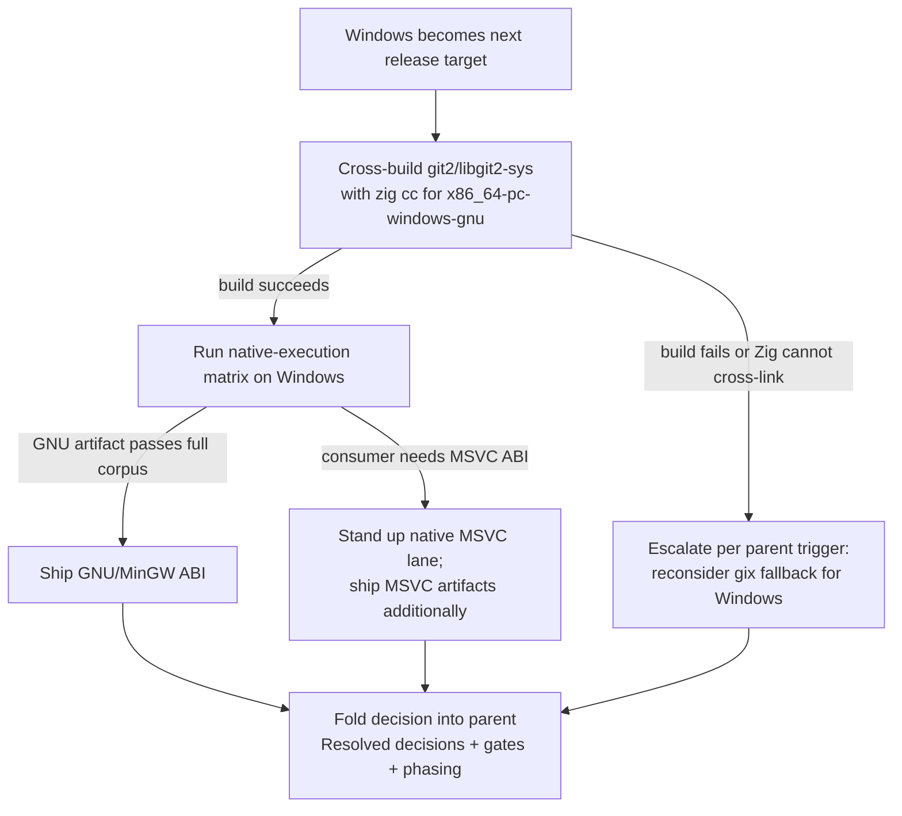

# Windows Support for Endor Git Bindings

| | |
|---|---|
| **Created** | 2026-09-16 |
| **Updated** | 2026-09-16 |
| **Author** | Kris Kowal (prompted) |
| **Status** | Proposed |
| **Source** | Follow-up to [endor-git-bindings](endor-git-bindings.md), deferred in [PR #987 review](https://github.com/endojs/endo-but-for-bots/pull/987#discussion_r3799239555) |

## Context

[endor-git-bindings](endor-git-bindings.md) binds libgit2 from Rust and
cross-compiles release artifacts with Zig. The 2026-08-17 review of
[PR #987](https://github.com/endojs/endo-but-for-bots/pull/987) accepted a
GNU/Linux-first delivery and deferred Windows explicitly:

> Linux good enough at first pass. Post a plan to follow-up about Windows.
> — kriskowal, [PR #987 comment](https://github.com/endojs/endo-but-for-bots/pull/987#discussion_r3799239555)

That review closed the Windows ABI question as "deferred past the first release"
(endor-git-bindings.md § Resolved decisions). This design is that deferred plan.
It does not add Rust code or change the binding contract; it defines the
**decision, validation sequence, and gates** that move the Windows target from
deferred to supported (or to a recorded, escalated non-support) and specifies
exactly which sections of the parent design the outcome folds back into.

Promote this to a `build` only once the GNU/Linux first pass has landed and
Windows is the next release target.

## Goals and scope

- Decide the Windows **ABI target**: is the GNU (MinGW) ABI sufficient for the
  standalone binary via Zig cross-compilation, or must release engineering add
  native MSVC artifacts?
- Validate the vendored `git2` / `libgit2-sys` source build under `zig cc` for
  the Windows target, then run the native-execution matrix on Windows before
  declaring the target supported, honoring the parent design's cross-build gate
  and its escalation trigger.
- Fold the outcome back into endor-git-bindings.md § Resolved decisions,
  § Verification gates, and § Phased delivery.

Out of scope: the safe Rust contract, the FFI callback layer, the storage
adapters, and the smart-HTTP seam — all owned by the parent design and
ABI-independent. Windows changes only the release lane and its gates, not the
crate's source.

## The ABI decision

The parent design already targets `x86_64-pc-windows-gnu` initially and treats
the MinGW-compatible GNU lane as the entry point, with MSVC artifacts added
"only from a native MSVC lane" (endor-git-bindings.md § Vendoring and Zig
cross-compilation, release-family table). This follow-up turns that table row
into an executable decision.

The decision is data-driven, not a coin flip. The GNU/MinGW ABI is the default
and is preferred if and only if it clears every gate below **and** no confirmed
consumer requires an MSVC-ABI artifact (a consumer that must link `endor-git`
into an MSVC-built host binary, or that ships within an MSVC-only distribution
constraint). The MSVC lane is added only when a consumer requirement forces it,
because a native MSVC lane reintroduces exactly the per-target native C
toolchain burden that Zig was adopted to shrink — it cannot cross-compile from
the canonical Linux build host and needs a Windows runner with the MSVC
toolchain provisioned. Since the MinGW-compatible libgit2 build is well
established, the GNU lane's technical risk is the `cargo-zigbuild` gap noted in
the parent, not libgit2 portability.

## Validation sequence

1. **Cross-build gate (from Linux host).** Build the vendored `git2` /
   `libgit2-sys` source for `x86_64-pc-windows-gnu` using the checked-in
   `zig cc` / `zig ar` wrappers (the parent design does not use `cargo zigbuild`
   for Windows because it does not currently claim Windows target support). The
   build must complete with the pinned Zig toolchain and **no target C compiler
   installed**, producing a statically linked artifact. This is the parent's
   Cross-build gate applied to the Windows target and is the parent's
   first-expected point of failure.
2. **Escalation on cross-build failure.** If the GNU lane cannot reach a
   reproducible cross-build plus a passing native run with the pinned Zig
   toolchain, escalate the Windows target to the maintainer as a blocking
   result (parent § Revision context) rather than dropping it or hand-patching
   its C toolchain indefinitely. The `gix` fallback (parent § Alternatives
   considered) is reconsidered for Windows at that point. Do **not** silently
   fall back to MSVC to dodge the GNU-lane failure — an MSVC pivot is a
   consumer-driven decision, not a workaround for a broken cross-build.
3. **Native-execution gate (on Windows).** Run the same object, pack, ref,
   corruption, and (where the Minion Town service participates) protocol corpus
   the other targets run, on native Windows `x86_64`, before declaring the
   target supported. A cross-build that has never run on Windows is not a
   supported target.
4. **Link audit (on Windows).** `dumpbin /dependents` shows no dynamic libgit2,
   OpenSSL, libssh2, or unexpected zlib dependency — the Windows arm of the
   parent's Link audit gate.
5. **Reproducibility.** Two clean cross-builds with the same pinned inputs
   produce matching normalized Windows artifacts.
6. **MSVC lane (only if the ABI decision selects it).** Stand up a native MSVC
   build lane on a Windows runner and run gates 3–5 against the MSVC artifact.
   The MSVC artifact is additive; it does not retire the GNU lane unless a
   consumer constraint requires exactly one ABI.

## Windows-specific gate additions

These extend, and do not replace, the parent's Verification gates for the
Windows target:

| Gate | Required observation |
|---|---|
| Windows cross-build | `x86_64-pc-windows-gnu` builds from the canonical Linux host with the pinned Zig toolchain and the checked-in `zig cc` / `zig ar` wrappers, no target C compiler installed. |
| Windows native execution | The GNU artifact runs the full object/pack/ref/corruption (and, where applicable, protocol) corpus on native Windows `x86_64`. |
| Windows link audit | `dumpbin /dependents` shows no dynamic libgit2, OpenSSL, libssh2, or unexpected zlib dependency. |
| MSVC parity (conditional) | If the ABI decision ships MSVC, the MSVC artifact clears the native-execution, link-audit, and reproducibility gates on its own lane. |

## Fold-back into the parent design

When this plan resolves, edit [endor-git-bindings.md](endor-git-bindings.md):

- **§ Resolved decisions.** Replace the "Windows ABI target: deferred past the
  first release" entry with the concrete outcome: GNU/MinGW shipped, or MSVC
  added, or Windows escalated/held with the `gix` fallback under consideration —
  citing this design and the native-execution evidence.
- **§ Verification gates.** Merge the Windows-specific gate rows above into the
  parent's gate table so the Windows target's Cross-build, Native execution, and
  Link audit rows are no longer implicit.
- **§ Phased delivery.** Extend phase 4 ("Add the Zig release wrapper and run
  the cross-build plus native-execution matrix before declaring any target
  supported") to record Windows as an explicitly-validated target of that
  matrix, or, on escalation, note the Windows target as held with its fallback.
- **§ Vendoring and Zig cross-compilation.** Update the release-family table's
  Windows row from "`x86_64-pc-windows-gnu` initially … add MSVC artifacts only
  from a native MSVC lane" to the decided reality.

## Open questions

- Does any confirmed consumer of `endor-git` (Endor's own standalone binary, or
  Minion Town's service on a Windows host) require an **MSVC-ABI** artifact, or
  is the GNU/MinGW ABI sufficient for every known consumer? This is the load
  bearing decision and the maintainer's to make; the plan above defaults to
  GNU/MinGW absent such a requirement.
- Is `aarch64` Windows in scope, or is `x86_64` Windows the only Windows target
  for this pass? The parent design names only `x86_64-pc-windows-gnu`.
- Where does the Windows **native-execution** run — a hosted CI Windows runner,
  or a maintainer-provisioned machine? The gate requires a real Windows
  execution environment that the Linux-hosted cross-build cannot supply.

## Dependencies

| Design | Relationship |
|---|---|
| [endor-git-bindings](endor-git-bindings.md) | Parent design; owns the crate, the Zig cross-build lane, and the gates this plan extends and folds back into. |
| [PR #987 review comment](https://github.com/endojs/endo-but-for-bots/pull/987#discussion_r3799239555) | Originating maintainer directive deferring Windows and requesting this follow-up plan. |

## Prompt

> Deferred follow-up requested in kriskowal's 2026-08-17 review of
> endojs/endo-but-for-bots#987 ("Linux good enough at first pass. Post a plan to
> follow-up about Windows."). Decide the Windows ABI target (GNU/MinGW via Zig
> versus native MSVC); validate the vendored libgit2 build under Zig cc for
> Windows and run the native-execution matrix on Windows before declaring the
> target supported; and fold the outcome back into the parent design's Resolved
> decisions, Verification gates, and Phased delivery sections.
