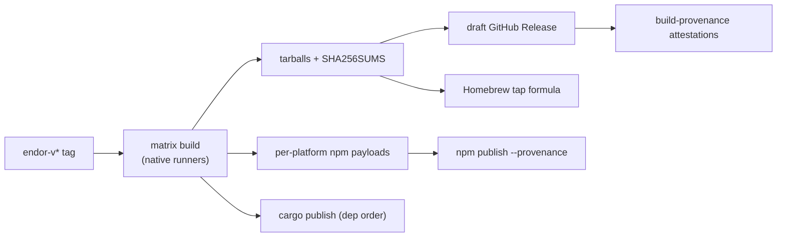

# Endor Packaging and Release

| | |
|---|---|
| **Created** | 2026-07-25 |
| **Author** | Kris Kowal (prompted) |
| **Status** | Not Started — gated on [`#600`](https://github.com/endojs/endo-but-for-bots/pull/600) (maintainer directive 2026-07-25; see *Contingent on the in-flight XS-to-Rust port*) |

## What is the Problem Being Solved?

`endor` is the native Rust binary for the Endo daemon
([daemon-endor-architecture](daemon-endor-architecture.md)). It is built
today only from a source checkout. To reach users and CI it needs
reproducible, provenanced distribution through the channels its audiences
already use:

- **npm / `npx`** — the primary Endo audience is JavaScript developers who
  already `yarn`/`npm install` the `@endo/*` packages.
- **crates.io / `cargo install`** — Rust developers embedding or extending
  the daemon.
- **Homebrew** — macOS and Linux users who want a system CLI.

Python packaging (pip / PyPI) is **explicitly out of scope**: Endor exposes
no Python surface, and the prompt excludes it.

The binary is not a pure-Rust artifact. `xsnap` compiles the Moddable XS C
sources with the `cc` crate (`rust/endo/xsnap/build.rs`, from the
`c/moddable` git submodule, with a `prebuilt/libxs.a` fallback), and `endo`
depends on `rusqlite` with the `bundled` feature (which compiles SQLite's C).
Every packaging decision below is shaped by that fact: artifact production is
**native cross-platform compilation with a C toolchain per target**, not
pure-Rust `cross`/`zig` cross-compilation, and crates.io publication must ship
the vendored C sources because a git submodule cannot travel in a crate
tarball.

> **Contingent on the in-flight XS-to-Rust port — wait for #600.**
> [`endojs/endo-but-for-bots#600`](https://github.com/endojs/endo-but-for-bots/pull/600)
> (`xs2rust-endor-engine`) is porting the XS engine to a memory-safe Rust crate
> precisely to **liberate `xsnap` of its C-toolchain dependency**. If it lands,
> the `xsnap` half of the constraint above dissolves — no `c/moddable`
> submodule, no XS vendoring, and pure-Rust `cross`/`zig` cross-compilation
> becomes viable for that source. **The C-toolchain-per-target shape of this
> design is therefore the pre-#600 baseline, not a permanent given.** Per the
> maintainer directive on this PR (2026-07-25), packaging should wait for #600
> to resolve before committing to the native-runner matrix, because #600
> decides whether the target end-state is C-toolchain cross-compilation or
> pure-Rust cross. Two C dependencies are **not** removed by #600 alone and are
> tracked separately: `rusqlite`'s bundled SQLite C (see
> [daemon-endo-rust-sqlite](daemon-endo-rust-sqlite.md) for the pure-Rust
> storage direction) and the choice of git library (next).

> **Coupled decision — the git backend's C dependency.** Endor's git capability
> ([daemon-git-capability](daemon-git-capability.md),
> [daemon-git-remotes](daemon-git-remotes.md)) ships a native-`git` subprocess
> backend today, but both designs leave room for a Rust-native backend, and its
> crate choice carries the **same** C-toolchain question the maintainer flags: a
> **libgit2-binding crate (`git2`)** links the C `libgit2` and reintroduces a
> per-target C toolchain, whereas a **pure-Rust crate (`gitoxide`/`gix`)** does
> not. While `xsnap` and `rusqlite` already force a C toolchain, `git2`'s C is
> effectively "free"; once #600 removes the XS C dependency, the git-library
> choice becomes a **deciding** factor in whether `endor` can be a pure-Rust
> cross-compiled artifact. It should therefore be made against the same
> "keep `endor` pure-Rust-cross" criterion, not in isolation. This design only
> records the coupling; the choice itself belongs to the git-backend design
> once #600's direction is settled.

### Prior art followed

- **[kriskowal/yay](https://github.com/kriskowal/yay)** — the npm binary
  distribution scheme this design mirrors: per-platform packages
  (`binyay-<platform>`) gated by `os`/`cpu`, a thin wrapper package
  (`binyay`) listing them as `optionalDependencies`, a matrix native build in
  `release.yml`, and a Homebrew tap job that computes SHA-256 and regenerates
  a formula (`yay.rb`) from the GitHub Release tarballs. Endor adopts the same
  shape, adapted to the `@endo/` scope and the C-toolchain constraint.
- **In-repo `release.yml`** — `changesets/action` publishes the `@endo/*` JS
  packages on push to `master`, under a strict security posture
  (`permissions: {}` at the workflow, job-scoped grants, SHA-pinned actions,
  `persist-credentials: false`, `YARN_ENABLE_SCRIPTS=false` /
  `npm_config_ignore_scripts=true`). Endor's release workflow reuses this
  posture verbatim.
- **In-repo `familiar-release.yml`** — the closest existing precedent for
  native artifact production: a tag-triggered (`familiar-v*`) +
  `workflow_dispatch` matrix `make` job over `macos-14`/`arm64`,
  `macos-13`/`x64`, `ubuntu-latest`/`x64`, uploading per-target artifacts into
  a draft GitHub Release via `softprops/action-gh-release`. Endor's tag
  namespace and workflow structure copy this.

## Target / Platform Matrix

| npm key | Rust target triple | Runner | libc | Tier |
|---|---|---|---|---|
| `darwin-arm64` | `aarch64-apple-darwin` | `macos-14` | — | 1 |
| `darwin-x64` | `x86_64-apple-darwin` | `macos-13` | — | 1 |
| `linux-x64` | `x86_64-unknown-linux-gnu` | `ubuntu-latest` | glibc | 1 |
| `linux-arm64` | `aarch64-unknown-linux-gnu` | `ubuntu-24.04-arm` | glibc | 2 |
| `linux-x64-musl` | `x86_64-unknown-linux-musl` | `ubuntu-latest` + `musl-tools` | musl | 2 |
| `win32-x64` | `x86_64-pc-windows-msvc` | `windows-latest` | — | 3 |

**Tier 1** is exactly the trio `familiar-release.yml` already builds — proven
to compile the XS/SQLite C on native runners. **Tier 2** and **Tier 3** are
added incrementally (see Phases) as the C build is validated per target; each
tier is gated behind its own open question (native arm runner availability,
musl static build, Moddable XS on MSVC). Native runners are used throughout
rather than `cross`/`zig` because the C compilation is far more reliable on a
native toolchain than under emulation or a rehosted linker.

## Package Layout

### npm

Under the `@endo/` scope, mirroring yay's `binyay` scheme:

- **Wrapper: `@endo/endor`** — `"bin": { "endor": "bin/endor.js" }`; no
  `os`/`cpu` (always installs); `optionalDependencies` listing every
  per-platform package pinned to the **exact** release version. `bin/endor.js`
  is a launcher that resolves the platform binary with
  `require.resolve('@endo/endor-<platform>/bin/endor')` (choosing
  `<platform>` from `process.platform`, `process.arch`, and — for musl —
  detecting libc) and re-execs it with `child_process.spawnSync`, forwarding
  argv, stdio, and exit code.
- **Per-platform: `@endo/endor-<npm-key>`** (`@endo/endor-darwin-arm64`, …)
  — each carries `"os"`, `"cpu"`, and (for musl) `"libc"` fields so npm
  installs only the matching one, and a single native binary under `bin/`
  (`endor` or `endor.exe`).

**Decision — resolve at runtime, no postinstall copy.** yay copies the binary
in a `postinstall.js`. Endor resolves it lazily in the launcher instead, so
installs with scripts disabled (`--ignore-scripts`,
`npm_config_ignore_scripts=true` — the posture this repo already enforces)
still work. The launcher is the only script and it runs at invocation, not at
install.

### crates.io

- `cargo install endor` should Just Work for a Rust developer with a C
  compiler on PATH. The published binary crate is `endor` (see Open Questions
  on the `endo` → `endor` crate rename and name availability).
- **xsnap vendoring.** A crates.io tarball must be self-contained; the
  `c/moddable` submodule cannot ship. A pre-publish `vendor-xs.sh` step copies
  the pinned subset of Moddable XS sources that `xsnap/build.rs` needs into
  `rust/endo/xsnap/vendor/`, added to the crate via `include`, and `build.rs`
  prefers `vendor/` when present. `rusqlite`'s `bundled` C already ships this
  way, so no change is needed there. Document that `cargo install` requires a
  system C compiler.
- **Publish order** (path deps rewritten to version deps by the release
  tooling): `endo_iroh`, `ocapn_noise`, `xsnap`, then `endo`/`endor`.

### Homebrew

- A tap `endojs/homebrew-endo` with formula `endor.rb`.
- **Binary formula, not build-from-source** (yay's model): `on_macos` /
  `on_linux` × `on_arm` / `on_intel` blocks point at the GitHub Release
  tarballs with their SHA-256 checksums; `install` drops `endor` on PATH. This
  avoids a heavyweight source formula that would have to compile XS. The
  release workflow regenerates and pushes the formula.

## Artifact Production

One matrix `build` job (structurally the `familiar-release.yml` `make` job)
per target: checkout with `submodules: recursive` (to populate `c/moddable`),
`cargo build --release -p endo --bin endor --target <triple>`, then two
outputs from the **same** binary:

1. A release archive `endor-<version>-<target>.tar.gz` (`.zip` on Windows).
2. The per-platform npm package payload (binary copied into
   `bin/` of a generated `@endo/endor-<npm-key>` staging dir).

Single source of truth: the tarball asset and the npm binary are the identical
artifact, never built twice. For `linux-arm64`, prefer the native
`ubuntu-24.04-arm` runner over a cross gcc-aarch64 toolchain so the XS/SQLite C
compiles natively.

## Release / Version Coordination

- **Single version source of truth: `rust/endo/Cargo.toml` `[package]
  version`.** A prepare step stamps that exact version into the wrapper
  `package.json`, every per-platform `package.json`, the wrapper's
  `optionalDependencies` pins, and the Homebrew formula. npm + crate + brew +
  tarball move in lockstep — a hard invariant enforced by the workflow, not by
  hand.
- **Tag namespace `endor-v<semver>`**, mirroring `familiar-v*` and
  **decoupled** from both the JS `changesets` release (`release.yml`) and the
  familiar release, so a JS release never forces an Endor release and vice
  versa.
- **Trigger:** push of an `endor-v*` tag, plus `workflow_dispatch` with a
  `version` input (validated against a semver regex, exactly as
  `familiar-release.yml` does).

## CI Automation

- **`endor-release.yml`** — modeled on `familiar-release.yml`:
  `build` (matrix) → fan-out to `npm-publish` (per-platform packages first,
  then the wrapper, all with `npm publish --provenance`), `crates-publish`
  (`cargo publish` in dependency order), `github-release` (draft; tarballs +
  `SHA256SUMS`), and `homebrew` (regen + push formula). Security posture is
  copied verbatim from the existing release workflows: workflow-level
  `permissions: {}` with job-scoped grants, SHA-pinned actions,
  `persist-credentials: false`, the npm-lifecycle guards, and
  `package-manager-cache: false` on release-triggered jobs (the zizmor rule
  this repo already enforces).
- **PR CI** — build + test the workspace on the Tier-1 matrix for PRs
  touching `rust/**`, so a break is caught before a release. Whether to extend
  the existing `ci.yml` or add an `endor-ci.yml` is an open question (does
  `ci.yml` already build the Rust workspace?).

## Provenance / Checksums

- **`SHA256SUMS`** over every release tarball, attached to the GitHub Release;
  the Homebrew formula reads these checksums.
- **npm `--provenance`** — publishing from GitHub Actions with OIDC links each
  package to its source commit and workflow (free supply-chain attestation,
  consistent with the repo's hardening ethos).
- **`actions/attest-build-provenance`** over the binaries/tarballs for
  SLSA-style provenance; optional keyless `cosign` signing of the tarballs.
  crates.io has no first-class provenance yet — rely on the attestation plus a
  reproducible source tree.

## Installation UX

| Channel | Command | Audience |
|---|---|---|
| npm (global) | `npm i -g @endo/endor` | JS devs |
| npm (ephemeral) | `npx @endo/endor …` / `yarn dlx @endo/endor …` | JS devs |
| crates.io | `cargo install endor` (needs a C compiler) | Rust devs |
| Homebrew | `brew install endojs/endo/endor` | macOS/Linux CLI |
| Shell installer | `curl -fsSL <url>/install.sh \| sh` | no npm/cargo/brew |

The shell installer (yay-style, optional tier) picks the right release tarball
by `uname`, verifies its SHA-256 against `SHA256SUMS`, and drops `endor` on
PATH. In every channel, `endor --version` prints the semver that matches the
installed package version.

## Dependencies

| Design | Relationship |
|---|---|
| [daemon-endor-architecture](daemon-endor-architecture.md) | The binary this design packages. Packaging can start once it builds on Tier-1. |
| [endor-native-zip-xs](endor-native-zip-xs.md) | Adds Rust host functions to the same binary; no packaging change. |
| [endor-tui](endor-tui.md), [endor-bus-tui](endor-bus-tui.md) | Ship inside the same `endor` binary; no separate artifact. |
| [`endojs/endo-but-for-bots#600`](https://github.com/endojs/endo-but-for-bots/pull/600) (`xs2rust-endor-engine`) | **Directive-gating.** Removes `xsnap`'s C-toolchain dependency; decides C-toolchain-cross vs. pure-Rust-cross as this design's target end-state. Maintainer directed waiting for it (2026-07-25). |
| [daemon-endo-rust-sqlite](daemon-endo-rust-sqlite.md) | The remaining `rusqlite` SQLite-C dependency; its resolution is the second half of a fully pure-Rust `endor`. |
| [daemon-git-capability](daemon-git-capability.md), [daemon-git-remotes](daemon-git-remotes.md) | A future Rust-native git backend's crate choice (`git2` libgit2-bindings vs. pure-Rust `gitoxide`/`gix`) shares the same C-toolchain question; couple it to #600's outcome. |

The C-toolchain-required baseline can proceed once `endor` compiles on the
Tier-1 matrix, but the maintainer has directed **waiting for #600** (2026-07-25)
before committing to the native-runner matrix, since #600 determines whether the
end-state is C-toolchain cross-compilation or a pure-Rust cross build.

## Phased Implementation

1. **Phase 0 — Foundation.** Resolve the crate name / version-source-of-truth;
   land `vendor-xs.sh` and the `build.rs` `vendor/` preference; add Tier-1 PR
   CI. No publishing.
2. **Phase 1 — GitHub Releases.** `endor-release.yml` build matrix (Tier-1) →
   draft Release with tarballs + `SHA256SUMS` + build-provenance attestations.
   Lowest risk; mirrors `familiar-release.yml`.
3. **Phase 2 — npm.** Generate + publish per-platform and wrapper packages
   with `--provenance`; `npx @endo/endor` works. Add Tier-2 targets
   (`linux-arm64`, `linux-x64-musl`) as their C build is validated.
4. **Phase 3 — crates.io.** Vendored xsnap; publish crates in dependency
   order; `cargo install endor`.
5. **Phase 4 — Homebrew.** Tap + formula regeneration in the release workflow.
6. **Phase 5 — Installer + Windows.** `install.sh`; add `win32-x64` once the
   Moddable XS build on MSVC is proven (its own open question).

## Design Decisions

1. **Native runners per target, not `cross`/`zig`** — because `xsnap` and
   `rusqlite` compile C, which is far more reliable on a native toolchain.
2. **Runtime binary resolution in the wrapper, no postinstall copy** — survives
   `--ignore-scripts`, the posture this repo enforces.
3. **`os`/`cpu`/`libc`-gated `optionalDependencies`** — npm fetches only the
   matching native package; the wrapper always installs.
4. **One version source (`rust/endo/Cargo.toml`) stamped into every channel** —
   npm, crate, brew, and tarball stay in lockstep.
5. **`endor-v*` tag namespace, decoupled** from the JS `changesets` release and
   `familiar-v*`.
6. **Vendor XS C sources into the xsnap crate** — a submodule cannot ship in a
   crates.io tarball.
7. **Binary Homebrew formula over release tarballs**, not build-from-source —
   avoids compiling XS in a formula.
8. **Reuse the repo's existing release security posture verbatim.**
9. **Exclude pip/PyPI** — no Python surface; per the prompt.

## Known Gaps and Open Questions

- **C-toolchain vs. pure-Rust target end-state (gating, per maintainer):** wait
  for [`#600`](https://github.com/endojs/endo-but-for-bots/pull/600)
  (`xs2rust-endor-engine`) to decide. If it lands, `xsnap` needs no C toolchain
  and no XS vendoring, opening pure-Rust `cross`/`zig`; the native-runner matrix,
  the `vendor-xs.sh` step, and the "needs a C compiler" caveats all become
  conditional. Re-scope this design once #600's direction is settled.
- **git library C dependency (coupled decision):** a future Rust-native git
  backend (see [daemon-git-capability](daemon-git-capability.md),
  [daemon-git-remotes](daemon-git-remotes.md)) should pick between a `git2`
  (libgit2, C) and a `gitoxide`/`gix` (pure-Rust) crate with the
  keep-`endor`-pure-Rust-cross goal in view — post-#600 this becomes the
  deciding factor rather than a free rider on an existing C toolchain.
- **Residual SQLite C:** even post-#600, `rusqlite`'s bundled SQLite compiles C;
  a fully pure-Rust `endor` also needs [daemon-endo-rust-sqlite](daemon-endo-rust-sqlite.md)
  (or a pure-Rust SQLite crate) resolved.
- **Crate name:** publish as `endor` (rename the `endo` workspace crate to
  match the binary) or keep `endo` and document `cargo install endo --bin
  endor`? Are `endo` / `endor` available on crates.io? (`lukehoban/endo-rust`
  is an unrelated ICFP entry, not a published crate of that name — to be
  verified.)
- **`ci.yml` Rust coverage:** does the existing PR CI already build the Rust
  workspace? Extend it if so; add `endor-ci.yml` otherwise. (To be verified by
  the builder.)
- **Windows XS build:** is Moddable XS buildable under MSVC? Gates
  `win32-x64`; may require `x86_64-pc-windows-gnu` or indefinite deferral.
- **`linux-arm64` runner:** is `ubuntu-24.04-arm` available to this repo, or
  is a cross gcc-aarch64 C toolchain required?
- **xsnap vendoring viability:** license and size of shipping Moddable XS
  sources in a crates.io tarball (default 10 MB crate-size limit; confirm XS
  license compatibility).
- **Version-bump tooling:** `release-plz` vs `cargo-release` vs a manual
  version-bump PR — to be chosen. Tracking: to be filed against milestone M11.
- **npm scope rights:** confirm publish rights for `@endo/endor-*` packages.
- **Provenance depth:** target SLSA level — build-provenance attestations
  only, or add keyless `cosign` signing of tarballs?

## Prompt

> Design a packaging and release system for Endor so it is published as a Rust
> crate and as cross-compiled npm packages. Mine
> https://github.com/kriskowal/yay for prior design guidance and largely
> follow the same approach where it fits Endor. Consider extending the design
> to Homebrew distribution. Explicitly exclude pip/Python packaging. Identify
> the canonical Endor repository, develop the design against its current
> structure, and deliver an actionable proposal covering package layout,
> target/platform matrix, artifact production, release/version coordination, CI
> automation, provenance/checksums, installation UX, and an incremental
> adoption path.
