# Exo-Stream Adaptive Pacing and Buffer Control

| | |
|---|---|
| **Created** | 2026-08-29 |
| **Author** | kriscendobot (prompted) |
| **Status** | Proposed |

## Problem

`@endo/exo-stream` readers pace a producer with a single static number: the
`buffer` credit window. A consumer calls `iterateReader(reader, { buffer })`
and a producer is made with `readerFromIterator(iterator, { buffer })`. The
window is a credit-based backpressure scheme layered over CapTP. The consumer
issues synchronization ("give me more") credits whose payload is the JS value
`undefined` (a bare flow-control signal, confirmed by `iterate-reader.js`'s own
"Synchronization values are `undefined`" comment). The producer answers each
credit with a data acknowledgement, and the window bounds how many items are in
flight or sitting prefetched at once. `ReadableBlob.lines(buffer = 0)` —
*proposed* in [PR #832](https://github.com/endojs/endo-but-for-bots/pull/832),
which is **open and unmerged** as of this writing, so the method does not yet
exist in `packages/platform/src/fs/interfaces.js` — would inherit exactly this
knob once it lands.

A fixed window cannot be right for every link. Too small and throughput
collapses toward one item per CapTP round trip (the window cannot cover the
bandwidth-delay product). Too large and a slow consumer accumulates an
unbounded prefetch pile of aging items: memory the initiator holds, plus
producer work that an early `return()` throws away. The maintainer's note on
[PR #832](https://github.com/endojs/endo-but-for-bots/pull/832#discussion_r3885564599)
is the origin: "There is not an obviously better default. Post a follow up
job to consider a more sophisticated codel algorithm for implicitly
controlling the pace and buffer size. Even in that case, we need an alpha
parameter for relative aggressiveness."

This design adds an **opt-in, consumer-side adaptive credit controller**,
CoDel-inspired, that sizes the window to the smallest value sustaining
throughput. It changes no wire format and no existing signature. A numeric
`buffer` behaves exactly as today. It does **not** disturb the pending
`ReadableBlob.lines(buffer = 0)` proposal on PR #832 (see
[Compatibility](#compatibility)).

## Where the policy belongs

The controller lives on the **initiator (consumer) side**, replacing the
static pre-buffer loop in `iterateReader` (`packages/exo-stream/iterate-reader.js`)
with an adaptive credit scheduler. The producer (`makeReaderPump` in
`reader-pump.js`) is unchanged: it already pulls only when it holds credit, so
a consumer that widens or narrows its credit issuance **implicitly controls
producer pace and buffer size**, which is exactly the ask. For all pacing to be
consumer-driven the producer's own `buffer` must be `0` (or a small floor).

This is a **joint precondition, not a consumer-enforceable one.** `makeReaderPump`
in `reader-pump.js` pre-pulls its own local `buffer` items *before ever consulting
the syn/credit chain* (`for (let i = 0; ; i += 1) { if (i >= buffer) { await
synPromise ... } ... }`, `reader-pump.js:73-76`): a **producer-local** knob set on
the far end of the CapTP wire, which the consumer's `iterateReader` call has no
authority over and cannot observe. The two `buffer` options therefore live on
opposite ends of the wire and neither side can force the other's. The adaptive
memory bound (see [Limits](#limits-and-failure-behavior)) holds **only when the
producer's own pre-pull buffer is `0` or small**; a producer that keeps a nonzero
local `buffer` will eagerly pre-pull ahead of the consumer's credit ledger, and
that pre-pull burst is real initiator-held memory the consumer's `outstanding`
accounting does not count. That case is called out as an explicitly unbounded
pairing in [Compatibility](#compatibility) and exercised by the verification plan,
rather than asserted away. The garden's own motivating call site — `lines()` — pins
the producer buffer at `0`, so it satisfies the precondition by construction; an
arbitrary externally-supplied producer does not, and only documentation (not the
consumer) can hold it to `0`.

The consumer is the correct single locus because the three quantities the
controller needs are all initiator-local:

- **Memory.** The prefetch pile of resolved-but-unconsumed acknowledgement
  nodes lives on the initiator.
- **Consume pace.** Only the initiator observes when the application actually
  takes each item.
- **Credit authority.** Issuing and withholding synchronization credit is
  already the initiator's job (`synResolve`).

Because every measurement is initiator-local, a malicious or buggy responder
(the producer) **cannot** inflate the window. The worst it can do is be slow,
which the controller reads as a producer-bound link (see
[Limits](#limits-and-failure-behavior)). Throughout this document "responder"
names the CapTP responder, which in a reader stream is the exo-stream
**producer**, and "initiator" names the CapTP initiator, which is the
**consumer**.

## Observable signals

For each acknowledgement node `i` the initiator already sees, using an injected
monotonic clock `now()`:

| Signal | Definition | Meaning |
|---|---|---|
| `tArrive[i]` | when the ack node for `i` resolved locally | data landed |
| `tConsume[i]` | when the application's `next()` returned item `i` | data taken |
| **`sojourn[i]`** | `tConsume[i] - tArrive[i]` | **time the item aged in the local prefetch buffer** |
| `starved[i]` | the buffer was empty when `next()` asked, so it waited for `tArrive` | consumer outran the pipe |

`sojourn` is the CoDel *sojourn time*: the queue is the local prefetch buffer
and sojourn is time-in-that-queue. It contains **no** round-trip term, so it
measures standing backlog, not link latency. That property lets one delay
`target` — the standing-delay budget the controller holds `sojourn` under,
defined as `target = alpha * target0` and detailed in
[The alpha knob](#the-alpha-knob) — work across a variable-RTT CapTP link.
`sojourn` (the shrink half) and `starved` (the growth half) are the two signals
the control loop actually consults; between them they drive the whole loop.

## Control loop

The loop is a delay-based congestion controller. **CoDel governs the ceiling**
(a standing backlog forces the window down) and **additive-increase governs the
floor** (a starved pipe pulls the window up). Unlike lossy CoDel, the actuator
is **credit withholding, never dropping**: no delivered data is ever discarded,
because the queue is reliable.

**CoDel in one paragraph** (for readers new to it). CoDel (Controlled Delay, from
network queue management) judges congestion not by how *full* a queue is but by
how *long* items sit in it — the *sojourn time*. A queue that is briefly deep but
drains fast is healthy; one where items consistently age past a small `target`
delay has a *standing* backlog that pure occupancy cannot distinguish from a
harmless burst. So CoDel watches whether sojourn stays above `target` for a full
`interval`: it *arms* a timer at `now + interval` the moment sojourn first crosses
`target`, and only if sojourn is still high when the timer fires does it act —
this hysteresis is what lets it ignore transient bursts and react only to
persistent bloat. Once acting, it does not act once and stop; it acts repeatedly
on an **accelerating cadence**, `interval / sqrt(count)`, so the longer the
backlog persists the harder it pushes. This design keeps that detector wholesale
and only swaps the actuator: where classic CoDel drops packets, this controller
withholds credit and shrinks the window.

State: `W` (real-valued window, clamped to `[min, max]`), `outstanding`
(**credits issued minus items consumed**, so it counts items the application has
not yet taken, whether still in flight or already sitting resolved in the local
prefetch buffer), and a CoDel detector (`firstAbove`, `reducing`, `count`,
`nextReduce`). The `reducing` flag is classic CoDel's `dropping` state field under
a renamed identity: because this controller withholds credit instead of dropping
data (see above), the flag that classic CoDel calls "currently dropping" here
means "currently in the reducing phase," and is renamed to say so rather than
carry the misleading `dropping` name into a design that never drops.

Defining `outstanding` on **consumption**, not arrival, is deliberate and is
what makes the "Hard memory bound" claim true. `iterate-reader.js`'s existing
mechanics resolve an ack node as soon as data lands over CapTP, independent of
when the application calls `next()`, so arrival and consumption are distinct
events. If `outstanding` decremented on arrival, a stalled application would let
issued credits arrive and pile up unconsumed while `outstanding` fell toward 0,
and the pump would then top the ledger back to `W` **on top of** that unconsumed
backlog, growing the real buffer past `W`. Counting consumption instead means
`outstanding` is exactly the number of unconsumed items (in flight plus
prefetched), so bounding it by `floor(W) <= max` bounds real memory.

```mermaid
stateDiagram-v2
  [*] --> Filling
  Filling --> Filling: starved or sojourn under target\nadditive increase W by alpha
  Filling --> Arming: sojourn at or over target\narm firstAbove at now plus interval
  Arming --> Filling: sojourn under target or buffer drained\nreset detector
  Arming --> Reducing: now reaches firstAbove\nreduce W by factor beta; count is 1
  Reducing --> Reducing: sojourn stays over target and now reaches nextReduce\nreduce W again; count plus 1; nextReduce is now plus interval over sqrt count
  Reducing --> Filling: sojourn under target or buffer drained\nreset detector
```



**Cold start.** The controller seeds `W = min` (the liveness floor) with
`outstanding = 0` and an empty detector, before any `sojourn` or `starved`
sample exists. On stream start the credit pump runs once against that seed,
issuing the first `floor(min)` credits, which replaces the static synchronous
pre-buffer priming loop of the numeric path. The first observed samples then
drive additive increase up from that floor.

**Per consumed item.** The initiator, when `next()` returns item `i`: (1) samples
`sojourn[i]` and `starved[i]`; (2) decrements `outstanding` (the item was
consumed); (3) steps the detector above; (4) runs the **credit pump**: while
`outstanding < min(controller.fillTarget(), controller.maxCredit)` and the stream
is live, issue one synchronization credit and increment `outstanding`. The pump's
trigger is thus **gated on consumption**, not arrival: the same event that
releases buffer memory is the one that lets new credit flow, so the ledger and
the real buffer move together. The `min(..., maxCredit)` clamp is applied by
`iterateReader`'s loop, not trusted to the controller: the memory ceiling is
enforced loop-side against *any* `CreditController`, so a buggy or hostile
`fillTarget()` cannot pump past the declared bound (see
[the interface](#the-creditcontroller-interface) and
[Limits](#limits-and-failure-behavior)).
Credit issuance is thereby **decoupled** from the one-credit-per-consumed-item
lockstep of today (a separate pump chases `W(t)` rather than emitting exactly
one credit per item), while remaining bounded by consumption.

Concretely, suppose `min = 1`, `max = 16`, `alpha = 1`, decrease factor
`beta = 1/2`, effective `target = 5` ms, `interval = 100` ms, and the clock starts
at `t = 0` ms. The controller seeds `W = 1` and the pump issues one credit
(`outstanding = 1`). Item 0 arrives at `t = 30` ms and the application consumes it
at once, so `sojourn[0] = 0` ms (at or under `target`). The detector stays in
Filling and `W` grows to `2` by additive increase. `outstanding` drops to `0` on
consume, then the pump refills it to `floor(2) = 2`. Now suppose the application
stalls: item 1 sits from its arrival at `t = 45` ms until it is consumed at
`t = 53` ms, so `sojourn[1] = 8` ms (over `target`), which arms `firstAbove` at
`t = 153` ms. If `sojourn` stays over `target` until `now` reaches 153 ms, the
detector reduces `W` from `2` toward `2 * beta = 1` with `count = 1` and schedules
the next reduction at `153 + 100 / sqrt(1) = 253` ms, converging the window back
down to the floor.

CoDel's escalating drop cadence (`interval / sqrt(count)`) becomes an escalating
**reduction** cadence: the longer a standing backlog persists, the faster the
window shrinks, so a persistently slow consumer converges quickly to `min`. The
window naturally settles at the bandwidth-delay product, the smallest size that
keeps `sojourn <= target` while never starving.

### The alpha knob

`alpha` is any positive real number `(0, infinity)`, default `1`, the caller's
single dial for **relative aggressiveness**, and it is monotone: **larger alpha
means a larger steady-state window, so more throughput, more memory, and more
prefetch-waste risk**; smaller alpha means tighter memory, a window approaching
the lockstep floor, and reduced throughput. `alpha` sets the additive-increase
step (`W += alpha`). By default it also scales the delay tolerance,
`target = alpha * target0`, so one number moves both the growth rate and the
standing-delay budget together.

**Why monotonicity holds by construction.** `alpha` drives only the *increase*
side of the loop; the multiplicative *decrease* is a **separate fixed factor
`beta`** (default `1/2`, the classic AIMD halving), deliberately **not** coupled to
`alpha`. This is the reason the decrease is `W *= beta` throughout — the worked
example, the state diagram, and the reduction cadence all reduce by `beta`, never
by a function of `alpha`. Were the decrease tied to `alpha` (an earlier draft
reduced by `1 / (1 + alpha)`), a larger `alpha` would both grow the window faster
*and* cut it harder per reduction, and the net steady-state average would be a
nontrivial dynamical-systems question rather than a guarantee — at large `alpha`
the sharper cut could even dominate the faster growth. Decoupling the two removes
that ambiguity: with `beta` fixed, each unit of `alpha` raises the additive step
and the delay budget while leaving the decrease untouched, so the steady-state
window is strictly increasing in `alpha` by construction. A caller who wants a
gentler or sharper backoff sets `beta` directly (default `1/2`); it is an
independent knob, not a hidden consequence of `alpha`.

Growth rate and delay tolerance are, however, genuinely separate axes (an
interactive low-latency caller may want fast growth *and* a tight delay budget,
which the coupled scalar cannot express), so `target` is a **separate optional
override**: when the caller supplies it, it replaces `alpha * target0` and
delay tolerance is tuned independently of growth rate. The default remains the
coupled `alpha * target0`, so a caller who sets only `alpha` gets the simple
one-knob behavior and a caller who needs to decouple has the escape hatch. This
resolves the first open question above in favor of "coupled by default,
decouplable by explicit override." `alpha` is retained regardless of any default
change, per the maintainer.

## Surface and compatibility

The `buffer` option becomes a discriminated union. `typeof buffer === 'number'`
selects the static window (today's behavior); any object selects adaptive mode.
Among objects the discriminant is a brand: a `CreditController` produced by
`makeCodelCreditController(opts)` carries an `isCreditController` marker (and the
`record`/`fillTarget`/`maxCredit` members below), and `iterateReader` uses it
directly. Any other
object is treated as a plain descriptor and is normalized by wrapping it in
`makeCodelCreditController(descriptor)` before use. So there is exactly one
object branch a caller must reason about (descriptor versus already-built
controller), and the brand, not the raw shape, is what tells them apart.

```ts
// Unchanged: fixed credit window, today's behavior, default 0.
iterateReader(reader, { buffer: 8 });

// New: opt-in adaptive controller, built explicitly. All fields optional.
iterateReader(reader, { buffer: makeCodelCreditController({ alpha: 1 }) });

// New: the plain descriptor form (iterateReader wraps it for you).
iterateReader(reader, { buffer: { alpha: 1, beta: 0.5, min: 1, max: 1024, target0, interval } });
```

`makeCodelCreditController(opts)` returns a `CreditController`, the interface the
initiator loop consults each round. The CoDel policy is one implementation of
that interface, so it is unit-testable in isolation and a future non-CoDel
policy is a drop-in. `IterateReaderOptions.buffer` widens from `number` to
`number | CreditController` (`packages/exo-stream/types.ts`).

### The `CreditController` interface

An extension point the design advertises as user-implementable must have its
contract stated where it is introduced. `makeCodelCreditController` and
`makeOccupancyCreditController` are both exported from the `@endo/exo-stream`
package entry point (`packages/exo-stream/index.js`), the same module a caller
imports `iterateReader` from, so the constructor is discoverable without grepping
the package. Each returns a `CreditController`. `iterateReader`'s loop reads
exactly one method and one field on the controller per consumed item, in order:

```ts
interface CreditController {
  // Brand: distinguishes a built controller from a plain descriptor.
  readonly isCreditController: true;

  // Hard credit ceiling. iterateReader clamps fillTarget() to this before
  // pumping, so the memory bound is enforced loop-side against ANY
  // implementation — not on the honor system of a trusted fillTarget().
  readonly maxCredit: number;

  // Called once per consumed item, with that item's fresh sample.
  // Deltas are already clamped non-negative by the caller.
  record(sample: {
    sojourn: number;   // tConsume - tArrive, clamped >= 0
    starved: boolean;  // the buffer was empty when next() asked
    now: number;       // monotonic timestamp of this consumption
  }): void;

  // The current integer credit target the pump fills toward, i.e. floor(W).
  // Named for its contract (the target the pump fills toward), deliberately
  // NOT "floor()" — "floor" names the lower bound `min` elsewhere in this
  // document, and a method returning the fill *target* must not borrow it.
  fillTarget(): number;
}
```

`record` advances the controller's internal state machine (detector plus window);
`fillTarget()` reports the integer credit target the pump then fills `outstanding`
up to, which `iterateReader` clamps to `maxCredit`. Exposing `maxCredit` on the
interface — rather than folding the ceiling into one implementation's private
clamp — is what lets the loop enforce the memory bound uniformly: a conforming
controller with a runaway `fillTarget()` still cannot pump the real buffer past
`maxCredit`, because the loop, not the controller, applies the ceiling. A
controller holds only counters and its injected `now`, so it composes with
`lockdown` and with the existing teardown unchanged.

### Compatibility

- **Numeric `buffer` is bit-for-bit unchanged**, including the `0` default and
  the pre-buffer priming loop. No existing caller changes.
- **Wire format is unchanged.** The synchronization and acknowledgement chains
  carry the same nodes; only the *rate and count* of credits the initiator
  issues changes. So every pairing interoperates: adaptive consumer with legacy
  producer (`buffer 0` or `N`), and legacy consumer with any producer.
- **The memory bound holds only against a `buffer:0` (or small) producer.** This
  is the one pairing where interoperation is not the whole story. As
  [Where the policy belongs](#where-the-policy-belongs) sets out, a producer that
  keeps a nonzero local pre-pull `buffer` (`makeReaderPump`'s own knob, on the far
  end of the CapTP wire and unenforceable by the consumer) eagerly pulls up to
  that many items *ahead of* the consumer's credit ledger. Those pre-pulled items
  are real initiator-held memory that `outstanding` does not count, so the
  [hard memory bound](#limits-and-failure-behavior) — which bounds only
  consumer-credited items — does **not** cover them. Adaptive-consumer +
  nonzero-buffer-producer is therefore an **explicitly unbounded pairing**: it
  functions correctly (the streams interoperate) but its peak memory is
  `producer.buffer + max`, not `max`. The verification plan pairs the adaptive
  consumer with a nonzero-buffer producer precisely to demonstrate this bound
  degrading rather than to assert it never does. Callers who need the tight bound
  must pin the producer's `buffer` to `0`; this design can document that
  precondition but cannot enforce it across the wire.
- **`ReadableBlob.lines(buffer = 0)` is untouched.** `lines`'s argument is the
  *producer* pre-pull, and `0` is already the correct producer setting for
  adaptive mode; adaptivity is selected by the *consumer* at `iterateReader`,
  not by `lines`. Because `lines` pins the producer buffer at `0`, it is the one
  concrete call site that satisfies the memory-bound precondition above by
  construction. This follow-up therefore establishes an opt-in consumer path and
  leaves the shared reader API's signature and default exactly as *proposed* in
  the still-open [PR #832](https://github.com/endojs/endo-but-for-bots/pull/832)
  (see the [Problem](#problem) note on its unmerged status). Flipping the
  consumer-side default to adaptive is explicitly out of scope and gated behind
  this controller being *proven* strictly better in adoption (a future design,
  **to be filed**).
- **`iterateBytesReader` is the untouched-but-symmetric sibling.**
  `iterateBytesReader` (`packages/exo-stream/iterate-bytes-reader.js`) is the same
  shape of operation as `iterateReader` — same consumer-side static pre-buffer
  priming loop, same `IterateBytesReaderOptions.buffer?: number` knob over the
  same `makeReaderPump` producer. It therefore takes the **identical**
  discriminated-union widening: `IterateBytesReaderOptions.buffer` widens from
  `number` to `number | CreditController`, wired to the same controller and the
  same loop-side `maxCredit` clamp, so the two siblings do not silently diverge. It
  is called out here — rather than left unmentioned like the two siblings the
  original draft addressed — because a reader who reaches for adaptivity on
  `iterateBytesReader` must find the same answer, not silence. (`lines` and
  `makeBufferedReader`, the two *asymmetric* siblings, keep the separate
  treatments below.)
- **Same option name, two accepted domains, on purpose.** `iterateReader`'s
  `buffer` accepts `number | CreditController`, while sibling
  `ReadableBlob.lines(buffer = 0)` stays strictly numeric: its `buffer` is a
  producer pre-pull count, a different quantity from the consumer credit policy.
  The two are deliberately **not** unified, and `lines()` does **not** accept a
  descriptor or controller (passing one is unsupported and should be rejected by
  its existing numeric validation). A reader of `lines(buffer = 0)` should not
  infer that an object is accepted there. Renaming `lines`'s option is out of
  scope (it is a shipped, numeric-only knob); the divergence is documented here
  rather than papered over.
- **Push-based readers are out of scope.** `makeBufferedReader`
  (`buffered-channel.js`) is eager and fire-and-forget: the producer never spends
  synchronization credit, so the consumer window does not throttle it (already
  documented there). The adaptive controller is a **no-op** for buffered
  channels and applies only to pull-based `makeReaderPump` readers. The
  implementation must document this and the descriptor must be harmless if
  passed to a buffered-channel consumer.

## Composition with CapTP and cancellation

- **CapTP flow control.** The credit window *is* the application-level
  backpressure on top of CapTP's promise pipelining; CapTP adds no cross-wire
  backpressure of its own beyond transport buffering. Because `sojourn` excludes
  the round-trip term and CoDel tracks the *minimum* standing delay over an
  interval, the controller tolerates RTT variation and bursts without needless
  shrinkage, the standard CoDel burst-tolerance property carried onto a
  variable-RTT link.
- **Concurrent streams over one transport are assumed independent.** CoDel's
  single-queue model assumes `sojourn` reflects only this stream's own backlog.
  Two or more adaptive streams sharing one CapTP connection to the same peer,
  each growing and shrinking `W` independently, is the classic multi-flow AIMD
  (additive-increase, multiplicative-decrease) contention case, and this design
  does **not** coordinate fairness between such
  co-resident streams: each controller sizes its own window from its own
  `sojourn` alone. This is a stated **non-goal** here. A shared-transport
  fairness policy (a coordinated controller across co-resident streams) is a
  separate follow-up, **to be filed** if adoption surfaces the contention in
  practice.
- **Cancellation.** The controller holds only counters, so it composes with the
  existing `return()`/`throw()` teardown in `iterate-reader.js` unchanged: on
  terminal it stops and issues no further credit (it must honor `terminalPromise`
  before every credit-pump emission), and outstanding pre-pulled items are
  discarded exactly as today. Keeping the window minimal is a *cancellation*
  virtue too: fewer speculative items were pulled, so an early close wastes less
  producer work and fewer irreversible source reads.

## Limits and failure behavior

- **Clock capability.** CoDel needs a monotonic time source, which a confined
  SES exo may not have ambiently. `now()` is an **injected** power (monotonic
  milliseconds); the controller uses only `now()` plus arithmetic, so it runs
  under `lockdown`. With no clock, a **degraded count-based fallback** governs
  purely by occupancy (a conservative fixed window with additive-increase,
  multiplicative-decrease driven by starvation and occupancy rather than delay).
  It still bounds memory but cannot chase throughput as tightly. This fallback
  is **not** a branch fused into the CoDel policy: it is a separate
  `CreditController` implementation, `makeOccupancyCreditController`, that
  satisfies the same `record`/`fillTarget` interface. `makeCodelCreditController`
  detects the absence of `now()` at construction and **delegates** to
  `makeOccupancyCreditController`, so the policy boundary the design relies on
  for testability also covers its own degrade path. Non-monotonic clocks are
  guarded by clamping negative deltas to `0`.
- **Hard memory bound (loop-enforced, producer-scoped).** `max` firmly bounds the
  **consumer-credited** buffer: no measurement, however adversarial, grows
  `outstanding` past it, because `outstanding` counts unconsumed credited items and
  the pump never issues beyond `min(fillTarget(), maxCredit) <= max`. Two
  properties make this a real bound rather than an honor-system claim. First, the
  ceiling is applied **loop-side**: `iterateReader` clamps any controller's
  `fillTarget()` to its declared `maxCredit` (see
  [the interface](#the-creditcontroller-interface)), so the bound holds against a
  buggy or hostile third-party `CreditController`, not just the reference CoDel one
  — it is a property of the loop, not of one implementation's private clamp.
  Second, it is **scoped to the producer precondition**: it bounds the initiator's
  credited buffer, which equals total real memory **only when the producer's own
  pre-pull `buffer` is `0` or small**. Against a nonzero-buffer producer, peak
  memory is `producer.buffer + max` — an explicitly unbounded pairing documented
  under [Compatibility](#compatibility), because the consumer cannot enforce the
  far end's setting. `min >= 1` guarantees liveness (credit always reaches the
  producer, so the stream cannot stall).
- **Trust.** All timing is initiator-local; a hostile responder (producer)
  cannot forge the consumer's clock and so cannot enlarge the window. A slow or
  lying responder reads as producer-bound: growth stops helping but is harmless,
  and `max` caps it regardless.
- **Degenerate links.** Producer-bound (source is the bottleneck): the window
  grows to `max` without benefit but does no harm; the pump simply stays
  credited. Consumer-bound (slow application): the window collapses to `min`,
  standing delay stays near `target`, memory stays bounded via occupancy AIMD.

## Verification plan

Controller unit tests with a synthetic clock and synthetic `sojourn`/`starved`
traces (no CapTP needed), asserting:

- Fast consumer, slow producer -> `W` climbs to a stable value near the BDP with
  no oscillation.
- Slow consumer, fast producer -> `W` collapses to `min`; `outstanding <= max`
  and standing `sojourn <= target * (1 + margin)` throughout (the bufferbloat
  regression, which this test exists to catch precisely because `outstanding`
  counts consumption, not arrival).
- Step change in consumer speed -> `W` re-converges within a bounded number of
  intervals.
- Bursty consumer -> min-tracking prevents needless shrinkage (CoDel burst
  tolerance).
- Alpha sweep -> monotone: larger alpha yields a larger steady-state window and
  higher throughput at more memory. Because the decrease factor `beta` is fixed and
  decoupled from `alpha`, the sweep must hold `beta` constant and confirm the
  steady-state window is strictly increasing in `alpha` with no non-monotone dip at
  large `alpha` (the failure mode an `alpha`-coupled decrease would introduce).
- Beta sweep -> holding `alpha` fixed, a larger `beta` (gentler backoff) yields a
  higher steady-state window and slower reconvergence after a stall, confirming
  `beta` tunes backoff sharpness independently of `alpha`'s growth rate.
- Explicit `target` override -> delay tolerance changes while the
  additive-increase step (set by `alpha`) does not, confirming the two axes
  decouple.
- Adversarial controller -> a `CreditController` whose `fillTarget()` returns an
  arbitrarily large value never grows `outstanding` past its declared `maxCredit`,
  proving the ceiling is enforced by `iterateReader`'s loop-side clamp and not by
  trust in the controller.
- Clock-absent -> the `makeOccupancyCreditController` fallback still bounds
  `outstanding <= max`.
- Determinism -> the controller runs under `lockdown` with only an injected
  `now`; no ambient authority.

Integration tests over the existing CapTP loopback (`test/captp-stream.test.js`)
with injected artificial RTT and per-item produce/consume delays: throughput
within a stated fraction of the best fixed-buffer baseline while max outstanding
stays bounded; adaptive consumer against a `buffer:0` producer (the bounded case);
and early `return()`/`throw()` mid-stream with credit outstanding tears down
cleanly with no leaked credit and prefetched items discarded. A push-based
`makeBufferedReader` consumer passed the descriptor must behave as an
unthrottled no-op.

- **Producer pre-buffer degradation.** Pair the adaptive consumer with a
  **nonzero-`buffer` producer** and assert that peak initiator memory is
  `producer.buffer + max`, *not* `max` — demonstrating the memory bound degrading
  exactly as [Compatibility](#compatibility) and [Limits](#limits-and-failure-behavior)
  state, so the unenforceable joint precondition is verified as a real limit rather
  than silently assumed away.

The design's own headline motivating path — `ReadableBlob.lines()` wired through
the adaptive controller over the loopback (a real `lines()` reader, not a synthetic
`iterateReader` stand-in), asserting that `lines`'s producer-side `0` composes with
an adaptive consumer window and that line delivery, throughput, and the memory
bound all hold on that concrete call site the Compatibility argument leans on — is
**blocked on [PR #832](https://github.com/endojs/endo-but-for-bots/pull/832)
merging**, since `ReadableBlob.lines()` does not exist until it lands. Until then
this end-to-end item is a *pending* verification target: the synthetic
`iterateReader`-over-loopback tests above stand in for it, and the `lines()`
integration is added as a follow-up gated on #832. This dependency is tracked in
[Dependencies](#dependencies).

## Dependencies

| Design | Relationship |
|---|---|
| `ReadableBlob.lines(buffer = 0)`, established by [PR #832](https://github.com/endojs/endo-but-for-bots/pull/832) | Establishes the `buffer` knob this controller makes adaptive; PR #832 is the origin of this follow-up. Its `lines(buffer = 0)` decision is left unchanged. A prose design for that knob exists only on the unmerged branch `design/readableblob-lines` and is not cited as landed provenance here. |
| [buffered-channel-exo-stream-consolidation.md](buffered-channel-exo-stream-consolidation.md) | The push-based reader explicitly excluded from adaptive pacing. |
| [platform-range-and-tree-reads.md](platform-range-and-tree-reads.md) | Owns the layered readable-blob readers whose consumers may opt into adaptivity. |

## Open questions

1. **Alpha/target coupling — resolved in this revision:** `alpha` co-scales the
   additive-increase step and the delay `target` by default, and `target` is a
   separate optional override so aggressiveness (growth rate) and delay tolerance
   can be tuned independently when needed (see
   [The alpha knob](#the-alpha-knob)). Left here as a record of the decision
   rather than an open fork.
2. **Parameter defaults — open:** what are the right defaults for `target0`,
   `interval`, `min`, `max`, and the decrease factor `beta`? CoDel's 5 ms and
   100 ms come from network queues; a CapTP credit window over a loopback or a
   same-process bridge has a very different latency floor, so the defaults should
   be calibrated against the loopback integration test rather than inherited.
3. **Writer-stream dual — open:** should a symmetric adaptive controller for
   **writer** streams (`iterate-writer.js`, where the initiator is the producer
   and the responder consumes) be part of this work or a separate follow-up? The
   dual is natural (roles swap and the responder becomes the controller) but the
   ask and its `lines()` origin are reader-only. Proposed: **to be filed** as a
   sibling design.
4. **Consumer-side default flip — open:** once proven, should the consumer-side
   default flip from `buffer = 0` to an adaptive controller for the shared reader
   API? Out of scope here; gated on adoption evidence that adaptive is strictly
   better.

## Prompt

> Design a follow-up to the fixed `buffer` option used by `@endo/exo-stream`
> readers, including `ReadableBlob.lines()`. Consider a CoDel-inspired algorithm
> that implicitly controls producer pace and buffer size while retaining an
> explicit alpha parameter for the caller to select relative aggressiveness.
> Specify the observable signals and control loop, where the policy belongs,
> how it composes with CapTP flow control and cancellation, compatibility with
> fixed-buffer callers, limits and failure behavior, and a verification plan.
> Keep the current `ReadableBlob.lines(buffer = 0)` decision unchanged unless
> this follow-up establishes a replacement suitable for the shared reader API.
> Origin: https://github.com/endojs/endo-but-for-bots/pull/832#discussion_r3885564599
