# Exo-Stream Adaptive Pacing and Buffer Control

| | |
|---|---|
| **Created** | 2026-08-29 |
| **Author** | kriscendobot (prompted) |
| **Status** | Proposed |

## Problem

`@endo/exo-stream` readers pace a producer with a single static number: the
`buffer` credit window. A consumer calls `iterateReader(reader, { buffer })`
and a producer is made with `readerFromIterator(iterator, { buffer })`. The
window is a credit-based backpressure scheme layered over CapTP: the consumer
issues `undefined` synchronization ("give me more") credits, the producer
answers with data acknowledgements, and the window bounds how many items are
in flight or sitting prefetched at once. `ReadableBlob.lines(buffer = 0)`
([readableblob-lines.md](readableblob-lines.md)) inherits exactly this knob.

A fixed window cannot be right for every link. Too small and throughput
collapses toward one item per CapTP round trip (the window cannot cover the
bandwidth-delay product). Too large and a slow consumer accumulates an
unbounded prefetch pile of aging items — memory the initiator holds and
producer work that an early `return()` throws away. The maintainer's note on
[PR #832](https://github.com/endojs/endo-but-for-bots/pull/832#discussion_r3885564599)
is the origin: *"There is not an obviously better default. Post a follow up
job to consider a more sophisticated codel algorithm for implicitly
controlling the pace and buffer size. Even in that case, we need an alpha
parameter for relative aggressiveness."*

This design adds an **opt-in, consumer-side adaptive credit controller**,
CoDel-inspired, that sizes the window to the smallest value sustaining
throughput. It changes no wire format and no existing signature; a numeric
`buffer` behaves exactly as today. It does **not** change the
`ReadableBlob.lines(buffer = 0)` decision (see [Compatibility](#compatibility)).

## Where the policy belongs

The controller lives on the **initiator (consumer) side**, replacing the
static pre-buffer loop in `iterateReader` (`packages/exo-stream/iterate-reader.js`)
with an adaptive credit scheduler. The producer (`makeReaderPump` in
`reader-pump.js`) is unchanged: it already pulls only when it holds credit, so
a consumer that widens or narrows its credit issuance **implicitly controls
producer pace and buffer size** — exactly the ask. The producer's own `buffer`
is set to `0` (or a small floor) in adaptive mode so all pacing is
consumer-driven.

The consumer is the correct single locus because the three quantities the
controller needs are all initiator-local:

- **Memory** — the prefetch pile of resolved-but-unconsumed acknowledgement
  nodes lives on the initiator.
- **Consume pace** — only the initiator observes when the application actually
  takes each item.
- **Credit authority** — issuing and withholding synchronization credit is
  already the initiator's job (`synResolve`).

Because every measurement is initiator-local, a malicious or buggy responder
**cannot** inflate the window; the worst it can do is be slow, which the
controller reads as a producer-bound link (see [Limits](#limits-and-failure-behavior)).

## Observable signals

For each acknowledgement node `i` the initiator already sees, using an injected
monotonic clock `now()`:

| Signal | Definition | Meaning |
|---|---|---|
| `tCredit[i]` | when the credit for slot `i` was issued (`synResolve`) | pipeline entry |
| `tArrive[i]` | when the ack node for `i` resolved locally | data landed |
| `tConsume[i]` | when the application's `next()` returned item `i` | data taken |
| **`sojourn[i]`** | `tConsume[i] − tArrive[i]` | **time the item aged in the local prefetch buffer** |
| `fill[i]` | `tArrive[i] − tCredit[i]` | round trip + producer service time |
| `starved[i]` | the buffer was empty when `next()` asked, so it waited for `tArrive` | consumer outran the pipe |

`sojourn` is the CoDel *sojourn time*: the queue is the local prefetch buffer
and sojourn is time-in-that-queue. It contains **no** round-trip term, so it
measures standing backlog, not link latency — the property that lets one target
work across a variable-RTT CapTP link. `starved` and `fill` drive the growth
half of the loop.

## Control loop

The loop is a delay-based congestion controller: **CoDel governs the ceiling**
(a standing backlog forces the window down) and **additive-increase governs the
floor** (a starved pipe pulls the window up). Unlike lossy CoDel, the actuator
is **credit withholding, never dropping** — no delivered data is ever
discarded, because our queue is reliable.

State: `W` (real-valued window, clamped `[min, max]`), `outstanding`
(issued − acked credits), and a CoDel detector (`firstAbove`, `dropping`,
`count`, `nextReduce`).

```mermaid
stateDiagram-v2
  [*] --> Filling
  Filling --> Filling: starved or sojourn under target\nadditive increase W by alpha
  Filling --> Arming: sojourn at or over target\narm firstAbove at now plus interval
  Arming --> Filling: sojourn under target or buffer drained\nreset detector
  Arming --> Reducing: now reaches firstAbove\nreduce W by factor 1 plus alpha; count is 1
  Reducing --> Reducing: sojourn stays over target and now reaches nextReduce\nreduce W again; count plus 1; nextReduce is now plus interval over sqrt count
  Reducing --> Filling: sojourn under target or buffer drained\nreset detector
```



Per delivered item the initiator: (1) samples `sojourn` and `starved`; (2) steps
the detector above; (3) runs the **credit pump** — while `outstanding <
floor(W)` and the stream is live, issue one synchronization credit and increment
`outstanding`. Credit issuance is thereby **decoupled** from consumption (today
they are one-to-one), which is the substantive change: a separate pump chases
`W(t)` rather than emitting exactly one credit per consumed item.

CoDel's escalating drop cadence (`interval / sqrt(count)`) becomes an escalating
**reduction** cadence: the longer a standing backlog persists, the faster the
window shrinks, so a persistently slow consumer converges quickly to `min`. The
window naturally settles at the bandwidth-delay product — the smallest size that
keeps `sojourn ≤ target` while never starving.

### The alpha knob

`alpha ∈ (0, ∞)`, default `1`, is the caller's single dial for **relative
aggressiveness**, and it is monotone: **larger alpha ⇒ larger steady-state
window ⇒ more throughput, more memory, more prefetch-waste risk**; smaller alpha
⇒ tighter memory, window approaching the lockstep floor, throughput traded away.
It co-scales the additive-increase step (`W += alpha`) and the delay tolerance
(`target = alpha · target0`), so one number moves both the growth rate and the
standing-delay budget together. `alpha` is retained regardless of any default
change, per the maintainer.

## Surface and compatibility

The `buffer` option becomes a discriminated union, detected by `typeof`:

```ts
// Unchanged: fixed credit window, today's behavior, default 0.
iterateReader(reader, { buffer: 8 });

// New: opt-in adaptive controller. All fields optional except the intent.
iterateReader(reader, { buffer: makeCodelBuffer({ alpha: 1 }) });
// or the plain descriptor form:
iterateReader(reader, { buffer: { alpha: 1, min: 1, max: 1024, target, interval } });
```

`makeCodelBuffer(opts)` returns a `CreditController` — a small maker the
initiator loop consults each round for the current `floor(W)`. The CoDel policy
is one implementation of that interface, so it is unit-testable in isolation and
a future non-CoDel policy is a drop-in. `IterateReaderOptions.buffer` widens from
`number` to `number | CreditController` (`packages/exo-stream/types.ts`).

### Compatibility

- **Numeric `buffer` is bit-for-bit unchanged**, including the `0` default and
  the pre-buffer priming loop. No existing caller changes.
- **Wire format is unchanged.** The synchronization/acknowledgement chains carry
  the same nodes; only the *rate and count* of credits the initiator issues
  changes. So every pairing interoperates: adaptive consumer × legacy producer
  (`buffer 0` or `N`), and legacy consumer × any producer.
- **`ReadableBlob.lines(buffer = 0)` is untouched.** `lines`'s argument is the
  *producer* pre-pull, and `0` is already the correct producer setting for
  adaptive mode; adaptivity is selected by the *consumer* at `iterateReader`,
  not by `lines`. This follow-up therefore establishes an opt-in consumer path
  and leaves the shared reader API's signature and default exactly as decided in
  [readableblob-lines.md](readableblob-lines.md). Flipping the consumer-side
  default to adaptive is explicitly out of scope and gated behind this
  controller being *proven* strictly better in adoption (a future design,
  **to be filed**).
- **Push-based readers are out of scope.** `makeBufferedReader`
  (`buffered-channel.js`) is eager and fire-and-forget: the producer never spends
  synchronization credit, so the consumer window does not throttle it (already
  documented there). The adaptive controller is a **no-op** for buffered
  channels and applies only to pull-based `makeReaderPump` readers. The
  implementation must document this and the descriptor must be harmless if
  passed to a buffered-channel consumer.

## Composition with CapTP and cancellation

- **CapTP flow control.** The credit window *is* the application-level
  backpressure on top of CapTP's promise pipelining; CapTP adds no cross-wire
  backpressure of its own beyond transport buffering. Because `sojourn` excludes
  the round-trip term and CoDel tracks the *minimum* standing delay over an
  interval, the controller tolerates RTT variation and bursts without needless
  shrinkage — the standard CoDel burst-tolerance property carried onto a
  variable-RTT link.
- **Cancellation.** The controller holds only counters, so it composes with the
  existing `return()`/`throw()` teardown in `iterate-reader.js` unchanged: on
  terminal it stops and issues no further credit (it must honor `terminalPromise`
  before every credit-pump emission), and outstanding pre-pulled items are
  discarded exactly as today. Keeping the window minimal is a *cancellation*
  virtue too: fewer speculative items were pulled, so an early close wastes less
  producer work and fewer irreversible source reads.

## Limits and failure behavior

- **Clock capability.** CoDel needs a monotonic time source, which a confined
  SES exo may not have ambiently. `now()` is an **injected** power (monotonic
  milliseconds); the controller uses only `now()` plus arithmetic, so it runs
  under `lockdown`. With no clock, a **degraded count-based fallback** governs
  purely by occupancy (a conservative fixed window with occupancy AIMD), which
  still bounds memory but cannot chase throughput as tightly. Non-monotonic
  clocks are guarded by clamping negative deltas to `0`.
- **Hard memory bound.** `max` is a firm ceiling: no measurement, however
  adversarial, grows `outstanding` past it. `min ≥ 1` guarantees liveness
  (credit always reaches the producer, so the stream cannot stall).
- **Trust.** All timing is initiator-local; a hostile responder cannot forge the
  consumer's clock and so cannot enlarge the window. A slow or lying responder
  reads as producer-bound: growth stops helping but is harmless, and `max` caps
  it regardless.
- **Degenerate links.** Producer-bound (source is the bottleneck): the window
  grows to `max` without benefit but does no harm; the pump simply stays
  credited. Consumer-bound (slow application): the window collapses to `min`,
  standing delay stays near `target`, memory stays bounded.

## Verification plan

Controller unit tests with a synthetic clock and synthetic `sojourn`/`starved`
traces (no CapTP needed), asserting:

- Fast consumer, slow producer → `W` climbs to a stable value near the BDP with
  no oscillation.
- Slow consumer, fast producer → `W` collapses to `min`; `outstanding ≤ max`
  and standing `sojourn ≤ target·(1 + margin)` throughout (the bufferbloat
  regression).
- Step change in consumer speed → `W` re-converges within a bounded number of
  intervals.
- Bursty consumer → min-tracking prevents needless shrinkage (CoDel burst
  tolerance).
- alpha sweep → monotone: larger alpha yields a larger steady-state window and
  higher throughput at more memory.
- Clock-absent → count-based fallback still bounds `outstanding ≤ max`.
- Determinism → the controller runs under `lockdown` with only an injected
  `now`; no ambient authority.

Integration tests over the existing CapTP loopback (`test/captp-stream.test.js`)
with injected artificial RTT and per-item produce/consume delays: throughput
within a stated fraction of the best fixed-buffer baseline while max outstanding
stays bounded; adaptive consumer against both legacy producers; and early
`return()`/`throw()` mid-stream with credit outstanding tears down cleanly with
no leaked credit and prefetched items discarded. A push-based
`makeBufferedReader` consumer passed the descriptor must behave as an unthrottled
no-op.

## Dependencies

| Design | Relationship |
|---|---|
| [readableblob-lines.md](readableblob-lines.md) | Establishes the `buffer` knob this controller makes adaptive; PR #832 is the origin of this follow-up. Its `lines(buffer = 0)` decision is left unchanged. |
| [buffered-channel-exo-stream-consolidation.md](buffered-channel-exo-stream-consolidation.md) | The push-based reader explicitly excluded from adaptive pacing. |
| [platform-range-and-tree-reads.md](platform-range-and-tree-reads.md) | Owns the layered readable-blob readers whose consumers may opt into adaptivity. |

## Open questions

1. Should `alpha` co-scale both the additive-increase step and the delay
   `target`, as proposed, or should `target` be a separate explicit option so
   aggressiveness (growth rate) and delay tolerance are tuned independently?
2. What are the right defaults for `target0`, `interval`, `min`, and `max`?
   CoDel's 5 ms / 100 ms come from network queues; a CapTP credit window over a
   loopback or a same-process bridge has a very different latency floor, so the
   defaults should be calibrated against the loopback integration test rather
   than inherited.
3. Should a symmetric adaptive controller for **writer** streams
   (`iterate-writer.js`, where the initiator is the producer and the responder
   consumes) be part of this work or a separate follow-up? The dual is natural —
   roles swap and the responder becomes the controller — but the ask and its
   `lines()` origin are reader-only. Proposed: **to be filed** as a sibling
   design.
4. Once proven, should the consumer-side default flip from `buffer = 0` to an
   adaptive controller for the shared reader API? Out of scope here; gated on
   adoption evidence that adaptive is strictly better.

## Prompt

> Design a follow-up to the fixed `buffer` option used by `@endo/exo-stream`
> readers, including `ReadableBlob.lines()`. Consider a CoDel-inspired algorithm
> that implicitly controls producer pace and buffer size while retaining an
> explicit alpha parameter for the caller to select relative aggressiveness.
> Specify the observable signals and control loop, where the policy belongs,
> how it composes with CapTP flow control and cancellation, compatibility with
> fixed-buffer callers, limits and failure behavior, and a verification plan.
> Keep the current `ReadableBlob.lines(buffer = 0)` decision unchanged unless
> this follow-up establishes a replacement suitable for the shared reader API.
> Origin: https://github.com/endojs/endo-but-for-bots/pull/832#discussion_r3885564599
