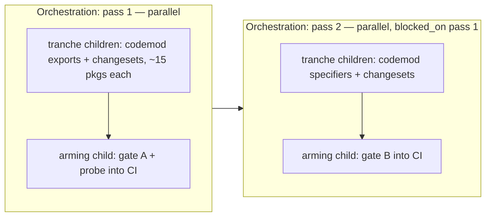

# Extensionless `exports` Subpaths: Additive Two-Pass Migration

| | |
|---|---|
| **Created** | 2026-07-10 |
| **Author** | Kris Kowal (prompted) |
| **Status** | Not Started |

## What is the Problem Being Solved?

Consumers of Endo packages must today spell most subpath imports with the
`.js` extension — `import '@endo/marshal/tools/marshal-test-data.js'` — because
each package's `package.json` `exports` map keys its subpaths as `./foo.js`.
The maintainer directive (2026-07-10) is to let consumers write
`import '@endo/pkg/foo'` as well, **additively, in two passes, with zero
compatibility break in the first pass**:

1. **Pass 1** adds an extensionless sibling key for every `.js` exports key,
   keeping the `.js` key. Purely additive; ships as a **minor** bump per
   package.
2. **Pass 2** rewrites the monorepo's own eligible import specifiers to the
   extensionless form. It lands only after pass 1 is fully merged and
   verified.

Eventual *removal* of the `.js` keys on a future major bump is a separate,
lower-priority plan (`release-automation-major-bump-exports-trigger`,
design to be filed); it becomes meaningful only after pass 1 lands the dual
keys.

## Survey (ground truth on `llm`, 2026-07-10)

- 98 workspaces; all carry an `exports` map except `@endo/eslint-plugin` and
  `familiar` (both out of scope — nothing to alias).
- **235 explicit `.js` subpath keys** across the maps (pass-1 population).
- **43 subpath keys are already extensionless** (`@endo/cancel/abort`,
  `@endo/platform/fs`, `ses/lockdown`, the `@endo/ocapn` component subpaths,
  …), so the target shape is already idiomatic here. **No package has both
  `./foo.js` and `./foo` today** — zero collisions for pass 1 to trip on.
- **4 wildcard (pattern) keys**: `ses`, `@endo/eventual-send`, and
  `@endo/hex` expose `./src/*` passthroughs gated behind per-package test
  conditions (`test-endo-ses` etc.); `@endo/platform` exposes a public
  `./fs/extended/*` passthrough. All four are excluded (Design Decision 3).
- 4 `.css` keys (`space-*` packages) and every `./package.json` key: not
  `.js`, untouched.
- 70 subpath values are conditional objects; 60 of those carry a `types`
  condition. The rest are plain string targets.
- **~992 cross-package `.js` subpath specifier occurrences** in
  `packages/**` source (`import … from`, side-effect `import`, dynamic
  `import()`). Of these, **967 name an explicit exports key** (pass-2
  eligible), **22 resolve via the wildcard passthroughs** (stay `.js`), and
  3 are anomalies that match no key at all (`ses/console-tools.js`,
  `@endo/ocapn/syrup/{encode,decode}.js`) — the pass-2 codemod skips and
  reports these for human follow-up.
- TypeScript is configured with `"moduleResolution": "NodeNext"`
  (`tsconfig-build-options.json`), so `tsc` resolves these same maps and
  validates both key forms.

## Design

### Pass 1 — additive extensionless keys (no compat break)

For every **explicit, non-pattern** exports key of the form `./K.js`, insert
a sibling key `./K` **immediately after it**, whose value is a **deep copy of
the `.js` key's value, byte-for-byte identical**:

```jsonc
"exports": {
  "./iterate-reader.js": { "types": "./iterate-reader.d.ts", "default": "./iterate-reader.js" },
  "./iterate-reader":    { "types": "./iterate-reader.d.ts", "default": "./iterate-reader.js" }
}
```

Excluded keys: `.` (already extensionless), `./package.json`, keys with
another extension (`.css`), and pattern keys containing `*`. Conditional
object values (including custom conditions such as `xs`, `hermes`,
`ses-ava:endo`, `test-endo-*`) are copied wholesale, so every condition —
`types` included — behaves identically under either key.

Correctness rests on Node's resolver treating non-pattern keys as **exact
match** (Node.js docs, *Modules: Packages* § Subpath exports, and the ESM
resolution algorithm's `PACKAGE_EXPORTS_RESOLVE` /
`PACKAGE_IMPORTS_EXPORTS_RESOLVE`, which try an exact key before pattern
matching): adding a new exact key cannot change how any existing specifier
resolves. Key order is irrelevant to exact matching; adjacency is chosen
only for diff readability.

Collision rule: if `./K` already exists with a deep-equal value, skip
(idempotence); if it exists with a **different** value, hard-error and leave
the package to human review. The survey found zero such collisions.

**Versioning:** each touched package gets a `minor` changeset whose body
carries the standing note:

> Adds extensionless `exports` subpath aliases (e.g. `@endo/pkg/foo`
> alongside `@endo/pkg/foo.js`). The `.js`-suffixed `exports` keys are
> retained for compatibility; we reserve the right to remove them in the
> next major version.

### Pass 2 — specifier rewrite (eligibility delineation)

Node ESM `exports` maps govern only **bare-specifier** imports of a package
by name (including a package's self-reference by its own name).
**Intra-package relative imports** (`import './foo.js'`) resolve on the
filesystem, where Node ESM requires the extension — they are **never
rewritten**. The eligibility rule makes this mechanical:

Rewrite specifier `<pkg>/K.js` → `<pkg>/K` **iff**:

1. the specifier is a bare specifier whose `<pkg>` prefix names a workspace
   package (`@endo/*` or `ses`) — specifiers starting with `.`, `/`, `#`, or
   a URL scheme are never candidates; and
2. `./K` is an **explicit key** of that package's post-pass-1 exports map.

This single lookup excludes, by construction: all relative and absolute
imports (gate C below holds trivially), the wildcard-resolved deep imports
(`ses/src/commons.js`, `@endo/platform/fs/extended/*`, the `test-endo-*`
escapes — 22 sites keep `.js`), packages without exports maps, and the 3
anomalous specifiers. Self-name imports inside a package are eligible (they
resolve through the same exports map).

Rewritten forms, all restricted to literal string specifiers: static
`import`/`export … from`, side-effect `import '…'`, dynamic `import('…')`,
and JSDoc type positions (`@import { … } from '…'` and inline
`import('…')` types), since `tsc` under NodeNext resolves those through the
same exports maps. Excluded surfaces: `node_modules`, `dist`/build outputs,
test **fixtures** (compartment-mapper and bundler fixtures encode resolution
behavior on purpose), and markdown/docs (cosmetic; follow-up sweep to be
filed).

**Versioning:** pass-2 changesets are `patch` per touched package, noting
the requirement on the pass-1 minors (changesets' dependency bumps handle
the ranges; the workspace releases in lockstep).

### `types` condition parity

No consumer tsconfig changes are needed, for two structural reasons:

- **Object values:** the copied value carries the same `types` condition, so
  `import '@endo/exo-stream/iterate-reader'` type-resolves exactly as the
  `.js` form does.
- **String values:** under `moduleResolution: node16`/`nodenext`/`bundler`,
  TypeScript resolves declarations for an exports **target** by extension
  substitution on the resolved file (target `./foo.js` → `./foo.d.ts`;
  TypeScript *Modules Reference*, § `package.json` `exports`). Declaration
  lookup follows the **target**, not the key, so an extensionless key
  mapped to the same `.js` target yields the identical `.d.ts`.

The repo's own `yarn build:types` (NodeNext) exercises both properties on
every package.

### Compartment-mapper and non-Node resolvers

Endo bundles and archives resolve `exports` through
`inferExportsEntries`/`interpretExports` in
`@endo/compartment-mapper/src/infer-exports.js`, not through Node. That
interpreter treats each non-pattern key as a literal name→target entry and
supports conditions and wildcards, so extensionless keys are supported by
construction; module-type inference keys off the **target** extension
(`.js`), not the specifier, so language classification is unchanged. The
verification suite still pins this with an explicit probe (below) rather
than trusting inspection. The xs and hermes lanes consume `ses` via its
existing conditional entries, which pass 1 copies untouched.

### Codemods (idempotent, verifiable)

Two scripts under `scripts/`, each with a `--check` gate mode and an
optional package-name filter for tranche runs:

- **`scripts/codemod-exports-extensionless.mjs [--check] [pkg…]`** (pass 1).
  Computes and inserts the sibling keys per the pass-1 rule, preserving the
  file's 2-space JSON formatting (prettier-compatible). Re-running is a
  no-op. `--check` is **gate A**: fail listing every explicit `.js` key
  lacking a deep-equal extensionless sibling — this keeps future packages
  and subpaths honest once wired into `yarn lint`.
- **`scripts/codemod-extensionless-specifiers.mjs [--check] [pkg…]`**
  (pass 2). Builds the eligibility map from all workspace exports, then
  rewrites literal specifiers in `.js`/`.mjs`/`.cjs`/`.ts` sources
  (exclusions per pass-2 rule), reporting skipped anomalies. `--check` is
  **gate B**: no eligible cross-package specifier still carries `.js`.
- **Gate C** — no intra-package relative import stripped — holds by
  construction (only bare specifiers are candidates) and is re-verified by
  the full test suite, since a stripped relative import fails to resolve at
  all under Node ESM.

Each gate is wired into CI (a `lint:exports` script under the root `lint`)
by a dedicated **arming child** at the end of its pass, so partially
migrated states never fail CI mid-pass.

### Verification

After **each** pass, on each tranche PR and on the assembled result:

- `yarn build`, `yarn build:types` (tsc NodeNext over every package),
  `yarn lint`, `yarn test` (all root ava lanes, including the lockdown and
  shims-only configs); the CI xs/hermes/test262 lanes run unchanged — pass 1
  is additive so their inputs are byte-identical except `package.json`.
- **Dual-resolution probe** (new test, lands with pass 1's arming child):
  for a sample of migrated packages, assert
  `import.meta.resolve('@endo/pkg/K') === import.meta.resolve('@endo/pkg/K.js')`,
  and assert a compartment-mapper `importLocation` of a fixture that imports
  one extensionless subpath links successfully.
- Pass 1 is declared compat-safe (unblocking pass 2) only when all tranches
  are merged, gate A is armed and green, and the probe passes.

### Orchestration decomposition

Per the standing multi-part rule, each pass is one **orchestration job**
over parked children; pass 2's orchestration is parked `blocked_on`
pass 1's completion.



- **Pass 1:** ~7 tranche children of ~15 packages each (alphabetical
  grouping is fine; package.json edits and changeset files are disjoint, so
  the children run `--parallel` with `--on-child-failure continue`), then
  the serial arming child. Each child runs the codemod restricted to its
  tranche, adds the changesets, runs the verification suite, and takes its
  PR through the gauntlet against `llm`.
- **Pass 2:** same shape over consuming-package tranches (source edits are
  disjoint per package directory), then its arming child. The rewrite uses
  the merged, post-pass-1 exports maps as its eligibility input.

## Dependencies

| Design | Relationship |
|--------|--------------|
| `release-automation-major-bump-exports-trigger` (to be filed) | Follow-up: flags the `.js`-key removal opportunity on a planned major bump; meaningful only after pass 1 |
| [break-dev-dependency-cycles](break-dev-dependency-cycles.md) | Precedent for tranche-orchestrated monorepo hygiene on `llm` (M2) |

## Design Decisions

1. **Additive sibling keys; both forms retained.** Exact-key matching means
   the new keys cannot perturb existing resolution; removal is deferred to a
   future major (separate plan).
2. **Pass-2 eligibility = exact explicit-key lookup** in the target
   package's exports. One mechanical rule excludes relative imports,
   wildcard escapes, and unexported anomalies, rather than a taxonomy of
   specifier styles.
3. **Wildcard pattern keys are out of scope.** Three of the four are
   condition-gated internal test escapes, not public API. Supporting
   extensionless on a `./src/*` passthrough would require a
   suffix-rewriting pattern pair (`"./src/*.js": "./src/*.js"` plus
   `"./src/*": "./src/*.js"`), changing pattern-precedence behavior for a
   surface whose only consumers are the packages' own tests. The 22
   wildcard-resolved specifier sites simply keep `.js`.
4. **Types parity by construction, not by codemod cleverness:** deep-copy
   the value; string targets get identical declaration lookup because TS
   substitutes extensions on the target, not the key.
5. **Gates ship with the codemods but are armed in CI only by the final
   child of each pass**, so mid-pass CI stays green while post-migration
   drift is permanently prevented.
6. **Docs/markdown specifier sweep deferred** (cosmetic, no resolver reads
   them); follow-up to be filed.

## Known Gaps and TODOs

- [ ] Pass 1: tranche children + arming child (gate A, dual-resolution
      probe) merged on `llm`; every package's changeset carries the standing
      compatibility note.
- [ ] Pass 2: tranche children + arming child (gate B) merged on `llm`;
      the 3 anomalous specifiers dispositioned by a human.
- [ ] File the follow-ups: `release-automation-major-bump-exports-trigger`,
      docs/markdown specifier sweep.

## Open Questions

- Should `@endo/platform`'s public `./fs/extended/*` passthrough gain
  extensionless support via the dual-pattern form described in Design
  Decision 3, or is that surface intended to migrate to explicit keys
  instead?
- Should gate A/B live as an `@endo/eslint-plugin` rule rather than a
  standalone `--check` script, so editors surface violations inline? (The
  script form is assumed; an ESLint port is compatible later.)

## Prompt

> **Repo:** endojs/endo-but-for-bots, base `llm`. Deliverable: a `designs/`
> doc that a follow-up migration executes; the migration itself is expected
> to run as orchestrated per-package tranches, not this job.
>
> Let consumers import a package's subpaths **without the `.js` extension**
> — e.g. `import '@endo/marshal/foo'` instead of
> `import '@endo/marshal/foo.js'` — by exposing extensionless subpath keys
> in each package's `package.json` `exports`. Done **additively, in two
> passes, with zero compatibility break in the first pass** (maintainer
> directive, 2026-07-10). Pass 1: for every existing `exports` subpath key
> ending in `.js`, ADD a sibling extensionless key mapping to the SAME
> target, KEEP the `.js` key; ships as a minor bump per package. Pass 2:
> drop `.js` from the corresponding import specifiers across the monorepo,
> blocked on pass 1. Each affected package's changeset carries a standing
> note: "The `.js`-suffixed `exports` keys are retained for compatibility;
> we reserve the right to remove them in the next major version." The doc
> must resolve: pass-2 specifier eligibility (cross-package bare specifiers
> only; intra-package relative imports keep `.js`), conditional exports /
> `.` / wildcards, `types` condition parity, automated idempotent
> verifiable codemods with lint gates, and full verification after each
> pass; run each pass as an orchestration over packages.
