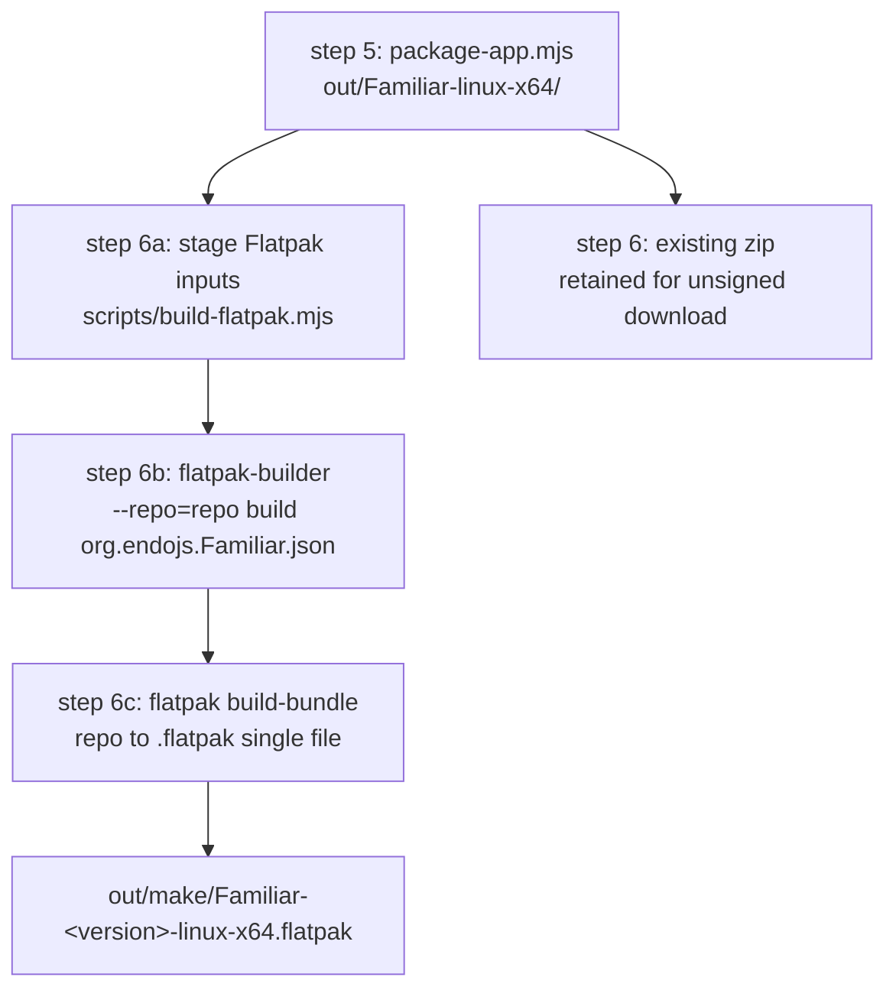

# Familiar Flatpak Packaging Pipeline

| | |
|---|---|
| **Created** | 2026-05-19 |
| **Updated** | 2026-09-04 |
| **Author** | endolinbot (builder dispatch) |
| **Status** | Proposed |
| **Source** | [familiar-release.md](familiar-release.md) § G4. Linux distribution shape (PR [#231](https://github.com/endojs/endo-but-for-bots/pull/231)): "Please dispatch a builder to propose a pipeline for Flatpack. We can defer the other packaging systems." |

## What is the Problem Being Solved?

The Familiar is a desktop Electron shell for Endo Chat.
It bundles the `lal` agent and a self-contained Endo daemon so a user
can hold a persistent conversation with their own LLM provider without
installing any developer tooling.
Its [make-distributables.mjs](../packages/familiar/scripts/make-distributables.mjs)
produces a `.zip` on Linux.
A user who unzips it gets a directory tree that includes an Electron
binary, a Chromium runtime, and `chrome-sandbox`, the last of which
must be `chmod 4755` and chowned to root for Chromium's setuid sandbox
to engage.
A non-developer will not perform that chmod and chown; without it
Electron either refuses to launch or falls back to `--no-sandbox`,
which silently strips a meaningful layer of process isolation from
the daemon's worker tree.

The maintainer's resolution of
[familiar-release.md](familiar-release.md) § G4 (2026-05-19) chose
Flatpak as the single Linux packaging format for MVR (Minimum Viable
Release) followups; AppImage, `.deb`, `.rpm`, and `.tar.gz` are
deferred.
The `G<N>` codes used throughout this document (G2, G3, G4, G5, G6,
G11, G12, G16) reference the correspondingly-numbered decision items in
[familiar-release.md](familiar-release.md); each is a maintainer
resolution the design carries a dependency on.
Flatpak is the right pick because it ships its own setuid-capable
sandbox (`bwrap`, configured by the runtime).
The `chrome-sandbox` chmod story collapses into the runtime's existing
sandbox setup.

This document proposes the pipeline that turns the Familiar's
existing `out/Familiar-linux-x64/` packaged-app directory into an
unsigned `.flatpak` single-file bundle suitable for posting to the
project's GitHub Releases page (per [familiar-release.md](familiar-release.md)
Open Question 1's resolution).
Signing is deferred out of the MVR-followups phase; see § Signing
Posture (Deferred) for the deferral rationale and the interim
unsigned-install story.

The Flatpak install path is materially easier for the same
non-developer than the chmod/chown it removes.
The chmod/chown is a per-file, must-be-root step with no discoverable
prompt and a silent-degradation failure mode (Chromium quietly runs
unsandboxed).
The Flatpak path is the platform's standard install gesture: on a
desktop with GNOME Software or KDE Discover the `.flatpak` double-click
installs through the GUI (see § Signing Posture for the one runtime
prerequisite that path still needs), and even the terminal form is a
single `flatpak install --bundle <file>`.
Flatpak is preinstalled on Fedora and popular immutable distros and is
a one-time `apt install flatpak` elsewhere; that prerequisite (and its
absence as a failure mode) is named explicitly in the end-user install
snippet under § Signing Posture.
`flatpak-builder` is a *build-host* tool, not an end-user requirement:
the end user installs a prebuilt bundle and never runs the builder.

### Where the Familiar's Data Lives

This is the single load-bearing statement of the packaged Familiar's
storage model; every claim about grants, reset gestures, and smoke
steps below derives from it.

**The Flatpak Familiar is its own isolated Endo.**
Its state, cache, CapTP socket, and ephemeral PID files all resolve to
per-app-private locations by default, are shared with nothing on the
host, and none of them needs a `--filesystem` grant.
This falls out of two Flatpak guarantees that hold whenever the
manifest omits `--filesystem=home`:

- Flatpak relocates the sandbox `$HOME` to `~/.var/app/org.endojs.Familiar`.
  `@endo/where`'s `whereEndoState` and `whereEndoCache`
  ([packages/where/index.js](../packages/where/index.js)) read
  `$XDG_STATE_HOME` / `$XDG_CACHE_HOME` and fall back to
  `$HOME/.local/state` / `$HOME/.cache`; because `$HOME` is the per-app
  root, both the env-set and the fallback paths land under
  `~/.var/app/<app-id>/…`, so state and cache are app-private on every
  host with no grant (and deterministically so, whether or not a given
  Flatpak version sets `$XDG_STATE_HOME`).
- Flatpak gives each app a private, writable `$XDG_RUNTIME_DIR` (a
  per-app-instance tmpfs, not the host's `/run/user/<uid>`).
  So `whereEndoSock`'s default `$XDG_RUNTIME_DIR/endo/captp0.sock` and
  `whereEndoEphemeralState`'s `$XDG_RUNTIME_DIR/endo` (the worker PID
  directory `daemon-manager.js` passes to the daemon,
  [daemon-manager.js](../packages/familiar/src/daemon-manager.js)) both
  create directories in that private tmpfs: app-private, ephemeral, and
  needing no grant.

The consequence for the manifest is decisive: adding
`--filesystem=xdg-run/endo`, `xdg-cache/endo`, or `xdg-state/endo`
would be not merely unnecessary but **harmful**, because those grants
map the *host's* directories into the sandbox, sharing the CapTP
socket with any host-run daemon and reintroducing the `EADDRINUSE`
documented in
[packages/familiar/README.md](../packages/familiar/README.md)
§ Unix Socket Leftovers.
The manifest therefore grants none of them, and `launcher.sh` pins
nothing: the defaults are already correct.
The reset gesture is `flatpak uninstall org.endojs.Familiar` plus
`rm -rf ~/.var/app/org.endojs.Familiar` (the ephemeral socket / PID
tmpfs is discarded on exit), and the CI clean-state step is the same
`rm -rf`.

## Status Quo

The Familiar's existing Linux output path is:

- `node scripts/build.mjs` runs the six pipeline steps documented
  in [familiar-release.md](familiar-release.md) Status Quo.
- The fifth step (`@electron/packager`, `step:package`) produces
  `packages/familiar/out/Familiar-linux-x64/` containing the
  Electron-app directory tree.
- The sixth step (`make-distributables.mjs`, `step:make`) currently
  emits `out/make/Familiar-<version>-linux-x64.zip` via the system
  `zip`, reading the step-5 directory.
- The CI surface
  ([`.github/workflows/familiar-release.yml`](../.github/workflows/familiar-release.yml))
  uploads the zip as a workflow artifact and attaches it to a
  draft GitHub Release.

The Flatpak pipeline grafts onto this shape between step 5 and the
GitHub-Release upload.

## Design

### Pipeline Shape



Step 5 (`package-app.mjs`) is the `@electron/packager` step
documented in [familiar-release.md](familiar-release.md) Status Quo;
it produces the packaged-app directory tree under
`out/Familiar-linux-x64/`.
Steps 6a, 6b, and 6c are all driven by a single script
(`scripts/build-flatpak.mjs`); the diagram names the conceptual
phases 6a/6b/6c for readability, and they run inside that one script
rather than as three separate CI steps.
The existing zip step ("step 6" in the diagram) also reads step 5's
directory and is untouched.

The existing `.zip` output stays for the plain-download case; the
Flatpak adds a sandboxed alternative (unsigned in the MVR-followups
phase; see § Signing Posture (Deferred)).
Both ride the same CI artifact list.

### Manifest Shape

The canonical Flatpak manifest is a single JSON file at
`packages/familiar/flatpak/org.endojs.Familiar.json`.
The file is checked in; the build is reproducible from a checkout,
modulo the floating `//24.08` runtime series (see § Runtime Choice).

```json
{
  "app-id": "org.endojs.Familiar",
  "runtime": "org.freedesktop.Platform",
  "runtime-version": "24.08",
  "sdk": "org.freedesktop.Sdk",
  "base": "org.electronjs.Electron2.BaseApp",
  "base-version": "24.08",
  "command": "familiar",
  "separate-locales": false,
  "finish-args": [
    "--share=ipc",
    "--share=network",
    "--socket=fallback-x11",
    "--socket=wayland",
    "--device=dri"
  ],
  "modules": [
    {
      "name": "familiar",
      "buildsystem": "simple",
      "build-commands": [
        "install -d /app/familiar",
        "cp -a app/. /app/familiar/",
        "install -Dm755 launcher.sh /app/bin/familiar",
        "install -Dm644 org.endojs.Familiar.desktop /app/share/applications/org.endojs.Familiar.desktop",
        "install -Dm644 org.endojs.Familiar.metainfo.xml /app/share/metainfo/org.endojs.Familiar.metainfo.xml",
        "for size in 16 32 64 128 256 512 1024; do install -Dm644 icons/icon-${size}.png /app/share/icons/hicolor/${size}x${size}/apps/org.endojs.Familiar.png; done"
      ],
      "sources": [
        { "type": "dir", "path": "build" }
      ]
    }
  ]
}
```

#### Runtime Choice: `org.freedesktop.Platform//24.08`

The freedesktop runtime is the lowest-common-denominator runtime that
ships glibc, GTK pieces Electron expects, and the audio / video
libraries Chromium needs.
The 24.08 series is the current stable runtime
([Flathub runtimes page](https://docs.flatpak.org/en/latest/available-runtimes.html)).
Note that `//24.08` is a floating *series* branch: freedesktop
continuously updates it upstream, so a checkout pins the series, not an
exact commit.
That is weaker than the commit-level external-pin discipline
[familiar-release.md](familiar-release.md) § G5 invokes for the bundled
Node binary; § Validation Gates records the residual drift risk, and a
future hardening pass can pin the runtime commit at CI install time if
reproducibility demands it.
The runtime-version is bumped in lockstep with the bundled Node LTS
bump; a future runtime move (24.08 to 25.x) is a builder pass that
revisits both the Node pin (G5) and this manifest.

#### Base: `org.electronjs.Electron2.BaseApp//24.08`

The Electron base app is published on Flathub at
`org.electronjs.Electron2.BaseApp` and pre-installs the Chromium-side
shared libraries (NSS, libdrm, libnotify, libsecret) that Electron
links against and the freedesktop runtime does not already carry.
Using the base shrinks the manifest from ~30 module entries
(each library built from source) to one `base` line.
The Electron base app's setup also takes care of the `chrome-sandbox`
setuid concern by mapping in `bwrap` from the runtime, so the
`chmod 4755 chrome-sandbox` step the unpacked `.zip` requires becomes
moot inside the Flatpak.

#### Finish-Args: Capability Surface Justification

The `finish-args` block is the Flatpak sandbox's hole-poking list.
Each line below is justified against a specific runtime requirement
that the Familiar's existing implementation already exercises:

| Permission | Rationale |
|---|---|
| `--share=ipc` | Chromium under X11 uses the MIT-SHM extension to share pixmap memory with the host X server; the shared IPC namespace is required for that shared-memory path under `--socket=fallback-x11`. Without it Chromium's X11 renderer path degrades or errors. |
| `--share=network` | The bundled `lal` agent issues outbound `fetch` requests against `https://api.anthropic.com/`, `https://api.openai.com/`, and a user-configured LLM endpoint ([familiar-release.md](familiar-release.md) § G12). This grant also removes the sandbox's loopback isolation, so the gateway's `127.0.0.1:8920` bind ([daemon-manager.js](../packages/familiar/src/daemon-manager.js)) sits on the host's loopback alongside any host Endo daemon; that is a widening the grant carries, not only the outbound LLM fetch it enables. |
| `--socket=fallback-x11` | X11 fallback when the host is on Xorg (older distros, NVIDIA-on-Wayland workarounds). |
| `--socket=wayland` | Wayland is the default on modern distros (Fedora, recent Ubuntu, Pop!_OS). |
| `--device=dri` | GPU acceleration for the Chromium renderer; without it Electron falls back to swrast and the chat UI's text rendering becomes janky. |

The Endo state, cache, CapTP socket, and PID paths need **no**
`--filesystem` grant: per § Where the Familiar's Data Lives, Flatpak's
per-app `$HOME` and per-app `$XDG_RUNTIME_DIR` make all of them
app-private by default.
A `--filesystem=xdg-state/endo` grant would in any case be inert
(Flatpak's documented `--filesystem=` token list has no `xdg-state`),
and `--filesystem=xdg-cache/endo` / `xdg-run/endo` would be worse than
inert: they map the *host's* directories in, sharing the CapTP socket
with a host daemon.
Dropping them is both correct and a smaller review-gate surface.

Each entry above corresponds to a runtime requirement the Familiar's
existing implementation exercises today.
Speculative, not-yet-wired surfaces are deliberately excluded and are
granted in the followup PR that wires the feature they support, when the
real requirement is known: notification sound (`--socket=pulseaudio`),
toast notifications (`--talk-name=org.freedesktop.Notifications`), and
the deferred migration of the LLM auth token to the host's libsecret
(`--talk-name=org.freedesktop.secrets`, a followup to
[familiar-release.md](familiar-release.md) § G11).

#### What the Manifest Excludes

A Flatpak with `--filesystem=host` or `--filesystem=home` is
**explicitly not** what we ship.
The narrower set above is the review-gate Flathub uses; submitting
against the broader set would delay listing and weaken the security
story.
The specific exclusions:

- No `--talk-name=org.freedesktop.Flatpak` (no auto-update from
  inside the sandbox).
- No `--filesystem=home` (the daemon reads and writes only under the
  per-app sandbox root; see § Where the Familiar's Data Lives).
- No `--device=all` (only DRI for GPU).
- No `--persist=.` (see the § Design Decisions rationale).

### Launcher and Metadata Files

`packages/familiar/flatpak/` holds the small companion files referenced
by the manifest:

```
packages/familiar/flatpak/
  org.endojs.Familiar.json         # the manifest above
  launcher.sh                      # /app/bin/familiar wrapper
  org.endojs.Familiar.desktop      # XDG desktop entry
  org.endojs.Familiar.metainfo.xml # AppStream metadata for Flathub
```

`launcher.sh` (executable, installed to `/app/bin/familiar`):

```sh
#!/bin/sh
# Wrapper for the Familiar Electron app under Flatpak.
#
# No Endo-path pinning is needed: under Flatpak's per-app $HOME and
# per-app $XDG_RUNTIME_DIR, the daemon's state, cache, CapTP socket,
# and PID files all resolve to app-private locations with no
# --filesystem grant (see the design's "Where the Familiar's Data
# Lives"). Pinning ENDO_SOCK or the XDG roots would only risk
# diverging from those already-correct defaults.
#
# zypak intercepts Chromium's namespace-sandbox calls and routes them
# through Flatpak's bwrap, which is the host's setuid binary.
exec zypak-wrapper /app/familiar/Familiar "$@"
```

The launcher's `/app/familiar/Familiar` binary name depends on the
`@electron/packager` `executableName` option set in
[scripts/package-app.mjs](../packages/familiar/scripts/package-app.mjs)
(capital F, matching `Familiar`).
A future packager bump or a change to that option requires a parallel
update to this launcher path.

`zypak-wrapper` ships with the `org.electronjs.Electron2.BaseApp`
base; the wrapper is the standard Flathub idiom for Electron apps.
The wrapper replaces the `chrome-sandbox` chmod story entirely.

`org.endojs.Familiar.desktop`:

```ini
[Desktop Entry]
Name=Familiar
GenericName=Endo Familiar
Comment=Local-first chat with the lal agent
Exec=familiar
Icon=org.endojs.Familiar
Type=Application
StartupNotify=true
StartupWMClass=Familiar
Categories=Network;Chat;Development;
Keywords=endo;lal;llm;chat;agent;
```

The `Exec` line carries no `%U`/`%f` field: the Familiar registers no
URI scheme or MIME type today, and `launcher.sh` forwards no documented
arg surface into Electron.
A future PR that registers a `x-scheme-handler=` adds the matching
`MimeType=` and the `%U` field together.

`org.endojs.Familiar.metainfo.xml` (AppStream metadata, required by
Flathub for listing; the schema is documented at
[appstream.org](https://www.freedesktop.org/software/appstream/docs/)).
The `<releases>` entry is **not** hand-maintained: `build-flatpak.mjs`
stamps `version` and `date` from `package.json` at stage time (see
§ Build Script), so the store page never drifts from the bundle
filename.
The checked-in file carries a placeholder the stage step overwrites:

```xml
<?xml version="1.0" encoding="UTF-8"?>
<component type="desktop-application">
  <id>org.endojs.Familiar</id>
  <name>Familiar</name>
  <summary>Local-first chat with the lal agent</summary>
  <metadata_license>CC0-1.0</metadata_license>
  <project_license>Apache-2.0</project_license>
  <developer id="org.endojs">
    <name>Endo contributors</name>
  </developer>
  <description>
    <p>
      The Familiar is a desktop Electron shell for Endo Chat. It bundles
      the lal agent and a self-contained Endo daemon so a user can hold
      a persistent conversation with their own LLM provider without
      installing any developer tooling.
    </p>
  </description>
  <launchable type="desktop-id">org.endojs.Familiar.desktop</launchable>
  <url type="homepage">https://github.com/endojs/endo-but-for-bots</url>
  <url type="bugtracker">https://github.com/endojs/endo-but-for-bots/issues</url>
  <content_rating type="oars-1.1" />
  <!-- <releases> is generated from package.json at stage time. -->
</component>
```

### Build Script: `scripts/build-flatpak.mjs`

A new script under `packages/familiar/scripts/` orchestrates the
Flatpak build.
It is invoked after `package-app.mjs` (step 5) on Linux and produces
a single `.flatpak` file under `out/make/`.

```js
// scripts/build-flatpak.mjs
/* global process */

import { execSync } from 'node:child_process';
import fs from 'node:fs';
import path from 'node:path';
import { fileURLToPath } from 'node:url';

const dirname = path.dirname(fileURLToPath(import.meta.url));
const familiarDir = path.resolve(dirname, '..');

if (process.platform !== 'linux') {
  console.log('Flatpak build only runs on Linux; skipping.');
  process.exit(0);
}

const arch = process.arch === 'arm64' ? 'aarch64' : 'x86_64';
const target = process.arch === 'arm64' ? 'linux-arm64' : 'linux-x64';

const appDir = path.join(familiarDir, `out/Familiar-${target}`);
if (!fs.existsSync(appDir)) {
  console.error(`Packaged app not found at ${appDir}.`);
  console.error('Run the package step (step:package) first.');
  process.exit(1);
}

const flatpakDir = path.join(familiarDir, 'flatpak');
const stageDir = path.join(familiarDir, 'out/flatpak-stage');
const buildDir = path.join(familiarDir, 'out/flatpak-build');
const repoDir = path.join(familiarDir, 'out/flatpak-repo');
const makeDir = path.join(familiarDir, 'out/make');

fs.rmSync(stageDir, { recursive: true, force: true });
fs.rmSync(buildDir, { recursive: true, force: true });
fs.rmSync(repoDir, { recursive: true, force: true });
fs.mkdirSync(makeDir, { recursive: true });

// Stage the manifest's source dir under a fixed `app/` name so the
// manifest stays arch-agnostic: --arch= is the only arch-carrying
// value, and the staged layout never names the target triple.
fs.mkdirSync(path.join(stageDir, 'build'), { recursive: true });
fs.cpSync(appDir, path.join(stageDir, 'build/app'), { recursive: true });
fs.cpSync(
  path.join(flatpakDir, 'launcher.sh'),
  path.join(stageDir, 'build/launcher.sh'),
);
fs.chmodSync(path.join(stageDir, 'build/launcher.sh'), 0o755);
fs.cpSync(
  path.join(flatpakDir, 'org.endojs.Familiar.desktop'),
  path.join(stageDir, 'build/org.endojs.Familiar.desktop'),
);
fs.mkdirSync(path.join(stageDir, 'build/icons'), { recursive: true });
for (const size of [16, 32, 64, 128, 256, 512, 1024]) {
  fs.cpSync(
    path.join(familiarDir, 'assets', `icon-${size}.png`),
    path.join(stageDir, `build/icons/icon-${size}.png`),
  );
}
fs.cpSync(
  path.join(flatpakDir, 'org.endojs.Familiar.json'),
  path.join(stageDir, 'org.endojs.Familiar.json'),
);

const pkg = JSON.parse(
  fs.readFileSync(path.join(familiarDir, 'package.json'), 'utf8'),
);
const version = pkg.version || '0.0.0';

// Generate the AppStream <releases> entry from package.json so the
// store page never drifts from the bundle filename (single source of
// truth for the user-visible version).
const metainfoSrc = fs.readFileSync(
  path.join(flatpakDir, 'org.endojs.Familiar.metainfo.xml'),
  'utf8',
);
const today = new Date().toISOString().slice(0, 10);
const releases = `  <releases>\n    <release version="${version}" date="${today}" />\n  </releases>\n`;
const metainfo = metainfoSrc.replace(
  /\s*<!-- <releases> is generated from package\.json at stage time\. -->\s*/,
  `\n${releases}`,
);
fs.writeFileSync(
  path.join(stageDir, 'build/org.endojs.Familiar.metainfo.xml'),
  metainfo,
);

// 1. flatpak-builder produces the build tree and exports to a local
//    repo. --runtime-repo embeds the Flathub remote in the exported
//    ref so `flatpak install --bundle` can resolve the runtime / SDK /
//    Electron base app on a Flathub-less host without a manual
//    `flatpak remote-add`.
execSync(
  `flatpak-builder --force-clean --repo=${JSON.stringify(repoDir)} --arch=${arch} ${JSON.stringify(buildDir)} ${JSON.stringify('org.endojs.Familiar.json')}`,
  { stdio: 'inherit', cwd: stageDir },
);

// 2. flatpak build-bundle collapses the repo into a single .flatpak,
//    carrying the runtime remote so the bundle is self-describing.
const bundlePath = path.join(
  makeDir,
  `Familiar-${version}-${target}.flatpak`,
);
execSync(
  `flatpak build-bundle --arch=${arch} --runtime-repo=https://flathub.org/repo/flathub.flatpakrepo ${JSON.stringify(repoDir)} ${JSON.stringify(bundlePath)} org.endojs.Familiar`,
  { stdio: 'inherit', cwd: stageDir },
);

console.log(`Created: out/make/${path.basename(bundlePath)}`);
```

The script is a standalone `step:build-flatpak` npm-script that runs
as its own CI step after the existing `make` step (see § Pipeline
Shape and § CI Workflow Integration), branching independently off the
step-5 packaged-app directory rather than being called from inside
`make-distributables.mjs`; the existing zip emission in `make` is
untouched.
Adding the script to `package.json`:

```json
"step:build-flatpak": "node scripts/build-flatpak.mjs",
```

### CI Workflow Integration

`familiar-release.yml`'s `make` job runs on `ubuntu-latest` for the
Linux target.

**Precondition: the `make` job must package the app first.**
Both `step:make` and the new Flatpak step read
`out/Familiar-<target>/`, which `package-app.mjs` (`step:package`)
produces.
The current `make` job runs download-node -> prepare-package ->
`step:make` and does **not** invoke `step:package`
([familiar-release.yml](../.github/workflows/familiar-release.yml) make
job), so `out/Familiar-linux-x64/` is not produced there and both
`step:make` and the Flatpak step would exit 1 on the missing directory.
This design therefore adds an explicit `Package app` step ahead of both,
which the existing zip path needs as much as the Flatpak path does:

```yaml
- name: Package app
  run: yarn workspace @endo/familiar step:package
```

The Flatpak steps then graft onto the same job after `step:make`:

```yaml
- name: Install Flatpak toolchain
  if: matrix.target-os == 'linux'
  run: |
    sudo apt-get update
    sudo apt-get install -y flatpak flatpak-builder
    flatpak remote-add --if-not-exists --user flathub \
      https://flathub.org/repo/flathub.flatpakrepo
    flatpak install --user --noninteractive flathub \
      org.freedesktop.Platform//24.08 \
      org.freedesktop.Sdk//24.08 \
      org.electronjs.Electron2.BaseApp//24.08

- name: Build Flatpak bundle
  # Release-gating policy (see § Release-Blocking Policy): NO
  # continue-on-error here is intentional. A Flatpak build failure
  # must fail the Linux `make` matrix entry. Do not add continue-on-error
  # to silence a flaky flatpak-builder run without revisiting that policy.
  if: matrix.target-os == 'linux'
  run: yarn workspace @endo/familiar step:build-flatpak

# The metadata-validation and sandbox-engagement gates named in
# § Validation Gates and § Release-Blocking Policy run as their own
# steps here so a failure points at the file that needs the fix and,
# like the build step, blocks the make job (no continue-on-error).
- name: Validate Flatpak metadata
  if: matrix.target-os == 'linux'
  working-directory: packages/familiar/flatpak
  run: |
    appstreamcli validate org.endojs.Familiar.metainfo.xml
    desktop-file-validate org.endojs.Familiar.desktop

- name: Assert sandbox engagement (headless smoke)
  if: matrix.target-os == 'linux'
  run: |
    flatpak install --user --noninteractive --bundle \
      packages/familiar/out/make/*.flatpak
    packages/familiar/flatpak/assert-sandbox.sh
```

The existing `Upload make output` step already uploads the whole
`out/make/` directory (including the `.flatpak`) as the
`familiar-linux-x64` artifact, so no dedicated Flatpak-upload step is
added: a second `Upload Flatpak bundle` step would re-upload the same
file and, under the `release` job's `pattern: familiar-*` glob, attach
one asset name twice.

The `if-not-exists` guard on the remote add keeps the step
idempotent if the runner image already has Flathub registered.

The `release` job (which gathers all the `familiar-*` artifacts and
attaches them to a GitHub Release) needs no change: the existing
download step uses `actions/download-artifact` with `pattern: familiar-*`,
and the `.flatpak` rides inside the already-matched `familiar-linux-x64`
artifact.

### Signing Posture (Deferred)

Flatpak supports OpenPGP-signed repos via `flatpak build-sign` and
`flatpak build-update-repo --gpg-sign=<key>`.
The signed-repo route is the right shape if the project ever hosts
its own update repo (an "endojs Flatpak channel" parallel to a
Flathub listing).

For MVR followups, the `.flatpak` single-file bundle is the artifact,
and it is **unsigned**.
An unsigned bundle carries no signature and no imported public key: what
`flatpak install --bundle` verifies is the bundle's internal ostree
checksums (the payload against its own manifest, i.e. that the download
is not corrupt), **not** its provenance.
Provenance verification is what signing adds, and it is deferred.
The signing-key story therefore parallels
[familiar-release.md](familiar-release.md) § G2 / § G3: it stays out of
MVR, gets a separate tracking issue for the key-generation and
key-distribution workflow, and lands when the maintainer is ready to
pursue it.

In the unsigned-bundle interim, the README documents that the
end-user installs via:

```sh
# Prerequisite 1: Flatpak itself. Preinstalled on Fedora and popular
# immutable distros; a one-time install elsewhere. If `flatpak` is
# absent the commands below fail with "command not found". This is the
# one prerequisite that replaces the per-file `chmod 4755 chrome-sandbox`
# + chown-to-root the .zip required.
sudo apt install flatpak        # Debian/Ubuntu; already present on Fedora

# Prerequisite 2 (only on a Flathub-less host): register the Flathub
# remote so the runtime, SDK, and Electron base app resolve. The bundle
# embeds this remote (--runtime-repo, see build script), so on a host
# that already has Flathub, or when GNOME Software / KDE Discover
# handles the install, this line is unnecessary.
flatpak remote-add --if-not-exists --user flathub \
  https://flathub.org/repo/flathub.flatpakrepo

# Install the bundle and launch.
flatpak install --user --bundle Familiar-0.1.0-linux-x64.flatpak
flatpak run org.endojs.Familiar

# Uninstall and remove all per-app state:
flatpak uninstall org.endojs.Familiar
rm -rf ~/.var/app/org.endojs.Familiar
```

On a desktop with GNOME Software or KDE Discover the end user can
instead double-click the `.flatpak` and install through the GUI.
Because the bundle carries its runtime remote, that GUI path resolves
the runtime dependencies without a terminal.
The one-time `flatpak remote-add` above is only needed for the
terminal path on a host that has never seen Flathub.

### Flathub Listing (Deferred)

Posting to Flathub is the right channel for non-developer Linux
users; once the manifest is settled and the icon / AppStream
metadata pass `appstreamcli validate` and `flatpak run
org.flatpak.Builder//stable` cleanly, the project submits to
`flathub/flathub` per the Flathub submission guide.
The submission process is a separate followup; for the MVR-followup
phase, the `.flatpak` bundle attached to the GitHub Release is the
delivery channel.

## Testing

### Local Build (Developer Host on Linux)

```sh
# Prerequisites (Ubuntu 24.04, Fedora 40+):
sudo apt install flatpak flatpak-builder
# or: sudo dnf install flatpak flatpak-builder

flatpak remote-add --if-not-exists --user flathub \
  https://flathub.org/repo/flathub.flatpakrepo
flatpak install --user --noninteractive flathub \
  org.freedesktop.Platform//24.08 \
  org.freedesktop.Sdk//24.08 \
  org.electronjs.Electron2.BaseApp//24.08

# Build and package the Electron app first, then the Flatpak.
cd packages/familiar
yarn build:package
yarn step:build-flatpak

# Install and run.
flatpak install --user --bundle \
  out/make/Familiar-0.1.0-linux-x64.flatpak
flatpak run org.endojs.Familiar
```

The launch's smoke pass checks that the chat window opens, the user
fills the LLM-provider form, the daemon binds its CapTP socket in the
app-private `$XDG_RUNTIME_DIR/endo/` and writes its state under the
app-private `$HOME/.local/state/endo/` (both per-app by default; see
§ Where the Familiar's Data Lives), and a message exchange round-trips.

#### Sandbox-Engagement Assertion

A bundle that silently falls back to `--no-sandbox` (the exact failure
mode this design exists to prevent) still opens a window and exchanges a
message, so the launch smoke alone cannot catch it.
A machine-wide `pgrep -af 'bwrap'` cannot catch it either: every
`flatpak run` establishes an outer `bwrap` regardless of whether
Chromium's inner renderer sandbox engaged, and the CI job's own
`flatpak install` spawns more, so that check passes unconditionally.
The gate must instead be scoped to the Familiar's own process tree and
must distinguish an engaged renderer sandbox from the `--no-sandbox`
fallback.
The smoke ships an assertion script,
`packages/familiar/flatpak/assert-sandbox.sh`:

```sh
#!/bin/sh
# Assert the Familiar's Chromium renderer is actually sandboxed, not
# running under a silent --no-sandbox fallback. Scoped strictly to the
# Familiar's own process tree; a machine-wide bwrap match cannot fail.
set -eu

familiar_pid="$(pgrep -f '/app/familiar/Familiar' | head -n1 || true)"
[ -n "$familiar_pid" ] || { echo 'FAIL: Familiar process not found' >&2; exit 1; }
pgid="$(ps -o pgid= -p "$familiar_pid" | tr -d ' ')"
tree_pids="$(pgrep -g "$pgid" || true)"

# Signal 1: no process in the Familiar's tree carries --no-sandbox,
# the exact fallback flag this design exists to prevent.
for pid in $tree_pids; do
  if tr '\0' ' ' < "/proc/$pid/cmdline" 2>/dev/null | grep -q -- '--no-sandbox'; then
    echo 'FAIL: a Familiar Chromium child launched with --no-sandbox' >&2
    exit 1
  fi
done

# Signal 2: the renderer runs in a user namespace distinct from the
# broker. zypak routes Chromium's namespace sandbox through bwrap, so an
# engaged sandbox re-namespaces each child; --no-sandbox does not.
renderer_pid=''
for pid in $tree_pids; do
  if tr '\0' ' ' < "/proc/$pid/cmdline" 2>/dev/null | grep -q -- '--type=renderer'; then
    renderer_pid="$pid"
    break
  fi
done
[ -n "$renderer_pid" ] || { echo 'FAIL: no renderer in the Familiar tree' >&2; exit 1; }
if [ "$(readlink "/proc/$renderer_pid/ns/user")" = "$(readlink "/proc/$familiar_pid/ns/user")" ]; then
  echo 'FAIL: renderer shares the broker user namespace (unsandboxed)' >&2
  exit 1
fi
echo 'PASS: Familiar renderer is sandboxed (distinct userns, no --no-sandbox)'
```

If either signal fails the smoke fails closed and the bundle does not
promote to release-eligible.

### CI Smoke (Matches [familiar-release.md](familiar-release.md) § G16)

The G16 smoke test (build the app, launch it under a clean state
directory, exercise the form, observe the Primer tree (the CAS-migrated
starter file set that `familiar-release.md` names) appearing in the
host namespace) ports to the Flatpak target with one change: the clean
state directory step is `rm -rf ~/.var/app/org.endojs.Familiar` rather
than `rm -rf ~/.local/state/endo/`, because all of the Familiar's state
is app-private under `~/.var/app/<app-id>/` per § Where the Familiar's
Data Lives.

A Linux runner with `xvfb-run` (Electron under headless X11) can
host the same test the macOS G16 smoke runs.
Under the app's provider form, "steady state" for the assertion is the
renderer process being up with the chat window loaded; the smoke waits
for that before running `assert-sandbox.sh`.

### Validation Gates the Manifest Itself Must Pass

Before the Flatpak workflow promotes to `release`-eligible, the
build job runs:

- `flatpak-builder --force-clean --repo=... ...` (the build itself).
- `appstreamcli validate org.endojs.Familiar.metainfo.xml` (catches
  AppStream schema drift before it reaches Flathub review).
- `desktop-file-validate org.endojs.Familiar.desktop` (XDG
  desktop-entry validation).
- `assert-sandbox.sh` under a headless launch (the sandbox-engagement
  gate above).

Each is a separate CI step so a failure points at the file that
needs the fix.
None of these gates catches a mid-series `//24.08` runtime drift
(§ Runtime Choice); that residual is accepted for the MVR-followups
phase and revisited if a drift ever breaks a build.

### Release-Blocking Policy for Flatpak Build Failure

The Flatpak build is additive to the existing `.zip` output; the
two artifacts share the `make` matrix entry for Linux but are
produced by separate steps.
The policy for a build that emits the zip but not the Flatpak
(`flatpak-builder` fails, an `appstreamcli` or `desktop-file-validate`
gate fails, the sandbox-engagement assertion fails):

- **The Linux `make` matrix entry fails.** The Linux Flatpak failure is
  treated identically to a Linux zip failure: the entry's step exits
  non-zero and the `release` job (which `needs: make`) does not run. The
  reasoning is that a Linux release that ships only the zip silently
  regresses the sandbox story this design exists to fix; shipping
  zip-only is worse than shipping nothing.

- **Blast radius, and the third-party dependency it introduces.**
  Because `release` needs the whole `make` job, a red Linux entry blocks
  every platform's release, macOS included, even though the failure is
  Linux-only. The Flatpak build also reaches Flathub at build time
  (`flatpak remote-add` + multi-GB runtime installs), so a Flathub
  outage or a `24.08` EOL can turn a green codebase red. Two mitigations
  are in scope for the implementation PR and called out here so the
  policy names its own cost: (a) cache/pin the Flathub runtime install so
  a CDN blip does not fail the build, and (b) if cross-platform coupling
  proves painful, gate only the Linux artifact rather than the whole
  release job. The MVR-followups default is the simple whole-job gate;
  (a) and (b) are the escape hatches if it bites.

This whole-job gate is carried by the `make` job's default
fail-on-step semantics: the Flatpak steps run without
`continue-on-error: true`.
Because that carrier is the *absence* of a flag, an explicit comment
marks it as deliberate at the CI step (see § CI Workflow Integration,
the `Build Flatpak bundle` step) so a later editor cannot silence a
flaky `flatpak-builder` run with a one-line `continue-on-error: true`
addition without recognizing they are inverting this release-gating
policy.

## Dependencies

| Design | Relationship |
|---|---|
| [familiar-release.md](familiar-release.md) | Source (PR #231). This document implements § G4. |
| [familiar-electron-shell.md](familiar-electron-shell.md) | Defines the Electron-main process this manifest packages. |
| [familiar-daemon-bundling.md](familiar-daemon-bundling.md) | The bundled daemon + Node binary this manifest ships. |
| [familiar-bundled-agents.md](familiar-bundled-agents.md) | The `lal` setup and agent bundles this manifest ships. |

Out of scope (intentional):

- AppImage, `.deb`, `.rpm`, `.tar.gz` packaging
  ([familiar-release.md](familiar-release.md) § G4 deferral).
- macOS code signing and notarization (§ G2).
- Windows signing (§ G3).
- Auto-update via `electron-updater` or Flatpak's own update
  channel (§ G6).
- A Flatpak signing key and Flathub listing (followup; see § Signing
  Posture (Deferred) and § Flathub Listing (Deferred)).

## Design Decisions

- **Single-file `.flatpak` bundle over a hosted repo.**
  The bundle is one file that attaches to a GitHub Release; the
  user installs with `flatpak install --bundle <file>`.
  A hosted repo would let the user `flatpak install endojs
  Familiar` and pull updates automatically, but it requires a
  signing key and a public-facing repo URL.
  Per [familiar-release.md](familiar-release.md) § G6, auto-update is
  deferred entirely; the bundle is the right shape for the
  defer-update posture.

- **`org.electronjs.Electron2.BaseApp` over hand-rolling
  Chromium's libraries.**
  The base app is maintained by the Electron-on-Flathub community.
  Its branches track the freedesktop runtime series (which is why the
  manifest pins `base-version: 24.08` in lockstep with the runtime),
  not the Electron major.
  Hand-rolling NSS, libdrm, libnotify, libsecret in module entries
  would add ~30 modules and a multi-hour build time.
  The base-app dependency is the standard Flathub Electron idiom;
  this is the design's own engineering judgment, not a maintainer
  directive (G4's prompt names Flatpak but says nothing about
  BaseApp versus hand-rolled libraries).

- **Manifest in JSON, not YAML.**
  Both forms are valid Flatpak inputs; the JSON form parses with
  `JSON.parse` from the build script and is the form Flathub's
  automation prefers.
  The existing Endo codebase uses JSON for `package.json`,
  `tsconfig.json`, and the deferred Forge config; the manifest
  stays consistent.

- **Narrow `finish-args` (no `--filesystem=home`, no
  `--share=ipc-host`).**
  Each permission is justified per the table above, and the Endo
  state / cache / socket paths need no grant at all (§ Where the
  Familiar's Data Lives).
  Flathub's reviewers will reject a broader permission set without
  a stated need; the narrow set survives review and ships a
  meaningful sandbox to the user.

- **`launcher.sh` wraps `zypak-wrapper`.**
  The Electron-base-app ships `zypak`, which intercepts Chromium's
  `chrome-sandbox` invocations and routes them through Flatpak's
  `bwrap`.
  Without `zypak`, Electron's setuid sandbox conflicts with
  Flatpak's namespace sandbox and either falls back to
  `--no-sandbox` or refuses to launch.

- **No `--persist=.` grant.**
  The daemon's state, cache, CapTP socket, and PID files are already
  app-private under Flatpak's per-app `$HOME`
  (`~/.var/app/org.endojs.Familiar/…`, for state and cache) and per-app
  `$XDG_RUNTIME_DIR` (for the socket and PID files), by default and
  with no grant (§ Where the Familiar's Data Lives), so no persistence
  grant is needed.
  `--persist=.` would additionally bind the sandbox CWD opaquely and
  is neither required nor wanted.

- **Cross-architecture is one matrix axis, not two manifests.**
  `flatpak-builder` takes `--arch=` and the manifest is arch-agnostic:
  the staged source is a fixed `app/` directory (§ Build Script), so
  `--arch=` is the only arch-carrying value.
  The CI matrix can fan out to `x86_64` (today) and `aarch64`
  (when the maintainer turns it on) by adding a matrix entry; no
  per-arch manifest fork is needed.
  Note that `build-flatpak.mjs` derives `--arch=` from `process.arch`
  of the runner, so an `aarch64` bundle requires a natively-arm runner
  (or qemu/binfmt); the CI matrix supplies that runner rather than
  cross-building on x86_64.

## Phased Implementation

| Phase | Deliverable | Effort |
|---|---|---|
| 1 | Land this design (PR opens DRAFT for review). | This PR. |
| 2 | Land the manifest, launcher, desktop file, metainfo xml, `assert-sandbox.sh`, and `build-flatpak.mjs` in `packages/familiar/flatpak/` and `packages/familiar/scripts/`, plus the end-user Flatpak-install section in `packages/familiar/README.md` (the unsigned-install snippet from § Signing Posture; the existing README is dev-Quick-Start-oriented with no end-user-install section today). | Day (builder dispatch). |
| 3 | Wire the CI steps into `familiar-release.yml`'s Linux job, including the missing `Package app` step (§ CI Workflow Integration). | Day (builder dispatch). |
| 4 | Validate the bundle on a clean Linux host (Ubuntu 24.04 or Fedora 40+). Because the `finish-args` are already reasoned against the resolver functions, phase 4 is a confirmation smoke, not a `finish-args` iteration, and it runs before phase 3 wires the release-blocking gate. | Day (manual smoke). |
| 5 | (Followup, separate issue.) Generate a signing key, sign the bundle, and submit to Flathub. | Multi-day, dominated by Flathub review latency. |

Phases 2 to 4 fall under the [familiar-release.md](familiar-release.md)
followups phase budget; phase 5 is post-MVR-followups.

## Known Gaps and TODOs

- [ ] Confirm on a real clean Linux host that Flatpak's per-app `$HOME`
  and `$XDG_RUNTIME_DIR` make the daemon's full write surface
  app-private, i.e. that no daemon path resolves through `whereEndoData`
  / `whereEndoConfig` onto a host root.
  If the implementation-phase smoke surfaces such a path, the fix is
  preferably a `launcher.sh` env pin into the per-app root, not a host
  `--filesystem` grant.
- [ ] Decide the arm64 timeline.
  The manifest supports `--arch=aarch64` on a native-arm runner; the CI
  matrix entry is one line.
  The `org.electronjs.Electron2.BaseApp` ships aarch64 builds.
- [ ] Verify that the bundled Node binary executes inside the
  freedesktop runtime's glibc.
  The `nodejs.org/dist/` glibc-Linux binary is built against an
  older glibc than the runtime ships; forward-compatibility should
  hold, but the validation step is cheap and the failure mode
  (silent crash on daemon spawn) is expensive.
- [ ] Add the Flatpak smoke to the G16 packaged-build smoke test
  scaffold once it exists; today this is a manual step in the
  developer's local-build flow.

## Open Questions

1. **Now that [familiar-release.md](familiar-release.md) has landed on
   `llm`, should this design also land on `llm`?**
   Yes: this PR bases on `llm` to keep the design discoverable in the
   roadmap branch alongside its parent.
   The implementation pass that turns the design into shipping code is a
   separate followup against `master`, per the role's "designs on `llm`,
   implementations on `master`" norm.
   Because `familiar-release.md` is now on `llm` (landed 2026-08-31,
   `37f4bf9565`), this document cites it by repo-relative path rather
   than by PR number, keeping only the single #231 PR reference in the
   § Dependencies Source row.

2. **Are there `finish-args` lines the daemon needs that the
   per-permission table missed?**
   The list is built from reading `daemon-manager.js`, the `lal`
   agent's fetch surface, and `@endo/where`'s resolvers.
   The Endo state / cache / socket / PID paths need no `--filesystem`
   grant at all, because Flatpak's per-app `$HOME` and `$XDG_RUNTIME_DIR`
   make them app-private by default (§ Where the Familiar's Data Lives);
   the surviving grants are the Chromium/X11/network ones in the table.
   The remaining open surfaces are only the *speculative-not-yet-wired*
   ones deferred to their feature followups (pulseaudio, notifications,
   libsecret); the implementation-phase smoke test will surface any
   currently-exercised path the walk still missed, tracked as a TODO.

3. **Flathub listing as a followup or in the same followup sequence
   as the in-tree manifest?**
   The design positions the Flathub submission as a separate
   followup (after the signing-key story is resolved).
   If the maintainer prefers to land Flathub-ready from day one,
   the manifest and AppStream metadata are already shaped for it.

## Prompt

Per kriskowal at [familiar-release.md](familiar-release.md)
§ G4. Linux distribution shape:

```
Please dispatch a builder to propose a pipeline for Flatpack.
We can defer the other packaging systems.
```
